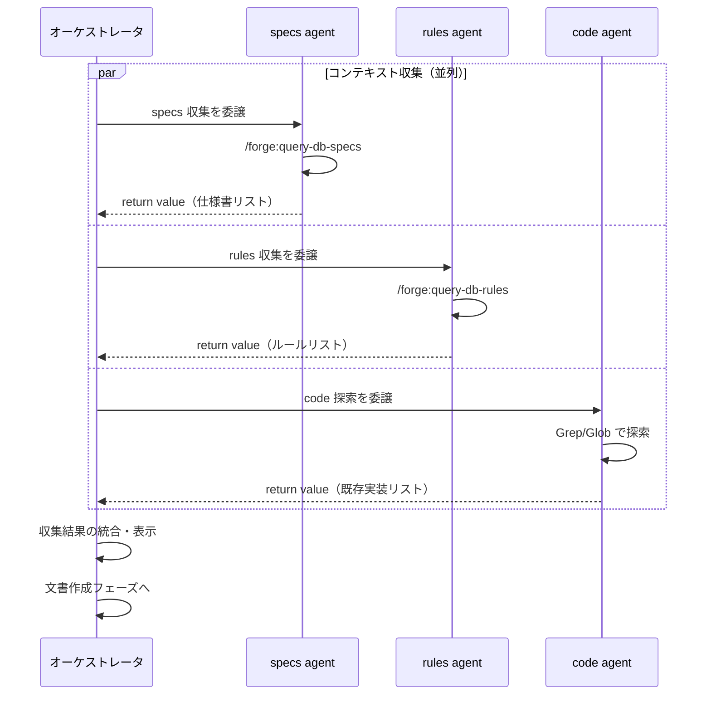
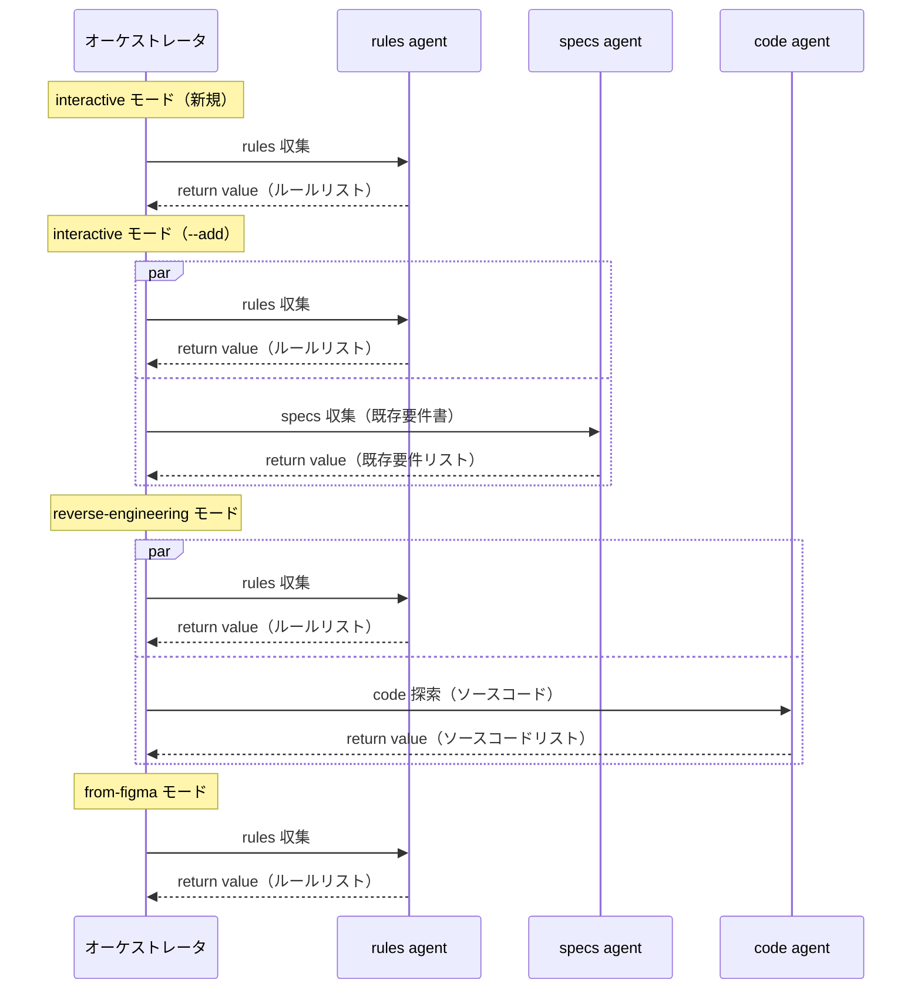

# DES-010 create-* スキル オーケストレータ化設計書

## メタデータ

| 項目     | 値                                                          |
| -------- | ----------------------------------------------------------- |
| 設計ID   | DES-010                                                     |
| 関連要件 | REQ-001 FNC-001, FNC-003, FNC-004                           |
| 関連設計 | DES-013（コンテキスト収集）, DES-022（並列 agent 出力契約） |
| 作成日   | 2026-03-13                                                  |
| 対象     | start-design, start-plan, start-requirements                |

---

## 1. 概要

start-design / start-plan / start-requirements の 3 スキルは、review スキルと同じオーケストレータパターンで構成する。共通のコンテキスト収集フレームワークを抽出し、各スキルの SKILL.md をオーケストレータとして配置する。

---

## 2. アーキテクチャ概要

### 2.1 オーケストレータ構造

```
┌──────────────────────────────────────┐
│ start-design (オーケストレータ)       │
│  ├ 事前準備（前提確認）                │
│  ├ コンテキスト収集 ──┬── specs agent │  ← 並列（return value 収集）
│  │                     ├── rules agent │
│  │                     └── code agent  │
│  ├ 収集結果の統合・表示                │
│  ├ 文書作成（メインコンテキスト）         │
│  ├ /forge:review → AIレビュー         │
│  └ 完了処理                            │
└──────────────────────────────────────┘
```

### 2.2 責務分担

| 役割                   | 実行場所                                    | 責務                                                                                        |
| ---------------------- | ------------------------------------------- | ------------------------------------------------------------------------------------------- |
| オーケストレータ       | メインコンテキスト                          | 前提確認、進行管理、ユーザー対話、判断分岐                                                  |
| コンテキスト収集 Agent | 汎用 Agent (general-purpose)                | 仕様書・ルール・既存コードの探索 → return value（markdown リスト）で返却                    |
| 文書作成               | メインコンテキスト                          | 収集結果を参照し、ユーザーと対話しながら文書を作成                                          |
| AIレビュー             | `/forge:review {type} {差分} --auto` に委譲 | レビュー+自動修正（差分のみ対象）                                                           |
| 後処理                 | メインコンテキスト                          | `/forge:update-db-specs` による ToC 更新、`/anvil:commit` による commit/push 確認、完了案内 |

> **設計判断**: 文書作成はメインコンテキストで実行する。理由: ユーザーとの対話（AskUserQuestion）が頻繁に発生し、Agent ツールで起動した隔離 context（汎用 Agent・カスタム Agent のいずれも）では対話ができないため。

---

## 3. 共通コンテキスト収集フレームワーク

### 3.1 概要

3 スキルに共通する「参考文書の収集」処理を標準化する。
review スキルの Phase 2 (Step 3~7) を汎用化し、create-* スキルでも同じパターンを使用する。

### 3.2 収集結果の受け渡し（return value 契約）

create-* スキルは**セッションディレクトリを使用しない**（セッション機構は廃止済み）。各収集 agent は結果を **return value**（markdown bullet list）で返し、オーケストレータが main AI コンテキストに直接保持する（DES-022 並列 agent 出力契約）。

return value の形式（例）:

```
## 仕様書 (N 件)
- `specs/login/requirements/login_spec.md` — ログイン機能の要件定義書
```

### 3.3 コンテキスト収集 agent の指示方式

#### インライン prompt による自己完結性の確保（FNC-003 準拠）

各 agent への指示は、SKILL.md にインラインで記述した prompt テンプレートで渡す（DES-013 §5）。テンプレートには以下を含め、agent は prompt だけで自己完結して動作する:

1. **検索目的**: Feature 名・作業種別を埋め込んだ目的文
2. **検索手段**: `/forge:query-db-specs` / `/forge:query-db-rules` の呼び出し、または `Grep` / `Glob` の探索手順
3. **出力契約**: return value の markdown 形式（見出し + bullet list、件数上限）

### 3.4 並列実行と統合



### 3.5 並列収集の失敗時の扱いと表示

各 agent は独立して動作するため、1つの agent が失敗しても他の agent には影響しない。失敗時の扱い:

- **agent がエラー終了 / タイムアウト**: 該当カテゴリの収集結果なしで後続工程に進む。オーケストレータは統合表示でその旨を報告する（例: `**specs** — 収集失敗（スキップ）`）
- **agent が空結果を返す**: 正常扱いとして後続工程に進む

全 agent 完了後、オーケストレータは各 return value を Progress Reporting 規約（5 件以下は全件表示、6 件以上は先頭 3 件 + 省略）に従ってユーザーに表示する:

```
### ✅ コンテキスト収集完了

**specs (N件)**
- `specs/login/requirements/login_spec.md` — ログイン機能の要件定義書
- `specs/login/design/login_design.md` — 既存設計書

**rules (N件)**
- `rules/design_workflow.md` — 設計書作成ワークフロー

**code (N件)**
- `src/auth/LoginService.swift` — ログイン処理の既存実装
- ... 他 N件
```

---

## 4. スキル別設計

各スキルのフェーズ構成と、コンテキスト収集 agent の適用マトリクスを定義する。

### 4.1 start-design

#### フェーズ構成

```
事前準備 [MANDATORY]
├── Step 1: .doc_structure.yaml の確認
├── Step 2: Feature 名の確定
├── Step 3: 出力先ディレクトリの解決
├── Step 4: モード判定（新規/既存）
└── Step 5: defaults 読み込み

Phase 1: コンテキスト収集 [MANDATORY]（汎用 Agent 並列・return value 収集）
├── 1.1: specs agent → 要件定義書リスト
├── 1.2: rules agent → 設計ルールリスト
├── 1.3: code agent  → 既存実装リスト
└── 1.4: 収集結果の確認・表示

Phase 2: 要件定義書の分析 [MANDATORY]
├── 収集済みの要件定義書を Read・徹底確認
├── 不明点の整理（AskUserQuestion）
└── 収集済みの既存実装を Read

Phase 3: 設計書の作成 [MANDATORY]
├── フォーマット適用
├── 設計ID体系の確認
└── 設計書の作成（ファイルごとに AskUserQuestion [MANDATORY]）

Phase 4: AIレビュー（FNC-006 準拠）
└── /forge:review design --files {差分ファイル} --auto

Phase 5: 品質保証
└── 完全性チェック

完了処理
├── /forge:update-db-specs（利用可能な場合）
├── /anvil:commit
└── 完了案内
```

#### コンテキスト収集の適用マトリクス

| agent | 必須 | 収集内容                             |
| ----- | ---- | ------------------------------------ |
| specs | ○    | 要件定義書（対象 Feature）           |
| rules | ○    | 設計書フォーマット、設計ワークフロー |
| code  | ○    | 既存実装資産（再利用候補）           |

---

### 4.2 start-plan

#### フェーズ構成

```
事前準備 [MANDATORY]
├── Step 1: .doc_structure.yaml の確認
├── Step 2: Feature 名の確定
├── Step 3: 出力先の解決・モード判定（新規/更新）
└── Step 4: defaults 読み込み

Phase 1: コンテキスト収集 [MANDATORY]（汎用 Agent 並列・return value 収集）
├── 1.1: specs agent → 要件定義書・設計書リスト
├── 1.2: rules agent → 計画書ルールリスト
└── 1.3: 収集結果の確認・表示

Phase 2: 文書の読み込み [MANDATORY]
└── 収集済みの要件定義書・設計書を Read

Phase 3: 実装戦略の策定 [MANDATORY]

Phase 4: 計画書の作成・更新 [MANDATORY]
├── 更新モード: 既存作業の確認
├── 設計書からタスクを抽出 [MANDATORY]
├── 計画書の作成・更新
└── 完全性チェック [MANDATORY]

Phase 5: AIレビュー [MANDATORY]（FNC-006 準拠: --auto モード）
└── /forge:review plan --files {差分ファイル} --auto

完了処理
├── /forge:update-db-specs（利用可能な場合）
├── /anvil:commit
└── 完了案内
```

#### コンテキスト収集の適用マトリクス

| agent | 必須                                  | 収集内容                            |
| ----- | ------------------------------------- | ----------------------------------- |
| specs | ○                                     | 要件定義書 + 設計書（対象 Feature） |
| rules | △（/forge:query-db-rules 利用可能時） | 計画書フォーマット（あれば）        |
| code  | ✕                                     | 不要（計画書は実装を参照しない）    |

---

### 4.3 start-requirements

#### フェーズ構成

```
前提確認フェーズ [MANDATORY]
├── Step 1: .doc_structure.yaml の確認
├── Step 2: 出力先ディレクトリの解決
└── Step 3: defaults 読み込み

モード選択（AskUserQuestion）

Phase 0: 事前確認（全モード共通）
├── 0.1: 新規/追加の確認
└── 0.2: Feature 名の確定

コンテキスト収集フェーズ（汎用 Agent、モード依存・return value 収集）
├── rules agent → ルールリスト             （全モード）
├── specs agent → 既存要件リスト           （--add 時のみ）
└── code agent  → ソースコードリスト       （reverse-engineering 時のみ）

収集結果の統合・表示

Mode: interactive
├── Phase 1: ビジョン・価値の明確化
├── Phase 2: 体験フロー・画面構成
├── Phase 3: 詳細仕様（グロッサリー [MANDATORY]）
└── Phase 4: 統合・品質確認

Mode: reverse-engineering
├── Phase 1: 収集済みの既存コードリストを起点にソースコード解析
├── Phase 2: 要件抽出 [MANDATORY]
├── Phase 3: 要件定義書作成
└── Phase 4: 品質確認

Mode: from-figma
├── Phase 1: Figmaアクセス確認
├── Phase 2: デザインシステム構築
├── Phase 3: 要件定義書作成
├── Phase 4: 静的アセット管理
└── Phase 5: 品質確認

Phase: AIレビュー（FNC-006 準拠）
└── /forge:review requirement --files {差分ファイル} --auto

完了処理
├── /forge:update-db-specs（利用可能な場合）
├── /anvil:commit
└── 完了案内
```

#### コンテキスト収集の適用マトリクス

| agent | 必須                         | 収集内容                             |
| ----- | ---------------------------- | ------------------------------------ |
| rules | ○                            | 要件書フォーマット、ワークフロー指示 |
| specs | `--add` 時のみ               | 既存の要件定義書（追加作成の参考）   |
| code  | `reverse-engineering` 時のみ | ソースコード探索（要件抽出の起点）   |

> **設計判断**: start-requirements の interactive モードではコンテキスト収集は最小限（rules のみ）。
> 要件定義は「何を実現するか」を定義する工程であり、既存実装への過度な依存は避ける（REQ-001 オーケストレータパターン要件の設計原則「What に集中」に準拠）。

#### モード別コンテキスト収集シーケンス



---

## 5. 使用する既存コンポーネント

| コンポーネント                         | ファイルパス                                                  | 用途                                   |
| -------------------------------------- | ------------------------------------------------------------- | -------------------------------------- |
| コンテキスト収集タスク仕様             | `docs/specs/forge/design/DES-013_context_gathering_design.md` | タスク一覧・スキル別適用マトリクス     |
| query-db-specs / query-db-rules スキル | `plugins/forge/skills/query-db-{specs,rules}/SKILL.md`        | 収集 agent 内からの文書検索の委譲先    |
| Progress Reporting 規約                | review/SKILL.md 内                                            | 5件以下全件表示、6件以上は先頭3件+省略 |

---

## 6. セッション不使用の設計判断

create-* スキルは**セッションディレクトリを使用しない**。理由:

- フェーズ間の中間成果物を複数 worker で共有する必要がない（収集結果は return value で main AI コンテキストに保持し、成果物は出力先ディレクトリへ直接書き出す）
- 直線的ワークフローであり、中断時は最初からやり直す方が効率的（再開すべき中間状態を持たない）

セッション機構は廃止済みであり、いずれのスキルも使用しない。
