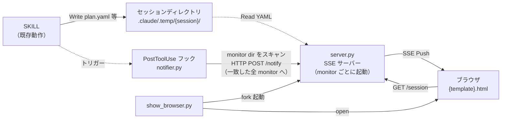
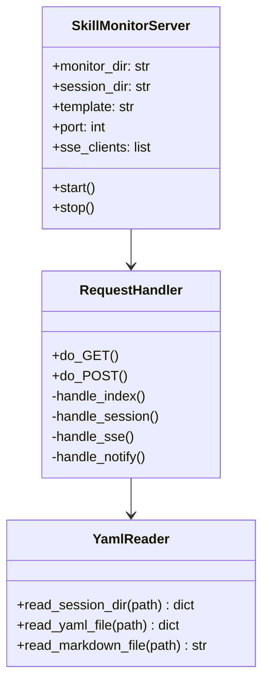
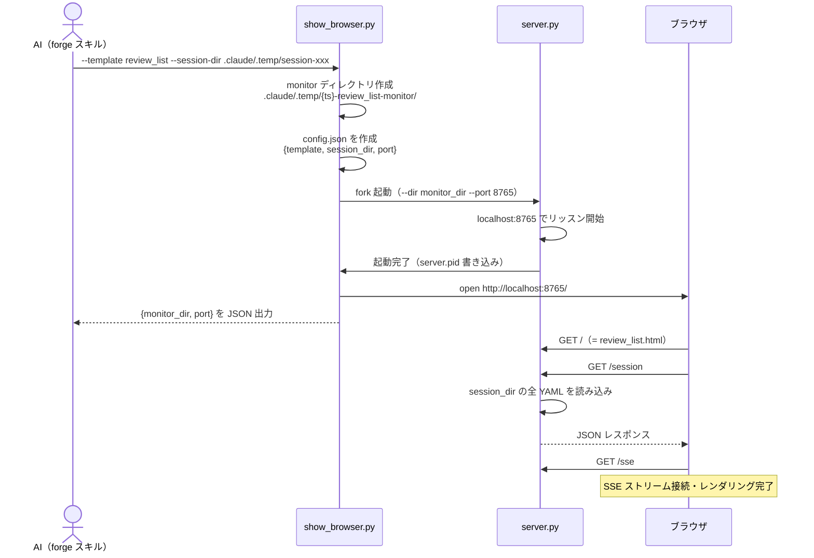
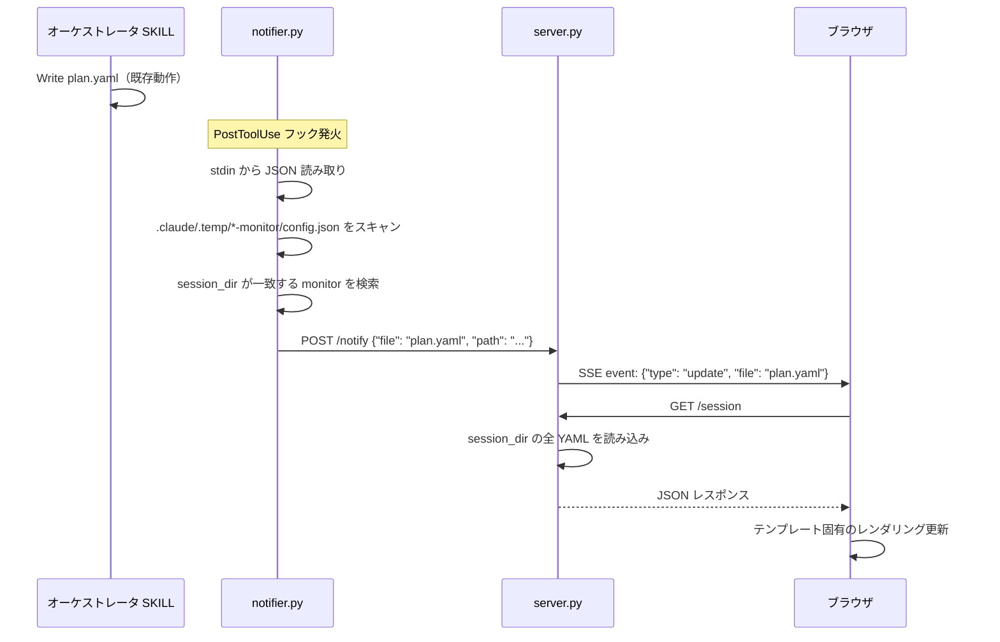
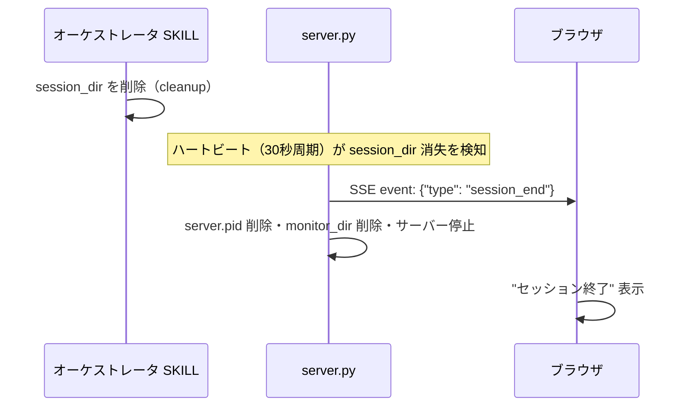

# DES-012 show-browser 設計書

## メタデータ

| 項目 | 値 |
|------|-----|
| 設計ID | DES-012 |
| 関連要件 | FNC-001〜FNC-007, NFR-001〜NFR-004（skill_monitor_requirement.md） |
| 作成日 | 2026-03-15 |
| 更新日 | 2026-04-15 |
| バージョン | 2.1 |

## 1. 概要

`forge:show-browser` スキルは、セッション進捗やレビュー結果をブラウザでリアルタイム表示する。
PostToolUse フックが YAML 更新を検知し、SSE（Server-Sent Events）でブラウザに Push する。
テンプレートを切り替えることで複数の表示形式に対応し、複数の monitor を同時に起動できる。

### 設計判断

| 判断 | 採用 | 却下 | 理由 |
|------|------|------|------|
| 通知方式 | PostToolUse フック + SSE Push | mtime ポーリング | CPU 消費なし・即時通知 |
| ブラウザ更新 | SSE（Push） | JS ポーリング（Pull） | 標準ライブラリのみ・片方向で十分・効率的 |
| SSE サーバー | Python http.server | Node.js / Flask | NFR-001（標準ライブラリ） |
| データ変換 | YAML 直接読み取り | display.json 中間ファイル | セッションファイルのスキーマが既知 |
| テンプレート | HTML ファイルを切り替え | 固定 index.html | 表示形式を拡張可能にするため |
| 複数 monitor | `.claude/.temp/{ts}-{template}-monitor/` | 固定ポート1本 | 異なるセッション・テンプレートを並行表示可能にするため |
| フック通知先 | config.json をスキャンして全 monitor に通知 | 固定ポート 8765 | 複数 monitor 対応のため |
| エントリーポイント命名 | `show_browser.py`（スキル名と対応） | `launcher.py` / `presenter.py` | 責務が複数あり一語で表現困難。スキル名との対応が最も正直 |

---

## 2. アーキテクチャ概要



### ディレクトリ構造

```
plugins/forge/skills/show-browser/
├── SKILL.md
├── scripts/
│   ├── show_browser.py      # エントリーポイント（monitor 作成・server 起動・ブラウザ起動）
│   └── server.py            # SSE サーバー本体（monitor ごとに 1 プロセス）
└── templates/
    ├── review_list.html     # レビュー指摘一覧（plan.yaml を表示）
    └── （将来: activity_log.html, doc_list.html, ...）

.claude/hooks/
└── notifier.py              # PostToolUse フック（複数 monitor 対応）

.claude/.temp/{YYYYMMDD-HHmmss}-{template}-monitor/   # monitor ごとに自動生成
├── config.json              # {template, session_dir, port}
└── server.pid               # 起動中 server.py の PID
```

### 責務の分離

| コンポーネント | 責務 | コンテキスト影響 |
|---------------|------|----------------|
| SKILL | セッションファイルの更新（既存動作） | なし（追加コードゼロ） |
| `show_browser.py` | monitor ディレクトリ作成・server.py 起動・ブラウザ起動 | なし（エントリーポイント） |
| `notifier.py` | Write 検知 → 一致する全 monitor に POST を送る | なし（フックスクリプト） |
| `server.py` | YAML 読み込み → SSE Push・テンプレート配信 | なし（独立プロセス） |
| `{template}.html` | SSE 受信・テンプレート固有のレンダリング | なし（ブラウザ） |

---

## 3. モジュール設計

### 3.1 モジュール一覧

| モジュール | ファイル | 責務 | 依存 |
|-----------|---------|------|------|
| エントリーポイント | `skills/show-browser/scripts/show_browser.py` | monitor ディレクトリ作成・空きポート検出・server.py fork 起動・open | Python 標準ライブラリ |
| SSE サーバー | `skills/show-browser/scripts/server.py` | HTTP サーバー + SSE + YAML→JSON + テンプレート配信 | Python 標準ライブラリ（http.server, json, threading） |
| フック通知 | `.claude/hooks/notifier.py` | PostToolUse 検知 → 全 monitor に HTTP POST を送る | Python 標準ライブラリ（json, urllib.request） |
| テンプレート | `skills/show-browser/templates/review_list.html` | SSE 受信 + review_list 専用レンダリング | なし（VanillaJS） |
| フック設定 | `.claude/settings.json` | PostToolUse フック登録 | Claude Code |

### 3.2 server.py 内部構造



---

## 4. ユースケース設計

### 4.1 ユースケース一覧

| ユースケース | 説明 |
|-------------|------|
| UC-001 | show-browser 起動（monitor 作成・サーバー起動・ブラウザオープン） |
| UC-002 | SKILL がファイル更新 → ブラウザにリアルタイム反映 |
| UC-003 | ブラウザ再接続（SSE 切断後の復帰） |
| UC-004 | セッション終了時のクリーンアップ・サーバー自動停止 |
| UC-005 | 複数 monitor の同時起動 |

**UC-003 再接続方式**: ブラウザ側は `EventSource` の自動再接続機能を利用する。`onopen` イベントで `/session` を再取得し、最新状態でレンダリングを復元する。

### 4.2 UC-001: show-browser 起動



### 4.3 UC-002: リアルタイム更新



### 4.4 UC-004: セッション終了・自動停止



### 4.5 UC-005: 複数 monitor の同時起動

```
.claude/.temp/
├── 20260414-153022-review_list-monitor/
│   ├── config.json  {template: "review_list", session_dir: "...", port: 8765}
│   └── server.pid
└── 20260414-160000-review_list-monitor/
    ├── config.json  {template: "review_list", session_dir: "...", port: 8766}
    └── server.pid
```

- `show_browser.py` は 8765 から順に空きポートを探して使用する
- `notifier.py` は全 monitor の config.json をスキャンし、session_dir が一致するものに通知する
- 各 monitor は独立したプロセス・ポートで動作する

---

## 5. 詳細設計

### 5.1 show_browser.py の CLI

```bash
python3 show_browser.py \
  --template review_list \           # テンプレート名（templates/ 配下）
  --session-dir <path>               # 監視対象セッションディレクトリ
  [--port 8765]                      # ポート（省略時は 8765 から自動検出）
  [--no-open]                        # ブラウザを開かない
```

標準出力（JSON）:

```json
{"monitor_dir": ".claude/.temp/20260414-153022-review_list-monitor", "port": 8765}
```

### 5.2 server.py の CLI

```bash
python3 server.py \
  --dir <monitor-dir> \              # monitor ディレクトリ（config.json を読む）
  --port <port>
```

**エラーハンドリング**: ポートバインド失敗時は stderr に JSON を出力して exit 1。

```json
{"error": "port_bind_failed", "port": 8765, "message": "Address already in use"}
```

### 5.3 API エンドポイント

| メソッド | パス | 説明 | レスポンス |
|---------|------|------|----------|
| GET | `/` | `templates/{config.template}.html` を返す | text/html |
| GET | `/session` | session_dir の全 YAML を JSON で返す | application/json |
| GET | `/sse` | SSE ストリーム | text/event-stream |
| POST | `/notify` | notifier.py からの更新通知を受け付け SSE Push | 200 OK |

**CORS**: `/` から HTML を配信するため、ブラウザからのアクセスは同一オリジン（`http://localhost:{port}`）。CORS ヘッダー不要。

**セキュリティ**: `127.0.0.1` のみでリッスン。ローカル開発専用のため認証不要。

**入力バリデーション**:

- `GET /` のテンプレート名は `os.path.basename(template) == template` で検証し、パス区切り文字を含む値は拒否する（パストラバーサル防御）
- `POST /notify` の `Content-Length` は上限 `MAX_CONTENT_LENGTH = 65536` バイトで制限し、超過時は `413 Request Entity Too Large` を返す（DoS 防御）
- `main()` は `json.JSONDecodeError` / `OSError` を個別に捕捉し、`config.json` 破損時にスタックトレースを露出せず終了する

### 5.4 `/session` レスポンス形式

```json
{
  "session_dir": ".claude/.temp/review-abc123",
  "files": {
    "session.yaml": {"exists": true, "content": {"skill": "review", "status": "in_progress"}},
    "plan.yaml":    {"exists": true, "content": {"items": [...]}},
    "review.md":    {"exists": true, "content": "## AIレビュー結果\n..."}
  },
  "refs_yaml": {"exists": true, "content": {...}},
  "refs": {"exists": true, "files": {"rules.yaml": {...}, "code.yaml": {...}}}
}
```

**参照情報の優先度**: `refs.yaml`（フラット）と `refs/`（ディレクトリ）が両方存在する場合は両方を返す。両方を `refs_yaml` / `refs` の別フィールドとして返すことで、テンプレート側が状況に応じて参照できる。

**注**: `evaluation.yaml` は以前の設計で独立していたが、現行実装では `plan.yaml` の各 item に `recommendation` / `reason` フィールドとして統合されているため、`/session` のレスポンスには含まれない（session_format.md 参照）。

### 5.5 SSE イベント形式

```
event: update
data: {"type": "update", "file": "plan.yaml", "timestamp": "2026-04-14T15:30:00Z"}

event: session_end
data: {"type": "session_end", "timestamp": "2026-04-14T16:00:00Z"}
```

### 5.6 テンプレート（review_list.html）

SSE 受信時の処理フロー:

1. `EventSource('/sse')` で SSE 接続
2. `update` イベント受信 → `GET /session` でデータ取得
3. `/session` レスポンスの `files.plan.yaml.content.items` を読んで再描画
4. `session_end` イベント受信 → "セッション終了" を表示

表示仕様:

| 要素 | 仕様 |
|------|------|
| severity 配色 | 🔴 critical: `#ff4d4d` / 🟡 major: `#ffab00` / 🟢 minor: `#52c41a` / ❌ skipped: `#666` |
| フィルタータブ | All / 🔴 / 🟡 / 🟢 / ❌ |
| AI 推奨バッジ | fix（修正） / skip（却下） / review（要確認） |
| AF マーク | auto_fixable: true の場合 ✅ 表示 |
| テーマ | ダーク（開発者ツール的審美性） |
| フォント | モノスペース × サンセリフ |
| 依存 | Google Fonts のみ。JS ライブラリなし |

### 5.7 notifier.py（PostToolUse フック）

```python
#!/usr/bin/env python3
"""
.claude/hooks/notifier.py
PostToolUse フックから呼び出される。
Write/Edit を検知し、session_dir が一致する全 monitor に HTTP POST を送る。
"""
import sys
import json
import os
from urllib.request import Request, urlopen
from urllib.error import URLError
import glob

def main():
    input_data = json.loads(sys.stdin.read())
    if input_data.get("tool_name") not in ("Write", "Edit"):
        return

    file_path = input_data.get("tool_input", {}).get("file_path", "")
    basename = os.path.basename(file_path)
    abs_path = os.path.abspath(file_path)

    # アクティブな monitor を全スキャン
    project_root = os.environ.get("CLAUDE_PROJECT_DIR", ".")
    monitor_dirs = glob.glob(os.path.join(project_root, ".claude/.temp/*-monitor"))

    for monitor_dir in monitor_dirs:
        config_path = os.path.join(monitor_dir, "config.json")
        pid_path = os.path.join(monitor_dir, "server.pid")
        if not os.path.exists(config_path) or not os.path.exists(pid_path):
            continue

        with open(config_path) as f:
            config = json.load(f)

        # session_dir 配下のファイル更新のみ通知
        session_dir_raw = config.get("session_dir", "")
        if not session_dir_raw:
            continue  # 空文字は CWD を指してしまうため弾く
        session_dir = os.path.abspath(session_dir_raw)
        # ディレクトリ境界を区切り文字で判定（startswith プレフィックス誤マッチ防止）
        if abs_path != session_dir and not abs_path.startswith(session_dir + os.sep):
            continue

        port = config.get("port", 8765)
        payload = json.dumps({"file": basename, "path": file_path}).encode()
        req = Request(
            f"http://localhost:{port}/notify",
            data=payload,
            headers={"Content-Type": "application/json"},
            method="POST",
        )
        try:
            urlopen(req, timeout=2)
        except (URLError, OSError):
            pass  # サーバー未起動時は無視

if __name__ == "__main__":
    main()
```

### 5.8 フック設定（.claude/settings.json への追記）

```json
"PostToolUse": [
  {
    "matcher": "Write|Edit",
    "hooks": [
      {
        "type": "command",
        "command": "python3 $CLAUDE_PROJECT_DIR/.claude/hooks/notifier.py"
      }
    ]
  }
]
```

### 5.9 サーバーライフサイクル

| タイミング | 操作 | 実行者 |
|------------|------|--------|
| `forge:show-browser` 起動時 | `show_browser.py` が `server.py` を fork 起動 | show_browser.py |
| `forge:show-browser` 起動時 | 孤立 monitor ディレクトリの掃除（後述） | show_browser.py |
| SKILL がファイル更新時 | フック → POST /notify → SSE Push | notifier.py + server.py |
| session_dir 消失時 | ハートビート（30秒周期）で検知 → SSE session_end → 自動停止 | server.py |
| /notify 受信時 | session_dir 存在チェック → 消失なら即 session_end + 停止 | server.py |
| サーバー停止時 | `server.pid` と `monitor_dir` を削除 | server.py |

### 5.10 monitor ディレクトリのクリーンアップ

**通常ケース（正常停止）:**

`server.py` が `session_end` を送信した後、自身で `server.pid` および `monitor_dir` を削除してから停止する。

**異常ケース（クラッシュ・強制終了）:**

サーバーがクラッシュした場合、`monitor_dir` が残存する（孤立ディレクトリ）。
`show_browser.py` は起動時に以下の掃除を実行する:

```
孤立判定ルール:
  .claude/.temp/*-monitor/ が存在するが
  └─ server.pid が存在しない       → 孤立（pid ファイルごとサーバーが消えた）
  └─ server.pid の PID が生きていない → 孤立（クラッシュ）
```

```python
# show_browser.py の起動前処理（擬似コード）
for monitor_dir in glob(".claude/.temp/*-monitor/"):
    pid_file = monitor_dir / "server.pid"
    if not pid_file.exists():
        shutil.rmtree(monitor_dir)  # 孤立: pid なし
        continue
    pid = int(pid_file.read_text())
    if not is_process_alive(pid):
        shutil.rmtree(monitor_dir)  # 孤立: プロセス死亡
```

**削除タイミングまとめ:**

| ケース | 削除タイミング | 削除者 |
|--------|--------------|--------|
| 正常停止（session_dir 消失） | session_end 送信直後 | server.py |
| 異常停止（クラッシュ等） | 次回 show_browser.py 起動時 | show_browser.py |

---

## 6. 使用する既存コンポーネント

| コンポーネント | ファイルパス | 用途 |
|---------------|-------------|------|
| YAML パーサー | `plugins/forge/scripts/session_manager.py` の `read_yaml()` | session.yaml 等のフラット YAML 読み込み |
| セッション管理 | `plugins/forge/scripts/session_manager.py` | session_dir の作成・管理パターンを参考 |
| CLI パターン | `plugins/forge/scripts/session_manager.py` | argparse + JSON stdout の規約 |

---

## 7. SKILL.md インターフェース

```
/forge:show-browser --template review_list --session-dir <path>
```

### 他スキルからの呼び出し（例: present-findings）

```bash
python3 ${CLAUDE_PLUGIN_ROOT}/skills/show-browser/scripts/show_browser.py \
  --template review_list \
  --session-dir {session_dir}
# 出力: {"monitor_dir": "...", "port": 8765}
# → http://localhost:8765 がブラウザで開く
# → plan.yaml が更新されるたびに SSE 経由でブラウザが自動更新
```

---

## 8. テスト設計

### 単体テスト

| 対象 | テスト内容 |
|------|----------|
| `YamlReader.read_yaml_file()` | session.yaml / plan.yaml の読み込み・JSON 変換 |
| `YamlReader.read_session_dir()` | 存在するファイルのみ読み込み、存在しないは `exists: false` |
| `RequestHandler.handle_notify()` | POST /notify で SSE クライアントに Push される |
| `RequestHandler.handle_session()` | GET /session の JSON レスポンス形式 |
| `notifier.py` | 複数 monitor のうち session_dir が一致するもののみ通知 |

### 統合テスト

| 対象 | テスト内容 |
|------|----------|
| 起動→ブラウザ接続→更新通知→SSE 受信 | エンドツーエンドのデータフロー |
| 複数 monitor 同時起動 | 独立したポート・ディレクトリで動作すること |
| session_dir 消失 → 自動停止 | ライフサイクル管理 |

---

## 9. 将来のテンプレート追加

| テンプレート名 | 用途 | session_dir の参照先 |
|--------------|------|---------------------|
| `review_list` | レビュー指摘一覧 | `plan.yaml` の items |
| `activity_log` | エージェント活動ログ | `activity.yaml`（将来） |
| `doc_list` | 文書検索結果 | `refs.yaml` |

テンプレート HTML を `templates/` に追加するだけで対応範囲が広がる。`server.py` 本体の変更は不要。

---

## 改定履歴

| 日付 | バージョン | 内容 |
|------|----------|------|
| 2026-03-15 | 1.0 | 初版作成 |
| 2026-03-15 | 1.1 | レビュー指摘対応（id:1,4,5,6,7,8,9,10,12,13）: SSE 起動を session_manager.py に移管、ハートビート機構追加、YAML パターン明示、エラーハンドリング追加、refs 優先度定義、history スキーマ追加、CORS/セキュリティ注記、フックスクリプト Python 化、UC-003 再接続方式明記 |
| 2026-04-14 | 2.0 | スキル名 `forge:show-browser` を追加。複数 monitor 対応（`.claude/.temp/{ts}-{template}-monitor/`）。テンプレート切り替え機構（`review_list.html` 等）。`show_browser.py`（エントリーポイント）・`server.py`（SSE サーバー）・`notifier.py`（フック）にリネーム。session_manager.py 依存を削除し独立起動に変更。monitor ディレクトリのクリーンアップ設計を追加。 |
