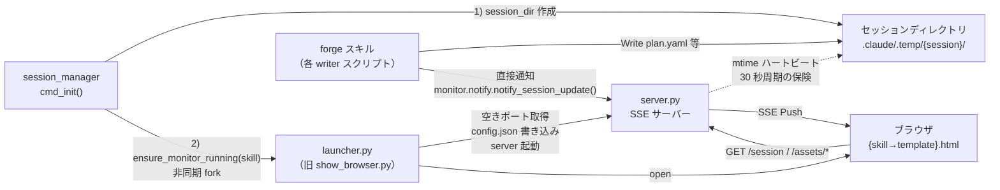
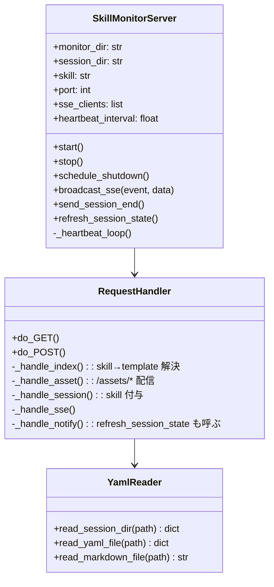
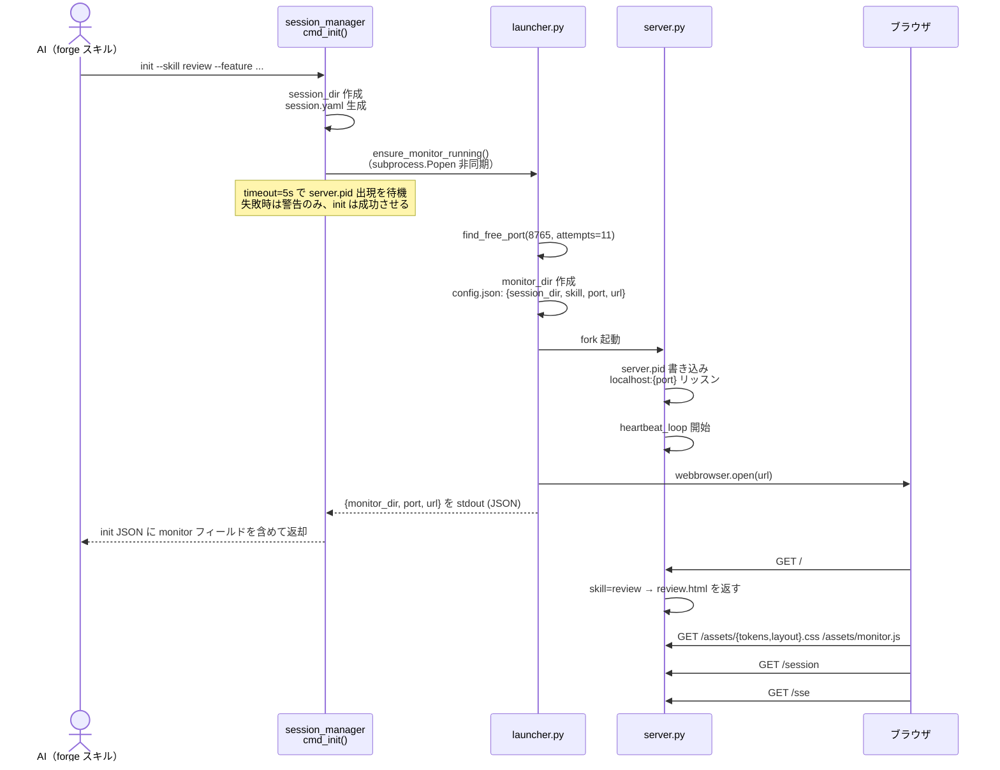
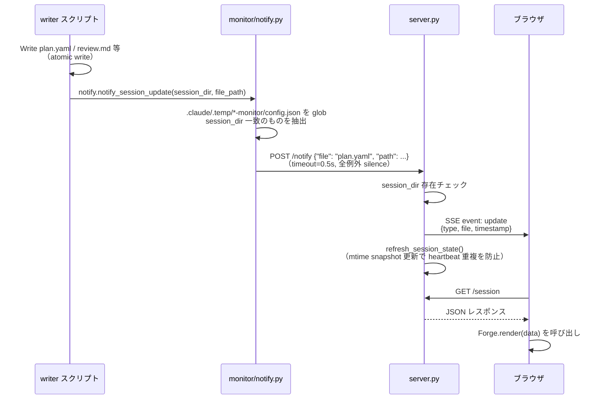
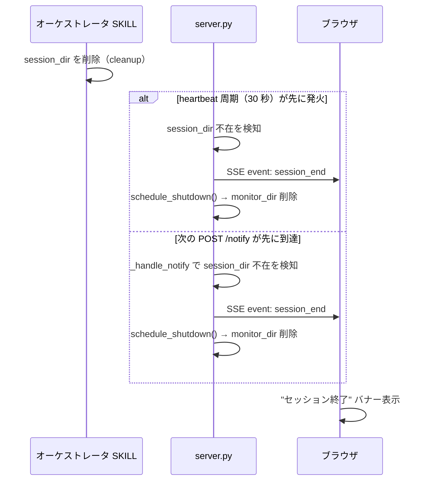
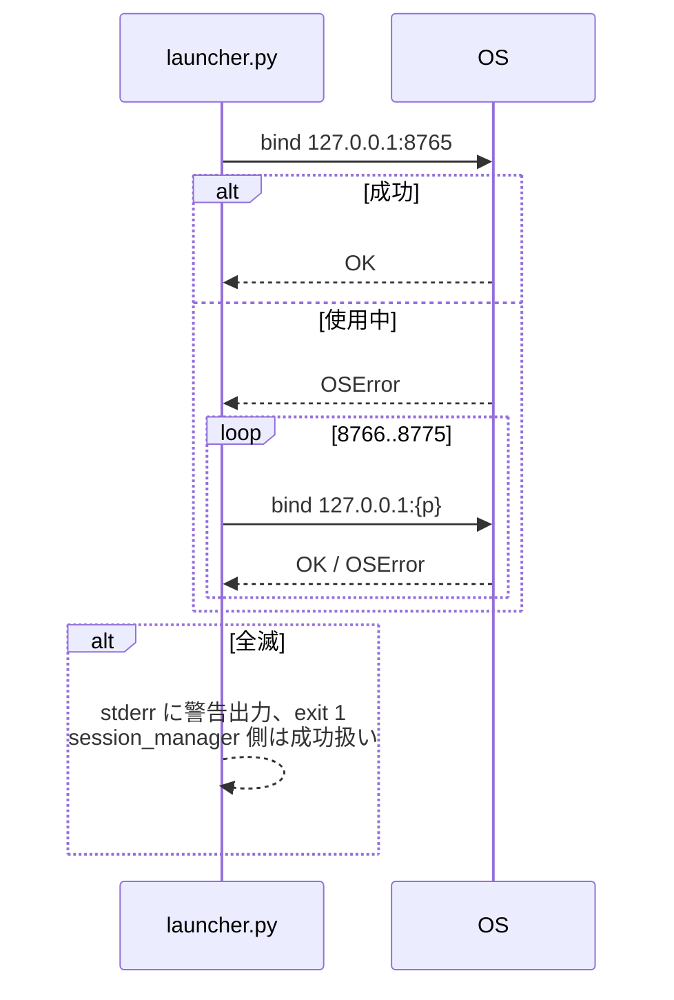
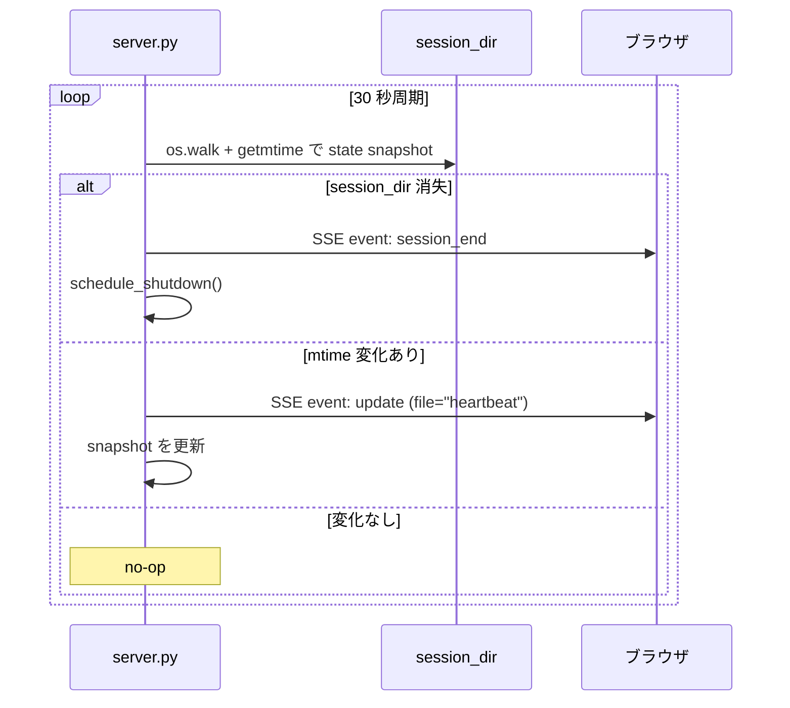

# DES-012 show-browser 設計書

> **注**: 文書名は慣習として維持するが、v3.0 時点で本モジュールは SKILL ではなく
> `plugins/forge/scripts/monitor/` 配下の **内部モジュール（monitor module）** として
> 実装される。本文中では「モニターモジュール」と呼称する。

## メタデータ

| 項目       | 値                                         |
| ---------- | ------------------------------------------ |
| 設計ID     | DES-012                                    |
| 関連要件   | REQ-002 FNC-001〜FNC-007, NFR-001〜NFR-004 |
| 作成日     | 2026-03-15                                 |
| 更新日     | 2026-04-20                                 |
| バージョン | 3.0                                        |

## 1. 概要

forge プラグインは各スキル（review / start-requirements / start-design / start-plan /
start-implement / start-uxui-design）の実行中に、ブラウザでリアルタイム進捗を表示する。

v3.0 では以下を実施した。

- **SKILL 廃止**: ユーザーが `/forge:show-browser` を手動呼び出しした実績がなく、AI も
  内部的に `show_browser.py` を起動しているだけで SKILL ラッパーの価値がない。SKILL を
  廃止し、実装を `plugins/forge/scripts/monitor/` に **内部モジュール化** する。
- **自動起動**: `session_manager.cmd_init()` が各スキルのセッション作成時にモニターを
  非同期 fork する。AI は一切関与しない。
- **通知経路の二系統化**: PostToolUse フック（Write/Edit のみ捕捉し取りこぼしが多い）を
  廃止し、**スクリプト直接通知（メイン）+ mtime ハートビート（保険）** の二系統に統合。
- **テンプレート自動選択**: `config.json` の `skill` フィールドから対応 HTML を選択
  （`review` → `review.html`、`start-requirements/design/plan` → `document.html`、
  `start-implement` → `implement.html`、`start-uxui-design` → `uxui.html`）。
  skill 不明時は `generic.html` にフォールバック。
- **UI 刷新**: 3 層デザイントークン（primitive → semantic → component）による `tokens.css` /
  共通レイアウト `layout.css` / 共通 SSE クライアント `monitor.js` を分離し、テンプレート
  HTML は差分レンダリングのみを担う。

### 設計判断（v3.0 反映）

| 判断                    | 採用                                     | 却下                          | 理由                                                         |
| ----------------------- | ---------------------------------------- | ----------------------------- | ------------------------------------------------------------ |
| モジュール形態          | forge 内部モジュール（scripts/monitor/） | SKILL（skills/show-browser/） | ユーザーが手動呼び出ししない。SKILL ラッパーが無価値         |
| 起動者                  | session_manager.cmd_init() が fork       | AI が SKILL.md 指示で呼び出し | AI の忘却・コンテキスト消費を排除                            |
| 通知方式                | スクリプト直接通知 + mtime ハートビート  | PostToolUse フック            | Bash 経由の Python 書き込みは Write/Edit フックで拾えない    |
| テンプレート選択        | `config.json.skill` から自動解決         | `--template` 明示指定         | AI が template 名を知る必要をなくす                          |
| 単一ポート / 複数ポート | 8765 優先 + 8766〜8775 フォールバック    | 単一固定                      | 複数スキル並行実行を許容しつつ URL の連続性を維持            |
| CSS 構成                | tokens.css / layout.css を 3 層で分離    | HTML 内 style 埋め込み        | UI スキル（ui-ux-pro-max / ckm:design-system）の成果物を活用 |
| 履歴保持                | なし（前セッションは消える）             | archive 機能                  | スコープ外（次フェーズ）                                     |

---

## 2. アーキテクチャ概要



### ディレクトリ構造

```
plugins/forge/scripts/monitor/           ← 新規（旧 skills/show-browser/ の実装を内部化）
├── launcher.py                          # 旧 show_browser.py（--skill を追加）
├── server.py                            # 旧 server.py（skill→template 自動選択 + mtime heartbeat）
├── notify.py                            # 新規（notify_session_update を提供）
└── templates/
    ├── generic.html                     # 新規 フォールバック
    ├── review.html                      # 新規 review（旧 review_list.html 刷新）
    ├── document.html                    # 新規 start-requirements/design/plan
    ├── implement.html                   # 新規 start-implement
    ├── uxui.html                        # 新規 start-uxui-design
    └── assets/
        ├── tokens.css                   # 3 層デザイントークン
        ├── layout.css                   # 共通レイアウト
        └── monitor.js                   # 共通 SSE クライアント

plugins/forge/scripts/session_manager.py ← ensure_monitor_running() 追加
plugins/forge/scripts/session/update_plan.py           ← 書き込み後に notify 追加
plugins/forge/scripts/session/write_interpretation.py  ← 同上
plugins/forge/scripts/session/write_refs.py            ← 同上
plugins/forge/skills/reviewer/scripts/extract_review_findings.py ← 3 箇所に notify 追加

.claude/.temp/{YYYYMMDD-HHmmss}-{skill}-monitor/  ← session ごとに自動生成
├── config.json                          # {session_dir, skill, port, url}
└── server.pid                           # 起動中 server.py の PID
```

**廃止されたもの**:

- `plugins/forge/skills/show-browser/` ディレクトリ全体（SKILL.md, scripts/, templates/）
- `.claude/hooks/notifier.py`（PostToolUse フック）
- `.claude/settings.json` の `PostToolUse` 登録

### 責務の分離

| コンポーネント             | 責務                                                                       | コンテキスト影響 |
| -------------------------- | -------------------------------------------------------------------------- | ---------------- |
| `session_manager.cmd_init` | session_dir 作成後に `ensure_monitor_running()` 呼び出し（非ブロッキング） | なし             |
| `monitor/launcher.py`      | monitor_dir 作成・ポート確保・孤立 dir 掃除・server fork・ブラウザ open    | なし             |
| `monitor/server.py`        | HTTP + SSE + YAML→JSON + skill→template 解決 + mtime heartbeat             | なし             |
| `monitor/notify.py`        | 各 writer スクリプトから呼び出され、session_dir 一致の全 monitor に POST   | なし             |
| 各 writer スクリプト       | 既存書き込み処理の末尾で `notify_session_update()` を 1 行呼ぶ             | なし             |
| テンプレート HTML          | render 関数のみ定義し tokens.css / layout.css / monitor.js を利用          | なし             |

---

## 3. モジュール設計

### 3.1 モジュール一覧

| モジュール         | ファイル                                                            | 責務                                                |
| ------------------ | ------------------------------------------------------------------- | --------------------------------------------------- |
| エントリーポイント | `scripts/monitor/launcher.py`                                       | monitor_dir 作成・空きポート検出・server fork・open |
| SSE サーバー       | `scripts/monitor/server.py`                                         | HTTP + SSE + YAML→JSON + テンプレ解決 + heartbeat   |
| 通知ライブラリ     | `scripts/monitor/notify.py`                                         | writer スクリプトから呼ぶ通知関数                   |
| 自動起動統合       | `scripts/session_manager.py`                                        | `ensure_monitor_running()` で fork                  |
| テンプレート       | `scripts/monitor/templates/*.html`                                  | skill 別レンダリング（共通アセットに依存）          |
| 共通アセット       | `scripts/monitor/templates/assets/{tokens,layout,monitor}.{css,js}` | デザイントークン・レイアウト・SSE クライアント      |

### 3.2 server.py 内部構造



---

## 4. ユースケース設計

### 4.1 ユースケース一覧

| ユースケース | 説明                                                                   |
| ------------ | ---------------------------------------------------------------------- |
| UC-001       | モニター起動（session_manager 自動起動）                               |
| UC-002       | writer スクリプトの書き込み → ブラウザに直接通知経路でリアルタイム反映 |
| UC-003       | ブラウザ再接続（EventSource 自動再接続 + /session 再取得）             |
| UC-004       | セッション終了時の自動停止（session_dir 消失を heartbeat で検知）      |
| UC-005       | 複数 monitor の同時起動（別スキル並行実行）                            |
| UC-006       | ポート競合時の自動フォールバック（8765 → 8766〜8775）                  |
| UC-007       | mtime ハートビートによる保険通知（直接通知が届かなかった場合）         |

### 4.2 UC-001: session_manager による自動起動



### 4.3 UC-002: リアルタイム更新（直接通知経路）



### 4.4 UC-004: セッション終了・自動停止



### 4.5 UC-005: 複数 monitor の同時起動

```
.claude/.temp/
├── 20260420-153022-review-monitor/
│   ├── config.json  {session_dir: ".../review-xxx", skill: "review", port: 8765}
│   └── server.pid
└── 20260420-160000-start-plan-monitor/
    ├── config.json  {session_dir: ".../plan-yyy", skill: "start-plan", port: 8766}
    └── server.pid
```

- `launcher.py` は 8765 を優先取得、既に使用中なら 8766〜8775 にフォールバック
  （`attempts=11`）
- 既存タブ再利用: `webbrowser.open("http://localhost:8765/")` は同一 URL なら
  既存タブを上書き更新するブラウザ挙動を活用し、連続したセッション体験を提供
- `notify.py` は全 monitor の `config.json` をスキャンし、`session_dir` が一致する
  monitor にのみ通知する

### 4.6 UC-006: ポート競合フォールバック



### 4.7 UC-007: mtime ハートビートによる保険通知



**重複通知の防止**: `POST /notify` 成功時に `refresh_session_state()` を呼ぶため、
直接通知が届けば同一変更で heartbeat から重複通知は発生しない。

---

## 5. 詳細設計

### 5.1 launcher.py の CLI

```bash
python3 launcher.py \
  --session-dir <path>            # 必須: 監視対象セッションディレクトリ
  --skill <name>                  # 必須: review / start-requirements / ... / start-uxui-design
  [--port 8765]                   # 省略時は 8765 から順に空きポートを検出
  [--no-open]                     # ブラウザを開かない
```

標準出力（JSON）:

```json
{
  "monitor_dir": ".claude/.temp/20260420-153022-review-monitor",
  "port": 8765,
  "url": "http://localhost:8765/"
}
```

環境変数:

- `FORGE_MONITOR_NO_OPEN=1` — `--no-open` と同等（CI/SSH リモート対応）
- `CLAUDE_PROJECT_DIR` — project root を上書き（テスト・代替インストール用）

### 5.2 server.py の CLI

```bash
python3 server.py --dir <monitor-dir> --port <port>
```

**起動時処理**:

1. `config.json` から `session_dir` / `skill` を読む（後方互換: `template` キーも受け付ける）
2. `server.pid` を書き込む
3. heartbeat スレッドを daemon 起動
4. `serve_forever()`

**エラー終了コード**: `port_bind_failed` / `config_not_found` / `config_invalid_json` は
stderr に JSON を出力して `exit 1`。

### 5.3 API エンドポイント

| メソッド | パス        | 説明                                                                       | レスポンス          |
| -------- | ----------- | -------------------------------------------------------------------------- | ------------------- |
| GET      | `/`         | skill から解決した `templates/{name}.html` を返す。不在時は `generic.html` | text/html           |
| GET      | `/assets/*` | `templates/assets/*` の静的配信（パストラバーサル防御）                    | 拡張子に応じた MIME |
| GET      | `/session`  | session_dir の全 YAML / MD を JSON で返す（`skill` フィールド含む）        | application/json    |
| GET      | `/sse`      | SSE ストリーム                                                             | text/event-stream   |
| POST     | `/notify`   | notify.py からの更新通知 → SSE Push + mtime snapshot 更新                  | 200 OK              |

**CORS**: 同一オリジン配信のため不要。
**セキュリティ**: `127.0.0.1` のみでリッスン。ローカル開発専用のため認証不要。

**入力バリデーション**:

- テンプレート名: `os.path.basename(name) == name` で検証
- `/assets/` パス: `..` 成分拒否 + `realpath` で assets_dir 配下を保証
- `/notify` ペイロード: `Content-Length` 上限 64KB、超過時は 413

### 5.4 `/session` レスポンス形式

```json
{
  "session_dir": ".claude/.temp/review-abc123",
  "skill": "review",
  "files": {
    "session.yaml":     {"exists": true, "content": {...}},
    "plan.yaml":        {"exists": true, "content": {"items": [...]}},
    "review.md":        {"exists": true, "content": "..."},
    "requirements.md":  {"exists": false, "content": null},
    "design.md":        {"exists": false, "content": null}
  },
  "refs_yaml": {"exists": true, "content": {...}},
  "refs": {
    "specs.yaml": {...},
    "rules.yaml": {...},
    "code.yaml":  {...}
  }
}
```

`skill` フィールドはブラウザ側で表示切替（topbar の skill-tag 等）に利用する。

### 5.5 SSE イベント形式

```
event: update
data: {"type": "update", "file": "plan.yaml", "timestamp": "2026-04-20T15:30:00Z"}

event: session_end
data: {"type": "session_end", "timestamp": "2026-04-20T16:00:00Z", "message": "…"}
```

### 5.6 skill → テンプレート対応

| skill                | テンプレート     | 主要セクション                                              |
| -------------------- | ---------------- | ----------------------------------------------------------- |
| `review`             | `review.html`    | severity フィルタピル / 指摘カード一覧 / summary + progress |
| `start-requirements` | `document.html`  | Markdown プレビュー（requirements.md） / refs サイドバー    |
| `start-design`       | `document.html`  | Markdown プレビュー（design.md） / refs サイドバー          |
| `start-plan`         | `document.html`  | plan.yaml プレビュー / refs サイドバー                      |
| `start-implement`    | `implement.html` | タスク一覧 / 進捗バー / exec 情報                           |
| `start-uxui-design`  | `uxui.html`      | ASCII アート / デザイントークン表 / コンポーネント一覧      |
| （不明 / 未対応）    | `generic.html`   | session_dir と files 一覧のみ                               |

全テンプレートは以下に依存する:

- `/assets/tokens.css` — 3 層デザイントークン（primitive → semantic → component）
- `/assets/layout.css` — 共通レイアウト（topbar / layout / card / badge / sev-dot / progress 等）
- `/assets/monitor.js` — 共通 SSE クライアント。`window.Forge` 名前空間で render / escapeHtml /
  renderMarkdown / sevDot / statusDot 等のヘルパーを提供

各テンプレートは `window.Forge.render = function(data){...}` を定義するだけで、
SSE 接続・fetch・再接続・session_end バナーは `monitor.js` が担う。

### 5.7 （廃止）notifier.py / PostToolUse フック

v3.0 で廃止。理由:

- Write/Edit ツールでしか発火しないため、Bash 経由で Python スクリプトから
  書き込むケース（update_plan.py / extract_review_findings.py 等）を取りこぼす
- フック経由通知は起動タイミングが遅く、リアルタイム性に欠ける
- AI の明示起動と重複し、保守コストだけ増える

置換先: `monitor/notify.py`（§5.11）+ mtime ハートビート（§5.12）。

### 5.8 session_manager 統合

```python
# session_manager.py 内の擬似コード
def ensure_monitor_running(session_dir, skill, timeout=5.0):
    """launcher.py を非同期 fork。失敗しても init 自体は成功させる。"""
    if os.environ.get("FORGE_SESSION_SKIP_MONITOR"):
        return {"ok": False, "reason": "skipped_by_env"}
    launcher = os.path.join(MONITOR_DIR, "launcher.py")
    if not os.path.isfile(launcher):
        print(f"警告: monitor launcher.py が見つかりません: {launcher}", file=sys.stderr)
        return {"ok": False, "reason": "launcher_not_found"}
    try:
        proc = subprocess.Popen(
            [sys.executable, launcher,
             "--session-dir", session_dir, "--skill", skill],
            stdout=subprocess.PIPE, stderr=subprocess.PIPE,
        )
        stdout, _ = proc.communicate(timeout=timeout)
        return {"ok": True, **json.loads(stdout)}
    except subprocess.TimeoutExpired:
        proc.kill()
        return {"ok": False, "reason": "timeout"}
    except Exception as e:
        print(f"警告: monitor 起動中に予期せぬ例外: {e}", file=sys.stderr)
        return {"ok": False, "reason": "exception"}
```

fault isolation の原則: **どの失敗パスでも init の JSON 戻り値には影響させず、
stderr に警告を出すのみ**。

### 5.9 サーバーライフサイクル

| タイミング            | 操作                                                     | 実行者          |
| --------------------- | -------------------------------------------------------- | --------------- |
| 各スキル start 時     | `session_manager.cmd_init` が launcher を fork           | session_manager |
| launcher 起動時       | 孤立 monitor_dir の掃除（pid 不在 / pid 死亡）           | launcher.py     |
| writer 書き込み時     | `notify.notify_session_update(session_dir, path)` を呼ぶ | 各 writer       |
| SSE Push 時           | broadcast_sse + refresh_session_state                    | server.py       |
| heartbeat（30s 周期） | session_dir 消失チェック + mtime 変化検知                | server.py       |
| session_dir 消失時    | session_end 送信 → schedule_shutdown → monitor_dir 削除  | server.py       |
| サーバー停止時        | monitor_dir（server.pid 含む）を削除                     | server.py       |

### 5.10 monitor_dir のクリーンアップ

**通常ケース**: `session_end` 送信後、`schedule_shutdown()` が別スレッドで
`shutdown() → shutil.rmtree(monitor_dir)` を実行。

**異常ケース**: launcher 起動時に `cleanup_orphan_monitors()` が以下を実施:

```
.claude/.temp/*-monitor/ を列挙し、
  └─ server.pid が存在しない / 空        → 孤立 → rmtree
  └─ server.pid の PID が生きていない    → 孤立 → rmtree
  └─ server.pid が数値ではない           → 孤立 → rmtree
  └─ PID が生きている                    → 維持
```

### 5.11 notify.py 仕様

```python
def notify_session_update(session_dir: str, file_path: str,
                          project_root: Optional[str] = None,
                          timeout: float = 0.5) -> list[dict]:
    """session_dir 一致の全 monitor に POST /notify を送る。

    - session_dir: 絶対パスに正規化
    - file_path: 必ず session_dir 配下であること（それ以外は黙殺）
    - project_root: `.claude/.temp/` の親。省略時は CLAUDE_PROJECT_DIR env
    - timeout: HTTP タイムアウト（秒）
    - 戻り値: [{"monitor_dir": ..., "ok": bool, "reason": ...}, ...]
    - 全例外は捕捉し、writer 処理は必ず続行させる（fault isolation）
    """
```

**呼び出し点**:

- `update_plan.py :: write_plan()` — plan.yaml 書き込み直後
- `write_interpretation.py :: _atomic_write_text()` — interpretation.md 等の直後
- `write_refs.py` — refs.yaml 書き込み直後
- `extract_review_findings.py` — review.md / review_{p}.md / eval_{p}.json の
  atomic write 直後（3 箇所）
- `merge_evals.py` — 内部で `update_plan.write_plan()` を呼ぶため自動カバー

### 5.12 mtime ハートビート仕様

- **周期**: 30 秒（`heartbeat_interval` パラメータで注入可能。テスト時は短縮）
- **スナップショット**: `os.walk(session_dir)` + `getmtime(path)` の `((path, mtime), ...)`
  タプルをソートして保持
- **比較**: 前回スナップショットとタプル等価比較（早期打ち切り不可だが session_dir は
  ファイル数が少ないため実用上問題なし）
- **変化あり** → `broadcast_sse("update", {file: "heartbeat", ...})`
- **消失** → `send_session_end()` → `schedule_shutdown()`
- **重複通知防止**: `POST /notify` 成功時 / heartbeat 発火時の双方で snapshot を更新

---

## 6. 使用する既存コンポーネント

| コンポーネント | ファイルパス                                       | 用途                                            |
| -------------- | -------------------------------------------------- | ----------------------------------------------- |
| YAML パーサー  | `scripts/session/yaml_utils.py::parse_yaml`        | session.yaml / plan.yaml / refs.yaml 読み込み   |
| Atomic writer  | `scripts/session/yaml_utils.py::write_nested_yaml` | update_plan.py で使用中                         |
| セッション管理 | `scripts/session_manager.py`                       | cmd_init() に `ensure_monitor_running()` を注入 |

---

## 7. インターフェース

v3.0 以降、ユーザーが CLI / SKILL から明示呼び出しする手段は原則 **なし**
（session_manager が自動起動するため）。ただし手動起動用のスクリプト呼び出しは
サポートを継続する。

```bash
# 手動起動（デバッグ・ポート競合時のフォールバック）
python3 ${CLAUDE_PLUGIN_ROOT}/plugins/forge/scripts/monitor/launcher.py \
  --session-dir <path> --skill <skill>
```

---

## 8. テスト設計

### 単体テスト

| 対象                                     | テスト内容                                                                                                               |
| ---------------------------------------- | ------------------------------------------------------------------------------------------------------------------------ |
| `notify.notify_session_update`           | session_dir フィルタ（配下 / 外）、複数 monitor 並列通知、サーバー未起動時の黙殺、config.json 欠損スキップ、タイムアウト |
| `launcher.find_free_port`                | 8765 優先取得、フォールバック、全滅時 OSError                                                                            |
| `launcher.cleanup_orphan_monitors`       | pid 不在 / 数値でない / 死亡 → 削除、生存 → 維持                                                                         |
| `launcher._should_skip_open`             | `FORGE_MONITOR_NO_OPEN` / `--no-open`                                                                                    |
| `server._resolve_template_for_skill`     | 全 skill に対して期待テンプレート、不明時は generic                                                                      |
| `server._handle_index`                   | skill→template 選択 + 不在時の generic フォールバック + パストラバーサル拒否                                             |
| `server._handle_asset`                   | 存在ファイルの MIME、パストラバーサル拒否、シンボリックリンク経由の脱出拒否                                              |
| `server._handle_notify`                  | payload_too_large / invalid_json / session_dir 消失時 session_end                                                        |
| `server._heartbeat_loop`                 | session_dir 消失 → session_end、mtime 変化 → update                                                                      |
| `session_manager.ensure_monitor_running` | timeout / launcher 不在 / 例外 いずれでも init 成功                                                                      |
| `session_manager.cmd_init`               | `FORGE_SESSION_SKIP_MONITOR` で起動しない                                                                                |

### 統合テスト

| 対象                                                   | テスト内容                                                                                        |
| ------------------------------------------------------ | ------------------------------------------------------------------------------------------------- |
| `test_session_manager_auto_monitor.py`                 | `init --skill review ...` で monitor_dir 作成・server.pid 出現・POST /notify 到達                 |
| `test_monitor_server.py` の TestIndexTemplateSelection | 実テンプレート配置時の marker 確認（review → `data-role="findings"`、generic → `layout--single`） |
| 既存 `test_update_plan.py` 等                          | notify 失敗でも plan 書き込みは成功（fault isolation）                                            |

### 手動 E2E

1. `/forge:review code src/ --auto` → 8765 で自動オープン → 指摘 → 修正 → status 更新が即時表示
2. review 完了 → session_dir cleanup → session_end バナー
3. `/forge:start-plan` 起動 → 同じタブが再利用され document.html に切替
4. review 中に別 tmux で start-plan → 8765 と 8766 で並行表示
5. `python3 -m http.server 8765` で占有した状態で review → 8766 に自動フォールバック

---

## 9. 移行計画 (v2.x → v3.0)

### 9.1 削除対象

| パス                                                                   | 理由                                                                       |
| ---------------------------------------------------------------------- | -------------------------------------------------------------------------- |
| `plugins/forge/skills/show-browser/`                                   | SKILL 廃止。内部モジュール化により `plugins/forge/scripts/monitor/` に移設 |
| `.claude/hooks/notifier.py`                                            | PostToolUse フック廃止（スクリプト直接通知に置換）                         |
| `.claude/settings.json` の `PostToolUse` notifier 登録                 | 同上                                                                       |
| `tests/forge/scripts/test_show_browser_*.py`                           | `test_monitor_*.py` に置換                                                 |
| `.claude-plugin/marketplace.json` / `plugin.json` の show-browser 登録 | SKILL 廃止                                                                 |

### 9.2 外部互換性

本リポジトリ内のみで完結する変更であり、外部公開スクリプトは存在しないため
後方互換対応は行わない。ただし `server.py` は `config.json` の `template` キー
（v2.x）を `skill` キーが無い場合のフォールバックとして読み込むため、
過去の monitor_dir が残存していても即致命的エラーにはならない。

### 9.3 ロールバック手順

- `git revert` で v3.0 commit を戻す
- もしくは `plugins/forge/scripts/monitor/` ディレクトリを参照する箇所を
  削除するだけで無害化可能
- `.claude/hooks/notifier.py` を再生成すれば旧フック経路も復活

---

## 10. リスクと対策

| リスク                           | 影響                     | 対策                                                                     |
| -------------------------------- | ------------------------ | ------------------------------------------------------------------------ |
| monitor 起動失敗で init 失敗     | セッション作成自体が失敗 | `ensure_monitor_running()` は非ブロッキング・全例外吸収・stderr 警告のみ |
| notify でスクリプトがハング      | writer が遅延            | HTTP timeout 0.5s、全例外 silence                                        |
| ポート 8765〜8775 全滅           | 表示なし                 | stderr 警告、init は成功。手動 `launcher.py` でリトライ可                |
| テンプレート未配置               | 404 で空表示             | `generic.html` へ自動フォールバック                                      |
| CI / SSH で webbrowser.open 失敗 | subprocess エラー        | `FORGE_MONITOR_NO_OPEN=1` でスキップ可                                   |
| 二重通知（直接 + heartbeat）     | update が瞬間的に重複    | `refresh_session_state()` で mtime snapshot を同期し抑制                 |

---

## 11. 将来のテンプレート追加 / 拡張

| 項目                 | 方針                                                                 |
| -------------------- | -------------------------------------------------------------------- |
| 新 skill サポート    | `SKILL_TEMPLATE_MAP` に追加 + `templates/{name}.html` を配置するのみ |
| カード詳細展開       | review.html に review_{p}.md パース結果を添付（次フェーズ）          |
| 複数プロジェクト横断 | 対象外（現状は 1 project = 1 モニター群）                            |
| archive 機能         | 対象外（前セッションは消える設計）                                   |
| debounce             | 300ms debounce を monitor.js に検討（TODO）                          |

---

## 改定履歴

| 日付       | バージョン | 内容                                                                                                                                                                                                                                                                                                                                                                                                                                                                                                      |
| ---------- | ---------- | --------------------------------------------------------------------------------------------------------------------------------------------------------------------------------------------------------------------------------------------------------------------------------------------------------------------------------------------------------------------------------------------------------------------------------------------------------------------------------------------------------- |
| 2026-03-15 | 1.0        | 初版作成                                                                                                                                                                                                                                                                                                                                                                                                                                                                                                  |
| 2026-03-15 | 1.1        | レビュー指摘対応（id:1,4,5,6,7,8,9,10,12,13）: SSE 起動を session_manager.py に移管、ハートビート機構追加、YAML パターン明示、エラーハンドリング追加、refs 優先度定義、history スキーマ追加、CORS/セキュリティ注記、フックスクリプト Python 化、UC-003 再接続方式明記                                                                                                                                                                                                                                     |
| 2026-04-14 | 2.0        | スキル名 `forge:show-browser` を追加。複数 monitor 対応（`.claude/.temp/{ts}-{template}-monitor/`）。テンプレート切り替え機構（`review_list.html` 等）。`show_browser.py`（エントリーポイント）・`server.py`（SSE サーバー）・`notifier.py`（フック）にリネーム。session_manager.py 依存を削除し独立起動に変更。monitor ディレクトリのクリーンアップ設計を追加。                                                                                                                                          |
| 2026-04-15 | 2.1        | 入力バリデーション（テンプレート名・ペイロード上限）、エラーハンドリング個別捕捉、session_dir 境界判定を強化                                                                                                                                                                                                                                                                                                                                                                                              |
| 2026-04-20 | 3.0        | **SKILL 廃止・内部モジュール化**。`plugins/forge/scripts/monitor/` に移設。session_manager.cmd_init による自動起動（AI 無関与）。通知経路を直接通知 + mtime heartbeat の二系統に統合し PostToolUse フックを廃止。skill→template 自動選択。全 6 スキル対応（review / start-requirements / start-design / start-plan / start-implement / start-uxui-design）。3 層デザイントークン + 共通 layout/monitor.js に UI を分離。launcher の `--template` → `--skill` 引数化。ポート 8766〜8775 にフォールバック。 |
