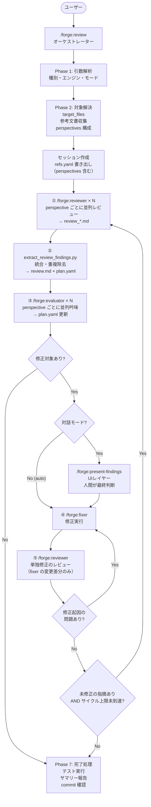

# DES-015 forge レビューワークフロー 設計書

## メタデータ

| 項目   | 値         |
| ------ | ---------- |
| 設計ID | DES-015    |
| 作成日 | 2026-03-14 |

---

> 対象プラグイン: forge | スキル: `/forge:review`

---

## 1. 概要

`/forge:review` はレビューワークフローのオーケストレータスキル。
引数解析 → 対象ファイル解決 → 参考文書収集 → レビュー実行 → 吟味 → 修正 → 完了処理の流れで動作する。

### 設計の背景

旧設計では `review` スキルが引数解析・参考文書収集・レビュー実行・吟味・修正・ToC更新・commit/push を全て担っていた（God-Skill 問題）。
単一責任原則に基づき、`review` をオーケストレーターとして整理し、各工程を専用スキルに委譲する構造に改めた。

### スキル一覧と責務

実際のレビュー・吟味・修正は専用の AI 専用スキルに委譲する:

| スキル                    | 役割                           |
| ------------------------- | ------------------------------ |
| `/forge:reviewer`         | レビュー実行（指摘事項の作成） |
| `/forge:evaluator`        | 指摘事項の吟味・修正判定       |
| `/forge:present-findings` | 対話モードでの段階的提示       |
| `/forge:fixer`            | 修正実行                       |

### レビュー種別

5種別に対応: `code` / `requirement` / `design` / `plan` / `generic`

### モード

| モード                   | 説明                                                                      |
| ------------------------ | ------------------------------------------------------------------------- |
| 対話モード（デフォルト） | 人間が判定者。evaluator の AI 推奨をもとに present-findings が1件ずつ提示 |
| `--auto N`               | evaluator → fixer → reviewer を N サイクル自動実行。🔴+🟡 を修正対象      |
| `--auto-critical`        | `--auto 1` と同等だが 🔴 のみを修正対象                                   |

---

## 2. フローチャート



コアループは auto / 対話 で同一。対話モードでは extract 統合と fixer の間に present-findings（UIレイヤー）が挟まるだけ。

```
auto モード:   reviewers(並列) → extract → evaluators(並列) → fixer → re-review → (問題あり → fixer → ...) → 次サイクル
対話モード:    reviewers(並列) → extract → evaluators(並列) → present-findings → fixer → re-review → (問題あり → fixer → ...) → 次サイクル
                                                                ↑ UIレイヤー（提示+人間判断）
```

fixer の後は必ず reviewer が**単独修正のレビュー**（fixer が変更した差分のみ）を行う。target_files 全体の再レビューではない。修正起因の問題が見つかった場合は fixer → re-review のループで解消してからサイクルを進める。

---

## 3. フェーズ詳細

### Phase 1: 引数解析

| Step | 内容                                                              | 実行者             |
| ---- | ----------------------------------------------------------------- | ------------------ |
| 1    | `$ARGUMENTS` を AI が解釈: 種別・エンジン・モード・対象パスを確定 | orchestrator（AI） |
| 2    | 解析結果をテーブル形式で表示                                      | orchestrator       |

**設計判断**: 引数解析はスクリプトではなく AI が直接行う。理由: ユーザーの入力は自然言語が混在する（例: `design 先ほど作成したファイル --auto`）ため、リジッドなトークンパーサーでは対応できない。AI がコマンド構文から意図を汲み取り、不足情報は AskUserQuestion で補完する。

### Phase 2: 対象解決 + 参考文書収集

| Step | 内容                                               | 実行者                |
| ---- | -------------------------------------------------- | --------------------- |
| 1    | `.doc_structure.yaml` の存在確認                   | orchestrator          |
| 2    | `resolve_review_context.py` で target_files を解決 | スクリプト            |
| 3    | 関連コード探索（subagent 委譲）                    | general-purpose agent |
| 4    | レビュー観点の収集（perspectives 構成）            | orchestrator          |
| 5    | 参考文書収集（DocAdvisor or .doc_structure.yaml）  | orchestrator          |
| 6    | エンジン確認（Codex / Claude）                     | orchestrator          |

#### レビュー観点の perspectives 構成

プラグインデフォルト（`${CLAUDE_SKILL_DIR}/docs/review_criteria_{type}.md`）の `## Perspective:` セクションから perspectives を構成する。DocAdvisor（`/query-rules`）が利用可能な場合はプロジェクト固有の観点を追加の perspective として加える。最大 5 perspectives をガイドラインとする。

### Phase 3: レビュー実行（perspective ごとに並列）

orchestrator が refs.yaml の `perspectives` 配列を読み、perspective の数だけ `/forge:reviewer` を並列起動する。
各 reviewer は1つの perspective のみ処理し、`review_{perspective}.md` を出力する。

### Phase 4: 統合

全 reviewer 完了後、`extract_review_findings.py` が session_dir 内の `review_*.md` を glob で収集し、`review.md` と `plan.yaml` を生成する。plan.yaml には perspective が含まれる。実装は CLI facade、`scripts/review/findings_parser.py`、`scripts/review/findings_renderer.py` に分かれ、parser / renderer は file write や monitor 通知を持たない。

### Phase 5: 吟味（perspective ごとに並列）

extract 完了後、orchestrator が perspective の数だけ `/forge:evaluator` を並列起動する。
各 evaluator は担当 `review_{perspective}.md` を読み、各指摘に recommendation / auto_fixable / reason を付与して plan.yaml を更新する。

### Phase 6: モード分岐

#### 対話モード

| Step | 内容                             | 委譲先                                                  |
| ---- | -------------------------------- | ------------------------------------------------------- |
| 1    | 段階的提示 + ユーザー判定 + 修正 | `/forge:present-findings`（plan.yaml + review.md 参照） |

#### 自動修正モード（--auto N）

N サイクル繰り返す:

| Step | 内容       | 委譲先                                                                |
| ---- | ---------- | --------------------------------------------------------------------- |
| 1    | 一括修正   | `/forge:fixer --batch`（plan.yaml から `recommendation: fix` を抽出） |
| 2    | 再レビュー | `/forge:reviewer`（fixer の変更差分のみ）                             |

plan.yaml 内の `recommendation: fix` が0件でループ終了。

### Phase 7: 完了処理

| Step | 内容                                       |
| ---- | ------------------------------------------ |
| 1    | テスト実行（修正ありの場合）               |
| 2    | 設計書の更新確認                           |
| 3    | サマリー報告                               |
| 4    | `/create-specs-toc` 実行（利用可能な場合） |
| 5    | commit 確認 → `/anvil:commit`              |
| 6    | セッションディレクトリ削除                 |

---

## 4. セッションディレクトリ設計

> **実装先**: `plugins/forge/docs/session_format.md`

### 背景と問題

現在のアーキテクチャでは、`reference_docs` / `related_code` / `target_files` / レビュー結果を
すべてプロンプトテキストとして各スキルに渡している。これにより:

1. **コンテキスト圧縮で消失**: 長時間セッションでリスト・Codex出力が消える
2. **状態の非永続性**: セッション中断後に「どこまで処理したか」が失われる
3. **複数フロー同時実行の衝突**: 単一の `review-result-{timestamp}.md` は複数フローで衝突しうる
4. **`.claude/.temp/` が gitignore されていない**: レビュー結果がリポジトリに混入するリスク

### 解決策

`/forge:review` 実行ごとに**セッションワーキングディレクトリ**を作成し、
すべての中間ファイルをそこに集約する。各スキルはプロンプト経由でなくファイル経由でデータを受け取る。

### パス

```
.claude/.temp/{skill_name}-{random6}/
```

例: `.claude/.temp/review-a3f7b2/`

- スキル名: どのスキルのセッションか一目でわかる
- 6文字ランダム hex: 同一スキルの複数起動でも衝突しない
- `.gitignore` に `.claude/.temp/` を追加

### ライフサイクル

| タイミング       | 操作                                                |
| ---------------- | --------------------------------------------------- |
| Phase 2 開始     | `review` がディレクトリ作成 + `session.yaml` 初期化 |
| Phase 5 正常完了 | `review` がディレクトリを削除                       |
| セッション中断   | ディレクトリが残存（次回起動時に検出・再開提案）    |

### セッション内ファイル一覧

| ファイル       | 書き込み                                                                         | 読み込み                                        | 用途                                                                                  |
| -------------- | -------------------------------------------------------------------------------- | ----------------------------------------------- | ------------------------------------------------------------------------------------- |
| `session.yaml` | review                                                                           | 全スキル                                        | セッションメタデータ（種別・エンジン・サイクル数）                                    |
| `refs.yaml`    | review                                                                           | reviewer / evaluator / fixer / present-findings | 参照ファイルリスト（target_files / reference_docs / related_code / perspectives）     |
| `review_*.md`  | reviewer（perspective ごと）                                                     | evaluator（perspective ごと）                   | perspective 別のレビュー結果（生出力）。例: `review_logic.md`, `review_resilience.md` |
| `review.md`    | extract_review_findings.py                                                       | present-findings / fixer                        | 全 perspective の統合・重複除去済みレビュー結果                                       |
| `plan.yaml`    | extract_review_findings.py（初期）→ evaluator / present-findings / fixer（更新） | 全スキル                                        | 修正プランと進捗状態。recommendation / auto_fixable / reason / perspective を含む     |

### スキル間インターフェース

```
現在（プロンプト経由）:
  review → reviewer: "reference_docs は A, B, C。related_code は X, Y..."
  → コンテキスト圧縮で消える

変更後（ファイル経由）:
  review → 全スキル: session_dir のパスのみ渡す
  各スキル: session_dir/{refs.yaml, review_*.md, plan.yaml} を Read して動作
  → ファイルは永続。コンテキスト圧縮の影響を受けない
```

---

## 5. スキル間データフロー

```
orchestrator (review SKILL.md)
  │
  ├─ Phase 2 → refs.yaml 書き出し
  │     ├─ target_files
  │     ├─ reference_docs
  │     ├─ related_code
  │     └─ perspectives[]  ← perspective ごとの name / criteria_path / section / output_path
  │
  ├─ Phase 3 → /forge:reviewer × N（perspective ごとに並列起動）
  │     ├─ 入力: session_dir, 種別, エンジン, perspective_name, criteria_path, section, output_path
  │     └─ 出力: review_{perspective}.md（perspective ごとの結果）
  │
  ├─ Phase 4 → extract_review_findings.py
  │     ├─ 入力: session_dir（review_*.md を glob で収集）
  │     └─ 出力: review.md（統合・重複除去済み）, plan.yaml（全指摘の統合管理）
  │
  ├─ Phase 5 → /forge:evaluator × N（perspective ごとに並列起動）
  │     ├─ 入力: session_dir, perspective_name, review_{perspective}.md
  │     └─ 出力: plan.yaml 更新（recommendation / auto_fixable / reason を付与）
  │
  ├─ Phase 6 (対話)
  │     └─ /forge:present-findings → plan.yaml 更新, 修正実行
  │
  └─ Phase 6 (自動) × N サイクル
        ├─ /forge:fixer → コード・文書修正
        └─ /forge:reviewer → review_*.md 更新, plan.yaml 更新
```

### データフロー図（mermaid）

```mermaid
flowchart TD
    subgraph Phase2 [Phase 2: 対象解決]
        ORC[review orchestrator] -->|Write| REFS[refs.yaml<br>target_files / reference_docs<br>related_code / perspectives]
    end

    subgraph Phase3 [Phase 3: 並列レビュー]
        REFS --> R1[reviewer A<br>logic]
        REFS --> R2[reviewer B<br>resilience]
        REFS --> R3[reviewer C<br>maintainability]
        R1 -->|Write| RA[review_logic.md]
        R2 -->|Write| RB[review_resilience.md]
        R3 -->|Write| RC[review_maintainability.md]
    end

    subgraph Phase4 [Phase 4: 統合]
        RA & RB & RC --> EXT[extract_review_findings.py]
        EXT -->|Write| RM[review.md<br>統合・重複除去済み]
        EXT -->|Write| PY[plan.yaml<br>perspective]
    end

    subgraph Phase5 [Phase 5: 並列吟味]
        PY --> E1[evaluator A]
        PY --> E2[evaluator B]
        PY --> E3[evaluator C]
        E1 -->|Update| PY
        E2 -->|Update| PY
        E3 -->|Update| PY
    end

    subgraph Phase6 [Phase 6: 修正]
        RM & PY --> PF[present-findings / fixer]
        PF -->|Update| PY
    end

    style Phase2 fill:#e8eaf6,stroke:#283593
    style Phase3 fill:#e3f2fd,stroke:#1565c0
    style Phase5 fill:#fce4ec,stroke:#c62828
    style Phase4 fill:#fff3e0,stroke:#e65100
    style Phase6 fill:#e8f5e9,stroke:#2e7d32
```



---

## 6. スキル間インターフェース詳細

### review → reviewer（perspective ごとに並列起動）

| 方向 | 項目                    | 内容                                                                    |
| ---- | ----------------------- | ----------------------------------------------------------------------- |
| 入力 | 種別                    | `code` / `requirement` / `design` / `plan` / `generic`                  |
| 入力 | target_files            | 解決済みファイルパス一覧（refs.yaml 経由）                              |
| 入力 | エンジン                | `codex` / `claude`                                                      |
| 入力 | reference_docs          | 収集済み参考文書パス一覧（refs.yaml 経由）                              |
| 入力 | related_code            | 関連コードのパスと関連性の説明（refs.yaml 経由）                        |
| 入力 | perspective_name        | perspective の識別子（例: `logic`）                                     |
| 入力 | criteria_path           | レビュー観点ファイルのパス（例: `review/docs/review_criteria_code.md`） |
| 入力 | section                 | criteria ファイル内の対象セクション名（`null` の場合はファイル全体）    |
| 入力 | output_path             | レビュー結果の出力先（session_dir からの相対パス）                      |
| 出力 | review_{perspective}.md | 🔴🟡🟢 マーカー付き指摘事項リスト（perspective 単位）                   |

### review → evaluator（perspective ごとに並列起動）

| 方向 | 項目                         | 内容                                                                               |
| ---- | ---------------------------- | ---------------------------------------------------------------------------------- |
| 入力 | review_{perspective}.md      | 当該 perspective の reviewer 出力                                                  |
| 入力 | reference_docs               | 収集済み参考文書パス（refs.yaml 経由）                                             |
| 入力 | target_files                 | レビュー対象ファイル（refs.yaml 経由）                                             |
| 入力 | related_code                 | 関連コードのパスと関連性の説明（refs.yaml 経由）                                   |
| 入力 | レビュー種別                 | 確定した種別                                                                       |
| 入力 | 修正対象フラグ               | `--auto`: 🔴+🟡 / `--auto-critical`: 🔴のみ / `--interactive`: 全件AI推奨          |
| 出力 | review_{perspective}.md 更新 | 各指摘に recommendation（fix / skip / needs_review）+ auto_fixable + reason を付与 |

### extract_review_findings.py（全 evaluator 完了後に実行）

| 方向 | 項目                 | 内容                                                                            |
| ---- | -------------------- | ------------------------------------------------------------------------------- |
| 入力 | session_dir          | review_*.md を glob で収集                                                      |
| 出力 | review.md            | 全 perspective の統合・重複除去済みレビュー結果                                 |
| 出力 | plan.yaml            | 全指摘の統合管理（recommendation / auto_fixable / reason / perspective を含む） |
| 出力 | should_continue 判定 | plan.yaml 内の `recommendation: fix` が0件なら終了                              |

### review → present-findings（対話モードのみ・UIレイヤー）

| 方向 | 項目                 | 内容                                               |
| ---- | -------------------- | -------------------------------------------------- |
| 入力 | plan.yaml            | extract_review_findings.py が生成した統合済み plan |
| 入力 | review.md            | 統合・重複除去済みレビュー結果                     |
| 入力 | reference_docs       | 収集済み参考文書パス（refs.yaml 経由）             |
| 出力 | plan.yaml 上書き更新 | ユーザーの最終判断で recommendation を上書き       |

present-findings は evaluator が吟味し extract_review_findings.py が統合した結果を人間に段階的に提示し、最終判断を仰ぐ UIレイヤー。吟味ロジック自体は evaluator が担い、present-findings は提示・インタラクションに専念する。

### review → fixer

| 方向 | 項目                   | 内容                                              |
| ---- | ---------------------- | ------------------------------------------------- |
| 入力 | 指摘事項（修正リスト） | plan.yaml から `recommendation: fix` の指摘を抽出 |
| 入力 | target_files           | 修正対象ファイル（refs.yaml 経由）                |
| 入力 | レビュー種別           | 確定した種別                                      |
| 入力 | reference_docs         | 収集済み参考文書パス（refs.yaml 経由）            |
| 入力 | related_code           | 関連コードのパスと関連性の説明（refs.yaml 経由）  |
| 入力 | モード                 | `--single`（1件）/ `--batch`（一括）              |
| 出力 | 修正サマリー           | 修正ファイル・修正内容・影響範囲                  |

---

## 7. 設計原則

### コアループは auto / 対話 で同一

コアループ（reviewers 並列 → extract 統合 → evaluators 並列 → fixer → re-review）は両モードで共通。
evaluator は常に実行され、対話モードでは evaluators の後に present-findings が UIレイヤーとして入るだけ。

| モード     | コアループ                               | UIレイヤー       | 最終判断者 |
| ---------- | ---------------------------------------- | ---------------- | ---------- |
| `--auto N` | reviewers → extract → evaluators → fixer | なし             | AI         |
| 対話モード | reviewers → extract → evaluators → fixer | present-findings | 人間       |

**品質の一貫性**: コアの吟味ロジック（evaluator）が常に動くため、auto モードの品質が対話モードと同等になる。

### 参考文書収集は1回のみ（orchestrator が担当）

`review` orchestrator が `target_files` 解決・`reference_docs` 収集・`perspectives` 構成を行い、
以降の全 agent（reviewer・evaluator・fixer）に渡す。各 agent は渡されたパスを Read するだけで、独自収集は行わない。

### 関連コードを探索して全 agent に渡す

orchestrator が target_files を起点に general-purpose subagent で関連コードを探索し、
reviewer・evaluator・fixer 全員に渡す。

- reviewer は既存実装のパターンを把握してレビューの質を上げる
- evaluator は設計意図・副作用リスクの判定に使う
- fixer は実装パターン・命名規則・スタイルに合わせて修正する

### `--auto [N]` フラグの動作

| 指定       | 動作                             |
| ---------- | -------------------------------- |
| 省略       | 対話モード（人間が判定者）       |
| `--auto`   | 自動修正 1サイクル（🔴+🟡対象）  |
| `--auto N` | 自動修正 N サイクル（🔴+🟡対象） |
| `--auto 0` | レビューのみ（修正なし）         |

---

## 8. evaluator の吟味観点（5観点）

evaluator は各指摘について以下の5観点で評価する:

| 観点               | 確認内容                                               |
| ------------------ | ------------------------------------------------------ |
| ルール照合         | 参考文書（ルール・規約）に照らして本当に違反しているか |
| 設計意図           | 現状の実装に意図がある可能性はないか                   |
| 副作用リスク       | この修正が他の箇所に影響しないか                       |
| false positive     | エンジンの誤認識・過剰指摘ではないか                   |
| 対象ファイルの確認 | 判断に迷う場合は対象ファイルを Read して確認する       |

---

## 9. レビュー種別と参考文書収集戦略

| レビュー種別  | DocAdvisor 利用可能時       | 利用不可時（フォールバック）                   |
| ------------- | --------------------------- | ---------------------------------------------- |
| `requirement` | /query-rules + /query-specs | .doc_structure.yaml から rules + specs を Glob |
| `design`      | /query-rules + /query-specs | .doc_structure.yaml から rules + specs を Glob |
| `plan`        | /query-rules + /query-specs | .doc_structure.yaml から rules + specs を Glob |
| `code`        | /query-rules + /query-specs | .doc_structure.yaml から rules + specs を Glob |
| `generic`     | **使用しない**              | **使用しない**（レビュアーが自発探索）         |

---

## 10. 設計判断の記録

### 検討した代替案と却下理由

| 案                          | 却下理由                                                   |
| --------------------------- | ---------------------------------------------------------- |
| フロントマター方式を継続    | 根本解決にならない（コンテキスト圧縮問題が残る）           |
| UUID をディレクトリ名に使用 | 人間可読性・ソート可能性を優先してタイムスタンプ+random に |
| evaluator は --auto のみ    | 対話モードでも AI 推奨を活かすため常時実行に変更           |

### 確定事項

| 項目                       | 決定                                                               |
| -------------------------- | ------------------------------------------------------------------ |
| evaluator の実行タイミング | 対話モード・auto モード両方で常時実行                              |
| 完了後のディレクトリ       | Phase 5 で削除                                                     |
| plan.yaml の競合書き込み   | --auto サイクル内は evaluator → fixer の順で直列実行のため競合なし |

---

## 11. 関連ファイル

| ファイル                                                        | 役割                                           |
| --------------------------------------------------------------- | ---------------------------------------------- |
| `plugins/forge/skills/review/SKILL.md`                          | スキル仕様                                     |
| `plugins/forge/skills/review/scripts/resolve_review_context.py` | target_files 解決スクリプト                    |
| `plugins/forge/scripts/review/findings_parser.py`               | review markdown から findings を抽出           |
| `plugins/forge/scripts/review/findings_renderer.py`             | findings から `plan.yaml` / `review.md` を生成 |
| `plugins/forge/skills/review/docs/review_criteria_{type}.md`    | レビュー観点（種別ごと）                       |
| `plugins/forge/docs/session_format.md`                          | セッションファイルスキーマ（正規仕様）         |
| `plugins/forge/skills/reviewer/SKILL.md`                        | レビュー実行 AI スキル                         |
| `plugins/forge/skills/evaluator/SKILL.md`                       | 吟味・判定 AI スキル                           |
| `plugins/forge/skills/present-findings/SKILL.md`                | 段階的提示 AI スキル                           |
| `plugins/forge/skills/fixer/SKILL.md`                           | 修正実行 AI スキル                             |
