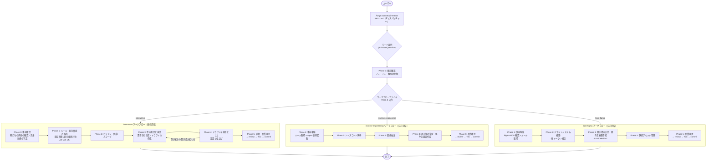

# DES-017 forge 要件定義書作成ワークフロー 設計書

## 1. 概要

`/forge:start-requirements` は3つのモード（interactive / reverse-engineering / from-figma）で
要件定義書を作成するオーケストレータスキル。

モードによって入力源・ワークフローが大きく異なるため、モード確定後に各ワークフローファイルへ分岐する設計とする。各ワークフローは完了処理まで自己完結しており、SKILL.md に戻る必要はない。

### 設計方針

- **SKILL.md はディスパッチャー**: フィーチャー概念の把握・モード選択・全モード共通の規則（要件定義書を書く直前の決定）・ワークフローへの委譲を担当
- **ワークフローファイルは自己完結**: 各モードの全手順（コンテキスト収集〜完了処理）を包含
- **interactive はドラフト駆動**: スキルの起動前の壁打ちで分かっていることを先に要件定義書のドラフトとして書き、議論して仕上げる。事前一括コンテキスト収集を行わず、対話で必要性が判明してから調査する

---

## 2. ファイル構成

```
plugins/forge/skills/start-requirements/
├── SKILL.md                                         # ディスパッチャー
├── docs/
│   ├── requirements_interactive_workflow.md          # 対話型ワークフロー
│   ├── requirements_reverse_engineering_workflow.md  # ソース解析型ワークフロー
│   └── requirements_from_figma_workflow.md           # Figma 型ワークフロー
```

---

## 3. フローチャート



---

## 4. SKILL.md（ディスパッチャー）の責務

| Step | 内容                                   | 実行者       |
| ---- | -------------------------------------- | ------------ |
| 1    | モード選択                             | orchestrator |
| 2    | Phase 0（フィーチャー概念の把握）      | orchestrator |
| 3    | ワークフローファイルの Read & 実行委譲 | orchestrator |

SKILL.md はワークフローファイルに実行を委譲した後、制御を返さない。

### 全モード共通の規則: 要件定義書を書く直前の決定

feature・出力先・ファイル名は、書く内容が固まらないと決まらない（ファイル名の `{name}` は機能を表す名前であり、要件 ID は採番の後に確定する）。そのため SKILL.md は、各ワークフローが要件定義書のファイルを書く直前（要件 ID の採番の直前）に、次の順で決める規則を定める。決める位置は、各ワークフローが指定する。

| 手順 | 内容                                                                                                        | 対象                                                                               |
| ---- | ----------------------------------------------------------------------------------------------------------- | ---------------------------------------------------------------------------------- |
| 1    | 完全新規かどうか（既存の要件定義書が 1 件も無いか）を、doc-structure の出力先ディレクトリの解決手順で求める | 全モード（interactive は、既存資産の確認の要否を決めるために、Phase 0 で先に行う） |
| 2    | 純粋追加型か差分開発型かを判定し、ユーザーの承認を得る                                                      | interactive のみ（完全新規でないとき）                                             |
| 3    | feature の決定（差分開発型は差分 feature を使う）                                                           | 全モード                                                                           |
| 4    | 出力先ディレクトリの解決                                                                                    | 全モード                                                                           |
| 5    | ファイル名の決定                                                                                            | 全モード                                                                           |

reverse-engineering と from-figma が差分開発かどうかの判定を行わないのは、既存のコード・Figma から要件を起こすモードであり、後から既存仕様を差分変更する運用にならないためである。

---

## 5. モード別ワークフロー

### interactive モード（対話型）

要件定義書のドラフトを先に書き、ユーザーとの対話で仕上げる。**事前一括コンテキスト収集を行わない**。

| Phase | 内容                                                                     | 主な成果物                                                    |
| ----- | ------------------------------------------------------------------------ | ------------------------------------------------------------- |
| 0     | 事前確認（壁打ちの内容の確認、完全新規かどうかの判定）                   | 変更の性質・概要のメモ、完全新規かどうかの結果                |
| 1     | ルール・既存資産の取得（既存資産の確認は、完全新規でないときだけ）       | 参照文書リスト、影響範囲メモ                                  |
| 2     | ビジョン・価値・スコープの確認（新規・追加共通）                         | ドラフトの素材                                                |
| 3     | 型の判定と承認、置き場の決定、ドラフトの作成                             | 型の判定の結果、ドラフトの要件定義書                          |
| 4     | ドラフトを前提とした議論と仕上げ（型の再判定、一時マーカーの付与を含む） | シナリオ、画面/IF 一覧、フロー図、SCR/FNC/BL/DM、グロッサリー |
| 5     | 統合・品質確認・完了処理                                                 | 完成した要件定義書                                            |

**設計上の特徴**:

- Phase 0 で、スキルの起動前の壁打ちで分かっていることを聞き直さず、提示して確認する。完全新規かどうかは、ユーザーの答えでなく、既存の要件定義書の有無で決まる
- Phase 1 でルール文書を特定する。既存資産（既存仕様・設計書・関連する既存機能と影響範囲）の確認は、完全新規でないときだけ行う
- 要件定義書のドラフトを先に書き、議論で仕上げる。ドラフトには `doc_status: draft` を付け、レビューが完了して内容が確定したら外す
- 型の判定は、ドラフトを書く前に、その時点の情報（壁打ちの内容と既存資産の確認結果）で行い、ユーザーの承認を得る。確定ではないので、議論で型が変わり置き場が変わるときは、再判定して承認を得る
- 一時マーカー（`feature_type: temporary-feature`）は、要件定義を確定した後、AI レビューの前に、最終の型に従って 1 回だけ付ける。付けるのは差分開発型のときだけである
- 必要に応じて WebSearch で外部情報調査
- コンテキスト収集 agent の並列起動パターンは使わない
- 対話原則・アンチパターン・質問テンプレートで対話品質を担保

### reverse-engineering モード（ソース解析）

既存アプリのソースコードから要件を逆算する。**事前にコンテキストを一括収集**する。

| Phase | 内容                                    | 主な成果物                                     |
| ----- | --------------------------------------- | ---------------------------------------------- |
| 1     | 事前準備（ルール取得 + agent 並列起動） | 収集結果（return value）                       |
| 2     | ソースコード解析                        | ディレクトリ構成、画面一覧、ナビゲーション構造 |
| 3     | 要件抽出                                | アクション、条件分岐、データ永続化、エラー     |
| 4     | 置き場の決定・要件定義書作成            | APP-001 → SCR-xxx 順に記載                     |
| 5     | 品質確認・完了処理                      | 完成した要件定義書                             |

### from-figma モード（Figma 取り込み）

Figma MCP 経由でデザインファイルから要件とデザイントークンを作成する。

| Phase | 内容                                    | 主な成果物                                      |
| ----- | --------------------------------------- | ----------------------------------------------- |
| 1     | 事前準備（Figma MCP 確認 + ルール取得） | Figma アクセス確認済み                          |
| 2     | デザインシステム構築                    | 2層トークン構造、再利用コンポーネント           |
| 3     | 置き場の決定・要件定義書作成            | SCR-xxx（ASCII レイアウト図）、CMP-xxx、FNC-xxx |
| 4     | 静的アセット管理                        | アセット一覧、管理方針                          |
| 5     | 品質確認・完了処理                      | 完成した要件定義書                              |

**前提条件**: Figma MCP が利用可能であること（Phase 1 で確認）。

---

## 6. 設計原則

### What に集中する [MANDATORY]

要件定義書は「何を実現するか」を記述する。
「どう実装するか」は設計書の責務であり、要件定義書に含めない。
判断に迷う場合は `spec_design_boundary_spec.md` を参照する。

### コンテキスト収集はモード別に最適化

| モード              | 収集方式                 | 理由                                             |
| ------------------- | ------------------------ | ------------------------------------------------ |
| interactive         | オンデマンド（対話駆動） | ユーザーの要望が判明するまで何を検索すべきか不明 |
| reverse-engineering | 事前一括（agent 並列）   | ソースコードという確定的な入力がある             |
| from-figma          | 事前一括（Skill で特定） | Figma ファイルという確定的な入力がある           |

### ワークフローの自己完結性

各ワークフローファイルは以下を全て包含する:

- 必読文書の指定
- コンテキスト収集（モードに適した方式）
- 要件作成の全手順（「要件定義書を書く直前の決定」を行う位置を含む）
- 品質確認
- AI レビュー（`/forge:review requirement --auto`）
- ToC 更新（`/forge:update-db-specs`）
- commit 確認（`/anvil:commit`）

SKILL.md への参照・戻りは不要。

### ID 体系の一貫性

要件 ID の体系は [requirement_format.md](../../../../plugins/forge/docs/requirement_format.md) が定める。

---

## 7. 関連ファイル

| ファイル                                                                                    | 説明                           |
| ------------------------------------------------------------------------------------------- | ------------------------------ |
| `plugins/forge/skills/start-requirements/SKILL.md`                                          | スキル仕様（ディスパッチャー） |
| `plugins/forge/skills/start-requirements/docs/requirements_interactive_workflow.md`         | 対話型ワークフロー             |
| `plugins/forge/skills/start-requirements/docs/requirements_reverse_engineering_workflow.md` | ソース解析型ワークフロー       |
| `plugins/forge/skills/start-requirements/docs/requirements_from_figma_workflow.md`          | Figma 型ワークフロー           |
| `plugins/forge/docs/requirement_format.md`                                                  | 要件定義書テンプレート         |
| `plugins/forge/docs/spec_design_boundary_spec.md`                                           | 要件/設計の境界ガイド          |
