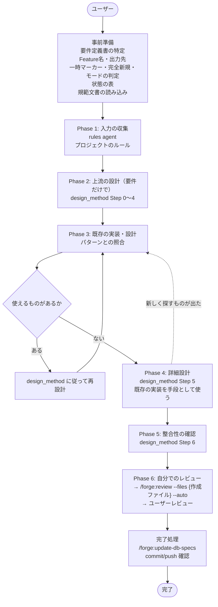

# DES-018 forge 設計書作成ワークフロー 設計書

## 1. 概要

`/forge:start-design` は要件定義書から設計書を作成するオーケストレータスキル。
要件だけで上流の設計 → 既存の実装・設計パターンとの照合と再設計 → 詳細設計 → 整合性の確認 → レビュー → commit の流れで動作する。

設計の手順と成果物は `design_method.md` に従う。上流の設計は要件から組み立て、既存の実装・設計パターンは上流の設計の後に、その観点から読む。詳細設計は照合の後に、修正せずに使える既存の実装を手段として使って行う。既存の実装をどう修正・削除・統合・分割するかは、設計ではなく実装戦略書の責務である。

---

## 2. フローチャート



---

## 3. フェーズ詳細

### 事前準備 [MANDATORY]

| Step | 内容                                                                                                                        |
| ---- | --------------------------------------------------------------------------------------------------------------------------- |
| 1    | 要件定義書の特定（`--requirement` または会話の文脈から。分からなければ利用者に尋ねる。置き場に 1 件も無ければ案内して終了） |
| 2    | Feature 名の確定（特定した要件定義書のパスから決める。引数と食い違えば AskUserQuestion。設計の完全新規は不要）              |
| 3    | 出力先ディレクトリの解決                                                                                                    |
| 4    | 差分開発かどうかの確認（入力の要件定義書の一時マーカーの判定。持てば差分開発の規範文書を読む）                              |
| 5    | 設計の完全新規の判定（doc-structure の手順で、プロジェクト全体の既存の設計書の有無を求める）                                |
| 6    | モード判定（出力先に設計書なし（新規作成モード） / 出力先に設計書あり）                                                     |
| 7    | 状態の表の提示（型・設計書・feature・要件定義書）。出力先に設計書があれば、表の後に追加作成かレビューのみかを確認           |
| 8    | 規範文書の読み込み                                                                                                          |

差分開発かどうかは引数で指定しない。入力の要件定義書が `feature_type: temporary-feature` frontmatter を持つかを出発点にし、設計の後に既存の仕様と突き合わせて設計書について確かめる（Phase 3）。要件の上では既存と重ならなくても、設計が既存の設計書を変える・重なる場合があるためである。

状態の表は、一時マーカー・完全新規・モードの判定の後に示す。型は、要件定義書が一時マーカーを持てば差分開発型、持たずに設計の完全新規なら完全新規、どちらでもなければ Phase 3 まで未定とする。Phase 3 で型が確定したら、同じ表を更新して示す。表を事前準備に置くのは、出力先に設計書があるときの追加作成かレビューのみかの確認と、型に基づく判断（上流の設計）の前に、利用者と AI が同じ状態を共有するためである。

モード判定が見るのは出力先ディレクトリだけであり、型（完全新規・純粋追加型・差分開発型）とは別である。型はプロジェクト全体の設計書と既存の仕様との関係で決まる。モード名に「出力先」を含めるのは、「新規作成モード」が完全新規と読まれないためである。

要件定義書は会話の文脈から特定する。意味検索は、他の feature の仕様や設計書のような入力でない文書を混ぜ、設計の出発点を汚すためである。置き場の文書を全件並べて選ばせることもしない。文脈から分からないときは、利用者に尋ねる。置き場に 1 件も無いときは `/forge:start-requirements` で作成するよう案内して終了する（要件定義書なしでは設計しない）。

**読み込む規範文書:**

- `design_method.md` — 設計の手順と成果物
- `design_principles_spec.md` — 設計書の判断基準・禁止事項・重大度
- `strategy_principles_spec.md` — 実装戦略書の原則（既存の実装の扱いは設計ではなく実装戦略書の責務）
- `spec_design_boundary_spec.md` — 要件/設計の境界ガイド
- `spec_priorities_spec.md` — 要件・設計で優先する価値観（構造品質の定量化禁止など）
- `document_style_guide.md` — 文書スタイル指針（タグ・見出し・参照記法）

### Phase 1: 入力の収集

プロジェクトのルールを収集する。要件定義書は事前準備で特定済みである。既存の実装・設計パターンは、ここでは集めない。

| 入力                 | 手段                             | 出力                         |
| -------------------- | -------------------------------- | ---------------------------- |
| プロジェクトのルール | `/forge:query-db-rules`（agent） | return value（ルールリスト） |

### Phase 2: 上流の設計（要件だけで）

| Step | 内容                                                                                                 |
| ---- | ---------------------------------------------------------------------------------------------------- |
| 2.1  | 要件定義書とプロジェクトのルールだけを使い、`design_method.md` の Step 0〜4 に従って上流の設計を作る |
| 2.2  | Step 1 の終わり（シナリオ表と入力への質問）で AskUserQuestion による承認                             |
| 2.3  | Step 1 の承認後に設計 ID を採番し（`next-spec-id` の採番スクリプト）、設計書ファイルを作る           |
| 2.4  | Step 4 の終わり（上流の設計）で AskUserQuestion による承認                                           |

### Phase 3: 既存の実装・設計パターンとの照合と再設計

| Step | 内容                                                                                                                                     |
| ---- | ---------------------------------------------------------------------------------------------------------------------------------------- |
| 3.1  | 上流の設計の責務・契約・共有データを手がかりに、既存の実装と設計パターンを探す                                                           |
| 3.2  | 採るべき設計パターンで構造が変わるなら、Step 2〜4 から上流の設計を直す。修正せずに使える実装は、Phase 4 で手段として使うために覚えておく |
| 3.3  | 新しく使えるものが見つからなくなるまで 3.1〜3.2 を繰り返す                                                                               |
| 3.4  | 再設計で上流の設計が変わったら、上流の設計を再承認にかける                                                                               |
| 3.5  | 設計が触れる範囲の既存の要件定義書・設計書を `/forge:query-db-specs` で探し、新しい設計と突き合わせる                                    |

使えるものが見つからなければ、そのまま Phase 4 へ進む。

3.5 の結果の扱い:

- 新しい設計が既存の設計書の記述を変える・範囲が重なる → 設計書を差分開発として扱い、一時マーカーを付ける（要件定義書には付けない）
- 既存の要件定義書の内容まで変える必要がある → 設計を止めて要件定義に戻す
- どちらにも当たらない → 要件定義書が一時マーカーを持たなければ、設計の完全新規なら完全新規、そうでなければ純粋追加型であり、設計書に一時マーカーは付けず Phase 4 へ進む（持つ場合は差分開発型であり、事前準備の差分開発かどうかの確認のとおり付ける）

型が確定したら、状態の表を更新して示す。

### Phase 4: 詳細設計

| Step | 内容                                                                               |
| ---- | ---------------------------------------------------------------------------------- |
| 4.1  | `design_method.md` の Step 5 に従い、上流の設計を実装できる厳密さまで詰める        |
| 4.2  | Phase 3 で覚えておいた、修正せずに使える既存の実装を手段として使い、そのパスを書く |
| 4.3  | 詳細化の中で新しく探すべき既存が出たら、Phase 3 に戻る                             |

### Phase 5: 整合性の確認

| Step | 内容                                                                            |
| ---- | ------------------------------------------------------------------------------- |
| 5.1  | `design_method.md` の Step 6 に従い、追跡表を作り、チェック項目を満たすまで直す |

### Phase 6: AI レビューとユーザーレビュー

| Step | 内容                                                               | 実行者              |
| ---- | ------------------------------------------------------------------ | ------------------- |
| 6.1  | 作成・変更した設計書を最初から最後まで自分で読み、誤りを直す       | orchestrator        |
| 6.2  | `/forge:review --files {作成ファイル} --auto` 実行（差分のみ対象） | review ワークフロー |
| 6.3  | AskUserQuestion による設計全体の承認                               | orchestrator        |

### 要件定義書に無い設計が必要になった場合（全 Phase 共通）

設計を止めて、何が必要になったかとその由来をユーザーに報告する。要件へ戻すか設計書に書くかを AI が判定せず、どちらにも独断で書かない。

- **要件定義書へ追記する場合**: 追記内容を提示し、承認を得てから追記する。差分 feature に該当するなら差分側の要件定義書へ書く
- **設計書に書く場合**: 設計書に書き、承認を `/forge:write-adr approval-record {feature} --defer-finish` で ADR に記録して、設計書の当該節からリンクする。ADR の書式・採番・記載先は ADR ライターが担い、本スキルは扱わない

### 完了処理

| Step | 内容                                                                                                                            |
| ---- | ------------------------------------------------------------------------------------------------------------------------------- |
| 1    | `/forge:update-db-specs` 実行（利用可能な場合）                                                                                 |
| 2    | commit/push の確認フローを担うスキル（例: `/anvil:commit`）があれば呼び出す。無ければ `git add` → `git commit` の手順を案内する |

---

## 4. 設計原則

### 要件から組み立てる [MANDATORY]

設計は要件定義書とプロジェクトのルールだけから組み立てる。既存の実装・設計パターンを出発点にせず、それらに合わせて設計を曲げない（`additive_development_spec.md` §2「設計は要件から組み立てる」）。

### 既存の実装・設計パターンの活用 [MANDATORY]

上流の設計の後に、その観点から既存の実装と設計パターンを読む。修正せずにそのまま使える既存コンポーネントがあれば再利用し（新規作成禁止）、そのパスを設計書に書く。設計に合わせて修正するものは再利用の対象ではない。

### 要件定義書の全件反映

設計書は要件定義書の全要件をカバーする。未反映の要件がないことを Phase 5（追跡表）で検証する。

### What/How の境界

`spec_design_boundary_spec.md` に従い、設計書は「How（どう構成するか）」に集中する。
「What（何を実現するか）」は要件定義書の責務であり、設計書に重複して書かない。

---

## 5. 次ステップの案内

```
/forge:start-plan {feature}           # 計画書作成へ進む
```

---

## 6. 関連ファイル

| ファイル                                          | 説明                  |
| ------------------------------------------------- | --------------------- |
| `plugins/forge/skills/start-design/SKILL.md`      | スキル仕様            |
| `plugins/forge/docs/design_method.md`             | 設計の手順と成果物    |
| `plugins/forge/docs/design_principles_spec.md`    | 設計原則ガイド        |
| `plugins/forge/docs/spec_design_boundary_spec.md` | 要件/設計の境界ガイド |
