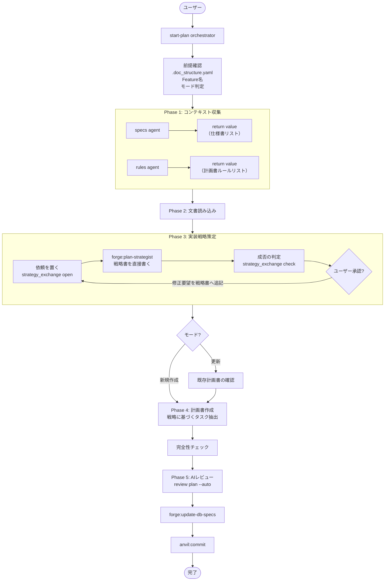

# DES-019 forge 計画書作成ワークフロー 設計書

## 1. 概要

`/forge:start-plan` は設計書から実装戦略を策定し、タスクを抽出して計画書を作成するオーケストレータスキル。
文書取得 → 実装戦略策定 → タスク抽出・分割 → 計画書作成 → AIレビュー → 人間承認の流れで動作する。

### Agent への委譲

オーケストレータパターン要件（`REQ-001_orchestrator_pattern.md`）に基づき、
以下の工程を Agent に委譲している:

| 工程                             | Agent                                                                               |
| -------------------------------- | ----------------------------------------------------------------------------------- |
| 要件定義書・設計書・ルールの収集 | 汎用 Agent (general-purpose)                                                        |
| 実装戦略の策定                   | カスタム Agent `forge:plan-strategist`（役割・制約・手順・出力を 1 ファイルで持つ） |
| AIレビュー                       | `/forge:review plan`                                                                |

実装戦略の策定をカスタム Agent とするのは、手順と制約を Agent の定義に固定するためである。

この Agent は、依頼に挙がった要件定義書・設計書に加えて、**関連する既存の仕様書を query スキル（`/forge:query-db-specs` / `/forge:query-db-rules`）で自ら検索して読み、既存コードも読む**。依頼に挙がるのは当該 feature の文書だけであり、既存の仕様とコードを読まなければ戦略は立てられないためである。検索に伴う索引の更新は query スキルの側の処理であり、その許可は利用者に申請される。

差分開発で既存実装と旧仕様を読むが、実装期間中は旧仕様を書き換えてはならない（[additive_development_spec.md](../../../../plugins/forge/docs/additive_development_spec.md) §3）。Agent が書いてよいのは依頼が指す戦略書 1 ファイルだけであり、仕様書・コードの書き換えは制約として禁じる。

### Agent との受け渡し

受け渡しは [agent_data_exchange_rules.md](../../../rules/agent_data_exchange_rules.md) に従う。戦略書は大きくなりうるため、依頼の中身も戦略書の本文も prompt / return value に載せない。

| 本書が決める事項 | 内容                                                                                                                                                                          |
| ---------------- | ----------------------------------------------------------------------------------------------------------------------------------------------------------------------------- |
| 識別値           | `output_dir`（計画書と同じディレクトリ）と `feature` の 2 つ。feature ディレクトリで分離されているため、実行ごとの識別子は持たない                                            |
| 置き場           | `output_dir`。計画書・`tasks/` と同じ場所                                                                                                                                     |
| 依頼             | `{feature}_strategy_request.json`。フィールドは `feature` / `requirement_docs` / `design_docs` / `rules_docs` / `existing_strategy` / `strategy_path`（パスはすべて絶対パス） |
| 結果             | 戦略書 `{feature}_strategy.md`（Agent が直接書く）と、終了の値 `{feature}_strategy_result.json`                                                                               |
| エラー値         | 持たない（空集合）。渡された文書が読めないのは収集直後の状態ではバグか障害であり、関連仕様や既存実装が見つからないのは戦略書に明記して続ける判定事項である                    |
| 片付け           | 成否にかかわらず依頼と終了の値の記録を削除する。戦略書は計画書と同じライフサイクルで残す                                                                                      |

script は `plugins/forge/skills/start-plan/scripts/strategy_exchange.py` の 1 本で、4 つのサブコマンドを持つ。

| サブコマンド   | 呼ぶ主体        | 動作                                                                                 |
| -------------- | --------------- | ------------------------------------------------------------------------------------ |
| `open`         | start-plan      | 依頼を組み立てて公開する。既存戦略書の有無を判定して依頼に入れ、前回の終了の値を消す |
| `request-path` | plan-strategist | 公開済みの依頼の絶対パスだけを返す                                                   |
| `finish`       | plan-strategist | 戦略書が書かれていることを確かめ、終了の値 `"0"` を記録する。上書きしない            |
| `check`        | start-plan      | 終了の値が `"0"` なら戦略書のパスを返す。成否にかかわらず依頼と記録を削除する        |

---

## 2. フローチャート



---

## 3. フェーズ詳細

### 前提確認フェーズ [MANDATORY]

| Step | 内容                                        | 実行者       |
| ---- | ------------------------------------------- | ------------ |
| 1    | `.doc_structure.yaml` の確認                | orchestrator |
| 2    | Feature 名の確定（引数 or AskUserQuestion） | orchestrator |
| 3    | モード判定（新規作成 / 更新）               | orchestrator |
| 4    | defaults 読み込み                           | orchestrator |

**読み込む defaults:**

- [plan_principles_spec.md](../../../../plugins/forge/docs/plan_principles_spec.md) — 計画書作成原則ガイド

### Phase 1: コンテキスト収集 [MANDATORY]

| 収集対象            | 手段                    | 出力                                            |
| ------------------- | ----------------------- | ----------------------------------------------- |
| 要件定義書 + 設計書 | `/forge:query-db-specs` | return value（仕様書リスト、specs agent）       |
| 実装ルール          | `/forge:query-db-rules` | return value（計画書ルールリスト、rules agent） |

**設計書は必須入力。** 見つからない場合は AskUserQuestion でユーザーに手動指定またはスキップ確認（リスク理解のもと）。

### Phase 2: 文書の読み込み

| Step | 内容                                                      | 実行者       |
| ---- | --------------------------------------------------------- | ------------ |
| 2.1  | 仕様書 return value → 要件定義書・設計書を Read           | orchestrator |
| 2.2  | 計画書ルール return value → プロジェクト固有ルールを Read | orchestrator |

### Phase 3: 実装戦略の策定 [MANDATORY]

| Step | 内容                                                                                                            | 実行者                |
| ---- | --------------------------------------------------------------------------------------------------------------- | --------------------- |
| 3.1  | `strategy_exchange open` で依頼を置く（要件定義書・設計書・ルール文書のパス。既存戦略書の有無は script が判定） | orchestrator          |
| 3.2  | `forge:plan-strategist` を識別値（`output_dir` / `feature`）だけで起動する                                      | forge:plan-strategist |
| 3.3  | `strategy_exchange check` で成否を判定する                                                                      | orchestrator          |
| 3.4  | 戦略書のパスを提示し、ユーザー承認を取得する。修正要望は戦略書の末尾へ追記して 3.1 からやり直す                 | orchestrator          |

**入力**: Phase 1 の仕様書 return value から抽出した要件定義書パス・設計書パス + 計画書ルール return value のルール文書パス
**出力**: `{output_dir}/{feature}_strategy.md`（Agent が直接書く）。orchestrator が受け取るのは成否と戦略書のパスだけ

差分開発型（要件定義書・設計書が `feature_type: temporary-feature` を持つ）の場合、戦略書は既存実装と新仕様の不一致と、各々への処置（修正 / 削除 / 新規作成 / 統合 / 分割）を含む。要件定義書を入力に含めるのは、差分開発型かどうかの判定と新旧の突き合わせに要るためである。

### Phase 4: 計画書の作成・更新

| Step | 内容                                                                                       |
| ---- | ------------------------------------------------------------------------------------------ |
| 4.1  | 更新モード時: 既存計画書の確認（要件・設計反映状況、未着手タスク把握）                     |
| 4.2  | 実装戦略のフェーズ分割に基づきタスク抽出・分割                                             |
| 4.3  | 候補 JSON を組み立て、`write_plan.py` へ渡して計画書へ書き出す（構造検証は script が行う） |
| 4.4  | 完全性チェック [MANDATORY]                                                                 |

各タスクの `required_reading` には `{feature}_strategy.md` を必ず含める。executor が単一タスクだけを実装する場合でも、全体戦略・フェーズ意図・リスク対策を理解したうえで実装判断できるようにする。

**タスク粒度 [MANDATORY]:**

- 1 Agent が単独で実行・完結できる単位
- 5〜10 項目程度
- ビルド成功（コンパイル通過）が完了条件

**完全性チェック項目:**

- 実装戦略のフェーズ分割がタスク優先度に反映されているか
- タスクID の一意性
- 要件 → 設計 → タスクのトレーサビリティマトリクス
- 優先度と依存関係の整合性

### Phase 5: AIレビュー

| Step | 内容                                                                    | 実行者              |
| ---- | ----------------------------------------------------------------------- | ------------------- |
| 5.1  | `/forge:review plan --files {作成ファイル} --auto` 実行（差分のみ対象） | review ワークフロー |

### 完了処理

| Step | 内容                                            |
| ---- | ----------------------------------------------- |
| 6.1  | `/forge:update-db-specs` 実行（利用可能な場合） |
| 6.2  | `/anvil:commit` による commit/push 確認         |

---

## 4. 設計原則

### タスクは Agent 実行単位で分割 [MANDATORY]

1つのタスクは 1 Agent が単独で実行・完結できる粒度とする。
タスク完了条件は「ビルド成功（コンパイル通過）」を最低基準とする。

### トレーサビリティの確保

計画書内にトレーサビリティマトリクスを含める:

- 要件ID → 設計ID → タスクID の対応表
- 未対応の要件・設計がないことを検証

### 更新モードの既存資産確認

更新時は既存計画書を Read し、以下を把握してから更新する:

- 要件定義書・設計書への反映状況
- 未着手タスクの有無
- 完了済みタスクとの整合性

---

## 5. 次ステップの案内

```
/forge:start-implement {feature}    # タスクの実行を開始
```

---

## 6. 関連ファイル

| ファイル                                                                                         | 説明                                         |
| ------------------------------------------------------------------------------------------------ | -------------------------------------------- |
| [start-plan SKILL.md](../../../../plugins/forge/skills/start-plan/SKILL.md)                      | スキル仕様                                   |
| [plan-strategist.md](../../../../plugins/forge/agents/plan-strategist.md)                        | 実装戦略 Agent の役割・制約・策定手順・出力  |
| [strategy_exchange.py](../../../../plugins/forge/skills/start-plan/scripts/strategy_exchange.py) | 実装戦略の依頼と終了の値の受け渡し           |
| [strategy_principles_spec.md](../../../../plugins/forge/docs/strategy_principles_spec.md)        | 実装戦略書の定義と原則                       |
| [DES-074](DES-074_plan_format_design.md)                                                         | 計画書 script 実装契約（`write_plan.py` 等） |
| [plan_principles_spec.md](../../../../plugins/forge/docs/plan_principles_spec.md)                | 計画書作成原則ガイド                         |
