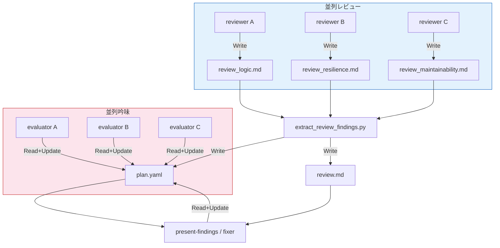

# DES-021 reviewer 観点別 agent 分割 設計書

## メタデータ

| 項目   | 値         |
| ------ | ---------- |
| 設計ID | DES-021    |
| 作成日 | 2026-03-20 |

---

> 対象プラグイン: forge | スキル: `/forge:reviewer`

---

## 1. 概要

現在の reviewer は 1 つの subagent に全レビュー観点を同時適用している。これにより:

1. **重大度バイアス**: 見つけやすい 🟢（スタイル）が過剰、見つけにくい 🔴（ロジックバグ）が過少
2. **深さの犠牲**: 全観点を広く浅くカバーし、各観点での深い分析ができない
3. **コンテキスト競合**: バグ探しとスタイルチェックが同じ注意リソースを奪い合う

本設計では review_criteria を観点（Perspective）別に分割し、Perspective ごとに専門の Agent を並列起動してレビュー品質を向上させる。

---

## 2. review_criteria の分割と配置

### 配置先

review_criteria_spec.md の唯一の起点は review オーケストレーター。他スキル（reviewer/evaluator/fixer）は refs.yaml 経由で読むだけ。→ review スキルディレクトリに配置する。

```
plugins/forge/skills/review/
  docs/
    review_criteria_requirement.md   # 要件定義書レビュー観点
    review_criteria_design.md        # 設計書レビュー観点
    review_criteria_plan.md          # 計画書レビュー観点
    review_criteria_code.md          # コードレビュー観点
    review_criteria_generic.md       # 汎用文書レビュー観点
```

各ファイルにはレビュー観点を詳細に記載する（現在の箇条書きレベルから大幅拡充）。旧ファイル `plugins/forge/docs/review_criteria_spec.md` は削除する。

### 設計変更

現在の `review_criteria_path`（単一パス）の概念はなくなる。refs.yaml には `review_criteria_path` を書かず、代わりに `perspectives` 配列で観点ごとの入力・出力を管理する。

### perspectives の収集

review オーケストレーターは以下の全てから perspectives を収集し、配列に追加する。**プラグインデフォルト + DocAdvisor 追加を合わせて最大 5 perspectives** をガイドラインとする。超過する場合は DocAdvisor 側を優先度順に絞り込む。

**プラグインデフォルト**（常に含む）: `${CLAUDE_SKILL_DIR}/docs/review_criteria_{type}.md` を読み込み、`## Perspective:` セクションから perspectives を構成する。セクションがない場合はファイル全体を単一 perspective として扱う。

**Perspective 見出しフォーマット**:

```
## Perspective: {name} — {表示名}
```

- `{name}`: 英語小文字の識別子（例: `logic`, `resilience`）。refs.yaml の `name` フィールドと `output_path`（`review_{name}.md`）に使用する
- `{表示名}`: 人間向けの表示名（例: `正確性 (Logic)`）。present-findings のサマリー表示に使用する
- 解析は review オーケストレーター（AI）が行う。スクリプトでのパースは不要

**DocAdvisor**（`/query-rules` が利用可能なら追加）: DocAdvisor が返すプロジェクト固有のルール文書を、そのまま追加の perspective として渡す。`section: null` でファイル全体を観点として使用。

```yaml
perspectives:
  - name: logic
    criteria_path: "review/docs/review_criteria_code.md"
    section: "正確性 (Logic)"
    output_path: review_logic.md
  - name: resilience
    criteria_path: "review/docs/review_criteria_code.md"
    section: "堅牢性 (Resilience)"
    output_path: review_resilience.md
  - name: project-rules
    criteria_path: "docs/rules/coding_standards.md"
    section: null
    output_path: review_project_rules.md
```

`section: null` の場合、agent はファイル全体を観点として使用する。

---

## 3. 複数 Reviewer Agent の起動

### refs.yaml の拡張

#### perspectives オブジェクトのスキーマ

| フィールド      | 型             | 必須 | 説明                                                                         |
| --------------- | -------------- | ---- | ---------------------------------------------------------------------------- |
| `name`          | string         | Yes  | perspective の一意識別子（例: `logic`, `resilience`）                        |
| `criteria_path` | string         | Yes  | レビュー観点ファイルのパス（プラグインルートからの相対パス）                 |
| `section`       | string \| null | No   | criteria ファイル内の対象セクション名。`null` の場合はファイル全体を使用する |
| `output_path`   | string         | Yes  | レビュー結果の出力先（session_dir からの相対パス）                           |

#### 検証要件

- `name` は `^[a-z0-9_-]+$` に限定する（英小文字・数字・アンダースコア・ハイフンのみ）
- `output_path` は session_dir からの相対パスのみ許可する。`../` を含むパスおよび絶対パスは拒否する
- 検証は `write_refs.py` で実施する（perspectives フィールド追加時に組み込む）

```yaml
target_files: [...]
reference_docs: [...]
perspectives:
  - name: logic
    criteria_path: "review/docs/review_criteria_code.md"
    section: "正確性 (Logic)"
    output_path: review_logic.md # session_dir からの相対パス
  - name: resilience
    criteria_path: "review/docs/review_criteria_code.md"
    section: "堅牢性 (Resilience)"
    output_path: review_resilience.md
  - name: maintainability
    criteria_path: "review/docs/review_criteria_code.md"
    section: "保守性 (Maintainability)"
    output_path: review_maintainability.md
```

review オーケストレーターが criteria ファイルを読み、`## Perspective:` セクションを抽出して perspectives 配列を構成し refs.yaml に書き出す。reviewer は refs.yaml の perspectives を読むだけで、分割ロジックを持たない。

### reviewer の入力変更

reviewer は1回の呼び出しで **1 perspective のみ処理する**。オーケストレーターが perspectives の数だけ reviewer を並列起動する。

| 入力                 | 現行 | 変更後                                               |
| -------------------- | ---- | ---------------------------------------------------- |
| session_dir          | ✅   | ✅                                                   |
| 種別                 | ✅   | ✅                                                   |
| エンジン             | ✅   | ✅                                                   |
| review_criteria_path | ✅   | ❌ 廃止                                              |
| perspective_name     | —    | ✅ 新規（例: `logic`）                               |
| criteria_path        | —    | ✅ 新規（例: `review/docs/review_criteria_code.md`） |
| section              | —    | ✅ 新規（例: `正確性 (Logic)`）                      |
| output_path          | —    | ✅ 新規（例: `review_logic.md`）                     |

reviewer は `criteria_path` + `section` を読み、該当観点に従ってレビュー。結果は `{session_dir}/{output_path}` に Write する。

### Codex 対応

`run_review_engine.sh` は単一プロセス実行のまま維持する。並列制御は以下の方針でオーケストレーター側が担当する。

> **設計判断**: Codex エンジンの場合、orchestrator が `run_review_engine.sh` を直接並列起動する（reviewer スキルを経由しない）。Claude エンジンでは `/forge:reviewer` subagent を並列起動する。この非対称性は、Codex 時に reviewer を経由すると「orchestrator → reviewer subagent → Codex subprocess」の二重間接となり、N 個の subagent 起動オーバーヘッドが無駄になるため。reviewer スキルの責務（criteria 読み込み・レビュー実行・結果書き出し）は Codex 時にはプロンプト構成で代替される。

1. review オーケストレーターが perspectives の数だけ `run_review_engine.sh` をバックグラウンド起動する
2. 各プロセスには perspective 固有の `output_file`（= `output_path`）と `prompt`（= `criteria_path` + `section` を含む指示）を渡す
3. 全プロセスの完了を `wait` で待機する
4. いずれかのプロセスが失敗した場合、その perspective のレビュー結果は欠損として扱い、成功した perspective の結果のみで続行する
5. 成功 perspective が 0 件の場合は hard fail（エラー終了）する。全 perspective が失敗した場合を「問題なし」と誤認させない
6. Codex 不在（exit code=2）の場合は当該 perspective を即時 Claude フォールバックに切り替える（全 perspective が code=2 の場合は `run_review_engine.sh` の呼び出し自体を Claude に一括切替）

```bash
# オーケストレーター側の並列起動イメージ（疑似コード）
pids=()
for perspective in perspectives; do
    run_review_engine.sh "${session_dir}/${perspective.output_path}" \
        "$project_dir" "$prompt" &
    pids+=($!)
done

# 全プロセスの完了を待機
for pid in "${pids[@]}"; do
    wait "$pid" || echo "perspective failed: $pid"
done
```

Claude エンジンの場合は `/forge:reviewer` の subagent を perspectives の数だけ並列起動し、同様に全完了を待機する。

---

## 4. 複数結果の管理

```
{session_dir}/
  review_logic.md     # Perspective A: reviewer 出力 → evaluator が吟味済み
  review_resilience.md      # Perspective B: 同上
  review_maintainability.md # Perspective C: 同上
  plan.yaml                 # 全指摘の統合管理（extract が生成。recommendation, auto_fixable, perspective を含む）
  review.md                 # extract が生成: 重複除去・統合済みのレビュー結果
```

evaluation.yaml は廃止し、その内容（recommendation, auto_fixable, reason）を plan.yaml に統合する。

### plan.yaml スキーマ変更

evaluation.yaml 廃止に伴い、`plan.yaml` の `items[]` に以下のフィールドを追加する:

| フィールド       | 型       | 必須 | 説明                                                                                     |
| ---------------- | -------- | ---- | ---------------------------------------------------------------------------------------- |
| `recommendation` | string   | 条件 | evaluator が付与。`fix` / `skip` / `needs_review`。evaluator 実行前は未設定              |
| `auto_fixable`   | boolean  | 条件 | `recommendation: fix` の場合のみ。修正が一意・局所的・機械的か                           |
| `reason`         | string   | 条件 | evaluator の判定理由。`recommendation` 設定時に必須                                      |
| `perspective`    | string   | 任意 | 指摘元の perspective 名。extract_review_findings.py が付与                               |
| `perspectives`   | string[] | 任意 | 重複統合時に複数 perspective が同一箇所を指摘した場合、統合元の perspective 名を全て記録 |

**読み取り契約**:

| スキル                    | 読み取るフィールド                         | 用途                                                             |
| ------------------------- | ------------------------------------------ | ---------------------------------------------------------------- |
| present-findings          | `recommendation`, `auto_fixable`, `reason` | AI推奨の表示、✅マーク判定                                       |
| fixer                     | `recommendation`, `auto_fixable`           | 修正対象の判定（`fix` かつ `auto_fixable: true` → 自動修正対象） |
| review オーケストレーター | `recommendation`                           | `should_continue` 判定（`fix` が0件なら終了）                    |

**移行**: session_format.md の plan.yaml スキーマにも同様のフィールドを追加する（実装順序 §7 参照）。

### パイプライン

```
reviewers (並列) → review_*.md
    ↓
extract_review_findings.py → plan.yaml + review.md（統合・重複除去・重大度差異フラグ）
    ↓
evaluators (並列、perspective ごと) → plan.yaml を更新（recommendation, auto_fixable, reason を付与）
    ↓
present-findings / fixer → review.md + plan.yaml 参照
```



各 evaluator は 1 perspective の findings のみ処理するため、コンテキストサイズは現行と同等。

### evaluator の並列実行

reviewer と同様に、evaluator も perspective ごとに並列起動する。

#### 並列 agent の出力契約パターン [MANDATORY]

> 詳細は [DES-022_parallel_agent_output_contract_design.md](DES-022_parallel_agent_output_contract_design.md) を参照。

並列実行される agent は共有リソース（plan.yaml 等）に直接書き込まない。代わりに以下のパターンに従う:

1. **各 agent は個別の結果ファイルを Write する**（書き込み先が重ならない）
2. **各 agent は完了通知のみを orchestrator に返す**（Agent ツールの戻り値）
3. **orchestrator は全 agent の完了後に結果ファイルを収集し、共有リソースを1回だけ更新する**

このパターンは reviewer（`review_{perspective}.md` → `extract_review_findings.py`）で既に使用しており、evaluator にも同じパターンを適用する。

#### evaluator の出力

各 evaluator は `{session_dir}/eval_{perspective_name}.json` を Write する:

```json
{
  "perspective": "logic",
  "updates": [
    {
      "id": 1,
      "status": "pending",
      "recommendation": "fix",
      "auto_fixable": true,
      "reason": "..."
    },
    {
      "id": 2,
      "status": "skipped",
      "skip_reason": "...",
      "recommendation": "skip",
      "reason": "..."
    }
  ]
}
```

**evaluator は plan.yaml に直接書き込まない。** 結果ファイルの Write のみを行う。

#### orchestrator による一括マージ

全 evaluator 完了後、review orchestrator が:

1. `eval_*.json` を glob で収集する
2. 全 `updates` 配列を結合する
3. `update_plan.py --batch` を1回だけ呼び出して plan.yaml を更新する

これにより plan.yaml への書き込みは1回に限定され、並列書き込み競合が根本的に排除される。

### extract_review_findings.py の拡張

現行の `extract_review_findings.py` は単一ファイル引数（`<review_md_path>`）を受け取る設計。perspectives 対応に伴い、以下のように変更する:

1. **引数を `session_dir` に変更**: 第1引数に session_dir パスを受け取り、`review_*.md` を glob で収集する
2. **ID はファイル間通し番号**: 複数ファイルをアルファベット順に処理し、ID はファイルをまたいで連番で付与する
3. **perspective タグの付与**: ファイル名から perspective 名を抽出する
4. **重複除去と統合**（ベストエフォート）: 以下のヒューリスティクスで重複を検出し、統合する:
   - **検出方法**: タイトル文字列の類似度 + 箇所（`- 箇所:` 行）の文字列マッチで判定する。reviewer 出力は自由記述形式のため、構造化メタデータに依存しない
   - **精度の制約**: 箇所の記述が異なる場合（例: 同一問題をセクション名 vs 行番号で参照）は重複として検出されない可能性がある。これは許容する（重複が残っても fixer が同一箇所を二重修正するリスクは低い）
   - **統合ルール**（重複検出時）:
   - **severity**: 最も高いものを採用（🔴 > 🟡 > 🟢）
   - **description**: 両 perspective の説明を結合して残す（異なる観点からの知見は修正時に有用）
   - **recommendation**: いずれかが fix → fix を採用
   - **auto_fixable**: 全 perspective が true の場合のみ true
   - **perspectives**: 統合元の perspective 名を全て記録（複数 perspective が同一箇所を指摘していること自体が重要度のシグナル）
5. **review.md の生成**: 統合済みのレビュー結果を review.md として出力する

```
# 新しい Usage
python3 extract_review_findings.py <session_dir>
# 出力: {session_dir}/plan.yaml + {session_dir}/review.md
```

実装では `extract_review_findings.py` は CLI orchestration に絞る。review markdown の parse は
`plugins/forge/scripts/review/findings_parser.py`、`plan.yaml` / `review.md` の文字列生成は
`plugins/forge/scripts/review/findings_renderer.py` が担う。session_dir mode の書き込みは
`SessionStore` 経由で行い、artifact write、monitor 通知、`session.yaml` meta 更新の順序を統一する。

---

## 5. 観点の分割方針

**perspectives 配列の構成は review オーケストレーターの責務であり、reviewer は分割方針を持たない。** 各 review_criteria ファイルが `## Perspective:` セクションで分割を宣言し、review オーケストレーターがそれを読み取って perspectives 配列を構成する。reviewer は refs.yaml に記録された perspectives を読み取り、指定された観点に従ってレビューを実行するだけである。

責務の分離:

| コンポーネント             | 責務                                                                                                                                        |
| -------------------------- | ------------------------------------------------------------------------------------------------------------------------------------------- |
| review_criteria ファイル   | `## Perspective:` セクションで観点の分割を宣言する                                                                                          |
| review オーケストレーター  | criteria ファイルを読み、perspectives 配列を構成し refs.yaml に書き出す                                                                     |
| reviewer                   | refs.yaml の perspectives を読み、指定された観点に従ってレビューを実行する                                                                  |
| evaluator                  | perspective ごとに並列起動。各 `review_{perspective}.md` の指摘を5観点で個別吟味する（現行と同じ責務、入力が perspective 単位に変わるのみ） |
| extract_review_findings.py | 吟味済みの複数 `review_*.md` を統合し、重複除去・重大度差異フラグ・review.md + plan.yaml を生成する                                         |

---

## 6. 各種別の Perspective 定義

### requirement（要件定義書）— 3 perspectives

| Perspective                    | 観点                                                                                       |
| ------------------------------ | ------------------------------------------------------------------------------------------ |
| **完全性 (Completeness)**      | 必須要件の網羅性、非機能要件の不足（性能・運用・セキュリティ等）、例外系・異常系の考慮漏れ |
| **整合性 (Consistency)**       | 要件間の矛盾・競合、用語定義の不統一、ビジネスゴールとの追跡性（トレーサビリティ）         |
| **検証可能性 (Verifiability)** | 曖昧な表現の排除、定量的な受け入れ基準、技術的制約との矛盾、優先度・スコープの明確さ       |

### design（設計書）— 3 perspectives

| Perspective                   | 観点                                                                                                                     |
| ----------------------------- | ------------------------------------------------------------------------------------------------------------------------ |
| **整合性 (Alignment)**        | 要件定義書との不整合、外部システム・既存コンポーネントとのインターフェース、データフローの矛盾・欠落、設計判断の根拠不足 |
| **構造・品質 (Architecture)** | 責務分割（疎結合・高凝集）、アーキテクチャ原則の遵守、拡張性・保守性の問題                                               |
| **堅牢性 (Resilience)**       | セキュリティ上の問題、エラーハンドリングの不足、可観測性（ログ・監視・追跡可能性）                                       |

### plan（計画書）— 2 perspectives

| Perspective                      | 観点                                                                                       |
| -------------------------------- | ------------------------------------------------------------------------------------------ |
| **整合性 (Alignment)**           | 要件・設計との不整合、必須タスクの網羅、タスク間の依存関係の矛盾                           |
| **現実性・リスク (Feasibility)** | タスク粒度の妥当性、ボトルネックの特定、リスク対策の妥当性、受け入れ基準の明確さ、優先順位 |

### code（コード）— 3 perspectives

| Perspective                  | 観点                                                                                                           |
| ---------------------------- | -------------------------------------------------------------------------------------------------------------- |
| **正確性 (Logic)**           | ロジックエラー、エッジケース、境界値、データ損失リスク、設計書・要件定義書との不整合                           |
| **堅牢性 (Resilience)**      | セキュリティ脆弱性（インジェクション、認証不備等）、エラーハンドリングの不足、リソース管理、入力バリデーション |
| **保守性 (Maintainability)** | コーディング規約遵守、可読性、テスト可能性（DI 等の構造）、テスト充足度、重複、パフォーマンス問題              |

### generic（汎用文書）— perspectives 分割なし（単一 agent）

汎用文書は内容が多様で、perspectives 分割のメリットが薄いため、従来通り単一 agent で全観点を適用する。
`review_criteria_generic.md` は `## Perspective:` セクションを持たず、全観点を一括記載する。
refs.yaml の perspectives には単一要素を格納する: ファイル全体を観点とする perspective（`section: null`）を設定し、他の種別と同じスキーマを維持する。

| 観点                                                                             |
| -------------------------------------------------------------------------------- |
| 事実の誤り、論理矛盾、参照切れ（リンク・ファイルパス・コマンド）、必須情報の欠落 |
| 論理構成の一貫性、用語の不統一、記述の重複、冗長性の排除                         |

```yaml
# generic の perspectives 例
perspectives:
  - name: generic
    criteria_path: "review/docs/review_criteria_generic.md"
    section: null
    output_path: review_generic.md
```

---

## 7. 影響範囲

| ファイル                            | 変更内容                                                                                                                                                   |
| ----------------------------------- | ---------------------------------------------------------------------------------------------------------------------------------------------------------- |
| `review/SKILL.md`                   | perspectives 収集・構成追加、`review_criteria_path` 廃止                                                                                                   |
| `reviewer/SKILL.md`                 | `review_criteria_path` 廃止、perspectives 対応                                                                                                             |
| `evaluator/SKILL.md`                | `review_criteria_path` 廃止、perspective ごとの並列起動対応（入力が review_{perspective}.md に変更）、evaluation.yaml 廃止・plan.yaml への統合             |
| `fixer/SKILL.md`                    | 単独呼び出し時の参考文書フォールバックパスを更新（通常フローでは影響なし）                                                                                 |
| `session_format.md`                 | refs.yaml に perspectives 追加、`review_criteria_path` 削除、evaluation.yaml 廃止・plan.yaml に統合、plan.yaml items に perspective フィールド（任意）追加 |
| `write_evaluation.py`               | 廃止。evaluator は plan.yaml を直接更新する                                                                                                                |
| `extract_review_findings.py`        | 複数 review_*.md のマージ対応                                                                                                                              |
| `write_refs.py`                     | `review_criteria_path` を廃止し `perspectives` を必須フィールドに変更                                                                                      |
| `test_write_evaluation.py`          | 廃止（write_evaluation.py 廃止に伴い削除）                                                                                                                 |
| `test_extract_review_findings.py`   | 更新（multi-file merge / partial-failure / all-failure / generic 対応テスト追加）                                                                          |
| `test_write_refs.py`                | 更新（perspectives 必須フィールド対応）                                                                                                                    |
| `README.md`, `README_ja.md`         | パス参照更新                                                                                                                                               |
| `CLAUDE.md`                         | パス参照更新                                                                                                                                               |
| `DES-015_review_workflow_design.md` | データフロー図更新                                                                                                                                         |

### 実装順序

影響範囲の更新は以下の順序で適用する。スキーマ定義を先に確定し、依存先から順に更新することで段階的移行時の参照不整合を防ぐ。

1. `session_format.md` — スキーマ定義を先に確定（perspectives / plan.yaml 新フィールド）
2. `review_criteria_*.md` — 観点ファイルの作成（`## Perspective:` セクション付き）
3. SKILL.md 群 — reviewer → evaluator → review → fixer → present-findings の順で更新
4. スクリプト — `write_refs.py`（perspectives 対応）→ `extract_review_findings.py`（multi-file 対応）→ `write_evaluation.py` 廃止
5. テスト — 新規追加 → 既存更新 → 廃止テスト削除
