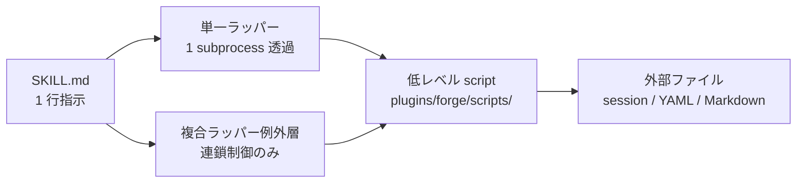
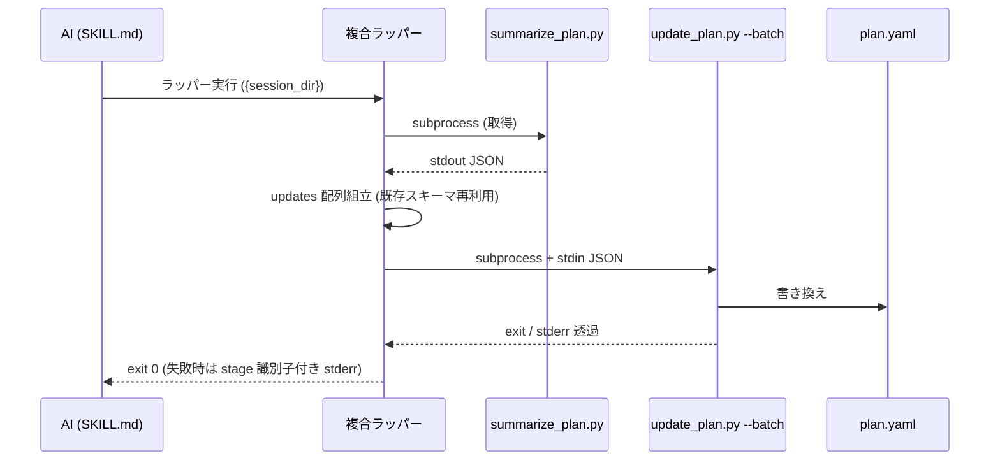

# DES-024 SKILL.md と script の配置・契約設計

## メタデータ

| 項目       | 値                |
| ---------- | ----------------- |
| 設計 ID    | DES-024           |
| プラグイン | forge             |
| 種別       | 設計 (How の決定) |
| 関連要件   | REQ-003           |

---

## 1. 概要

本設計は REQ-003「SKILL.md と script の責務分離」の How を定める。

**SKILL.md → wrapper → 低レベル script → 外部ファイル** の一方向依存を確立し、ラッパーの判断基準・命名規則・配置原則を明文化する。SKILL.md は 1 行指示のみを保持し、状態遷移・flag 合成・JSON スキーマは低レベル script に閉じる。

## 2. ラッパーの型

### 2.1 単一ラッパー (primary)

1 subprocess を透過的に呼ぶラッパー。本設計のデフォルト分類で、ほぼ全てのラッパー (`find_session` / `init_session` / `resolve_*` / `mark_*` / `update_*` 等) がこれに該当する。

### 2.2 複合ラッパー (例外層)

複数 subprocess を合成するラッパー。以下を全て満たすときのみ追加可:

- 単一 SKILL に閉じた一括操作 (汎用化禁止)
- 低レベル CLI の既存 JSON スキーマのみ再利用 (新規スキーマ定義禁止)
- ビジネスロジックを持たない (連鎖制御のみ)
- 失敗時は stderr 先頭行に `stage={識別子} exit={子プロセス exit code}` を付ける

### 2.3 共通原則 (全ラッパー)

- hardcoded 値 (`--skill {name}` / `--doc-type {type}` 等の SKILL 自明値) を埋め込む
- 位置引数のみ受ける
- exit code / stdout / stderr を透過
- ガード追加なし / retry なし / timeout なし

### 2.4 ラッパー化判断基準

**作る** (いずれかを満たす):

1. SKILL 固有値の hardcode (`--skill {name}` / `--doc-type {type}` / `--status fixed` 等)
2. 複合操作 (複数の低レベル script を pipeline 化)
3. モード意味付け (低レベルの mode flag に SKILL の意味的単位を与える)

**作らない** (以下のみの場合):

- 命名変換のみ (subcommand を script 名にするだけ)
- パス短縮のみ (深いディレクトリ参照を浅くするだけ)
- 引数フォーマット変換のみ (位置引数 → flag 名前付け、hardcode 値なし)

判断基準の根拠: 命名変換・パス短縮・引数フォーマット変換のみのラッパーは、複数 SKILL に同一実装が量産され DRY 違反になる、ラッパー名と低レベル CLI 名が 1:1 対応で意味的差分がなく間接層の意義がない、保守時に低レベル変更がラッパー全コピーに波及する、の 3 点で害が利を上回る。

## 3. 配置基準

### 3.1 script の 2 分類

- **低レベル script**: `plugins/forge/scripts/{domain}/`
  実体ロジックを持つ。複数ラッパーから再利用される。
- **SKILL 固有ラッパー**: `plugins/forge/skills/{skill}/scripts/`
  単一 SKILL からのみ呼ばれる薄い wrapper。

### 3.2 共有ラッパー層を作らない

複数 SKILL から同じ operation を呼びたくなった場合、それは wrapper ではなく低レベル script の責務である。中間に「共有ラッパー層」を作ると配置判断が複雑化し、二重実装の温床になる。各 SKILL はそれぞれ薄いラッパーで委譲する (またはラッパーなしで低レベルを直接呼ぶ)。

### 3.3 低レベル script は原則変更しない [MANDATORY]

ラッパーは subprocess 呼び出しのみ。低レベル script への新 API 追加 (use-case 関数・共通ヘルパ等) も既存 CLI の引数仕様変更も行わない。

唯一の例外: 既存 CLI に明確なバグがあり、ラッパーの動作に直接支障をきたす場合のみ最小限の修正を許容する。

## 4. 命名規則

- operation 名 (動詞主体) を使う: `find_session.py` / `init_session.py` / `mark_skipped.py` / `resolve_doc.py`
- 低レベル script 名はラッパー名に含めない (`update_plan_batch_wrapper.py` のような名前を避ける)
- 同一 operation を複数 SKILL が持つ場合、ファイル名は揃える (例: `find_session.py` は全 SKILL 共通)

## 5. SKILL.md 側の記述ルール

- flag 付きの低レベル呼び出しは書かない
- script 呼び出しは位置引数のみの 1 行
- 禁止警告は書かない (REQ-003 FNC-004)
- 同一場面で AI が選択する script 候補は 1 つに確定 (REQ-003 FNC-003)

## 6. モジュール一覧と依存方向

### 6.1 層構造

| 層              | 配置                                                  | 役割                                                       |
| --------------- | ----------------------------------------------------- | ---------------------------------------------------------- |
| SKILL.md        | `plugins/forge/skills/{skill}/SKILL.md`               | 1 行指示 (呼ぶべき wrapper + 位置引数)                     |
| 単一ラッパー    | `plugins/forge/skills/{skill}/scripts/{operation}.py` | 低レベル CLI 1 本を subprocess で呼ぶ薄い wrapper          |
| 複合ラッパー    | `plugins/forge/skills/{skill}/scripts/{operation}.py` | 複数低レベル CLI を連鎖呼び出し (例外層)                   |
| 低レベル script | `plugins/forge/scripts/{domain}/{script}.py`          | 状態遷移・flag 合成・JSON スキーマを閉じ込める本体ロジック |
| 外部ファイル    | session / `.doc_structure.yaml` / plan.yaml 等        | 永続状態・設定・成果物                                     |

### 6.2 依存方向

依存は **SKILL.md → wrapper (単一 / 複合) → 低レベル script → 外部ファイル** の一方向。wrapper 同士の呼び出し・低レベル → wrapper の逆流・SKILL.md 間の直接参照はいずれも禁止。



### 6.3 Yes/No 判定可能な性質

- 低レベル script が wrapper / SKILL.md を import していない
- wrapper が他 skill の wrapper を呼んでいない
- 複合ラッパーが §2.2 の制約を全て満たす

## 7. 実装テンプレート

### 7.1 単一ラッパー (代表例: `find_session.py`)

```python
#!/usr/bin/env python3
"""find session for {skill}"""
import subprocess, sys
from pathlib import Path

LOW_LEVEL = Path(__file__).resolve().parents[3] / "scripts" / "session_manager.py"

def main() -> int:
    r = subprocess.run(
        [sys.executable, str(LOW_LEVEL), "find", "--skill", "{skill_name}"],
        check=False,
    )
    return r.returncode

if __name__ == "__main__":
    sys.exit(main())
```

`{skill_name}` は配置 SKILL ごとに hardcode する (例: `start-plan` / `review`)。

### 7.2 複合ラッパー (代表例: `skip_all_unprocessed.py`)

複合ラッパーは複数段の subprocess を連鎖させ、失敗時に stage 識別子で障害切り分けを可能にする。



stderr 契約 (失敗時のみ stderr 先頭行に付与):

- `stage={識別子} exit={子プロセス exit code}`
- 識別子例: `stage=summarize_plan` / `stage=json_build` / `stage=update_plan`
- 子プロセスの stderr は識別子行の後にそのまま透過する

正常時は stderr に追記しない (§2.3 共通原則の透過のみ)。

## 8. テスト原則

CLAUDE.md の `plugins/forge/skills/*/scripts/` テスト必須要件に従う。

- subprocess 引数検証 (モック / fake で低レベルを差し替え、hardcode 値含む引数を確認)
- exit code 透過 (低レベルが返す code をラッパーが同じ code で終了)
- 位置引数バリデーションは低レベル側に委ね、ラッパーでは検証しない
- 配置: `tests/forge/{skill}/test_{operation}.py`

## 9. 非採用案

| 案                                                                | 不採用理由                                                                                                      |
| ----------------------------------------------------------------- | --------------------------------------------------------------------------------------------------------------- |
| `plugins/forge/scripts/` に共通ラッパー層を新設                   | §3.2 で禁止 (共有ラッパー層は作らない)。複合ラッパーは SKILL 配下に閉じた別物                                   |
| 低レベル script に use-case 関数 API を追加して SKILL から import | §3.3 [MANDATORY] で禁止 (低レベル変更禁止)                                                                      |
| 単一 wrapper から `--optional` flag 等で分岐                      | REQ-003 FNC-003 (flag 分岐構造を避ける) に違反                                                                  |
| ラッパーに新規ガード / エラーメッセージ / help を実装             | §2.3 共通原則 (subprocess 呼び出しのみ) に違反                                                                  |
| 単一 wrapper に複合操作を畳み込む                                 | §2.2 の例外層制約 (新規スキーマ禁止・連鎖制御のみ) を侵す。判断基準 §2.4 も「複合操作」を独立カテゴリとして扱う |

## 10. 関連文書

- [REQ-003 SKILL.md と script の責務分離要件](../requirements/REQ-003_skill_script_separation.md) — 本設計の要件源
- [DES-011 セッション管理設計書](DES-011_session_management_design.md) — セッションファイル現行仕様。SKILL.md の構造パターン (§3) と相補
- [DES-022 並列 agent 出力契約パターン設計](DES-022_parallel_agent_output_contract_design.md) — agent 間ファイル契約。本設計の依存方向と整合
- [DES-014 オーケストレータ・セッション通信プロトコル設計](DES-014_orchestrator_session_protocol_design.md) — オーケストレータ層のセッション通信
