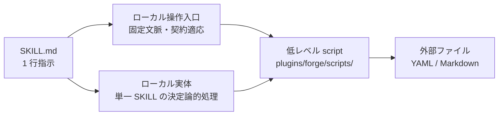
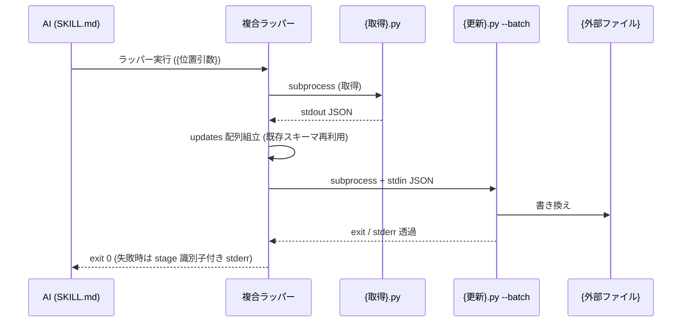

# DES-024 SKILL.md と script の配置・契約設計

## 1. 概要

本設計は REQ-003「SKILL.md と script の責務分離」の How を定める。

**SKILL.md → SKILL ローカル操作入口 → 共有低レベル script → 外部ファイル** の一方向依存を確立し、操作入口の判断基準・命名規則・配置原則を明文化する。

SKILL.md はユーザー意図の解釈、進行管理、現在状態に基づく分岐、ユーザー対話を担う。script は固定値の適用、機械的な導出・変換・検証、決定論的処理を担う。境界の合否は flag・位置引数・ファイル数ではなく、AI に未決定の意味的選択が残るかで判定する（ADR-070）。

低レベル script は複数 SKILL が再利用する汎用処理を所有し、各 SKILL 配下の操作入口は SKILL 固有値を束縛し、公開操作を必要範囲へ限定する。操作入口同士が固定値以外で同一でも、この配置は AI の選択領域を除去し、SKILL 間の依存と共有領域への固有値混入を防ぐための意図的な境界である。

## 2. SKILL ローカル操作入口の型

`plugins/forge/skills/{skill}/scripts/` にはラッパーだけでなく、単一 SKILL が所有する決定論的な実体ロジックも置かれる。本節のラッパー契約は、共有低レベル script を委譲するファイルに適用する。

### 2.1 固定文脈アダプタ

共有低レベル CLI に必要な SKILL 固有値を束縛する。代表例は category `rules` / `specs`、文書種別、SKILL 名である。

- 固定値を AI から受け取らない
- 低レベル CLI の配置を SKILL.md へ公開しない
- 当該 SKILL が必要とする操作・引数だけを受理する
- 低レベル CLI に将来追加された引数を自動的に公開しない

### 2.2 操作契約アダプタ

共有低レベル CLI の複数機能から、当該 SKILL が使う操作だけを公開する。低レベル引数を無条件に透過せず、許可する operation と入力の対応を明示する。

同一場面で競合する意味的 operation は別入口へ分ける。同一資源の順序付き位相は、SKILL の現在状態から呼び出しが一意に決まる場合、同じ入口の明示モードとしてよい。

例: `sync_documents.py --start` と `sync_documents.py --status <job_id>` は同一同期ジョブの「投入→観測」という順序付き位相である。各場面の呼び出しは確定済みであり、AI が方針を自由選択する構造ではないため、同じ入口に保つ。

### 2.3 I/O アダプタ

低レベル script の入出力と SKILL が必要とする副作用を適応する。低レベル script が NFR 上「元ファイルを書き換えない」と決まっており、更新後の内容を **stdout のみに出力する** 場合（例: `update_version_files.py`）、当該低レベルを呼ぶラッパーは次を担う:

- `subprocess.run(..., capture_output=True, text=True)` で stdout を取得する
- stderr はそのまま透過出力する（status JSON を呼び出し元へ届ける）
- exit code は透過する
- `rc == 0` AND `stdout` 非空 → 対象ファイルへ書き戻す
- `rc == 0` AND `stdout` 空 (optional skipped 等) → 書き戻しをスキップ
- `rc != 0` → 書き戻さない（元ファイル保護）

この類型は対象を **「低レベルが stdout-only 設計の場合のみ」** に限定する。

### 2.4 複合操作アダプタ

単一 SKILL に閉じた複数の低レベル処理を、決定論的な一操作へ合成する。次を全て満たす場合に追加できる:

- SKILL の各場面で同じ連鎖を必ず実行する
- AI の意味的判断を途中へ埋め込まない
- 共有すべき実体ロジックを複製しない
- 失敗段階を機械判定可能な出力で返す

### 2.5 ラッパー化判断基準

**作る**（いずれかを満たす）:

1. SKILL 固有値・固定方針を束縛する
2. 共有 CLI の公開操作を当該 SKILL の必要範囲へ狭める
3. 入出力または副作用を SKILL の契約へ適応する
4. 必ず一緒に行う複数処理を決定論的に合成する

**作らない**（以下のみの場合）:

- 命名変換だけで公開する意味・選択肢が変わらない
- パス短縮だけで、共有 CLI が既に SKILL の操作契約そのものである
- 位置引数と名前付き引数を相互変換するだけ
- mode をファイル名へ移すだけで、AI に残る意味的選択が減らない

### 2.6 意図的な重複の設計意図 [MANDATORY]

ラッパーの類似性や行数だけを理由に、削除または共有化してはならない。重複しているのは実体ロジックではなく、SKILL ごとに確定した共有 CLI の呼び出し契約である。

- **AI の判断領域を減らす**: SKILL.md に固定値を記載しても、自然言語を実行する AI はパス・flag・値を組み立てる必要がある。固定値をローカル入口で束縛し、省略・取り違え・別 SKILL との混同を構造的に除く
- **SKILL のローカル操作面を保つ**: 各 SKILL は他 SKILL のラッパーや固定値を知らず、自身のディレクトリにある操作入口だけを呼ぶ。ここでいう独立性は低レベル実装の複製ではなく、呼び出し契約の局所性を指す
- **共有領域を汎用処理に限定する**: `plugins/forge/scripts/{domain}/` は複数 SKILL が使う実体ロジックだけを持つ。SKILL 名・文書種別・カテゴリ等の利用文脈は各 SKILL 配下で束縛し、共有低レベル script に個別用途を持ち込まない
- **独立した変更余地を残す**: 現時点で同一形でも、各 SKILL の操作契約は別々に変更できる。共有ラッパーや単一 dispatcher に統合して、無関係な SKILL 同士を同じ分岐・引数契約へ結合しない

この設計は、ラッパーファイルと対応テストが増える保守コストを受け入れる。各テストが保証する中心事項は subprocess 配管そのものではなく、SKILL 固有値、許可する operation、受理する実行時データの組合せが正しいことである。

削除または低レベル script の直接呼び出しへ変更できるのは、§2.5 の「作る」基準をいずれも満たさず、AI に SKILL 固有値・固定方針・未決定の意味的選択を戻さない場合に限る。

## 3. 配置基準

### 3.1 script の配置

- **低レベル script**: `plugins/forge/scripts/{domain}/`
  複数 SKILL が再利用する汎用の実体ロジックを持つ。
- **SKILL ローカル script**: `plugins/forge/skills/{skill}/scripts/`
  単一 SKILL が所有する操作入口または決定論的な実体ロジックを持つ。共有低レベル script を委譲する場合に限り、本設計のラッパー契約を適用する。

### 3.2 共有ラッパー層を作らない

複数 SKILL から同じ operation を呼びたくなった場合、汎用の実体ロジックは低レベル script の責務である。中間に「共有ラッパー層」を作ると配置判断が複雑化し、二重実装の温床になる。SKILL 固有値を束縛する必要がある場合、各 SKILL はそれぞれローカルな操作入口で委譲する。§2.5 の「作る」基準に該当しない場合のみ、ラッパーなしで低レベルを直接呼ぶ。

### 3.3 公開契約を安定させる [MANDATORY]

SKILL.md が呼ぶローカル操作入口の path / 引数仕様 / stdout / stderr / exit code は公開契約であり、互換性を維持する。

共有低レベル script を SKILL.md が直接呼ぶ場合、その CLI も公開契約である。ローカルラッパーだけが呼ぶ低レベル CLI は内部契約であり、全 consumer とテストを同時に更新できる。ただし、低レベルへの機能追加をローカルラッパーが無条件に公開してはならない。

例:

- 低レベル script の内部処理を同一 domain 配下のモジュールへ移してもよい
- 同一 domain の script 群が共通モジュールを import してもよい
- ローカル操作入口の契約を維持したまま、内部の低レベル引数を変更してよい

## 4. 命名規則

- operation 名 (動詞主体) を使う: `scan_spec_ids.py` / `calculate_version.py` / `collect_modified_files.py` / `resolve_doc_structure.py`
- 低レベル script 名はラッパー名に含めない (`{low_level}_wrapper.py` のような名前を避ける)
- 同一 operation を複数 SKILL が持つ場合、ファイル名は揃える

## 5. SKILL.md 側の記述ルール

- 各場面で呼び出し全体を一意に確定する
- SKILL 固有値・固定方針を引数として AI に選ばせない
- 前段結果やユーザー入力として自然に得られる実行時データは、意味が明確になる形式で渡す
- 同一資源の順序付き位相は、現在状態から一意に決まる明示モードとして記述してよい
- script が返す進捗・診断情報を利用者へ届ける必要がある場合、必要な field の読み取りと報告を記述してよい
- 禁止警告は書かない (REQ-003 FNC-004)
- 同一場面で競合する script / mode / flag 候補を提示しない (REQ-003 FNC-003)

継承型 SKILL の `Skill` ツール起動は subprocess ではなく、Python ラッパーから実行する API も無い。この経路では、呼び出し元 SKILL.md 自体がローカル操作入口となる。`key` や category 等の固定値は、外部 SKILL の各起動箇所へ完全なリテラルとして記述し、AI が選ぶ候補や置換対象として示さない。異なる外部 SKILL の起動箇所が同じ固定値を必要とする場合も、それぞれの起動契約を自己完結させる。固定値の重複だけを理由に、実行不能な script ラッパーや共通 dispatcher を設けない。

## 6. モジュール一覧と依存方向

### 6.1 層構造

| 層                     | 配置                                                  | 役割                                                       |
| ---------------------- | ----------------------------------------------------- | ---------------------------------------------------------- |
| SKILL.md               | `plugins/forge/skills/{skill}/SKILL.md`               | 進行管理・意味的判断・ユーザー対話・確定済み操作の呼び出し |
| SKILL ローカル操作入口 | `plugins/forge/skills/{skill}/scripts/{operation}.py` | 固定文脈・公開操作・I/O・決定論的連鎖を SKILL の契約へ適応 |
| SKILL ローカル実体     | `plugins/forge/skills/{skill}/scripts/{operation}.py` | 単一 SKILL が所有する決定論的ロジック                      |
| 共有低レベル script    | `plugins/forge/scripts/{domain}/{script}.py`          | 複数 SKILL が再利用する汎用ロジック                        |
| 外部ファイル           | `.doc_structure.yaml` 等                              | 永続状態・設定・成果物                                     |

### 6.2 依存方向

依存は **SKILL.md → SKILL ローカル script → 共有低レベル script → 外部ファイル** の一方向。ローカルラッパー同士の呼び出し・低レベル → ローカル script の逆流・SKILL.md 間の直接参照はいずれも禁止。


```mermaid
flowchart LR
    SKILL[SKILL.md<br/>1 行指示]
    W1[ローカル操作入口<br/>固定文脈・契約適応]
    W2[ローカル実体<br/>単一 SKILL の決定論的処理]
    LL[低レベル script<br/>plugins/forge/scripts/]
    FS[外部ファイル<br/>YAML / Markdown]
    SKILL --> W1
    SKILL --> W2
    W1 --> LL
    W2 --> LL
    LL --> FS
```

### 6.3 Yes/No 判定可能な性質

- 低レベル script が wrapper / SKILL.md を import していない
- wrapper が他 skill の wrapper を呼んでいない
- 共有低レベル CLI の追加引数がローカル操作入口へ自動公開されない
- 複合操作アダプタが §2.4 の制約を全て満たす

## 7. 実装テンプレート

### 7.1 固定文脈アダプタ

実行時データを受け取らない形を基本テンプレートとする。固定文脈は位置引数に限定せず、低レベル CLI の契約に応じた名前付き引数でよい。

```python
#!/usr/bin/env python3
import subprocess
import sys
from pathlib import Path

LOW_LEVEL = (
    Path(__file__).resolve().parents[3] / "scripts" / "{domain}" / "{low_level}.py"
)
FIXED_ARGS = ["--{flag}", "{値}"]

def main() -> int:
    if len(sys.argv) != 1:
        print("usage: {operation}.py", file=sys.stderr)
        return 20
    r = subprocess.run(
        [sys.executable, str(LOW_LEVEL), *FIXED_ARGS],
        check=False,
    )
    return r.returncode

if __name__ == "__main__":
    sys.exit(main())
```

実行時データを 1 件受け取る場合は、検証後の値だけを固定文脈へ追加する。

```python
args = sys.argv[1:]
if len(args) != 1 or not args[0].strip():
    print("usage: {operation}.py <runtime-value>", file=sys.stderr)
    return 20
command = [sys.executable, str(LOW_LEVEL), *FIXED_ARGS, args[0]]
```

固定文脈は配置 SKILL ごとにラッパー内へ hardcode する。0 引数・1 引数のどちらでも受理形式を明示し、`sys.argv[1:]` を無条件に低レベルへ透過しない。usage error は domain の operation error 契約へ写像する。`parents[3]` はラッパーが `plugins/{plugin}/skills/{skill}/scripts/` に置かれることを前提とした相対解決である。

### 7.2 順序付き位相を持つ操作入口

同一資源の位相を 1 つの入口で公開する場合、受理する形式を列挙し、それ以外を拒否する。

```python
def build_command(args: list[str]) -> list[str] | None:
    if args == ["--start"]:
        return [sys.executable, str(LOW_LEVEL), FIXED_CONTEXT, "--start"]
    if (
        len(args) == 2
        and args[0] == "--status"
        and args[1]
        and args[1] == args[1].strip()
    ):
        return [
            sys.executable,
            str(LOW_LEVEL),
            FIXED_CONTEXT,
            "--status",
            args[1],
        ]
    return None
```

`--start` / `--status` は構文上の flag だが、SKILL の各場面で呼び出しが確定しているため許容される。低レベル CLI に別 mode が追加されても、この操作入口が明示的に採用するまで公開されない。

### 7.3 複合操作アダプタ

複合操作アダプタは複数段の subprocess を連鎖させ、失敗時に stage 識別子で障害切り分けを可能にする。§2.4 の制約を全て満たす場合にのみ追加できる。


```mermaid
sequenceDiagram
    participant AI as AI (SKILL.md)
    participant W as 複合ラッパー
    participant S as {取得}.py
    participant U as {更新}.py --batch
    participant F as {外部ファイル}

    AI->>W: ラッパー実行 ({位置引数})
    W->>S: subprocess (取得)
    S-->>W: stdout JSON
    W->>W: updates 配列組立 (既存スキーマ再利用)
    W->>U: subprocess + stdin JSON
    U->>F: 書き換え
    U-->>W: exit / stderr 透過
    W-->>AI: exit 0 (失敗時は stage 識別子付き stderr)
```

stderr 契約 (失敗時のみ stderr 先頭行に付与):

- `stage={識別子} exit={子プロセス exit code}`
- 識別子例: `stage={取得}` / `stage=json_build` / `stage={更新}`
- 子プロセスの stderr は識別子行の後にそのまま透過する

正常時は stderr に追記せず、子 process の stderr だけを透過する。

## 8. テスト原則

CLAUDE.md の `plugins/forge/skills/*/scripts/` テスト必須要件に従う。

- SKILL 固有値・固定方針が正しく束縛されること
- 許可された operation と実行時データだけを受理すること
- 不正な operation・欠落値・余分な引数を拒否すること
- 低レベル CLI に追加された引数を自動公開しないこと
- subprocess 引数検証 (モック / fake で低レベルを差し替え、固定値を含む引数を確認)
- exit code 透過 (低レベルが返す code をラッパーが同じ code で終了)
- 配置: `tests/forge/{skill}/test_{operation}.py`
- wrapper テストの assert ロジックは共通 helper へ寄せてよい
- 固定文脈以外が同一のラッパーでも、SKILL ごとの束縛契約を別々に検証する

### 8.1 適合レビューの契機

次の変更では、本設計への適合レビューを行う:

- SKILL.md に script または外部 SKILL の呼び出しを追加・変更するとき
- SKILL ローカル script を追加・削除・共有領域へ移動するとき
- 共有低レベル CLI の引数または operation を追加・変更するとき

レビューでは、各入力を REQ-003 FNC-002 の 4 分類へ割り当て、SKILL 固有値が束縛されていること、同一場面に競合する operation が残らないこと、低レベル CLI の追加引数が自動公開されないことを確認する。機械検証は、公開契約ごとの許可・拒否テスト、依存方向、無条件な `sys.argv[1:]` 透過の有無を対象とする。ユーザー意図や現在状態の解釈が必要かという意味的分類は機械判定へ置き換えず、上記の変更契機でレビューする。

## 9. 非採用案

| 案                                                                | 不採用理由                                                                            |
| ----------------------------------------------------------------- | ------------------------------------------------------------------------------------- |
| `plugins/forge/scripts/` に共通ラッパー層を新設                   | §3.2 で禁止。共有ロジックは低レベルへ、SKILL 固有契約は各ローカル入口へ置く           |
| SKILL 固有値を SKILL.md に戻して低レベル script を直接呼ぶ        | AI にパス・固定値の組み立てを戻し、REQ-003 FNC-002 / FNC-006 のローカル操作境界を失う |
| 固定値だけを引数に取る共有 dispatcher へ統合                      | AI に SKILL 名・category 等の選択を戻し、SKILL 間を同じ分岐契約へ結合する             |
| 低レベル script に use-case 関数 API を追加して SKILL から import | SKILL.md → ローカル script → 低レベル script の一方向依存に反する                     |
| 同一場面で競合する意味的 operation を単一 mode flag で公開する    | AI に未決定の選択を残し、REQ-003 FNC-003 に違反                                       |
| 順序付き位相を常に別 script へ分割する                            | 選択対象を mode からファイル名へ移すだけで、同一資源の凝集性を失う                    |
| 低レベル引数を `*sys.argv[1:]` で無条件に透過する                 | 低レベルの将来追加がローカル公開契約へ自動的に漏れる                                  |
| 単一 wrapper に判断を伴う複合操作を畳み込む                       | §2.4 の決定論的連鎖という制約を侵す                                                   |

## 10. 関連文書

- [REQ-003 SKILL.md と script の責務分離要件](../requirements/REQ-003_skill_script_separation.md) — 本設計の要件源
- [DES-022 並列 agent 出力契約パターン設計](DES-022_parallel_agent_output_contract_design.md) — 並列 agent の結果受け渡し契約（return value。中間ファイルを作らない）。本設計の依存方向と整合
