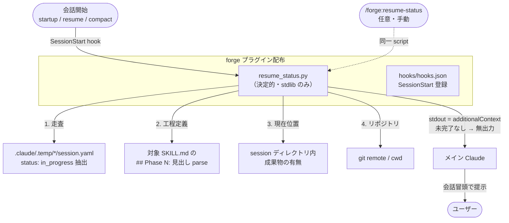

# DES-031 会話再開時の未完了作業 現在地提示 設計書

## メタデータ

| 項目       | 値                                                                                                                                                              |
| ---------- | --------------------------------------------------------------------------------------------------------------------------------------------------------------- |
| 設計 ID    | DES-031                                                                                                                                                         |
| 関連要件   | GitHub Issue #124（ユーザーストーリー・受け入れ基準の正本）                                                                                                     |
| 関連設計   | forge:DES-011_session_management_design, forge:DES-014_orchestrator_session_protocol_design                                                                     |
| 関連ルール | `plugins/forge/docs/session_format.md`, `docs/rules/skill_authoring_notes.md`                                                                                   |
| 作成日     | 2026-05-31                                                                                                                                                      |
| 適用範囲   | forge オーケストレータースキル（start-requirements / start-design / start-plan / start-implement / start-uxui-design / review）のセッション残骸検出と現在地提示 |

---

## 1. 概要

多 Phase の forge オーケストレータースキルは長時間に及び、会話の圧縮（compact）や新しい会話での再開（resume）時に「どのリポジトリで・何の作業を・全体のどこまで進んだか」を即座に把握できない。本設計は、未完了の長時間 SKILL 作業（`.claude/.temp/` のセッション残骸）を会話開始時に**自動検出し、4 項目（リポジトリ名 / 作業概要 / 全工程数・工程名 / 現在位置）を提示**する仕組みを定義する。

### 1.1 採用したアプローチ

**SessionStart hook + 決定的 script** を採用する。

- **検出・整形は決定的 Python script（`resume_status.py`）が担う**。stdlib のみ。`tests/forge/` でユニットテスト可能
- **発火は SessionStart hook**（matcher: `startup` / `resume` / `compact`）。hook の stdout は `hookSpecificOutput.additionalContext` として会話開始時に AI コンテキストへ自動注入される（Claude Code hooks 仕様で検証済み）
- script の出力（4 項目サマリ）を AI が会話冒頭でユーザーへ提示する
- **未完了作業が無ければ script は何も出力しない**（ノイズ抑制 = 受け入れ基準）

### 1.2 「推測で埋めない」の担保

受け入れ基準「提示情報は既存状態源から取得し、推測で埋めない」を構造的に守る:

| 項目                | 状態源（正本）                                                          | 推測排除の方法                                                                                                |
| ------------------- | ----------------------------------------------------------------------- | ------------------------------------------------------------------------------------------------------------- |
| ① リポジトリ名      | `git remote get-url origin` / cwd ディレクトリ名                        | 実行時に git から取得。取得不能なら cwd 名                                                                    |
| ② 作業概要（≤30字） | `session.yaml` の `skill` + `feature` / `review_type`                   | 既存フィールドの整形・truncate のみ。文章生成しない                                                           |
| ③ 全工程数・工程名  | 対象 **SKILL.md の `## Phase N:` 見出し**（`## Phase 0:` 始まりも許容） | SKILL.md は工程定義の正本。parse 結果のみ採用。Phase 見出しを持たない skill（start-uxui-design 等）は「不明」 |
| ④ 現在位置          | セッションディレクトリ内の**中間成果物の有無**（証拠）                  | §5 の per-skill ルールで証拠から導出。導出不能なら「不明（最終更新: {last_updated}）」と明示                  |

### 1.3 採用しなかったアプローチ（代替案）

| 代替案                                                    | 不採用の理由                                                                                                                                             |
| --------------------------------------------------------- | -------------------------------------------------------------------------------------------------------------------------------------------------------- |
| AI が全項目を毎回生成（script 無し）                      | 会話開始ごとにトークンを消費し**非決定的**。③④も SKILL.md・成果物という既存状態源から決定的に導けるため、AI 生成にする利点が薄い。再現性・コスト面で劣る |
| 手動スラッシュコマンドのみ（hook 無し）                   | ユーザーが起動を忘れる／AI が会話冒頭で即座に別モード（AskUserQuestion 等）へ入ると**提示タイミングを逃す**。会話開始時の確実な提示には自動 hook が必要  |
| `session.yaml` に `current_phase` を持たせ各 skill で記録 | ④現在位置を最も正確にできるが、forge 6 skill の Phase 切替（touch）全箇所の改修が必要で本 Issue の範囲を超える。§7 で将来拡張として分離                  |
| PreCompact hook で提示                                    | PreCompact は圧縮**前**に発火。圧縮後の再開提示には `SessionStart(matcher=compact)` が正しい                                                             |

---

## 2. アーキテクチャ概要



- **発火**: SessionStart hook（forge プラグインが `hooks/hooks.json` で配布）。matcher は `startup|resume|compact`
- **中核**: `resume_status.py` が検出〜整形を決定的に実行し、サマリを stdout へ出力
- **注入**: stdout が `additionalContext` として AI に渡り、AI が会話冒頭で提示
- **手動経路（任意）**: `/forge:resume-status` スキルからも同一 script を起動可能（hook が使えない環境のフォールバック）

---

## 3. モジュール設計

### 3.1 `resume_status.py` の責務

`plugins/forge/scripts/resume_status.py`（既存 `session_manager.py` と同階層。横断ユーティリティ）

| 関数                                         | 責務                                                                                                                                                                                                                                    |
| -------------------------------------------- | --------------------------------------------------------------------------------------------------------------------------------------------------------------------------------------------------------------------------------------- |
| `find_in_progress_sessions()`                | `.claude/.temp/*/session.yaml` を走査する。YAML パースは `session_manager` / `yaml_utils` を再利用し、`status: in_progress` 抽出は本関数の責務（現行 `cmd_find` は status フィルタを持たず全件返すため）                                |
| `resolve_repo_name(cwd)`                     | `git remote get-url origin` から repo 名を導出。失敗時は cwd の basename                                                                                                                                                                |
| `build_summary(session)`                     | `skill` + `feature`/`review_type` から作業概要を組み立て、30 字に truncate                                                                                                                                                              |
| `parse_phases(skill, plugin_root)`           | 対象 `{plugin_root}/skills/{skill}/SKILL.md` の `## Phase N: …` 見出し行を parse し `[(番号, 工程名), …]` を返す（`## Phase 0:` 始まりも許容）。Phase 見出しを持たない skill（start-uxui-design 等）は空リストを返し、③は「不明」とする |
| `infer_position(session_dir, skill, phases)` | §5 の per-skill ルールで成果物有無から現在 Phase を推定。不能なら `None`（→「不明」）                                                                                                                                                   |
| `render(sessions)`                           | 4 項目を人間可読サマリに整形。`sessions` が空なら**空文字を返す**（無出力）                                                                                                                                                             |
| `main()`                                     | 上記を統合し stdout へ出力。例外は握りつぶして無出力 + stderr 警告（hook をブロックしない fail-open。`session_manager._auto_cleanup_on_init` と同方針）                                                                                 |

> **構成について**: `resume_status.py` は単一モジュールに上記関数を集約する。外部との相互作用は §2 flowchart が表現し、関数間は `main()` から各関数への一方向呼び出しのみで循環依存はない。状態源が `session_manager` / `yaml_utils` / SKILL.md と限定的なため、モジュール分割は YAGNI として見送る。

### 3.2 出力フォーマット（例）

```
=== 未完了の forge 作業があります（1 件） ===
- リポジトリ: bw-cc-plugins
  作業概要 : start-design / login 機能
  全工程   : 全 5 工程（1.確認 2.要件読込 3.設計 4.AIレビュー 5.ユーザー確認）
  現在位置 : Phase 3 設計（推定: refs/ 収集済・設計書未生成）/ 最終更新 2026-05-31T01:10:00Z
```

不能項目は値を「不明（…）」として明示し、空欄や捏造を避ける。

---

## 4. hook 設定

forge プラグインが `hooks/hooks.json` で SessionStart を配布する（プロジェクト個別の `.claude/settings.json` 編集を不要にし、forge 利用プロジェクトすべてで自動有効化する）。

```json
{
  "hooks": {
    "SessionStart": [
      {
        "matcher": "startup|resume|compact",
        "hooks": [
          {
            "type": "command",
            "command": "python3 \"${CLAUDE_PLUGIN_ROOT}/scripts/resume_status.py\""
          }
        ]
      }
    ]
  }
}
```

- exit 0 + stdout 出力（= additionalContext 注入）。エラー時も exit 0・無出力で fail-open（会話開始をブロックしない）
- `clear` は matcher に含めない（明示的リセット時に残骸提示はノイズになり得るため。要レビュー論点）

---

## 5. 現在位置の推定ルール（per-skill・証拠ベース）

セッションディレクトリ内の成果物の有無から現在 Phase を推定する。**成果物が無く判定不能なら「不明」**とし、推測しない。

| skill                                                              | 証拠 → 推定                                                                                                                                |
| ------------------------------------------------------------------ | ------------------------------------------------------------------------------------------------------------------------------------------ |
| review                                                             | `refs.yaml` 有→入力解決済 / `review_<種別>.md` 有→レビュー実施済 / `plan.yaml` 有→統合済 / `eval_*.json` 有→評価済                         |
| start-implement                                                    | `exec_{task_id}.json` の個数 → 実行済タスク数                                                                                              |
| start-design / start-plan / start-requirements / start-uxui-design | `refs/`（specs.yaml/rules.yaml/code.yaml）の有無 → コンテキスト収集の進捗。成果物生成は session 外（output_dir）のため、それ以降は「不明」 |

> この推定は **DES-011/DES-014 のセッション成果物規約**に依存する。規約変更時は本表も更新する。

---

## 6. スコープ外・既知の制約

| 項目                       | 内容                                                                                                                                                                         |
| -------------------------- | ---------------------------------------------------------------------------------------------------------------------------------------------------------------------------- |
| `impl-issue`（anvil）      | anvil スキルは `session.yaml` を**使わない**（進捗は会話内チェックリストのみ）。本仕組みでは検出不可。対応するには anvil 側に軽量セッションマーカーを追加する別 Issue が必要 |
| 厳密な現在 Phase 記録      | `session.yaml` への `current_phase` 追加（§1.3 代替案）は別 Issue。本設計は成果物からの推定に留め、不能時は「不明」                                                          |
| start-* の生成フェーズ以降 | 成果物が session 外（output_dir）に出るため、現在位置は「不明」になり得る。§1.3 の Phase 記録拡張で解消可能                                                                  |

---

## 7. テスト設計

`tests/forge/scripts/test_resume_status.py`（stdlib unittest。git は mock）

| テスト                                          | 検証内容                                                                                           |
| ----------------------------------------------- | -------------------------------------------------------------------------------------------------- |
| `test_no_sessions_outputs_nothing`              | in_progress が無いとき `render` が空文字（無出力 = ノイズ抑制）                                    |
| `test_only_in_progress_detected`                | `status: completed` は除外し `in_progress` のみ抽出                                                |
| `test_summary_truncated_to_30`                  | 作業概要が 30 字以内に truncate される                                                             |
| `test_parse_phases_from_skill_md`               | サンプル SKILL.md の `## Phase N:` 見出しを正しく parse（Phase 見出しが無い skill は空→③「不明」） |
| `test_infer_position_review_artifacts`          | review セッションで成果物有無から現在位置を推定                                                    |
| `test_infer_position_unknown_when_no_artifacts` | 成果物が無いとき位置が「不明」になる（推測しない）                                                 |
| `test_resolve_repo_name_fallback`               | git 失敗時に cwd basename へフォールバック                                                         |
| `test_main_fail_open_on_exception`              | 例外時も exit 0・無出力（hook をブロックしない）                                                   |

---

## 8. 配置

| パス                                          | 役割                                                  |
| --------------------------------------------- | ----------------------------------------------------- |
| `plugins/forge/scripts/resume_status.py`      | 検出・整形の中核 script（横断ユーティリティ）         |
| `plugins/forge/hooks/hooks.json`              | SessionStart hook 登録（自動発火）                    |
| `plugins/forge/skills/resume-status/SKILL.md` | 手動起動 `/forge:resume-status`（任意・薄いラッパー） |
| `tests/forge/scripts/test_resume_status.py`   | ユニットテスト                                        |

---

## 改訂履歴

| 日付       | バージョン | 変更内容                                                                                                                                                                                                              | 作成者  |
| ---------- | ---------- | --------------------------------------------------------------------------------------------------------------------------------------------------------------------------------------------------------------------- | ------- |
| 2026-05-31 | 0.1        | 初版（Issue #124）。SessionStart hook + 決定的 script 方式を採用                                                                                                                                                      | k2moons |
| 2026-05-31 | 0.2        | forge:review 指摘反映: ③ の状態源を `## Phase N:` 見出し parse へ訂正（進捗チェックリストは実在しない）・不能 skill は「不明」/ `cmd_find` 再利用範囲の文言修正 / 単一モジュール構成の根拠補足 / §参照番号 §6→§5 是正 | k2moons |
