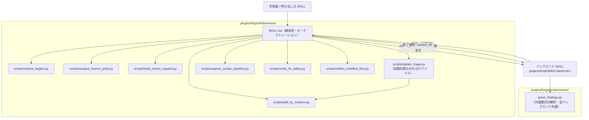
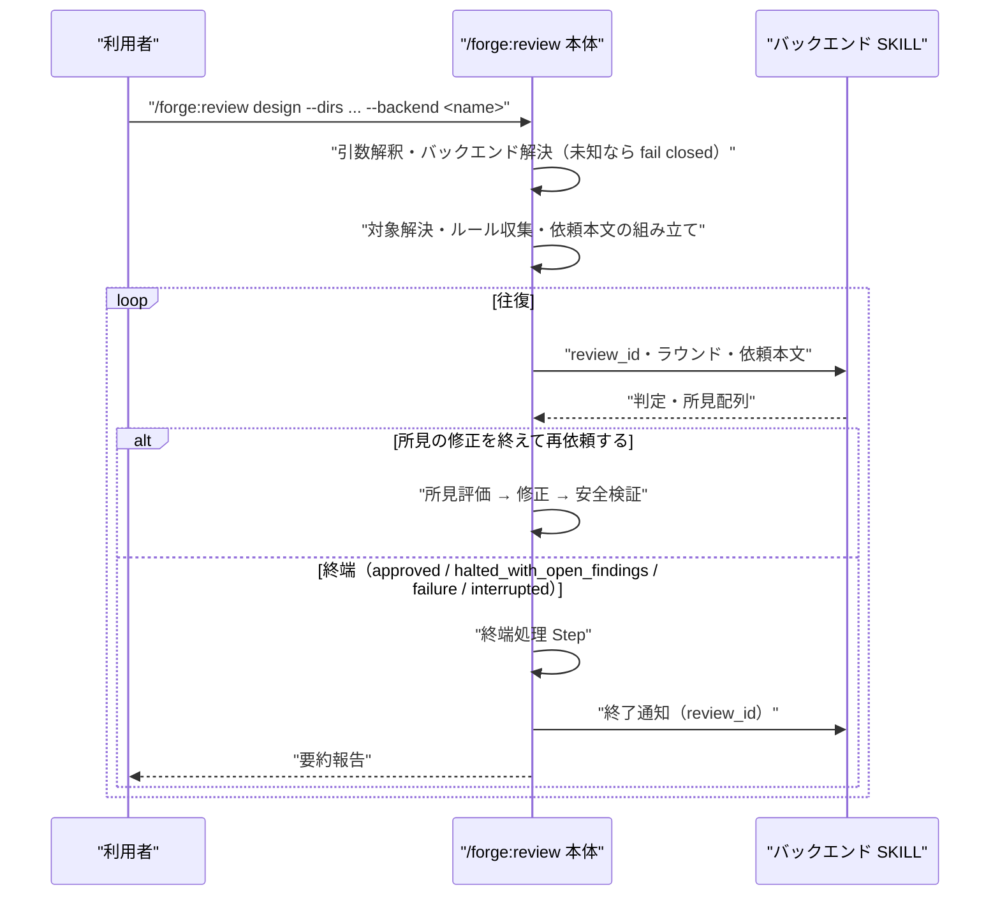

# DES-066 `/forge:review` 本体（バックエンド非依存部）設計書

## メタデータ

| 項目     | 値                                                                                                                                                    |
| -------- | ----------------------------------------------------------------------------------------------------------------------------------------------------- |
| 設計ID   | DES-066                                                                                                                                               |
| 関連要件 | REQ-013（FNC-1303 / FNC-1304 / FNC-1310 / FNC-1312 / FNC-1313 / FNC-1318 / FNC-1319 / FNC-1320）                                                      |
| 関連設計 | ADR-060（バックエンド軸）、ADR-065（契約の 3 要素）、ADR-066（本体と backend の分離）、ADR-071（既定順と任意拡張）、DES-061（`.forge.yaml` の入れ物） |
| 作成日   | 2026-08-03                                                                                                                                            |
| 対象     | forge プラグイン `/forge:review` 本体                                                                                                                 |

> **本文書のスコープ**
>
> - **定めること**: レビュー実行主体に依存しない部分の設計。引数解釈・パターン確定・対象解決・依頼本文の組み立て・バックエンドの解決と委譲・所見の評価と修正・終端処理
> - **定めないこと**: 個々のバックエンドの内部（前提検査・往復・応答の解釈・セッション復旧・ワイヤプロトコル）。各バックエンドの設計文書が定める

## 1. 概要

`/forge:review` 本体は、レビュー依頼を組み立ててバックエンドへ渡し、返る判定と所見配列を処理する層である。レビュアーが誰であるかに依存する処理を一切持たない。

ADR-066 以前の本体は msg-sys 経由の往復をインラインで持っており、バックエンドという概念自体が実装に存在しなかった。本設計はその分離後の本体を定める。

## 2. アーキテクチャ概要



本体とバックエンドはいずれも継承型 SKILL であり、本体が `Skill` ツールで起動する。共通書式の解釈（`parse_findings.py`）は全バックエンドが使うため、特定スキル配下ではなく配布物共通の場所に置く（ADR-066 §2.3）。

### 2.1 バックエンドの解決 [MANDATORY]

backend 名 `<name>` は同名の SKILL `forge:<name>` へ解決する。名前と SKILL を 1 対 1 に対応させることで、対応表を本体に持たせない（新しいバックエンドを足すたびに本体を編集する構造にしない）。

解決先が存在しない場合は依頼を送信せずエラー終了する（fail closed。REQ-013 FNC-1318）。`--codex` / `--claude` は警告のうえ無視し、**backend 名としては解釈しない**。既存の呼び出し元がこれらを付けて起動しているため、backend 名として再解釈すると推測で実行主体を選ぶことになる。

#### 解決の手順

| 順 | 条件                         | 動作                                                           |
| -- | ---------------------------- | -------------------------------------------------------------- |
| 1  | `--backend X` が指定された   | X を使う。SKILL 不在または可用性検査が不可なら **fail closed** |
| 2  | `.claude/.forge.yaml` に指定 | 同上（プロジェクトの選択であり、満たせないなら失敗させる）     |
| 3  | どちらも無い                 | 候補順に可用性検査し、最初に使えたものを採る                   |
| 4  | 候補が全滅                   | **fail closed**。各候補の不足を並べて報告する                  |

手順 3 の解決は**依頼を 1 通も送る前に完了する**。選ばれた結果は送信前の引数解釈結果表に出る（実行主体が可変である以上、所見の出どころが見えている必要がある）。ラウンド実行が `failure` になったときに代替を選ぶことはしない——それは ADR-060 が禁じた自動フォールバックである（区別は ADR-071）。

候補の順序は本体が**名前として**持つ。判定方法は各バックエンドの可用性検査に閉じており、本体は cmux の有無や相手の常駐を自分で調べない（FNC-1318 の「固有の事情を本体に持ち込まない」）。

#### 既定の候補順 [MANDATORY]

明示指定（`--backend` / `.forge.yaml` の `backend`）が無いときに本体が使う順序を、ここで具体的に定める。**この順序は設定から差し替えられない**（§2.2「候補順を設定へ出さない」）。

```
1. agent-review
2. msg-review
```

`agent-review` はプラグインに同梱した read-only カスタム Agent だけを前提とし、外部ツール、DB、常駐セッションを必要としないため第一候補とする。`msg-review` は msg-sys、cmux、常駐 Codex セッションを利用する性質が必要な場合の候補として残す。

この順序の実装上の定義点は `resolve_review_backend.py` の `DEFAULT_ORDER` 1 箇所である（SKILL.md 側に候補名を書かない。定義点が 2 つになると片方だけが更新される）。

バックエンドを新設するときは、**その設計文書で本節への追加位置を決めて本節を更新する**。候補として配布する時点では同名 SKILL と可用性検査を必ず同時に提供し、名前だけの候補を実装に残さない。順序の意図は「最小の前提で成立する実行主体から先に試す」である。外部依存を持つ実行主体は、その固有機能を明示的に必要とする場合に `backend` で選べる。

### 2.2 `.claude/.forge.yaml` の `review` セクション

DES-061 が定めた入れ物の `review` セクションを本設計が所有する（同 §2.2 が、セクションを新設する設計は自文書にスキーマと**設定が無い場合の既定**を定義することを求める）。

```yaml
review:
  backend: agent-review # 任意。プロジェクトが選ぶ実行主体
```

| キー      | 型     | 未指定時の挙動                         |
| --------- | ------ | -------------------------------------- |
| `backend` | 文字列 | 解決の手順 3（候補順による解決）へ進む |

未知の backend 名であれば fail closed とする。

#### 候補順を設定へ出さない [MANDATORY]

**本セクションのキーは `backend` だけである。候補順を設定から差し替えるキーを置かない。**

`.forge.yaml` は任意のファイルであり、無くても全機能が既定で動く（DES-061 §2.1）。その位置づけは「既定の挙動をどうしても矯正したい場合に 1 点だけ上書きする手段」であり、**機能の一翼を担わせない**。`backend` は矯正である（この実行主体を使い、満たせないなら失敗させる）。一方、候補順は選択ではなく**解決アルゴリズムの定義**であり、設定へ出すと機能の一部が設定ファイルへ移る。

順序を設定可能にしない設計上の理由:

- §2.1 は候補順に理由を付けている（最小の前提で成立する実行主体から先に試す）。設定から順序だけを差し替えられると、**理由は設計書に残り結果だけが外部化される**。上書きした利用者はその理由を知らない
- 利用者が候補順を書き替えられることは、どの要件も求めていない（REQ-013 FNC-1318 が定めるのは本体の解決順の挙動と、明示指定の fail closed である）
- 「A を試して、だめなら B」は既定の候補順そのものである。プロジェクト固有の順序を必要とする観測がないまま可変にすると、組み合わせが無制限に増えて検証できない

順序を変える必要が生じた場合は、設定を増やさず §2.1 の候補順そのものを改訂する（順序は設計判断であり、その理由とともに 1 箇所で保守する）。

## 3. モジュール設計

### 3.1 モジュール一覧

| モジュール                   | 責務                                                                             |
| ---------------------------- | -------------------------------------------------------------------------------- |
| `SKILL.md`                   | 引数解釈・パターン確定・バックエンド委譲・所見評価・修正の実施・終端処理（§3.2） |
| `resolve_review_backend.py`  | 明示指定・設定・既定の候補順から解決順を決める（§2.1）                           |
| `analyze_branch_point.py`    | `--branch` の base 候補を分岐点解析で推定する                                    |
| `resolve_targets.py`         | 対象の実在検証と allowlist（target_files）の供給（§3.1.1）                       |
| `build_review_request.py`    | テンプレートへの動的データ埋め込みと `review_id` の生成                          |
| `split_by_location.py`       | 位置情報の有無による所見の振り分け（located / unlocated）。判断はしない          |
| `update_triage.py`           | 段階的提示の仕分けファイルの作成・追加・更新（作り直す経路は持たない）           |
| `capture_syntax_baseline.py` | 修正前の構文検証 baseline の取得                                                 |
| `verify_fix_safety.py`       | allowlist 逸脱・構文破壊の検出（ロールバックはしない）                           |
| `collect_modified_files.py`  | ラウンド終了時の変更集合の独立取得                                               |

#### 3.1.1 base ブランチの受け渡し [MANDATORY]

`--branch` の base は `analyze_branch_point.py` の候補を利用者に確認して確定する（REQ-013）。確定した base は `resolve_targets.py --base-branch` へ渡し、allowlist もその base を起点に列挙する。

`resolve_targets.py` は `--base-branch` を省略された場合に限り `.git_information.yaml` / `develop` / `main` / `master` から自前解決する。この自前解決は base 確定を持たない呼び出し向けの縮退経路であり、`/forge:review` 本体は使わない。指定された base が存在しないときは自前解決へ落とさず `error` を返す（fail closed）。

依頼本文の差分範囲と allowlist が別々の base を起点にすると、レビュー範囲内のファイルへの修正が Step 7 の安全検証で allowlist 逸脱として上がる。逸脱の一覧だけを見ても、それが本物の逸脱なのか起点の食い違いなのかを判別できない。

本体はラウンドごとにレビュアーの変更を検出しない。この機構を一度実装して廃止した経緯は ADR-073 にある。

### 3.2 終端処理の単一出口 [MANDATORY]

レビューが終わる経路は 4 つある。

| 終端経路                    | 契機                                                                                          |
| --------------------------- | --------------------------------------------------------------------------------------------- |
| `approved`                  | バックエンドが `approved` を返した、または再開時に承認済みと判明した（§3.8）                  |
| `halted_with_open_findings` | `confirmed_fix` が空**かつ提示へ回る所見も無い**、段階的提示の中断、または `secrets` パターン |
| `failure`                   | バックエンドが `failure` を返した                                                             |
| `interrupted`               | 利用者がレビューそのものを終えると判断した（中止の指示、または再開の辞退。§3.8）              |

このすべてを SKILL.md の終端処理 Step へ通す。**そこへ到達した時点で終端である**——終端かどうかは、所見評価の終了判定（§3.3）・段階的提示の反映と中断（§3.11）・`secrets` パターンの例外（§3.10）・再開時の状態確定（§3.8。承認済みなら `approved`、再開せず終えるなら `interrupted`）・利用者によるレビューの中止が既に決めている。**判定点を数え漏らさない [MANDATORY]**: 送り出し側は終端経路と 1 対 1 に対応せず、`secrets` は所見評価の段階で `confirmed_fix` を空として扱い、振り分けにも段階的提示にも入らずに終端処理へ抜ける。網羅の担保が記述に依存する以上（§6）、経路を足すときは送り出し側と本節の双方を更新する。終端処理 Step は経路を問わずバックエンドを終了通知モードで起動する。

**終端かどうかをそこで再計算しない [MANDATORY]**。判定点が 2 つあれば食い違い、中断の指示に反して次のラウンドが走る。集約先を決定論的スクリプトから SKILL.md へ移した経緯と、その判断が依拠する前提は ADR-066 §2.4 が持つ。

**次ラウンドへ戻る経路は、所見の修正を終えて再依頼する側だけが持つ**。終端処理 Step を経由しない。**この経路を件数で定義しない [MANDATORY]**——`confirmed_fix` が非空であることは次ラウンドへ進む十分条件ではなく、段階的提示を中断した場合は件数によらず終端である（§3.11）。件数で書くと中断の例外を表せず、廃止したはずの判定がこの設計書を通じて復活する。

**経路ごとに散文で発行を指示しない理由**: 終了通知の発行漏れは、資源を持たないバックエンド（msg-review）では何も起きず、資源を自前で持つバックエンドを接続して初めてリークとして現れる。露見が遅れる失敗であり、同じ SKILL が送信・起床・待機で同型の失敗を 2 度起こしている（ADR-066 §2.4）。集約先がスクリプトから SKILL.md へ移っても、**単一の出口である**ことは変えない。

**終端なら経路を問わず通知する**。資源を持たないバックエンドは無視してよい契約であるため（ADR-065）、発行側で「通知が要る経路か」を選別しない。選別を入れると、選別条件の誤りが再び発行漏れになる。

### 3.3 判定 3 値の扱い

| 判定       | 本体の扱い                                                                                                                                                                                                |
| ---------- | --------------------------------------------------------------------------------------------------------------------------------------------------------------------------------------------------------- |
| `approved` | 終端。要約報告（指摘件数・対応した修正・不採用とした所見と理由）                                                                                                                                          |
| `findings` | 所見を評価し、修正を終えたら次ラウンドへ。**`confirmed_fix` が空かつ提示へ回る所見も無いなら** `halted_with_open_findings` として終端。段階的提示を中断した場合は `confirmed_fix` が非空でも終端（§3.11） |
| `failure`  | 終端。レビューが成立しなかった旨とバックエンドの失敗理由を利用者へ報告                                                                                                                                    |

`failure` を判定として扱わない。所見なしの完了でも指摘ありでもなく、レビューが成立しなかったという結果である。別バックエンドへ暗黙にフォールバックしない（REQ-013 FNC-1318 の fail closed）。

### 3.4 対象指定の粒度保存 [MANDATORY]

範囲指定（`--diff` / `--branch` / `--dirs`）をファイル一覧へ展開してバックエンドへ渡さない（REQ-013 FNC-1312）。`--dirs` ではディレクトリ配下を展開して allowlist を作るが、依頼本文へはディレクトリのまま渡す。allowlist はレビュアーへ渡すものではないため粒度保存の制約を受けない一方、依頼本文は受けるという非対称がここにある。

### 3.5 依頼固有の情報を載せる 2 軸

対象（何を見るか）とは別に、依頼ごとに変わる情報を 2 つ載せる。いずれもテンプレートのトークンとして埋め、本体は文言を持たない。

| 軸                   | トークン    | 伝えるもの                                   | 未指定時                     |
| -------------------- | ----------- | -------------------------------------------- | ---------------------------- |
| 重点観点（FNC-1313） | `{{FOCUS}}` | 通常のレビューに**加えて**注意を払う対象     | 「指定なし」                 |
| 到達目標（FNC-1319） | `{{SCOPE}}` | どの完成度を基準に評価するか・意図的な未実装 | 「指定なし」＝最終形とみなす |

**両者を混ぜない [MANDATORY]**。重点観点は観点の強弱、到達目標は完成度の基準であり、severity への影響も異なる（どちらも severity を引き上げないが、到達目標は「範囲外の実装漏れ」を対応不要へ落とす判断材料になる）。対象一覧のトークンを `{{TARGET_PATHS}}` と命名し `SCOPE` の語を避けているのは、この 3 者の取り違えを名前の水準で防ぐためである（DES-055 §8.6）。

到達目標は Step 7 の所見評価まで保持する。範囲外を指摘した所見のうち、**文書と現状の乖離**を述べているものは妥当な指摘として扱い、範囲外項目を実装漏れとして報告しているものだけを対応不要とする（FNC-1319）。この区別をせずに一括で捨てると、段階分割の宣言が文書の陳腐化を隠す手段になる。

### 3.6 規範の持ち込み（FNC-1320）

`--project-rules` / `--project-specs` が渡された軸については、本体は検索（`query-db-rules` / `query-db-specs`）を行わず渡された値をそのまま使う。上流スキルが同一タスクに対して既に実行した検索を二重に走らせないためである。片方のみ渡された場合は、渡されなかった軸だけを検索する。

渡された一覧の不足を本体は検証しない。本体側で検証を足すと、上流の収集結果を本体が再評価することになり責務が二重になる。

不足が黙殺されるわけではない。forge 内蔵の観点文書はテンプレートが静的に名指ししているため、プロジェクト固有ルールが空でもレビューが規範なしになるのは**内蔵の規範が薄い種別**（`code` / `uxui`）に限られる。その 2 種別のテンプレートだけが「該当する規約が見当たらない場合はその事実を所見として報告せよ」を持つ（DES-055 §3.1）。他の種別は内蔵の principles / format が常に適用されるため、この指示を持たない。

### 3.7 修正の安全検証

finding 単位で「適用 → 検証 → 判断 → 次へ」を逐次繰り返す。検証スクリプトは検出のみを行い、ロールバックの判断は Claude が担う（allowlist 逸脱が正当な波及修正である場合があり、機械的に戻すと正しい修正を消す）。

ラウンド終了時には、finding ごとの自己申告に依存しない独立検証を行う（申告漏れが起きたファイルは allowlist・構文検証のいずれも通過しないまま見過ごされるため）。

### 3.8 履歴復元拡張と再実行

履歴復元は共通バックエンド契約ではなく任意拡張である。本体は再開要求を受けたとき、選択済みバックエンドが拡張を提供する場合に限って `review_id` を渡して履歴を復元する。

履歴復元に対応しないバックエンドでは、同一レビューの再開を試みない。利用者へ復元非対応を示し、継続が必要なら対象・規範・依頼本文を改めて解決して、新しい `review_id` の新規レビューとして起動する。直前の Agent 出力や本体の会話コンテキストを、永続履歴の代用として暗黙に注入しない。

**再開せずに終える場合の終端経路は状態で決まる [MANDATORY]**。復元した履歴が既に承認済みであることを示していれば `approved`、未解決の所見を残したまま終えるなら `interrupted` とする（§3.2 の送り出し側の 1 つ）。承認済みを `interrupted` で通してはならない——要約報告の内容は終端経路で決まるため、承認で終わったレビューが「中止した時点のラウンド数・未対応のまま残る所見」として利用者へ提示される。

### 3.9 2 ラウンド目以降の依頼本文 [MANDATORY]

バックエンドは可用性検査で、往復の文脈を保持するかを申告する（REQ-013 FNC-1318）。本体はこの申告だけで分岐し、バックエンド名から推測しない。

| 申告       | 2 ラウンド目以降に送るもの                                                               |
| ---------- | ---------------------------------------------------------------------------------------- |
| 保持する   | 所見ごとの対応表のみ。対象・観点・返信形式契約は前ラウンドで届いており、再送は冗長になる |
| 保持しない | `build_review_request.py` で**再構築した完全な依頼本文**に、所見ごとの対応表を添えたもの |

保持しないバックエンドへ対応表だけを送ると、新しいレビュアーは対象も観点も返信形式契約も持たない。その状態では成果物を検査できず、**唯一与えられた依頼本文の記述そのものを検査対象にしてしまう**（実際に「報告に記載の無い変更が差分にある」という、成果物の欠陥ではない所見が返った）。

対応表は、保持しないバックエンドに対しては「前ラウンドの所見への回答」ではなく**確定した判断の宣言**として働く。レビュアーはそれを検証できないが、意図的にそうしてある事柄を再指摘しないための材料になる。

### 3.10 位置による振り分けと 2 つの確信

介入軸そのもの（2 値・既定・相互排他・確信が可否を決めること）は REQ-013 FNC-1304 が定める。本節が定めるのは、その要件を満たすための実装の形である。

**スクリプトは判断をしない [MANDATORY]**。`split_by_location.py` が見るのは所見が位置情報を持っているかだけで、対象のコードも文書も読まない。修正できるか・修正してよいかは、**いずれも本体（AI）が所見と対象を読んで決める**。

| 決めること                         | 決める主体                                 |
| ---------------------------------- | ------------------------------------------ |
| 所見に位置情報があるか             | `split_by_location.py`（データの欠損検査） |
| レビュアーの指摘が正しいか         | **本体**（確信度 ☑️）                       |
| その修正を責任を持って実行できるか | **本体**（`✅`）                           |

`split_by_location.py` の出力は 2 群である。

| 出力キー    | 意味                     |
| ----------- | ------------------------ |
| `located`   | 位置が確定している所見   |
| `unlocated` | 位置が確定していない所見 |

**この 2 つのキー名は実態と一致していなければならない [MANDATORY]**。かつては `auto_fix` / `excluded` という名前だった。前者は「自動修正できる」と読めるが実際には位置の有無しか見ておらず、**機械が修正の可否を判定しているかのような誤解**を招いた。後者は「何から除外されたのか」が名前から分からず、介入軸による除外と位置未確定による除外が同じ語に混在したまま、旧設計の記述が別文書へ残骸として流出した。名前が実態と一致していれば、どちらも起きなかった。

**介入軸も重大度も受け取らない [MANDATORY]**。同じ入力には常に同じ出力を返す。

**位置が確定していない所見を `unlocated` とする理由**: 修正は修正対象が確定していて初めて成立する。位置の無い所見を修正対象に含めると、どこを直すかを推測で決めることになり、修正後の allowlist 検証も「意図した変更か」を判定できない。人間が「修正する」と判断してもこの点は変わらない。位置の特定自体を人間に依頼することはできるが、それは採否の判断ではなく調査の依頼であり、振り分けの外にある。

#### 確信は 2 つに分かれる [MANDATORY]

**対象が違う。** 一方は指摘そのもの、もう一方は対策である。

| 記号   | 問い                               | 入力キー        |
| ------ | ---------------------------------- | --------------- |
| `✅`   | その修正を責任を持って実行できるか | `fix_confident` |
| `☑️`    | レビュアーの指摘は正しいか         | `confidence`    |
| (無印) | 指摘そのものの妥当性に確信が無い   | —               |

順序があるため 1 つの尺度で足りる。`✅` は `☑️` を含み、**指摘が正しいと確信できていないものを直すことはできない**。

**この 2 つを 1 つにまとめてはならない [MANDATORY]**。まとめると「指摘は正しいが直し方が分からない」を表せず、そのまま自動修正へ流れるか、正しい指摘まで無印へ落ちる。実装が一度この形になっており、確信度が「修正内容への自信」と再定義されていた。consult 提示原則の確信度は「いま述べている内容が正しいと言えるか」であり、修正の話ではない。

`--auto` は `✅` の所見だけを確認なしに直し、それ以外は段階的提示（§3.11）へ回す。**`--auto` でも人間の応答を待つことがある**——確信の無い箇所で止まることが `--auto` を信頼できるものにする。

`secrets` パターンは介入軸によらず `confirmed_fix` を空として終端処理へ進む。**確認なしの修正だけでなく段階的提示も行わない**——採否を聞いても採用の行き先が修正であり、その修正を禁じている（REQ-013）ためである。

### 3.11 段階的提示

**本節は段階的提示が発生する場合の規定である。** 提示へ回る所見が 1 件も無いとき（ドロップのみ・`auto` で全件 `✅`）は仕分けファイルを作らない——提示しないものに提示用の媒体は要らない。その場合のドロップした所見は、対応表と要約報告に載る（§3.2）。

介入軸によらず、確認を取ると決まった所見をここで提示する（`interactive` は修正できる所見すべて、`auto` は `✅` でない所見だけ）。人間の応答を挟むためターンをまたぐ。所見・AI の評価・利用者の判断をコンテキストだけで保持すると、圧縮で失われたときに再レビューからやり直しになり、**失われたこと自体も検知できない**。したがってこれらを仕分けファイルへ書き出す。

#### 入口は 1 つで、作り直す経路を持たない [MANDATORY]

`update_triage.py` が作成・追加・更新のすべてを担う。**「作り直す」経路を実装に持たせない。**

かつては作成専用のスクリプトがあり、既存を上書きしていた。その結果、ラウンドの途中で所見の集合が変わるたびにファイルが作り直され、**書き込んだ決着が消えた**。しかも消えたことは誰にも見えなかった（ファイルは常にそれらしい姿で存在するため）。守りたかったものを消す仕組みを、保険と呼んでいたことになる。

**作り直しは、保険としても成立しない**。作り直すにはコンテキストの所見が要るため、コンテキストが失われた瞬間にファイルも作れなくなる。ファイルが要るのはまさにその局面である。

途中で起きる変化はすべて更新操作で表せる。決着した、取り下げを差し戻した、議論の中で新しい所見が出た——いずれも既存の行を書き換えるか、行を足すかである。**したがって禁止規定を置く必要は無い。作り直す口が無ければよい。**

**追加は冪等でなければならない [MANDATORY]**。同一性は**位置 + 本文**で見る。再実行で消えるのを塞いだ代わりに再実行で増えるのでは、失敗の向きが変わっただけである。識別子は既存の最大 + 1 で振り、**既存は動かさない**（利用者が会話で指した番号が別の所見を指すようになると、対話とファイルの対応が切れる）。

**存在しない識別子への更新はエラーにする**。打ち間違いを静かに無視すると、書いたつもりの決着がどこにも残らない。

**別レビューの所見を混ぜない [MANDATORY]**。既存ファイルの `review_id` が今回のものと食い違えばエラーで止め、削除して新規に始めるか既存の続きから進めるかを利用者へ確認させる。ファイル名は固定でどのレビューのものかを持たないため、照合が無ければ前セッションの残りに今回の所見が追記され、**見出しの `review_id` だけが黙って置き換わる**。上書きを廃止したことで生じた副作用であり、旧設計には無かった失敗である。

**照合は名前ではなく中身で行う**。ファイル名へ `review_id` を入れると置き場に複数のファイルが並び、「どれを開くのか」という問題が戻る（後述）。名前は 1 つに保ち、識別はファイルの中身が担う。

#### 何を書き、何を空欄にするか

書き出すのは所見が運んできた事実（識別子・重大度・位置・本文）と、**生成時点で既に確定している判断**（2 つの確信・取り下げ理由）である。背景・本質・対応・推奨・決着の欄だけを空のまま出す——これらは提示の場で固まるものであり、生成時点では決まっていない。

**空欄で出すからには、固まった時点で書き戻す [MANDATORY]**。決着させるとき、提示で述べた背景・本質・対応・推奨をこのファイルへ書く。書き戻さなければ、**守りたかった当のもの（提示の内容）が会話にしか無いまま、ファイルだけが決着済みになる**。しかも決着済みに見えるため、失われたことに気付く手がかりも消える。

**手順の明記だけでは足りない [MANDATORY]**。決着させる操作は、これらの欄がプレースホルダのままならエラーで止める。`review_id` の照合と同じく、規約だけに頼らず構造でも止める。実際に、SKILL.md が更新コマンドの例に `決着` 欄しか示していなかったため、他の欄がプレースホルダのまま残り、提示内容が会話にしか存在しない状態でレビューが進んだ。設計が「提示の場で固まる」と書いただけで、**固まったものを誰がいつ書き戻すかを定めていなかった**ことが原因である。**既に決まっている判断を空欄で出さない [MANDATORY]**: 決まっている判断をもう一度させることになり、2 回目の答えが 1 回目と食い違っても誰も気付かない。

**アジェンダ表のセルは AI が書く [MANDATORY]**。所見本文を機械的に切り詰めて入れない。切り詰めは文の途中で切るため、課題の所在ではなく背景の書き出しだけが残ることがある。consult 提示原則が求めているのは「表には課題の所在を書く」ことであって「短く切る」ことではない。未指定はエラーとし、**本文を表へ流し込む縮退経路を持たない**。

#### 2 つの確信を一覧に出す [MANDATORY]

利用者が「直せるものは任せる」と言えるためには、**どれがそれに当たるかが一覧で見えていなければならない**。アジェンダ表に §3.10 の記号列を持たせ、`✅` / `☑️` / 無印を出す。

**介入軸は条件に入らない [MANDATORY]**。`auto` はこの条件を満たす所見を自動で直すモードにすぎず、条件そのものは `interactive` でも同じに成立する。介入軸を条件へ混ぜると、`interactive` の利用者は確信のある修正まで 1 件ずつ採否を聞かれることになる。**判断を渡さない実装も同じ結果を招く**——判断は手順 1 で確定しているのに、一覧に出なければ選び出せない。

**確信度は 3 値のまま書式へ載せる [MANDATORY]**。`confidence` は consult 提示原則の語彙（`confirmed` / `inferred` / `unverified`）をそのまま受け取る。ファイルの表記もこの 3 つを区別し、読み戻しでも保つ。2 値へ畳むと `inferred` が `unverified` になり、往復のたびに「根拠のある推論」が「ただの推測」へ落ちる。アジェンダの記号は `confirmed` かどうかでしか変わらないため表示は狂わないが、**ファイルを読んだ人が両者を区別できなくなる**。`inferred` の表記に使う `🤔` は**指摘の確信度**の軸の記号であり、`✅` / `☑️` が作る**修正の可否**の軸とは別である（1 列に混ぜない）。

**矛盾した入力は低い側へ倒す [MANDATORY]**。`fix_confident` が真でも `confidence` が `confirmed` でなければ `✅` にしない。高い側へ倒すと、確信の無い修正が確認なしに適用される。付け忘れも同じ向きに倒す。

**ファイルは常に 1 つに保つ [MANDATORY]**。`.claude/.temp/review/triage.md` に固定し、置き場も名前も引数にしない。

これは設計上の要点である。`review_id` やラウンドで名前を分けると置き場に複数のファイルが並び、「どれを開くのか」という問いが生まれる。その問いは、鍵（`review_id`・ラウンド番号）を失った局面で解けない——そして**再開が要る局面とは、まさにその局面である**。すると探索・列挙・寿命管理・再開の分岐といった機構が芋づる式に必要になり、いずれも SKILL.md を太らせる。1 つに保てば、これらは丸ごと不要になる。置き場を見ればそれが対象である。

このファイルは**進行中のラウンドの記録**である。ラウンドが終われば役目を終えるが、進行中は決着の保管庫でもある——次ラウンドの対応表と要約報告は提示が終わってから作られるものであり、進行中に参照できる記録はこのファイルだけである。

**ファイルが持つのは所見と判断だけである**。対象・観点・バックエンドは再開時の起動引数と Step 2 / Step 1.5 で確定するため、ファイルへ写さない。写すと、同じ値が 2 か所に存在して食い違う。

**前回の残りは依頼の開始時に利用者へ確認して片付ける [MANDATORY]**。介入軸によらず行う（`auto` 系で起動しても、前回の `interactive` が中断したまま残っていることがある）。確認は「削除して新しく始める / 続きから進める」の二択であり、**後者が中断からの再開の入口である**。再開のための専用モードも探索の仕組みも設けない。

**「続きから進める」は依頼を送らない [MANDATORY]**。再開とは中断した提示の続きであって、新しいレビューではない。バックエンドの解決と対象解決（再開後の修正と次ラウンドに要る）だけを行い、規範の収集・依頼の組み立て・送信・判定は飛ばして段階的提示の途中から再開する。依頼を送ると新しい所見の集合が返るが、この経路は所見をファイルへ入れる工程を通らないため、返った所見は記録されずに捨てられる。加えて依頼の組み立ては毎回新しい `review_id` を生成するため、既存ファイルとの照合に必ず衝突する。**この経路では `review_id` は既存ファイルのものを使い続ける**——そのファイルはそのレビューの記録である。修正を終えて次ラウンドを送るときも同じ `review_id` を渡す（識別するのはレビューであってラウンドではない）。置き場は一時ディレクトリであり成果物ではない——git 管理下へ入れることも、レビューの対象に含めることも想定しない。

**利用者へ示すのは絶対パスである**。相対パスは cwd が異なると開けず、AI の次の Read でも解決できない。

**受け取った所見はすべて書き出す [MANDATORY]**。採否を聞くかどうかと、記録するかどうかは別の問いである。**聞かないと決めたことは、見せないでよいことを意味しない。**

`interactive` でも所見評価のドロップ権限は AI に残り、`auto` では `✅` の所見を確認なしに直す。いずれも**人間に諮らずに AI が決めた**という点で同じであり、その決定が誤っていたときに気付く手段が要る。したがってドロップした所見も、`✅` として自動修正する所見も、位置未確定の所見も、すべて 1 枚の表へ書き出す。状態はスクリプトが決める（位置未確定なら `対象外`、`drop_reason` があれば `取り下げ`、それ以外は `未着手`）。

**`✅` の所見を除外してはならない**。「確認なしに直すと決まっている」ことが正当化するのは**採否を聞かないこと**だけであり、記録から外すことではない。除外すると、`auto` の利用者は**何が変更されるかを見ないまま変更が適用される**。誤った自動修正に気付く手段が無いという点で、危険性はドロップより高い。

件数と理由はアジェンダと同時にまとめて示し、人間はそれを見て個別に差し戻せる。**採否を 1 件ずつ聞く対象は依然として介入軸が決める**（`auto` なら `✅` について聞かない）。表に並ぶことと、1 件ずつ問われることは別である。

`未着手` で出してから AI が書き換える形は採らない。書き換え前のファイルを読んだ利用者に未決着として見え、書き換えを忘れれば恒久的に誤った状態が残る。**状態は生成時に確定できるなら生成時に確定させる**。

**`取り下げ` と `対象外` は別の状態である [MANDATORY]**。consult 提示原則の定義に従い、`取り下げ` は論点として誤りだったので取り消したもの（AI の所見評価によるドロップ）、`対象外` は最初から今回の範囲外と決めたもの（位置未確定で修正対象を特定できない所見）を指す。取り違えると、AI の判断による取り消しが「範囲外」に見え、なぜ扱わなかったのかが利用者に伝わらない。

**段階的提示の中断は終端経路の `interrupted` ではない**。所見を残したままレビューが完了する経路（`halted_with_open_findings`）であり、`interrupted` は利用者が**レビューそのものを終えると判断した**場合（中止の指示・再開の辞退。§3.8）に限る。取り違えると未対応所見の一覧が要約報告から落ちる。

**中断は `confirmed_fix` の件数によらず終端である [MANDATORY]**。それまでに採用が決まった所見の修正は実施するが、そのあと次ラウンドへは進まない。利用者が止めたのに新しいラウンドが走るのは、中断の指示に反する。§3.2 と §3.3 が「件数で定義しない」根拠とするのは本規定である。

提示の作法（背景と本質を先に述べる、アジェンダ表で進行する、次の項目へ AI が自分で進む等）は forge の consult 提示原則が定める。本設計はそれを重複して規定しない。

## 4. ユースケース設計

| ID    | ユースケース                                                | 主体                         |
| ----- | ----------------------------------------------------------- | ---------------------------- |
| UC-01 | 依頼を組み立ててバックエンドへ委譲する                      | 利用者 → 本体 → バックエンド |
| UC-02 | 所見を評価・修正して次ラウンドを依頼する                    | 本体                         |
| UC-03 | 承認を受けて終える（再開時に承認済みと判明した場合を含む）  | 本体                         |
| UC-04 | 未対応所見を残したまま終える（`halted_with_open_findings`） | 本体                         |
| UC-05 | バックエンドの失敗を確定して報告する                        | 本体                         |
| UC-06 | 利用者の中止を受けて終える                                  | 利用者 → 本体                |
| UC-07 | 未知の backend 名で起動を拒否する                           | 本体                         |
| UC-08 | 明示指定なしで候補順から実行主体を決める                    | 本体 → 各候補（可用性検査）  |
| UC-09 | 候補が全滅して依頼を送らず終える                            | 本体                         |
| UC-10 | 所見を 1 件ずつ提示して採否を得る                           | 本体 ⇄ 利用者                |
| UC-11 | 前回の仕分けファイルを片付ける（消すか、続きから再開する）  | 利用者 → 本体                |

UC-03〜UC-06 は終端処理 Step（§3.2）を通り、終了通知を発行する。

UC-10 は介入軸が `interactive`（既定）のときの経路であり、**人間の応答を挟むため設計上ターンをまたぐ
唯一のユースケース**である。その分の状態は仕分けファイルが持つ。UC-11 は依頼の開始時に前回の残りを
片付ける確認で、**中断からの再開もここが入口になる**（再開専用のモードを設けない）。再開を選んだ場合、
**このユースケースは UC-01（依頼の組み立てと委譲）を通らない**——依頼を送らない経路だからである。振り分けと提示の詳細は §3.10 / §3.11 が定める。



## 5. 使用する既存コンポーネント

- **依頼テンプレート 8 種**（`skills/review/templates/`）: 全バックエンド共通。バックエンドごとに分岐させない（ADR-060）
- **`parse_findings.py`**（`plugins/forge/scripts/review/`）: 共通書式の解釈。本体は直接呼ばず、バックエンドが所見配列化に使う
- **レビュー観点文書**（`plugins/forge/docs/criteria/` ほか）: テンプレートが静的に名指しする。本体は組み立てない

## 6. テスト設計

| 対象                        | 検証内容                                                                                                                                                                                                                                                                                                                                                                                                                     |
| --------------------------- | ---------------------------------------------------------------------------------------------------------------------------------------------------------------------------------------------------------------------------------------------------------------------------------------------------------------------------------------------------------------------------------------------------------------------------- |
| `split_by_location.py`      | 位置情報の有無による 2 群への振り分け。**介入軸も重大度も受け取らないこと**（受け取れると確信の代理に重大度が使われる）。位置未確定は `unlocated`、それ以外は `located`（§3.10）                                                                                                                                                                                                                                             |
| `update_triage.py`          | 置き場もファイル名も固定であること。絶対パスを返すこと。`--project-root` を指定すれば cwd によらずその直下へ書くこと。新規作成時に `review_id` を要求すること。**ラウンド番号を受け取らないこと**（§3.11 のとおりファイルは所見と判断だけを持つ）                                                                                                                                                                            |
| 同上                        | **別レビューの `review_id` を持つ既存ファイルへの追記がエラーになること**。エラーに双方の `review_id` が載ること。既存ファイルが書き換わらないこと。同一 `review_id` なら追記を続けられること（§3.11）                                                                                                                                                                                                                       |
| 同上                        | **作り直す口を持たないこと**（`--findings-json` / `--force` / `--overwrite` 等が受け付けられないこと）。決着が消えた原因そのものであり、口が無いことをテストで固定する（§3.11）                                                                                                                                                                                                                                              |
| 同上                        | **追加が冪等であること**。同一（位置 + 本文）は増えず `skipped` に載ること。空白の差を同一とみなすこと。**ファイルへ書いて読み戻した後でも同一性が保たれること**（保存済みは位置が文字列、入力は辞書であり、片方しか扱えないと再実行のたびに増える）                                                                                                                                                                         |
| 同上                        | 識別子が既存の最大 + 1 で振られ、**既存が動かないこと**。提示順（重大度順）と識別子の対応。存在しない識別子・未知の状態・未知の欄への更新がエラーになること                                                                                                                                                                                                                                                                  |
| 同上                        | 生成した書式を**読み戻せること**（識別子・重大度・位置・本文・状態・結果・各欄・2 つの判断が往復で保たれること）。**確信度が 3 値（`confirmed` / `inferred` / `unverified`）とも別の表記で書かれ、読み戻しでも 3 値のまま戻ること**。`inferred` がアジェンダの記号を上げないこと。未知・欠落が生成時に `unverified` へ正規化されること（生のまま持つと往復で値が変わる）。アジェンダ行の無い節、節の無い行をエラーにすること |
| 同上                        | **`決着` にする操作が、背景・本質・対応・推奨・決着のいずれかがプレースホルダのままならエラーで止まること**。エラーに不足した欄名が載ること。止まったときファイルが書き換わらないこと。`取り下げ` / `対象外` は生成時点の決着でありこの検査を受けないこと（§3.11）                                                                                                                                                           |
| 同上                        | ドロップした所見が `取り下げ`、位置未確定が `対象外` として**生成時点で決着済み**に出ること（`未着手` を経ないこと）。理由と所見本文が残ること。差し戻し（`未着手` へ戻す）で全文が失われていないこと（§3.11）                                                                                                                                                                                                               |
| 同上                        | アジェンダ表のセルが `summary` をそのまま載せ、**長さで切り詰めないこと**。`summary` 未指定が**エラーになること**（本文を表へ流し込む縮退経路を持たない）。表を壊す文字（改行・パイプ）だけを畳むこと                                                                                                                                                                                                                        |
| 同上                        | `✅` が **`confidence: confirmed` と `fix_confident` の両方**でのみ立ち、`confirmed` だけなら `☑️` になること。矛盾した入力・欠落・未知の値が低い側へ倒れること。**介入軸を受け取らないこと**（受け取れると `interactive` で `✅` が消える）。2 つの判断が空欄でなく確定値として出ること（§3.10 / §3.11）                                                                                                                     |
| `resolve_review_backend.py` | 明示指定（引数・設定）が `explicit`、未指定が `order` として返ること。**この区別が失われると、選んだ実行主体が満たせないときに黙って別の主体で走る**                                                                                                                                                                                                                                                                         |
| 同上                        | 引数が設定に勝つこと。設定が解析不能でも引数の指定は通ること                                                                                                                                                                                                                                                                                                                                                                 |
| 同上                        | 設定不正（未知キー・型違い・空・重複）で exit 20 になり、**既定の候補順へ落ちないこと**                                                                                                                                                                                                                                                                                                                                      |
| 同上                        | 可用性検査を行わないこと（判定は各バックエンドの責務）                                                                                                                                                                                                                                                                                                                                                                       |
| 同上                        | 既定順が `agent-review`、`msg-review` であること                                                                                                                                                                                                                                                                                                                                                                             |
| `parse_findings.py`         | `path:line` の path が一般的な相対・絶対・Windows パスまたは既知の拡張子なしファイル名らしい場合だけ位置として採用し、`Issue:123` や `12:34` を拒否する                                                                                                                                                                                                                                                                      |
| 同上                        | severity 欠落は `failure` となり所見配列を返さないこと。完了宣言行が最終有効行かつ一意であること                                                                                                                                                                                                                                                                                                                             |
| `resolve_targets.py`        | `--base-branch` で渡した base が allowlist の起点になること。不在の base では自前解決へ落ちず `error` になること（§3.1.1）                                                                                                                                                                                                                                                                                                   |
| `collect_modified_files.py` | ラウンド終了時の変更集合を、パスの手動パースに依らず取得できること（rename・空白や非 ASCII を含むパスを含む）                                                                                                                                                                                                                                                                                                                |
| 既存スクリプト              | 対象解決・依頼組み立て・振り分け・安全検証は従来のテストを維持する                                                                                                                                                                                                                                                                                                                                                           |

**テストで担保できない範囲 [MANDATORY]**: **終端経路の網羅は、テストではなく §3.2 の経路表に依存する**。SKILL.md はテスト対象外であるため、4 経路すべてが終端処理 Step へ到達することを機械が確かめる手段は無い。この担保を手放した経緯は ADR-066 §2.4 が持つ。

セッション断・本体の異常終了による中断では本体の処理自体が走らないため、終了通知は発行されない。これは REQ-013 FNC-1318 が本体へ課した義務の履行外であり、テストで検出できる範囲にも入らない。資源を自前で持つバックエンドは、この場合に備えた独自の受け皿（起動時の孤児走査等）を自身の設計で持つ必要がある。

## 7. 未確定事項

| ID      | 内容                                                                   | 解決方法                                                                                                                                                                                                                                                                                     |
| ------- | ---------------------------------------------------------------------- | -------------------------------------------------------------------------------------------------------------------------------------------------------------------------------------------------------------------------------------------------------------------------------------------- |
| TBD-002 | 2 つ目のバックエンド接続後、本設計の境界が実際に非依存であったかの検証 | **検証済み**。`agent-review` の接続で評価した。契約と依頼本文の境界は保たれていた（8 テンプレートに実行主体の言及なし、共通 parser も実行主体に依存しない）。一方、本体 SKILL の起動条件・利用者向けガイド・呼び出し元スキルの記述には実行主体を前提とした説明が残っており、これらは是正した |
