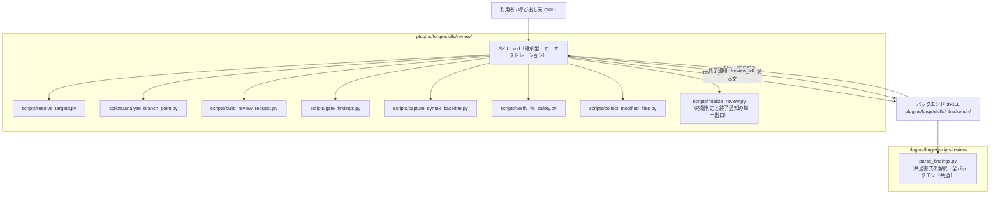
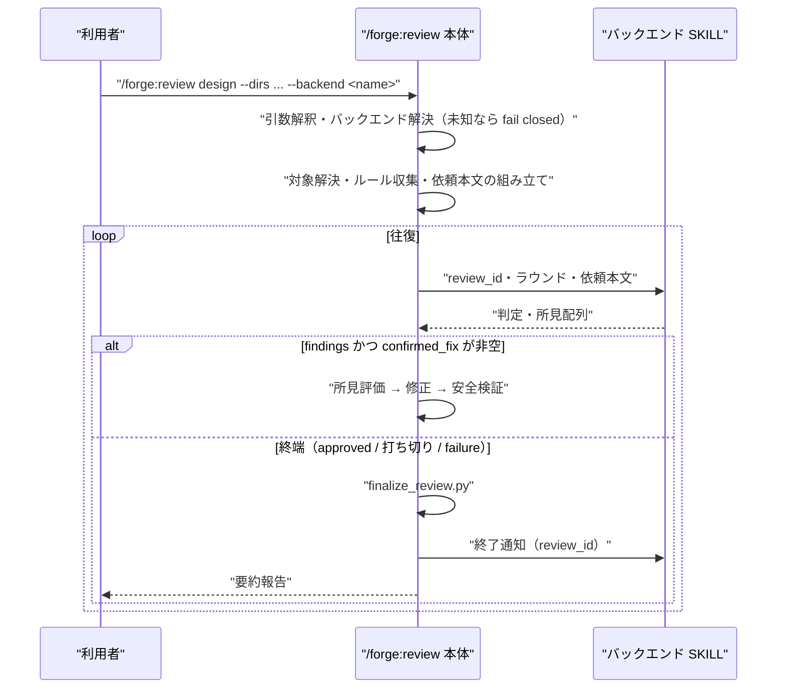

# DES-066 `/forge:review` 本体（バックエンド非依存部）設計書

## メタデータ

| 項目     | 値                                                                                                                                                      |
| -------- | ------------------------------------------------------------------------------------------------------------------------------------------------------- |
| 設計ID   | DES-066                                                                                                                                                 |
| 関連要件 | REQ-013（FNC-1303 / FNC-1304 / FNC-1310 / FNC-1312 / FNC-1313 / FNC-1318 / FNC-1319 / FNC-1320）                                                        |
| 関連設計 | ADR-060（バックエンド軸）、ADR-065（契約の 3 要素）、ADR-066（本体と backend の分離）、ADR-067（可用性検査と解決順）、DES-061（`.forge.yaml` の入れ物） |
| 作成日   | 2026-08-03                                                                                                                                              |
| 対象     | forge プラグイン `/forge:review` 本体                                                                                                                   |

> **本文書のスコープ**
>
> - **定めること**: レビュー実行主体に依存しない部分の設計。引数解釈・パターン確定・対象解決・依頼本文の組み立て・バックエンドの解決と委譲・所見の評価と修正・終端処理
> - **定めないこと**: 個々のバックエンドの内部（前提検査・往復・応答の解釈・セッション復旧・ワイヤプロトコル）。各バックエンドの設計文書が定める

## 1. 概要

`/forge:review` 本体は、レビュー依頼を組み立ててバックエンドへ渡し、返る判定と所見配列を処理する層である。レビュアーが誰であるかに依存する処理を一切持たない。

ADR-066 以前の本体は msg-sys 経由の往復をインラインで持っており、バックエンドという概念自体が実装に存在しなかった。本設計はその分離後の本体を定める。

## 2. アーキテクチャ概要



本体とバックエンドはいずれも継承型 SKILL であり、本体が `Skill` ツールで起動する。共通書式の解釈（`parse_findings.py`）は全バックエンドが使うため、特定スキル配下ではなく配布物共通の場所に置く（ADR-066 §2.3）。

### 2.1 バックエンドの解決 [MANDATORY]

backend 名 `<name>` は同名の SKILL `forge:<name>` へ解決する。名前と SKILL を 1 対 1 に対応させることで、対応表を本体に持たせない（新しいバックエンドを足すたびに本体を編集する構造にしない）。

解決先が存在しない場合は依頼を送信せずエラー終了する（fail closed。REQ-013 FNC-1318）。`--codex` / `--claude` は警告のうえ無視し、**backend 名としては解釈しない**。既存の呼び出し元がこれらを付けて起動しているため、backend 名として再解釈すると推測で実行主体を選ぶことになる。

#### 解決の手順

| 順 | 条件                         | 動作                                                           |
| -- | ---------------------------- | -------------------------------------------------------------- |
| 1  | `--backend X` が指定された   | X を使う。SKILL 不在または可用性検査が不可なら **fail closed** |
| 2  | `.claude/.forge.yaml` に指定 | 同上（プロジェクトの選択であり、満たせないなら失敗させる）     |
| 3  | どちらも無い                 | 候補順に可用性検査し、最初に使えたものを採る                   |
| 4  | 候補が全滅                   | **fail closed**。各候補の不足を並べて報告する                  |

手順 3 の解決は**依頼を 1 通も送る前に完了する**。選ばれた結果は送信前の引数解釈結果表に出る（実行主体が可変である以上、所見の出どころが見えている必要がある）。ラウンド実行が `failure` になったときに代替を選ぶことはしない——それは ADR-060 が禁じた自動フォールバックである（区別は ADR-067）。

候補の順序は本体が**名前として**持つ。判定方法は各バックエンドの可用性検査に閉じており、本体は cmux の有無や相手の常駐を自分で調べない（FNC-1318 の「固有の事情を本体に持ち込まない」）。

#### 既定の候補順 [MANDATORY]

`.forge.yaml` に `backend_order` が無いときに本体が使う順序を、ここで具体的に定める。

```
1. msg-review
```

**現時点の候補は `msg-review` のみである。** これが唯一の実装済みバックエンドであり、手順 3 は実質「msg-review の可用性検査が通れば使い、通らなければ手順 4（fail closed）」になる。

バックエンドを新設するときは、**その設計文書で本節への追加位置を決めて本節を更新する**。実装されていない backend 名を先に書かない（解決時に不在の SKILL を引くだけで、可用性検査にも到達しない）。順序の意図は「前提が重いものから先に試す」——外部依存を持つ実行主体を優先し、依存の少ないものを後段に置く。前提が満たされている環境で、依存の少ない実行主体が先に選ばれてしまうのを避けるためである。

### 2.2 `.claude/.forge.yaml` の `review` セクション

DES-061 が定めた入れ物の `review` セクションを本設計が所有する（同 §2.2 が、セクションを新設する設計は自文書にスキーマと**設定が無い場合の既定**を定義することを求める）。

```yaml
review:
  backend: msg-review # 任意。プロジェクトが選ぶ実行主体
  backend_order: # 任意。§2.1「既定の候補順」を上書きする
    - msg-review
```

| キー            | 型           | 未指定時の挙動                                 |
| --------------- | ------------ | ---------------------------------------------- |
| `backend`       | 文字列       | 解決の手順 3（候補順による解決）へ進む         |
| `backend_order` | 文字列リスト | §2.1「既定の候補順」に定めた順序をそのまま使う |

`backend` が指定されていれば `backend_order` は参照しない（明示指定が候補順に勝つ）。いずれのキーも未知の backend 名であれば fail closed とする。

## 3. モジュール設計

### 3.1 モジュール一覧

| モジュール                   | 責務                                                           |
| ---------------------------- | -------------------------------------------------------------- |
| `SKILL.md`                   | 引数解釈・パターン確定・バックエンド委譲・所見評価・修正の実施 |
| `analyze_branch_point.py`    | `--branch` の base 候補を分岐点解析で推定する                  |
| `resolve_targets.py`         | 対象の実在検証と allowlist（target_files）の供給               |
| `build_review_request.py`    | テンプレートへの動的データ埋め込みと `review_id` の生成        |
| `gate_findings.py`           | 介入軸による所見の振り分け（auto_fix / excluded）              |
| `capture_syntax_baseline.py` | 修正前の構文検証 baseline の取得                               |
| `verify_fix_safety.py`       | allowlist 逸脱・構文破壊の検出（ロールバックはしない）         |
| `collect_modified_files.py`  | ラウンド終了時の変更集合の独立取得                             |
| `finalize_review.py`         | 終端判定と終了通知の要否の決定（単一の出口）                   |

### 3.2 終端処理の単一出口 [MANDATORY]

レビューが終わる経路は 4 つある。

| 経路         | 契機                                                  | `--judgment`         |
| ------------ | ----------------------------------------------------- | -------------------- |
| 承認         | バックエンドが `approved` を返した                    | `approved`           |
| 打ち切り     | 今回実施する修正が 1 件も無い（`confirmed_fix` が空） | `findings`（件数 0） |
| 失敗確定     | バックエンドが `failure` を返した                     | `failure`            |
| 利用者の中止 | 利用者がレビューの中止を指示した                      | `interrupted`        |

このすべてを `finalize_review.py` へ通す。スクリプトは終端かどうか・どの経路か・終了通知の宛先を返し、SKILL.md は返った `notify_backend` に従ってバックエンドを終了通知モードで起動する。

**経路ごとに散文で発行を指示しない理由**: 終了通知の発行漏れは、資源を持たないバックエンド（msg-review）では何も起きず、資源を自前で持つバックエンドを接続して初めてリークとして現れる。露見が遅れる失敗であり、同じ SKILL が送信・起床・待機で同型の失敗を 2 度起こしている（ADR-066 §2.4）。単一の出口へ集約することで、終端判定が決定論的スクリプトとしてテスト可能にもなる（SKILL.md はテスト対象外のため、散文のままでは経路網羅を検証できない）。

**終端なら経路を問わず通知する**。資源を持たないバックエンドは無視してよい契約であるため（ADR-065）、発行側で「通知が要る経路か」を選別しない。選別を入れると、選別条件の誤りが再び発行漏れになる。

**`findings` で件数を省略した場合は判定せずエラーにする**。既定値を置くと、渡し忘れが「終端」「継続」のいずれかへ黙って倒れる。

### 3.3 判定 3 値の扱い

| 判定       | 本体の扱い                                                                     |
| ---------- | ------------------------------------------------------------------------------ |
| `approved` | 終端。要約報告（指摘件数・対応した修正・不採用とした所見と理由）               |
| `findings` | 所見を評価し、`confirmed_fix` が非空なら次ラウンドへ、空なら打ち切りとして終端 |
| `failure`  | 終端。レビューが成立しなかった旨とバックエンドの失敗理由を利用者へ報告         |

`failure` を判定として扱わない。所見なしの完了でも指摘ありでもなく、レビューが成立しなかったという結果である。別バックエンドへ暗黙にフォールバックしない（REQ-013 FNC-1318 の fail closed）。

### 3.4 対象指定の粒度保存 [MANDATORY]

範囲指定（`--diff` / `--branch` / `--dirs`）をファイル一覧へ展開してバックエンドへ渡さない（REQ-013 FNC-1312）。`--dirs` ではディレクトリ配下を展開して allowlist を作るが、依頼本文へはディレクトリのまま渡す。allowlist はレビュアーへ渡すものではないため粒度保存の制約を受けない一方、依頼本文は受けるという非対称がここにある。

### 3.5 依頼固有の情報を載せる 2 軸

対象（何を見るか）とは別に、依頼ごとに変わる情報を 2 つ載せる。いずれもテンプレートのトークンとして埋め、本体は文言を持たない。

| 軸                   | トークン    | 伝えるもの                                   | 未指定時                     |
| -------------------- | ----------- | -------------------------------------------- | ---------------------------- |
| 重点観点（FNC-1313） | `{{FOCUS}}` | 通常のレビューに**加えて**注意を払う対象     | 「指定なし」                 |
| 到達目標（FNC-1319） | `{{SCOPE}}` | どの完成度を基準に評価するか・意図的な未実装 | 「指定なし」＝最終形とみなす |

**両者を混ぜない [MANDATORY]**。重点観点は観点の強弱、到達目標は完成度の基準であり、severity への影響も異なる（どちらも severity を引き上げないが、到達目標は「範囲外の実装漏れ」を対応不要へ落とす判断材料になる）。対象一覧のトークンを `{{TARGET_PATHS}}` と命名し `SCOPE` の語を避けているのは、この 3 者の取り違えを名前の水準で防ぐためである（DES-055 §8.6）。

到達目標は Step 7 の所見評価まで保持する。範囲外を指摘した所見のうち、**文書と現状の乖離**を述べているものは妥当な指摘として扱い、範囲外項目を実装漏れとして報告しているものだけを対応不要とする（FNC-1319）。この区別をせずに一括で捨てると、段階分割の宣言が文書の陳腐化を隠す手段になる。

### 3.6 規範の持ち込み（FNC-1320）

`--project-rules` / `--project-specs` が渡された軸については、本体は検索（`query-db-rules` / `query-db-specs`）を行わず渡された値をそのまま使う。上流スキルが同一タスクに対して既に実行した検索を二重に走らせないためである。片方のみ渡された場合は、渡されなかった軸だけを検索する。

渡された一覧の不足を本体は検証しない。本体側で検証を足すと、上流の収集結果を本体が再評価することになり責務が二重になる。

不足が黙殺されるわけではない。forge 内蔵の観点文書はテンプレートが静的に名指ししているため、プロジェクト固有ルールが空でもレビューが規範なしになるのは**内蔵の規範が薄い種別**（`code` / `uxui`）に限られる。その 2 種別のテンプレートだけが「該当する規約が見当たらない場合はその事実を所見として報告せよ」を持つ（DES-055 §3.1）。他の種別は内蔵の principles / format が常に適用されるため、この指示を持たない。

### 3.7 修正の安全検証

finding 単位で「適用 → 検証 → 判断 → 次へ」を逐次繰り返す。検証スクリプトは検出のみを行い、ロールバックの判断は Claude が担う（allowlist 逸脱が正当な波及修正である場合があり、機械的に戻すと正しい修正を消す）。

ラウンド終了時には、finding ごとの自己申告に依存しない独立検証を行う（申告漏れが起きたファイルは allowlist・構文検証のいずれも通過しないまま見過ごされるため）。

## 4. ユースケース設計

| ID    | ユースケース                             | 主体                         |
| ----- | ---------------------------------------- | ---------------------------- |
| UC-01 | 依頼を組み立ててバックエンドへ委譲する   | 利用者 → 本体 → バックエンド |
| UC-02 | 所見を評価・修正して次ラウンドを依頼する | 本体                         |
| UC-03 | 承認を受けて終える                       | 本体                         |
| UC-04 | 未対応所見を残したまま終える（打ち切り） | 本体                         |
| UC-05 | バックエンドの失敗を確定して報告する     | 本体                         |
| UC-06 | 利用者の中止を受けて終える               | 利用者 → 本体                |
| UC-07 | 未知の backend 名で起動を拒否する        | 本体                         |
| UC-08 | 明示指定なしで候補順から実行主体を決める | 本体 → 各候補（可用性検査）  |
| UC-09 | 候補が全滅して依頼を送らず終える         | 本体                         |

UC-03〜UC-06 はいずれも `finalize_review.py` を通り、終了通知を発行する。



## 5. 使用する既存コンポーネント

- **依頼テンプレート 8 種**（`skills/review/templates/`）: 全バックエンド共通。バックエンドごとに分岐させない（ADR-060）
- **`parse_findings.py`**（`plugins/forge/scripts/review/`）: 共通書式の解釈。本体は直接呼ばず、バックエンドが所見配列化に使う
- **レビュー観点文書**（`plugins/forge/docs/criteria/` ほか）: テンプレートが静的に名指しする。本体は組み立てない

## 6. テスト設計

| 対象                 | 検証内容                                                                   |
| -------------------- | -------------------------------------------------------------------------- |
| `finalize_review.py` | 4 つの終端経路すべてで終了通知が返ること（経路網羅）。継続時は返らないこと |
| 同上                 | `findings` で件数を省略・負値のときエラーになること（既定値へ倒れない）    |
| 同上                 | 通知に `review_id` と backend 名が正しく載ること                           |
| 既存スクリプト       | 対象解決・依頼組み立て・振り分け・安全検証は従来のテストを維持する         |

SKILL.md はテスト対象外であるため、終端判定と通知の要否をスクリプトへ切り出して経路網羅を担保する。

**テストで担保できない範囲 [MANDATORY]**: セッション断・本体の異常終了による中断では本体の処理自体が走らないため、終了通知は発行されない。これは REQ-013 FNC-1318 が本体へ課した義務の履行外であり、テストで検出できる範囲にも入らない。資源を自前で持つバックエンドは、この場合に備えた独自の受け皿（起動時の孤児走査等）を自身の設計で持つ必要がある。

## 7. 未確定事項

| ID      | 内容                                                                   | 解決方法                               |
| ------- | ---------------------------------------------------------------------- | -------------------------------------- |
| TBD-001 | 段階的提示（`--interactive` の本来動作）の実装                         | 本スキル内で完結する形で別途設計する   |
| TBD-002 | 2 つ目のバックエンド接続後、本設計の境界が実際に非依存であったかの検証 | codex-appserver の実機接続時に評価する |
