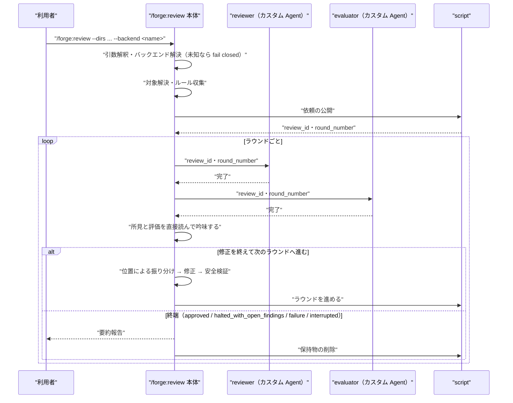

# DES-066 `/forge:review` 本体（バックエンド非依存部）設計書

## 1. 概要

`/forge:review` 本体は、依頼を組み立てて公開し、reviewer と evaluator を直接起動して、script が書いた所見と評価を直接読んで吟味・修正・終端判断を行う層である。レビュアが誰であるかに依存する処理は、バックエンドの可用性検査と `retains_context` の宣言に閉じており、本体は持たない。

受け渡し・採番・書き出しと終了の値、および本体の仕事の流れ（依頼の公開から終端まで）の詳細は、[DES-084](../../review/design/DES-084_reviewer_design.md)（開始から reviewer の区間）と [DES-083](../../review/design/DES-083_evaluator_perspective_design.md)（evaluator の区間と、所見・評価を扱う本体の仕事）が定める。本設計は、それ以外の本体の設計を定める。バックエンドの解決、対象と allowlist、修正の安全検証、位置による振り分け、段階的提示である。

## 2. アーキテクチャ概要


```mermaid
flowchart TB
    User["利用者 / 呼び出し元 SKILL"]
    subgraph Body["plugins/forge/skills/review/"]
        Skill["SKILL.md（継承型・オーケストレーション）"]
        Backend["scripts/resolve_review_backend.py"]
        Targets["scripts/resolve_targets.py"]
        Branch["scripts/analyze_branch_point.py"]
        Split["scripts/split_by_location.py"]
        Baseline["scripts/capture_syntax_baseline.py"]
        Verify["scripts/verify_fix_safety.py"]
        Collect["scripts/collect_modified_files.py"]
    end
    subgraph Exchange["plugins/forge/scripts/review/（受け渡し）"]
        Publish["publish_request.py"]
        Read["body_resolve_findings / body_resolve_evaluations"]
        Count["count_actionable.py"]
        Advance["advance_round.py"]
        Delete["delete_review.py"]
    end
    subgraph Agents["plugins/forge/agents/"]
        Reviewer["reviewer.md（read-only カスタム Agent・所見の書き出し）"]
        Evaluator["evaluator.md（read-only カスタム Agent・所見の評価）"]
    end
    BackendSkill["バックエンド SKILL（可用性検査のみ）"]
    Consult["consult SKILL（継承型・段階的提示の委譲先）"]

    User --> Skill
    Skill --> Backend & Targets & Branch & Split & Baseline & Verify & Collect
    Skill --> Publish & Read & Count & Advance & Delete
    Skill -->|"可用性検査"| BackendSkill
    Skill -->|"review_id・round_number（Agent ツール）"| Reviewer & Evaluator
    Skill -->|"提示へ回る評価（同一コンテキスト）"| Consult
    Consult -->|"採否・理由（同一コンテキスト）"| Skill
```

本体とバックエンド SKILL はいずれも継承型 SKILL であり、本体が `Skill` ツールで起動する。reviewer と evaluator は本体が `Agent` ツールで直接起動し、依頼・所見・評価は script が JSON として書く。本体は script が返したパスの JSON を直接読む（受け渡しの型は DES-084・DES-083 が定める）。

### 2.1 バックエンドの解決 [MANDATORY]

backend 名 `<name>` は同名の SKILL `forge:<name>` へ解決する。名前と SKILL を 1 対 1 に対応させることで、対応表を本体に持たせない（新しいバックエンドを足すたびに本体を編集する構造にしない）。

明示指定（`--backend` または `.forge.yaml` の `backend`）の解決先が存在しない場合は、依頼を公開せずエラー終了する（fail closed。REQ-013 FNC-1318）。候補順で解決するときは、存在しない候補を利用不可として次の候補へ進む（下記「解決の手順」）。`--codex` / `--claude` は警告のうえ無視し、**backend 名としては解釈しない**。既存の呼び出し元がこれらを付けて起動しているため、backend 名として再解釈すると推測で実行主体を選ぶことになる。

#### 解決の手順

| 順 | 条件                         | 動作                                                           |
| -- | ---------------------------- | -------------------------------------------------------------- |
| 1  | `--backend X` が指定された   | X を使う。SKILL 不在または可用性検査が不可なら **fail closed** |
| 2  | `.claude/.forge.yaml` に指定 | 同上（プロジェクトの選択であり、満たせないなら失敗させる）     |
| 3  | どちらも無い                 | 候補順に可用性検査し、最初に使えたものを採る                   |
| 4  | 候補が全滅                   | **fail closed**。各候補の不足を並べて報告する                  |

手順 3 の解決は**依頼を公開する前に完了する**。選ばれた結果は公開前の引数解釈結果表に出る（実行主体が可変である以上、所見の出どころが見えている必要がある）。reviewer または evaluator が失敗したときに代替を選ぶことはしない——それは REQ-013 FNC-1318 が禁じた自動フォールバックである。候補順による解決は依頼を公開する前に完了するため、これに当たらない。

候補の順序は本体が**名前として**持つ。判定方法は各バックエンドの可用性検査に閉じており、本体は実行環境の事情を自分で調べない（FNC-1318 の「固有の事情を本体に持ち込まない」）。

**`retains_context` を同じ解決で得る**。解決の応答は、候補ごとの `retains_context`（reviewer が往復の文脈を保持するか）を含む。値はバックエンドごとに固定で、`resolve_review_backend.py` が宣言を持つ。宣言の無い名前が候補に含まれるときは、値を補わず `backend_undeclared` で拒む（DES-084 §6.7）。本体は採用した候補の値を、可用性検査の通過後に、そのレビューの間保持する。名前や起動のされ方から推測しない。現在の候補（`agent-review`）は `false` であり、`true` の場合の流れは本設計の範囲外である（REQ-029 FNC-316、Issue #67）。

#### 既定の候補順 [CRITICAL]

明示指定（`--backend` / `.forge.yaml` の `backend`）が無いときに本体が使う順序を、ここで具体的に定める。**この順序は設定から差し替えられない**（§2.2「候補順を設定へ出さない」）。

```
1. agent-review
```

`agent-review` はプラグインに同梱した read-only カスタム Agent だけを前提とし、外部ツール、DB、常駐セッションを必要としないため第一候補とする。現時点で候補はこれだけである。

候補が 1 つでも順序解決の機構（先頭から可用性検査し、全滅で fail closed）は変えない。候補数を理由に機構を畳むと、2 つ目を接続する時点で定義点と検査順が別物になる。

この順序の実装上の定義点は `resolve_review_backend.py` の `DEFAULT_ORDER` 1 箇所である（SKILL.md 側に候補名を書かない。定義点が 2 つになると片方だけが更新される）。

バックエンドを新設するときは、**その設計文書で本節への追加位置を決めて本節を更新する**。候補として配布する時点では同名 SKILL と可用性検査を必ず同時に提供し、名前だけの候補を実装に残さない。順序の意図は「最小の前提で成立する実行主体から先に試す」である。外部依存を持つ実行主体は、その固有機能を明示的に必要とする場合に `backend` で選べる。

### 2.2 `.claude/.forge.yaml` の `review` セクション

DES-061 が定めた入れ物の `review` セクションを本設計が所有する（同 §2.2 が、セクションを新設する設計は自文書にスキーマと**設定が無い場合の既定**を定義することを求める）。

```yaml
review:
  backend: agent-review # 任意。プロジェクトが選ぶ実行主体
```

| キー      | 型     | 未指定時の挙動                         |
| --------- | ------ | -------------------------------------- |
| `backend` | 文字列 | 解決の手順 3（候補順による解決）へ進む |

未知の backend 名であれば fail closed とする。

#### 候補順を設定へ出さない [CRITICAL]

**本セクションのキーは `backend` だけである。候補順を設定から差し替えるキーを置かない。**

`.forge.yaml` は任意のファイルであり、無くても全機能が既定で動く（DES-061 §2.1）。その位置づけは「既定の挙動をどうしても矯正したい場合に 1 点だけ上書きする手段」であり、**機能の一翼を担わせない**。`backend` は矯正である（この実行主体を使い、満たせないなら失敗させる）。一方、候補順は選択ではなく**解決アルゴリズムの定義**であり、設定へ出すと機能の一部が設定ファイルへ移る。

順序を設定可能にしない設計上の理由:

- §2.1 は候補順に理由を付けている（最小の前提で成立する実行主体から先に試す）。設定から順序だけを差し替えられると、**理由は設計書に残り結果だけが外部化される**。上書きした利用者はその理由を知らない
- 利用者が候補順を書き替えられることは、どの要件も求めていない（REQ-013 FNC-1318 が定めるのは本体の解決順の挙動と、明示指定の fail closed である）
- 「A を試して、だめなら B」は既定の候補順そのものである。プロジェクト固有の順序を必要とする観測がないまま可変にすると、組み合わせが無制限に増えて検証できない

順序を変える必要が生じた場合は、設定を増やさず §2.1 の候補順そのものを改訂する（順序は設計判断であり、その理由とともに 1 箇所で保守する）。

## 3. モジュール設計

### 3.1 モジュール一覧

| モジュール                          | 責務                                                                                                                                                                                                                                     |
| ----------------------------------- | ---------------------------------------------------------------------------------------------------------------------------------------------------------------------------------------------------------------------------------------- |
| `SKILL.md`                          | 引数解釈・対象の確定・バックエンド解決・依頼の公開・reviewer と evaluator の起動・所見と評価の吟味・修正の実施・終端処理（§3.2）                                                                                                         |
| `resolve_review_backend.py`         | 明示指定・設定・既定の候補順から解決順を決め、候補ごとの `retains_context` を返す（§2.1）                                                                                                                                                |
| `analyze_branch_point.py`           | `--branch` の base 候補を分岐点解析で推定する                                                                                                                                                                                            |
| `resolve_targets.py`                | 対象の実在検証と allowlist（target_files）の供給（§3.1.1）                                                                                                                                                                               |
| `plugins/forge/scripts/review/`     | 依頼の公開・所見と評価のパスの解決・件数・ラウンドの進行・保持物の削除。各 script の責務は DES-084 §6・DES-083 §6 が定める                                                                                                               |
| `plugins/forge/agents/reviewer.md`  | read-only カスタム Agent。`review_id` と `round_number` だけを受け取り、依頼を直接読んで、対象と規範に照らした所見を script 経由で書き出す（DES-084 §4.2）                                                                               |
| `plugins/forge/agents/evaluator.md` | read-only カスタム Agent。`review_id` と `round_number` だけを受け取り、依頼と所見を直接読んで、所見ごとの `disposition`・`severity`・`confidence`・`fix_confident` を評価として script 経由で書き出す（DES-083 §4.1。修正は分離しない） |
| `split_by_location.py`              | 位置情報の有無による所見の振り分け（located / unlocated）。判断はしない                                                                                                                                                                  |
| `capture_syntax_baseline.py`        | 修正前の構文検証 baseline の取得                                                                                                                                                                                                         |
| `verify_fix_safety.py`              | allowlist 逸脱・構文破壊の検出（ロールバックはしない）                                                                                                                                                                                   |
| `collect_modified_files.py`         | ラウンド終了時の変更集合の独立取得                                                                                                                                                                                                       |

#### 3.1.1 base ブランチの受け渡し [CRITICAL]

`--branch` の base は `analyze_branch_point.py` の候補を利用者に確認して確定する（REQ-013）。確定した base は `resolve_targets.py --base-branch` へ渡し、allowlist もその base を起点に列挙する。

`resolve_targets.py` は `--base-branch` を省略された場合に限り `.git_information.yaml` / `develop` / `main` / `master` から自前解決する。この自前解決は base 確定を持たない呼び出し向けの縮退経路であり、`/forge:review` 本体は使わない。指定された base が存在しないときは自前解決へ落とさず `error` を返す（fail closed）。

依頼の差分範囲と allowlist が別々の base を起点にすると、レビュー範囲内のファイルへの修正が Step 7 の安全検証で allowlist 逸脱として上がる。逸脱の一覧だけを見ても、それが本物の逸脱なのか起点の食い違いなのかを判別できない。

本体はラウンドごとにレビュアの変更を検出しない。変更集合の比較は、すでに集合へ入っているファイルを書き換えても集合が変わらず、最も起きやすい経路だけが漏れるため、検出の手段にならない。

### 3.2 終端処理の単一出口 [MANDATORY]

レビューが終わる経路は 4 つある。

| 終端経路                    | 契機                                                                                                          |
| --------------------------- | ------------------------------------------------------------------------------------------------------------- |
| `approved`                  | 対応を要するものが尽きた（件数が 0 で、退けた評価の退け方も妥当と確かめた）                                   |
| `halted_with_open_findings` | 対応できるものが無く、または残りが軽微で、利用者が終えると決めた。段階的提示の中断。往復の一旦停止での終了    |
| `failure`                   | reviewer または evaluator の起動に失敗した、または所見・評価を読み出せなかった（reviewer / evaluator の失敗） |
| `interrupted`               | 利用者がレビューそのものを終えると判断した（中止の指示）                                                      |

このすべてを SKILL.md の終端処理 Step へ通す。**そこへ到達した時点で終端である**——終端かどうかは、所見と評価の吟味・終端の判断（DES-083 §4.2 の S17・S18）・段階的提示の反映と中断（§3.11）・利用者によるレビューの中止が既に決めている。**判定点を数え漏らさない**: 送り出し側は終端経路と 1 対 1 に対応しない。網羅の担保が記述に依存する以上（§6）、経路を足すときは送り出し側と本節の双方を更新する。終端処理 Step は経路を問わず、要約報告を出力してから、保持物を `delete_review.py` で削除する。

**終端かどうかをそこで再計算しない**。判定点が 2 つあれば食い違い、中断の指示に反して次のラウンドが走る。

**次ラウンドへ戻る経路は、所見の修正を終えて再依頼する側だけが持つ**。終端処理 Step を経由しない。**この経路を件数で定義しない**——`confirmed_fix` が非空であることは次ラウンドへ進む十分条件ではなく、段階的提示を中断した場合は件数によらず終端である（§3.11）。件数で書くと中断の例外を表せない。

**経路ごとに散文で削除を指示しない理由**: 削除の発行漏れは、その場では何も起きず、`.temp/review/` に依頼・所見・評価が残り続けることで初めて現れる。露見が遅れる失敗であるため、経路ごとに散文で指示する形を採らず、単一の出口に集める。

**終端なら経路を問わず削除する**。削除前に、報告に載せる内容を読み終えて書き出しておく（削除すると JSON は読めなくなる）。

### 3.3 reviewer と evaluator の結果の扱い

| 結果                           | 本体の扱い                                                                                                                               |
| ------------------------------ | ---------------------------------------------------------------------------------------------------------------------------------------- |
| 所見・評価がともに正常に読める | 吟味へ進む（DES-083 §4.2 の S17）                                                                                                        |
| reviewer が失敗した            | 終端（`failure`）。所見側の `errors`（エラー値または書き出されなかった旨）を、reviewer の失敗として利用者へ報告する。その結果は使わない  |
| evaluator が失敗した           | 終端（`failure`）。そのラウンドの所見は評価を経ていないので、severity を持たない未評価の所見として報告に載せ、未評価であることを明示する |

読み出してよい状態か（正常に書き終えたか）は script が判定する。本体は読んだ内容から成否を判断しない（REQ-029 FNC-311）。`failure` を、所見なしの完了や指摘ありとして扱わない。別バックエンドへ暗黙にフォールバックしない（REQ-013 FNC-1318 の fail closed）。

### 3.4 対象指定の粒度保存 [CRITICAL]

範囲指定（`--diff` / `--branch` / `--dirs`）をファイル一覧へ展開して依頼へ載せない（REQ-013 FNC-1312）。`--dirs` ではディレクトリ配下を展開して allowlist を作るが、依頼へはディレクトリのまま渡す。allowlist は reviewer へ渡すものではないため粒度保存の制約を受けない一方、依頼は受けるという非対称がここにある。

### 3.5 依頼固有の情報を載せる 2 軸

対象（何を見るか）とは別に、依頼ごとに変わる情報を 2 つ載せる。いずれも本体が Write ツールで受け渡しファイルに書き、依頼を公開する script が値を加工せずに依頼の項目へ置く。本体は文言を持たない。

| 軸                   | 依頼の項目 | 伝えるもの                                   | 未指定時                             |
| -------------------- | ---------- | -------------------------------------------- | ------------------------------------ |
| 重点観点（FNC-1313） | `focus`    | 通常のレビューに**加えて**注意を払う対象     | 項目を持たない                       |
| 到達目標（FNC-1319） | `scope`    | どの完成度を基準に評価するか・意図的な未実装 | 項目を持たない＝対象を最終形とみなす |

**両者を混ぜない**。重点観点は観点の強弱、到達目標は完成度の基準であり、severity への影響も異なる（どちらも severity を引き上げないが、到達目標は「範囲外の実装漏れ」を対応不要へ落とす判断材料になる）。

到達目標は本体の吟味まで保持する。範囲外を指摘した所見のうち、**文書と現状の乖離**を述べているものは妥当な指摘として扱い、範囲外項目を実装漏れとして報告しているものだけを対応不要とする（FNC-1319）。この区別をせずに一括で捨てると、段階分割の宣言が文書の陳腐化を隠す手段になる。

### 3.6 規範の持ち込み（FNC-1320）

`--project-rules` / `--project-specs` が渡された軸については、本体は検索（`query-db-rules` / `query-db-specs`）を行わず渡された値をそのまま使う。上流スキルが同一タスクに対して既に実行した検索を二重に走らせないためである。片方のみ渡された場合は、渡されなかった軸だけを検索する。検索結果とそのまま使う値は、依頼の `references` として公開する。

渡された一覧の不足を本体は検証しない。本体側で検証を足すと、上流の収集結果を本体が再評価することになり責務が二重になる。

不足が黙殺されるわけではない。forge 内蔵の観点文書は reviewer の定義が静的に名指ししているため、プロジェクト固有ルールが空でもレビューが規範なしになるのは**内蔵の規範が薄い種別**（`code` / `uxui`）に限られる。その 2 種別を読む reviewer は、「該当する規約が見当たらない場合はその事実を所見として報告する」（`reviewer.md`）。他の種別は内蔵の principles / format が常に適用されるため、この指示を要さない。

### 3.7 修正の安全検証

finding 単位で「適用 → 検証 → 判断 → 次へ」を逐次繰り返す。検証スクリプトは検出のみを行い、ロールバックの判断は Claude が担う（allowlist 逸脱が正当な波及修正である場合があり、機械的に戻すと正しい修正を消す）。

ラウンド終了時には、finding ごとの自己申告に依存しない独立検証を行う（申告漏れが起きたファイルは allowlist・構文検証のいずれも通過しないまま見過ごされるため）。

### 3.8 中断したレビューを再開しない

依頼・所見・評価はレビューの終端で削除されるため（§3.2）、中断したレビューを同一の `review_id` で再開する経路は持たない。利用者は同じ対象で新しいレビューを起動する。直前の Agent 出力や本体の会話コンテキストを、永続した履歴の代用として暗黙に注入しない。

前回のレビューの残りを破棄する確認も要らない。段階的提示の状態は consult が会話コンテキストにだけ持ち（§3.11）、永続化しないためである。

### 3.9 依頼はレビューの間変えない [MANDATORY]

依頼は公開後に書き換えず、reviewer と evaluator は毎ラウンド同じ依頼を読む（REQ-029 FNC-305）。前ラウンドで何をしたかを依頼に載せない。

`retains_context` が `false` のバックエンドでは、reviewer と evaluator は毎ラウンド新しく起動され、前ラウンドを覚えていない。前ラウンドの所見への対応だけを渡すと、新しい reviewer は対象も観点も持たないまま応答し、成果物ではなく与えられた記述そのものを検査対象にしてしまう。完全な依頼を毎ラウンド読ませ、修正後の対象を読み直させる形にすれば、この失敗は起きない。

`true` のバックエンドの流れは本設計の範囲外である（§2.1）。

### 3.10 位置による振り分けと 2 つの確信

介入軸そのもの（2 値・既定・相互排他・確信が可否を決めること）は REQ-013 FNC-1304 が定める。本節が定めるのは、その要件を満たすための実装の形である。

**スクリプトは判断をしない**。`split_by_location.py` が見るのは所見が位置情報を持っているかだけで、対象のコードも文書も読まない。入力は、所見の結果の JSON のパスである（本体が `body_resolve_findings` から得たパスを `--findings-file` で渡す。所見の本文は自由記述なので、JSON を引数へ埋め込まない）。修正できるか・修正してよいかは、**evaluator が所見と対象を読んで述べ、本体が吟味して確信を持つ**（REQ-029 FNC-312）。

| 決めること                         | 決める主体                                                                                                     |
| ---------------------------------- | -------------------------------------------------------------------------------------------------------------- |
| 所見に位置情報があるか             | `split_by_location.py`（データの欠損検査）                                                                     |
| レビュアの指摘が正しいか           | evaluator が `confidence` として述べる（確信度 ☑️）。本体が吟味して、自分で確信を持つ                           |
| その修正を責任を持って実行できるか | evaluator が `fix_confident` として述べる（`✅` の材料）。本体が吟味して、自分で `✅` かを決め、修正を実施する |

`split_by_location.py` の出力は 2 群である。

| 出力キー    | 意味                     |
| ----------- | ------------------------ |
| `located`   | 位置が確定している所見   |
| `unlocated` | 位置が確定していない所見 |

**この 2 つのキー名は実態と一致していなければならない**。`located` / `unlocated` は位置の有無だけを表す。「自動修正できる」「除外された」のように修正の可否や除外の理由を読ませる名前にすると、**機械が修正の可否を判定しているかのような誤解**を招き、介入軸による除外と位置未確定による除外が同じ語に混在する。

**介入軸も重大度も受け取らない**。同じ入力には常に同じ出力を返す。

**位置が確定していない所見を `unlocated` とする理由**: 修正は修正対象が確定していて初めて成立する。位置の無い所見を修正対象に含めると、どこを直すかを推測で決めることになり、修正後の allowlist 検証も「意図した変更か」を判定できない。人間が「修正する」と判断してもこの点は変わらない。位置の特定自体を人間に依頼することはできるが、それは採否の判断ではなく調査の依頼であり、振り分けの外にある。

#### 確信は 2 つに分かれる [CRITICAL]

**対象が違う。** 一方は指摘そのもの、もう一方は対策である。

| 記号   | 問い                               | 材料となる評価の項目 |
| ------ | ---------------------------------- | -------------------- |
| `✅`   | その修正を責任を持って実行できるか | `fix_confident`      |
| `☑️`    | レビュアの指摘は正しいか           | `confidence`         |
| (無印) | 指摘そのものの妥当性に確信が無い   | —                    |

順序があるため 1 つの尺度で足りる。`✅` は `☑️` を含み、**指摘が正しいと確信できていないものを直すことはできない**。

**この 2 つを 1 つにまとめてはならない**。まとめると「指摘は正しいが直し方が分からない」を表せず、そのまま自動修正へ流れるか、正しい指摘まで無印へ落ちる。consult 提示原則の確信度は「いま述べている内容が正しいと言えるか」であり、修正の話ではない。

`--auto` は `✅` の所見だけを確認なしに直し、それ以外は段階的提示（§3.11）へ回す。**`--auto` でも人間の応答を待つことがある**——確信の無い箇所で止まることが `--auto` を信頼できるものにする。

### 3.10a 所見と評価の対応付け（REQ-013 FNC-1322）

所見（reviewer が書く）と評価（evaluator が書く）は、別々の JSON として届く。評価は、引く所見の `finding_id` を `finding_ids` として持つ。この対応付けを AI が自分のコンテキストの中で記憶に頼って行うと、件数の不一致・欠落・重複を検証しないまま扱う危険がある。

**対応付けは、評価を書き終える時点で保証する**。evaluator が書き終えようとしたとき、そのラウンドの所見のうち、いずれの評価にも引かれていないものが残っていれば、script が失敗して未参照の番号をすべて返す。evaluator は評価を足してから書き終える。足さないまま終えれば、書けない異常終了になり、本体が止まる（DES-083 §4.1・§6、REQ-029 FNC-203）。正常に書き終えた評価には、未参照の所見も存在しない番号も無いため、本体が改めて数えて検査する工程は持たない。

本体は、評価の `finding_ids` を入口にして、所見の結果から所見を引く（DES-083 §4.2）。所見と評価を 1 つに結合した配列を作らない。写しを作れば、原本と同じ内容が 2 箇所に置かれる。

### 3.11 段階的提示

**本節は段階的提示が発生する場合の規定である。** 提示へ回る評価が 1 件も無いとき（ドロップのみ・`auto` で全件 `✅`）は consult への委譲を行わない——提示しないものに提示は要らない。その場合のドロップした評価は、対応表と要約報告に載る（§3.2）。

提示へ回った評価について、本体は consult（[consult:REQ-017](../../consult/requirements/REQ-017_consult_skill.md)）へ**同一コンテキストのまま**委譲する。consult は継承型 SKILL であり、review 本体を実行しているのと同じ会話が振る舞いを consult のものへ切り替えるだけである。したがって、以下は本体と consult の間で構造化データとして受け渡す必要が無い——**本体が既に吟味した内容は会話コンテキストにあり、consult による対話進行の結果もそのままコンテキストに残る**:

- 評価の内容（重大度・位置・根拠・`confidence`・`fix_confident`）
- 対話進行の結果（採否・理由）

**consult へ渡すのは「提示へ回るすべての評価」である**。`✅` として自動修正する評価・位置未確定の評価・ドロップした評価も、consult が記録として保持できるよう含める（採否を聞くかどうかと、記録するかどうかは別の問いである）。

**consult は提示の状態を agenda へ記録せず、会話コンテキストにだけ持つ（暫定措置）。** agenda の再設計は別の差分 feature が扱う（DES-083 §4.3）。対話進行の詳細（論点の立て方・状態遷移・表示）は consult 側（[consult:REQ-017](../../consult/requirements/REQ-017_consult_skill.md) / [consult:DES-078](../../consult/design/DES-078_consult_dialogue_flow_design.md)）が持つ。本設計はそれを重複して規定しない。

**段階的提示の中断は終端経路の `interrupted` ではない**。所見を残したままレビューが完了する経路（`halted_with_open_findings`）であり、`interrupted` は利用者が**レビューそのものを終えると判断した**場合（中止の指示）に限る。取り違えると未対応所見の一覧が要約報告から落ちる。

**中断は `confirmed_fix` の件数によらず終端である**。それまでに採用が決まった評価の修正は実施するが、そのあと次ラウンドへは進まない。利用者が止めたのに新しいラウンドが走るのは、中断の指示に反する。§3.2 が「件数で定義しない」根拠とするのは本規定である。

## 4. ユースケース設計

| ID    | ユースケース                                                | 主体                          |
| ----- | ----------------------------------------------------------- | ----------------------------- |
| UC-01 | 依頼を公開して reviewer と evaluator を起動する             | 利用者 → 本体 → agent         |
| UC-02 | 所見と評価を吟味・修正して、次のラウンドへ進む              | 本体 ⇄ evaluator              |
| UC-03 | 対応を要するものが尽きて終える（`approved`）                | 本体                          |
| UC-04 | 未対応所見を残したまま終える（`halted_with_open_findings`） | 本体                          |
| UC-05 | reviewer または evaluator の失敗を確定して報告する          | 本体                          |
| UC-06 | 利用者の中止を受けて終える                                  | 利用者 → 本体                 |
| UC-07 | 未知の backend 名で起動を拒否する                           | 本体                          |
| UC-08 | 明示指定なしで候補順から実行主体を決める                    | 本体 → 各候補（可用性検査）   |
| UC-09 | 候補が全滅して依頼を公開せずに終える                        | 本体                          |
| UC-10 | 評価を 1 件ずつ提示して採否を得る（consult へ委譲）         | 本体（consult 経由） ⇄ 利用者 |

UC-03〜UC-06 は終端処理 Step（§3.2）を通り、保持物を削除する。

UC-10 は介入軸が `interactive`（既定）のときの経路であり、**人間の応答を挟むため設計上ターンをまたぐ唯一のユースケース**である。その分の状態は consult が会話コンテキストに持つ（§3.11）。振り分けの詳細は §3.10 が、段階的提示の委譲は §3.11 が定める。


```mermaid
sequenceDiagram
    participant U as "利用者"
    participant B as "/forge:review 本体"
    participant R as "reviewer（カスタム Agent）"
    participant E as "evaluator（カスタム Agent）"
    participant S as "script"

    U->>B: "/forge:review --dirs ... --backend <name>"
    B->>B: "引数解釈・バックエンド解決（未知なら fail closed）"
    B->>B: "対象解決・ルール収集"
    B->>S: "依頼の公開"
    S-->>B: "review_id・round_number"
    loop ラウンドごと
        B->>R: "review_id・round_number"
        R-->>B: "完了"
        B->>E: "review_id・round_number"
        E-->>B: "完了"
        B->>B: "所見と評価を直接読んで吟味する"
        alt 修正を終えて次のラウンドへ進む
            B->>B: "位置による振り分け → 修正 → 安全検証"
            B->>S: "ラウンドを進める"
        else 終端（approved / halted_with_open_findings / failure / interrupted）
            B-->>U: "要約報告"
            B->>S: "保持物の削除"
        end
    end
```

図が示すのは本体から見た流れである。S 番号を付けた詳細な流れは DES-084 §2・DES-083 §2 が持つ。

## 5. 使用する既存コンポーネント

- **受け渡し script 群**（`plugins/forge/scripts/review/`）: 依頼の公開・パスの解決・採番・封緘・件数・ラウンドの進行・保持物の削除。DES-084・DES-083 が定める
- **レビュー観点文書**（`plugins/forge/docs/criteria/` ほか）: reviewer と evaluator が、対象の種別ごとに `criteria/review_target_types.md` の対応に従って読む。本体は組み立てない

## 6. テスト設計

| 対象                        | 検証内容                                                                                                                                                                         |
| --------------------------- | -------------------------------------------------------------------------------------------------------------------------------------------------------------------------------- |
| `split_by_location.py`      | 位置情報の有無による 2 群への振り分け。**介入軸も重大度も受け取らないこと**（受け取れると確信の代理に重大度が使われる）。位置未確定は `unlocated`、それ以外は `located`（§3.10） |
| `resolve_review_backend.py` | 明示指定（引数・設定）が `explicit`、未指定が `order` として返ること。**この区別が失われると、選んだ実行主体が満たせないときに黙って別の主体で走る**                             |
| 同上                        | 引数が設定に勝つこと。設定が解析不能でも引数の指定は通ること                                                                                                                     |
| 同上                        | 設定不正（未知キー・型違い・空・重複）で exit 20 になり、**既定の候補順へ落ちないこと**                                                                                          |
| 同上                        | 可用性検査を行わないこと（判定は各バックエンドの責務）                                                                                                                           |
| 同上                        | 既定順が `agent-review` のみであること。候補ごとに `retains_context` を返し、値の宣言が無い名前で失敗すること                                                                    |
| `resolve_targets.py`        | `--base-branch` で渡した base が allowlist の起点になること。不在の base では自前解決へ落ちず `error` になること（§3.1.1）                                                       |
| `collect_modified_files.py` | ラウンド終了時の変更集合を、パスの手動パースに依らず取得できること（rename・空白や非 ASCII を含むパスを含む）                                                                    |
| 本体の定義の契約テスト      | 評価の値にそのまま従わず内容を吟味する指示を持つこと。終端の全経路が 1 つの出口を通って `delete_review.py` を呼ぶこと。呼び出す script の呼び方が実際の引数と一致すること        |
| 既存スクリプト              | 対象解決・振り分け・安全検証は従来のテストを維持する                                                                                                                             |

受け渡し script・reviewer・evaluator のテストは、DES-084 §7・DES-083 §7 が定める。

**テストで担保できない範囲**: **終端経路の網羅は、テストではなく §3.2 の経路表に依存する**。契約テストは、終端処理 Step が削除を呼ぶことまでを確かめるが、4 経路すべての送り出し側がそこへ到達することを機械が確かめる手段は無い。

セッション断・本体の異常終了による中断では本体の処理自体が走らないため、保持物（`.temp/review/<review_id>/`）の削除は行われず残る。残った保持物は、次のレビューには引き継がれない（`review_id` が異なる）。

## 7. 未確定事項

| ID      | 内容                                                                   | 解決方法                                                                                                                                                                                                                                                                                                |
| ------- | ---------------------------------------------------------------------- | ------------------------------------------------------------------------------------------------------------------------------------------------------------------------------------------------------------------------------------------------------------------------------------------------------- |
| TBD-002 | 2 つ目のバックエンド接続後、本設計の境界が実際に非依存であったかの検証 | 現時点で候補は `agent-review` 1 つであり、この検証は次のバックエンド接続時まで持ち越す。接続時に、バックエンドの責務（可用性検査と `retains_context` の宣言）以外に本体が依存していないこと、本体の定義・利用者向けガイド・呼び出し元スキルの記述に実行主体を前提とした説明が残っていないことを確かめる |
