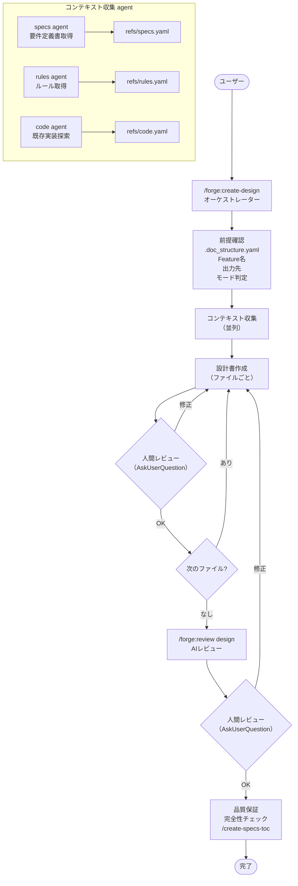

# forge 設計書作成ワークフロー 設計書

> 対象プラグイン: forge | スキル: `/forge:create-design`

---

## 1. 概要

`/forge:create-design` は要件定義書から設計書を作成するオーケストレータスキル。
要件定義書の分析 → 既存実装資産の確認 → 設計書作成 → 品質保証の流れで動作する。

### 現状の課題

現在は全工程をオーケストレータ自身が単一コンテキストで実行している。
オーケストレータパターン要件（`orchestrator_pattern.md`）に基づき、
以下の工程は subagent への委譲が望ましい:

- 要件定義書・ルールの収集（コンテキスト収集 agent）
- 既存実装資産の探索（コード探索 agent）
- 設計書のドラフト作成（作成 agent）

---

## 2. フローチャート



---

## 3. フェーズ詳細

### 前提確認フェーズ [MANDATORY]

| Step | 内容 | 実行者 |
|------|------|--------|
| 1 | `.doc_structure.yaml` の確認 | orchestrator |
| 2 | Feature 名の確定（引数 or AskUserQuestion）| orchestrator |
| 3 | 出力先ディレクトリの解決 | orchestrator |
| 4 | モード判定（新規作成 / 既存修正）| orchestrator |
| 5 | defaults 読み込み | orchestrator |

**読み込む defaults:**
- `spec_format.md` — ID 分類カタログ
- `design_format.md` — 設計書テンプレート
- `design_principles.md` — 設計原則ガイド
- `spec_design_boundary_guide.md` — 要件/設計の境界ガイド

### Phase 1: コンテキスト収集

要件定義書・ルール・既存実装を収集する。

| 収集対象 | 手段 | 出力 |
|---------|------|------|
| 要件定義書 | `/query-specs` or `.doc_structure.yaml` Glob | refs/specs.yaml |
| 実装ルール | `/query-rules` or `.doc_structure.yaml` Glob | refs/rules.yaml |
| 既存実装資産 | Glob / Grep / MCP コード解析 | refs/code.yaml |

**既存実装資産の確認 [MANDATORY]:**
- 類似コンポーネント・モジュールが既存コードに存在するか探索
- 見つかった場合は**再利用を前提**に設計する（新規作成禁止）

### Phase 2: 設計書の作成

| Step | 内容 |
|------|------|
| 2.1 | refs/ の情報を統合し、設計書のドラフトを作成 |
| 2.2 | フォーマット適用（`design_format.md` に準拠）|
| 2.3 | 設計ID体系の確認（`spec_format.md` の DES-xxx）|
| 2.4 | **各ファイル完成ごとに AskUserQuestion で人間レビュー** [MANDATORY] |

### Phase 3: AIレビュー

| Step | 内容 | 実行者 |
|------|------|--------|
| 3.1 | `/forge:review design` 実行 | subagent（review ワークフロー）|
| 3.2 | 人間レビュー確認（AskUserQuestion）| orchestrator |

### Phase 4: 品質保証

| Step | 内容 |
|------|------|
| 4.1 | 完全性チェック（要件反映漏れ、ID一意性、既存資産活用）|
| 4.2 | `/create-specs-toc` 実行 [MANDATORY] |

---

## 4. 設計原則

### 要件定義書の全件反映

設計書は要件定義書の全要件をカバーする。未反映の要件がないことを Phase 4 で検証する。

### 既存実装資産の再利用 [MANDATORY]

既存コードに類似コンポーネントが存在する場合、新規作成ではなく再利用を前提に設計する。
Phase 1 の探索で見つかった資産は設計書内で明示的に参照する。

### What/How の境界

`spec_design_boundary_guide.md` に従い、設計書は「How（どう構成するか）」に集中する。
「What（何を実現するか）」は要件定義書の責務であり、設計書に重複して書かない。

---

## 5. 次ステップの案内

```
/forge:review design {path} --auto    # AIレビュー+自動修正
/forge:create-plan {feature}          # 計画書作成
```

---

## 6. 関連ファイル

| ファイル | 説明 |
|---------|------|
| `plugins/forge/skills/create-design/SKILL.md` | スキル仕様 |
| `plugins/forge/defaults/design_format.md` | 設計書テンプレート |
| `plugins/forge/defaults/design_principles.md` | 設計原則ガイド |
| `plugins/forge/defaults/spec_format.md` | ID分類カタログ |
| `plugins/forge/defaults/spec_design_boundary_guide.md` | 要件/設計の境界ガイド |
