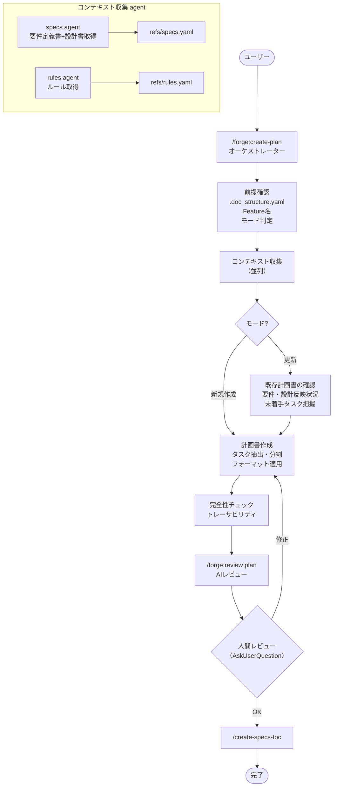

# forge 計画書作成ワークフロー 設計書

> 対象プラグイン: forge | スキル: `/forge:create-plan`

---

## 1. 概要

`/forge:create-plan` は要件定義書・設計書からタスクを抽出し計画書を作成するオーケストレータスキル。
文書取得 → タスク抽出・分割 → 計画書作成 → AIレビュー → 人間承認の流れで動作する。

### 現状の課題

現在は全工程をオーケストレータ自身が単一コンテキストで実行している。
オーケストレータパターン要件（`orchestrator_pattern.md`）に基づき、
以下の工程は subagent への委譲が望ましい:

- 要件定義書・設計書・ルールの収集（コンテキスト収集 agent）
- AIレビュー（既に `/forge:review plan` として委譲済み）

---

## 2. フローチャート



---

## 3. フェーズ詳細

### 前提確認フェーズ [MANDATORY]

| Step | 内容 | 実行者 |
|------|------|--------|
| 1 | `.doc_structure.yaml` の確認 | orchestrator |
| 2 | Feature 名の確定（引数 or AskUserQuestion）| orchestrator |
| 3 | モード判定（新規作成 / 更新）| orchestrator |
| 4 | defaults 読み込み | orchestrator |

**読み込む defaults:**
- `spec_format.md` — ID 分類カタログ
- `plan_format.md` — 計画書テンプレート
- `plan_principles.md` — 計画書作成原則ガイド

### Phase 1: コンテキスト収集 [MANDATORY]

| 収集対象 | 手段 | 出力 |
|---------|------|------|
| 要件定義書 | `/query-specs` or `.doc_structure.yaml` Glob | refs/specs.yaml |
| 設計書 | `/query-specs` or `.doc_structure.yaml` Glob | refs/specs.yaml（同一ファイル）|
| 実装ルール | `/query-rules` or `.doc_structure.yaml` Glob | refs/rules.yaml |

**設計書は必須入力。** 見つからない場合は AskUserQuestion でユーザーに手動指定またはスキップ確認（リスク理解のもと）。

### Phase 2: 計画書の作成・更新

| Step | 内容 |
|------|------|
| 2.1 | 更新モード時: 既存計画書の確認（要件・設計反映状況、未着手タスク把握）|
| 2.2 | 設計書からタスク抽出・分割 |
| 2.3 | フォーマット適用（`plan_format.md` に準拠）|
| 2.4 | 完全性チェック [MANDATORY] |

**タスク粒度 [MANDATORY]:**
- 1 Agent が単独で実行・完結できる単位
- 5〜10 項目程度
- ビルド成功（コンパイル通過）が完了条件

**完全性チェック項目:**
- タスクID の一意性
- 要件 → 設計 → タスクのトレーサビリティマトリクス
- 優先度と依存関係の整合性

### Phase 3: AIレビューと承認

| Step | 内容 | 実行者 |
|------|------|--------|
| 3.1 | `/forge:review plan` 実行 | subagent（review ワークフロー）|
| 3.2 | 人間レビュー確認（AskUserQuestion）| orchestrator |

---

## 4. 設計原則

### タスクは Agent 実行単位で分割 [MANDATORY]

1つのタスクは 1 Agent が単独で実行・完結できる粒度とする。
タスク完了条件は「ビルド成功（コンパイル通過）」を最低基準とする。

### トレーサビリティの確保

計画書内にトレーサビリティマトリクスを含める:
- 要件ID → 設計ID → タスクID の対応表
- 未対応の要件・設計がないことを検証

### 更新モードの既存資産確認

更新時は既存計画書を Read し、以下を把握してから更新する:
- 要件定義書・設計書への反映状況
- 未着手タスクの有無
- 完了済みタスクとの整合性

---

## 5. 次ステップの案内

```
計画書の優先度・依存関係に従ってタスクを実行
```

---

## 6. 関連ファイル

| ファイル | 説明 |
|---------|------|
| `plugins/forge/skills/create-plan/SKILL.md` | スキル仕様 |
| `plugins/forge/defaults/plan_format.md` | 計画書テンプレート |
| `plugins/forge/defaults/plan_principles.md` | 計画書作成原則ガイド |
| `plugins/forge/defaults/spec_format.md` | ID分類カタログ |
