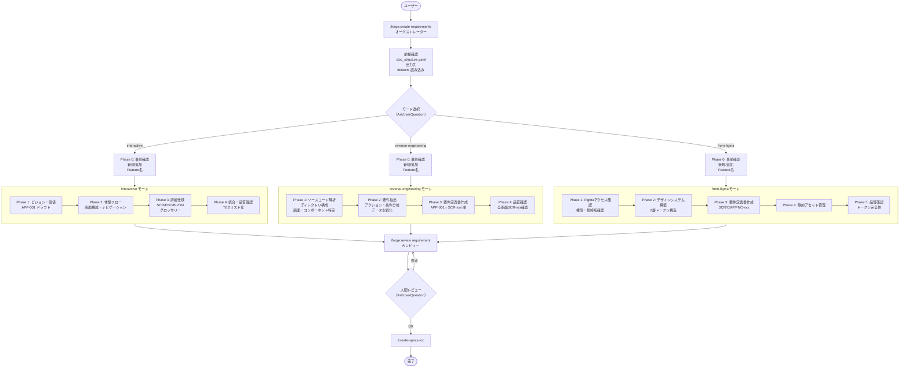

# forge 要件定義書作成ワークフロー 設計書

> 対象プラグイン: forge | スキル: `/forge:create-requirements`

---

## 1. 概要

`/forge:create-requirements` は3つのモード（interactive / reverse-engineering / from-figma）で
要件定義書を作成するオーケストレータスキル。

モードによって入力源が大きく異なるが、出力フォーマット（SCR/FNC/BL/DM 体系）は共通。

### 現状の課題

現在は全工程をオーケストレータ自身が単一コンテキストで実行している。
特に reverse-engineering モードではソースコード解析が大量のコンテキストを消費する。
オーケストレータパターン要件（`orchestrator_pattern.md`）に基づき、
以下の工程は subagent への委譲が望ましい:

- ソースコード解析（reverse-engineering モード）
- Figma データ取得・解析（from-figma モード）
- ルール収集（コンテキスト収集 agent）

---

## 2. フローチャート



---

## 3. 共通フェーズ

### 前提確認フェーズ [MANDATORY]

| Step | 内容 | 実行者 |
|------|------|--------|
| 1 | `.doc_structure.yaml` の確認 | orchestrator |
| 2 | 出力先ディレクトリの解決 | orchestrator |
| 3 | defaults 読み込み + `/query-rules` 実行 | orchestrator |

**読み込む defaults:**
- `spec_format.md` — ID 分類カタログ
- `requirement_format.md` — 要件定義書テンプレート
- `spec_design_boundary_guide.md` — 要件/設計の境界ガイド

### Phase 0: 事前確認（全モード共通）

| Step | 内容 |
|------|------|
| 0.1 | 新規作成 / 追加の確定（AskUserQuestion）|
| 0.2 | Feature 名の確定 |
| 0.3 | 既存資産の収集（`--add` 時: DocAdvisor or Glob）|

---

## 4. モード別フェーズ

### interactive モード（対話型）

ユーザーとの対話でゼロから要件を固める。

| Phase | 内容 | 主な成果物 |
|-------|------|-----------|
| 1 | ビジョン・価値の確定 | APP-001 ドラフト |
| 2 | 体験フロー・画面構成の確定 | シナリオ、画面一覧、ナビゲーション構造 |
| 3 | 詳細仕様の作成 | SCR-xxx / FNC-xxx / BL-xxx / DM-xxx + グロッサリー [MANDATORY] |
| 4 | 統合・品質確認 | 未確定事項（TBD）リスト |

**対話原則 [MANDATORY]:**
- 選択肢ファースト（3〜5問以内で区切る）
- 視覚的確認（ASCII / Mermaid 図を活用）
- What に集中（How は記載しない）
- TBD を許容する（未確定は明示して先に進む）
- スコープ管理（必須 / あると良い / 将来 の3段階）

### reverse-engineering モード（ソース解析）

既存アプリのソースコードから要件を逆算する。

| Phase | 内容 | 主な成果物 |
|-------|------|-----------|
| 1 | ソースコード解析 | ディレクトリ構成、画面・コンポーネント一覧、ナビゲーション構造 |
| 2 | 要件抽出 | ユーザーアクション、条件分岐、データ永続化、エラーハンドリング |
| 3 | 要件定義書作成 | APP-001 → SCR-xxx 順に記載 |
| 4 | 品質確認 | 全画面 SCR-xxx・主要機能 FNC-xxx の網羅確認 |

### from-figma モード（Figma 取り込み）

Figma MCP 経由でデザインファイルから要件とデザイントークンを作成する。

| Phase | 内容 | 主な成果物 |
|-------|------|-----------|
| 1 | Figma アクセス確認 | 権限確認、最終版確認 |
| 2 | デザインシステム構築 | カラー / タイポ / スペーシング / シャドウ → 2層トークン構造 |
| 3 | 要件定義書作成 | SCR-xxx（ASCII レイアウト図）、CMP-xxx、FNC-xxx |
| 4 | 静的アセット管理 | アイコン・イラスト・ロゴ・背景画像の洗い出し |
| 5 | 品質確認 | デザイントークン完全性 + 全画面対応確認 |

**前提条件:** Figma MCP が利用可能であること。

---

## 5. 共通後処理フェーズ

モード別フェーズ完了後、全モード共通で以下を実行する。

### AIレビュー

| Step | 内容 | 実行者 |
|------|------|--------|
| 1 | `/forge:review requirement` 実行 | subagent（review ワークフロー）|
| 2 | 人間レビュー確認（AskUserQuestion）| orchestrator |

### 品質保証

| Step | 内容 |
|------|------|
| 1 | `/create-specs-toc` 実行 [MANDATORY] |

---

## 6. 設計原則

### What に集中する [MANDATORY]

要件定義書は「何を実現するか」を記述する。
「どう実装するか」は設計書の責務であり、要件定義書に含めない。
判断に迷う場合は `spec_design_boundary_guide.md` を参照する。

### コンテキスト収集は最小限

要件定義書作成時に実装ルール（`/query-rules`）は収集するが、
仕様書（`/query-specs`）と既存コード探索は原則不要。

- `/query-rules`: プロジェクト固有の記述規約を把握するために使用
- `/query-specs`: `--add`（追加モード）時のみ、既存要件との整合確認に使用

### ID 体系の一貫性

`spec_format.md` に定義された ID 体系に従う:
- `APP-xxx`: アプリ概要
- `SCR-xxx`: 画面
- `FNC-xxx`: 機能要件
- `BL-xxx`: ビジネスロジック
- `DM-xxx`: データモデル
- その他（CMP, THEME, NAV, API, EXT, NFR, SEC, ERR）

---

## 7. 次ステップの案内

```
/forge:review requirement {path} --auto      # AIレビュー+自動修正
/forge:review requirement {path} --auto 3    # 3サイクル徹底修正
```

---

## 8. 関連ファイル

| ファイル | 説明 |
|---------|------|
| `plugins/forge/skills/create-requirements/SKILL.md` | スキル仕様 |
| `plugins/forge/defaults/requirement_format.md` | 要件定義書テンプレート |
| `plugins/forge/defaults/spec_format.md` | ID分類カタログ |
| `plugins/forge/defaults/spec_design_boundary_guide.md` | 要件/設計の境界ガイド |
