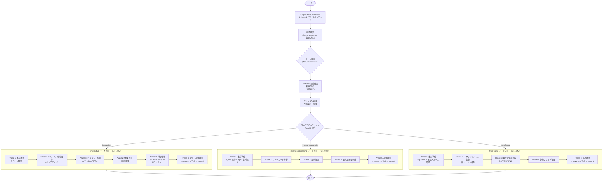

# forge 要件定義書作成ワークフロー 設計書

> 対象プラグイン: forge | スキル: `/forge:start-requirements`

---

## 1. 概要

`/forge:start-requirements` は3つのモード（interactive / reverse-engineering / from-figma）で
要件定義書を作成するオーケストレータスキル。

モードによって入力源・ワークフローが大きく異なるため、モード確定後に各ワークフローファイルへ分岐する設計とする。各ワークフローは完了処理まで自己完結しており、SKILL.md に戻る必要はない。

### 設計方針

- **SKILL.md はディスパッチャー**: 前提確認・モード選択・セッション管理のみを担当
- **ワークフローファイルは自己完結**: 各モードの全手順（コンテキスト収集〜完了処理）を包含
- **interactive はヒアリング駆動**: 事前一括コンテキスト収集を行わず、対話で必要性が判明してから調査

---

## 2. ファイル構成

```
plugins/forge/skills/start-requirements/
├── SKILL.md                                         # ディスパッチャー
├── docs/
│   ├── requirements_interactive_workflow.md          # 対話型ワークフロー
│   ├── requirements_reverse_engineering_workflow.md  # ソース解析型ワークフロー
│   └── requirements_from_figma_workflow.md           # Figma 型ワークフロー
```

---

## 3. フローチャート



---

## 4. SKILL.md（ディスパッチャー）の責務

| Step | 内容 | 実行者 |
|------|------|--------|
| 1 | `.doc_structure.yaml` の確認 | orchestrator |
| 2 | 出力先ディレクトリの解決 | orchestrator |
| 3 | モード選択 | orchestrator |
| 4 | Phase 0（新規/追加、Feature 名） | orchestrator |
| 5 | セッション管理 | orchestrator |
| 6 | ワークフローファイルの Read & 実行委譲 | orchestrator |

SKILL.md はワークフローファイルに実行を委譲した後、制御を返さない。

---

## 5. モード別ワークフロー

### interactive モード（対話型）

ユーザーとの対話でゼロから要件を固める。**事前一括コンテキスト収集を行わない**。

| Phase | 内容 | 主な成果物 |
|-------|------|-----------|
| 0 | 事前確認（新規/追加、スコープ） | スコープ定義メモ |
| 0.5 | ルール・仕様取得（オンデマンド） | 参照文書リスト |
| 1 | ビジョン・価値の確定 | APP-001 ドラフト |
| 2 | 体験フロー・構成の確定 | シナリオ、画面/IF 一覧、フロー図 |
| 3 | 詳細仕様の作成 | SCR/FNC/BL/DM + グロッサリー |
| 4 | 統合・品質確認・完了処理 | 完成した要件定義書 |

**設計上の特徴**:
- Phase 0.5 でルール/仕様取得（ヒアリング後、構造化前）
- 必要に応じて WebSearch で外部情報調査
- コンテキスト収集 agent の並列起動パターンは使わない
- 対話原則・アンチパターン・質問テンプレートで対話品質を担保

### reverse-engineering モード（ソース解析）

既存アプリのソースコードから要件を逆算する。**事前にコンテキストを一括収集**する。

| Phase | 内容 | 主な成果物 |
|-------|------|-----------|
| 1 | 事前準備（ルール取得 + agent 並列起動） | refs/ 収集結果 |
| 2 | ソースコード解析 | ディレクトリ構成、画面一覧、ナビゲーション構造 |
| 3 | 要件抽出 | アクション、条件分岐、データ永続化、エラー |
| 4 | 要件定義書作成 | APP-001 → SCR-xxx 順に記載 |
| 5 | 品質確認・完了処理 | 完成した要件定義書 |

### from-figma モード（Figma 取り込み）

Figma MCP 経由でデザインファイルから要件とデザイントークンを作成する。

| Phase | 内容 | 主な成果物 |
|-------|------|-----------|
| 1 | 事前準備（Figma MCP 確認 + ルール取得） | Figma アクセス確認済み |
| 2 | デザインシステム構築 | 2層トークン構造、再利用コンポーネント |
| 3 | 要件定義書作成 | SCR-xxx（ASCII レイアウト図）、CMP-xxx、FNC-xxx |
| 4 | 静的アセット管理 | アセット一覧、管理方針 |
| 5 | 品質確認・完了処理 | 完成した要件定義書 |

**前提条件**: Figma MCP が利用可能であること（Phase 1 で確認）。

---

## 6. 設計原則

### What に集中する [MANDATORY]

要件定義書は「何を実現するか」を記述する。
「どう実装するか」は設計書の責務であり、要件定義書に含めない。
判断に迷う場合は `spec_design_boundary_spec.md` を参照する。

### コンテキスト収集はモード別に最適化

| モード | 収集方式 | 理由 |
|--------|---------|------|
| interactive | オンデマンド（対話駆動） | ユーザーの要望が判明するまで何を検索すべきか不明 |
| reverse-engineering | 事前一括（agent 並列） | ソースコードという確定的な入力がある |
| from-figma | 事前一括（rules agent） | Figma ファイルという確定的な入力がある |

### ワークフローの自己完結性

各ワークフローファイルは以下を全て包含する:
- 必読文書の指定
- コンテキスト収集（モードに適した方式）
- 要件作成の全手順
- 品質確認
- AI レビュー（`/forge:review requirement --auto`）
- ToC 更新（`/create-specs-index`）
- commit 確認（`/anvil:commit`）
- セッション削除

SKILL.md への参照・戻りは不要。

### ID 体系の一貫性

`spec_format.md` に定義された ID 体系に従う:
- `APP-xxx`: アプリ概要
- `SCR-xxx`: 画面
- `FNC-xxx`: 機能要件
- `BL-xxx`: ビジネスロジック
- `DM-xxx`: データモデル
- その他（CMP, THEME, NAV, API, EXT, NFR, SEC, ERR）

---

## 7. 関連ファイル

| ファイル | 説明 |
|---------|------|
| `plugins/forge/skills/start-requirements/SKILL.md` | スキル仕様（ディスパッチャー） |
| `plugins/forge/skills/start-requirements/docs/requirements_interactive_workflow.md` | 対話型ワークフロー |
| `plugins/forge/skills/start-requirements/docs/requirements_reverse_engineering_workflow.md` | ソース解析型ワークフロー |
| `plugins/forge/skills/start-requirements/docs/requirements_from_figma_workflow.md` | Figma 型ワークフロー |
| `plugins/forge/docs/requirement_format.md` | 要件定義書テンプレート |
| `plugins/forge/docs/spec_format.md` | ID 分類カタログ |
| `plugins/forge/docs/spec_design_boundary_spec.md` | 要件/設計の境界ガイド |
| `plugins/forge/docs/context_gathering_spec.md` | コンテキスト収集仕様 |
