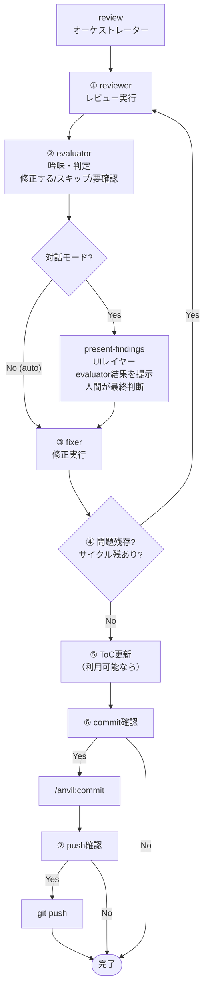

# forge レビューパイプライン 設計書

> Version: 0.0.11 | 対象プラグイン: forge

---

## 1. 概要

forge プラグインのレビュー機能は、`/forge:review` を起点とするパイプライン構造で動作する。
ユーザーが呼び出すのは `review` のみで、実際のレビュー・吟味・修正は専用のAI専用スキルが担当する。

### 設計の背景

旧設計では `review` スキルが以下を全て担っていた（God-Skill 問題）:

- 引数解析・環境確認
- 参考文書収集
- レビュー実行
- 指摘の吟味・修正判定
- 修正実行
- ToC更新・commit・push

単一責任原則に基づき、`review` をオーケストレーターとして整理し、各工程を専用スキルに委譲する構造に改めた。

---

## 2. スキル一覧と責務

| スキル             | 種別                                | 責務                                                        |
| ------------------ | ----------------------------------- | ----------------------------------------------------------- |
| `review`           | user-invocable / オーケストレーター | 引数受付・全体進行管理・ToC更新・commit/push                |
| `reviewer`         | AI専用                              | 参考文書収集（1回のみ）・レビュー実行・結果と文書パスを返す |
| `evaluator`        | AI専用                              | 指摘事項の吟味・修正判定（5観点）・should_continue 返却     |
| `present-findings` | AI専用                              | UIレイヤー: evaluator の判定結果を人間に提示・最終判断を仰ぐ |
| `fixer`            | AI専用                              | 修正実行（参考文書を渡されれば再収集不要）                  |

### 廃止スキル

| スキル         | 廃止理由                                             |
| -------------- | ---------------------------------------------------- |
| `finalize`     | ToC更新・commit は `review` オーケストレーターが担う |
| `fix-findings` | `fixer` に改名                                       |

---

## 3. フローチャート

### コアループ（auto / 対話 共通）



### コアループの原則

コアループ（reviewer → evaluator → fixer → re-review）は auto モードと対話モードで**同一**である。

- **evaluator は常に実行される**: auto / 対話 を問わず、全指摘を5観点で吟味する
- **present-findings は UI レイヤー**: evaluator の判定結果を人間に提示し、最終判断を仰ぐ。コアの吟味ロジックは evaluator が担う
- **品質の一貫性**: コアループが同一であるため、auto モードと対話モードでレビュー品質が変わらない

```
auto モード:     reviewer → evaluator → fixer → loop
対話モード:      reviewer → evaluator → present-findings → fixer → loop
                                         ↑ UIレイヤー（提示+人間判断）
```

---

## 4. スキル間インタフェース

### review（orchestrator）が事前に実施すること

reviewer を呼び出す前に、orchestrator が以下を解決する:

1. `resolve_review_context.py` を実行して `target_files` を確定
2. general-purpose subagent を起動して `related_code`（関連コード）を探索
3. reference_docs を収集（DocAdvisor / `.doc_structure.yaml` フォールバック）
4. `review_criteria_path` を確定（DocAdvisor → review-config.yaml → デフォルト）

> **related_code 探索について**: 将来的には `/code-advisor` Skill に置き換え予定。
> 現状は general-purpose subagent が target_files を起点に関連実装を探索する。

### review → reviewer

| 方向 | 項目                 | 内容                                                   |
| ---- | -------------------- | ------------------------------------------------------ |
| 入力 | 種別                 | `code` / `requirement` / `design` / `plan` / `generic` |
| 入力 | target_files         | 解決済みファイルパス一覧                               |
| 入力 | エンジン             | `codex` / `claude`                                     |
| 入力 | reference_docs       | 収集済み参考文書パス一覧                               |
| 入力 | review_criteria_path | レビュー観点ファイルのパス                             |
| 入力 | related_code         | 関連コードのパスと関連性の説明                         |
| 出力 | レビュー結果         | 🔴🟡🟢 マーカー付き指摘事項リスト（**これのみ**）      |

### review → evaluator

| 方向 | 項目            | 内容                                          |
| ---- | --------------- | --------------------------------------------- |
| 入力 | レビュー結果    | reviewer が出力した指摘事項リスト             |
| 入力 | reference_docs  | 収集済み参考文書パス                          |
| 入力 | target_files    | レビュー対象ファイル                          |
| 入力 | related_code    | 関連コードのパスと関連性の説明                |
| 入力 | レビュー種別    | 確定した種別                                  |
| 入力 | 修正対象フラグ  | `--auto`: 🔴+🟡 / `--auto-critical`: 🔴のみ / `--interactive`: 全件AI推奨 |
| 出力 | 吟味結果リスト  | recommendation（fix / skip / needs_review）+ auto_fixable フラグ |
| 出力 | plan.yaml 更新  | 推奨に基づく初期状態を plan.yaml に書き込み                      |
| 出力 | should_continue | `true`（fix あり）/ `false`（fix なし）— 全モード共通           |

### review → present-findings（対話モードのみ・UIレイヤー）

| 方向 | 項目               | 内容                                                  |
| ---- | ------------------ | ----------------------------------------------------- |
| 入力 | evaluator の判定結果 | 吟味済み指摘リスト（recommendation + auto_fixable）   |
| 入力 | plan.yaml            | evaluator が推奨で初期更新済み                        |
| 入力 | レビュー結果       | reviewer が出力した指摘事項リスト                     |
| 入力 | reference_docs     | 収集済み参考文書パス                                  |
| 出力 | plan.yaml 上書き更新 | ユーザーの最終判断で evaluator の初期状態を上書き     |
| 出力 | 人間の最終判断     | evaluator の推奨を参考に、人間が各指摘の対応を決定    |

**present-findings の役割**: evaluator が吟味した結果を人間に段階的に提示し、最終判断を仰ぐ UIレイヤー。吟味ロジック自体は evaluator が担い、present-findings は提示・インタラクションに専念する。✅ マークは evaluator の `auto_fixable` フラグをそのまま使用し、独自判定は行わない。

### review → fixer

| 方向 | 項目                   | 内容                                        |
| ---- | ---------------------- | ------------------------------------------- |
| 入力 | 指摘事項（修正リスト） | evaluator / present-findings が選別した指摘 |
| 入力 | target_files           | 修正対象ファイル                            |
| 入力 | レビュー種別           | 確定した種別                                |
| 入力 | reference_docs         | 収集済み参考文書パス                        |
| 入力 | related_code           | 関連コードのパスと関連性の説明              |
| 入力 | モード                 | `--single`（1件）/ `--batch`（一括）        |
| 出力 | 修正サマリー           | 修正ファイル・修正内容・影響範囲            |

---

## 5. 設計原則

### 参考文書収集は1回のみ（orchestrator が担当）

`review` orchestrator が `target_files` 解決・`reference_docs` 収集・`review_criteria_path` 確定を行い、
以降の全 agent（reviewer・evaluator・fixer）に渡す。
各 agent は渡されたパスを Read するだけで、独自収集は行わない。

### コアループは auto / 対話 で同一

コアループ（reviewer → evaluator → fixer → re-review）は両モードで共通。
evaluator は常に実行され、対話モードでは evaluator の後に present-findings が UIレイヤーとして入るだけ。

| モード                   | コアループ                      | UIレイヤー       | 最終判断者 |
| ------------------------ | ------------------------------- | ---------------- | ---------- |
| `--auto N`               | reviewer → evaluator → fixer   | なし             | AI         |
| 対話モード（デフォルト） | reviewer → evaluator → fixer   | present-findings | 人間       |

**品質の一貫性**: コアの吟味ロジック（evaluator）が常に動くため、auto モードの品質が対話モードと同等になる。present-findings は evaluator の推奨判定を人間に提示し、人間が修正方針を決める。

### 関連コードを探索して全 agent に渡す

`review` orchestrator が target_files を起点に general-purpose subagent で関連コードを探索し、
reviewer・evaluator・fixer 全員に渡す。

- reviewer は既存実装のパターンを把握してレビューの質を上げる
- evaluator は設計意図・副作用リスクの判定に使う
- fixer は実装パターン・命名規則・スタイルに合わせて修正する

> 将来的には `/code-advisor` Skill に置き換え予定。

### 修正後はテストを実行する

修正が1件以上実行された場合、`tests/` 等のテストが存在すれば実行して結果を報告する。
テストが失敗した場合はユーザーに報告し、対応を確認する。

### 設計書との整合性を保つ

修正内容が設計・アーキテクチャに影響する場合、`docs/specs/design/` 等の設計書を更新する。
設計書を更新した場合は `/create-specs-toc` で ToC も更新する。

### commit / push は review オーケストレーターが担当

修正が1件以上実行された場合、review オーケストレーターが最後に確認を取る:

1. commit 確認 → Yes の場合 `/anvil:commit` を呼び出す
2. push 確認 → Yes の場合 `git push` を実行する

### `--auto [N]` フラグ

| 指定       | 動作                             |
| ---------- | -------------------------------- |
| 省略       | 対話モード（人間が判定者）       |
| `--auto`   | 自動修正 1サイクル（🔴+🟡対象）  |
| `--auto N` | 自動修正 N サイクル（🔴+🟡対象） |
| `--auto 0` | レビューのみ（修正なし）         |

---

## 6. evaluator の吟味観点（5観点）

`evaluator` は各指摘について以下の5観点で評価する:

| 観点               | 確認内容                                               |
| ------------------ | ------------------------------------------------------ |
| ルール照合         | 参考文書（ルール・規約）に照らして本当に違反しているか |
| 設計意図           | 現状の実装に意図がある可能性はないか                   |
| 副作用リスク       | この修正が他の箇所に影響しないか                       |
| false positive     | エンジンの誤認識・過剰指摘ではないか                   |
| 対象ファイルの確認 | 判断に迷う場合は対象ファイルを Read して確認する       |

---

## 7. レビュー種別と参考文書収集戦略

| レビュー種別  | DocAdvisor 利用可能時       | 利用不可時（フォールバック）                   |
| ------------- | --------------------------- | ---------------------------------------------- |
| `requirement` | /query-rules + /query-specs | .doc_structure.yaml から rules + specs を Glob |
| `design`      | /query-rules + /query-specs | .doc_structure.yaml から rules + specs を Glob |
| `plan`        | /query-rules + /query-specs | .doc_structure.yaml から rules + specs を Glob |
| `code`        | /query-rules + /query-specs | .doc_structure.yaml から rules + specs を Glob |
| `generic`     | **使用しない**              | **使用しない**（レビュアーが自発探索）         |

レビュー観点（`review_criteria`）の探索優先順:

1. `/query-rules` Skill（DocAdvisor）
2. `.claude/review-config.yaml` の保存済みパス
3. `${CLAUDE_PLUGIN_ROOT}/defaults/review_criteria.md`（プラグインデフォルト）

---

## 8. 関連ファイル

| ファイル                                         | 説明                   |
| ------------------------------------------------ | ---------------------- |
| `plugins/forge/skills/review/SKILL.md`           | オーケストレーター仕様 |
| `plugins/forge/skills/reviewer/SKILL.md`         | レビュー実行スキル仕様 |
| `plugins/forge/skills/evaluator/SKILL.md`        | 吟味・判定スキル仕様   |
| `plugins/forge/skills/fixer/SKILL.md`            | 修正実行スキル仕様     |
| `plugins/forge/skills/present-findings/SKILL.md` | 対話的提示スキル仕様   |
| `plugins/forge/defaults/review_criteria.md`      | デフォルトレビュー観点 |
| `plugins/forge/.claude-plugin/plugin.json`       | スキル登録マニフェスト |
