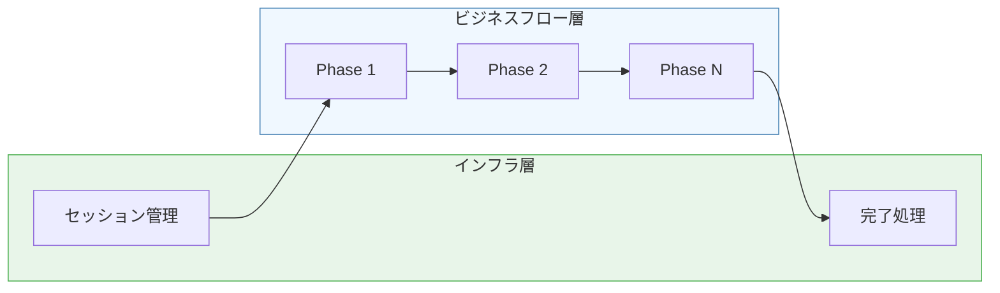
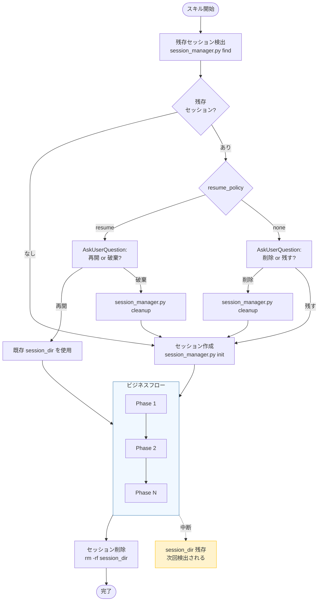
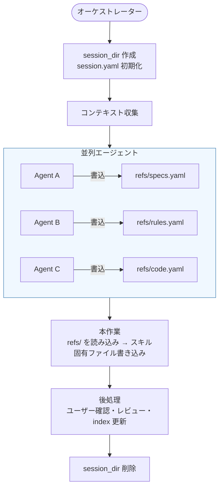
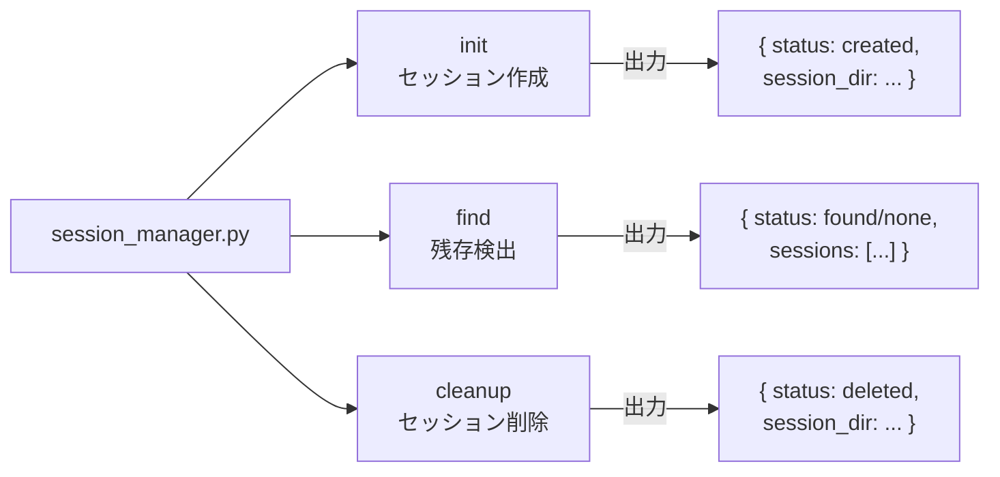

# DES-011 セッション管理設計書

## メタデータ

| 項目     | 値                                                              |
| -------- | --------------------------------------------------------------- |
| 設計ID   | DES-011                                                         |
| 関連要件 | FNC-002 (orchestrator_pattern.md)                               |
| 関連設計 | DES-010 (create_skills_orchestrator_design.md)                  |
| 作成日   | 2026-03-13                                                      |
| 対象     | 全オーケストレータースキル（review, start-design, start-plan, start-requirements, start-implement） |

---

## 1. 概要

forge の全オーケストレータースキルが使用するセッション管理の設計を定義する。

セッションは**フェーズ間のデータをファイル経由で受け渡す**ための一時ディレクトリである。本設計書では、セッションの作成・検出・削除のライフサイクルと、それを実現する `session_manager.py` スクリプトの設計、および SKILL.md におけるセッション管理の位置づけを定義する。

### スコープ

| 本設計書のスコープ | 参照先 |
|-------------------|--------|
| セッションの**ライフサイクル設計**（なぜ・どう管理するか） | 本文書 |
| セッションの**ファイルスキーマ**（session.yaml, refs/ 等の構造） | `plugins/forge/docs/session_format.md` |
| オーケストレータパターンの**要件** | `docs/specs/forge/requirement/orchestrator_pattern.md` |

---

## 2. 設計判断

### 2.1 なぜファイル経由の通信か

| 課題 | ファイル経由の解決 |
|------|-------------------|
| コンテキスト圧縮でデータが消失する | ファイルは永続。圧縮後も Read で復元可能 |
| 並列エージェントの出力が衝突する | 各エージェントが別ファイルに書き込み |
| 中断後にデータを再利用したい | ディレクトリが残っていれば再開可能 |

> FNC-002「セッションディレクトリ通信」の実装。

### 2.2 なぜスクリプト（session_manager.py）に委譲するか

AI がセッションディレクトリを手作業で構築すると、以下の問題が発生する:

| 問題 | 具体例 |
|------|--------|
| **YAML フォーマットミス** | インデント不正、クォート漏れ、コロン後のスペース欠落 |
| **フィールド漏れ** | `resume_policy` や `last_updated` の書き忘れ |
| **タイムスタンプ形式の不統一** | ISO 8601 の `T` / `Z` の有無がばらつく |
| **ディレクトリ名の衝突** | ランダム部分の生成が不安定 |
| **フィールド順序の不統一** | 共通フィールド→スキル固有フィールドの順序が保証されない |

`session_manager.py` に以下を委譲することで、AI は引数を渡すだけで正しいセッションを作成できる:

- ディレクトリ名の生成（スキル名 + ランダム hex）
- `session.yaml` の YAML テキスト組み立て（フィールド順序保証）
- タイムスタンプの自動生成（UTC ISO 8601）
- `resume_policy` のデフォルト値計算
- 残存セッションの検索（YAML パース）
- 安全な削除（パストラバーサル防止）

### 2.3 なぜセッション管理はフェーズの外に独立するか

セッション管理はフロー全体のライフサイクルを管理する**インフラ関心事**であり、ビジネスロジックのフェーズ（コンテキスト収集、文書作成、レビュー等）とは**抽象レベルが異なる**。



**混在させた場合の問題:**

- AI がフェーズを読む時、ビジネスアクションとは無関係なセッション操作が途中に挟まり、ワークフローの本質が見えにくくなる
- セッション管理の配置がスキルごとにバラバラになる（Phase 1.5、独立セクション、Phase 3.1 等）

**分離した場合の利点:**

- ビジネスフローの Phase は「何をするか」だけに集中できる
- セッション管理は全スキルで統一パターン（`## セッション管理 [MANDATORY]`）
- 開始と終了のブックエンド構造が明確

---

## 3. SKILL.md の構造パターン

### 3.1 共通パターン

```
## 事前準備 [MANDATORY]         ← 引数解析・出力先解決・defaults 読み込み
## セッション管理 [MANDATORY]   ← インフラ（残存検出 → 作成）
## Phase 1: ...                 ← ビジネスフロー開始
## Phase 2: ...
## Phase N: ...
## 完了処理                     ← インフラ（セッション削除 + 案内）
```

- **セッション管理**と**完了処理**はビジネスフローの**ブックエンド**であり、Phase 番号を持たない
- 事前準備でセッション作成に必要な情報（Feature 名、モード等）を確定した後にセッション管理を実行する
- スキルごとに事前準備の内容は異なるが、セッション管理→ビジネスフロー→完了処理の3層構造は共通

### 3.2 スキル別の構造

| スキル | 事前準備 | セッション管理 | ビジネスフロー |
|--------|---------|---------------|---------------|
| start-design | Feature確定・出力先・モード・defaults | `## セッション管理` | Phase 1-4 |
| start-plan | Feature確定・出力先・モード・defaults | `## セッション管理` | Phase 1-4 |
| start-requirements | 前提確認・モード選択・Phase 0 | `## セッション管理` | コンテキスト収集 + Mode別処理 |
| start-implement | Phase 1(事前確認) + Phase 2(タスク選択) | `## セッション管理` | Phase 3-5 |
| review | Phase 1(引数解析) + Phase 2(収集) | `## セッション管理` | Phase 3-5 |

> start-implement と review は事前準備のステップ数が多いため Phase 番号付きで記述するが、セッション管理は Phase の間に独立セクションとして挿入する。

---

## 4. セッションライフサイクル

### 4.1 全体フロー



### 4.2 resume_policy の設計

| 値 | 対象スキル | 根拠 |
|----|-----------|------|
| `resume` | review | サイクル実行（reviewer → evaluator → fixer）の中間状態に価値がある。レビュー結果や修正プランの再収集はコストが高い |
| `none` | start-design, start-plan, start-requirements, start-implement | 直線的ワークフロー。中断時は最初からやり直す方が効率的。コンテキスト収集の再実行コストは低い |

### 4.3 データフロー



---

## 5. session_manager.py の設計

### 5.1 設計方針

| 方針 | 理由 |
|------|------|
| 標準ライブラリのみ | PyYAML 等の外部依存を避ける（プロジェクト規約） |
| 簡易 YAML writer/reader | フラット key-value のみ対応。ネスト構造は不要 |
| JSON 出力 | AI がパースしやすい。`ensure_ascii=False, indent=2` |
| `parse_known_args` | `--skill` 以外の任意 `--key value` をスキル固有フィールドとして受け入れる |
| パストラバーサル防止 | cleanup 時に `realpath` で正規化し `.claude/.temp/` 配下であることを検証 |

### 5.2 サブコマンド



| サブコマンド | 入力 | 処理 | 出力 |
|-------------|------|------|------|
| `init` | `--skill` + 任意 `--key value` | ディレクトリ作成 + session.yaml 書き出し | `{"status": "created", "session_dir": "..."}` |
| `find` | `--skill` | `.claude/.temp/*/session.yaml` を検索 | `{"status": "found"/"none", "sessions": [...]}` |
| `cleanup` | session_dir パス | パス検証 + `shutil.rmtree()` | `{"status": "deleted", "session_dir": "..."}` |

### 5.3 session.yaml のフィールド順序

共通フィールドを先に出力し、スキル固有フィールドはアルファベット順:

```
skill           ← 常に先頭
started_at
last_updated
status
resume_policy
---             ← ここからスキル固有
auto_count      ← アルファベット順
engine
feature
mode
output_dir
...
```

この順序保証により、YAML の diff が安定する。

### 5.4 resume_policy のデフォルト値

```python
if skill == "review":
    resume_policy = "resume"
else:
    resume_policy = "none"
```

`--resume-policy` 引数で明示指定すればデフォルトを上書きできる。

---

## 改定履歴

| 日付 | バージョン | 内容 |
|------|-----------|------|
| 2026-03-13 | 1.0 | 初版作成 |
