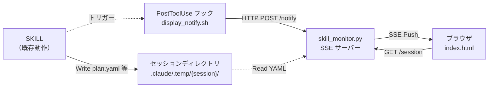
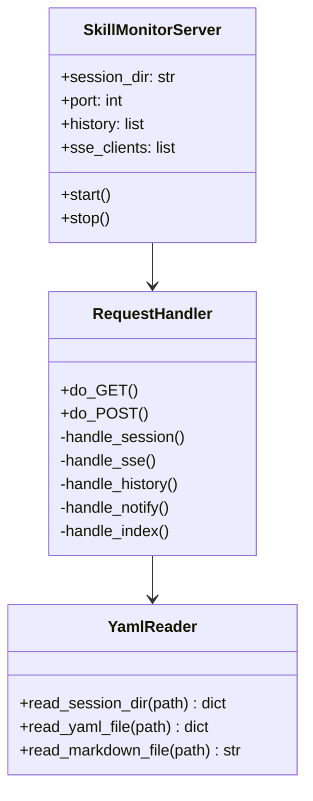
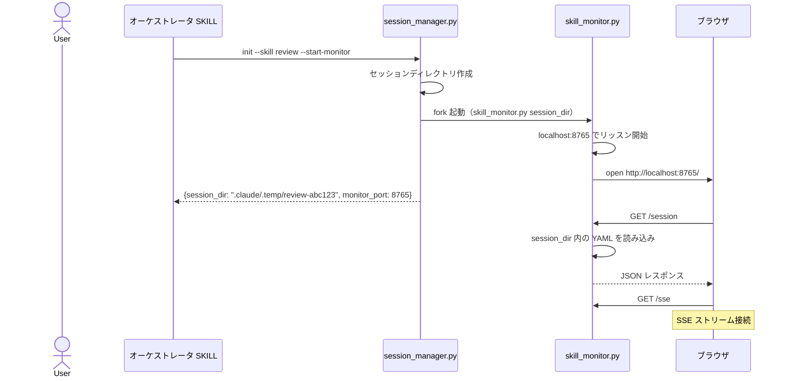
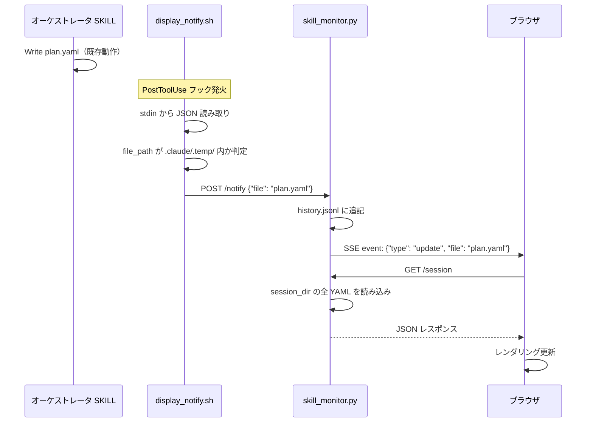
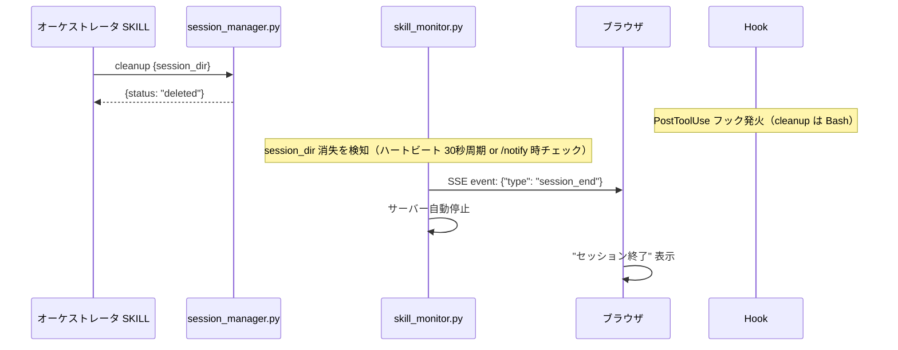

# DES-012 skill_monitor 設計書

## メタデータ

| 項目 | 値 |
|------|-----|
| 設計ID | DES-012 |
| 関連要件 | FNC-001〜FNC-007, NFR-001〜NFR-004（skill_monitor_requirement.md） |
| 作成日 | 2026-03-15 |

## 1. 概要

セッション進捗のリアルタイムブラウザ表示を実現する。SKILL 側の追加コードゼロで、既存の YAML 更新をフックが検知し、SSE サーバー経由でブラウザに Push する。

### 設計判断

| 判断 | 採用 | 却下 | 理由 |
|------|------|------|------|
| 通知方式 | PostToolUse フック | mtime ポーリング | CPU 消費なし・即時通知 |
| 中間ファイル | なし（YAML 直接読み取り） | display.json | セッションファイルのスキーマが既知のため変換不要 |
| ブラウザ更新 | SSE | WebSocket / ポーリング | 標準ライブラリのみ・片方向で十分 |
| SSE サーバー | Python http.server | Node.js / Flask | NFR-001（標準ライブラリ） |

---

## 2. アーキテクチャ概要



### 責務の分離

| コンポーネント | 責務 | コンテキスト影響 |
|---------------|------|----------------|
| SKILL | セッションファイルの更新（既存動作） | なし（追加コードゼロ） |
| display_notify.py | Write 検知 → SSE サーバーに通知 | なし（Python スクリプト） |
| skill_monitor.py | YAML 読み込み → JSON 化 → SSE Push | なし（独立プロセス） |
| index.html | SSE 受信 → レンダリング | なし（ブラウザ） |

---

## 3. モジュール設計

### 3.1 モジュール一覧

| モジュール | ファイル | 責務 | 依存 |
|-----------|---------|------|------|
| SSE サーバー | `plugins/forge/scripts/skill_monitor.py` | HTTP サーバー + SSE ストリーム + YAML→JSON 変換 | Python 標準ライブラリ（http.server, json, threading） |
| フック通知 | `.claude/hooks/display_notify.py` | PostToolUse 検知 → HTTP POST | Python 標準ライブラリ（json, urllib.request） |
| ブラウザ UI | `plugins/forge/static/index.html` | SSE 受信 + レンダリング | なし（VanillaJS） |
| フック設定 | `.claude/settings.json` | PostToolUse フック登録 | Claude Code |

### 3.2 skill_monitor.py 内部構造



---

## 4. ユースケース設計

### 4.1 ユースケース一覧

| ユースケース | 説明 |
|-------------|------|
| UC-001 | SSE サーバー起動 + ブラウザ自動オープン |
| UC-002 | SKILL がファイル更新 → ブラウザにリアルタイム反映 |
| UC-003 | ブラウザ再接続（SSE 切断後の復帰） |
| UC-004 | セッション終了時のクリーンアップ |

**UC-003 再接続方式**: ブラウザ側は `EventSource` の自動再接続機能を利用する。`onopen` イベントで `/session` を再取得し、最新状態でレンダリングを復元する。

### 4.2 UC-001: SSE サーバー起動



**前提条件**: `session_manager.py init` でセッションが作成済み

**起動方法**: `session_manager.py init` に `--start-monitor` オプションを指定する。session_manager.py 内部で `skill_monitor.py` をフォーク起動するため、SKILL.md にはバックグラウンドプロセス起動コードを記述しない（FNC-003 準拠: SKILL 追加コードゼロ）。

```bash
python3 ${CLAUDE_PLUGIN_ROOT}/scripts/session_manager.py init --skill review --start-monitor
```

session_manager.py は以下を実行する:
1. セッションディレクトリを作成
2. `--start-monitor` が指定されている場合、`subprocess.Popen` で `skill_monitor.py` をデタッチ起動
3. `{session_dir, monitor_port}` を JSON stdout で返却

### 4.3 UC-002: リアルタイム更新



### 4.4 UC-004: セッション終了



---

## 5. 詳細設計

### 5.1 skill_monitor.py の CLI

```bash
# 起動
python3 skill_monitor.py <session_dir> [--port 8765]

# ブラウザを開かずに起動
python3 skill_monitor.py <session_dir> --no-open
```

| 引数 | 必須 | デフォルト | 説明 |
|------|------|----------|------|
| session_dir | Yes | — | 監視対象のセッションディレクトリ |
| --port | No | 8765 | リッスンポート |
| --no-open | No | — | ブラウザ自動オープンを無効化 |

**エラーハンドリング**: ポートバインド失敗時（`OSError: [Errno 48] Address already in use` 等）は、stderr にエラー JSON を出力して exit 1 で終了する。

```json
{"error": "port_bind_failed", "port": 8765, "message": "Address already in use"}
```

`session_manager.py` は起動後のプロセス戻り値を確認し、失敗時はエラーを JSON stdout に含めて呼び出し元に通知する。

### 5.2 API エンドポイント

| メソッド | パス | 説明 | レスポンス |
|---------|------|------|----------|
| GET | `/` | index.html を返す | text/html |
| GET | `/session` | セッション全体を JSON で返す | application/json |
| GET | `/sse` | SSE ストリーム | text/event-stream |
| GET | `/history` | 更新履歴を返す | application/json |
| POST | `/notify` | フックからの更新通知 | 200 OK |

**CORS**: GET `/` で index.html を返すため、ブラウザからのアクセスは同一オリジン（`http://localhost:8765`）となる。CORS ヘッダーは不要。`file://` プロトコルからのアクセスは想定しない。

**セキュリティ**: サーバーは `localhost`（`127.0.0.1`）のみでリッスンし、外部ネットワークからはアクセスできない。本ツールは開発者のローカル環境専用であり、機密データを扱わないため、認証・認可は不要とする。この設計判断は NFR-001（標準ライブラリのみ）の制約とも整合する。

### 5.3 `/session` レスポンス形式

```json
{
  "session_dir": ".claude/.temp/review-abc123",
  "files": {
    "session.yaml": {
      "exists": true,
      "content": {
        "skill": "review",
        "review_type": "code",
        "engine": "claude",
        "status": "in_progress"
      }
    },
    "plan.yaml": {
      "exists": true,
      "content": {
        "items": [
          {"id": 1, "severity": "critical", "title": "...", "status": "fixed"},
          {"id": 2, "severity": "major", "title": "...", "status": "pending"}
        ]
      }
    },
    "review.md": {
      "exists": true,
      "content": "## AIレビュー結果\n..."
    },
    "evaluation.yaml": {
      "exists": false,
      "content": null
    }
  },
  "refs": {
    "specs.yaml": {"exists": true, "content": {...}},
    "rules.yaml": {"exists": false, "content": null},
    "code.yaml": {"exists": false, "content": null}
  },
  "refs_yaml": {
    "exists": true,
    "content": {...}
  }
}
```

**参照情報の優先度**: セッションディレクトリには `refs.yaml`（フラットなメタデータ）と `refs/`（ディレクトリ、個別ファイル格納）の2形式が存在しうる。
- review スキルは `refs.yaml`（フラット形式）を使用
- 他スキル（start-implement 等）は `refs/`（ディレクトリ形式）を使用
- 両方存在する場合は両方を `/session` レスポンスに含める（`refs` キーにディレクトリ内容、`refs_yaml` キーに refs.yaml 内容）

### 5.4 SSE イベント形式

```
event: update
data: {"type": "update", "file": "plan.yaml", "timestamp": "2026-03-15T18:30:00Z"}

event: session_end
data: {"type": "session_end", "timestamp": "2026-03-15T19:00:00Z"}
```

### 5.4.1 history スキーマ

更新履歴はサーバーメモリ内のリストとして保持する（session_dir にファイルとして書き出さない）。`/history` エンドポイントで JSON 配列として返却する。

各エントリの形式:

```json
{"timestamp": "2026-03-15T18:30:00Z", "file": "plan.yaml", "event": "update"}
```

| フィールド | 型 | 説明 |
|-----------|-----|------|
| timestamp | string (ISO 8601) | 通知受信時刻 |
| file | string | 更新されたファイル名 |
| event | string | イベント種別（`update` / `session_end`） |

### 5.5 YAML → JSON 変換

`session_manager.py` の `read_yaml()` を再利用する（フラット YAML 対応）。ネスト構造（plan.yaml の items リスト等）は `resolve_doc_structure.py` の `parse_config()` を参考に拡張する。

対応する YAML 構造パターン:

| パターン | 例 | 対応方法 |
|----------|-----|---------|
| フラット key-value | `session.yaml`（`skill: review`, `status: in_progress` 等） | 既存 `read_yaml()` で対応済み |
| リスト付き構造 | `plan.yaml` の `items` リスト、`evaluation.yaml` の `items` リスト | `parse_config()` 参考のリストパーサーで対応 |
| ネストオブジェクト付きリスト | `refs.yaml` の `reference_docs`（各要素が `path`, `reason` 等のフィールドを持つ） | `parse_config()` 参考のネストパーサーで対応 |

`review.md` は Markdown のため、JSON の文字列としてそのまま格納する。

### 5.6 フック通知スクリプト

```python
#!/usr/bin/env python3
"""
.claude/hooks/display_notify.py
PostToolUse フックから呼び出され、セッションディレクトリ内のファイル更新を
SSE サーバーに通知する。外部依存なし（curl/jq 不要）。
"""
import sys
import json
import os
from urllib.request import Request, urlopen
from urllib.error import URLError

def main():
    input_data = json.loads(sys.stdin.read())
    file_path = input_data.get("tool_input", {}).get("file_path", "")

    # セッションディレクトリ内のファイルのみ反応
    if ".claude/.temp/" not in file_path:
        return

    basename = os.path.basename(file_path)
    payload = json.dumps({"file": basename, "path": file_path}).encode()
    req = Request(
        "http://localhost:8765/notify",
        data=payload,
        headers={"Content-Type": "application/json"},
        method="POST",
    )
    try:
        urlopen(req, timeout=2)
    except (URLError, OSError):
        pass  # サーバー未起動時は無視

if __name__ == "__main__":
    main()
```

### 5.7 フック設定

```json
{
  "hooks": {
    "PostToolUse": [
      {
        "matcher": "Write|Edit",
        "hooks": [
          {
            "type": "command",
            "command": "python3 $CLAUDE_PROJECT_DIR/.claude/hooks/display_notify.py"
          }
        ]
      }
    ]
  }
}
```

既存の `.claude/settings.json` に追記する。既存フック設定がある場合はマージする。

### 5.8 サーバー起動・停止のライフサイクル

| タイミング | 操作 | 実行者 |
|------------|------|--------|
| セッション作成直後 | `session_manager.py init --start-monitor` 内部で fork 起動 | session_manager.py |
| セッション中 | フック通知を受けて SSE Push | skill_monitor.py（自律） |
| セッション終了 | `session_dir` 消失を検知 → 自動停止 | skill_monitor.py（自律） |

自動停止の仕組み（2段構え）:

1. **ハートビート**: 30秒ごとにバックグラウンドスレッドが `session_dir` の存在を確認。消失を検知したら SSE に `session_end` を送信してサーバーを自動停止する。これにより、フック通知が来ない場合でも確実に停止できる。
2. **通知時チェック**: `/notify` 受信時にも `session_dir` の存在チェックを行う。存在しなければ即座に `session_end` を送信して停止する。

---

## 6. 使用する既存コンポーネント

| コンポーネント | ファイルパス | 用途 |
|---------------|-------------|------|
| YAML パーサー | `plugins/forge/scripts/session_manager.py` の `read_yaml()` | session.yaml 等のフラット YAML 読み込み |
| ネスト YAML パーサー | `plugins/forge/skills/doc-structure/scripts/resolve_doc_structure.py` の `parse_config()` | plan.yaml 等のネスト構造読み込み（参考） |
| review.md パーサー | `plugins/forge/scripts/extract_review_findings.py` の `SECTION_MARKERS` / `FINDING_PATTERN` | review.md の構造化（オプション） |
| CLI パターン | `plugins/forge/scripts/session_manager.py` | argparse + JSON stdout の規約 |

---

## 7. テスト設計

### 単体テスト

| 対象 | テスト内容 |
|------|----------|
| YamlReader.read_yaml_file() | session.yaml / plan.yaml の読み込み・JSON 変換 |
| YamlReader.read_session_dir() | 存在するファイルのみ読み込み、存在しないファイルは `exists: false` |
| RequestHandler.handle_notify() | POST /notify でイベントが SSE クライアントに Push される |
| RequestHandler.handle_session() | GET /session の JSON レスポンス形式 |

### 統合テスト

| 対象 | テスト内容 |
|------|----------|
| サーバー起動→ブラウザ接続→更新通知→SSE 受信 | エンドツーエンドのデータフロー |
| session_dir 消失 → 自動停止 | ライフサイクル管理 |

---

## 改定履歴

| 日付 | バージョン | 内容 |
|------|----------|------|
| 2026-03-15 | 1.0 | 初版作成 |
| 2026-03-15 | 1.1 | レビュー指摘対応（id:1,4,5,6,7,8,9,10,12,13）: SSE 起動を session_manager.py に移管、ハートビート機構追加、YAML パターン明示、エラーハンドリング追加、refs 優先度定義、history スキーマ追加、CORS/セキュリティ注記、フックスクリプト Python 化、UC-003 再接続方式明記 |
