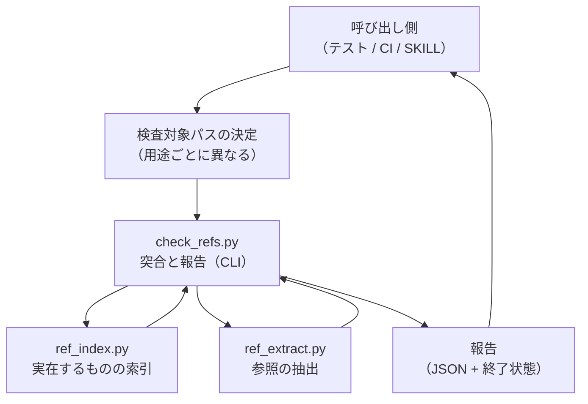
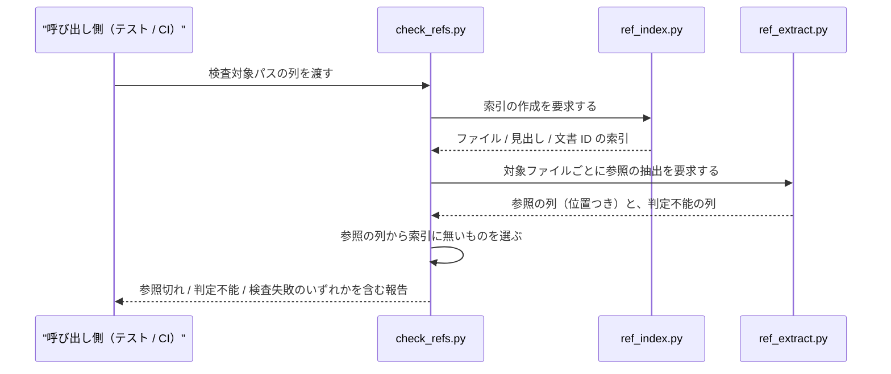

# DES-081 文書参照の実在性検査 設計書

**本設計書は未完成である。** §7 に未確定の設計論点を列挙する。特に参照でないものの除外（[REQ-023](../requirements/REQ-023_doc_reference_integrity.md) FNC-004・TBD-001）と文書 ID 表記の解決（同 TBD-003）は方針のみで、判定規則が確定していない。

## 1. 概要

[REQ-023](../requirements/REQ-023_doc_reference_integrity.md) が定める参照の実在性検査を、**索引・抽出・突合の 3 段**に分けて構成する。「実在するものの集合」を先に作り、「参照として書かれているものの集合」を別に取り出し、後者から前者を引いた差を参照切れとして報告する。

3 段に分けるのは、要件が課す 2 つの制約が別の場所に効くためである。実在の範囲を検査時点の作業ツリーに限る制約（FNC-003）は索引側にしか効かず、参照でないものを除外する制約（FNC-004）は抽出側にしか効かない。1 つの処理に畳むと、どちらの制約を破ったのかが判別できなくなる。

## 2. アーキテクチャ概要

- **検査対象パスの決定は本機構の外にある**: 配布物を検査するか利用プロジェクト文書を検査するかで対象の決め方が異なる（REQ-023 FNC-007）。対象の決定を機構の内側に持つと、用途が増えるたびに機構が分岐を抱える。機構が受け取るのはパスの列だけとする
- **`ref_index` と `ref_extract` は互いを知らない**: 一方は「何が実在するか」、他方は「何が参照されているか」だけを答える。両者を突き合わせるのは `check_refs` の責務である
- **報告は機械可読な形を正とする**: 呼び出し側にテストと CI が含まれるため、判定結果は構造化された形で返す。人間向けの整形は呼び出し側が行う

## 3. モジュール設計

### 3.1 モジュール一覧

| モジュール                                           | 責務                                                                                      | 依存                   |
| ---------------------------------------------------- | ----------------------------------------------------------------------------------------- | ---------------------- |
| `plugins/forge/scripts/doc_reference/ref_index.py`   | 検査時点の作業ツリーから、実在するファイル・見出し・文書 ID の索引を作る（FNC-003）       | 標準ライブラリ + `git` |
| `plugins/forge/scripts/doc_reference/ref_extract.py` | 与えられたファイルから参照を抽出し、参照でないものを除外する（FNC-002・FNC-004・FNC-005） | 標準ライブラリのみ     |
| `plugins/forge/scripts/doc_reference/check_refs.py`  | 索引と抽出結果を突き合わせ、参照切れと判定不能を報告する（FNC-006・NFR-001・NFR-004）     | 上記 2 モジュール      |
| `plugins/forge/scripts/doc_reference/__init__.py`    | パッケージマーカー                                                                        | なし                   |

配置は `plugins/forge/scripts/` 直下の既存パターン（`doc_backend/` / `doc_structure/` / `plan/` / `review/` / `agenda/`）に倣う。複数の呼び出し側（本リポジトリのテスト・CI・利用プロジェクト側の実行経路）が共有するため、特定のスキル配下には置かない。

### 3.2 実在の範囲は追跡下のファイルに限る

`ref_index` が実在として数えるのは、**検査時点の作業ツリーで git の追跡下にあるファイル**とする。未追跡のファイルは実在に含めない。

- **履歴・他ブランチを含めない理由は要件が定めている**（FNC-003）
- **未追跡を含めない理由は設計判断である**: 未追跡ファイルを実在に数えると、手元では通り CI では落ちる検査になる。同じ入力に対して環境ごとに異なる結果を返すことは、判定が決定論的であること（FNC-001）と、見逃しも誤検出も許さないこと（NFR-001）の双方に反する

**この選択は検査を行う位置（REQ-023 FNC-008）と噛み合っている。** `git ls-files` が読むのは git の index であり、`git add` した時点でファイルは追跡下に入る。したがって commit を作る前の位置で検査すれば、**これから commit する内容がそのまま検査対象になる**。未追跡が対象外であることは、この位置では制約として現れない。

**未追跡は参照元としても走査されない。** 索引に入らないことの対称である。ステージングしていない変更を対象にしたい場合は、この選択が障害になる——その場合も未追跡を実在として数える方向へは倒さない（§3.2 の理由）。**利用者へは「検査した範囲はステージング済みまでである」ことを示す**。「検査を通した」が「手元のすべてを検査した」を意味しないためである。

### 3.3 索引が持つもの

| 索引の種類   | 何を引けるようにするか                   | 対応する参照の形      |
| ------------ | ---------------------------------------- | --------------------- |
| ファイル索引 | プロジェクトルート相対のパスが実在するか | リンク記法            |
| 見出し索引   | あるファイルに、ある見出しが実在するか   | リンク記法 + 位置指定 |
| 文書 ID 索引 | ある文書 ID を持つ文書が実在するか       | 文書 ID の表記        |

見出しの照合には、参照側の位置指定表記と、参照先の見出し文字列を同じ規則で変換する必要がある。変換規則は本設計書で新設せず、**NFR-002 が定める外部の同種機構と一致させる対象**に含める（§5・§7）。

### 3.3a 解決の軸は語頭符号とする

参照が指す文書を見つける規則は、**語頭符号による一致**を軸とする。各文書に、**他のどの文書の符号の接頭辞にもならない、最短の接頭辞**を割り当てる。ID を持つ文書は ID がその符号になり（`DES-075` → `DES-075_agenda_mechanism_design.md`）、ID を持たない文書は名前の一部が符号になる。参照の形（リンク記法か文書 ID の表記か）で別の解決機構を持たない。

**軸を 1 つにする理由**: 参照の形ごとに解決機構を分けると、同じ文書が形によって別のファイルへ解決されうる。実際にこのリポジトリでは、規範文書（`docs/rules/` と `plugins/forge/docs/`）が ID を持たない一方で多数から参照されており、ID を前提にした解決だけではこれらを扱えない。

**語頭符号にすることで境界条件が不要になる。** どの符号も他の符号の接頭辞にならないため、当たった符号が別の符号へ伸びることがない。したがって一致規則の側に、短い参照文字列を弾く規則や最長一致の優先規則を持たせる必要がない。`DES-001` と `COMMON-DES-001` が取り違えられないのも同じ理由である——一致は文書名の先頭に固定されるため、`DES-001` は `COMMON-DES-001_...` には当たらない。

**符号による解決が要るのは、パスとして書かれていない参照だけである**（文書 ID の表記など）。パスを伴う参照は §3.3c の解決で先に確定するため、文書名が一意かどうかを問わない。符号を割り当てられない名前（複数ディレクトリに同名で存在するもの）を、パスを伴わない形で参照された場合にのみ、判定不能として報告する（NFR-001）。

### 3.3c 参照先の解決規則

参照に書かれた文字列から参照先を決める規則は、参照の形ごとに次の 3 つに定まる。いずれも決定論的であり、判定に推論を要しない。

| 参照の形           | 解決方法                                                                 | 実測（本リポジトリ） |
| ------------------ | ------------------------------------------------------------------------ | -------------------- |
| 相対パス           | 参照元のディレクトリを基準に正規化し、ファイル索引を引く                 | 517 件               |
| 同一文書内アンカー | 参照元自身の見出し索引を引く                                             | 34 件                |
| 外部 URL           | 検査対象外とする（実在性の対象は文書集合であり、ネットワークを叩かない） | 64 件                |

絶対パスと変数展開形（`${CLAUDE_PLUGIN_ROOT}` 等）は、リンク記法の参照先としては 1 件も出現しない。出現した場合の扱いを先回りして設計しない。

**解決は上表を先に試し、符号による解決（§3.3a）は後に置く。** パスを伴う参照は参照元の位置から一意に決まるため、符号の一意性を必要としない。この順序により、複数ディレクトリに同名で存在する文書（`README.md` / `SKILL.md`）への参照も確定する——**参照元と同じディレクトリ、または参照元から辿れる位置のファイルを指しているためである**。本リポジトリに存在する当該 2 名への参照 14 件は、すべてこの解決で確定し、決まらないものは無い。

順序を逆にすると、正しい同名参照が「一意に決まらない」として落ちる。これは誤検出であり NFR-001 が禁じる。

**参照先の照合は索引に対して行い、ファイルシステムに対して行わない。** 索引は git の追跡下から構築するため（§3.2）、大文字小文字を区別しないファイルシステムでも、表記が実体と異なる参照を検出できる。ファイルシステムへ直接問い合わせる実装では、この誤りが環境によって通ってしまう。

### 3.3b 符号は保存せず、検査ごとに構築する

**符号表を永続化しない。** `ref_index` は検査のたびに、その時点の文書集合から符号を構築する。

**理由は、符号が文書集合の関数であって固定値ではないことにある。** 文書が 1 つ追加されると、既存の符号が他の符号の接頭辞になりうる。そうなった文書の符号は伸びる必要があり、**短い符号で書かれた既存の参照は、参照元を一切変えていないのに曖昧になる**。参照先が増えているのに参照が壊れるという、参照切れとは別種の欠陥である。

符号表を保存して差分で検出する方式は採らない。保存した表と現在の文書集合がずれた状態は、本機構が検出しようとしている「記述と実体の乖離」と同じ形をしており、検査機構自身がその欠陥を持つことになる。検査ごとに構築すれば、曖昧化は参照ごとの一意性判定として自然に現れる。

**構築は trie で行う。** 挿入時に既存の終端ノードが内部ノードへ変わったら、その文書の符号が伸びたことを意味する。衝突相手もその場で判明するため、原因（どの文書の追加で曖昧になったか）を保存された履歴に頼らず示せる。

**この方式は検査の実行時間に依存するため、実測で確かめた。** 485 ファイル・88,416 行・3.2 MB に対し 0.44 秒である。内訳は参照の抽出が 89%、ファイルの読み取りが 4%、`git ls-files` が 2% であり、**支配項は抽出である**。符号表を保存して節約できるのは `git ls-files` の分（2%）だけなので、永続化は支配項に効かない。非永続化の判断（上記）はこの実測と整合する。

## 4. ユースケース設計

### 4.1 ユースケース一覧

| ユースケース                     | 説明                                                                                                                                |
| -------------------------------- | ----------------------------------------------------------------------------------------------------------------------------------- |
| UC-01 commit を作る前の検査      | これから commit する内容（ステージング済みを含む）を対象に検査する。判断できる主体が居るうちに走らせる位置である（REQ-023 FNC-008） |
| UC-02 随時の検査                 | 利用者が指定した範囲を対象に検査する。索引対象はプロジェクトの設定が解決する                                                        |
| UC-03 文書の削除・移動の後の検査 | 文書を削除・移動する作業の終端で検査する（FNC-008）                                                                                 |

UC-03 は UC-01 / UC-02 と別の検査を行うのではなく、**同じ検査を呼ぶ位置が違うだけ**である。要件が UC-03 を独立に挙げているのは、検査の存在ではなく検査が走る位置が満たされていなかったためである（REQ-023 FNC-008 の理由節）。

### 4.2 シーケンス図（UC-01）

**前提条件**: 対象がプロジェクトルート配下にあり、git の追跡下にあること。

**正常フロー**: 索引を作り、参照を抽出し、差を取って報告する。参照切れが 0 件かつ判定不能が 0 件のときだけ、検査を通過した状態とする。

**エラーフロー**: 索引の作成に失敗した場合・対象ファイルを読めない場合は、参照切れ 0 件として報告せず、検査失敗として報告する（NFR-004）。

## 5. 使用する既存コンポーネント

| コンポーネント                                                 | 用途                                                             |
| -------------------------------------------------------------- | ---------------------------------------------------------------- |
| `plugins/forge/skills/next-spec-id/scripts/scan_spec_ids.py`   | 文書 ID の語境界を扱う正規表現の**着想のみ**を参考にする（下記） |
| `plugins/forge/scripts/doc_structure/resolve_doc_structure.py` | UC-02 で検査対象を解決する側が用いる（本機構の外側）             |

### 5.1 `scan_spec_ids.py` は流用しない

同スクリプトは文書 ID を走査するが、**実在性の検査には使えない**。走査範囲がローカルとリモートの全ブランチおよび作業ツリーであり、履歴上にしか存在しない ID も検出する。これは次の ID を採番する用途では正しい（拾い漏れが番号衝突を生むため広く見る側へ倒すのが安全）が、実在性の判定に用いると FNC-003 に反する。

**この不一致は実証されている**: §1.1 の事例で消えた 2 つの ID は、いずれも履歴と他ブランチに存在する。同スクリプトの走査範囲で実在を判定すれば、当該の参照切れは「実在する」と判定され検出されない。

参考にするのは、文書 ID を含む文字列から ID を取り出すときの扱いだけである。

### 5.2 外部の同種機構との一致（NFR-002）

参照先のファイルを見つけるアルゴリズムは、doc-advisor が扱う参照先の変更追随の機構と同じ処理を必要とする。両者が解く問題は異なる（本機構は実在の有無、あちらは変更への追随）ため実装は分けるが、**アルゴリズムは一致させる**。

一致させる対象は次の 3 つとする。

- リンク記法の抽出規則（コードとして表示される範囲の除外、定義を別行に持つ形の扱いを含む）
- 見出しの位置指定表記と見出し文字列の相互変換の規則
- 文書 ID・ファイル名の表記から参照先を見つけるときの符号の構成規則（§3.3a）

一致を確認する手段（規則の置き場と、同じ結果を返すことを確かめる入力と期待結果の集合の同期方法）は未確定である（§7）。

## 6. テスト設計

- **`ref_extract.py`**: コードとして表示される範囲の中にある参照を抽出しないこと、定義を別行に持つ形で定義行と参照先の双方を抽出すること、文書 ID の表記を抽出すること、語境界の異なる ID を取り違えないこと、参照元が Markdown 以外（実装コード・テスト）でも抽出できること（FNC-005）
- **`ref_index.py`**: 追跡下のファイルだけを実在として数えること、**履歴・他ブランチにのみ存在する文書を実在として数えないこと**（FNC-003 の回帰）、未追跡ファイルを実在として数えないこと（§3.2）、割り当てた符号が語頭符号であること（どの符号も他の符号の接頭辞にならない。§3.3a）、**文書を 1 つ追加すると既存の符号が伸び、短い符号で書かれた参照が曖昧になることを検出できること**（§3.3b）、符号表をファイルへ保存しないこと（§3.3b）
- **`check_refs.py`**: 参照切れを検出すること、実在する参照を参照切れとして報告しないこと（NFR-001 の両方向）、**参照先が無い状態と、参照が複数に当たる状態を別の種別として報告すること**（FNC-009）、索引の作成に失敗したときに通過を返さないこと（NFR-004）
- **統合テスト**: §1.1 の 72 箇所の事例を素材として固定し、削除された 2 文書への参照を含む入力に対して検出できることを確認する。**この事例をゴールデンとして持つ**（要件の存在理由そのものであり、退行したときに要件が空洞化する）

## 7. 未確定の設計論点

本設計書が未完成である箇所を列挙する。推測で埋めない。

| 論点                                         | 現状                                                                                                                           |
| -------------------------------------------- | ------------------------------------------------------------------------------------------------------------------------------ |
| 参照でないものの除外規則（FNC-004・TBD-001） | コードとして表示される範囲の除外は決定論的に扱える見込み。**例示として書かれた参照と、実体を持たない仮の名前の判定規則が未定** |
| 見出しの位置指定表記と見出し文字列の変換規則 | 外部の同種機構と一致させる対象（§5.2）。規則自体を本設計書で定めるか、参照するかが未定                                         |
| 一致確認の手段（NFR-002・TBD-002）           | 規則と入力・期待結果の集合の置き場、および同期の方法が未定。外部の担当者との合意が必要                                         |
| 判定不能の扱い                               | NFR-001 は判定不能の報告を求めるが、CI のゲートで通過とするか失敗とするかが未定                                                |
