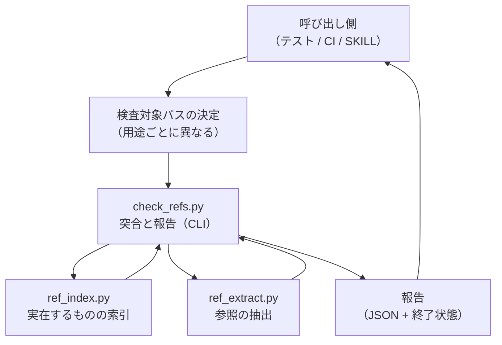
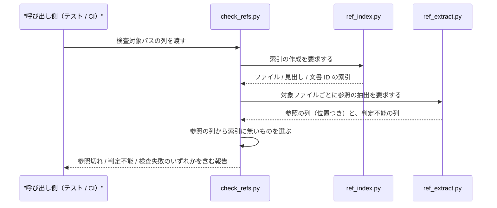

# DES-081 文書参照の実在性検査 設計書

**本設計書は未完成である。** §7 に未確定の設計論点を列挙する。特に参照でないものの除外（[REQ-023](../requirements/REQ-023_doc_reference_integrity.md) FNC-004・TBD-001）と文書 ID 表記の解決（同 TBD-003）は方針のみで、判定規則が確定していない。

## 1. 概要

[REQ-023](../requirements/REQ-023_doc_reference_integrity.md) が定める参照の実在性検査を、**索引・抽出・突合の 3 段**に分けて構成する。「実在するものの集合」を先に作り、「参照として書かれているものの集合」を別に取り出し、後者から前者を引いた差を参照切れとして報告する。

3 段に分けるのは、要件が課す 2 つの制約が別の場所に効くためである。実在の範囲を検査時点の作業ツリーに限る制約（FNC-003）は索引側にしか効かず、参照でないものを除外する制約（FNC-004）は抽出側にしか効かない。1 つの処理に畳むと、どちらの制約を破ったのかが判別できなくなる。

### 1.1 探すのは参照の全体であり、報告するのは参照切れだけである

出力に出るのは参照切れだけで、正しい参照は黙って通る。しかし**探す対象は参照の全体**であり、正しいものと壊れたものを別の手段で探し分けない（FNC-002）。

実在するものの一覧から出発できないためである。索引に載るのは実在する文書だけなので、**名前ごと消えた参照先は、どの索引項目にも一致しない**。文書を削除・改名すると参照先の名前が一覧から消え、探す手がかりが無くなる。したがって参照は、参照先の実在に依らず「書かれ方」から拾う以外にない。

| 段   | 何をするか                         | 扱う対象                               |
| ---- | ---------------------------------- | -------------------------------------- |
| 索引 | 実在するものの集合を作る           | 検査時点の追跡下のファイル（§3.2）     |
| 抽出 | 書かれ方から参照を拾う             | 正しい参照と参照切れの**両方**         |
| 突合 | 抽出結果を索引で引き、差を報告する | 索引に当たらなかったものだけを報告する |

### 1.2 参照かどうかの判別が要るのは、解決しなかった残余だけである

解決した参照は、それが本物の参照であってもなくても報告されない。したがって「これは本当に参照か」の判別（FNC-004）が結果を左右するのは、**解決しなかった残余に限られる**。

この非対称は、抽出の誤りが実害を生む範囲も決める。拾い過ぎ（参照でないものを拾う）は誤検出として、拾い漏れ（本物を拾い損ねる）は見逃しとして現れるが、**いずれも参照先が実在しないときにしか報告に影響しない**。

残余は「参照切れかどうか」の 2 値ではなく、次の分類を持つ。

| 残余の種類                               | 扱い                                                | 根拠         |
| ---------------------------------------- | --------------------------------------------------- | ------------ |
| 外部の資源を指すもの（URL 等）           | 解決の対象外。対象外として扱った件数を報告する      | FNC-012      |
| 同一文書内アンカー                       | 参照元自身の見出し索引で解決する                    | §3.3c        |
| 解決規則を持たない形（変数展開形等）     | 判定不能として報告する                              | NFR-001      |
| 形式が参照として解釈しない範囲にあるもの | 参照ではないので報告しない                          | §3.4（層 1） |
| 上記のいずれでもないもの                 | 参照切れとして報告する（名前の不在 / 配置の不一致） | FNC-011      |

**分類のいずれにも当たらないものを黙って捨てない。** 捨てた参照は誰にも見えないまま「検査を通った」に含まれる。

### 1.3 判別は 2 つの層に分かれる

| 層 | 問い                     | 正本                                      |
| -- | ------------------------ | ----------------------------------------- |
| 1  | この記述は参照か         | 文書形式の標準仕様（§3.4）                |
| 2  | その参照先を解決できるか | 本機構の設計（§3.3a・§3.3c・§1.2 の分類） |

**どちらの層も可否を答える。** 解決の規則（どう解決するか）は層 2 が可否を出すための手段であり、問いそのものではない。報告に現れるのは可否と種別だけである（§1.2）。

層を分けるのは、正本が違うためである。標準仕様は destination の中身を解釈しない（CommonMark §6.3 は URI として素通しする）。したがって「外部の資源か」「変数展開形か」「配置が解決するか」は、いずれも仕様の外にある本機構の判断である。逆に「コードとして表示される範囲か」「注釈として無効化された範囲か」は仕様が決めることであり、本機構が独自に決めてはならない。

**層を跨いだ判断を置かない。** 層 1 で正当な参照と判定されたものを、解決規則が無いことを理由に抽出段階で落とすと、層 2 の事情が層 1 の判定に混ざる。

## 2. アーキテクチャ概要

- **どこを対象とするかの決定は本機構の外にある**: 配布物を検査するか利用プロジェクト文書を検査するかで対象の決め方が異なる（REQ-023 FNC-007）。対象の決定を機構の内側に持つと、用途が増えるたびに機構が分岐を抱える。**機構が受け取るのはディレクトリの列と除外の列であり、その展開（glob の解決と除外の適用）は機構が行う**。決定（どのディレクトリを渡すか）と展開（渡されたディレクトリから実ファイルを得ること）を分け、前者だけを外に置く——展開まで外に出すと、呼び出し側ごとに列挙の実装が分かれ、同じ設定から異なる母集団が導かれる
- **`ref_index` と `ref_extract` は互いを知らない**: 一方は「何が実在するか」、他方は「何が参照されているか」だけを答える。両者を突き合わせるのは `check_refs` の責務である
- **報告は機械可読な形を正とする**: 呼び出し側にテストと CI が含まれるため、判定結果は構造化された形で返す。人間向けの整形は呼び出し側が行う
- **置換先の決定は機構が持ち、書き込みは呼び出し側が行う**: 索引から導ける置換先（`fix_refs` が担う）は判定と同じく決定論的であり、機構の側にある（REQ-023 FNC-013）。一方、原本への書き込みは呼び出し側が行う——どのファイルをどう書き換えるかは対象の決め方と同じく用途ごとに異なり、機構が原本を書き換えると検出のために呼んだ呼び出し側まで巻き込む
- **索引から導けない参照切れは機構が答えない**: 旧い位置指定の移動先のように文書集合に記録が無いものは、答えを持つのは変更を行った主体だけである（REQ-023 FNC-013 の 2 段目）。機構は報告に留め、置換先を返さない

## 3. モジュール設計

### 3.1 モジュール一覧

| モジュール                                           | 責務                                                                                      | 依存                                                           |
| ---------------------------------------------------- | ----------------------------------------------------------------------------------------- | -------------------------------------------------------------- |
| `plugins/forge/scripts/doc_reference/ref_index.py`   | 検査時点の作業ツリーから、実在するファイル・見出し・文書 ID の索引を作る（FNC-003）       | 標準ライブラリ + `git`                                         |
| `plugins/forge/scripts/doc_reference/ref_extract.py` | 与えられたファイルから参照を抽出し、参照でないものを除外する（FNC-002・FNC-004・FNC-005） | 標準ライブラリのみ                                             |
| `plugins/forge/scripts/doc_reference/check_refs.py`  | 索引と抽出結果を突き合わせ、参照切れと判定不能を報告する（FNC-006・NFR-001・NFR-004）     | 上記 2 モジュール + `doc_structure`（glob 展開と除外判定。§2） |
| `plugins/forge/scripts/doc_reference/fix_refs.py`    | 報告 1 件から、索引で導ける置換先を返す。導けなければ返さない（FNC-013）                  | 標準ライブラリのみ                                             |
| `plugins/forge/scripts/doc_reference/__init__.py`    | パッケージマーカー                                                                        | なし                                                           |

配置は `plugins/forge/scripts/` 直下の既存パターン（`doc_backend/` / `doc_structure/` / `plan/` / `review/` / `agenda/`）に倣う。複数の呼び出し側（本リポジトリのテスト・CI・利用プロジェクト側の実行経路）が共有するため、特定のスキル配下には置かない。

### 3.2 実在の範囲は追跡下のファイルに限る

`ref_index` が実在として数えるのは、**検査時点の作業ツリーで git の追跡下にあるファイル**とする。未追跡のファイルは実在に含めない。

- **履歴・他ブランチを含めない理由は要件が定めている**（FNC-003）
- **未追跡を含めない理由は設計判断である**: 未追跡ファイルを実在に数えると、手元では通り CI では落ちる検査になる。同じ入力に対して環境ごとに異なる結果を返すことは、判定が決定論的であること（FNC-001）と、見逃しも誤検出も許さないこと（NFR-001）の双方に反する

**この選択は検査を行う位置（REQ-023 FNC-008）と噛み合っている。** `git ls-files` が読むのは git の index であり、`git add` した時点でファイルは追跡下に入る。したがって commit を作る前の位置で検査すれば、**これから commit する内容がそのまま検査対象になる**。未追跡が対象外であることは、この位置では制約として現れない。

**未追跡は参照元としても走査されない。** 索引に入らないことの対称である。

**この選択が利用者に見える形は 1 つだけである。** 新規に作成してまだ追跡下に入っていない文書は実在に含まれないため、そこへのリンクが参照切れとして報告される（`git add` すれば解消する）。追跡下のファイルの未ステージの変更は、内容を作業ツリーから読むため検査対象に入る——対象から外れるのは未追跡のファイルだけである。

### 3.3 索引が持つもの

| 索引の種類   | 何を引けるようにするか                     | 対応する参照の形      |
| ------------ | ------------------------------------------ | --------------------- |
| ファイル索引 | プロジェクトルート相対のパスが実在するか   | リンク記法            |
| 名前索引     | ある名前を持つ文書が、どのパスに実在するか | リンク記法（FNC-011） |
| 見出し索引   | あるファイルに、ある見出しが実在するか     | リンク記法 + 位置指定 |
| 文書 ID 索引 | ある文書 ID を持つ文書が実在するか         | 文書 ID の表記        |

**名前索引はファイル索引と別に持つ。** ファイル索引はパスの集合であり、「パスとして解決しなかった参照が、名前としては実在するか」を答えられない。FNC-011 が要求する 2 状態（名前の不在 / 配置の不一致）の区別には、名前からパスを引く向きが必要である。名前が複数のパスに当たる場合は候補を列挙し、**移動先の提示は候補の列挙に留める**（どれが正しいかの判断は参照元の意図に依存し、決定論的に決まらない）。

見出しの照合には、参照側の位置指定表記と、参照先の見出し文字列を同じ規則で変換する必要がある。変換規則は本設計書で新設せず、**NFR-002 が定める外部の同種機構と一致させる対象**に含める（§5.2）。

#### 3.3.1 キーは一意に作り、完全一致で引く [MANDATORY]

**本機構の解決は、すべて「一意に決まるキーを作り、そのキーに完全一致するものを引く」で行う。探索で解決しない。** 前方一致・部分一致・近さによる推定は、検出にも置換先の決定にも用いない。

| 索引         | キーの作り方                       | 引き方           |
| ------------ | ---------------------------------- | ---------------- |
| ファイル索引 | 参照元からの相対パスを正規化する   | 集合への完全一致 |
| 名前索引     | ファイル名                         | 辞書引き         |
| 見出し索引   | 見出しの plain text を slug 化する | 集合への完全一致 |
| 文書 ID 索引 | ファイル名の先頭にある文書 ID      | 辞書引き         |

**キーを短縮しない。** 本機構に伝送量の制約は無いため、最も区別力の高い形——完全なパス・完全なファイル名・完全な slug——をそのまま使える。短縮は区別力を捨てる行為であり、捨てる理由が無い。

**唯一の短縮キーは文書 ID である。** `DES-081_doc_reference_integrity_design.md` から `DES-081` を切り出すため、ここだけは名前の一部を符号として扱う。一意性の規則（§3.3a）が要るのはこの 1 箇所だけであり、他の索引は完全な名前をキーにしているため構造的に短縮の衝突を持たない。

**一意に作れないキーは、索引に入れない。** 同じキーが複数の対象に当たる状態は、キーとして成立していない。そのキーは実在から外し、判定不能として報告する（§3.3a の同一 ID 重複がこれに当たる）。**引く側で「どれが本命か」を選ばない**——選べば、決まらないものを決めたことになる。

理由: 一意でないキーを許すと、引いた結果が正しいかどうかを引く側が判断できなくなり、判断は推論になる。FNC-001 が判定を決定論的であることに縛っている以上、解決の全段でキーの一意性が前提になる。

**あるキーが別のキーの前方部分になることは、禁じない。** 参照は 1 つのキー全体を区切られた形で渡してくるため、切れ目の曖昧さが生じない。区切りの無い符号列を左から復号する場合と異なり、前方部分の重なりは衝突にならない。禁じれば、実在する見出しへの正しい参照を参照切れとして報告することになり、NFR-001 が禁じる誤検出になる。

**索引に無いキーは「無い」で終端する [MANDATORY]**。索引に当たらなかった文字列は、その時点でキーではない。それを起点に別のキーを探すことは、キーによる解決ではなく推定であり、**当たっても正しさの根拠を持たない**。同じ入力（キーが無い / 似たキーがある）に対して、参照先が改名されたのか削除されたのかで答えの正否が変わるため、その操作は決定論的な解決ではない。

**この制約は置換先の決定にも及ぶ**（REQ-023 FNC-013）。索引が完全一致で答えられないものは、置換先も決まらない。

### 3.3a 解決の軸は文書 ID の完全一致とする

本節は §3.3.1 の原理を文書 ID へ適用したものである。

パスとして書かれていない参照（文書 ID の表記）は、**ファイル名の先頭にある文書 ID の完全一致**で解決する。`DES-075` → `DES-075_agenda_mechanism_design.md` のように、ID がそのままファイル名の先頭に現れることを前提にする。

**名前の一部を符号として解決する機構は持たない。** 検査対象とする参照の形は 4 つに定まっており（REQ-023 FNC-002）、そのうちパスを伴わないのは文書 ID の表記だけである。地の文に裸で書かれたファイル名は検査対象ではない——プロジェクトの文書規約が、地の文でのパス直書き・リンクなしのファイル名言及を禁じているためである。したがって ID を持たない文書を名前だけで解決する必要が生じない。

**一意に決まらない場合は判定不能として報告する**（NFR-001）。同じ ID を持つ文書が複数のパスに存在する場合、どちらを指しているかは決定論的に決まらない。実測では 0 件である（索引 67 件）。

### 3.3c 参照先の解決規則

参照に書かれた文字列から参照先を決める規則は、参照の形ごとに次の 5 つに定まる。いずれも決定論的であり、判定に推論を要しない。

| 参照の形                            | 解決方法                                                             | 実測（本リポジトリ） |
| ----------------------------------- | -------------------------------------------------------------------- | -------------------- |
| 相対パス                            | 参照元のディレクトリを基準に正規化し、ファイル索引を引く             | 517 件               |
| 同一文書内アンカー                  | 参照元自身の見出し索引を引く                                         | 34 件                |
| 他文書アンカー（`path#anchor`）     | パスをファイル索引で解決し、解決したら**その文書の**見出し索引を引く | 24 件                |
| 外部 URL                            | 検査対象外とし、対象外として扱った件数を報告する（FNC-012）          | 64 件                |
| 絶対パス・変数展開形（`${...}` 等） | 判定不能として報告する（NFR-001）                                    | 0 件                 |

**他文書アンカーは 2 段で判定し、段ごとに別の種別を報告する。** パスが解決しなければアンカーは見に行かない（参照切れはパスの問題である）。パスが解決し、かつ**その文書が走査対象に含まれていない**場合は、見出し索引を持たないため判定不能とする——対象範囲は呼び出し側が決めるため（§2）、機構の側で相手文書を読みに行くと、実在の範囲が呼び出し側の指定と食い違う。

#### 3.3c.1 アンカーが実在しないことと、見出しを列挙できていないことを分ける

アンカーの照合には 2 つの規則が要る。**片方は確定しており、もう片方は未決である**（§5.2）。

| 規則                                | 状態                                                                                           |
| ----------------------------------- | ---------------------------------------------------------------------------------------------- |
| 見出し文字列 → アンカー文字列の変換 | **確定**。正本は外部機構が持つ（§5.2）。入力は Markdown 原文ではなく見出しの plain text である |
| どの行を見出しとみなすか            | **未決**。外部機構の現在の実装は ATX 見出しのみを列挙する（§5.2）                              |

したがってアンカーが索引に当たらなかったとき、**参照が誤っているのか、見出しを列挙できていないのかが区別できない場合がある**。次で分ける。

- 参照先の文書に、**列挙範囲外の見出しが書かれうる形が 1 つも無い**場合 → 参照切れとして報告する。列挙漏れの余地がないためである
- 1 つでもある場合 → **判定不能として報告する**。未列挙の見出しを指している可能性を排除できない

**どちらへも倒さない。** 一律に参照切れとすれば列挙漏れが誤検出になり、一律に判定不能とすれば判定できるものまで畳み込むことになる（NFR-001 の両方向）。列挙範囲が確定したら、この分岐は不要になる。

**実測 0 件の形にも扱いを与える。** 解決規則を持たない形を「出現したときに考える」として空けておくと、実装は黙って捨てる形になる（黙って捨てることが既定動作になるのは、そこに扱いが書かれていないためである）。判定不能として報告する扱いを与えれば、出現した事実が利用者に見える。これは先回りした機能の追加ではなく、§1.2 の分類のいずれにも当たらないものを作らないための帰結である。

**上表の解決は、文書 ID による解決（§3.3a）とは独立である。** パスを伴う参照は参照元の位置から一意に決まるため、文書名が一意かどうかを問わない。複数ディレクトリに同名で存在する文書（`README.md` / `SKILL.md`）への参照も、参照元と同じディレクトリまたは参照元から辿れる位置を指しているため確定する。

順序を逆にすると、正しい同名参照が「一意に決まらない」として落ちる。これは誤検出であり NFR-001 が禁じる。

**参照先の照合は索引に対して行い、ファイルシステムに対して行わない。** 索引は git の追跡下から構築するため（§3.2）、大文字小文字を区別しないファイルシステムでも、表記が実体と異なる参照を検出できる。ファイルシステムへ直接問い合わせる実装では、この誤りが環境によって通ってしまう。

### 3.3b 索引は保存せず、検査ごとに構築する

**索引を永続化しない。** `ref_index` は検査のたびに、その時点の文書集合から索引を構築する。

保存した索引と現在の文書集合がずれた状態は、本機構が検出しようとしている「記述と実体の乖離」と同じ形をしており、**検査機構自身がその欠陥を持つことになる**。検査ごとに構築すれば、この形の欠陥が原理的に生じない。

**この方式は検査の実行時間に依存するため、実測で確かめた。** 485 ファイル・88,416 行・3.2 MB に対し 0.44 秒である。内訳は参照の抽出が 89%、ファイルの読み取りが 4%、`git ls-files` が 2% であり、**支配項は抽出である**。索引を保存して節約できるのは `git ls-files` の分（2%）だけなので、永続化は支配項に効かない。非永続化の判断はこの実測と整合する。

## 4. ユースケース設計

### 4.1 ユースケース一覧

| ユースケース                     | 説明                                                                                                                                |
| -------------------------------- | ----------------------------------------------------------------------------------------------------------------------------------- |
| UC-01 commit を作る前の検査      | これから commit する内容（ステージング済みを含む）を対象に検査する。判断できる主体が居るうちに走らせる位置である（REQ-023 FNC-008） |
| UC-02 随時の検査                 | 利用者が指定した範囲を対象に検査する。索引対象はプロジェクトの設定が解決する                                                        |
| UC-03 文書の削除・移動の後の検査 | 文書を削除・移動する作業の終端で検査する（FNC-008）                                                                                 |

UC-03 は UC-01 / UC-02 と別の検査を行うのではなく、**同じ検査を呼ぶ位置が違うだけ**である。要件が UC-03 を独立に挙げているのは、検査の存在ではなく検査が走る位置が満たされていなかったためである（REQ-023 FNC-008 の理由節）。

### 4.2 シーケンス図（UC-01）

**前提条件**: 対象がプロジェクトルート配下にあり、git の追跡下にあること。

**正常フロー**: 索引を作り、参照を抽出し、差を取って報告する。参照切れが 0 件かつ判定不能が 0 件のときだけ、検査を通過した状態とする。

**エラーフロー**: 索引の作成に失敗した場合・対象ファイルを読めない場合は、参照切れ 0 件として報告せず、検査失敗として報告する（NFR-004）。

## 5. 使用する既存コンポーネント

| コンポーネント                                                 | 用途                                                                                                                           |
| -------------------------------------------------------------- | ------------------------------------------------------------------------------------------------------------------------------ |
| `plugins/forge/skills/next-spec-id/scripts/scan_spec_ids.py`   | 文書 ID の語境界を扱う正規表現の**着想のみ**を参考にする（下記）                                                               |
| `plugins/forge/scripts/doc_structure/resolve_doc_structure.py` | 受け取ったディレクトリ列の glob 展開と除外判定に用いる（`expand_globs` / `is_excluded`）。列挙の実装を二重に持たないため（§2） |

### 5.1 `scan_spec_ids.py` は流用しない

同スクリプトは文書 ID を走査するが、**実在性の検査には使えない**。走査範囲がローカルとリモートの全ブランチおよび作業ツリーであり、履歴上にしか存在しない ID も検出する。これは次の ID を採番する用途では正しい（拾い漏れが番号衝突を生むため広く見る側へ倒すのが安全）が、実在性の判定に用いると FNC-003 に反する。

**この不一致は実証されている**: §1.1 の事例で消えた 2 つの ID は、いずれも履歴と他ブランチに存在する。同スクリプトの走査範囲で実在を判定すれば、当該の参照切れは「実在する」と判定され検出されない。

参考にするのは、文書 ID を含む文字列から ID を取り出すときの扱いだけである。

### 5.2 外部の同種機構との一致（NFR-002）

参照先のファイルを見つけるアルゴリズムは、doc-advisor が扱う参照先の変更追随の機構と同じ処理を必要とする。両者が解く問題は異なる（本機構は実在の有無、あちらは変更への追随）ため実装は分けるが、**アルゴリズムは一致させる**。

一致させる対象は次の 3 つとする。

- リンク記法の抽出規則（コードとして表示される範囲の除外、定義を別行に持つ形の扱いを含む）。規則の正本は CommonMark であり（§3.4）、一致させる対象は「同じ仕様に従っていること」である
- 見出しの位置指定表記と見出し文字列の相互変換の規則（下記 5.2.1）
- 文書 ID の表記から参照先を見つける規則（§3.3a）

一致を確認する手段（規則の置き場と、同じ結果を返すことを確かめる入力と期待結果の集合の同期方法）は未確定である（§7）。

#### 5.2.1 アンカーの変換規則は外部機構が正本を持つ

**正本は doc-advisor 側にある。** 本設計書で規則を新設せず、そこへ従う。理由は、この規則が外部のレンダラ実装（GitHub が生成する `#fragment`）への写像であり、CommonMark に対応する規定が無いためである——アンカー ID の生成を Markdown の仕様は定めていない。写像の正本を 2 箇所に持てば、同じ参照が機構によって別の見出しへ解決される（NFR-002 が禁じる状態そのもの）。

確定している部分と未決の部分を分ける。

| 事項                                                                    | 状態                                                                                                                                        |
| ----------------------------------------------------------------------- | ------------------------------------------------------------------------------------------------------------------------------------------- |
| 変換規則（正規化・小文字化・空白の置換・除去する文字・重複の連番）      | **確定**                                                                                                                                    |
| 変換の入力が**見出しの plain text** であること（Markdown 原文ではない） | **確定**。原文を渡すとリンクや実体参照を含む見出しで外部レンダラとずれる                                                                    |
| plain text 化で落とす記法の集合                                         | リンク・画像・autolink・コードスパン・生の HTML・実体参照・バックスラッシュエスケープまで決定。**強調記法は落とさない**。集合の完全性は未決 |
| どの行を見出しとみなすか（setext・コンテナ内見出し）                    | **未決**。外部機構の現在の実装は ATX 見出しのみを列挙する                                                                                   |

未決の 2 つが残る間、本機構は §3.3c.1 の分岐で判定できる範囲だけを判定する。**確定した部分を「未確定だから使わない」としては扱わない**——それは判定できるものを畳み込むことであり、NFR-001 に反する。

## 6. テスト設計

### 6.1 抽出の試験項目は正本から導出する [MANDATORY]

`ref_extract.py` の試験項目は、**§3.4 が定める正本（CommonMark）の規定から導出する**。実際に踏んだ失敗を回帰として残すだけの構成にしない。

**理由は、網羅の基準を「過去に壊れたか」に置くと、まだ踏んでいない形が実装と試験の両方をすり抜けることにある。** 通ることがバグの不在を意味しない試験になり、しかも通っている分だけ「検査済み」という外観を与える。実例として、1 行に閉じた HTML コメントだけを与える試験は通るが、複数行にまたがる形では抽出が誤る——**試験の存在が覆いとして働き、欠陥を隠した**。

導出した項目は、正本の規定ごとに**成立する形と成立しない形の両方**を持たせる。§3.4 が列挙した規定すべてを対象とし、各 1 件以上を固定する。除外を要求する規定では、**除外される形と、隣接するが除外されない形**を対にする（片側だけでは、除外し過ぎ＝見逃しを検出できない）。

| 正本の規定                         | 対にする形                                                                    |
| ---------------------------------- | ----------------------------------------------------------------------------- |
| CommonMark §4.6 HTML blocks        | 1 行に閉じた形 / **複数行にまたがる形** / コメント以外の type                 |
| 同 §4.4 Indented code blocks       | インデントコードブロック内（除外） / **リストの継続段落**（除外しない）       |
| 同 §5 Container blocks             | コンテナ相対で 4 スペースに達しない継続行（除外しない）                       |
| 同 §4.5 Fenced code blocks         | フェンス内（除外） / 4 連フェンス内の 3 連で閉じない                          |
| 同 §6.1 Code spans                 | コードスパン内（除外） / 二重バッククォート内                                 |
| 同 §6.3 Links                      | 素の destination / 山括弧囲み / title 付き / 括弧を含む形（いずれも抽出する） |
| 同 §6.4 Images                     | `` を抽出すること                                                 |
| 同 §4.7 Link reference definitions | 定義行と使用の双方を抽出すること / フェンス内の定義行は抽出しないこと         |
| 同 §6.5 Autolinks                  | `<https://...>` を抽出すること（層 2 で対象外になることは別に固定する）       |
| 同 §6.6 Raw HTML                   | `<a href>` を抽出しないこと（Markdown のリンクではない）                      |

**試験は修正の前に書き、修正前に落ちることを確かめる。** 落ちない試験は、その欠陥に対する回帰として成立していない（実装の現状をそのまま写しただけの試験と区別できない）。上記の覆いは、まさにこの確認を経ずに試験が足された結果である。

### 6.2 モジュールごとの試験項目

- **`ref_extract.py`**: §6.1 が定める正本からの導出項目に加え、文書 ID の表記を抽出すること、語境界の異なる ID を取り違えないこと、参照元が Markdown 以外（実装コード・テスト）でも抽出できること（FNC-005）
- **`ref_index.py`**: 追跡下のファイルだけを実在として数えること、**履歴・他ブランチにのみ存在する文書を実在として数えないこと**（FNC-003 の回帰）、未追跡ファイルを実在として数えないこと（§3.2）、同じ文書 ID が複数のパスに現れたとき実在として扱わないこと（§3.3a）、名前索引が同名の全パスを保持すること（§3.3）
- **`check_refs.py`**: 参照切れを検出すること、実在する参照を参照切れとして報告しないこと（NFR-001 の両方向）、**参照先が無い状態と、参照が複数に当たる状態を別の種別として報告すること**（FNC-009）、索引の作成に失敗したときに通過を返さないこと（NFR-004）
- **`fix_refs.py`**: 同名の実在パスが 1 件のとき参照元からの相対パスへの置換先を返すこと、**2 件以上・0 件では返さないこと**、位置指定を保存すること、**アンカー・節番号の置換先は候補が 1 件に絞れても返さないこと**（§3.3.1 の回帰。探索を持ち込む退行を止める。素材として `## 実装` を削除した文書で `#実装` が `実装-手順` の 1 件に当たる形を固定する）
- **`check_refs.py` と `fix_refs.py` の繋ぎ目**: `check_refs` が出した所見をそのまま `fix_refs` へ渡して置換先が導けること。**手書きの所見を経由させない**——両者を別々に試験すると、片方が出さない情報をもう片方が要求していても双方の試験が通る（実際にそれが起きた）
- **統合テスト**: §1.1 の 72 箇所の事例を素材として固定し、削除された 2 文書への参照を含む入力に対して検出できることを確認する。**この事例をゴールデンとして持つ**（要件の存在理由そのものであり、退行したときに要件が空洞化する）

## 7. 未確定の設計論点

本設計書が未完成である箇所を列挙する。推測で埋めない。

| 論点                                         | 現状                                                                                                                                                                                                                                           |
| -------------------------------------------- | ---------------------------------------------------------------------------------------------------------------------------------------------------------------------------------------------------------------------------------------------- |
| 参照でないものの除外規則（FNC-004・TBD-001） | コードとして表示される範囲・注釈として無効化された範囲の除外は §3.4 の正本が定める（決着）。**例示として書かれた参照と、実体を持たない仮の名前の判定規則が未定**（これらは文書形式の仕様の外にある）                                           |
| 見出しの位置指定表記と見出し文字列の変換規則 | 変換規則と、入力が見出しの plain text であることは**決着**（§5.2.1。正本は外部機構が持つ）。**plain text 化で落とす記法の集合の完全性と、どの行を見出しとみなすか（setext・コンテナ内見出し）が未決**。確定すれば §3.3c.1 の分岐は不要になる   |
| 一致確認の手段（NFR-002・TBD-002）           | 規則と入力・期待結果の集合の置き場、および同期の方法が未定。外部の担当者との合意が必要。**期待結果の集合をどちらのリポジトリにも属さない形に置く案が出ている**（一方に置くと他方が相手の規約に従う形になり、分けたはずの責務境界が崩れるため） |
| 判定不能の扱い                               | NFR-001 は判定不能の報告を求めるが、CI のゲートで通過とするか失敗とするかが未定                                                                                                                                                                |

[commonmark-0.31.2]: https://spec.commonmark.org/0.31.2/
