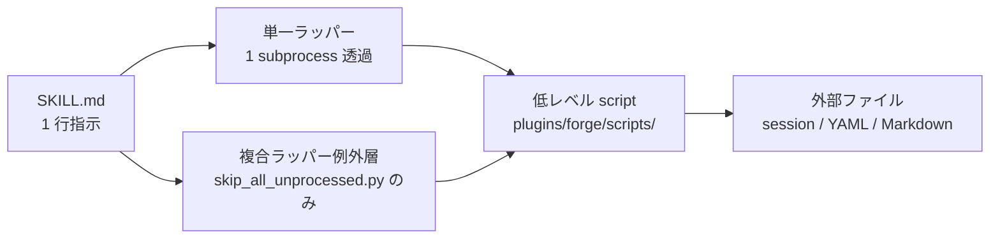
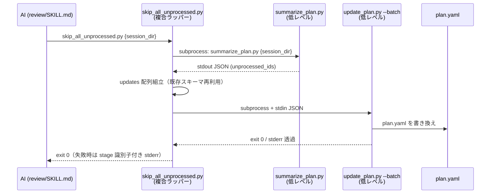
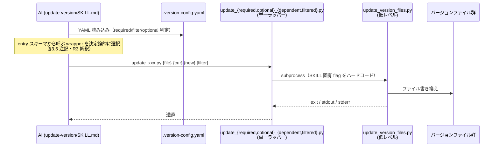

# DES-024 io_verb 設計書: SKILL.md から script の詳細を隠す

## メタデータ

| 項目       | 値                                                                |
| ---------- | ----------------------------------------------------------------- |
| 設計 ID    | DES-024                                                           |
| feature ID | io_verb                                                           |
| 種別       | 設計（How の決定。要件は REQ-001 を参照）                         |
| 作成日     | 2026-04-23                                                        |
| 関連要件   | REQ-001, INV-001                                                  |

---

## 1. 目的と前提

### 1.1 実現したいこと（要件から）

- 要件 §2: SKILL.md に「この場面ではこれを呼ぶ」の 1 行指示だけを残し、AI に script の選択・flag 組立・値選択をさせない
- 要件 R1.1: 引数は位置引数のみで完結（理想: `wrapper {session_dir} {id}`）
- 要件 R3: 同一場面で呼ぶ script は 1 つに確定、flag 分岐構造を避ける

### 1.2 本設計が従う制約（要件から）

- **R7 [MANDATORY]**: 低レベル script は変更しない。ラッパーは subprocess 呼び出しのみ。低レベルへの新 API 追加・CLI 変更は一切しない
- **R7**: 共有ラッパー層は作らない。各 SKILL ごとに個別のラッパーを配置
- **要件 §3.1**: 作る対象は「SKILL 配下の薄いラッパー」と「SKILL.md の整理」のみ

### 1.3 スコープ

棚卸し `inventory.md` §3 の 4 本の低レベル script すべてにラッパーを追加（案 A: 全カバー、痛点 31 件をすべて解消）。

- `session_manager.py` (find / init)
- `resolve_doc_structure.py` (--doc-type / --type)
- `update_plan.py` (--batch / --id --status)
- `update_version_files.py` (--version-path / --filter / [--optional])

---

## 2. 設計方針

### 2.1 ラッパーの型（共通原則）

#### 2.1.0 ラッパーの種別（単一ラッパー / 複合ラッパー）

本設計のラッパーは、低レベル CLI の呼び出し構造により 2 種別に分かれる:

- **単一ラッパー (primary)**: 1 subprocess を透過的に呼ぶラッパー。本要件の wrapper のデフォルト分類で、ほぼ全てのラッパー（find_session / init_session / resolve_* / mark_* / batch_update / update_*）がこれに該当する
- **複合ラッパー (例外層)**: 複数 subprocess を合成するラッパー。本要件では `skip_all_unprocessed.py` のみ該当。要件 §2 の「状態遷移・JSON スキーマは低レベルに閉じる」原則との整合のため、以下の制約を遵守する:
  - 複合ラッパー内で扱う JSON スキーマは「低レベル CLI が stdout/stdin で扱う既存スキーマ」のみ。新規スキーマを定義しない
  - ラッパーはあくまで subprocess の連鎖制御のみを担う。ビジネスロジックは持たない
  - 追加が許されるのは「本 SKILL に閉じた一括操作」のみ。汎用化して他 SKILL から呼ばせない
  - 要件 R7 [MANDATORY] の例外条項（要件定義書 §4 R7 参照）に基づく例外層であることを意識する

#### 2.1.1 すべてのラッパーに共通する原則

すべてのラッパーは以下の原則で実装する:

```python
#!/usr/bin/env python3
"""1 行の説明: この operation が何をするか"""
import subprocess
import sys
from pathlib import Path

LOW_LEVEL = Path(__file__).parent.parent.parent.parent / "scripts" / "<sub>" / "<low-level>.py"

def main() -> int:
    # 位置引数の取得とバリデーション（最小限）
    # subprocess で低レベル CLI を呼ぶ（SKILL 固有値はハードコード）
    # 低レベルの stdout / stderr / exit code をそのまま透過

if __name__ == "__main__":
    sys.exit(main())
```

- **hardcoded 値**: `--skill {skill名}` / `--doc-type {type}` 等、SKILL が自明に知る値をラッパー内に埋め込む
- **位置引数**: AI が文脈から自然に持つ値（session_dir / id / feature / 等）のみ受ける
- **透過**: subprocess の exit code / stdout / stderr をそのまま返す
- **ガード追加なし**: 入力検証は低レベル側のものに委ねる。ラッパー側には新規ガードを実装しない（要件 R2/R4 は本要件では実施対象外）。ラッパーの呼び出し元は AI（SKILL.md 経由）であり、`--help` や誤用時の丁寧なエラーメッセージは想定利用形態に含まれない（開発者は低レベル script を直接叩いて検証する）
- **retry / timeout なし**: ラッパー側で retry は行わず、timeout も設けない（低レベル側の既存 timeout に委ねる）。方針の不在を意図として固定する
- **複合ラッパーの stderr 契約**: 単一ラッパー（find_session / init_session / resolve_* / mark_* / batch_update / update_*）は透過のみで良い。一方、複合ラッパー（本設計では `skip_all_unprocessed.py` のみ）は、失敗時に `stage={識別子} exit={子プロセスの exit code}` を stderr 先頭行に付けてから非 0 終了し、どの段階で失敗したかを運用者が特定できるようにする（詳細は §3.4）

### 2.2 共有ラッパーを作らない方針の具体化

同じ operation を複数 SKILL が呼ぶ場合でも、各 SKILL 配下に別コピーを置く。

- `session_manager.py find --skill {name}` → 6 SKILL それぞれに `{skill}/scripts/find_session.py`（内容は skill 名だけ違う）
- `session_manager.py init` → 6 SKILL それぞれに `{skill}/scripts/init_session.py`（flag 組合せが各 SKILL で異なる）

**反論と回答**: 「二重実装では？」→ 各ラッパーは 5〜10 行。SKILL 固有値のハードコードで意味的にも別物。共有層を挟むと SKILL 追加時の配置判断コストが上回る（要件 R7 の判断）。

### 2.3 命名規則

- **operation 名**（動詞主体）を使う。例: `find_session.py`, `init_session.py`, `mark_skipped.py`, `resolve_plan.py`
- 低レベル script の名前はラッパー名に含めない（`update_plan_batch_wrapper.py` のような名前を避ける）
- 同一 operation を複数 SKILL が持つ場合、**ファイル名は揃える**（例: `find_session.py` は全 SKILL 共通）

### 2.4 SKILL.md 側の整理

ラッパー追加と同時に SKILL.md を書き換える:

- flag 付きの低レベル呼び出し → ラッパー呼び出しに置換
- 残った script 呼び出しは位置引数のみの 1 行
- 禁止警告（該当 0 件、新規に追加しない）

### 2.5 モジュール一覧と依存方向

design_principles_spec.md の必須構成要素（モジュール一覧・依存方向・代表ユースケースのシーケンス）を本節にまとめる。

#### 2.5.1 モジュール一覧

| 層                           | 配置                                                       | 役割                                                                                                       | 本要件での変更 |
| ---------------------------- | ---------------------------------------------------------- | ---------------------------------------------------------------------------------------------------------- | -------------- |
| SKILL.md                     | `plugins/forge/skills/{skill}/SKILL.md`                    | 1 行指示（呼ぶべき wrapper + 位置引数）                                                                    | 差し替えのみ   |
| 単一ラッパー                 | `plugins/forge/skills/{skill}/scripts/{operation}.py`      | 低レベル CLI 1 本を subprocess で呼ぶ 5〜10 行の wrapper                                                   | 新規 29 本     |
| 複合ラッパー（例外層）       | `plugins/forge/skills/{skill}/scripts/{operation}.py`      | 複数低レベル CLI を連鎖呼び出し（skip_all_unprocessed.py の 1 本のみ）。ビジネスロジック・新規スキーマなし | 新規 1 本      |
| 低レベル script              | `plugins/forge/scripts/{domain}/{script}.py`               | 状態遷移・flag 合成・JSON スキーマを閉じ込める本体ロジック                                                 | 変更なし（R7 MANDATORY） |
| 外部ファイル                 | `session/*` / `.doc_structure.yaml` / `.version-config.yaml` / plan.yaml / 設計書 Markdown 等 | 永続状態・設定・成果物                                                                                      | 変更なし       |

合計 wrapper 本数: **30 本**（単一 29 + 複合 1）。内訳は §4 末尾・§4.1 と一致。

#### 2.5.2 依存方向

依存は **SKILL.md → wrapper（単一 / 複合） → 低レベル script → 外部ファイル** の一方向。wrapper 同士の呼び出し・低レベル → wrapper の逆流・SKILL.md 間の直接参照はいずれも禁止。



この一方向性により、以下が Yes/No で判定可能になる:

- 低レベル script が wrapper / SKILL.md を import していない（Yes/No 判定）
- wrapper が他 skill の wrapper を呼んでいない（Yes/No 判定）
- 複合ラッパーが §2.1.0 の例外層制約（単一 SKILL 内・新規スキーマなし・汎用化禁止）を満たす（§2.1.0 の箇条書きで判定）

#### 2.5.3 代表ユースケースのシーケンス

**ユースケース 1**: review 完了時「未処理全件を対応しない」（複合ラッパーの経路）



**ユースケース 2**: update-version 実行（単一ラッパーのみの経路）



---

## 3. ラッパー設計詳細

### 3.1 session_manager.py find 系（6 SKILL、6 ラッパー）

**Before（SKILL.md）**:

```bash
python3 ${CLAUDE_PLUGIN_ROOT}/scripts/session_manager.py find --skill {skill名}
```

**After（SKILL.md）**:

```bash
python3 ${CLAUDE_SKILL_DIR}/scripts/find_session.py
```

**ラッパー配置**:

| SKILL                  | ファイル                                          | ハードコード値           |
| ---------------------- | ------------------------------------------------- | ------------------------ |
| start-plan             | `skills/start-plan/scripts/find_session.py`       | `--skill start-plan`     |
| start-implement        | `skills/start-implement/scripts/find_session.py`  | `--skill start-implement`|
| start-requirements     | `skills/start-requirements/scripts/find_session.py` | `--skill start-requirements` |
| start-design           | `skills/start-design/scripts/find_session.py`     | `--skill start-design`   |
| start-uxui-design      | `skills/start-uxui-design/scripts/find_session.py`| `--skill start-uxui-design` |
| review                 | `skills/review/scripts/find_session.py`           | `--skill review`         |

**実装（代表例）**:

```python
# skills/start-plan/scripts/find_session.py
import subprocess, sys
from pathlib import Path

LOW_LEVEL = Path(__file__).resolve().parents[3] / "scripts" / "session_manager.py"

def main() -> int:
    r = subprocess.run(
        [sys.executable, str(LOW_LEVEL), "find", "--skill", "start-plan"],
        check=False,
    )
    return r.returncode

if __name__ == "__main__":
    sys.exit(main())
```

**引数**: なし。ラッパーは skill 名を自前で知っているため、SKILL.md からは no-arg 呼び出し。

### 3.2 session_manager.py init 系（6 SKILL、6 ラッパー）

**Before（SKILL.md、start-plan 例）**:

```bash
python3 ${CLAUDE_PLUGIN_ROOT}/scripts/session_manager.py init \
  --skill start-plan \
  --feature "{feature}" \
  --mode "{new|update}" \
  --output-dir "{計画書の出力先}"
```

**After（SKILL.md）**:

```bash
python3 ${CLAUDE_SKILL_DIR}/scripts/init_session.py "{feature}" "{mode}" "{output_dir}"
```

**ラッパー配置と引数**:

| SKILL                  | ファイル                                            | 位置引数                              |
| ---------------------- | --------------------------------------------------- | ------------------------------------- |
| start-plan             | `skills/start-plan/scripts/init_session.py`         | `{feature} {mode} {output_dir}`       |
| start-implement        | `skills/start-implement/scripts/init_session.py`    | `{feature} {task_id}`                 |
| start-requirements     | `skills/start-requirements/scripts/init_session.py` | `{feature} {mode} {output_dir}`       |
| start-design           | `skills/start-design/scripts/init_session.py`       | `{feature} {mode} {output_dir}`       |
| start-uxui-design      | `skills/start-uxui-design/scripts/init_session.py`  | `{feature} {mode} {output_dir}`       |
| review                 | `skills/review/scripts/init_session.py`             | `{review_type} {engine} {auto_count}` |

**review 用の補足**: review は `--auto-count` に加え `--current-cycle` が必要だが、新規 init では常に 0 なのでラッパー内部にハードコード。

**実装（start-plan 例）**:

```python
# skills/start-plan/scripts/init_session.py
import subprocess, sys
from pathlib import Path

LOW_LEVEL = Path(__file__).resolve().parents[3] / "scripts" / "session_manager.py"

def main() -> int:
    feature, mode, output_dir = sys.argv[1], sys.argv[2], sys.argv[3]
    r = subprocess.run(
        [sys.executable, str(LOW_LEVEL), "init",
         "--skill", "start-plan",
         "--feature", feature,
         "--mode", mode,
         "--output-dir", output_dir],
        check=False,
    )
    return r.returncode

if __name__ == "__main__":
    sys.exit(main())
```

### 3.3 resolve_doc_structure.py 系（6 SKILL、8 ラッパー）

**Before（SKILL.md、start-plan 例）**:

```bash
python3 "${CLAUDE_PLUGIN_ROOT}/skills/doc-structure/scripts/resolve_doc_structure.py" --doc-type plan
```

**After（SKILL.md）**:

```bash
python3 ${CLAUDE_SKILL_DIR}/scripts/resolve_doc.py
```

**ラッパー配置**:

| SKILL                  | ファイル                                               | ハードコード値            |
| ---------------------- | ------------------------------------------------------ | ------------------------- |
| start-plan             | `skills/start-plan/scripts/resolve_doc.py`             | `--doc-type plan`         |
| start-implement        | `skills/start-implement/scripts/resolve_doc.py`        | `--doc-type plan`         |
| start-requirements     | `skills/start-requirements/scripts/resolve_doc.py`     | `--doc-type requirement`  |
| start-design           | `skills/start-design/scripts/resolve_doc.py`           | `--doc-type design`       |
| start-uxui-design      | `skills/start-uxui-design/scripts/resolve_doc.py`      | `--doc-type requirement`  |
| review                 | `skills/review/scripts/resolve_rules.py`               | `--type rules`            |
| review                 | `skills/review/scripts/resolve_specs.py`               | `--type specs`            |
| clean-rules            | `skills/clean-rules/scripts/resolve_rules.py`          | `--type rules`            |

**命名補足**: review のみ 2 種類（rules / specs）必要なため、operation 名で区別（`resolve_rules.py` / `resolve_specs.py`）。他 SKILL は 1 種類のみなので単に `resolve_doc.py`。

**引数**: すべて no-arg。

### 3.4 update_plan.py 系（2 SKILL、5 ラッパー）

最も痛点が集中する領域。status 値の列挙（要件 R1.1/R3 違反）を 1 operation = 1 ラッパーに分解する。

**Before / After（present-findings/SKILL.md の場合）**:

| 場面                    | Before                                                                              | After                                              |
| ----------------------- | ----------------------------------------------------------------------------------- | -------------------------------------------------- |
| 修正を選択              | `update_plan.py {dir} --id {id} --status in_progress`                               | `mark_in_progress.py {dir} {id}`                   |
| 対応しない              | `update_plan.py {dir} --id {id} --status needs_review`                              | `mark_needs_review.py {dir} {id}`                  |
| スキップ                | `update_plan.py {dir} --id {id} --status skipped --skip-reason "{理由}"`            | `mark_skipped.py {dir} {id} "{理由}"`              |
| 重複統合（一括）        | `update_plan.py {dir} --batch` + stdin JSON                                         | `batch_update.py {dir}` + stdin JSON (透過)        |

**review/SKILL.md の場合**:

| 場面                          | Before                                                                                  | After                                           |
| ----------------------------- | --------------------------------------------------------------------------------------- | ----------------------------------------------- |
| 未処理を全件 skipped にする   | `summarize_plan.py` の出力から updates JSON を組み立てて `update_plan.py --batch` に流す | `skip_all_unprocessed.py {dir}`                |

**ラッパー配置**:

| SKILL             | ファイル                                                 | 位置引数                 |
| ----------------- | -------------------------------------------------------- | ------------------------ |
| present-findings  | `skills/present-findings/scripts/mark_in_progress.py`    | `{session_dir} {id}`     |
| present-findings  | `skills/present-findings/scripts/mark_needs_review.py`   | `{session_dir} {id}`     |
| present-findings  | `skills/present-findings/scripts/mark_skipped.py`        | `{session_dir} {id} {reason}` |
| present-findings  | `skills/present-findings/scripts/batch_update.py`        | `{session_dir}`（stdin JSON 透過）|
| review            | `skills/review/scripts/skip_all_unprocessed.py`          | `{session_dir}`          |

**`batch_update.py` の透過ラッパー化に留めた理由**: 本ラッパーは低レベル `update_plan.py --batch` の stdin JSON スキーマ（`{"updates": [{"id": int, "status": str, ...}]}`）をそのまま透過する。JSON 組立責務を wrapper 側に引き上げない理由は以下:

- 一括更新の対象集合（どの id を、どの status に、どの reason で更新するか）は呼び出し文脈ごとに異なり、位置引数化すると API 面積が肥大化する（重複統合・一括スキップ・一括 fix 等、用途が増えるたびに wrapper が増える）
- 用途固定の一括更新（例: 全件 skipped）は `skip_all_unprocessed.py` のような**複合ラッパー（例外層）**で個別に定義済み。それ以外の「対象集合が呼び出し時点で決まる一括更新」は透過のままが適切
- JSON スキーマ自体は低レベル `update_plan.py --batch` に閉じており、SKILL.md 側に露出するのは「stdin にこの JSON を流す」という呼び出し契約のみ

本方針により、batch_update.py は「用途が固定化した時点で専用ラッパーに昇格」の受け皿として残し、SKILL 層の責務境界は用途固定化のタイミングで段階的に狭める（本サイクルでは透過で確定）。

**`skip_all_unprocessed.py` の実装方針**:

本ラッパーは **§2.1.0 の例外層（複合ラッパー）** に該当する（本要件で唯一）。R7 [MANDATORY]（低レベル変更禁止）は本ラッパーでも厳守する（低レベル script へは追加・変更を行わず subprocess 呼び出しのみで実装する）。一方、「1 ラッパー = 1 subprocess 透過」の原則に対しては、要件定義書 §4 R7 の例外条項に基づく「複合ラッパー（例外層）」として位置づける。複合ラッパーに課される制約（§2.1.0）すべてに従う:

- 新規 JSON スキーマは定義せず、低レベル CLI (`summarize_plan.py` stdout / `update_plan.py --batch` stdin) の既存スキーマのみを再利用する
- ビジネスロジックは持たず、subprocess の連鎖制御のみを担う（unprocessed_ids の取得 → updates 配列の組立 → 一括更新）
- review SKILL に閉じた一括操作であり、他 SKILL から呼ばせない（汎用化禁止）

review/SKILL.md §Step 2b の「未処理 1 件以上 → 全件対応しない」の呼び出しをラッパー化する。内部で:

1. `summarize_plan.py {session_dir}` を subprocess 呼び出しして `unprocessed_ids` を取得
2. `[{"id": i, "status": "skipped", "skip_reason": "ユーザー判断: 全件対応しない"}]` を組み立て（low-level `update_plan.py --batch` の既存 stdin スキーマを再利用）
3. `update_plan.py {session_dir} --batch` に stdin JSON として流す

3 本の低レベル script を subprocess で呼ぶだけ。低レベルへの新 API 追加なし。

**read-modify-write race の扱い（呼び出し元前提）**: 手順 1（`summarize_plan.py`）と手順 3（`update_plan.py --batch`）の間に他経路から plan.yaml が更新されると、古いスナップショットに基づいて既に `fixed` / `in_progress` になった項目まで `skipped` に上書きされる可能性がある。これは以下の呼び出し元前提により構造的に回避する:

- 本ラッパーは review/SKILL.md Phase 5 Step 2b の「全件対応しない」確定後にのみ呼ばれる
- Phase 5 は review サイクル終了直前の**同期処理**であり、他 subagent や並行プロセスが plan.yaml を更新する経路は存在しない（evaluator 並列起動などの並行動作は Phase 3-4 で完結している）
- したがって手順 1→3 の間に plan.yaml が他経路から更新されることはなく、race 条件は発生しない

本ラッパー内部に「再読み込み＋状態確認」ロジックを持たせる案（低レベル状態の再検査）は、R7 [MANDATORY]「subprocess 呼び出しのみ」および §2.1.0「複合ラッパーは新規スキーマを定義しない」に抵触するため採らない。直列実行の責務は呼び出し元（review/SKILL.md Phase 5）に固定し、本ラッパーは subprocess 連鎖制御のみを担う。

**stderr 契約（複合ラッパーの障害切り分け）**: 本ラッパーは複数段を連鎖するため、透過のみでは失敗段階を運用者が特定できない。以下を契約とする:

- 失敗時は stderr 先頭行に `stage={識別子} exit={子プロセスの exit code}` を付けてから非 0 終了する
  - `stage=summarize_plan`: §3.4 手順 1 の `summarize_plan.py` が非 0 終了した場合
  - `stage=json_build`: 手順 2 の JSON 組立で `summarize_plan.py` の stdout を parse 失敗した場合（exit 欄は省略または `exit=-1`）
  - `stage=update_plan`: 手順 3 の `update_plan.py --batch` が非 0 終了した場合
- 子プロセスの stderr は識別子行の後にそのまま透過する
- 正常時（全段 0 終了）は stderr に追記せず、低レベルの透過のみとする（§2.1.1 共通原則）

この契約により、§8 障害シナリオ表の「summarize_plan JSON 破損」「子 script 不在」の切り分けが stderr 先頭行のみで可能になる。

### 3.5 update_version_files.py 系（1 SKILL、5 ラッパー）

`[--optional]` が動的な場合分けになっているため、4 通りに分解:

**Before（update-version/SKILL.md）**:

```bash
# 主要
update_version_files.py {version_file} {cur} {new} --version-path {path}
# 依存（必須）
update_version_files.py {path} {cur} {new}
# 依存（オプション）
update_version_files.py {path} {cur} {new} --optional
# 依存（filter + 必須）
update_version_files.py {path} {cur} {new} --filter "{filter}"
# 依存（filter + オプション）
update_version_files.py {path} {cur} {new} --filter "{filter}" --optional
```

**After**:

| SKILL.md 場面             | After                                                                      |
| ------------------------- | -------------------------------------------------------------------------- |
| 主要版                    | `update_main_version.py {file} {cur} {new} {version_path}`                 |
| 依存（必須・filter なし） | `update_required_dependent.py {file} {cur} {new}`                          |
| 依存（オプション）        | `update_optional_dependent.py {file} {cur} {new}`                          |
| 依存（必須・filter あり） | `update_required_filtered.py {file} {cur} {new} "{filter}"`                |
| 依存（オプション・filter）| `update_optional_filtered.py {file} {cur} {new} "{filter}"`                |

**ラッパー配置**:

| SKILL          | ファイル                                                        |
| -------------- | --------------------------------------------------------------- |
| update-version | `skills/update-version/scripts/update_main_version.py`          |
| update-version | `skills/update-version/scripts/update_required_dependent.py`    |
| update-version | `skills/update-version/scripts/update_optional_dependent.py`    |
| update-version | `skills/update-version/scripts/update_required_filtered.py`     |
| update-version | `skills/update-version/scripts/update_optional_filtered.py`     |

5 本。R3 に従い「flag で分岐する単一 script」ではなく「operation ごとに別 script」。

**SKILL.md 側の判定**: `.version-config.yaml` の各 entry の `required` / `filter` を見て、どのラッパーを呼ぶか確定する（選択は SKILL.md の YAML 読み込みロジックで既に決まるため、AI の判断は不要）。

> **R3 解釈の明確化（要件 R3 との整合）**: 要件 R3 の「AI に選択させない」は、同じ場面で AI が script 候補や flag 組み合わせを**裁量で選ぶ**ことを禁じている。一方、`.version-config.yaml` の entry スキーマ（`required: bool` / `filter: string?` / `optional: bool`）による分岐は、YAML 値から決定論的に 1 ラッパーが定まる**ロジックによる分岐**であり、AI の裁量は介在しない。本設計ではこの「スキーマ駆動の決定論的分岐」を R3 の「AI 判断」に該当しないと解釈し、SKILL.md に残した。wrapper 内部に分岐を畳む A 案（単一 `update_sync_entry.py` に集約）は採用しない。理由:
>
> - wrapper 側に entry JSON 解釈ロジックを持たせると「subprocess 呼び出しのみ」「薄い wrapper」（R7 [MANDATORY] / §2.1.1）から逸脱し、R7 の MANDATORY 条項との衝突が R3 解釈の不整合より深刻
> - YAML スキーマ変更時の影響範囲は、A 案でも B 案でも `.version-config.yaml` の読み手（SKILL.md もしくは wrapper）に集約される。分岐を SKILL.md 側に置いても保守性は低下しない
> - AI が entry のどのキーを見るかの順序・解釈を誤る余地は、YAML スキーマと SKILL.md の対応表が 1:1 であれば発生しない（§3.5 After の対応表が 1:1 であることを担保する）

---

## 4. ディレクトリ配置と命名規則まとめ

```
plugins/forge/
├── scripts/                          # 低レベル script（変更禁止）
│   ├── session_manager.py            # 変更なし
│   ├── session/
│   │   └── update_plan.py            # 変更なし
│   └── ...
└── skills/
    ├── start-plan/
    │   └── scripts/
    │       ├── find_session.py       # [new] session_manager find
    │       ├── init_session.py       # [new] session_manager init
    │       └── resolve_doc.py        # [new] resolve_doc_structure --doc-type plan
    ├── start-implement/
    │   └── scripts/
    │       ├── find_session.py       # [new]
    │       ├── init_session.py       # [new]
    │       └── resolve_doc.py        # [new]
    ├── start-requirements/
    │   └── scripts/
    │       ├── find_session.py       # [new]
    │       ├── init_session.py       # [new]
    │       └── resolve_doc.py        # [new]
    ├── start-design/
    │   └── scripts/
    │       ├── find_session.py       # [new]
    │       ├── init_session.py       # [new]
    │       └── resolve_doc.py        # [new]
    ├── start-uxui-design/
    │   └── scripts/
    │       ├── find_session.py       # [new]
    │       ├── init_session.py       # [new]
    │       └── resolve_doc.py        # [new]
    ├── review/
    │   └── scripts/
    │       ├── find_session.py       # [new]
    │       ├── init_session.py       # [new]
    │       ├── resolve_rules.py      # [new]
    │       ├── resolve_specs.py      # [new]
    │       └── skip_all_unprocessed.py  # [new]
    ├── present-findings/
    │   └── scripts/
    │       ├── mark_in_progress.py   # [new]
    │       ├── mark_needs_review.py  # [new]
    │       ├── mark_skipped.py       # [new]
    │       └── batch_update.py       # [new]
    ├── clean-rules/
    │   └── scripts/
    │       └── resolve_rules.py      # [new]
    └── update-version/
        └── scripts/
            ├── update_main_version.py          # [new]
            ├── update_required_dependent.py    # [new]
            ├── update_optional_dependent.py    # [new]
            ├── update_required_filtered.py     # [new]
            └── update_optional_filtered.py     # [new]
```

**新規ラッパー合計: 30 本**（内訳: session find 6 / session init 6 / resolve 8 / update_plan 5（present-findings 4 + review `skip_all_unprocessed.py` 1）/ update_version 5）。以降 §1.3 の痛点件数（31 件）・§6 の合計（30 本）とあわせ、本節の「30 本」を本設計書内の一次情報とする。

### 4.1 カバレッジ対応表

inventory §2 の各痛点と、置換後 wrapper・対象 SKILL.md の対応:

| inventory 痛点（§2）                                               | 件数 | 対応 wrapper                                                                                       | 対象 SKILL.md                                                                 |
| ------------------------------------------------------------------ | ---: | -------------------------------------------------------------------------------------------------- | ----------------------------------------------------------------------------- |
| §2.1-A `resolve_doc_structure.py --doc-type` / `--type`            |    8 | `resolve_doc.py` / `resolve_rules.py` / `resolve_specs.py`                                         | start-plan / start-implement / start-requirements / start-design / start-uxui-design / review / clean-rules |
| §2.1-B `session_manager.py find --skill`                           |    6 | `find_session.py`（各 SKILL 配下）                                                                 | start-plan / start-implement / start-requirements / start-design / start-uxui-design / review |
| §2.1-C `update_plan.py --batch` / `--id --status`                  |    5 | `mark_in_progress.py` / `mark_needs_review.py` / `mark_skipped.py` / `batch_update.py` / `skip_all_unprocessed.py` | present-findings / review                                                     |
| §2.1-D `update_version_files.py --version-path` / `--filter` / `--optional` |    3 | `update_main_version.py` / `update_required_dependent.py` / `update_optional_dependent.py` / `update_required_filtered.py` / `update_optional_filtered.py` | update-version                                                                |
| §2.2 多引数 `session_manager.py init`                              |    6 | `init_session.py`（各 SKILL 配下）                                                                 | start-plan / start-implement / start-requirements / start-design / start-uxui-design / review |
| §2.3 選択肢列挙（present-findings の status 3 値 + review の一括 skipped） |    3 | `mark_in_progress.py` / `mark_needs_review.py` / `mark_skipped.py`（+ `skip_all_unprocessed.py`）  | present-findings / review                                                     |
| §2.4 禁止警告                                                       |    0 | 対応なし（本要件では追加も削除もしない）                                                            | —                                                                             |
|                                                                    | **31** |                                                                                                    |                                                                               |

> 件数合計 31 は §1.3・inventory §1.2 と一致する。wrapper 本数 30 との差は、複数の痛点を 1 wrapper がカバーする場合（例: `mark_skipped.py` は §2.1-C と §2.3 を同時に解消）によるもの。

---

## 5. 既存配置ずれの是正

要件 §7 末尾の `extract_review_findings.py` について:

- 現状: `skills/reviewer/scripts/extract_review_findings.py` に配置されているが、実際の呼び出し元は review SKILL（`skills/review/SKILL.md`）のみ
- 判定: **`skills/review/scripts/extract_review_findings.py` に移動する**。理由:
  - 要件 R7 の配置基準では「単一 SKILL から呼ばれる SKILL 固有スクリプトは当該 SKILL 配下に置く」。reviewer SKILL からは本 script を呼ばないため、現状は配置基準違反
  - 呼び出し元が review SKILL 1 箇所のみであり、参照パスの更新は review SKILL.md の該当行のみに閉じる
  - 配置基準を例外なく適用することで、「どの SKILL が何を呼ぶか」のトレーサビリティを要件 §7 と一致させる
- 影響範囲:
  - `plugins/forge/skills/reviewer/scripts/extract_review_findings.py` → `plugins/forge/skills/review/scripts/extract_review_findings.py` に移動
  - `plugins/forge/skills/review/SKILL.md` 内の呼び出しパスを `skills/reviewer/scripts/` → `skills/review/scripts/` に書き換え（1 箇所）
  - テスト（`tests/forge/reviewer/` 配下に test があれば `tests/forge/review/` へ移動）

---

## 6. 実装順序

痛点の多い領域から着手する。各ステップは独立して完結し、途中段階でも review パイプラインが完走可能（要件 R5）。

| ステップ | 内容                                                              | ラッパー本数 | 影響 SKILL.md |
| -------- | ----------------------------------------------------------------- | -----------: | ------------: |
| Step 1   | `session_manager.py find` ラッパー（6 本）+ SKILL.md 差し替え     |            6 |             6 |
| Step 2   | `session_manager.py init` ラッパー（6 本）+ SKILL.md 差し替え     |            6 |             6 |
| Step 3   | `update_plan.py` ラッパー（present-findings 4 本）+ SKILL.md      |            4 |             1 |
| Step 4   | `review/skip_all_unprocessed.py`（1 本）+ review SKILL.md         |            1 |             1 |
| Step 5   | `resolve_doc_structure.py` ラッパー（8 本）+ SKILL.md             |            8 |             7 |
| Step 6   | `update_version_files.py` ラッパー（5 本）+ SKILL.md              |            5 |             1 |
|          | **合計**                                                          |       **30** |     **16 (重複除く)** |

各ステップ後に:

1. 対応する単体テストを追加（ラッパーが subprocess で低レベルを呼んでいること・exit code が透過することを検証）
2. SKILL.md の差し替え
3. review パイプライン 1 サイクル相当の実機確認（必要に応じて）

---

## 7. テスト戦略

CLAUDE.md の `plugins/forge/skills/*/scripts/` テスト必須要件に従う。

### 7.1 テスト配置

既存 `tests/forge/review/`・`tests/forge/reviewer/` と同構造で skill 名直下に配置する（`docs/rules/implementation_guidelines.md` §テスト配置準拠）。

```
tests/forge/
├── start-plan/
│   └── test_find_session.py
│   └── test_init_session.py
│   └── test_resolve_doc.py
├── ... (各 SKILL 配下に対応)
└── update-version/
    └── test_update_main_version.py
    └── ...
```

### 7.2 テスト観点（各ラッパー共通）

- **subprocess 呼び出し検証**: モック or fake で `session_manager.py` を差し替え、ラッパーが正しい引数（ハードコード値含む）を渡していることを確認
- **exit code 透過**: 低レベルが 0/1/2 を返したとき、ラッパーも同じ code で終了することを確認
- **位置引数のバリデーションはしない**: R2 を実施対象外にしているため、不正引数でもラッパーは低レベルに素通しする。低レベル側のエラーで終了する

### 7.3 結合テスト

ステップ完了時に `review` / `start-*` パイプラインを実機で 1 サイクル回し、挙動変化がないことを確認（要件 §5 の合否判定）。

---

## 8. リスクと対処

| リスク                                                      | 対処                                                                 |
| ----------------------------------------------------------- | -------------------------------------------------------------------- |
| ラッパー数が 30 と多い                                      | 各ラッパー 5〜10 行の自明なコードであり、レビュー負荷は小さい       |
| SKILL.md 差し替えで既存セッションが壊れる                   | 低レベル CLI を変更しないため、セッションファイル形式は完全に不変 |
| `skip_all_unprocessed.py`（複合ラッパー）が複数段の subprocess を呼ぶ複雑性 | 単体テストで stdin JSON 組立と subprocess の呼び出し順序を検証。実運用時の障害切り分けは §3.4 stderr 契約と §8.1 障害シナリオ表で対応 |
| 並行する `refactor/script` ブランチとのコンフリクト         | 本設計は `refactor/scropt_simply` 上で完結。衝突時は本設計を優先する |

### 8.1 障害シナリオ表

運用時に起こりうる異常系を列挙し、検知手段と期待挙動（終了コード・stderr）を固定する。すべて低レベル側の既存挙動に委ねる方針（§2.1.1 retry/timeout なし）で、ラッパー側は透過または §3.4 の stderr 契約に従う。

| # | シナリオ                                          | 発生箇所                           | 検知手段                                          | 期待終了コード | stderr                                                                     |
| - | ------------------------------------------------- | ---------------------------------- | ------------------------------------------------- | -------------- | -------------------------------------------------------------------------- |
| a | `plan.yaml` 不在                                  | `skip_all_unprocessed.py` 段階 1   | `summarize_plan.py` が FileNotFoundError で非 0   | 非 0（低レベル透過） | `stage=summarize_plan exit={code}` + 低レベル stderr                       |
| b | `summarize_plan.py` stdout の JSON 破損           | `skip_all_unprocessed.py` 段階 2   | ラッパー内で `json.loads` が失敗                  | 非 0           | `stage=json_build exit=-1` + `JSONDecodeError` の msg                      |
| c | 子 script 不在（低レベル CLI のパス不正など）     | 全ラッパー                         | `subprocess.run` が FileNotFoundError / 非 0 で返す | 非 0（低レベル透過 / Python 例外は traceback） | 低レベル起動成功時は stderr を透過。ラッパー起動前の `FileNotFoundError` 時は Python traceback。複合ラッパーは §3.4 契約で stage 識別子付与 |
| d | cwd ずれ（`resolve_doc_structure.py` 相対パス前提）| `resolve_doc.py` / `resolve_rules.py` / `resolve_specs.py` | 低レベルが設定ファイルを見つけられず非 0 で返す | 非 0（低レベル透過） | 低レベル stderr をそのまま透過                                             |
| e | `--optional` 対象の skipped 透過                  | `update_optional_dependent.py` / `update_optional_filtered.py` | 低レベル `update_version_files.py --optional` が対象ファイル不在時に exit 0 + skipped 表示を返す | 0（低レベル透過）      | 低レベル stdout/stderr の skipped メッセージをそのまま透過。ラッパーは判断せず透過のみ |

> (a)(b) は `skip_all_unprocessed.py` 固有の複合ラッパー段階で発生し、§3.4 stderr 契約（stage 識別子付与）を適用する。(c) は発生箇所により扱いが変わる: 複合ラッパー内で発生すれば §3.4 契約、単一ラッパー内で発生すれば §2.1.1 の透過原則のみ。(d)(e) は単一ラッパー固有で、§2.1.1 の透過原則のみで扱う。

---

## 9. 非採用案

| 案                                                              | 不採用理由                                                   |
| --------------------------------------------------------------- | ------------------------------------------------------------ |
| `plugins/forge/scripts/` に共通ラッパー層を新設                 | 要件 R7 で明示的に禁止（共有ラッパー層は作らない）。なお本設計で認める「複合ラッパー（例外層）」は SKILL 配下に閉じた別物であり、共通ラッパー層とは配置・スコープが異なる（§2.1.0 参照） |
| 低レベル script に use-case 関数 API を追加して SKILL から import| 要件 R7 [MANDATORY] で禁止（低レベル変更禁止）               |
| `update_version_files.py` ラッパーを `--optional` flag 付き 1 本| 要件 R3（flag 分岐構造を避ける）に違反                       |
| ラッパーに新規ガード / エラーメッセージ / help を実装           | 要件 R7（subprocess 呼び出しのみ）に違反                     |

---

## 10. 完了条件（要件 §5 との対応）

| 要件 §5 判定項目                                             | 本設計での達成方法                                       |
| ------------------------------------------------------------ | -------------------------------------------------------- |
| SKILL.md から低レベル CLI への `--` internal flag 露出       | §3 各節の After で flag を排除                           |
| SKILL.md 内「〜を直接呼ぶな」型警告                          | 現状 0 件（棚卸し §2.4）。新規追加もしない               |
| SKILL.md から呼ぶ script の引数形状                          | §3 各節の After はすべて位置引数のみ                     |
| 同一場面で AI が選択する script 候補                         | 1 operation = 1 ラッパーで確定（§2.1 / §3.4 で分解済み） |
| script の `--help` のみで使い方が完結する（開発者視点）      | 判定対象は `plugins/forge/scripts/` 配下の**低レベル script のみ**。wrapper は AI（SKILL.md）からしか呼ばれないため `--help` は不要（開発者は低レベル script を直接叩いて検証する） |
| 誤用時の script エラーメッセージ                             | 判定対象は**低レベル script のみ**。wrapper は subprocess 透過のため、誤用時は低レベル側のエラーメッセージがそのまま運用者に届く（R4 は低レベル側に閉じたスコープ） |
| review パイプライン 1 サイクル完走                           | §7.3 結合テストで確認                                    |
| start-* 完走                                                 | §7.3 結合テストで確認                                    |
