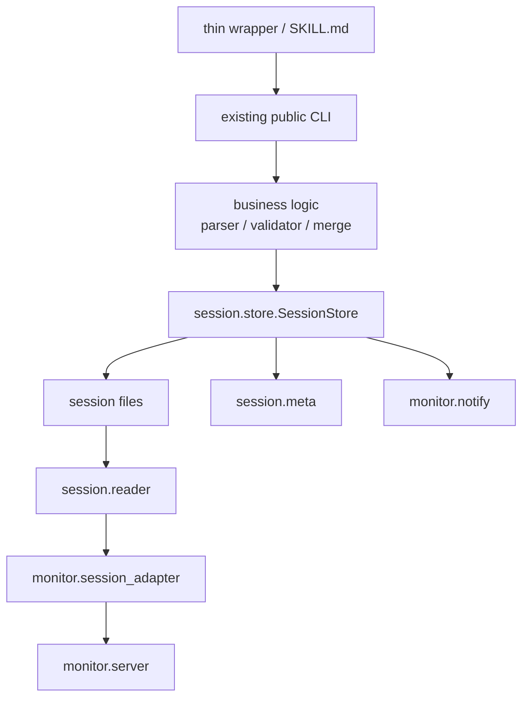

# forge session core script cleanup 詳細設計書

## メタデータ

| 項目    | 値                                                                  |
| ------- | ------------------------------------------------------------------- |
| 種別    | 詳細設計                                                            |
| Feature | new-session-2                                                       |
| 対象    | forge core session scripts / review extraction / monitor adapter    |
| 作成日  | 2026-05-05                                                          |
| 統合先  | 実装完了後は DES-011 / DES-012 / DES-015 / DES-021 へ永続原則を統合 |

## 必須参照文書 [MANDATORY]

**NEVER skip.** 実装時は下記を全て読み込み、深く理解すること。

- `docs/rules/implementation_guidelines.md`
- `docs/rules/document_writing_rules.md`
- `docs/specs/forge/design/DES-011_session_management_design.md`
- `docs/specs/forge/design/DES-012_show_browser_design.md`
- `docs/specs/forge/design/DES-015_review_workflow_design.md`
- `docs/specs/forge/design/DES-021_review_perspective_split_design.md`
- `docs/specs/forge/design/DES-024_skill_script_layout_design.md`
- `plugins/forge/docs/session_format.md`

## 1. 目的

forge の session core script は、Phase 1-6 の整理で monitor 表示と session meta の基本契約を
持つようになった。一方で、成果物ファイルの書き込み、monitor 通知、`session.yaml` meta 更新、
atomic write、エラー JSON 出力の方針はまだ複数 script に分散している。

本設計の目的は、thin wrapper ではなく core script の責務境界を整理し、AI と人間が
「session artifact を更新したら何を忘れてはいけないか」を毎回考えなくてよい構造にすることである。

特に以下を満たす。

- 既存 public CLI path を維持する
- `plan.yaml` / `refs.yaml` / `review.md` の正規責務を変えない
- writer ごとの notify / meta 更新漏れを構造的に防ぐ
- review extraction の parser / renderer / file write を分離する
- monitor adapter と `read_session.py` の読み取り規則を重複させない
- 変更は小さなフェーズに分け、各フェーズで全テストを通せる状態にする

## 2. 非目標

- thin wrapper の削除・生成化・dispatcher 化
- SKILL.md のワークフロー変更
- `.claude/.temp/` 以外の session 保存場所導入
- `session_state.yaml` など新しい全体状態ファイルの追加
- `plan.yaml` の schema 変更
- `/session` レスポンス互換を破る変更
- 外部依存の追加
- バージョン関連ファイル / CHANGELOG の更新

## 3. 現状の問題

### 3.1 書き込み副作用が各 writer に分散している

現状の writer は、成果物の保存後に個別に副作用を呼んでいる。

| script                                             | 主成果物                  | 副作用                                 |
| -------------------------------------------------- | ------------------------- | -------------------------------------- |
| `session/write_refs.py`                            | `refs.yaml`               | notify + `phase=context_ready`         |
| `session/update_plan.py`                           | `plan.yaml`               | notify + `active_artifact=plan.yaml`   |
| `session/merge_evals.py`                           | `plan.yaml`               | `write_plan()` 経由 notify + meta 更新 |
| `session/write_interpretation.py`                  | `review_{perspective}.md` | notify + active artifact               |
| `skills/review/scripts/extract_review_findings.py` | `plan.yaml`, `review.md`  | notify + `phase=review_extracted`      |
| `session_manager.py update-meta`                   | `session.yaml`            | notify                                 |

これは動作しているが、新しい writer を追加した時に notify / meta 更新を忘れやすい。

### 3.2 atomic write が統一されていない

`session_manager.py` と `write_interpretation.py` は atomic write helper を持つが、
`write_refs.py`、`update_plan.py`、`extract_review_findings.py` は直接書き込みまたは
`yaml_utils.write_nested_yaml()` に委譲している。ファイル破損のリスクは小さいが、方針が分散している。

### 3.3 review extraction が複数責務を持つ

`extract_review_findings.py` は以下を 1 ファイルで担っている。

- `review_*.md` の glob と partial failure 処理
- review markdown の parser
- `plan.yaml` renderer
- `review.md` renderer
- legacy mode
- session_dir mode
- notify / meta 更新
- CLI 引数解釈

この状態では parser の修正と writer の修正が同じファイルに混ざり、テストも肥大化する。

### 3.4 読み取り規則が二重化している

`session/read_session.py` と `monitor/session_adapter.py` は、いずれも session files / refs files を読む。
用途は違うが、存在しないファイル・YAML parse error・Markdown の扱いが似ており、将来差分が広がる可能性がある。

### 3.5 `session_manager.py` が lifecycle と storage helper を同時に持つ

`session_manager.py` は CLI entrypoint として必要だが、以下の内部責務も抱えている。

- monitor 起動
- session dir lifecycle
- flat YAML 組み立て
- atomic write
- meta validation
- meta 更新
- cleanup safety

今後 core script を改善するなら、CLI entrypoint は残しつつ内部処理を `session/` module へ寄せる必要がある。

## 4. 基本方針

### 4.1 public CLI path を維持する

既存 wrapper / SKILL.md が呼ぶ path は変更しない。

- `plugins/forge/scripts/session_manager.py`
- `plugins/forge/scripts/session/write_refs.py`
- `plugins/forge/scripts/session/update_plan.py`
- `plugins/forge/scripts/session/merge_evals.py`
- `plugins/forge/scripts/session/write_interpretation.py`
- `plugins/forge/scripts/session/read_session.py`
- `plugins/forge/skills/review/scripts/extract_review_findings.py`

内部実装を移しても、これらは facade として残す。

### 4.2 書き込みは SessionStore に寄せる

新規 module `plugins/forge/scripts/session/store.py` を導入する。

`SessionStore` は「session_dir 内の成果物を書き、必要な副作用を安全に実行する」責務を持つ。
business logic や parser logic は持たない。

### 4.3 parser / renderer は file write を持たない

review extraction の parser / renderer は純粋関数に寄せる。

- 入力: 文字列 / dict / list
- 出力: dict / list / 文字列
- ファイル IO、notify、meta 更新をしない

### 4.4 互換性を優先し、差分は段階的に移す

各フェーズは次の条件を満たす。

- 既存 CLI の stdout / stderr / exit code を維持する
- 既存テストを移植してから旧 helper を削る
- 1 フェーズごとに対象テストと全体テストを通す

## 5. 目標アーキテクチャ



### 5.1 module 構成

| module                                             | 種別        | 責務                                                          |
| -------------------------------------------------- | ----------- | ------------------------------------------------------------- |
| `session/store.py`                                 | 新規        | session artifact 書き込み、atomic write、notify、meta 更新    |
| `session/meta.py`                                  | 新規        | `session.yaml` meta validation / update / atomic write        |
| `session/reader.py`                                | 新規        | session files / refs files の読み取り共通処理                 |
| `review/findings_parser.py`                        | 新規        | review markdown から findings を抽出                          |
| `review/findings_renderer.py`                      | 新規        | findings から `plan.yaml` / `review.md` 文字列を生成          |
| `session_manager.py`                               | 既存 facade | CLI parser、lifecycle command、meta command への委譲          |
| `session/read_session.py`                          | 既存 facade | `session.reader` を呼ぶ CLI                                   |
| `monitor/session_adapter.py`                       | 既存        | `session.reader` を使って `/session` 互換 JSON + derived 生成 |
| `skills/review/scripts/extract_review_findings.py` | 既存 facade | CLI parser、session_dir / legacy mode の orchestration        |

`review/` module は `plugins/forge/scripts/review/` 配下に置く。`skills/review/scripts/` 配下には置かない。
review parser は reviewer / present-findings / future tool から再利用され得る core logic だからである。

## 6. SessionStore 詳細設計

### 6.1 API

```python
class SessionStore:
    def __init__(self, session_dir: str | Path):
        ...

    def write_text(
        self,
        relative_path: str,
        content: str,
        *,
        notify: bool = True,
        meta: dict | None = None,
        atomic: bool = True,
    ) -> Path:
        ...

    def write_nested_yaml(
        self,
        relative_path: str,
        sections: list[tuple[str, object]],
        *,
        meta: dict | None = None,
    ) -> Path:
        ...

    def update_meta(self, updates: dict, *, notify: bool = True) -> dict:
        ...
```

### 6.2 path 安全性

`relative_path` は session_dir 相対のみ許可する。

| 入力                      | 判定 |
| ------------------------- | ---- |
| `plan.yaml`               | 許可 |
| `refs.yaml`               | 許可 |
| `refs/specs.yaml`         | 許可 |
| `review_logic.md`         | 許可 |
| `/tmp/x`                  | 拒否 |
| `../outside.yaml`         | 拒否 |
| `refs/../../outside.yaml` | 拒否 |

拒否時は `ValueError` を投げる。

### 6.3 atomic write

`write_text()` は既定で atomic write を使う。

実装規則:

- target と同一ディレクトリに一時ファイルを作る
- `write → flush → fsync → os.replace`
- 失敗時は一時ファイルを削除する
- target parent は必要に応じて作成する

`write_nested_yaml()` は `yaml_utils.build_nested_yaml_text()` 相当を使って文字列化し、
`write_text()` 経由で保存する。

現状 `yaml_utils.write_nested_yaml()` は直接書き込み API として残すが、core writer は
`SessionStore.write_nested_yaml()` へ移行する。

### 6.4 notify / meta 更新順序

成果物書き込み後の順序は次の通り。

1. 成果物を atomic write
2. 成果物について `notify_session_update(session_dir, artifact_path)`
3. `meta` が指定されていれば `session.yaml` を更新
4. `session.yaml` 更新成功時に `session.yaml` について notify

meta 更新だけ失敗した場合、`write_text()` は成功した成果物 path を返す。警告は
`update_session_meta_warning()` と同じ方針で stderr に出す。

### 6.5 明示的にやらないこと

`SessionStore` は以下を行わない。

- `plan.yaml` item の validation
- review markdown の parse
- evaluator result の merge
- monitor `/session` JSON の生成
- session lifecycle の init / find / cleanup

## 7. session.meta 詳細設計

`session_manager.py` から meta 更新ロジックを `session/meta.py` へ移す。

### 7.1 移動する要素

- `SESSION_META_FIELDS`
- `SESSION_FIELD_ORDER`
- `VALID_PHASE_STATUSES`
- `VALID_WAITING_TYPES`
- `_one_line()`
- `_build_flat_yaml_text()`
- `_atomic_write_flat_yaml()`
- `_validate_meta_updates()`
- `update_session_meta()`
- `update_session_meta_warning()`

### 7.2 互換 facade

既存 import 互換のため、`session_manager.py` は当面以下を re-export する。

```python
from session.meta import update_session_meta, update_session_meta_warning
```

既存 writer は Phase 1 では import 先を変えない。Phase 2 以降で `SessionStore` へ移す。

## 8. session.reader 詳細設計

### 8.1 目的

`session/read_session.py` と `monitor/session_adapter.py` の読み取り規則を共通化する。

### 8.2 API

```python
SESSION_FILES = [...]
REFS_FILES = [...]

def read_entry(path: Path, *, yaml_parser=parse_yaml) -> dict:
    ...

def read_session_files(session_dir: str | Path, file_filter: list[str] | None = None) -> dict:
    ...
```

戻り値は既存 `read_session.py` / monitor adapter の entry 形式に合わせる。

```json
{"exists": true, "content": {...}}
{"exists": true, "content": null, "error": "..."}
{"exists": false, "content": null}
```

### 8.3 monitor adapter との関係

`monitor/session_adapter.py` は `session.reader.read_session_files()` を呼び、`derived` だけを追加する。

`monitor/session_adapter.py` から削る対象:

- YAML / Markdown の低レベル read helper
- session files / refs files の重複定義

`derived` 生成は adapter に残す。

## 9. review extraction 分割設計

### 9.1 parser module

`plugins/forge/scripts/review/findings_parser.py`

```python
def extract_findings(content: str) -> list[dict]:
    ...

def extract_perspective_from_filename(filename: str) -> str:
    ...
```

現行 `extract_review_findings.py` から parser 関数を移す。挙動は変えない。

### 9.2 renderer module

`plugins/forge/scripts/review/findings_renderer.py`

```python
def generate_plan_yaml(findings: list[dict]) -> str:
    ...

def generate_review_md(findings: list[dict]) -> str:
    ...

def summarize(findings: list[dict]) -> dict:
    ...
```

現行 renderer 関数を移す。出力フォーマットは変えない。

### 9.3 CLI facade

`plugins/forge/skills/review/scripts/extract_review_findings.py` は以下だけを担う。

- 引数解釈
- session_dir mode / legacy mode の分岐
- `review_*.md` の収集
- parser / renderer 呼び出し
- `SessionStore` 経由の書き込み
- JSON summary 出力

### 9.4 session_dir mode の書き込み

`review_only=False`:

```python
store.write_text("plan.yaml", plan_yaml, meta=None)
store.write_text(
    "review.md",
    review_md,
    meta={
        "phase": "review_extracted",
        "phase_status": "completed",
        "active_artifact": "review.md",
    },
)
```

`review_only=True`:

```python
store.write_text("review.md", review_md, meta=None)
```

`plan.yaml` を書かない挙動は維持する。

### 9.5 legacy mode

legacy mode は session_dir がない可能性があるため `SessionStore` を使わない。
ただし atomic write helper は共通 utility を使ってよい。

## 10. 既存 writer の移行設計

### 10.1 write_refs.py

変更前:

```python
write_nested_yaml(str(output_path), sections)
notify_session_update(session_dir, str(output_path))
update_session_meta_warning(session_dir, {...})
```

変更後:

```python
store = SessionStore(session_dir)
store.write_nested_yaml(
    "refs.yaml",
    sections,
    meta={
        "phase": "context_ready",
        "phase_status": "completed",
        "active_artifact": "refs.yaml",
    },
)
```

### 10.2 update_plan.py

`read_plan()` / `update_item()` / `update_items_batch()` は business logic として維持する。
`write_plan()` だけを `SessionStore` 経由にする。

```python
store.write_nested_yaml(
    "plan.yaml",
    [("items", ordered_items)],
    meta={"active_artifact": "plan.yaml"},
)
```

### 10.3 merge_evals.py

`merge_evals.py` は `update_plan.write_plan()` を呼ぶため、二重 meta 更新を避ける。

変更方針:

- `update_plan.write_plan()` は active artifact のみ更新する
- `merge_evals.py` は `store.update_meta({"phase": "evaluation_merged", ...})` を呼ぶ
- または `write_plan(..., meta=...)` を受け取れるようにする

推奨は後者。

```python
write_plan(
    session_dir,
    plan_data,
    meta={
        "phase": "evaluation_merged",
        "phase_status": "completed",
        "active_artifact": "plan.yaml",
    },
)
```

これにより plan 書き込み notify と meta 更新が 1 経路になる。

### 10.4 write_interpretation.py

`_atomic_write_text()` を削除し、`SessionStore.write_text()` を使う。

backup 作成は `SessionStore.write_text(f"review_{perspective}.raw.md", raw_content, notify=False)` を使う。
target 更新は notify + active artifact 付き。

### 10.5 session_manager.py

Phase 1 では re-export のみにする。Phase 3 以降で lifecycle も `session/lifecycle.py` へ分離できるが、
本 feature の必須範囲にはしない。

理由:

- `session_manager.py` は wrapper から直接呼ばれる最重要 entrypoint
- lifecycle 分離は価値があるが、SessionStore 導入と同時に行うと差分が大きい

## 11. テスト設計

### 11.1 新規テスト

| テストファイル                                 | 主な観点                                             |
| ---------------------------------------------- | ---------------------------------------------------- |
| `tests/forge/scripts/session/test_store.py`    | path safety, atomic write, notify, meta warning      |
| `tests/forge/scripts/session/test_meta.py`     | meta validation, waiting_reason clear, status update |
| `tests/forge/scripts/session/test_reader.py`   | missing / markdown / yaml / parse error              |
| `tests/forge/review/test_findings_parser.py`   | 現行 parser 観点の移植                               |
| `tests/forge/review/test_findings_renderer.py` | `plan.yaml` / `review.md` 出力互換                   |

### 11.2 既存テストの移行

| 既存テスト                                                 | 移行内容                                            |
| ---------------------------------------------------------- | --------------------------------------------------- |
| `tests/forge/scripts/test_session_manager.py`              | meta 関数の詳細テストを `test_meta.py` へ移す       |
| `tests/forge/scripts/session/test_write_refs.py`           | notify / meta 呼び出しを store 経由で検証           |
| `tests/forge/scripts/session/test_update_plan.py`          | `write_plan(meta=...)` の挙動を追加                 |
| `tests/forge/scripts/session/test_merge_evals.py`          | 二重 meta 更新がないことを確認                      |
| `tests/forge/scripts/session/test_write_interpretation.py` | backup / target の atomic write を store 経由で確認 |
| `tests/forge/scripts/test_session_adapter.py`              | reader 利用後も `/session` 互換が維持されること     |
| `tests/forge/review/test_extract_review_findings.py`       | CLI orchestration 中心へ縮小                        |

### 11.3 regression test

各フェーズで最低限以下を実行する。

```bash
python3 -m unittest tests.forge.scripts.session.test_store -v
python3 -m unittest tests.forge.scripts.session.test_meta -v
python3 -m unittest tests.forge.scripts.session.test_reader -v
python3 -m unittest tests.forge.review.test_extract_review_findings -v
python3 -m unittest tests.forge.scripts.test_session_adapter -v
python3 -m unittest discover -s tests -p 'test_*.py' -v
```

## 12. 実装フェーズ

### Phase 1: `session.meta` の分離

目的: `session_manager.py` の meta 更新責務を module 化する。

変更:

- `plugins/forge/scripts/session/meta.py` 追加
- `session_manager.py` は meta 関数を import / re-export
- `tests/forge/scripts/session/test_meta.py` 追加
- `tests/forge/scripts/test_session_manager.py` の meta 詳細テストを移動または重複排除

完了条件:

- `session_manager.py update-meta` の CLI 挙動が変わらない
- 既存 writer import が壊れない

### Phase 2: `SessionStore` 導入

目的: 書き込み・notify・meta 更新を 1 経路にする。

変更:

- `plugins/forge/scripts/session/store.py` 追加
- `tests/forge/scripts/session/test_store.py` 追加
- `write_refs.py` を store 経由に変更
- `update_plan.py` の `write_plan()` を store 経由に変更

完了条件:

- `write_refs.py` / `update_plan.py` の stdout / exit code 互換
- path traversal が拒否される
- notify / meta 更新漏れが test で検出できる

### Phase 3: review interpretation / merge writers の移行

目的: 残り writer の書き込み副作用を store へ寄せる。

変更:

- `write_interpretation.py` の atomic helper を削除し store 利用
- `merge_evals.py` の二重 meta 更新を整理
- `write_plan(..., meta=...)` API を導入

完了条件:

- `merge_evals.py` が `plan.yaml` を 1 回だけ書く
- meta 更新が `evaluation_merged` へ正しく進む
- backup 作成が atomic write で維持される

### Phase 4: `session.reader` 導入

目的: read_session と monitor adapter の読み取り規則を統一する。

変更:

- `plugins/forge/scripts/session/reader.py` 追加
- `session/read_session.py` を reader facade にする
- `monitor/session_adapter.py` の read helper を reader 利用へ変更

完了条件:

- `/session` レスポンスの既存 key が維持される
- `read_session.py` の JSON 出力互換
- monitor adapter の `derived` が維持される

### Phase 5: review parser / renderer 分離

目的: `extract_review_findings.py` を CLI orchestration に絞る。

変更:

- `plugins/forge/scripts/review/findings_parser.py` 追加
- `plugins/forge/scripts/review/findings_renderer.py` 追加
- parser / renderer tests を新設
- `extract_review_findings.py` は store + parser + renderer を呼ぶ facade にする

完了条件:

- session_dir mode / `--review-only` / legacy mode が全て互換
- parser / renderer の単体テストが CLI なしで通る
- `extract_review_findings.py` のテストは orchestration 中心に縮小される

### Phase 6: 死んだ重複 helper の削除と文書更新

目的: 移行後の重複を削除し、永続仕様へ反映する。

変更:

- 使われなくなった local atomic helper を削除
- `session_format.md` に store の責務を反映
- `DES-011` / `DES-012` / `DES-015` / `DES-021` に永続原則を反映
- 本 feature 文書は `merge-feature-specs` で main 仕様棚へ統合する

完了条件:

- `rg "_atomic_write_text|_atomic_write_flat_yaml|notify_session_update"` で意図しない重複がない
- `new-session-2` feature ディレクトリを main 仕様へ統合可能

## 13. リスクと対策

| リスク                                       | 影響                 | 対策                                                    |
| -------------------------------------------- | -------------------- | ------------------------------------------------------- |
| store 導入で CLI stdout が変わる             | wrapper / SKILL 破壊 | facade tests で stdout JSON を固定                      |
| notify が二重に飛ぶ                          | monitor update 重複  | writer ごとに notify 回数を mock で検証                 |
| meta 更新失敗で writer が失敗する            | 主成果物が作れない   | store は meta warning 方針を継承                        |
| reader 共通化で `/session` key が欠ける      | monitor UI 破壊      | adapter test で legacy key を検証                       |
| review parser 分離で finding 抽出が変わる    | review 品質低下      | 既存 `test_extract_review_findings.py` の観点を先に移植 |
| `session_manager.py` re-export で循環 import | CLI 起動失敗         | `session.meta` は `session_manager.py` を import しない |

## 14. 成功基準

- public CLI path が変わらない
- `python3 -m unittest discover -s tests -p 'test_*.py' -v` が通る
- writer script に直接 `notify_session_update()` を呼ぶ箇所が原則残らない
- writer script に直接 `update_session_meta_warning()` を呼ぶ箇所が原則残らない
- `extract_review_findings.py` が CLI orchestration 中心の薄い facade になる
- `monitor/session_adapter.py` が低レベル read helper を持たず、reader + derived 生成に集中する
- docs の永続仕様へ統合できる状態になる

## 15. 想定される削減効果

行数削減だけを成功指標にしない。初期フェーズでは新 module 追加により一時的に行数が増える可能性がある。

ただし最終的には以下が見込める。

| 領域              | 期待効果                                                                         |
| ----------------- | -------------------------------------------------------------------------------- |
| writer scripts    | notify / meta / atomic helper の重複削減。各 writer は business logic 中心になる |
| review extraction | parser / renderer の独立により CLI テストを縮小できる                            |
| monitor adapter   | file read helper の重複削減                                                      |
| tests             | store / reader / parser 単体テストへ寄せ、CLI テストの重複を減らす               |

複雑さの削減は、行数よりも「書き込み副作用の正規経路が 1 つになる」ことで評価する。
