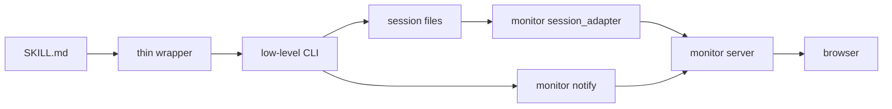

# forge session architecture cleanup 基本設計書

## メタデータ

| 項目   | 値                                                 |
| ------ | -------------------------------------------------- |
| 種別   | 基本設計                                           |
| 対象   | forge session / wrapper / monitor / writer scripts |
| 作成日 | 2026-05-05                                         |
| 保存先 | `docs/specs/forge/new-sesson/`                     |

## 必須参照文書 [MANDATORY]

**NEVER skip.** 実装時は下記を全て読み込み、深く理解すること。

- `docs/rules/implementation_guidelines.md`
- `docs/rules/skill_authoring_notes.md`
- `docs/rules/document_writing_rules.md`
- `plugins/forge/docs/session_format.md`
- `docs/specs/forge/design/DES-012_show_browser_design.md`
- `docs/specs/forge/design/DES-014_orchestrator_session_protocol_design.md`
- `docs/specs/forge/design/DES-024_skill_script_layout_design.md`

## 目的

forge の session / monitor / writer / SKILL wrapper 周辺は、段階的な拡張の結果として責務境界が読み取りにくくなっている。本設計は、新しい正規状態モデルを追加するのではなく、既存の状態ファイルと薄いラッパーを前提に、責務を再定義して複雑さを減らす。

特に、以下を同時に満たす整理を目的とする。

- AI が monitor 更新を意識しない
- review の `plan.yaml` を二重管理しない
- `.claude/.temp/{session}/` の既存セッションライフサイクルを維持する
- 多数の薄い SKILL wrapper を考慮し、破壊的な一括置換を避ける
- monitor が SKILL 固有ファイル名を直接推測する範囲を縮小する
- 使われていない旧実装を段階的に削除できる状態にする

## 非目標

- `.forge/sessions/` など新しいセッション保存場所を導入すること
- `session_state.yaml` を新設して全状態を複製すること
- `plan.yaml` / `refs.yaml` / `refs/` の意味を別ファイルへ移すこと
- 薄い wrapper を全廃すること
- 既存 SKILL を一度に全面改修すること
- monitor UI デザインを刷新すること

## 現状認識

### 既存の正規状態

forge には既に複数の正規状態が存在する。これらは用途別に分かれており、単一ファイルへ統合すべきではない。

| ファイル                               | 現在の責務                                        | 今後の扱い                                   |
| -------------------------------------- | ------------------------------------------------- | -------------------------------------------- |
| `session.yaml`                         | セッションメタデータ、ライフサイクル、resume 判定 | セッション manifest と粗い進行状態の正規情報 |
| `refs/`                                | create 系 / implement 系の参照情報                | 並列 agent 出力の正規情報                    |
| `refs.yaml`                            | review の参照情報、perspectives                   | review 固有の正規 context                    |
| `plan.yaml`                            | review 指摘事項、推奨、処理状態                   | review item state の唯一の正規情報           |
| `review.md`, `review_{perspective}.md` | review 本文                                       | review 表示・判断の正規成果物                |

### 薄い wrapper の現状

`plugins/forge/skills/*/scripts/` には、低レベル script を subprocess で呼ぶ薄い wrapper が多数存在する。これは偶然の重複ではなく、DES-024 の「SKILL.md は位置引数のみの 1 行指示に寄せる」方針に基づく。

したがって、本整理では wrapper の存在そのものを問題視しない。問題は、低レベル script の責務が分散し、monitor reader と旧実装が重複していることである。

## 基本方針

### 1. 正規状態を増やさない

`session_state.yaml` のような新しい全体スナップショットは追加しない。既存状態の正規性を以下のように明確化する。

| 状態カテゴリ                                     | 正規情報源                                       |
| ------------------------------------------------ | ------------------------------------------------ |
| セッションの存在、skill、開始時刻、resume policy | `session.yaml`                                   |
| 粗い進行状態、現在フェーズ、待機理由             | `session.yaml` の追加フィールド                  |
| review の指摘状態                                | `plan.yaml`                                      |
| review の参照情報                                | `refs.yaml`                                      |
| create / implement 系の参照情報                  | `refs/{specs,rules,code}.yaml`                   |
| 最終成果物                                       | `docs/specs/**` など既存出力先                   |
| monitor 表示用の正規化データ                     | monitor adapter の派生結果。永続正規情報ではない |

### 2. `session.yaml` は manifest と粗い進行状態だけを持つ

`session.yaml` は全状態を持たない。以下のような浅いフィールドだけを追加対象にする。

```yaml
skill: start-design
started_at: "2026-05-05T10:00:00Z"
last_updated: "2026-05-05T10:04:00Z"
status: in_progress
resume_policy: none
feature: login
mode: new
output_dir: docs/specs/forge/design
phase: context_gathering
phase_status: in_progress
focus: "関連仕様と既存コードを収集中"
waiting_type: none
waiting_reason: ""
active_artifact: ""
```

浅いフィールドに限定する理由は、既存の標準ライブラリ YAML utility と互換性を保ち、複雑な schema validation を増やさないためである。

### 3. `plan.yaml` を review の真実として維持する

review 系の item 状態は `plan.yaml` だけを正とする。`session.yaml` には件数サマリや現在処理中 ID を持たせてもよいが、`items[]`、`recommendation`、`auto_fixable`、`reason`、`status` を複製してはならない。

### 4. monitor は adapter 経由で読む

`monitor/server.py` が SKILL 固有ファイルを直接読み分ける構造を縮小する。新たに `plugins/forge/scripts/monitor/session_adapter.py` を導入し、既存ファイル群から monitor 向け JSON を組み立てる責務を分離する。

`server.py` は HTTP / SSE / notify / heartbeat に集中する。

### 5. wrapper は保持し、低レベル CLI の安定化を優先する

薄い wrapper は SKILL.md の複雑化を防ぐために残す。整理対象は wrapper ではなく、wrapper の接続先である低レベル CLI とテストの重複である。

## 目標アーキテクチャ



### レイヤ責務

| レイヤ          | 配置                                               | 責務                                                    |
| --------------- | -------------------------------------------------- | ------------------------------------------------------- |
| SKILL.md        | `plugins/forge/skills/*/SKILL.md`                  | 人間と AI の手順。複雑な flag 合成を持たない            |
| thin wrapper    | `plugins/forge/skills/*/scripts/*.py`              | SKILL 固有値を hardcode し、低レベル CLI を透過呼び出し |
| low-level CLI   | `plugins/forge/scripts/**`                         | 状態遷移、ファイル生成、schema validation               |
| session files   | `.claude/.temp/{session}/`                         | 一時状態と中間成果物                                    |
| monitor adapter | `plugins/forge/scripts/monitor/session_adapter.py` | session files から monitor 表示用 JSON を生成           |
| monitor server  | `plugins/forge/scripts/monitor/server.py`          | HTTP / SSE / notify / heartbeat                         |

## セッション CLI 整理

### 現状維持する public entrypoint

互換性のため、以下の CLI パスは維持する。

- `plugins/forge/scripts/session_manager.py`
- `plugins/forge/scripts/session/write_refs.py`
- `plugins/forge/scripts/session/update_plan.py`
- `plugins/forge/scripts/session/merge_evals.py`
- `plugins/forge/scripts/session/write_interpretation.py`
- `plugins/forge/scripts/session/summarize_plan.py`
- `plugins/forge/scripts/session/read_session.py`

wrapper が多数存在するため、public entrypoint の rename / move は原則行わない。内部実装を分離する場合も、既存パスは facade として残す。

### 追加する低レベル操作

`session_manager.py` に粗い進行状態を更新する subcommand を追加する。

```bash
python3 session_manager.py update-meta {session_dir} \
  [--phase context_gathering] \
  [--phase-status in_progress] \
  [--focus "..."] \
  [--waiting-type none] \
  [--waiting-reason "..."] \
  [--active-artifact path]
```

この subcommand は `session.yaml` の浅いフィールドだけを更新する。`plan.yaml` や `refs.yaml` は触らない。

### writer script の通知方針

既存 writer script は、状態更新後に `notify_session_update()` を呼ぶ。これは維持する。

ただし、monitor 固有の情報を writer 引数へ増やさない。writer が知るのは「自分が更新した session file」だけでよい。

## wrapper 整理方針

### 残す wrapper

以下に該当する wrapper は残す。

- `--skill {name}` を hardcode する `find_session.py`
- `--skill {name}` と skill 固有引数を hardcode / 整列する `init_session.py`
- skill 固有の mode / doc type を付与する `resolve_doc.py`
- status 値を hardcode する `mark_fixed.py`, `mark_skipped.py`, `mark_in_progress.py`, `mark_needs_review.py`
- 複数低レベル CLI を安全に連鎖する `skip_all_unprocessed.py`

### 削除候補 wrapper

以下だけに該当する wrapper は削除候補にできる。ただし実装前にユーザ確認を必須とする。

- 低レベル CLI のパス短縮だけをしている
- 引数を一切 hardcode していない
- SKILL.md に直接 1 行で書いても flag 合成が増えない

現時点では wrapper の削除を本設計の必須タスクにしない。wrapper 削除はリスクに比べて効果が小さいため、後段の小規模整理として扱う。

### wrapper テストの整理

wrapper が多いことによる負担は、実装ではなくテストの重複に出ている。各 wrapper のテストは以下へ寄せる。

- 共通 helper で subprocess 引数と exit code 透過を検証する
- skill ごとの差分は fixture 化する
- 各 wrapper ごとのテストファイルは残してよいが、assert ロジックを重複させない

## monitor 整理方針

### `session_adapter.py` の導入

`monitor/server.py` から YAML / Markdown 読み取りと SKILL 別正規化を分離する。

想定 API:

```python
def build_monitor_session(session_dir: str, skill: str) -> dict:
    ...
```

戻り値は当面、既存 `/session` レスポンスと互換にする。

```json
{
  "session_dir": "...",
  "skill": "review",
  "files": {
    "session.yaml": { "exists": true, "content": {} },
    "plan.yaml": { "exists": true, "content": {} }
  },
  "refs": {},
  "refs_yaml": { "exists": true, "content": {} },
  "derived": {
    "phase": "...",
    "counts": {}
  }
}
```

`derived` は monitor 表示用の派生情報であり、永続状態ではない。

### 旧 `skill_monitor.py` の扱い

`plugins/forge/scripts/skill_monitor.py` は `plugins/forge/scripts/monitor/server.py` と責務が重複している。削除候補とする。

ただし、削除は次を満たした後に行う。

1. `rg "skill_monitor.py"` で runtime 参照が tests 以外に存在しないこと
2. `test_skill_monitor.py` の必要なテスト観点を `test_monitor_server.py` / `test_session_adapter.py` へ移植済みであること
3. ユーザが削除を承認していること

## session file schema

### `session.yaml`

追加可能なフィールド:

| フィールド        | 型     | 説明                                               |
| ----------------- | ------ | -------------------------------------------------- |
| `phase`           | string | 現在の粗いフェーズ                                 |
| `phase_status`    | string | `pending` / `in_progress` / `completed` / `failed` |
| `focus`           | string | 現在の作業焦点。1 行                               |
| `waiting_type`    | string | `none` / `user_input` / `agent` / `command`        |
| `waiting_reason`  | string | 待機理由。1 行                                     |
| `active_artifact` | string | 現在作成中または直近更新した成果物パス             |

禁止事項:

- `plan.yaml` の `items[]` を複製しない
- `refs.yaml` の `target_files` / `perspectives` を複製しない
- 成果物本文を埋め込まない
- 深いネスト構造を追加しない

### `events.jsonl`

必要になった場合のみ、debug log として `.claude/.temp/{session}/events.jsonl` を追加できる。

制約:

- canonical state ではない
- monitor の primary source にしない
- 失敗しても主処理を止めない
- JSON Lines とし、YAML にしない

## 移行計画

### Phase 0: 棚卸し

- SKILL wrapper 一覧を固定する
- runtime 参照と test 参照を分ける
- `session.yaml` / `plan.yaml` / `refs.yaml` の正規責務を `session_format.md` に反映する

### Phase 1: `session.yaml` の浅い更新 API

- `session_manager.py update-meta` を追加する
- `session.yaml` 書き込みを atomic にする
- `last_updated` を更新時に必ず進める
- 既存 `init`, `find`, `cleanup` の互換を維持する

### Phase 2: monitor adapter 分離

- `monitor/session_adapter.py` を追加する
- `server.py` の `YamlReader` 相当を adapter へ移す
- `/session` JSON は互換維持する
- `derived` に phase / waiting / review counts を追加する

### Phase 3: 既存 writer から粗い状態を自動更新

AI / SKILL に新しい状態更新手順を増やさず、既存 writer の自然な節目で `session.yaml` を更新する。

例:

- `write_refs.py` 完了時: `phase=context_ready`
- `extract_review_findings.py` 完了時: `phase=review_extracted`
- `merge_evals.py` 完了時: `phase=evaluation_merged`
- `update_plan.py` 完了時: `active_artifact=plan.yaml`
- `write_interpretation.py` 完了時: `active_artifact=review_{perspective}.md`

### Phase 4: 旧実装の削除

- `skill_monitor.py` の runtime 参照がないことを確認する
- 必要なテストを移植する
- ユーザ確認後に削除する

### Phase 5: wrapper テスト重複の縮小

- wrapper テスト helper を追加する
- `find_session.py` / `init_session.py` の共通 assert を fixture 化する
- wrapper 本体の削除はこの段階でも必須にしない

## 実装順序

1. `session_format.md` に正規責務表を追加
2. `session_manager.py update-meta` とテストを追加
3. `monitor/session_adapter.py` とテストを追加
4. `monitor/server.py` を adapter 利用へ変更
5. writer script から `update-meta` 相当の内部関数を呼ぶ
6. monitor templates が `derived` を使えるようにする
7. `skill_monitor.py` 削除可否をユーザ確認する
8. wrapper テスト helper を導入する

## テスト方針

### 必須テスト

- `session_manager.py update-meta`
  - 既存 flat fields を保持する
  - 指定した shallow fields だけ更新する
  - `last_updated` が更新される
  - 存在しない session dir は error
- `monitor/session_adapter.py`
  - review session を既存 `/session` JSON 互換で返す
  - document session を既存 `/session` JSON 互換で返す
  - `plan.yaml` 不在でも落ちない
  - `derived` は欠損ファイルを許容する
- writer scripts
  - 既存成果物を書いた後も従来 JSON を維持する
  - monitor 不在でも正常終了する
  - `session.yaml` 更新失敗時の扱いを明示する
- wrapper
  - subprocess 引数が従来通り
  - exit code を透過する

### 回帰テスト

```bash
python3 -m unittest discover -s tests -p 'test_*.py' -v
```

## ユーザ確認が必要な判断 [MANDATORY]

以下は実装前または実装途中で必ずユーザに確認する。

- `skill_monitor.py` を削除するか
- public CLI path を rename / move するか
- thin wrapper を削除するか
- `session.yaml` に追加する field 名を既存仕様へ正式採用するか
- monitor `/session` JSON の互換を破る変更を許可するか
- `.claude/.temp/` 以外のセッション保存場所を導入するか

本設計の推奨は、上記のうち public CLI path rename、thin wrapper 削除、`/session` 互換破壊、セッション保存場所変更を行わないことである。

## 採用しない案

### `session_state.yaml` を追加する

採用しない。`plan.yaml`、`refs.yaml`、`session.yaml` と二重管理になり、正規情報源が増えるためである。

### `.forge/sessions/` に移行する

採用しない。既存の `session_manager.py`、SKILL wrapper、monitor launcher、session cleanup が `.claude/.temp/` を前提としているため、効果に比べて移行リスクが大きい。

### wrapper を全廃する

採用しない。DES-024 の SKILL.md 単純化方針に反し、SKILL.md に flag 合成が戻るためである。

### monitor に writer 責務を持たせる

採用しない。monitor は consumer であり、状態生成や成果物生成を担わない。

## 期待効果

- 正規状態の数が増えない
- review item state の真実が `plan.yaml` に固定される
- monitor の reader 複雑性が `session_adapter.py` に閉じる
- `server.py` が HTTP / SSE に集中できる
- 薄い wrapper を無理に削らず、SKILL.md の安定性を維持できる
- 旧 `skill_monitor.py` 削除の判断材料が明確になる

## 結論

forge の根本整理は、新しい session state protocol を足すことではなく、既存の正規情報源を明確化し、読み取り adapter と低レベル CLI を整理することで進めるべきである。

`session.yaml` は manifest と粗い進行状態、`plan.yaml` は review item state、`refs.yaml` / `refs/` は context、monitor は adapter 経由の consumer とする。この分担を崩さない限り、薄い wrapper が多数存在しても、複雑さは管理可能な範囲に収まる。
