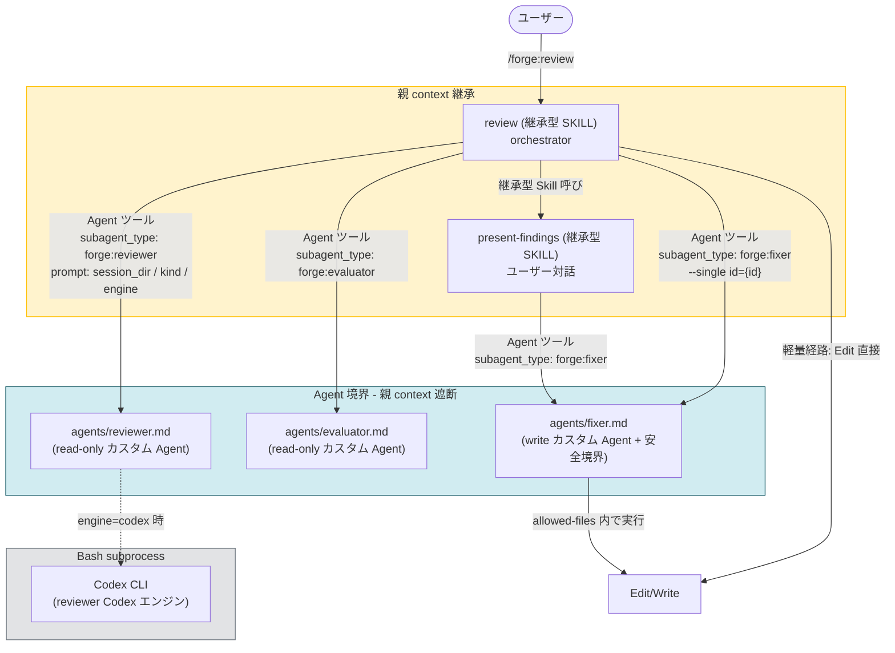
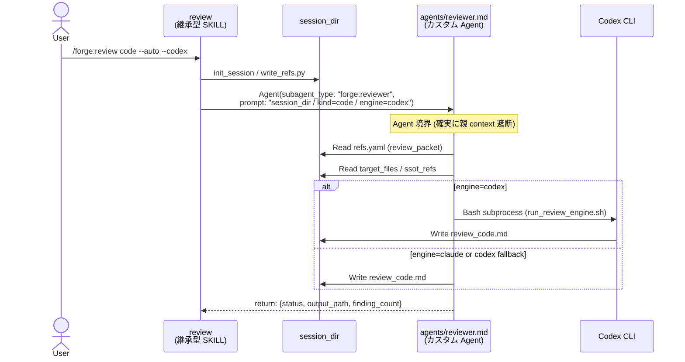
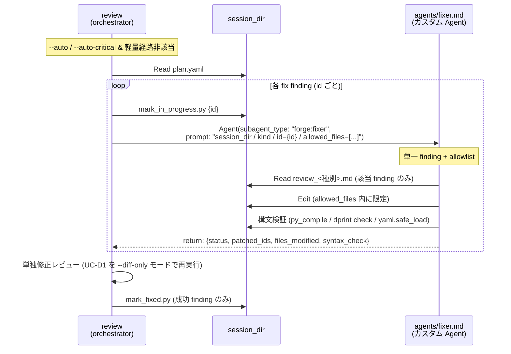

# DES-032 fork 型 SKILL 全廃と Agent 起動への置き換え 設計書

## メタデータ

| 項目     | 値                                                                                                                                                                                                                        |
| -------- | ------------------------------------------------------------------------------------------------------------------------------------------------------------------------------------------------------------------------- |
| 設計 ID  | DES-032                                                                                                                                                                                                                   |
| 種別     | 設計書 (ADR を兼ねる — アーキテクチャ転換の決定記録)                                                                                                                                                                      |
| 関連要件 | REQ-006_fork_skill_deprecation                                                                                                                                                                                            |
| 関連設計 | COMMON-DES-001_skill_base_design (§6 改訂対象)、DES-029_skill_agent_launch_contract_design (Agent 起動契約へ書き換え)、DES-015_review_workflow_design (起動経路図改訂)、DES-028_review_policy_design (修正経路分岐表改訂) |
| 起点要件 | REQ-006 §3.2 / §3.3 / §3.5 / §3.6 / TBD-N01〜N06                                                                                                                                                                          |
| 作成日   | 2026-06-21                                                                                                                                                                                                                |
| 適用範囲 | bw-cc-plugins 配下の reviewer / evaluator / fixer 3 SKILL の Agent 化、および今後の fork 型 SKILL 採用方針                                                                                                                |

---

## 1. 概要

REQ-006 が要求する fork 型 SKILL 全廃を具体化する。reviewer / evaluator / fixer の 3 SKILL を **カスタム Agent (`plugins/forge/agents/<name>.md`)** として再実装し、Skill ツール (fork) 起動を Agent ツール起動に置き換える。fixer は書き込み副作用を持つため、単一 finding 起動・編集対象パス allowlist・無関係 refactor 禁止を Role 制約として明記する。session_dir のファイル契約 (refs.yaml / plan.yaml / `review_<種別>.md` / patch_result.json) は維持する。

本設計書は **ADR を兼ねる**。REQ-006 が列挙した未確定事項 (TBD-N01 〜 TBD-N06) を本書 §3 で決定として記録する。

---

## 2. アーキテクチャ概要

### 2.1 旧構成 (As-Is) → 新構成 (To-Be)

| 層                      | As-Is                                                              | To-Be                                                                                  |
| ----------------------- | ------------------------------------------------------------------ | -------------------------------------------------------------------------------------- |
| orchestrator            | `plugins/forge/skills/review/SKILL.md` (継承型 SKILL)              | 変更なし (継承型 SKILL のまま)                                                         |
| reviewer                | `plugins/forge/skills/reviewer/SKILL.md` (fork 型 SKILL)           | `plugins/forge/agents/reviewer.md` (read-only カスタム Agent)                          |
| evaluator               | `plugins/forge/skills/evaluator/SKILL.md` (fork 型 SKILL)          | `plugins/forge/agents/evaluator.md` (read-only カスタム Agent)                         |
| fixer                   | `plugins/forge/skills/fixer/SKILL.md` (fork 型 SKILL + Edit/Write) | `plugins/forge/agents/fixer.md` (write カスタム Agent + 単一 finding 起動 + allowlist) |
| present-findings        | `plugins/forge/skills/present-findings/SKILL.md` (継承型 SKILL)    | 変更なし (継承型 SKILL のまま。AskUserQuestion 必須のため fork 化不可)                 |
| 起動経路                | Skill ツール (fork)                                                | Agent ツール (`subagent_type: "forge:<name>"`)                                         |
| 親 context への return  | fork 境界 (broken) を経由した return                               | Agent 完了通知 + 構造化 return (確実に届く)                                            |
| 修正経路 (DES-028 §4.5) | 軽量経路 (orchestrator Edit) / fork 型 fixer 経路                  | 軽量経路 (orchestrator Edit) / Agent 経由 fixer 経路                                   |

### 2.2 起動経路の全体図



### 2.3 fork 型 SKILL との等価性と差異

カスタム Agent も fork 型 SKILL も「隔離 context + 事前定義ロール」という動作モデルは同じだが、**起動ツール** と **手順書の場所** が異なる:

| 観点                 | fork 型 SKILL (旧)                        | カスタム Agent (新)                                     |
| -------------------- | ----------------------------------------- | ------------------------------------------------------- |
| 起動ツール           | Skill ツール (`context: fork`)            | Agent ツール (`subagent_type: forge:<name>`)            |
| 手順書               | `skills/<name>/SKILL.md`                  | `agents/<name>.md` の system prompt                     |
| 引数受け渡し         | `$ARGUMENTS` 置換 (Issue #34164 で壊れる) | Agent prompt として直接渡す (実績あり)                  |
| return               | fork 完了通知 (Issue #60720 で消失)       | Agent 完了通知 (実績あり)                               |
| 親 context 漏洩      | 遮断 (Issue #18394 で 95%+ 効かない)      | 遮断 (確実)                                             |
| `subagent_type` 値域 | (該当なし)                                | `general-purpose` / `Explore` / `Plan` / `forge:<name>` |

カスタム Agent への移行で `$ARGUMENTS` 不達・return 消失・fork 効かずといった REQ-006 §1.3 の核心バグが構造的に解消される。

---

## 3. 設計判断 (ADR)

REQ-006 の未確定事項 (TBD-N01 〜 TBD-N06) を以下のとおり決定する。各決定は **代替案と棄却理由** を併記する。

### 3.1 TBD-N01: 各 worker の置換タイプ

**決定**: 3 worker すべてを **カスタム Agent** (`plugins/forge/agents/<name>.md`) として実装する。

| worker    | 置換タイプ                        | `tools` allowlist (frontmatter) | 根拠                                                                                                                                                                                                             |
| --------- | --------------------------------- | ------------------------------- | ---------------------------------------------------------------------------------------------------------------------------------------------------------------------------------------------------------------- |
| reviewer  | カスタム Agent (read-only)        | `Read, Write, Bash`             | 観点軸 P1/P2/P3 と 6 種別の review_packet を扱う複雑な手順書を持つ。汎用 Agent で毎回 prompt 構成は非現実的。プラグイン配布性も必要。`review_<種別>.md` を Write するため Write 必要、Codex 起動のため Bash 必要 |
| evaluator | カスタム Agent (read-only)        | `Read, Bash`                    | 5 観点精査 (ルール照合 / 設計意図 / 副作用 / false positive / 対象ファイル確認) の playbook を固定する必要あり。plan.yaml 更新は `apply_eval.py` (Bash) 経由のため Write 不要                                    |
| fixer     | カスタム Agent (write + 安全境界) | `Read, Edit, Write, Bash`       | 修正実行ロールを Role として固定し、書き込み副作用境界 (§3.5) を system prompt で常時拘束する必要あり。`Edit` を allowlist の §3.5.2 allowed_files 内に限定する                                                  |

`tools` allowlist は各 `agents/<name>.md` frontmatter の `tools:` フィールドに転記する。reviewer / evaluator には `Edit` / `MultiEdit` / `NotebookEdit` を **含めない** ことで C 層 allowlist (COMMON-DES-001 §8) として書き込み禁止を担保する。

**代替案と棄却理由**:

- **汎用 Agent (`general-purpose`)** — REQ-006 FNC-N06 で評価。一回性が低く 6 種別 × P1/P2/P3 の playbook を抱える reviewer / evaluator では呼び出し元 prompt が肥大化し orchestrator が崩壊する。棄却。
- **親実装 (orchestrator が継承型で内包)** — fixer 案A 相当。reviewer / evaluator まで親に取り込むと `review/SKILL.md` の責務が爆発し、§3.5 の「メインコンテキスト消費を抑える」原則 (DES-028 / fixer/SKILL.md L24) と直接衝突する。fixer も含めて棄却。
- **混在 (reviewer/evaluator = 汎用 Agent、fixer = カスタム)** — `agents/` の有無を worker ごとに分けると、`plugins/forge/agents/` ディレクトリの完全性 (テスト・配布) が分断する。統一を優先して棄却。

### 3.2 TBD-N02: fixer の worktree isolation

**決定**: **採用しない**。代わりに以下の Role 制約 + prompt 制約で安全境界を担保する (§3.5)。

**根拠**:

- worktree 作成・破棄のオーバーヘッド (~200-500ms + ディスク容量) が、想定する修正粒度 (1 finding / 数行) に対して過大
- 軽量経路 (FNC-413) との UX 差が大きくなる (軽量は即 Edit、fixer 経路は worktree 作成待ち)
- 実害 (無関係ファイルへの書き込み事故) は §3.5 の prompt 制約 + Agent system prompt の否定形制約 + テスト後 verify で検知可能

**代替案と棄却理由**:

- **常時 worktree isolation** — 上記理由により過剰
- **大規模修正 (file_modified ≥ N) 時のみ worktree** — 切り替え条件の判定ロジックが新たな複雑性を生む。将来 fixer の責務拡張時に再評価する (本設計では採用しない)

将来 fixer に「複数 finding をまとめて修正」「設計書を跨ぐ大規模変更」を委譲する設計拡張が来たときに再評価する (本書改定対象)。

### 3.3 TBD-N03: `agents/<name>.md` の配置先

**決定**: **`plugins/forge/agents/`** 配下に配置する。`subagent_type` の name は `forge:reviewer` / `forge:evaluator` / `forge:fixer` とする。

**根拠**:

- forge プラグインの配布単位として一体的に管理する
- 既存の doc-advisor `agents/` 配置 (例: `doc-advisor:query-worker`) と同じ namespace 戦略を踏襲
- `plugins/forge/skills/reviewer/SKILL.md` の旧位置とディレクトリ階層が並行 (`plugins/forge/skills/<name>` ↔ `plugins/forge/agents/<name>.md`) で発見性が高い

**代替案と棄却理由**:

- **リポジトリルート `agents/`** — bw-cc-plugins は marketplace リポジトリであり、プラグイン横断の agent は配布されない。棄却
- **`plugins/forge/skills/<name>/agent.md`** — skill とのディレクトリ重複で混乱を招く。skill としては廃止される (§3.7)

### 3.4 TBD-N04: session_dir ファイル契約

**決定**: **現行スキーマを維持する**。`refs.yaml` / `plan.yaml` / `review_<種別>.md` / `patch_result.json` の構造・キー・型は変更しない。

**根拠**:

- DES-015 / DES-028 / DES-029 で確立しており、移行リスクを抑える
- Agent 起動時の prompt サイズ最適化 (path だけ渡して Agent が Read) は **現行スキーマでも成立** している
- スキーマ簡略化は実装フェーズで実測してから別 Issue で議論する余地を残す (REQ-006 TBD-N04 更新済み: 「設計フェーズまたは実装フェーズ」)

### 3.5 fixer の安全境界 (REQ-006 FNC-N05 具体化)

**決定**: fixer カスタム Agent は以下を `agents/fixer.md` の system prompt に Role 制約 (否定形) として明記する。

#### 3.5.1 単一 finding 起動 [MANDATORY]

fixer Agent は 1 起動につき 1 finding を修正する。

- orchestrator は `subagent_type: forge:fixer` の prompt に `finding_id` (1 個) を渡す
- 一括修正 (`--batch`) は orchestrator 側で `for id in fix_ids: spawn fixer(id)` のループに置き換える。fixer Agent 内では複数 ID を扱わない
- 軽量経路 (FNC-413) との分岐表は本書 §4.2 を参照

#### 3.5.2 編集対象パスの allowlist [MANDATORY]

orchestrator は fixer Agent 起動時の prompt に **編集を許可するファイルパスの集合** を明示的に列挙する。fixer Agent はこの allowlist 外への書き込みを Role 制約として禁止される。

- allowlist は finding の `target_file` / `files_modified` / target_files に限定する
- 設計書・テスト・README などへの波及修正が必要な場合は **fixer ではなく orchestrator** が判断し、軽量経路または別 finding として処理する
- allowlist 違反を検知した場合、fixer Agent は `status: "error"` を return し書き込みを中止する

#### 3.5.3 無関係 refactor の禁止 [MANDATORY]

fixer Agent は「指摘の修正以外の変更を加えない」を Role 制約として持つ。

- 修正対象 finding の説明・修正案セクションに記載された変更のみを実施する
- 周辺コードの整形・命名変更・import 整理などは禁止 (別 finding として起票する)
- diff の行数増加が見出し情報量に対して過大な場合は警告を return する

#### 3.5.4 修正後の構文検証 [MANDATORY]

fixer Agent は修正後、対象ファイルに対して言語別の構文検査を実行し、結果を return に含める。

- Python: `python3 -m py_compile <file>` 相当
- Markdown: `dprint check <file>` 相当
- YAML: `python3 -c "import yaml; yaml.safe_load(open('<file>'))"` 相当
- JSON: `python3 -c "import json; json.load(open('<file>'))"` 相当 (manifest 系)
- Bash: `bash -n <file>` 相当 (`plugins/*/scripts/*.sh` 等)
- TOML: `python3 -c "import tomllib; tomllib.load(open('<file>', 'rb'))"` 相当
- 構文エラー検知時は `status: "error"` を return し、修正前の内容を保持する (rollback)

#### 3.5.5 return スキーマ

fixer Agent の return は DES-029 §6.5 のスキーマを継承する:

```json
{
  "status": "ok" | "error",
  "patched_ids": [int],
  "failed_ids": [int],
  "files_modified": [string],
  "syntax_check": {"<file>": "ok" | "error: <message>"},
  "allowlist_violations": [string],
  "error_message": "string?"
}
```

`patched_result.json` への永続化 (DES-029 §6.6) も継承する。

### 3.6 TBD-N05: 静的検証テストの実装方式

**決定**: **frontmatter scanner** (Python `yaml` ライブラリ) を用いる。`grep` ベースは採用しない。

**根拠**:

- 既存テスト (`tests/forge/subagent/test_fork_skill_frontmatter.py` / `tests/common/test_query_skill_isolation.py`) が既に `yaml.safe_load` で frontmatter を parse している。同方式を継承
- grep は frontmatter 内コメント / インデント変動に弱い
- 「context: fork が含まれない」を検査するため、frontmatter の取得→キー存在チェックで十分

**実装方針**:

- `tests/common/test_no_fork_skill.py` を新設し、`plugins/*/skills/*/SKILL.md` を全件走査
- frontmatter を parse し `context == "fork"` のものがあれば fail
- 既存 `test_fork_skill_*.py` は **本フィーチャー実装完了後に削除** する (F-5)

### 3.7 TBD-N06: 段階移行 vs 一括移行

**決定**: **段階移行** (REQ-006 §5.1 の F-1 〜 F-5) を採用する。**本設計書 DES-032 は F-1 (`feature/no-fork-skill-adr`) の成果物** に該当する。後続の F-2 〜 F-5 は本設計書を根拠に別フィーチャーで着手する。

**根拠**:

- reviewer / evaluator は read-only でリスクが低く、Agent 化 → /forge:review E2E 検証 → fixer 化 の順で incremental に検証可能
- fixer は §3.5 の安全境界実装 + テスト整備が必要で、reviewer/evaluator と分離する方が PR レビューが容易
- 一括 (F-all) は PR が巨大化し、レビュー漏れリスクが高まる

**段階間の不変条件**:

各段階で `/forge:review code --auto` が手動 E2E で完走することを必須とする。完走しない段階は revert して fix-forward しない。

---

## 4. モジュール設計

### 4.1 新規ファイル

| パス                                             | 種別           | 役割                                                                                                                             | 依存                                                                                                                              | 段階 |
| ------------------------------------------------ | -------------- | -------------------------------------------------------------------------------------------------------------------------------- | --------------------------------------------------------------------------------------------------------------------------------- | ---- |
| `plugins/forge/agents/reviewer.md`               | カスタム Agent | read-only。session_dir/refs.yaml の review_packet を読み `review_<種別>.md` を書き出す                                           | `session_dir/refs.yaml` / `review_packet.criteria_path` / `ssot_refs[]` / target_files / `run_review_engine.sh` (engine=codex 時) | F-2  |
| `plugins/forge/agents/evaluator.md`              | カスタム Agent | read-only + apply_eval.py 経由の plan.yaml 更新。5 観点精査                                                                      | `session_dir/{refs.yaml, plan.yaml, review_<種別>.md}` / `apply_eval.py` / `write_interpretation.py`                              | F-3  |
| `plugins/forge/agents/fixer.md`                  | カスタム Agent | write + 単一 finding + allowlist + 無関係 refactor 禁止 (§3.5)                                                                   | `session_dir/{refs.yaml, plan.yaml, review_<種別>.md}` / 修正対象ファイル (prompt allowlist) / 構文検証ツール群                   | F-4  |
| `tests/common/test_no_fork_skill.py`             | 静的検証テスト | 全 SKILL.md が `context: fork` を持たないことを検証                                                                              | `plugins/*/skills/*/SKILL.md` / `yaml` ライブラリ                                                                                 | F-2  |
| `tests/forge/agents/test_agent_frontmatter.py`   | 静的検証テスト | `plugins/forge/agents/` の各 .md frontmatter (name / description / tools / model) 妥当性検証                                     | `plugins/forge/agents/{reviewer,evaluator,fixer}.md`                                                                              | F-2  |
| `tests/forge/agents/test_fixer_safety_prompt.py` | 静的検証テスト | fixer.md の system prompt に §3.5 の Role 制約 (allowlist / 単一 finding / 無関係 refactor 禁止 / 構文検証) が含まれることを検証 | `plugins/forge/agents/fixer.md`                                                                                                   | F-4  |

### 4.2 改訂ファイル

| パス                                                                    | 段階       | 改訂内容                                                                                                                     |
| ----------------------------------------------------------------------- | ---------- | ---------------------------------------------------------------------------------------------------------------------------- |
| `plugins/forge/skills/review/SKILL.md`                                  | F-2 〜 F-4 | Phase 3 (reviewer 起動) / Phase 5 (evaluator) / Phase 6 (fixer) の Skill ツール (fork) 呼び出しを Agent ツール起動に書き換え |
| `plugins/forge/skills/present-findings/SKILL.md`                        | F-4        | fixer 起動を Agent ツールに書き換え (§4.2.1)                                                                                 |
| `docs/specs/common/design/COMMON-DES-001_skill_base_design.md`          | F-5        | §6 fork 型 SKILL 一覧を「採用しない (廃止)」節へ転換、§3.2 / §8 多重防御の A 層削除                                          |
| `docs/specs/forge/design/DES-029_skill_agent_launch_contract_design.md` | F-5        | 全面改訂 → 「Agent 起動契約」へ。§5 fork 採用根拠 → 「Agent 採用根拠」                                                       |
| `docs/specs/forge/design/DES-015_review_workflow_design.md`             | F-2 〜 F-4 | flowchart の Skill ツール (fork) 起動を Agent 起動に追随                                                                     |
| `docs/specs/forge/design/DES-028_review_policy_design.md`               | F-4        | 修正経路分岐表 (FNC-413): fork 型 fixer 経路 → Agent 経由 fixer 経路                                                         |
| `docs/rules/skill_launch_paths_definitions.md`                          | F-5        | §1 起動経路 5 種の fork 型 SKILL 項目に「採用しない (廃止)」注記                                                             |
| `docs/rules/skill_authoring_notes.md`                                   | F-5        | fork 型関連節 (判別表 / 多重防御 A 層 / fork 型必須事項 / 命名規約 fork 関連) を非推奨化                                     |

### 4.3 削除ファイル (F-5 最終クリーンアップ)

| パス                                                    | 理由                                      |
| ------------------------------------------------------- | ----------------------------------------- |
| `plugins/forge/skills/reviewer/SKILL.md`                | カスタム Agent に置換完了 (F-2)           |
| `plugins/forge/skills/evaluator/SKILL.md`               | 同上 (F-3)                                |
| `plugins/forge/skills/fixer/SKILL.md`                   | 同上 (F-4)                                |
| `tests/forge/subagent/test_fork_skill_frontmatter.py`   | 検証対象 (fork 型 SKILL) が存在しなくなる |
| `tests/forge/subagent/test_fork_skill_call_contract.py` | 同上                                      |

> **削除タイミング**: F-5 で一括削除する。それまでは旧 SKILL.md と新 Agent が並存するが、`review/SKILL.md` が **Agent ツールでのみ起動する** ように改訂された時点で旧 SKILL.md は呼ばれなくなる。

---

## 5. ユースケース設計

### 5.1 UC-D1: orchestrator から reviewer Agent 起動 (F-2 以降)



`$ARGUMENTS` 不達 (Issue #34164) は Agent prompt 経由のため発生しない。

### 5.2 UC-D2: orchestrator から fixer Agent 起動 (F-4 以降)



### 5.3 UC-D3: 修正経路分岐 (DES-028 §4.5 改訂)

| # | 経路名                | 起動方法                                                       | context 消費    | 適用条件                                                                                           |
| - | --------------------- | -------------------------------------------------------------- | --------------- | -------------------------------------------------------------------------------------------------- |
| 1 | 軽量経路 (FNC-413)    | (起動なし、orchestrator が Edit 直接)                          | 親 context 消費 | `recommendation: fix` AND `status ∈ {pending, in_progress}` の件数 ≤ 3 AND 全 `auto_fixable: true` |
| 2 | Agent 経由 fixer 経路 | Agent ツール (`subagent_type: forge:fixer`、id 単位ループ起動) | 遮断            | 軽量経路の条件を満たさない場合                                                                     |

旧経路 (Skill ツール fork 型 fixer / 汎用 Agent fixer) は本設計で **廃止**。経路は 2 種に縮約。

---

## 6. テスト設計

### 6.1 単体テスト

| ID      | テスト                                             | 検査内容                                                                                                                  |
| ------- | -------------------------------------------------- | ------------------------------------------------------------------------------------------------------------------------- |
| TEST-D1 | `tests/common/test_no_fork_skill.py`               | `plugins/*/skills/*/SKILL.md` の全 frontmatter から `context: fork` が消えていること                                      |
| TEST-D2 | `tests/forge/agents/test_agent_frontmatter.py`     | `plugins/forge/agents/{reviewer,evaluator,fixer}.md` の frontmatter (name / description / tools / model) が妥当であること |
| TEST-D3 | `tests/forge/agents/test_fixer_safety_prompt.py`   | fixer.md の system prompt に §3.5 の 4 制約 (単一 finding / allowlist / 無関係 refactor 禁止 / 構文検証) が含まれること   |
| TEST-D4 | 既存 `test_agent_allowedtools_consistency.py` ほか | 起動経路の変更に追随 (Agent 起動側 SKILL.md と `allowed-tools: Agent` の整合)                                             |

### 6.2 統合テスト (手動 E2E)

各段階完了時に以下を手動で確認する。自動化は本設計のスコープ外:

| 段階 | E2E チェック                                                                                            |
| ---- | ------------------------------------------------------------------------------------------------------- |
| F-2  | `/forge:review code --files <小さなファイル> --auto-critical` が完走し `review_code.md` が生成される    |
| F-3  | `/forge:review code --files <小さなファイル> --auto` が完走し plan.yaml の evaluator 判定が付与される   |
| F-4  | `/forge:review code --files <小さなファイル> --auto` が finding を 1 件以上自動修正し commit 候補が出る |
| F-5  | `python3 -m unittest discover -s tests` が全 pass                                                       |

---

## 7. 使用する既存コンポーネント

| コンポーネント             | パス                                                                | 用途                                                                           |
| -------------------------- | ------------------------------------------------------------------- | ------------------------------------------------------------------------------ |
| init_session.py            | `plugins/forge/skills/review/scripts/init_session.py`               | 変更なし。session_dir 作成                                                     |
| write_refs.py              | `plugins/forge/scripts/session/write_refs.py`                       | 変更なし。reviewer Agent が session_dir から自力 Read                          |
| extract_review_findings.py | `plugins/forge/skills/review/scripts/extract_review_findings.py`    | 変更なし。reviewer Agent 完了後に orchestrator が呼ぶ                          |
| apply_eval.py              | `plugins/forge/scripts/session/apply_eval.py`                       | 変更なし。evaluator Agent が plan.yaml 直接更新で呼ぶ                          |
| mark_in_progress.py        | `plugins/forge/skills/present-findings/scripts/mark_in_progress.py` | 変更なし。orchestrator (軽量経路) / fixer 経路ループ前で呼ぶ                   |
| mark_fixed.py              | `plugins/forge/skills/fixer/scripts/mark_fixed.py`                  | 変更なし。orchestrator が単独修正レビュー後に呼ぶ                              |
| run_review_engine.sh       | `plugins/forge/skills/reviewer/scripts/run_review_engine.sh`        | 変更なし。reviewer Agent が `engine=codex` の場合に Bash subprocess として起動 |
| session_manager.py         | `plugins/forge/scripts/session_manager.py`                          | 変更なし。session lifecycle 管理                                               |

`reviewer/scripts/` 配下の Python は agents/reviewer.md に移管せず、`plugins/forge/scripts/reviewer/` などへ整理する選択肢があるが、本設計では **scripts の物理位置は据え置き** とする (F-5 で再評価)。

---

## 8. リスク

### 8.1 Agent 起動経路自体のバグ (REQ-006 §6.5)

Agent ツールも `subagent_type` の解釈不能や nested skill コンテキスト戻りの問題 (例: Issue #17351) が存在しうる。本設計の前提:

- `subagent_type: forge:<name>` の動作は doc-advisor で `doc-advisor:query-worker` / `doc-advisor:toc-updater` が安定稼働している実績がある
- F-2 で reviewer を Agent 化した段階で E2E が成立しない場合、要件 (REQ-006) の前提 (Agent 機構は信頼できる) を再評価する

### 8.2 reviewer 1 起動原則 (FNC-412) の維持

Agent 化後も「engine ごとに別 Agent」「観点軸ごとに別 Agent」を起動する誘惑が生まれやすい。`review/SKILL.md` Phase 3 の改訂時に「Agent 1 起動原則 (FNC-412 Agent 版)」を明記する。

### 8.3 fixer allowlist の運用負荷

allowlist 外への書き込みを Role 制約で拒否する設計は、prompt 内に「ファイルパスの集合」を毎回列挙する必要がある。allowlist が長くなった場合 prompt サイズが増大する懸念があるが、現状の `target_files` は数件規模で実用上問題なし。

### 8.4 旧 SKILL.md の並存期間

F-2 〜 F-4 では旧 SKILL.md と新 Agent が並存する。`review/SKILL.md` が **すべて Agent ツール起動に切り替わる** 時点で旧 SKILL.md は呼ばれなくなるが、別経路 (ユーザーが `/forge:reviewer` を直接打つ等) で実行されないよう、旧 SKILL.md の `user-invocable: false` を維持する (現行通り)。

---

## 9. 関連文書

| 種別           | パス                                                                            | 関係                                                                                                                  |
| -------------- | ------------------------------------------------------------------------------- | --------------------------------------------------------------------------------------------------------------------- |
| 関連要件       | `docs/specs/forge/no-fork-skill/requirements/REQ-006_fork_skill_deprecation.md` | 本設計の出発点。本書は REQ-006 §3 / §7 (TBD-N01〜N06) を §3 / §4 で決定として具体化する                               |
| 改訂対象設計   | `docs/specs/common/design/COMMON-DES-001_skill_base_design.md`                  | F-5 で §6 fork 型 SKILL 一覧を「採用しない (廃止)」節へ転換                                                           |
| 改訂対象設計   | `docs/specs/forge/design/DES-029_skill_agent_launch_contract_design.md`         | F-5 で全面改訂 (Agent 起動契約へ)                                                                                     |
| 改訂対象設計   | `docs/specs/forge/design/DES-015_review_workflow_design.md`                     | F-2〜F-4 で起動経路図を Agent 起動に追随                                                                              |
| 改訂対象設計   | `docs/specs/forge/design/DES-028_review_policy_design.md`                       | F-4 で修正経路分岐表を更新                                                                                            |
| 改訂対象ルール | `docs/rules/skill_launch_paths_definitions.md`                                  | F-5 で fork 型 SKILL 項目に「採用しない (廃止)」注記                                                                  |
| 改訂対象ルール | `docs/rules/skill_authoring_notes.md`                                           | F-5 で fork 型関連節を非推奨化                                                                                        |
| 外部参考       | [BlueEventHorizon/DocAdvisor](https://github.com/BlueEventHorizon/DocAdvisor)   | doc-advisor:query-worker / doc-advisor:toc-updater — カスタム Agent の参照実装。`agents/<name>.md` のフォーマット参考 |

---

## 10. REQ-006 受け入れ基準対応マップ

REQ-006 §4.2「後続フィーチャーが満たすべき条件」と本設計書のセクションの対応を以下に示す。本設計は F-1 として、後続 F-2 〜 F-5 が REQ-006 §4.2 を満たすために参照すべき設計判断を提供する。

| REQ-006 §4.2 条件                                                                                                  | 本設計書での対応箇所                                                       | 後続 F の段階       |
| ------------------------------------------------------------------------------------------------------------------ | -------------------------------------------------------------------------- | ------------------- |
| 各 worker (reviewer / evaluator / fixer) の置換先 Agent タイプが選定されている                                     | §3.1 (worker 表で 3 worker すべてをカスタム Agent と決定)                  | F-2 / F-3 / F-4     |
| COMMON-DES-001 §6 が「廃止」または空リストへ改訂されている                                                         | §4.2 (改訂対象表に COMMON-DES-001 を含む) / §3.1 注記 (「採用しない」統一) | F-5                 |
| DES-015 / DES-028 / DES-029 が Agent 起動前提に書き換えられている                                                  | §4.2 (改訂対象表)                                                          | F-2 〜 F-4 / F-5    |
| ルール文書 (`skill_launch_paths_definitions.md` / `skill_authoring_notes.md`) が fork 型不採用方針へ更新されている | §4.2 (改訂対象表)                                                          | F-5                 |
| 静的検証テストが新方針に追随していること                                                                           | §4.1 (TEST-D1 〜 D3 の新設) / §4.3 (旧 fork 型テスト削除) / §6.1           | F-2 / F-4 / F-5     |
| `/forge:review code --auto` を含む E2E が手動で正常完了すること                                                    | §6.2 (各段階の E2E 必達条件 F-2 〜 F-5)                                    | F-2 〜 F-5 各完了時 |

---

## 改定履歴

| 日付       | バージョン | 内容                                                                                                                                                                                                                                                                                                          |
| ---------- | ---------- | ------------------------------------------------------------------------------------------------------------------------------------------------------------------------------------------------------------------------------------------------------------------------------------------------------------- |
| 2026-06-21 | 0.1        | 初版作成。REQ-006 の TBD-N01〜N06 を §3 で決定として記録。3 worker をカスタム Agent (`plugins/forge/agents/`) として実装する方針を確定。fixer の安全境界 (§3.5) を 4 制約で明文化。段階移行 F-1〜F-5 を採用                                                                                                   |
| 2026-06-21 | 0.2        | self-review 結果を反映。§3.1 worker 表に `tools` allowlist 列を追加 (C 層 allowlist 担保)。§3.5.4 構文検証対象に JSON / Bash / TOML を追加。§3.7 で F-1 = 本設計書である旨を明示。§4.1 新規ファイル表に「依存」列を追加 (必須構成要素モジュールリスト規範準拠)。§10 REQ-006 §4.2 受け入れ基準対応マップを新設 |
