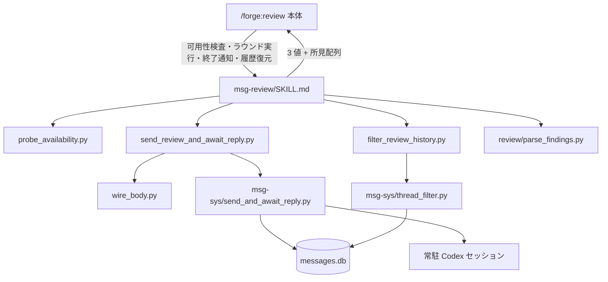
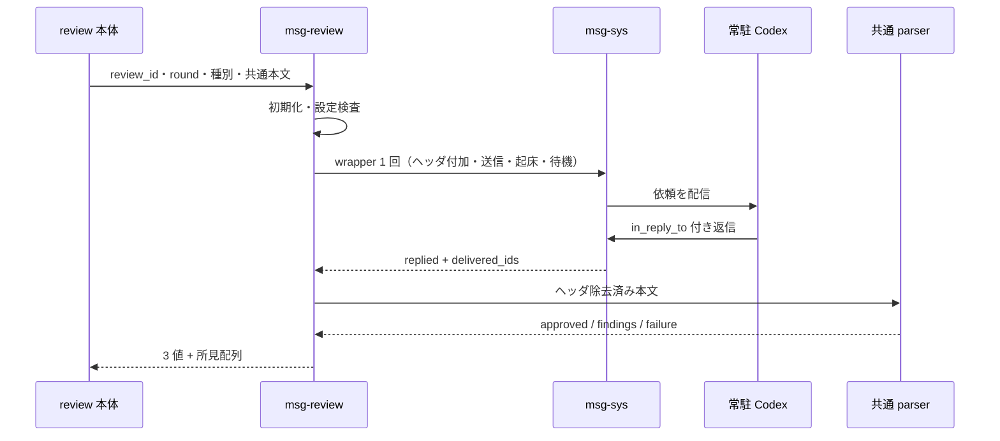

# DES-045 msg-review レビューバックエンド設計書

## メタデータ

| 項目     | 値                                                           |
| -------- | ------------------------------------------------------------ |
| 設計 ID  | DES-045                                                      |
| 関連要件 | REQ-012、REQ-013、msg-sys:REQ-006                            |
| 関連設計 | msg-sys:DES-034、forge:ADR-065、forge:ADR-066、forge:ADR-071 |
| 作成日   | 2026-07-18                                                   |

## 1. 概要

msg-review は `/forge:review` 本体から継承型 SKILL として起動され、常駐 Codex セッションとの
レビュー 1 ラウンドを同一ターン内で同期完結させるバックエンドである。

本バックエンドは前提検査、ワイヤヘッダ付加、送信、起床、返信待機、応答の共通 parser への引き渡し、
終了通知の受理を担う。対象解決、共通依頼本文の組み立て、所見評価、修正、完了判定、要約報告は
`/forge:review` 本体が担う。

msg-review は任意拡張として履歴復元を提供する。履歴復元は利用者または本体が `review_id` を明示した
場合だけ実行し、同期ラウンドの自動再開には使わない。

## 2. アーキテクチャ



### 2.1 動作モード

| モード       | 起動契機                                        | 出力                                           |
| ------------ | ----------------------------------------------- | ---------------------------------------------- |
| 可用性       | 本体が候補バックエンドを検査する                | 利用可否、不足している前提、警告               |
| ラウンド実行 | 本体がレビュー 1 ラウンドを要求する             | `approved` / `findings` / `failure` と所見配列 |
| 終了通知     | 本体が `review_id` を伴う終了通知を発行する     | なし                                           |
| 履歴復元     | 利用者または本体が `review_id` を明示して求める | `ok` の履歴、または `not_found` と理由         |

Stop フックで差し戻されたメッセージ本文は msg-review の起動契機にしない。ラウンド実行は
`send_review_and_await_reply.py` の待機結果だけで完結し、タイムアウト後の遅延返信を自動処理しない。

## 3. モジュール設計

### 3.1 モジュール一覧

| モジュール                                | 責務                                                      |
| ----------------------------------------- | --------------------------------------------------------- |
| `SKILL.md`                                | 4 モードの振り分けとスクリプト呼び出し                    |
| `scripts/probe_availability.py`           | 初期化後に起床、相手常駐、設定健全性を検査して集約        |
| `scripts/send_review_and_await_reply.py`  | ワイヤ本文を一時生成し、共通の送信・起床・待機 CLI へ委譲 |
| `scripts/wire_body.py`                    | ワイヤヘッダの付加、任意再掲ヘッダの検証と除去            |
| `scripts/filter_review_history.py`        | `review_id` の起点と `in_reply_to` 連鎖による履歴抽出     |
| `scripts/review/parse_findings.py`        | 全バックエンド共通の応答解釈、3 値判定、所見配列化        |
| `scripts/msg-sys/send_and_await_reply.py` | 送信、cmux 起床、返信待機、配信権取得を 1 回で実行        |
| `scripts/msg-sys/thread_filter.py`        | DB 履歴取得と汎用スレッド連鎖抽出                         |

パス表の `scripts/review/` と `scripts/msg-sys/` は `plugins/forge/` を起点とし、msg-review 固有の
`scripts/` は `plugins/forge/skills/msg-review/` を起点とする。

### 3.2 SKILL 入出力

本体から次の要求を受ける。

| 要求         | 入力                                          |
| ------------ | --------------------------------------------- |
| 可用性検査   | プロジェクトルート                            |
| ラウンド実行 | `review_id`、ラウンド番号、種別、共通依頼本文 |
| 終了通知     | `review_id`                                   |
| 履歴復元     | `review_id`                                   |

ラウンド実行の戻り値は `judgment`、`findings`、失敗時の `error` で構成する。`judgment` は
`approved` / `findings` / `failure` の 3 値である。

## 4. 可用性モード

### 4.1 CLI

```bash
python3 "${CLAUDE_SKILL_DIR}/scripts/probe_availability.py" \
  --project-root "$(git rev-parse --show-toplevel)"
```

`probe_availability.py` は、最初に `ensure_codex_hook.py` でバックエンド自身を初期化してから、
次の 3 軸を独立に検査する。

1. cmux 起床手段の可用性
2. 対象プロジェクトでの常駐 Codex プロセス
3. msg-sys 設定の健全性

検査は依頼送信と相手ターンの起床を行わない。各軸の判定は構造化出力を読み、終了コードだけで
`not_found`、`ambiguous`、`error` を同じ判定不能へ畳み込まない。

### 4.2 出力

```json
{
  "available": false,
  "missing": [
    { "axis": "peer", "detail": "...", "remedy": "..." }
  ],
  "warnings": []
}
```

`missing` は `wake` / `peer` / `setup` の軸ごとに不足を保持する。`available: true` と
`missing: []` は常に一致させる。

## 5. ラウンド実行モード

### 5.1 初期化と設定検査

送信前に `ensure_codex_hook.py` を冪等に実行し、続いて `check_setup.py` を実行する。

```bash
python3 "${CLAUDE_PLUGIN_ROOT}/scripts/msg-sys/ensure_codex_hook.py" \
  --project-root "$(git rev-parse --show-toplevel)" \
  --plugin-msg-sys-dir "${CLAUDE_PLUGIN_ROOT}/scripts/msg-sys"

python3 "${CLAUDE_PLUGIN_ROOT}/scripts/msg-sys/check_setup.py" \
  --project-root "$(git rev-parse --show-toplevel)"
```

設定検査が `status: "error"` の場合は送信せず、失敗項目と対処を含む `failure` を返す。

### 5.2 同期送信と待機 [MANDATORY]

返信を期待する送信は、必ず次の CLI を 1 回だけ起動する。

```bash
python3 "${CLAUDE_SKILL_DIR}/scripts/send_review_and_await_reply.py" claude codex \
  --review-type "<種別>" \
  --review-id "<review_id>" \
  --round "<ラウンド番号>" \
  --body-file "<共通依頼本文の一時ファイル>" \
  --header-regex '^\[msg-review\]\s+\S+\s+review_id=(\S+)\s+round=\d+\s*$' \
  --project-root "$(git rev-parse --show-toplevel)" \
  [--in-reply-to "<直前に受信した Codex メッセージ ID>"]
```

SKILL は共通依頼本文を Write ツールで一時ファイルへ保存し、CLI を `run_in_background: true` で
1 回起動して Monitor で待機する。`wire_body.py`、共通 `send_and_await_reply.py`、`send.py` を
送信側から個別に呼ばない。

wrapper は次を順に行う。

1. 共通本文に正規ワイヤヘッダが含まれないことを検証する
2. ワイヤヘッダを 1 回付加した一時本文を生成する
3. 共通 `send_and_await_reply.py` へ委譲する
4. 委譲完了または失敗後にワイヤ本文を削除する

共通 CLI は送信、cmux 起床、返信待機を行う。送信失敗時は起床と待機へ進まない。起床結果が
`skipped` または `failed` でも待機は継続する。

### 5.3 スレッド連鎖と配信権

初回依頼以外の送信では `--in-reply-to` を必須とし、直前にこのラウンドが配信権を得た Codex
メッセージ ID を渡す。

待機結果が `replied` の場合、処理対象は `messages` 全体から選ばず、`delivered_ids` に含まれる
メッセージだけから選ぶ。`delivered_ids` は `inbox.py --ack` に成功し、この呼び出しが配信権を
取得した返信を表す。これにより Stop フック等の別経路との二重処理を防ぐ。

### 5.4 ワイヤヘッダ

送信本文の先頭行は次の形式とする。

```text
[msg-review] <種別> review_id=<review_id> round=<n>
```

返信は `in_reply_to` でスレッドへ結び付くため、レビュアーによるヘッダ再掲は任意である。
受信本文の先頭にヘッダがある場合は `wire_body.py --mode strip` で現在の種別、`review_id`、
ラウンド番号との一致を検証して除去する。ヘッダが無ければ本文をそのまま共通 parser へ渡す。

```bash
python3 "${CLAUDE_SKILL_DIR}/scripts/wire_body.py" \
  --mode strip \
  --pattern "<種別>" \
  --review-id "<review_id>" \
  --round "<ラウンド番号>" \
  --body-file "<受信本文>" \
  --output-file "<純粋応答>"
```

不正な `[msg-review]` 先頭行、または現在値と一致しないヘッダは `failure` とする。

### 5.5 応答解釈

ヘッダ除去後の本文を共通 parser へ渡す。

```bash
python3 "${CLAUDE_PLUGIN_ROOT}/scripts/review/parse_findings.py" \
  --body-file "<純粋応答>"
```

共通 parser は次を満たす応答だけを受理する。

- コードブロック外の完了宣言行が厳密に 1 行だけ存在する
- 完了宣言行が応答の最終有効行である
- 宣言は `REVIEW_RESULT: approved` または `REVIEW_RESULT: findings` である
- `findings` 宣言には重大度マーカー付きの所見が 1 件以上ある
- 各所見は `critical` / `major` / `minor` の重大度を持つ
- 各所見は `path` + `line` または `unknown: true` の位置を持つ
- `approved` 宣言と所見が同時に存在しない

違反時は所見を推測で補完せず `failure` を返す。`severity: unclassified` は生成しない。

### 5.6 タイムアウト

`send_review_and_await_reply.py` の最終結果が `status: "timeout"` の場合は、確定した `failure` を
返してラウンドを終了する。

失敗理由には次を含める。

- 経過時間と `review_id`
- `last_observed_request_read_by_agent_b` に基づく最後の観測時点の既読状態
- `wake.status == "failed"` の場合は起床失敗理由

タイムアウト後に届いた遅延返信は msg-sys の DB に残るが、Stop フックで自動処理せず、
msg-review を自動再開しない。確認は明示的な履歴復元モードに限る。

## 6. 終了通知モード

本体から `review_id` とともに終了通知を受けた場合は受理して終了する。msg-review はレビューを
またいで解放を要する資源を持たず、履歴は msg-sys の DB に監査記録として残る。同じ
`review_id` に対する複数通知も冪等に受理する。

## 7. 履歴復元モード

### 7.1 CLI

```bash
python3 "${CLAUDE_SKILL_DIR}/scripts/filter_review_history.py" \
  claude codex "<review_id>" \
  --project-root "$(git rev-parse --show-toplevel)" \
  [--db-path "<messages.db>"]
```

履歴復元は利用者または本体が `review_id` を明示した場合だけ行う。ラウンド実行の自動継続、
タイムアウトからの自動復帰、往復上限到達時の自動要約には使わない。

### 7.2 抽出規則

`filter_review_history.py` は `thread_filter.py` に履歴取得とスレッド抽出を委譲する。

1. body 先頭の正規ワイヤヘッダから対象 `review_id` の root を特定する
2. `in_reply_to` が抽出済みメッセージを指すメッセージを fixed-point で追加する
3. 送信順に並べる
4. reviewer 発の完了宣言から `resolved` を算出する

返信ヘッダが省略されても `in_reply_to` の連鎖で履歴に含める。既存 DB 履歴を書き換えず、
独自の永続状態を持たない。

### 7.3 出力

履歴が存在する場合:

```json
{
  "status": "ok",
  "review_id": "<review_id>",
  "messages": [],
  "round": 3,
  "resolved": false
}
```

履歴が存在しない場合:

```json
{
  "status": "not_found",
  "review_id": "<review_id>",
  "reason": "..."
}
```

`not_found` を `messages: []`、`round: 0`、`resolved: false` の成功履歴へ畳み込まない。

## 8. ユースケース

### 8.1 一覧

| ユースケース          | 結果                                      |
| --------------------- | ----------------------------------------- |
| UC-1 可用性検査       | 利用可否と不足軸を返す                    |
| UC-2 承認返信         | `approved` と空の所見配列を本体へ返す     |
| UC-3 所見返信         | `findings` と所見配列を本体へ返す         |
| UC-4 前提・送信失敗   | 理由を伴う `failure` を返す               |
| UC-5 タイムアウト     | 確定した `failure` を返し、自動再開しない |
| UC-6 終了通知         | 冪等に受理する                            |
| UC-7 明示的な履歴復元 | `ok` の履歴、または `not_found` を返す    |

### 8.2 ラウンド実行シーケンス



本体が `findings` を受け取った後の評価、修正、次ラウンド要求は本体側の別処理である。

## 9. エラーフロー

| 異常系                            | 挙動                                             |
| --------------------------------- | ------------------------------------------------ |
| 初期化または設定検査の不成立      | 送信せず `failure`                               |
| 送信失敗                          | 起床・待機へ進まず `failure`                     |
| 起床見送り・失敗                  | 結果を保持して待機を継続                         |
| 待機タイムアウト                  | 診断情報付き `failure`、遅延返信を自動処理しない |
| ワイヤヘッダ不正                  | `failure`                                        |
| 完了宣言の欠落・複数・最終行違反  | 共通 parser の `failure`                         |
| `findings` 所見の重大度・位置欠落 | 共通 parser の `failure`                         |
| 履歴対象なし                      | `status: "not_found"` と理由                     |
| 重複終了通知                      | 冪等に受理                                       |

## 10. テスト設計

- `test_probe_availability.py`
  - 初期化が各検査より先に実行される
  - 起床、相手常駐、設定の不足が独立して返る
  - 検査中に送信や起床を行わない
- `test_send_review_and_await_reply.py`
  - ワイヤヘッダを 1 回だけ付加する
  - 共通送信 CLI へ 1 回だけ委譲する
  - `in_reply_to` と project root をそのまま渡す
  - 成否にかかわらず一時ワイヤ本文を削除する
- `test_wire_body.py`
  - ヘッダ無し返信を受理する
  - 正しい任意再掲ヘッダを除去する
  - 不正または不一致ヘッダを拒否する
- `test_filter_review_history.py`
  - 複数 `review_id` を分離する
  - ヘッダ無し返信を `in_reply_to` 連鎖で含める
  - 成功時に `status: "ok"` を返す
  - 対象なしを `status: "not_found"` として区別する
- `test_parse_findings.py`
  - 完了宣言行が最終有効行かつ一意である
  - 重大度欠落を `failure` とする
  - 位置欠落を `failure` とする
  - `approved` と所見の矛盾を `failure` とする

手動統合テストでは、既存 DB 履歴、ワイヤヘッダ送信、`in_reply_to` スレッド連鎖、
返信でのヘッダ任意再掲、同期タイムアウト後に自動再開しないことを確認する。
