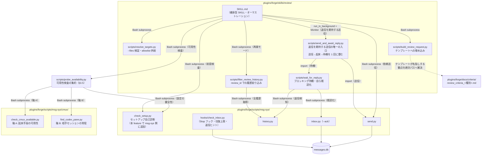
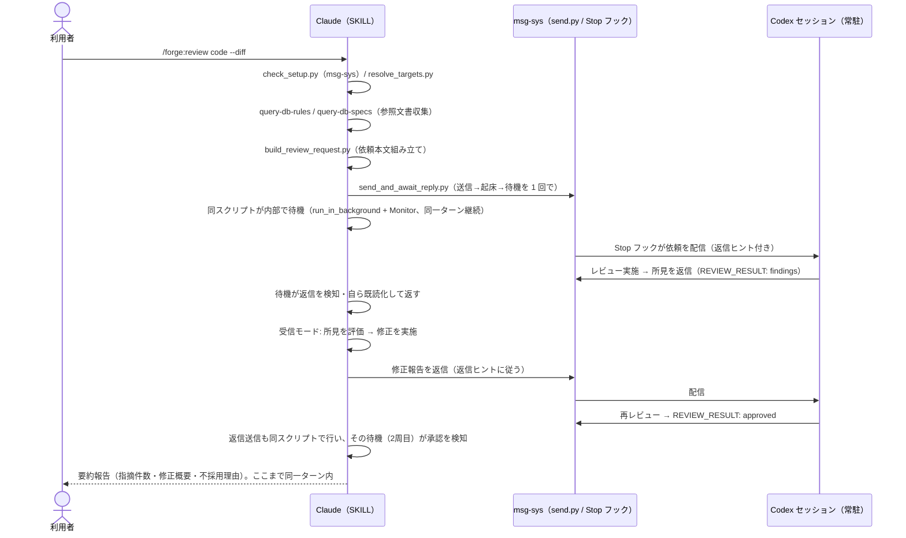

# DES-045 msg-review レビューバックエンド設計書

> **本文書のスコープ（2026-08-03 改訂）[MANDATORY]**
>
> forge:ADR-066 により `/forge:review` 本体とレビューバックエンドが別 SKILL へ分離された。本文書が定めるのは **msg-review バックエンド**（`plugins/forge/skills/msg-review/`）——前提検査・msg-sys 経由の往復・応答の判定と所見配列化・往復履歴の復元・終了通知の受理——のみである。
>
> 引数解釈・対象解決・依頼本文の組み立て・所見の評価と修正・終端処理は本体の責務であり、forge:DES-066 が定める。本文書に残る本体側の記述は、分離前の経緯として読む。

## メタデータ

| 項目     | 値                                                                       |
| -------- | ------------------------------------------------------------------------ |
| 設計ID   | DES-045                                                                  |
| 関連要件 | REQ-012（FNC-001〜FNC-008 / BL-001 / NFR-001〜NFR-003）、msg-sys:REQ-006 |
| 関連設計 | msg-sys:DES-034（通信基盤。本設計はその利用者）、ADR-068、forge:ADR-067  |
| 作成日   | 2026-07-18                                                               |

## 1. 概要

msg-sys 通信基盤（msg-sys:DES-034）の上で、常駐 Codex セッションとの継続対話レビューを駆動する継承型 SKILL を設計する（実装は `/forge:review`）。SKILL は「依頼の組み立てと送信」「受信した所見の評価・修正・再依頼」「完了判定と要約報告」のオーケストレーションを担い、メッセージの配信・返信ヒント・往復上限は msg-sys に委ねる（msg-sys 実装は変更しない。REQ-012 NFR-001）。

決定論的な処理のうち、対象ファイル列挙・依頼メッセージ組み立ては本 SKILL 配下の Python スクリプトに切り出す。前提検査は検査対象がすべて msg-sys 自身の設定であるため、msg-sys 側の自己診断 CLI `check_setup.py`（本 feature に伴う msg-sys 側改訂として追加。§3.5）に委ね、本 SKILL はその利用者となる。AI は判断（引数解釈・所見の評価・修正・完了判定）のみを担う。

## 2. アーキテクチャ概要



### 2.1 ターン跨ぎのライフサイクル [MANDATORY]

本 SKILL の実行は単一ターンで完結することを基本とする（REQ-012 FNC-006「呼び出し元から見た完了挙動の互換性」）。依頼モードは §3.9 の複合スクリプト（送信 → push型起床 → 待機）でその場でブロッキング待機し、Codex の返信（承認 or 所見）を得てから同一ターン内で完了まで進む。**受信モードで返信を送る場合も同じ複合スクリプトを使い、待機結果に従って同一ターン内で次のラウンドへ進む**（返信を送ってターンを終えると往復が静かに停止する。§3.9）。待機予算（10分）内に返信が得られない場合のみ、明確なタイムアウト失敗として報告してターンを終える（フォールバックしない。`docs/rules/implementation_guidelines.md`「フォールバックを反射的に書かない」）。

これとは別に、往復の一部が Stop フック（msg-sys:DES-034 §4）を介して複数ターンに跨がるケース（利用者が依頼モードのターンとは別の機会に返信を確認する場合、または往復上限到達後の人間介在）に備え、SKILL は 3 つの動作モードを持つ。

| モード         | 起動契機                                                                                                                                                                                  | 責務                                                                                                                                                                           |
| -------------- | ----------------------------------------------------------------------------------------------------------------------------------------------------------------------------------------- | ------------------------------------------------------------------------------------------------------------------------------------------------------------------------------ |
| **可用性検査** | 本体がラウンド実行より前に、候補バックエンドとして本サブシステムを検査するために起動する（forge:REQ-013 FNC-1318 の解決順）                                                               | §3.5 の集約スクリプトを 1 回呼び、利用可能かと不足している前提を返す。**依頼を送らず、レビュアーのターンも起こさない**（REQ-012 FNC-003）                                      |
| **依頼モード** | 利用者による `/forge:review <種別> ...` の明示起動                                                                                                                                        | 前提検査 → 対象解決 → 依頼組み立て → §3.9 の複合スクリプト（送信 → 起床 → 待機）→ 成功時は同一ターン内で受信モードへ合流、タイムアウト時は確定した失敗を報告してターンを終える |
| **受信モード** | 依頼モードの待機が成功した場合の同一ターン内の合流、または（待機予算超過後に）Claude 側 Stop フックが差し戻した配信メッセージの本文に msg-review プロトコルヘッダ（§3.4）が含まれるターン | 所見の評価 → 修正 → 返信（再依頼）、または完了判定 → 要約報告                                                                                                                  |
| **再開モード** | 往復上限到達（UC-4）の OS 通知を受けた利用者が、状況確認・再開を明示指示したターン                                                                                                        | `filter_review_history.py`（§3.6）で対象レビューの往復履歴のみを取得し、未解決所見を集計して要約報告し、人間の判断を仰ぐ                                                       |

受信モードの成立根拠: 依頼メッセージ・返信メッセージの本文には常に §3.4 のプロトコルヘッダを含める。依頼モードの待機成功時は同一ターン内でそのまま合流するため起動契機の問題は生じない。待機予算超過後に Stop フック経由で受信する場合は、Claude 側の会話には依頼モード実行時の文脈（本 SKILL の手順）が残っており、さらに SKILL.md の `description` にヘッダ文字列をトリガー句として記載することで、文脈が失われたターン（セッション再開等）でも AI が SKILL.md の受信モード手順を再読して復帰できる。

再開モードの成立根拠: msg-sys は上限到達時に対象メッセージを配信しないため、受信モードのプロトコルヘッダによる起動契機を持たない。代わりに、上限到達を告げる OS 通知を受けた利用者が状況確認・再開を明示指示すること自体を起動契機とし、SKILL.md の `description`（§3.2）にこの契機をトリガー句として記載することで、AI が再開モード手順を再読して未解決所見の要約報告に着手できる。

## 3. モジュール設計

### 3.1 モジュール一覧

| モジュール名                       | 責務                                                                                                                                                                                                                                                            | 依存                                                                                             |
| ---------------------------------- | --------------------------------------------------------------------------------------------------------------------------------------------------------------------------------------------------------------------------------------------------------------- | ------------------------------------------------------------------------------------------------ |
| `SKILL.md`                         | 前提検査・送信と待機・応答の判定と所見配列化・往復履歴の復元・終了通知の受理のオーケストレーション（本体から `Skill` ツールで起動される）                                                                                                                       | 下記スクリプト、msg-sys CLI（Bash subprocess 経由）                                              |
| `scripts/filter_review_history.py` | `history.py` の全履歴を取得し、本文（`body`）先頭の `review_id=<X>` を抽出して指定した `review_id` に一致するメッセージのみへ絞り込み、往復回数・`REVIEW_RESULT` 到達有無を添えて JSON で返す（§3.6）。決定論的な列挙・抽出処理であり AI の手動パースに委ねない | 標準ライブラリのみ（`history.py` を subprocess で呼ぶ）                                          |
| `scripts/wait_for_reply.py`        | Codex からの返信をブロッキング待機する（§3.7）。指数バックオフでポーリングし、返信検知時は自ら既読化（`ack`）してから返す                                                                                                                                       | 標準ライブラリのみ（`history.py`/`inbox.py` を subprocess で呼ぶ）                               |
| `scripts/send_and_await_reply.py`  | **返信を期待する送信の唯一の入口（§3.9）**。送信 → push型起床（§3.8）→ 待機（§3.7）を 1 回の呼び出しに畳む。3 手順が揃わないと往復が止まるため、個別呼び出しの経路を持たせない                                                                                  | 標準ライブラリのみ（`mailbox`/`wait_for_reply` を import、`wake_codex.sh` を subprocess で呼ぶ） |
| `scripts/probe_availability.py`    | **可用性検査の集約（§3.5）**。軸 A・軸 B・設定の健全性をそれぞれの判定スクリプトへ委ね、結果を契約の形（利用可否 + 不足の個別列挙）へまとめて返す。判定そのものは持たない                                                                                       | 標準ライブラリのみ（下記 2 スクリプトと `check_setup.py` を subprocess で呼ぶ）                  |

可用性検査の**判定**は軸ごとに独立したスクリプトが担う（REQ-012 FNC-003「判定を軸ごとに独立させること」・ADR-068 §2.1）。いずれも cmux 前提の部品であり、msg-sys 本体が cmux 非依存で単独動作することと区別するため `plugins/forge/scripts/msg-sys/cmux/` に配置する（§3.8 の配置規則と同一）。

| 判定スクリプト                                               | 軸                      | 責務                                                                                                                                                                                                     |
| ------------------------------------------------------------ | ----------------------- | -------------------------------------------------------------------------------------------------------------------------------------------------------------------------------------------------------- |
| `plugins/forge/scripts/msg-sys/cmux/check_cmux_available.py` | A: 起床手段の可用性     | `cmux` コマンドが実行可能かを判定する。read-only・副作用なし                                                                                                                                             |
| `plugins/forge/scripts/msg-sys/cmux/find_codex_pane.py`      | B: 相手セッションの常駐 | プロジェクトルートの作業ディレクトリと一致する workspace の中で、**稼働中の Codex プロセスがアタッチされた surface** を発見する（§3.8 で既存。可用性検査はこれを**再利用する**。同型の別実装を作らない） |

設定の健全性検査は本 SKILL 配下に置かず、msg-sys 側の自己診断 CLI `check_setup.py` を利用する（§3.5）。スクリプトはいずれも `plugins/` 配下の Python のためテスト必須（§7）。SKILL.md にロジックをインライン記述しない（`docs/rules/implementation_guidelines.md`）。

### 3.2 SKILL 定義と CLI 引数仕様

本バックエンドの配置は `plugins/forge/skills/msg-review/` であり、backend 名 `msg-review` と一致する（本体は backend 名を同名の SKILL `forge:<name>` へ解決するため。forge:DES-066 §2.1）。`user-invocable: false` とし、利用者が直接起動せず本体からの `Skill` ツール起動のみを受ける。

ワイヤプロトコルの識別子 `[msg-review]` は、スキル名ではなく msg-sys の DB に永続化された通信路上の識別子であるため据え置く（§3.4）。

- `allowed-tools`: `Read` / `Write` / `Bash` に加え、`Monitor` を含める（§3.9 の複合スクリプトを `run_in_background: true` で起動し監視するため。待機予算 10 分は Bash tool のフォアグラウンド上限と同値であり前景実行を前提にできない）
- `description` に依頼モードのトリガー句・受信モードのプロトコルヘッダ文字列・再開モードの起動契機（往復上限到達の OS 通知後に利用者が状況確認・再開を指示するターン、§2.1）を記載する

**引数の軸（種別・対象軸・介入軸）は本設計書では定めない。** レビューポリシー側の要件（forge:REQ-013）が SoT であり、本設計書がそれを再定義すると二重管理になる。本設計書が定めるのは msg-sys 通信路上の振る舞い（§3.4〜§3.8）のみである。

- 引数解釈は AI が直接行う（自然言語混在を許容するため。`docs/rules/implementation_guidelines.md`「AI が解釈すべき入力にスクリプトパーサーを使わない」）
- **非対応軸の警告付き続行**: 本サブシステムが持たない軸（エンジン軸等）のフラグを検出した場合、無視して続行する旨を警告したうえで既定動作で続行する。黙殺はしない。エラー終了にしない理由: `/forge:review` を発行する既存の呼び出し元が当該フラグ付きで起動するため、エラー終了にすると差し替えが成立しない
- **警告の表示箇所を定型出力に固定する [MANDATORY]**: 警告は自由記述の注意書きではなく、依頼モードが送信前に必ず出力する「引数解釈結果」の定型表示の必須欄「無視したフラグ」として表示する。無視したフラグが無い場合も「なし」と明示する（欄自体を省略しない）。毎回出力される定型表示の一部に組み込むことで、AI の指示読み飛ばしによる警告の欠落を防ぐ

### 3.3 対象の解決と allowlist の供給（本体へ移管済み）

対象の解決（`resolve_targets.py`）と base ブランチ候補の列挙（`analyze_branch_point.py`）、および修正フェーズの allowlist の供給は、**forge:ADR-066 の分離により本体の責務となった**（forge:DES-066 §3.1）。本バックエンドはこれらを持たず、対象について何も知らない——本体が組み立てた依頼本文をそのまま運ぶだけである。

レビュー範囲としてレビュアーへ何を渡すか（範囲指定をファイル一覧へ展開しない規定を含む）も同様に本体側（forge:REQ-013 FNC-1312）が定める。

### 3.4 メッセージプロトコル（REQ-012 FNC-002、TBD-002 / TBD-003 の解決）

Claude→Codex・Codex→Claude の全メッセージ本文の先頭に、次のプロトコルヘッダを置く:

```
[msg-review] <種別> review_id=<review_id> round=<n>
```

`round` は依頼側が数える表示上の通し番号であり、往復上限の判定には使わない（上限判定は msg-sys の `chain_length` が唯一の実装。BL-001 の重複状態を持たない原則）。

**`review_id`（レビュー識別子） [MANDATORY]**: `history.py` は Claude/Codex 間の全メッセージを返すのみで、`in_reply_to` を含まず、レビュー単位の絞り込み手段を持たない（msg-sys 側は変更しない、NFR-001）。同一種別の複数レビューが時間的に離れて発生した場合、再開モード（§2.1）や UC-4 の未解決所見集計が別レビューのメッセージを取り違える恐れがある。これを防ぐため、`build_review_request.py` が初回依頼の組み立て時に `review_id`（衝突を無視できる程度に十分ランダムな不透明トークン。例: `uuid.uuid4().hex`）を生成し、ヘッダに埋め込む。

- `review_id` は msg-sys のメッセージ ID（`send.py` が返す `id`）とは**別物**であり、msg-sys 側の永続列を新設しない。メッセージ本文（`body`）というメッセージ本体に埋め込まれた文字列に過ぎず、msg-sys の追記専用ストレージにそのまま保存される（BL-001 の「独自の永続記録を持たない」原則と両立する。新しい保存先を作らず、既存の `body` フィールドの中身として運ばれるだけである）
- Codex からの所見返信・Claude からの修正報告（再依頼）のいずれも、受信したヘッダの `review_id` を**そのまま転記**して返信する。新しい値を生成しない
- 再開モード・UC-4 の未解決所見集計では、`history.py claude codex` の全履歴を取得したうえで、各メッセージの `body` 先頭から `review_id=<X>` を抽出し、未解決（`REVIEW_RESULT: approved` 未達）の中で最新の `review_id` を持つメッセージ群のみに絞って集計する。他の `review_id` を持つメッセージは対象外とする

**初回依頼メッセージ**（`build_review_request.py` が組み立てる）は以下のセクションで構成する:

1. **プロトコルヘッダ + 依頼概要**: レビュー種別、レビュー専念の指示（**Codex はレビューのみを行い、対象ファイルを変更しない**ことを明記する）
2. **レビュー対象**: 対象ファイル一覧（プロジェクトルート相対パス）。対象軸が diff / branch の場合は差分取得コマンド（`git diff ...`）も併記する
3. **参照文書**: レビュー観点として `review_criteria_<種別>.md` の**実行時解決済み絶対パス**、および対象に関連するプロジェクトルール・仕様書のパス（依頼モードで AI が `/forge:query-db-rules` / `/forge:query-db-specs` により収集し、スクリプトへ引数で渡す）
4. **返信形式契約**: 下記の所見形式と完了宣言行

**所見の返信形式**（Codex に依頼する形式。TBD-003 の解決）:

- 自由記述 markdown + 重大度マーカー（`🔴 critical` / `🟡 major` / `🟢 minor`）+ `ファイルパス:行` の位置情報
- 返信の最終行に完了宣言行を必ず 1 行置く: `REVIEW_RESULT: approved`（指摘なし・承認）または `REVIEW_RESULT: findings`（指摘あり）
- 完了宣言行は受信モードの完了判定（§4 UC-3）で機械的に照合できる唯一の契約とし、それ以外の本文は自由記述として Codex の出力揺れを許容する

**修正報告（再依頼）メッセージ**は AI が受信モードで作成する（判断を含むためスクリプト化しない）。プロトコルヘッダに続けて、所見ごとの対応表（`対応した / 対応しない（理由）`）と再レビュー依頼を記述し、msg-sys の返信ヒント（一時ファイル + stdin リダイレクト、シェル経由の本文書き出し禁止）に**そのまま従って**送信する。

**所見評価の判断基準 [MANDATORY]**: 受信モードで Claude が所見の妥当性・要修正判断を行う際は、依頼時に Codex へ渡したものと同じ `review_criteria_<種別>.md`（および同文書が委譲する principles の重大度カタログ・グレーゾーン許容範囲）を Read して基準とする。依頼側と受信側で判断基準を揃えることで、Codex の指摘を Claude が別基準で棄却する恣意性を防ぐ。

### 3.5 前提検査（REQ-012 FNC-003）

前提検査は 2 つの契機を持つ（REQ-012 FNC-003）。**設定の健全性検査**（§3.5.1）はラウンド実行の前に本サブシステム自身が行い、**可用性検査**（§3.5.2）は本体がラウンド実行より前の候補選定として要求する。前者は「送信できるか」を、後者は「そもそもこのバックエンドが使えるか」を判定する。

#### 3.5.1 設定の健全性検査（msg-sys 側自己診断 CLI `check_setup.py` の利用）

検査対象は下表のとおり**すべて msg-sys 自身の設定・健全性**であり、レビュー固有の検査を含まない。責務分割規範（資産は、それを責務として使い保守するコンポーネントの配下に置く）に従い、検査 CLI は本 SKILL 配下ではなく **msg-sys 側の自己診断 CLI `check_setup.py`**（`plugins/forge/scripts/msg-sys/check_setup.py`）として追加する（本 feature に伴う msg-sys 側改訂。msg-sys:DES-034 §3.1 / §9 に反映済み）。`lib/mailbox.py` の DB パス導出をそのまま共有するため、導出規則を msg-review 側で再実装して将来ずれるリスクが構造的に生じない。本 SKILL は Bash subprocess でこれを呼ぶ利用者である。

```
python3 plugins/forge/scripts/msg-sys/check_setup.py [--project-root <path>]
```

出力（標準出力に単一 JSON）: `{"status": "ok|error", "checks": [{"name", "ok", "detail"}], "warnings": [...]}`

| 検査項目                                                                                              | 不成立時                     |
| ----------------------------------------------------------------------------------------------------- | ---------------------------- |
| git リポジトリルートの解決（`git rev-parse --show-toplevel`）                                         | error（依頼送信しない）      |
| DB パスの導出可能性（msg-sys:DES-034 §7 と同じ導出規則）                                              | error                        |
| forge プラグイン同梱の `hooks/hooks.json` への `check_inbox.py` 登録（`FORGE_MSG_AGENT_NAME=claude`） | error                        |
| `.codex/hooks.json` の存在と `check_inbox.py` 登録（`FORGE_MSG_AGENT_NAME=codex`）                    | error                        |
| 両登録エントリの `FORGE_MSG_MAX_ROUND_TRIPS` 設定有無（未設定は自動往復が一切発生しない）             | error                        |
| **検査不能項目**: Codex 側 trust 登録（`/hooks`）の完了有無                                           | warnings に明示（fail-open） |

Claude 側の登録先はプロジェクト固有の `.claude/settings.json` ではなく**プラグイン同梱の `hooks/hooks.json`** である（Claude Code のプラグイン hooks 自動登録機構により、プラグイン導入だけで有効化されるため）。

trust 登録を warnings として利用者に提示する理由: これはプロセス外のローカル手続きであり機械検査の手段がない（msg-sys:DES-034 §6）。依頼は送信できるが返信が来ない可能性があることを、送信前に利用者へ知らせる。

**相手セッションの常駐は検査不能項目ではない**（ADR-068 §1）。稼働中の Codex プロセスを直接確認する手段が既に存在する（§3.8 の `find_codex_pane.py`）ため、§3.5.2 の可用性検査で確実に判定する。かつて `check_setup.py` が常駐を検査不能項目として警告に挙げていたが、これは事実に反しており、**REQ-012 NFR-001 の改訂経路（ユーザー承認、2026-08-04 取得）を経て当該警告を削除した**。

常駐が msg-sys 側の関心から外れる理由: msg-sys は通信路であり、それを使う個々の応用が何を前提とするかを知らない（cmux 上に常駐する相手という概念自体が msg-sys の関心ではない）。常駐を必要とするのは往復の即時性を求める応用側であり、判定もその側に置く。

#### 3.5.2 可用性検査（`probe_availability.py`、ADR-068）

本体からの可用性検査要求に対し、本サブシステムが利用可能かと**不足している前提を個別に**返す。判定は軸ごとに独立したスクリプトへ委ね、集約スクリプトは判定そのものを持たない（§3.1）。

```
python3 plugins/forge/skills/msg-review/scripts/probe_availability.py [--project-root <path>]
```

集約の手順:

1. 軸 A（起床手段の可用性）を `check_cmux_available.py` で判定する
2. 軸 B（相手セッションの常駐）を `find_codex_pane.py` で判定する。`found` のみを常駐とみなし、`not_found` / `ambiguous` / `error` はいずれも常駐を確認できなかったものとして扱う（`ambiguous` と `error` は理由を区別して返す。「複数候補があって決められない」と「cmux への問い合わせ自体が失敗した」は利用者の対処が異なる）
3. 設定の健全性（§3.5.1）を `check_setup.py` で判定する
4. 3 者の結果を集約する。**いずれかが不成立なら利用不可**とし、不足を個別に列挙して返す

出力（標準出力に単一 JSON）:

```json
{
  "available": false,
  "missing": [
    { "axis": "wake", "detail": "...", "remedy": "..." },
    { "axis": "peer", "detail": "...", "remedy": "..." }
  ],
  "warnings": ["..."]
}
```

`missing` の各要素は不足 1 件に対応し、`axis` で軸を、`remedy` で利用者が取れる対処を示す。**空の `missing` と `available: true` は同義であり、両者が食い違う出力を作らない。**

設計上の制約:

- **副作用を持たないこと [MANDATORY]**: 3 つの判定はいずれも read-only である。依頼を送らず、`cmux send` / `send-key` によるテキスト注入も行わない（§3.8 の push 型起床とは別の経路であり、起床は一切起こさない）。本体は複数候補を順に検査するため、検査自体が相手の状態を変えてはならない
- **画面内容からの推測を判定に使わないこと [MANDATORY]**: 軸 B は稼働中の Codex プロセスを直接確認する（§3.1 の判定スクリプト表）。画面表示から応答可能性を推測する判定は、これに材料を追加しない。推測を根拠に利用不可を返すと、実際には応答できたレビュアーの機会を奪う（ADR-068 §2.1 / §2.2）
- **軸 A と軸 B の判定を一体化しないこと [MANDATORY]**: 現時点では往復の成立に両方が必要だが、判定は独立させる。将来 A を必要としない起床経路が成立した場合、集約側の条件のみを変えれば足り、判定ロジックを解体せずに済む（REQ-012 FNC-007）
- **代替手段へ倒さないこと**: 利用不可は確定した結果として本体へ返す。本サブシステム内で別の起床経路や別のレビュー手段を選ばない（REQ-012 FNC-008 / forge:ADR-060）

### 3.6 履歴の review_id 絞り込み（`filter_review_history.py`、BL-001 / FNC-005）

`history.py` は Claude/Codex 間の全メッセージを返すのみでレビュー単位の絞り込み手段を持たない（§3.4「`review_id`」参照）。再開モードでの未解決所見集計・要約報告のために、全履歴から対象 `review_id` のメッセージのみを抽出する処理を独立スクリプトとして切り出す（決定論的な列挙・抽出であり、SKILL.md 内で AI に手動パースさせない。`docs/rules/implementation_guidelines.md`「決定論的な定型処理は script 化する」）。

```
python3 plugins/forge/skills/msg-review/scripts/filter_review_history.py <agent_a> <agent_b> <review_id> [--db-path <path>]
```

処理内容:

1. `history.py <agent_a> <agent_b> [--db-path <path>]` を Bash subprocess として呼び、全履歴 JSON を取得する
2. 各メッセージの `body` 先頭行から `review_id=<X>` をパースする（正規表現でヘッダ行のみを対象とし、本文中の別箇所に偶然同じ文字列が出現しても誤検出しない）
3. 指定した `review_id` に一致するメッセージのみを送信順（`sent_at` 昇順）で抽出する
4. 抽出結果から `round`（該当メッセージ件数）と `resolved` を算出する。`resolved` は単純な部分文字列一致ではなく、**`agent_b`（レビュー実施者）発のメッセージのみ**を対象に、前後の空白を除去した上で行全体が正確に `REVIEW_RESULT: approved` または `REVIEW_RESULT: findings` に一致する行を完了宣言行の候補とし、複数あれば最後に出現したものを採用する（受信モード Step 1 と同じ判定規則）。依頼メッセージ自身が返信形式の説明として `REVIEW_RESULT: approved` という文字列を含むため、対象を `agent_b` 発に限定し、かつ部分一致ではなく行全体一致にしないと、Codex が一度も返信していない時点で `resolved: true` と誤判定する（実 Codex レビュー review_id=043e2823... で発見）

出力（標準出力に単一 JSON）:

```json
{
  "review_id": "<X>",
  "messages": [
    {
      "id": "...",
      "sender": "...",
      "recipient": "...",
      "body": "...",
      "sent_at": 0.0
    }
  ],
  "round": 3,
  "resolved": false
}
```

一致するメッセージが 0 件の場合は `messages: []`・`round: 0`・`resolved: false` を返す（エラーにしない。指定 `review_id` が誤りである可能性を SKILL 側の判断に委ねる）。

### 3.7 依頼直後のブロッキング待機（`wait_for_reply.py`、REQ-012 FNC-006）

`/forge:review` の codex エンジン呼び出し（`codex exec` サブプロセス）は Bash subprocess の終了を待つことで同期的に見える。本 SKILL を rename で差し替えても同じ完了挙動を呼び出し元に提供するため、送信の直後にこのスクリプトでブロッキング待機し、同一ターン内で Codex の返信（承認 or 所見）を得てから完了へ進む。**依頼送信に限らず、受信モードで返信を送る場合も同様に待機する**（§3.9。SKILL.md はこのスクリプトを直接呼ばず、§3.9 の複合スクリプト経由で使う）。

Claude 側の Stop フック（`check_inbox.py`）は Stop イベント 1 回につき受信箱を 1 度だけ確認して即座に返す機構であり、待機（リトライ・sleep）は行わない。依頼送信後の Stop 試行時点でまだ Codex が返信していなければ、次に Stop フックが確認するのは利用者が次にターンを起こす時点であり、同一ターン内での完了を保証しない。このスクリプトは Stop フックに頼らず、送信直後から `history.py` 相当の read-only な問い合わせを直接繰り返すことで、この空白を埋める。

**プロトコル非依存化（改訂）**: 本スクリプトは msg-review 専用実装から `plugins/forge/scripts/msg-sys/wait_for_reply.py`（msg-sys 共有・プロトコル非依存）へ汎用化された（talk-to-codex 等、他のプロトコルからも同じブロッキング待機エンジンを再利用するため）。スレッド識別は positional な `review_id` ではなく、呼び出し側が渡す `--header-regex`（body 先頭行から thread_id を capture group 1 で取り出す正規表現）と `--thread-id` の組で行う。

```
python3 plugins/forge/scripts/msg-sys/wait_for_reply.py <agent_a> <agent_b> \
    --header-regex '^\[msg-review\]\s+\S+\s+review_id=(\S+)\s+round=\d+\s*$' --thread-id <review_id> \
    [--max-seconds 600] [--progress-interval 10] [--db-path <path>]
```

処理内容:

1. `plugins/forge/scripts/msg-sys/thread_filter.py`（msg-review の `filter_review_history.py` が委譲する汎用スレッド判定ロジックと同一実装）で、`--thread-id` に一致するメッセージを問い合わせる
2. **停止条件**: `resolved`（`REVIEW_RESULT: approved`）ではなく、**依頼送信後に `sender: <agent_b>` のメッセージが1件でも増えたこと**を停止条件とする。`approved` だけでなく `findings` の返信でも、この時点で待機を終え、後続の完了判定・所見評価に進める必要があるため
3. **ポーリング間隔**: 応答検知の速さを優先し、指数バックオフで増加させる。初期値 1 秒、倍率 2、上限 10 秒（`1, 2, 4, 8, 10, 10, 10, ...`）
4. **進捗表示**: 検知用のポーリング間隔とは別に、`--progress-interval`（既定10秒）ごとに「経過N秒、まだ返信なし」の1行を標準出力へ出す。検知用の間隔をそのまま進捗表示に使うと出力行数が過多になるため、意図的に分離する
5. **既読化の肩代わりと配信権の確認 [MANDATORY・改訂]**: `sender: <agent_b>` のメッセージ（フィルタ後のスレッド全体に含まれる全件）を検知したら、返す前に検知した**全候補**について `inbox.py <agent_a> --ack <message_id> [--db-path <path>]` を自ら呼んで既読化を試みる。Stop フック経由の受信（`check_inbox.py` の `ack_message`）を経由しないため、既読化されないまま残ると、後で無関係な別ターンで Claude 側 Stop フックが発火した際にこのメッセージを未読として再検知し、`decision: block` で二重に差し戻してしまう（既読化を怠ると必ず起きる副作用であり、`--max-seconds` 到達時の異常系ではなく検知成功時の通常経路として扱う）。`inbox.py --ack` は mailbox の条件付き UPDATE（`WHERE read_at IS NULL`）の成否をそのまま終了コードで返す契約であり、**この戻り値を検知した replies 全件について確認し、1件でも ack に成功した（＝配信権を得た）場合のみ `replied` として返す**。検知した replies の ack が全件失敗した場合（Stop フック等の別経路が先に配信権を得た場合）は、このプロセスは配信を受け取っていないため `replied` とせずポーリングを継続する。戻り値を確認せず一律 `replied` を返すと、既に別経路が処理中の返信を本 SKILL 側でも二重に評価・修正・再依頼してしまう（実 Codex レビュー review_id=043e2823... で発見）
   - **全候補への ack 試行が必須（実 Codex レビューで発見の回帰）**: 検知した replies が複数件ある場合、短絡評価（例: `any(f(x) for x in xs)` は最初の True で以降を評価しない）で先頭の ack だけを試みると、後続の replies が未 ack のまま返却される。呼び出し元がこの未 ack replies を「新規返信」として処理した後、Stop フックがそれを未読のまま再検知して二重処理になる。replies の**全件**に対して ack を試行してから判定する（リスト内包表記等で遅延評価を避ける）
   - **ack の成否とメッセージの対応付けが必須（実 Codex レビューで発見の回帰）**: 全件に ack を試行しても、成否が返信ごとに異なりうる（例: 同一 poll 内で古い返信の ack は成功し、より新しい返信の ack は Stop フック等の別プロセスに先を越されて失敗する）。呼び出し元が `messages`（フィルタ後のスレッド全体、文脈用）の中で単純に `sent_at` が最大のメッセージを「直近の Codex 発メッセージ」として選ぶと、ack に負けた（＝別プロセスが既に配信を受けている）メッセージを誤って選び、二重処理になる。したがって ack が成功した replies の id のみを別フィールド `delivered_ids` として返し、呼び出し元は「直近の Codex 発メッセージ」をこの `delivered_ids` に含まれるものの中からのみ選ぶ
6. **タイムアウト**: `--max-seconds`（既定600秒 = 10分）に達しても `sender: <agent_b>` のメッセージが増えなければ、待機を打ち切る
   - **既読/未読の診断情報を含める（talk-to-codex とのディスカッションで発見）**: タイムアウト打ち切り時、直前のポーリングで取得済みのスレッドから `agent_a` 発の最新メッセージ（依頼本文）の `read_at` 有無を `last_observed_request_read_by_agent_b` として含める。`true` なら「`agent_b` は依頼を読んだが応答していない（処理中の可能性）」、`false` なら「`agent_b` がまだ依頼を読んでいない（常駐していない・停止している疑い）」、`null` なら「対象スレッドに `agent_a` 発のメッセージが見つからない（判定不能）」を意味する。追加の fetch は行わず、タイムアウト判定直前の既存ポーリング結果を再利用する（診断情報のためだけに待機時間を延ばさない）。**フィールド名の `last_observed_` prefix は必須（実 Codex レビューで発見の回帰）**: この値はタイムアウト宣言の瞬間の状態ではなく、最後に完了したポーリング時点の観測値である。最終 sleep 中に `agent_b` がちょうど ack した場合でも、最大1ポーリング間隔（既定上限10秒）分古い `false` を返しうる。診断のためだけに追加の fetch を行って待機時間を延ばす設計は採らないため、値そのものを新しくするのではなく、フィールド名と呼び出し元の表示文言の両方で「最後に確認した時点の観測値である」ことを常に明示する契約にする

出力（標準出力に単一 JSON。進捗行とは別の最終行）:

```json
{
  "status": "replied",
  "messages": [
    {
      "id": "...",
      "sender": "codex",
      "recipient": "claude",
      "body": "...",
      "sent_at": 0.0
    }
  ],
  "delivered_ids": ["..."]
}
```

`messages` はスレッド全体（文脈用）、`delivered_ids` はこの呼び出しが実際に配信権を得た（＝安全に処理してよい）返信 id のみを表す。呼び出し元は必ず `delivered_ids` を経由して「新規に処理すべき Codex 発メッセージ」を選び、`messages` を `sent_at` だけで走査して選んではならない。

またはタイムアウト時:

```json
{
  "status": "timeout",
  "elapsed_seconds": 600,
  "last_observed_request_read_by_agent_b": false
}
```

呼び出し元（SKILL.md）は `status: "replied"` の場合、返された `messages` の中の新規メッセージ本文を使って同一ターン内で受信モード Step 1（完了宣言行の照合）にそのまま合流する。`status: "timeout"` の場合、`docs/rules/implementation_guidelines.md`「フォールバックを反射的に書かない」に従い、非同期往復へ委ねる等のフォールバックはせず、確定したタイムアウト失敗として報告してターンを終える（§4.2 エラーフロー参照）。

**Bash 実行方式**: Bash tool のフォアグラウンド呼び出しには10分の上限がある。`--max-seconds 600`（10分。ユーザー指摘により旧値の27分から短縮。§3.8 の push 起床がある前提であれば、素朴なポーリングだけに27分もの長い予算を割く必要は薄い）はこの上限と同値のため、フォアグラウンドでの完結を前提にしない。SKILL.md はこのスクリプトを `run_in_background: true` で1回だけ起動し、`Monitor` ツールで進捗行・最終結果行を受け取る（チェイン呼び出しは不要。§3.2 で `allowed-tools` に `Monitor` を追加する）。

**実測で判明した限界**: §3.7 のポーリングは Claude 側から見にいくだけであり、Codex 側に「受信確認せよ」と伝える手段を持たない。Claude 側 Stop フック（`check_inbox.py`）は Codex 自身のターン終了時にのみ発火する pull 型の機構であるため、送信後に Codex がたまたま別の理由でターン終了しない限り、依頼は配信されない。実機検証では、この待機が実際に約7時間かかった事例が確認された（当時の `wait_for_reply.py` の待機予算 27 分を大幅に超過）。§3.8 はこの限界を補う push 型の起床機構であり、待機予算を10分へ短縮した後もこの起床機構が正しく機能する限り実運用上の支障はない。

### 3.8 push型起床（`wake_codex.sh`、cmux環境限定）[MANDATORY]

> **本節の位置づけ（2026-08-02 改訂）**: push 型起床の要件は REQ-012 FNC-007 が定める（本節が書かれた時点では要件の裏付けが無かったため、遡って明文化した）。**本バックエンドの起床手段は cmux 単一である。** cmux を満たせない環境では本バックエンド自体が使えないものとして**可用性検査の軸 A**（§3.5.2）で不足として返し、代替の選択は本体に委ねる（forge:ADR-060 のバックエンド軸）。app-server を第 2 の起床経路として本バックエンドに足す案は検討のうえ採らなかった（ADR-061 を棄却し、codex-appserver:ADR-063 で独立バックエンドとした）。

外部ツール `agmsg`（`Claude Code / Codex / Gemini CLI` 等の複数エージェント間メッセージング基盤）は、この pull 型の限界に対し `delivery` 軸（`monitor` / `turn` / `both` / `off`）という一般化された解決策を持つ。特に `monitor` ドライバーは Codex の app-server にブリッジ接続し、未読を検知すると稼働中のスレッドへ直接ターンを注入する。本 SKILL は `agmsg` に依存せず（NFR-001 と同旨、既存実装への影響を避ける）、同じ発想（「エージェントを起動するのではなく、既に動いているセッションに入力を注入してターンを起こす」）を、実運用環境（cmux 端末多重化ツール）が既に提供する同等の機能で軽量に実現する。

cmux はターミナルペインへテキスト入力・キー入力を送る CLI（`cmux send` / `cmux send-key`）を提供する。常駐 Codex セッションが cmux 上の特定ペインで動いている場合、そのペインへ短い指示を送り込みキー入力で確定させることで、Codex のターンを即座に起こし、ターン終了時の Stop フック発火（したがって既存の pull 型配信）を早める。

```
plugins/forge/scripts/msg-sys/cmux/wake_codex.sh <project_root>
```

`ensure_codex_hook.py` は msg-review 固有ではなく、msg-sys を使う任意のスキルが共有するプロトコル非依存の部品として `plugins/forge/scripts/msg-sys/` に配置されている（`docs/rules/implementation_guidelines.md`「スクリプトの配置」に従う）。`wake_codex.sh`・`find_codex_pane.py` はさらに cmux 端末多重化ツール前提の機能であり、msg-sys 本体（`send.py`/`inbox.py`/`history.py`/`check_setup.py`/`thread_filter.py`/`wait_for_reply.py`）が cmux 非依存で単独動作することと区別するため `plugins/forge/scripts/msg-sys/cmux/` に分離して配置する。

処理内容:

1. `cmux` コマンドの存在を確認する。無ければ `{"status": "skipped", ...}` を返して終了する
2. **対象ペインの発見（毎回その場で行う。ファイルへのキャッシュはしない）[MANDATORY・改訂]**: `find_codex_pane.py <project_root>`（read-only・副作用無しの独立スクリプト）を呼ぶ。同スクリプトは内部で `cmux workspace list --json --id-format uuids` で project_root の作業ディレクトリと一致する workspace を探し、その中で **`cmux top --processes --json --id-format uuids` により実際に稼働しているプロセスを確認**して、Codex 実行バイナリがアタッチされた surface を探す。`status: "not_found"`・`"ambiguous"` は意図的な安全上の見送りとして `skipped`、`"error"`（cmux 問い合わせ失敗・JSON の構文／スキーマ不正等）は配信失敗を隠さないため `failed` で終了する。matching workspace の問い合わせができない場合や、matching workspace の ID が欠ける場合も「surface が無い」とは断定せず `error` とする。

   - **判定を実プロセスの直接確認に統合した理由（実インシデントで発見）**: 旧設計は `resume_binding.kind == "codex"`、および `resume_binding` が null の場合の `initial_command` の正規表現一致という、cmux 自身の「codex として再開した」という構造化記録に依拠していた。しかし利用者が通常のターミナル surface で `codex` コマンドを直接起動した構成では、この記録が一切残らず、Codex が実際に稼働していても必ず `not_found` になる実バグがあった。`cmux top --processes` は surface にアタッチされた実プロセス名を返す一次情報であり、起動経路に関わらず稼働中の Codex を捕捉できる。したがって「メタデータ判定を先に試し、失敗したらプロセス確認へ倒す」二段構えにはせず、実プロセス確認 1 本に統合した（後者が前者を包含するため、前者を残す保守上の理由がない）。**この一次情報性が、可用性検査の軸 B を推測なしの決定論的判定として成立させている**（§3.5.2 / ADR-068 §1）
   - **旧設計からの変更点（ユーザー指摘による設計変更）**: 以前は発見結果を `<project_root>/.codex/cmux_target.json` にキャッシュし、以後はこのファイルの存在確認のみで済ませていた。しかし cmux は同じ pane（surface）を維持したまま workspace ID だけを再発行することがあり、キャッシュされた workspace ID が stale 化して push 起床が恒久的に機能しなくなる実事故が起きた。発見処理自体は数回の cmux subprocess 呼び出しで軽量であり、依頼往復ごとに高々1回しか呼ばれないため、キャッシュによる高速化のメリットより stale 化のリスクの方が大きいと判断し、毎回発見し直す方式に統一した。この変更に伴い、旧 `discover_cmux_target.py`（キャッシュファイルの自己修復スクリプト）は削除した
   - **発見ロジックの独立スクリプト化（実 Codex レビューで発見）**: 発見ロジックを本 Step（`wake_codex.sh`）の inline Python に閉じ込めると、他の利用者が同じ発見を再利用できず、「同型だが別実装」を重複して持つことになり、修正の反映漏れ・判定対象と push 起床対象のずれを招く。`find_codex_pane.py` として独立スクリプトに切り出し、**可用性検査の軸 B**（§3.5.2）と本 Step が同一スクリプトを呼ぶことで一貫性を保つ
3. **送信前の稼働状態確認 [MANDATORY・改訂]**: `cmux read-screen --workspace <ws> --surface <sf> --lines 8` で対象ペインの直近画面を取得する。コマンドが非ゼロ終了した場合は対象の状態を判定できない cmux 障害として `failed` で終了する。成功して画面が空、または以下のいずれかに該当する場合は、テキスト注入を行わず `skipped` で終了する:
   - 画面が空 → 対象ペインが既に閉じている等
   - 画面に稼働中を示す文字列（`esc to interrupt`）が含まれる → Codex が既に別のターンを実行中
   - **入力欄の内容は確認しない（設計方針・ユーザー指摘・実機確認済み）**: 以前は入力欄が既知のアイドル時プレースホルダー文字列群のいずれかと完全一致する場合に限り「空扱い」として送信し、それ以外の内容が残っていれば利用者の下書き破壊を避けて `skipped` にしていた。しかし実機の常駐 Codex ペインを確認したところ、履歴の巻き戻り（上下キー）等による残留テキストが入力欄に残っているのが定常状態であり、これは「見送るべき疑わしい下書き」ではなく無害な残骸だった。この誤区別により本チェックは実運用でほぼ常に成立し、push 起床が恒久的に機能しなくなっていた（ユーザー報告・実機確認済み）。`cmux send` が入力欄を上書きすること（追記ではない）を踏まえ、busy でないと確認できた時点で入力欄の内容に関わらず送信する
4. 上記いずれにも該当しない場合のみ `cmux send --workspace <ws> --surface <sf> "<起床テキスト>"` でテキストを入力欄へ送り、続けて `cmux send-key --workspace <ws> --surface <sf> enter` で確定させる（`cmux send` 単体では入力欄に入るだけで送信されない。実機検証で確認済み）。安全ゲートを全て通過した上で `cmux send`/`send-key` 自体がエラー終了した場合は、10秒間隔で最大3回までリトライする（安全上の意図的な見送り `skipped` とは異なり、機械的な理由による失敗の可能性が高いため。ユーザー指摘）。`send` 成功後に `send-key` だけが失敗した場合、次のリトライで無条件に `send` を再実行すると待機中の利用者入力を上書きしうる（TOCTOU）ため、リトライ前に画面を再読し、入力欄が自分が送った起床テキストと完全一致するか（一意に確認できた場合のみ）を確認してから `send-key` のみを再試行する（実 Codex レビューで発見。この再確認専用の目的でのみ `›` 行の一意検出ロジック `_find_unique_prompt_content` を使う）
5. 成否を `{"status": "sent"|"skipped"|"failed", "reason": "..."}` として返す。終了コードは常に 0

**位置づけ [MANDATORY]**: 本 Step の**呼び出し自体**は必須であり、省略してはならない。人間が対話しない専用の常駐 Codex セッション（msg-sys 駆動レビュー専用に稼働させているセッション）では、誰も対話しない限り Codex のターンが自然に終わる契機が存在せず、本 Step を呼ばなければ §3.7 は無期限に応答を得られない（§3.9 で両者を 1 コマンドに畳んだため、呼び忘れは構造的に起きない）。したがって本 Step は「呼ばなくても正しく動く最適化」ではなく、専用常駐運用における配信の唯一の起点として、呼び出し自体を必須の手順とする。結果（`sent`/`skipped`/`failed`）そのものは依頼モードの完了判定（§3.7 の `replied`/`timeout` の2値）を変えない——`skipped`/`failed` の場合に依頼を打ち切る、待機予算を変える等の分岐は設けない——が、これは「結果を問わない」ことを意味するのみで、「呼ばなくてよい」ことを意味しない。

### 3.9 返信を期待する送信の複合化（`send_and_await_reply.py`）[MANDATORY]

**返信を期待する送信では、送信（`send.py` 相当）・push型起床（§3.8）・ブロッキング待機（§3.7）の 3 つを、`plugins/forge/scripts/msg-sys/send_and_await_reply.py` の 1 回の呼び出しに畳む。** SKILL.md は依頼モード・受信モードのどちらでもこのスクリプトを 1 回呼ぶだけになり、3 手順を個別に呼ぶ経路を持たない。

```
python3 plugins/forge/scripts/msg-sys/send_and_await_reply.py <sender> <recipient> \
    --body-file <path> --header-regex '<正規表現>' --thread-id <id> \
    [--in-reply-to <id>] [--project-root <path>] [--db-path <path>] \
    [--max-seconds 600] [--progress-interval 10] [--no-wake]
```

適用範囲は「返信を期待する送信」すべて（依頼モードの初回依頼・受信モードの修正報告・完了宣言行が無いときの再送）。レビューを終える UC-3 / 未対応所見を残した完了は送信そのものを行わないため対象外。

#### 採用理由: 必須手順を散文から構造へ移す [MANDATORY]

§3.7 と §3.8 はいずれも「呼び出し自体が必須」と定めていたが、**SKILL.md の手順として並べていた期間に同じ場所で 2 度落ちた**。

| 欠落した手順    | 何が起きたか                                                                                                                                                                                  |
| --------------- | --------------------------------------------------------------------------------------------------------------------------------------------------------------------------------------------- |
| §3.8 push型起床 | 当初は依頼モードにしか置かれず、受信モードには「送信済み報告を出力してターンを終える」とだけ書かれていた。**往復 2 ラウンド目以降が必ず停止**し、実運用の 1 レビューで 4 回の手動起床を要した |
| §3.7 待機       | 受信モードには待機がそもそも存在せず、「次の受信は Codex が返信した後の Stop フック起点」という**事実に反する記述**が残っていた（下記）                                                       |

**待機欠落の機序**: Claude 側 Stop フック（`check_inbox.py`）は `FORGE_MSG_AGENT_NAME=claude` で登録された **Claude 自身の**フックであり、発火契機は「Codex が返信したとき」ではなく「**Claude のターンが終わったとき**」である。受信モードで返信を送ってターンを終えると、フックは「まだ返信が無い」時点で空振りし、その後 Codex が返信しても引き取る契機（走っている Claude のターン）が存在しない。返信は DB に `read_at: null` のまま滞留し、**エラーにならず静かに止まる**——人間が偶然話しかけるまで誰も気づけない。§3.8 の修正時に起床側だけを直し、対になる待機側を直さなかったことで、同一欠陥の半分が残っていた。

原因は「必須手順が散文にしか無かったこと」であり、`[MANDATORY]` の追記では解決しない（実際、追記後も呼び忘れが起きた）。したがって**守られることを期待する契約から、破れない構造へ移す**。この判断は DES-055 §8.3（スキャン結果の生成元を信頼境界の内側へ置く）と同型である。

得られる性質:

- 覚えるべき呼び出しが 3 つから 1 つに減る
- **失敗が可視になる**。畳む前は待機の呼び忘れが「静かな滞留」だったが、畳んだ後は呼び忘れが「そもそも送信されない」という即座に露見する失敗になる
- 送信が失敗したときは起床・待機に進まない（来ない返信を待機予算いっぱい待たない）
- DB パスを `--project-root` から解決するため、`FORGE_MSG_PROJECT_ROOT` のシェル前置を呼び出し側に要求しない（前置は呼び出し側の記憶に依存し、実運用で繰り返し忘れられた）

#### DB と相手セッションは独立した軸ではない [MANDATORY]

**往復の同一性を決めるものはプロジェクト 1 つであり、「どの DB を使うか」と「どの常駐セッションを起こすか」はその同じ同一性の 2 つの見え方にすぎない。** 独立に指定できる 2 つのパラメータではない。

相手側エージェントは自分の Stop フック（`check_inbox.py`）で **project root から解決した DB** を読む。したがって `--db-path` がそれと食い違う DB を指した状態では、**返信は原理的に成立しない**:

1. 送信は `--db-path` の DB へ入る
2. 起床は `--project-root` の常駐セッションを起こす
3. 起こされた相手は自分の DB（project root 由来）を見て**何も見つけられない**
4. 待機は `--db-path` の DB を待機予算いっぱいポーリングし、必ずタイムアウトする

よって両者が食い違う指定は受け付けず、**送信前に `ValueError` で終了する**（fail closed）。一致している場合（同じことを明示しているだけ）は許容し、`--db-path` 単独指定は msg-sys 一族の標準的な脱出口として維持する（起床対象を特定できないため `wake` は `skipped`）。

この判断は §3.9 冒頭の複合化と同じ原則に立つ。「どちらを優先するか」を推定して解決できる矛盾ではないため、推定せずエラーにする（REQ-013 の `--files` / `--dirs` 同時指定をエラーにするのと同型）。成立しない組み合わせを許して 10 分後にタイムアウトさせるより、起動直後に理由を示して失敗する方が原因が見える。

**起床の抑制は `--no-wake` の役割であり、`--db-path` の副作用にしない**。当初の実装は `--db-path` のヘルプに「push型起床は行われない」と書きながら実装は無条件に起床しており、契約と挙動が食い違っていた（実 Codex レビュー review_id=164bcb31… で 🟢 minor として指摘）。指摘は「起床してしまう」ことだったが、根本は「食い違った DB を指す組み合わせ自体が成立しないのに、送信・起床・待機を実行してしまう」ことであった。抑制手段を 2 系統に増やすと「なぜ起床しなかったか」が読み取れなくなるため、抑制は `--no-wake` に一本化する。

#### 出力契約

進捗行に続く最終行が単一 JSON。`wait_for_reply.py` 単体呼び出しと**同じ位置**に `status` / `messages` / `delivered_ids` を置き、`sent_message_id` と `wake`（§3.8 の結果）を併記する。複合化で読み替えが必要になると移行漏れを招くため、待機結果の位置は変えない。

| `status`      | 意味                                     | 呼び出し元の行き先                         |
| ------------- | ---------------------------------------- | ------------------------------------------ |
| `replied`     | 返信を受け取り、配信権（ack）も得られた  | 同一ターン内で受信モード Step 1 へ合流     |
| `timeout`     | 待機予算内に返信が無かった               | 確定したタイムアウト失敗として報告（§4.2） |
| `send_failed` | 送信自体が失敗（起床・待機は実行しない） | 送信失敗として報告                         |

`wake` は best-effort であり、`failed` でも待機は継続する（起床は待機時間を短縮する手段であって待機の前提ではない）。ただし結果は必ず JSON に残す——沈黙した見送りを作らないためである。`timeout` に至った場合、`wake` が `failed` であれば報告に含める（cmux 環境が整っているのに push 起床が構造的に壊れているのかを利用者が切り分けられるようにする）。

#### `send.py` を残す理由

`send.py` は削除しない。返信を期待しない送信（msg-sys の汎用チャット用途・Stop フックの返信ヒントが案内する経路）が引き続き必要であり、複合スクリプトは常に待機するためそれらには使えない。ただし **review の往復では `send.py` を直接呼ばない**——受信メッセージの返信ヒントに書かれた `send.py` のコマンドをそのまま使うと、起床と待機を伴わない送信になる（このヒントに従って送信しターンを終えたことが、往復停止の直接原因だった）。

## 4. ユースケース設計

### 4.1 ユースケース一覧

| ユースケース                  | 説明                                                                                                                                                                                                                                                                                                                |
| ----------------------------- | ------------------------------------------------------------------------------------------------------------------------------------------------------------------------------------------------------------------------------------------------------------------------------------------------------------------- |
| UC-1 レビュー依頼の送信       | 依頼モード。前提検査 → 対象解決 → 参照文書収集 → 依頼組み立て → `send_and_await_reply.py`（§3.9）で送信・起床・待機 → 返信検知で同一ターン内 UC-2/UC-3 へ合流、または待機予算超過でタイムアウト報告                                                                                                                 |
| UC-2 所見の受領・修正・再依頼 | 受信モード。`REVIEW_RESULT: findings` を受領 → 所見を評価 → 修正 → `send_and_await_reply.py`（§3.9）で修正報告を返信し、**同一ターン内で次のラウンドへ進む**（ターンを終えない）                                                                                                                                    |
| UC-3 承認による完了           | 受信モード。`REVIEW_RESULT: approved` を受領 → 要約報告（FNC-005）を出力して終了                                                                                                                                                                                                                                    |
| UC-4 往復上限到達             | msg-sys が人間通知へ降格（msg-sys:DES-034 §8）。対象メッセージは配信されず受信側 SKILL は起動しない。人間が OS 通知を受けて対話を再開した時点で、再開モード（§2.1）として SKILL が `filter_review_history.py`（§3.6）で当該レビューの往復履歴を取得し、未解決所見を集計して報告する（自動発火ではない人間介在契機） |
| UC-5 前提不成立               | 依頼モード。`check_setup.py` が error → 不足項目を報告して依頼を送信せず終了（fail closed）                                                                                                                                                                                                                         |
| UC-6 可用性検査               | 本体がラウンド実行より前に候補選定として要求（§2.1）。`probe_availability.py`（§3.5.2）で軸 A・軸 B・設定の健全性を判定 → 利用可否と不足の個別列挙を返して終了。依頼を送らず、相手のターンも起こさない                                                                                                              |

### 4.2 シーケンス図（UC-1 → UC-2 → UC-3 の正常フロー）



**前提条件**: msg-sys のフック登録済み・`FORGE_MSG_MAX_ROUND_TRIPS` 設定済み・Codex セッションが trust 登録済みで常駐している。

**待機予算超過時の代替経路**: 上記シーケンスの待機がいずれかの周で `--max-seconds`（既定600秒）に達した場合、それ以降は Stop フック経由の非同期往復（§2.1 表の受信モード・再開モード）に委ねるのではなく、その時点で確定したタイムアウト失敗として利用者に報告し、依頼モードのターンを終える（§4.2 エラーフロー、`docs/rules/implementation_guidelines.md`「フォールバックを反射的に書かない」）。

**正常フロー**: 上記シーケンスのとおり。

**エラーフロー**:

| 異常系                                                       | 挙動                                                                                                                                                                                                                                                                                                                                                                                                                          |
| ------------------------------------------------------------ | ----------------------------------------------------------------------------------------------------------------------------------------------------------------------------------------------------------------------------------------------------------------------------------------------------------------------------------------------------------------------------------------------------------------------------- |
| 前提検査 error（UC-5）                                       | 依頼を送信せず、不足項目と対処（フック登録・環境変数設定の案内）を報告して終了                                                                                                                                                                                                                                                                                                                                                |
| 対象 0 件 / 指定ファイル不在                                 | 依頼を送信せず報告して終了                                                                                                                                                                                                                                                                                                                                                                                                    |
| 送信失敗（`status: "send_failed"`）                          | 起床・待機へ進まず、送信失敗を報告して終了（部分送信は起こらない。send は単一 INSERT）。来ない返信を待機予算いっぱい待たない（§3.9）                                                                                                                                                                                                                                                                                          |
| Codex から返信が来ない（待機予算内）                         | `send_and_await_reply.py` 内部の待機（§3.7）が指数バックオフでポーリングを継続する。10秒おきに経過時間を進捗表示する                                                                                                                                                                                                                                                                                                          |
| Codex から返信が来ない（待機予算超過、`--max-seconds` 到達） | フォールバックしない（`docs/rules/implementation_guidelines.md`「フォールバックを反射的に書かない」）。「Codex からの返信が{待機時間}間ありませんでした（review_id: {X}）」を**確定した失敗**として報告し、Codex 側セッションの状態確認を促してターンを終える。依頼送信時の warnings（§3.5）で機械検査不能である旨は予告済み                                                                                                  |
| 受信メッセージに完了宣言行がない                             | 形式違反として扱い、修正は行わず「完了宣言行を含めて再送するよう」返信する（プロトコル契約の再掲を含める）                                                                                                                                                                                                                                                                                                                    |
| 往復上限到達（UC-4）                                         | msg-sys が配信を止め人間通知に降格する（対象メッセージは配信されず、受信側 SKILL は起動しない）。SKILL 側は往復回数の管理・カウントという追加処理を持たない（上限管理を二重実装しない）。FNC-005 の要約報告は自動発火ではなく、人間が OS 通知を受けて対話を再開した時点で、再開モード（§2.1）として SKILL が `filter_review_history.py`（§3.6）で当該レビューの往復履歴を取得し、未解決所見を集計して報告する（人間介在契機） |
| 受信モードで文脈が失われている（セッション再開・compaction） | プロトコルヘッダをトリガーに SKILL.md の受信モード手順を再読し、直近に受信したメッセージの `review_id` を引数に `filter_review_history.py`（§3.6）を呼んで当該レビューの文脈のみを復元する（他レビューのメッセージと混同しない）                                                                                                                                                                                              |

## 5. 使用する既存コンポーネント

| コンポーネント                                              | ファイルパス                                         | 用途                                                                                                                                                                       |
| ----------------------------------------------------------- | ---------------------------------------------------- | -------------------------------------------------------------------------------------------------------------------------------------------------------------------------- |
| `send.py`                                                   | `plugins/forge/scripts/msg-sys/send.py`              | 返信を期待しない送信（汎用チャット用途）。review の往復では `send_and_await_reply.py`（§3.9）経由で `mailbox.send` を使い、本スクリプトは直接呼ばない                      |
| `history.py`                                                | `plugins/forge/scripts/msg-sys/history.py`           | 要約報告時・文脈復元時の往復履歴取得。`filter_review_history.py`（§3.6）・`wait_for_reply.py`（§3.7）が subprocess として呼ぶ（BL-001 の監査経路。msg-sys 側は変更しない） |
| `inbox.py`（`--ack`）                                       | `plugins/forge/scripts/msg-sys/inbox.py`             | `wait_for_reply.py`（§3.7）が検知した返信を自ら既読化するために呼ぶ。Stop フック経由の受信を経ないための代替（msg-sys 側は変更しない）                                     |
| `hooks/check_inbox.py`（間接利用）                          | `plugins/forge/scripts/msg-sys/hooks/check_inbox.py` | 配信・返信ヒント・往復上限（SKILL からは直接呼ばない。登録済み前提）                                                                                                       |
| `check_setup.py`（本 feature で msg-sys 側に追加）          | `plugins/forge/scripts/msg-sys/check_setup.py`       | 依頼送信前の前提検査（§3.5）。仕様の正本は msg-sys:DES-034 §3.1                                                                                                            |
| `review_criteria_<種別>.md`                                 | `plugins/forge/skills/review/docs/`                  | レビュー観点の SoT。絶対パスを依頼本文に埋め込む                                                                                                                           |
| `/forge:query-db-rules` / `/forge:query-db-specs`           | forge SKILL                                          | 対象に関連するプロジェクトルール・仕様書の動的収集                                                                                                                         |
| テストパターン（`importlib` 直接ロード・subprocess モック） | `tests/forge/msg-sys/`                               | 新規スクリプトのテスト実装の踏襲元                                                                                                                                         |

**責務を絞る判断**: 対象解決に `.doc_structure.yaml` 連携・feature 解決・セッション質問生成を結合させず、`--files` の検証と allowlist 供給のみを担う `resolve_targets.py` として独立させる（多責務コンポーネントへの依存を持たない）。

## 6. 設計判断

| 判断                                                                                                  | 理由                                                                                                                                                                                                                                                                                                                                                                                                                                                                                                                                                                     |
| ----------------------------------------------------------------------------------------------------- | ------------------------------------------------------------------------------------------------------------------------------------------------------------------------------------------------------------------------------------------------------------------------------------------------------------------------------------------------------------------------------------------------------------------------------------------------------------------------------------------------------------------------------------------------------------------------ |
| 参照文書は実行時解決の絶対パスで渡す（TBD-002 の解決）                                                | forge 内蔵文書への到達は `${CLAUDE_PLUGIN_ROOT}` 直接参照が原則（`docs/rules/forge_doc_access_principle.md`）。SKILL 実行時に絶対パスへ解決して依頼本文に埋め込めば、リポジトリ内原本（`--plugin-dir` 起動）でも plugin キャッシュ配置でも、同一プロジェクトで動く Codex から Read で到達できる。パスの実体を静的に固定しない                                                                                                                                                                                                                                            |
| 所見は markdown + 重大度マーカー + 完了宣言行（TBD-003 の解決）                                       | Codex の構造化 JSON 出力は揺れが大きく、既存 `codex exec` 経路も markdown + マーカー抽出を採用している実績がある。機械判定が必要なのは完了判定のみのため、契約を完了宣言行 1 行に限定し、本文の揺れを許容する                                                                                                                                                                                                                                                                                                                                                            |
| 往復回数の管理を SKILL に持たない                                                                     | 上限判定は msg-sys の `chain_length` + `FORGE_MSG_MAX_ROUND_TRIPS` が既に担う（msg-sys:DES-034 §8）。SKILL 側で数えると二重実装となり、不一致時にどちらが正か曖昧になる（BL-001 の独自永続記録禁止と同旨）                                                                                                                                                                                                                                                                                                                                                               |
| Codex への依頼にファイル変更禁止を明記する                                                            | 修正の実施主体は Claude（REQ-012 FNC-004）。双方が同一ワークツリーを変更すると競合し、レビューと修正の責務境界（§2.3 の比較実験の前提）も崩れる                                                                                                                                                                                                                                                                                                                                                                                                                          |
| 返信（修正報告）の組み立てをスクリプト化しない                                                        | 修正報告は所見ごとの評価・対応判断という AI の判断そのものであり、決定論部分がヘッダと表形式のみ。テンプレートを SKILL.md に置き、本文は msg-sys の返信ヒント手順（Write ツールで一時ファイル書き出し）に従う                                                                                                                                                                                                                                                                                                                                                            |
| 前提検査 CLI を msg-sys 側に置く（`check_setup.py`）                                                  | 検査対象がすべて msg-sys 自身の設定であり、責務分割規範（資産は保守するコンポーネント配下に置く）に従う。msg-review 側で DB パス導出規則を再実装すると msg-sys:DES-034 §7 との将来ずれリスクを恒久的に抱えるため、`lib/mailbox.py` を共有できる msg-sys 配下とする。REQ-012 NFR-001 の趣旨（既存実装・既存テストの不変更）は維持し、新規 CLI 追加は相当の理由とユーザー承認に基づく msg-sys 側改訂として実施する（承認済み）                                                                                                                                             |
| `review_id` を msg-sys 側の永続列ではなく本文埋め込みトークンとする                                   | `history.py` は `in_reply_to` を返さずレビュー単位の絞り込み手段を持たない（レビュー指摘により発見）。msg-sys 側にスキーマ変更を加える代替も検討したが、NFR-001（既存実装・既存テストの不変更）を破り、msg-sys 側の改訂は「相当の理由」を要する重い変更になる。`build_review_request.py` が生成する不透明トークンを本文（`body`）に埋め込むだけなら、msg-sys の追記専用ストレージにそのまま保存され、新しい永続化機構を持たない（BL-001 と両立）。既存の `chain_length`（往復回数管理、上表参照）と同じ「msg-sys の機構を尊重し SKILL 側に重複状態を持たない」思想を貫く |
| 依頼直後のブロッキング待機を Stop フックの改修ではなく独立スクリプト（`wait_for_reply.py`）で実現する | Claude 側 Stop フック（`check_inbox.py`）を「届くまで内部でリトライする」よう改修する代替も検討したが、Codex 以外の通常の非同期チャット用途にも影響する共有基盤（msg-sys）の Stop フック挙動を変えることになり、NFR-001 の重い改訂になる。read-only な `history.py`/`inbox.py --ack` の組み合わせだけで、msg-sys 側を一切変更せず本 SKILL 側のスクリプト追加のみで実現できるため、こちらを採る                                                                                                                                                                           |
| 待機の停止条件を `resolved`（承認）ではなく「返信の増加」にする                                       | `filter_review_history.py` の `resolved` は `REVIEW_RESULT: approved` のみを見る。`findings`（指摘あり）の返信でも後続の所見評価に進む必要があるため、停止条件は `sender: codex` のメッセージの増加とし、`approved`/`findings` いずれでも待機を終える                                                                                                                                                                                                                                                                                                                    |
| 可用性検査の判定を軸ごとに別スクリプトへ分け、集約スクリプトは判定を持たない                          | 起床手段の可用性と相手の常駐は独立した前提であり（REQ-012 FNC-007）、必要な組み合わせが将来変わる。1 つのスクリプトに畳むと、A が不要になったときに判定ロジックの解体が必要になる。集約側に条件だけを置けば、判定は差し替えずに済む（ADR-068 §2.1）                                                                                                                                                                                                                                                                                                                      |
| 画面表示からの推測を前提の判定に使わない（起床の安全ゲートとしての画面読み取りは維持する）            | 軸 B が `cmux top --processes` で稼働中の Codex プロセスを直接確認するため（§3.8 手順 2）、画面表示からの推測は前提の判定材料を追加しない。推測を根拠に利用不可を返せば、応答できた相手の機会を奪う。待機短縮を目的に別経路として持つ案も検討したが、常駐が決定論的に確認できる以上、短縮の対象となる状態は可用性検査の段階で分離されるため到達しない。一方 §3.8 手順 3 の画面読み取りは、注入によって相手の作業を壊さないための安全ゲートであり目的が異なるため維持する（ADR-068 §2.2）                                                                                 |
| 待機予算超過時にフォールバックしない                                                                  | `docs/rules/implementation_guidelines.md`「フォールバックを反射的に書かない」に従う。非同期往復へ委ねて次工程へ進めると、呼び出し元（`/forge:start-implement` Phase 5 等）が確定した結果を受け取れないまま先に進めなくなる。`/forge:review` のレビューエンジンが失敗した場合と同様、確定したタイムアウト失敗として報告する                                                                                                                                                                                                                                               |

## 7. テスト設計

- **単体テスト対象**（`tests/forge/review/` に配置。`tests/forge/msg-sys/` の `importlib` 直接ロード・subprocess モック方式を踏襲する）:
  - `test_resolve_targets.py`: 3 モードの列挙（一時 git リポジトリで staged / unstaged / untracked / commit 済みを作り分ける）、base ブランチ解決の優先順位、対象 0 件・ファイル不在の error、パスがプロジェクトルート相対であること
  - `test_build_review_request.py`: プロトコルヘッダ（review_id を含む）・対象一覧・参照文書パス・返信形式契約（完了宣言行の説明を含む）が本文に含まれること、呼び出しごとに review_id が異なること、ファイル変更禁止の明記、種別ごとの criteria パス切り替え
  - `test_filter_review_history.py`: `history.py` 呼び出しをモックし、複数 `review_id` が混在する履歴から指定 `review_id` のみを抽出すること、`round`/`resolved` の算出が正しいこと、一致 0 件時に空配列・`resolved: false` を返すこと（エラーにしない）、`sent_at` 昇順で返すこと
  - `test_send_and_await_reply.py`（`tests/forge/msg-sys/` に配置）: 送信・起床・待機を差し替え、(1) 3 手順が `send → wake → wait` の順で必ず実行されること、(2) 送信失敗時は起床・待機に進まないこと（来ない返信を待たない）、(3) 起床が `failed` でも待機が継続すること、(4) 起床結果が `skipped` でも最終 JSON に必ず残ること、(5) 待機結果（`status`/`messages`/`delivered_ids`）が `wait_for_reply.py` 単体と同じ位置に置かれること、(6) DB パスが `--project-root` から `FORGE_MSG_PROJECT_ROOT` 無しで解決されること、(7) 本文の標準入力経路を持たないこと、(8) `--db-path` が `--project-root` から導出される DB と食い違う場合は送信も起床もせずエラー終了し、一致する場合は許容され起床も抑制されないこと（§3.9「DB と相手セッションは独立した軸ではない」）
  - `test_wait_for_reply.py`: `history.py`/`inbox.py` 呼び出しをモックし、(1) `sender: codex` のメッセージが増えた時点で `status: "replied"` を返すこと（`resolved` 未達=`findings` でも停止すること）、(2) 検知したメッセージを `inbox.py --ack` で既読化してから返すこと、(3) `--max-seconds` 到達時に `status: "timeout"` を返すこと、(4) ポーリング間隔が指数バックオフ（1, 2, 4, 8, 10, 10, ...）で増加すること、(5) `--progress-interval` ごとに進捗行を標準出力へ出すこと
- **可用性検査のテスト**（ADR-068 / §3.5.2。テストは対象スクリプトの帰属に合わせて配置する。本バックエンド配下のスクリプトは `tests/forge/msg-review/`、cmux 層のスクリプトは `tests/forge/msg-sys/`）:
  - `test_check_cmux_available.py`: `cmux` が実行可能な場合と不在の場合をそれぞれ判定できること、判定が read-only であること（`send`/`send-key` を一切呼ばないこと）
  - `test_probe_availability.py`: 3 つの判定スクリプトの呼び出しを差し替え、(1) すべて成立時に `available: true` かつ `missing` が空であること、(2) 軸 A のみ不成立・軸 B のみ不成立・両方不成立の各ケースで `missing` に**該当する軸のみ**が個別に列挙されること（「使えません」への畳み込みが起きないこと）、(3) `find_codex_pane.py` の `not_found` / `ambiguous` / `error` が理由を区別して返ること、(4) 設定の健全性（`check_setup.py`）が error の場合も `missing` に載ること、(5) `available` と `missing` の空・非空が食い違う出力を作らないこと、(6) **画面の読み取り（`cmux capture-pane` / `read-screen`）を一切行わないこと**（推測を判定に混ぜない境界がテストで固定されること。ADR-068 §2.1）、(7) 依頼送信・起床のいずれも行わないこと
- **前提検査 CLI のテスト**: `check_setup.py` は msg-sys 側の資産のため、テストも `tests/forge/msg-sys/test_check_setup.py` に置く（msg-sys:DES-034 §9 を正本とする）
- **統合テスト対象**（手動）: 実 Codex セッションとの 1 往復（依頼 → 所見 → 修正報告 → approved）、前提不成立時の fail closed、完了宣言行欠落時の再送依頼、複数レビューが混在する状態での再開モードの review_id 絞り込み動作、待機予算超過時のタイムアウト報告
- SKILL.md 自体は自動テスト対象外（プロジェクトルールの例外規定どおり）
