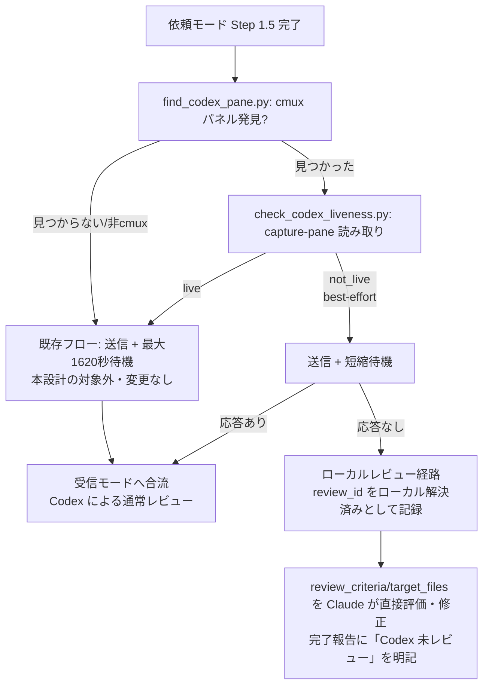

# DES-048 msg-review Codex生存確認・ローカルレビュー経路設計書

## メタデータ

| 項目     | 値                                                                                                     |
| -------- | ------------------------------------------------------------------------------------------------------ |
| 設計ID   | DES-048                                                                                                |
| 関連要件 | REQ-012（msg-review 本体）、FNC-003（前提条件の事前検査）、FNC-006                                     |
| 関連設計 | DES-045（msg-review 本体設計）、DES-046（介入軸）、DES-047（安全ガードレール）。本設計はこれらの追加分 |
| 作成日   | 2026-07-19                                                                                             |
| 状態     | 設計中                                                                                                 |

## 1. 解決する問題

msg-review 依頼モードは、常駐 Codex セッションが実際に存在し応答可能であることを前提にしている。しかし:

- Codex が常駐していない環境（cmux 上に Codex パネルが無い、あるいは cmux 自体が無い）では、`wait_for_reply.py` が最大 1620 秒（27分）ブロッキング待機した後に `timeout` で確定失敗する
- `check_setup.py` は「Codex セッションの常駐有無は機械検査できません」という警告に留まり、送信前に判定する手段がない
- 一方 `/forge:review` は Codex の常駐を前提にせず（`--codex` は単発起動、`--claude` は Codex 不使用）、この種の環境依存の失敗モードを持たない

`/forge:review` を msg-review へ置き換える運用（REQ-012 TBD-001）を検討する上でも、この差分は無視できない。本設計は「Codex との通信を継続するか諦めてローカルで完結させるか」を判定する仕組みを追加する。この判定条件は**単一のスクリプト（`check_codex_liveness.py`）に閉じ込め**、判定条件自体を将来変更しやすくする（判定基準を変えても呼び出し側の統合方法（§3.2）は変わらない設計とする）。

**本設計の目的の限定・false success の回避（実 Codex レビューで発見・確定。ラウンド1〜6で複数回の修正を経て確定）**: 当初案は「cmux パネルが構造的に見つからない場合は送信・待機ごとスキップしてローカル経路へ」としていたが、これは既存 SKILL.md Step 6.5 が既に定めている正しい挙動（cmux 無し・パネル未発見の場合は push 起床の最適化を諦めるだけで、Step 6.6 の通常の 1620 秒待機はそのまま行う）を無断で上書きするものであり、cmux の不在は Codex の不在を意味しないという実 Codex レビューの指摘を受けて撤回した。**cmux パネルが構造的に見つからない場合（非 cmux 環境を含む）は、本設計の対象外とし、既存の Step 6.5/6.6（cmux 無しなら `skipped`、通常の 1620 秒待機）をそのまま使う**（§3.2）。本設計が実際に「継続するか諦めるか」を判定するのは、**cmux パネルが構造的に発見できた場合のみ**であり、その判定は screen 内容からの best-effort 推測（§3.1）に基づき待機時間を短縮したうえで、実際に応答が得られなかったことを確認してから初めてローカルレビュー経路へ倒す（§3.2）。screen 判定の結果だけを理由に Codex の応答機会そのものを奪うことはしない。

## 2. 本設計のスコープ

### やること

- cmux パネルが構造的に発見された場合のみ、**読み取り専用**の `cmux read-screen`/`capture-pane` でそのパネルの生存を確認する（新規スクリプト `check_codex_liveness.py`。「継続するか諦めるか」の判定条件をこのスクリプト 1 つに閉じ込め、条件自体は将来変更可能にする）
- 画面内容から生存が確証できない場合（`check_codex_liveness.py` が `not_live` を返した場合）は、送信・待機自体はスキップせず、**短縮した待機時間**で送信・待機し、実際に応答が無かったことを確認できてから初めてローカルレビュー経路へ倒す（§3.2）
- ローカルレビュー経路は、依頼モードで既に収集済みの review_criteria・target_files を再利用し、受信モード Step 2a 相当の評価ロジック・DES-047 の安全検証（`verify_fix_safety.py` 等）をそのまま適用する。完了報告には「Codex による独立レビューを経ていない」ことを明示する（§3.3・§3.4）
- ローカルレビュー完了後に届きうる Codex からの遅延返信（§3.4「既知の限界」参照）を受信モードが誤って再度取り扱わないよう、review_id を「ローカルで解決済み」として msg-review 自身のスコープ内に記録する（§3.3）

### やらないこと

- **cmux パネルが構造的に発見できない場合（非 cmux 環境を含む）の挙動変更**: 実 Codex レビューで発見・撤回済み（§1 参照）。cmux 無しは Codex の不在を意味しないため、既存の Step 6.5/6.6（`skipped` + 通常の 1620 秒待機）をそのまま使い、本設計はここに介入しない
- **cmux を send/send-panel による本流の送受信チャネルとして使うこと**: DES-045 §3.8 で既に検討済み・不採用（agmsg の app-server ブリッジ方式のような確実な注入手段が無い限り、可視の入力欄への書き込みは下書き破壊・作業割り込みのリスクを伴うため、nudge 用途に限定している）。本設計は**読み取り専用**の生存確認のみを追加するものであり、この既存判断を変更しない
- **Codex である確証を積極的に取ること（ポジティブマッチ）**: Codex・Claude Code いずれもモデル名タグ（例: `[Sonnet 5]` / `gpt-5.6-terra medium` 等）を UI に表示するが、これはモデル更新のたびに変わりうる不安定な手がかりである。したがって「Codex だと確認できたら live」という判定はしない。「明確に非 Codex と分かる場合だけ弾く」非対称な判定に留める
- **画面判定だけを根拠に Codex の応答機会を奪うこと**: `check_codex_liveness.py` の `not_live` は screen capture という不完全な情報源からの best-effort 判定であり（§3.1 手順3の既知の限界）、これ単独では送信・待機を丸ごとスキップしない。実際にローカルレビュー経路へ倒す前に、必ず短縮待機で応答の有無を実地に確認する（§3.2）

## 3. 設計

### 3.0 処理フロー概要



### 3.1 生存確認（新規スクリプト `check_codex_liveness.py`）

入力: workspace/surface UUID（`find_codex_pane.py <project_root>` の出力。`wake_codex.sh` と共有する read-only・副作用無しの発見スクリプトで、project_root の cwd と一致する Codex pane をその都度探す。ファイルへのキャッシュは行わない。DES-045 §3.8 改訂: cmux が pane を維持したまま workspace ID だけを再発行することがあり、キャッシュされた ID が stale 化して機能しなくなる事故が実際に起きたため、キャッシュ方式を廃止した。実 Codex レビューで発見: 発見ロジックを `wake_codex.sh` の inline Python に閉じ込めたままだと、本設計が別実装を重複して持つことになり、liveness 判定と push 起床対象がずれる恐れがあったため、`find_codex_pane.py` として独立スクリプトに切り出した）

処理（優先順位付き。上から順に判定し、最初に一致した規則を採用する。実 Codex レビューの指摘を受け、判定規則・優先順位・各入力カテゴリの期待値を確定する）:

1. `cmux capture-pane --workspace <ws> --surface <sf> --lines 30` でペイン直近 30 行を取得する（30 行は Claude Code のハーネス UI 要素（ステータス行・recap 等）が通常この範囲に収まることを実装時に実測して確定する値。この実測結果は実装 Phase で本節に反映する）
2. 取得コマンド自体が失敗した場合（cmux 未インストール・コマンドエラー・空応答等）→ `"not_live"`（`matched: "capture_failed"`）
3. **Claude Code UI 検出は best-effort であり品質保証ではない（実 Codex レビューで発見・確定）**: `cmux capture-pane`/`read-screen` はスタイル情報を持たないプレーンテキストのみを返す（DES-045 §3.8 で既に確認済みの制約と同種）。したがって「画面最下部の複数シグナル」という条件を課しても、UI chrome（実際にその位置に常時表示される装飾）と、たまたま同じ位置にたまたま同じ文字列が表示された本文を、プレーンテキストの内容だけから区別する手段は存在しない。これは実装で解消できる誤差ではなく、plain-text screen capture という入力形式そのものの限界である。**この誤判定が実害を持たない設計上の理由（実 Codex レビューで発見・修正）**: `not_live` はもはや「送信・待機を丸ごとスキップする」判定ではなく、**§3.2 の短縮待機を経てから初めてローカル経路に倒れる**判定に格下げされている。したがって Claude Code UI 検出が誤って `not_live` を返しても、実際に Codex が生きていれば短縮待機中に応答があり通常フローへ復帰する（false success にならない）。判定規則自体は変更しない（**取得した 30 行のうち末尾 5 行に限定**し、**当該末尾 5 行の中で以下の独立したシグナルのうち 2 つ以上**が見つかった場合に `"not_live"`（`matched: "claude_code_ui"`）と判定する）:
   - `auto mode on` を含む行
   - `shift+tab to cycle` を含む行
   - 正規表現 `\[(Opus|Sonnet|Haiku)[^\]]*\]`（Claude Code の角括弧モデルタグ形式）にマッチする行
   - `ctx:` に続けて `%` を伴う数値を含む行（Claude Code のステータスバーが表示するコンテキスト残量表示）
4. 上記 3 のいずれにも該当せず、かつ**取得した末尾 5 行の中に上記 3 の 4 シグナルが一切出現せず**、かつ最後の非空行全体が正規表現 `^[A-Za-z0-9_./~:@-]{0,120}[$%#>]\s*$`（識別子相当の文字のみで構成される接頭辞 + プロンプト終端記号1文字。罫線・アイコン等の装飾文字・Unicode 絵文字を含む行は一致しない）に一致する場合 → `"not_live"`（`matched: "plain_shell"`）
5. 上記 2〜4 のいずれにも該当しない場合 → `"live"`（`matched: "unclassified_default_live"`。Codex の通常表示・思考中スピナー・未知の TUI・レンダリング途中の空白画面等をすべて含む。Codex だと確証を取ったわけではなく、§1「本設計の目的の限定」のとおり早期除外の最適化としての既定値である）

期待値の受入ケース表（`test_check_codex_liveness.py` の期待値の SoT）:

| 入力カテゴリ                                                                                                       | status   | matched                                                                                                                  |
| ------------------------------------------------------------------------------------------------------------------ | -------- | ------------------------------------------------------------------------------------------------------------------------ |
| Codex のアイドル状態のプロンプト表示                                                                               | live     | unclassified_default_live                                                                                                |
| Codex のターン実行中（思考スピナー等）                                                                             | live     | unclassified_default_live                                                                                                |
| 未知の TUI・認識できないエージェント画面                                                                           | live     | unclassified_default_live                                                                                                |
| Codex がレビュー対象文書内の `auto mode on` 等の文字列を引用表示しているだけ（末尾5行の外、またはシグナル1つのみ） | live     | unclassified_default_live                                                                                                |
| Claude Code の UI（末尾5行内にモデルタグ・`ctx:`・auto mode 等の2シグナル以上）                                    | not_live | claude_code_ui （既知の偽陽性リスクあり。ただし §3.2 の短縮待機により、実際に Codex が生きていれば応答機会は失われない） |
| 何も動いていないプレーンシェルプロンプトのみ（`$`/`%`/`#`/`>` 終端・装飾文字なし）                                 | not_live | plain_shell                                                                                                              |
| `capture-pane` コマンド自体が失敗                                                                                  | not_live | capture_failed                                                                                                           |

出力（標準出力に単一 JSON）:

```json
{"status": "live" | "not_live", "matched": "claude_code_ui" | "plain_shell" | "capture_failed" | "unclassified_default_live", "detail": "..."}
```

### 3.2 依頼モードへの統合（Step 1.5 と Step 2 の間に新設 Step 1.6、Step 6.6 の短縮待機分岐）

**Step 1.6（Step 1.5 と Step 2 の間）**:

1. `find_codex_pane.py <project_root>` を呼び、cmux パネルの構造的存在を確認する。`status: "found"` の場合のみ「パネルが見つかった」として扱う。`"not_found"`・`"ambiguous"`・`"error"`（cmux 自体が無い場合を含む）はいずれも「見つからなかった」として同列に扱う。**この場合、本設計は一切介入しない**（既存の Step 6.5/6.6 がそのまま動く。cmux 無しは Codex の不在を意味しないため、`skipped` のまま通常の 1620 秒待機に進む。実 Codex レビューで発見・撤回: 当初案はここで直接ローカル経路に分岐しており、既存の正しい挙動を無断で上書きしていた）
2. パネルが見つかった場合のみ `check_codex_liveness.py` を実行し、結果（`live`/`not_live`）を保持したまま Step 2 以降（前提検査・対象解決・依頼本文組み立て・送信）へ進む（`not_live` であっても送信自体は行う。実 Codex レビューで発見・修正: 当初案は `not_live` の時点で送信自体をスキップしており、false success を引き起こしていた）

**Step 6.6（応答のブロッキング待機、DES-045 §3.7）の変更**:

- Step 1.6 で cmux パネルが見つからなかった場合、または `status: "live"` だった場合 → 既存どおり `wait_for_reply.py --max-seconds 1620` で待機する（本設計による変更なし）
- Step 1.6 で `status: "not_live"` だった場合 → **短縮した待機時間**（`--max-seconds 90`。TBD-002 参照）で待機する
  - 応答があった場合 → 通常どおり受信モードへ合流する（screen 判定が誤りだった場合を正しく救済する）
  - `timeout` の場合 → ここで初めて**ローカルレビュー経路**へ分岐する（screen 判定に加えて実地の無応答を確認済みのため、false success のリスクが実質的に排除されている）

**既存 Step 6.5（push型起床）との重複整理**: Step 1.6・Step 6.5（`wake_codex.sh` 内部）はいずれも同一の `find_codex_pane.py` を呼び出す（実装の重複ではなく、同一スクリプトの複数回呼び出し）。発見結果を Step 1.6 から Step 6.5 へ受け渡して再利用する最適化は行わず、それぞれ独立に呼び出す（DES-045 §3.8 改訂: キャッシュを廃止し、発見コスト自体が低いことを踏まえて毎回発見し直す方針に統一した。1 回あたり数回の cmux subprocess 呼び出しで軽量なため、二重呼び出しのコストは無視できる）。

**遅延返信の取り違え・処理中競合の防止（新規スクリプト `mark_review_resolved.py`・実 Codex レビューで発見・修正。claim/lease 方式。既存の `toc_store.py --claim`/`--lease-ttl` と同型のパターンを踏襲する）**: 単なる完了後記録では、ローカルレビュー処理中（Edit・DES-047 安全検証の実施中）に本物の Codex 返信が届いた場合、同一 target_files に対する二重の Edit・古い baseline による誤判定・矛盾した返信チェーンが生じうる（実 Codex レビューで発見）。これを避けるため、`review_id` ごとに3状態（`in_progress` / `completed` / `failed`）を `.claude/.temp/msg-review/resolved_review_ids/<review_id>.json`（msg-sys の DB・スキーマには触れない。REQ-012 §2.2/NFR-001 により msg-sys 側の変更は本設計のスコープ外のため）に記録する:

1. **ローカルレビュー開始直前**に `in_progress`（タイムスタンプ付き）で claim する:
   ```bash
   python3 "${CLAUDE_SKILL_DIR}/scripts/mark_review_resolved.py" --claim <review_id> --project-root "$(git rev-parse --show-toplevel)"
   ```
2. ローカルレビューが**正常完了**したら `completed` に遷移する
3. ローカルレビュー中に**回復不能なエラー**（安全検証の致命的失敗・利用者中断等）を検出したら `failed` に遷移する（このターン内で検出できた場合）
4. 上記 2・3 のいずれにも遷移しないままターンが終了した場合（検出不能な中断）、`in_progress` のまま残る。これを永久に残さないため、`in_progress` には**有効期限（TTL、既定 10 分。ローカルレビュー1回の所要時間として十分安全側に長い値。実装時に調整）**を設ける。TTL を超えた `in_progress` は次回参照時に自動的に `failed` 相当（stale）とみなす

受信モード Step 1（プロトコルヘッダの照合）の**前**に、受信した `review_id` の状態を確認する:

```bash
python3 "${CLAUDE_SKILL_DIR}/scripts/mark_review_resolved.py" --check <review_id> --lease-ttl 600 --project-root "$(git rev-parse --show-toplevel)"
```

状態ごとの分岐:

| 状態                                            | 受信モードの挙動                                                                                                                                                                                                         |
| ----------------------------------------------- | ------------------------------------------------------------------------------------------------------------------------------------------------------------------------------------------------------------------------ |
| 記録なし                                        | 通常の受信モード処理（Step 2a 以降）を行う                                                                                                                                                                               |
| `completed`                                     | 通常処理には進まず、「この review_id は既にローカルレビューで解決済みのため、この返信は参考情報としてのみ記録する」旨を報告してターンを終える                                                                            |
| `in_progress`（TTL 内）                         | 通常処理には進まず、「この review_id のローカルレビューが現在進行中のため、この返信は保留する（Edit の競合を避けるため対応しない）」旨を報告してターンを終える（同一 target_files への同時 Edit を避けるための排他制御） |
| `in_progress`（TTL 超過＝stale）または `failed` | ローカルレビューが完了しなかったとみなし、通常の受信モード処理（Step 2a 以降）を行う（返信を握りつぶさない安全側のフォールバック）                                                                                       |

### 3.3 ローカルレビュー経路（新設）

短縮待機後の無応答確認を経て（Step 6.6 経由）、依頼モード Step 4 で収集済みの review_criteria・target_files を使い、Claude 自身がその場で以下を行う:

1. review_criteria に基づき対象ファイルを点検し、所見を重大度付きで洗い出す（受信モード Step 2a の評価ロジックを流用。ただし Codex からの返信本文パースではなく、Claude が直接読んだ結果を同じ構造に落とし込む）
2. 介入軸（DES-046 の決定表）に従い、自動修正対象を振り分ける
3. DES-047 の安全検証（baseline 取得・`verify_fix_safety.py`・`collect_modified_files.py` によるラウンド終了時の独立検証）をそのまま適用する
4. **完了報告には、承認・所見のいずれとも明確に区別される第3の状態として「Codex による独立レビューを経ていない（自己点検のみ）」であることを冒頭に明記する**（実 Codex レビューで発見・確定: この区別が無いと、利用者が Codex の承認と誤認する false success になる）。短縮待機後に無応答だったことも併記する。「往復」という概念自体が無いことも明記する。この review_id 宛に Codex から遅延返信が届く可能性があり、その場合は参考情報としてのみ扱われる旨（§3.2）も明記する

### 3.4 既知の限界

ローカルレビュー経路は、Codex という**独立した別モデルによるチェック**を経ない。所見の洗い出し・妥当性評価・修正の実施を、いずれも同一の Claude（オーケストレーター自身）が行う。これは msg-review 本来の価値（REQ-012 §1.2: 継続対話による文脈保持レビュー）とも、`/forge:review --claude` エンジン（reviewer/evaluator/fixer が隔離コンテキストの別 Agent として動く）とも異なり、二重チェックの効果を持たない。§3.3 のとおり完了報告でこの限界を明示し、承認と混同しない形で人間の判断を仰げるようにする。

BL-001（往復の監査可能性。msg-sys の履歴で追跡できること）は、ローカルレビュー経路では対象外となる（msg-sys を経由しないため、そもそも往復が発生しない）。この場合の監査可能性は、当該ターンの会話ログ・実施した Edit の git 差分に委ねる。

**`claude_code_ui` 判定の既知の偽陽性リスクとその実害の限定（実 Codex レビューで発見・修正、§3.1 手順 3・§3.2）**: `cmux capture-pane`/`read-screen` はスタイル情報のないプレーンテキストしか返さないため、実際に稼働中の Codex が偶然 UI chrome と同じ位置・同じ文字列を画面に表示した場合、生存しているにもかかわらず `not_live` と誤判定されうる。当初案ではこの誤判定が直接ローカル経路への分岐（false success）を招いたが、§3.2 の短縮待機分岐により、誤判定が起きても実際に Codex が生きていれば短縮待機中に応答がありローカル経路には倒れない。ローカル経路に倒れるのは「screen 判定 + 短縮待機の無応答」が重なった場合のみであり、false success のリスクは実質的に排除されている（完全なゼロではない。短縮待機の秒数内に Codex がたまたま応答できなかった場合は依然としてローカル経路に倒れうるが、この残存リスクは §3.3 の完了報告での明示によって利用者が把握できる）。

## 4. 要件定義書への影響

REQ-012 に以下の追加が必要:

- FNC-003（前提条件の事前検査）に、cmux 環境での Codex 生存確認を追加
- 新機能要件として「Codex 生存未確認時のローカルレビュー経路」を追加し、FNC-004（所見の受領・修正・再依頼の往復）の前提が Codex 往復に限定されないことを明記する
- FNC-005（レビュー完了の判定と報告）に、完了状態の第4項として「ローカルレビュー経路による完了（Codex による独立レビューを経ていない自己点検のみ）」を追加し、承認・所見のいずれとも混同しない形で報告することを明記する（§3.3）
- BL-001（往復の監査可能性）の付帯事項として、ローカルレビュー経路の進行中・完了後に届く Codex の返信は msg-review 自身が保持する claim/lease 記録（`mark_review_resolved.py`、msg-sys 側の変更を伴わない）により保留・参考情報化され、同一 target_files への二重処理を起こさないことを明記する（§3.2）

## 5. テスト設計

- `test_check_codex_liveness.py`: §3.1 の受入ケース表の全カテゴリ（7 パターン、偽陽性ケースを含む）を capture-pane 出力のモックで再現し、`status`・`matched` の両方を期待値として検証する。優先順位の検証（例: `capture_failed` が他の判定より先に評価されること）、および末尾 5 行限定・2 シグナル要求の境界値（末尾5行の外にのみシグナルがある場合・末尾5行内にシグナルが1つだけの場合はいずれも `live` になること）も含める
- `test_mark_review_resolved.py`: `--claim` 前は `--check` が「記録なし」を返すこと、`--claim` 後は `in_progress` を返すこと、`completed`/`failed` への遷移後はそれぞれの状態を返すこと、`in_progress` が TTL を超えると `--check` が stale（＝通常処理相当）を返すこと、異なる `review_id` は互いに影響しないこと、記録先が msg-sys の DB・スキーマに一切書き込まないこと（msg-review 自身のスコープ内であることの検証）
- ローカルレビュー処理中に Codex 返信が届く回帰テスト（実 Codex レビューで指摘）: `in_progress` 状態の review_id に対する受信モードが通常処理を行わず保留報告のみで終わることをテストする
- ローカルレビュー経路の SKILL.md 統合部分は既存の例外規定によりテスト対象外（手動確認）

## 6. 未確定事項

| ID      | 内容                                                       | 解決方法                                                                                                   | 期限       |
| ------- | ---------------------------------------------------------- | ---------------------------------------------------------------------------------------------------------- | ---------- |
| TBD-001 | `capture-pane --lines 30` の 30 行という値が実機で十分か   | 実装時に実測し、不足があれば本節（§3.1 手順 1）を改訂                                                      | 実装 Phase |
| TBD-002 | `not_live` 時の短縮待機秒数（§3.2 の 90 秒）が実機で適切か | 実装時に実測し、短すぎる（誤検知の救済に失敗する）・長すぎる（最適化効果が薄れる）場合は本節（§3.2）を改訂 | 実装 Phase |
| TBD-004 | `in_progress` の TTL（§3.2 の 10 分）が実機で適切か        | 実装時にローカルレビュー1回の実測所要時間を踏まえて調整                                                    | 実装 Phase |

旧 TBD-001（`/forge:review` 置き換え判断）は REQ-012 §5 TBD-001 として既に存在するため本文書では扱わない。旧 TBD-002（Claude Code UI 判定ロジック）は §3.1 の受入ケース表で解決済み（実 Codex レビューで発見・修正）。旧 TBD-003（`local_in_progress`/`local_completed`/`local_failed` の状態機械要否）は §3.2 の claim/lease 方式で解決済み（実 Codex レビューで発見・修正）。
