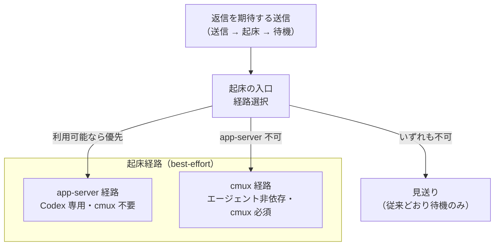
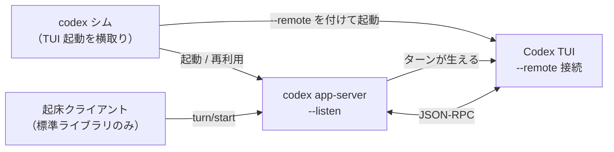
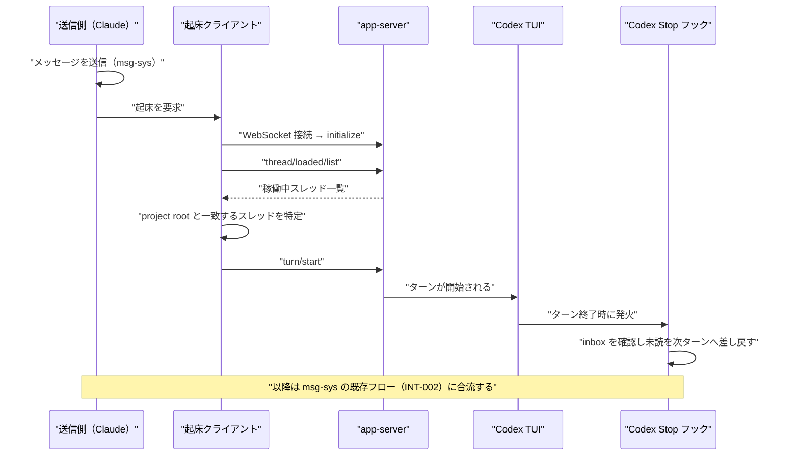

# DES-062 Codex 起床の app-server 経路 設計書

## メタデータ

| 項目     | 値                                                                                             |
| -------- | ---------------------------------------------------------------------------------------------- |
| 設計ID   | DES-062                                                                                        |
| 関連要件 | REQ-012（FNC-007 が本設計の直接の根拠。FNC-004 の往復を成立させるために必要）                  |
| 関連設計 | DES-045（§3.8 cmux 経路）、DES-048（cmux パネル発見時の生存確認）、ADR-061（本設計を採る決定） |
| 作成日   | 2026-08-02                                                                                     |
| 状態     | 設計中（TUI の app-server 接続が未検証。ADR-061「未検証の前提」参照）                          |

> **本文書のスコープ**
>
> - **定めること**: 常駐 Codex セッションのターンを起こす手段（push 型起床）の経路構成と、Codex 向け app-server 経路の設計
> - **定めないこと**: メッセージの送受信・新着検知・返信ヒント・停止条件・配信整合性。これらは通信基盤の責務であり msg-sys:REQ-006 / msg-sys:DES-034 が定める。本設計はそれらを一切変更しない
> - **msg-sys への依存**: 起床は「相手のターンを起こす」ところまでを担い、その後の未読取得・差し戻しは msg-sys の既存フロー（msg-sys:REQ-006 INT-002）に合流する。本設計は msg-sys の要件を前提として参照するが、改訂は行わない
> - **コード配置と責務の関係**: 起床の入口（`send_and_await_reply.py`）と cmux 経路（`wake_codex.sh`）は `scripts/msg-sys/` 配下に置かれているが、**いずれも DES-045 §3.9 / §3.8 が設計した msg-review の成果物**である（同 §3.7 の `wait_for_reply.py` も同様）。したがって本設計がこれらを拡張することは、REQ-012 §2.2 が禁じる「msg-sys 既存実装の変更」には当たらない。本設計が追加する経路も同じ階層に置くが、これは配置の慣習に従うものであり、**要件・設計上の責務が msg-sys にあることを意味しない**（msg-sys:REQ-006 §2.2 は push をスコープ外としている）。配置と責務の不一致は既存状態であり、本設計では変更しない

---

## 1. 概要

FNC-007 が求める push 型起床を、単一実装から**複数経路を選択できる構造**へ改め、Codex 向けに OpenAI 公式 CLI の app-server プロトコルを用いる経路を追加する。cmux 経路は削除せず、実行環境に応じて選択する。これにより cmux 非導入環境でも FNC-004 の往復が停止しなくなる。

---

## 2. アーキテクチャ概要

起床の入口を経路の選択点とし、その配下に経路実装を並列に置く。呼び出し元から見た契約は変わらない。

app-server 経路は 3 つの役者で構成する。**シム**が Codex TUI を app-server 接続付きで起動し、**app-server** が TUI と起床側の共有点となり、**起床クライアント**が外部からターンを注入する。

**TUI は起動時にしか app-server へ接続できない**（後付け接続の経路が無い）。シムが必要なのはこの制約に由来する。

---

## 3. モジュール設計

### 3.1 モジュール一覧

| モジュール             | 責務                                                                | 備考                             |
| ---------------------- | ------------------------------------------------------------------- | -------------------------------- |
| 起床ディスパッチャ     | 利用可能な経路を判定し 1 つ選ぶ。結果を呼び出し元の契約どおりに返す | 既存の起床入口を拡張             |
| 起床クライアント       | app-server に接続し、対象スレッドを特定してターンを注入する         | 新規・Python 標準ライブラリのみ  |
| WebSocket クライアント | RFC 6455 のクライアント側最小実装                                   | 新規・後述 3.3 の範囲に限定      |
| サーバライフサイクル   | app-server の起動・再利用・エンドポイント記録・終了                 | 新規                             |
| codex シム             | 対話 TUI 起動のみを横取りし、app-server 接続付きで起動し直す        | 新規・非対話サブコマンドは素通し |
| cmux 起床              | 端末入力欄への注入による起床                                        | 既存・変更しない                 |

### 3.2 起床経路の選択

選択順序は **app-server → cmux → 見送り** とする。app-server を優先する理由は、端末の入力欄を書き換えないため下書き破壊・作業割り込みが原理的に起こらず、cmux 経路が必要としていた作業中判定などの安全ゲートを不要にできるためである。

各経路の可用性判定は、その経路自身が行い、不可なら次へ委ねる。判定条件をディスパッチャ側に散らさない（経路を追加するたびにディスパッチャを書き換える構造にしない）。

返り値は既存契約を維持し、次の 3 値を区別する。

| 状態      | 意味                                                             |
| --------- | ---------------------------------------------------------------- |
| `ok`      | 起床に成功した                                                   |
| `skipped` | 確認できた条件による意図的な見送り（経路が使えない環境である等） |
| `failed`  | 起床すべき状況が整っていたが機械的な理由で失敗した               |

FNC-007 の求めに従い `skipped` と `failed` を畳み込まない。両者の区別が、往復が遅れた原因が環境なのか故障なのかを切り分ける唯一の手がかりになる。

### 3.3 WebSocket クライアントの実装範囲

app-server の `unix://` / `ws://` はいずれも WebSocket を要求する（素の改行区切り JSON-RPC は接続を閉じられる）。同梱の `proxy` は生バイト中継でありハンドシェイクを代行しないため、クライアント側に RFC 6455 の実装が要る。

msg-sys:REQ-006 NFR-001 と同じ方針に従い、Python 標準ライブラリのみで実装する。必要な範囲は以下に限る。

- HTTP Upgrade ハンドシェイク（`Sec-WebSocket-Key` の生成と `Accept` 検証）
- クライアント→サーバ方向のマスキング
- テキストフレームの送受信と継続フレームの結合
- ping/pong への応答、close の送受信

**意図的に実装しないもの**: `wss://`（TLS）、非ループバック接続、圧縮拡張（permessage-deflate）、サブプロトコル交渉。接続先をループバックまたは Unix ドメインソケットに限定するため、いずれも不要である。

### 3.4 トランスポートの選択

既定は **ループバック TCP の `ws://127.0.0.1:<動的ポート>`** とする。`unix://` はファイル権限でアクセスを閉じられる利点があるため、TUI の `--remote` が `unix://` を受理できることを実機で確認できた場合はそちらを優先する（未検証。§7 TBD-002）。

非ループバックの listener に必要な認証系オプションは使用しない。接続元をローカルに限定することで代替する。

### 3.5 app-server ライフサイクル

`app-server daemon` は公式インストーラ版の standalone install を要求し、他のインストール方法を排除するため**使用しない**（ADR-061 で棄却済み）。代わりに本設計が起動・再利用を管理する。

- プロジェクト単位で 1 つの app-server を持つ。エンドポイントと稼働情報を記録し、次回は再利用する
- **起動した Codex のバージョンを記録する**。異なるビルドの TUI は同じ app-server と会話できないため、バージョンが変わっていたら再利用せず作り直す
- エンドポイントはキャッシュせず毎回その場で解決する（記録が stale 化して恒久的に機能しなくなる失敗を避ける。DES-045 §3.8 が cmux ペインの発見で同じ失敗を経験している）

### 3.6 codex シム

対話 TUI の起動のみを横取りし、それ以外は本物へ素通しする。

- 素通しする対象: 非対話サブコマンド（`exec` / `app-server` / `login` / `mcp` 等）と、起床を有効化していないプロジェクト
- 横取りする対象: 有効化済みプロジェクトでの対話 TUI 起動
- 緊急脱出用の環境変数を用意し、シムを介さず本物を起動できるようにする

**シムはセッションの自動起動・管理を行わない。** Codex セッションは従来どおり人間が手動起動して常駐させる（REQ-012 §2.2）。シムが介入するのはその起動コマンドの経路だけであり、起動の意思決定・ライフサイクル管理は行わない。

**設定不備を「無効化」と同じ挙動にしない**（FNC-007）。シム自身の設置が壊れている場合に、それを「このプロジェクトは起床対象ではない」と誤認して黙って素通しすると、全ての起動がブリッジを迂回しているのに兆候が一切出ない状態になる。この場合は警告を出したうえで素通しする。

---

## 4. ユースケース設計

### 4.1 ユースケース一覧

| ID    | ユースケース                        | 主体           |
| ----- | ----------------------------------- | -------------- |
| UC-01 | 常駐 Codex を起こして依頼を届ける   | 送信側（起床） |
| UC-02 | app-server が使えない環境で縮退する | 起床           |
| UC-03 | シム経由で Codex TUI を起動する     | 利用者         |

### 4.2 シーケンス図（UC-01 正常系）

起床が行うのは**ターンを起こすことだけ**である。未読の取り出しと差し戻しは msg-sys の Stop フックが担い、本設計はそこに介入しない。配信の確定点は既読化のまま変更しない（msg-sys:REQ-006 INT-004）。

### 4.3 エラーフロー [MANDATORY]

| 事象                                         | 扱い      | 根拠                                                                             |
| -------------------------------------------- | --------- | -------------------------------------------------------------------------------- |
| Codex CLI が app-server を提供しない         | `skipped` | 環境による意図的な見送り。cmux 経路へ委ねる                                      |
| app-server の起動に失敗した                  | `failed`  | 起床すべき状況で機械的に失敗した                                                 |
| 対象スレッドが見つからない                   | `skipped` | シム未経由で起動された TUI 等。cmux 経路へ委ねる                                 |
| 接続後に `turn/start` が失敗した             | `failed`  | 前提が整ったうえでの失敗。診断情報として呼び出し元へ返す                         |
| シムの設置が壊れている                       | 警告      | 素通しするが沈黙しない（FNC-007）                                                |
| 起床が `failed` のまま待機がタイムアウトした | 報告      | 「待っただけ」か「起床が構造的に壊れている」かを利用者が切り分けられるようにする |

いずれの失敗も**待機そのものは中断しない**。起床は往復の成立条件ではなく、成立までの時間を短縮する手段である（FNC-007）。

---

## 5. 使用する既存コンポーネント

- **起床の入口**: 経路選択点として拡張する。best-effort であること・構造化結果を返すこと・失敗が待機の正しさを壊さないことという既存契約は変更しない
- **cmux 起床経路（DES-045 §3.8）**: 変更しない。エージェント非依存の経路として維持する
- **msg-sys の送受信・Stop フック**: 変更しない。起床はターンを起こすところまでを担い、以降は既存フローに委ねる
- **Codex CLI**: 外部コマンド呼び出しとして利用する。msg-sys:REQ-006 NFR-001 が `codex` 等の呼び出しを明示的に許容している。NFR-002 が禁じるのは agmsg 等の外部プラグイン導入であり、対向エージェント自身の CLI 利用はこれに当たらない

---

## 6. テスト設計

app-server との実通信を伴うため、層を分けて検証する。

| 層                     | 対象                                                       | 方式                                                  |
| ---------------------- | ---------------------------------------------------------- | ----------------------------------------------------- |
| WebSocket クライアント | ハンドシェイク・マスキング・継続フレーム・ping/pong・close | ローカルの最小 WebSocket サーバに対するユニットテスト |
| 経路選択               | 3 経路の選択順序と `ok` / `skipped` / `failed` の区別      | 各経路をスタブ化したユニットテスト                    |
| シム                   | 素通し対象の判定、有効化判定、設置不備時の警告             | 引数パターンごとのユニットテスト                      |
| プロトコル整合         | 使用するメソッドが実際の Codex に存在すること              | `generate-json-schema` の出力に対する照合             |
| 統合                   | 起床から TUI にターンが生えるまで                          | 実機確認（TUI の対話起動が必要なため自動化しない）    |

**プロトコル整合の検証を自動化できることが本設計の利点である**。Codex CLI 自身がプロトコル定義を出力できるため、インターフェース変更の検出を画面パース等の推測に頼らない。`[experimental]` 表示のとおり破壊的変更は起こりうるが、その検出手段を持てる。

---

## 7. 未確定事項

| ID      | 内容                                                                | 解決方法                                         |
| ------- | ------------------------------------------------------------------- | ------------------------------------------------ |
| TBD-001 | TUI が `--remote` で app-server に接続し、スレッド一覧に現れること  | 実機確認（ADR-061 を accepted へ移す条件）       |
| TBD-002 | `--remote` が `unix://` を受理するか、`ws://` 限定か                | 実機確認。結果を §3.4 に反映する                 |
| TBD-003 | ターン注入に `turn/start` と `thread/inject_items` のどちらが適切か | 実機確認。前者を既定とし、後者は挙動確認後に判断 |
