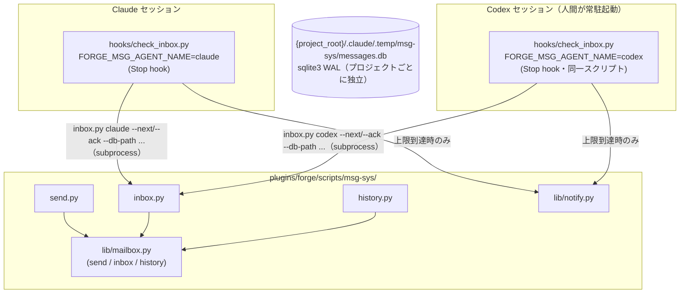
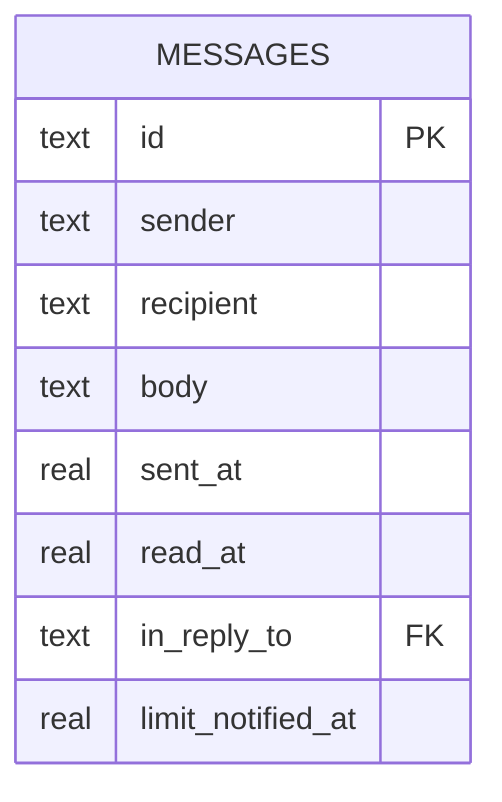
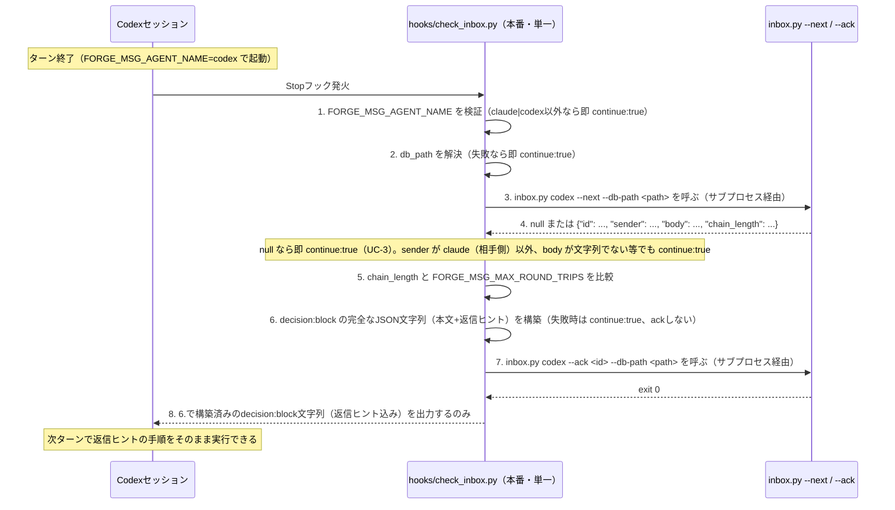

# DES-034 msg-sys Codex 継続対話メッセージング設計書

## メタデータ

| 項目     | 値                                                                                                                                                                                                                                                                                                                                                                                                                                                                                                                                                                                                                                                                                                                                                                                                                                                                                                                                                                                                                                                                                                                                                                                                                                                                                                                                                                                                                                                                                                                                                                                                                                                                                                                                 |
| -------- | ---------------------------------------------------------------------------------------------------------------------------------------------------------------------------------------------------------------------------------------------------------------------------------------------------------------------------------------------------------------------------------------------------------------------------------------------------------------------------------------------------------------------------------------------------------------------------------------------------------------------------------------------------------------------------------------------------------------------------------------------------------------------------------------------------------------------------------------------------------------------------------------------------------------------------------------------------------------------------------------------------------------------------------------------------------------------------------------------------------------------------------------------------------------------------------------------------------------------------------------------------------------------------------------------------------------------------------------------------------------------------------------------------------------------------------------------------------------------------------------------------------------------------------------------------------------------------------------------------------------------------------------------------------------------------------------------------------------------------------- |
| 設計ID   | DES-034                                                                                                                                                                                                                                                                                                                                                                                                                                                                                                                                                                                                                                                                                                                                                                                                                                                                                                                                                                                                                                                                                                                                                                                                                                                                                                                                                                                                                                                                                                                                                                                                                                                                                                                            |
| 関連要件 | REQ-006（INT-001, INT-002, INT-003, INT-004, FNC-002, FNC-003, FNC-004, BL-001, NFR-001〜003）                                                                                                                                                                                                                                                                                                                                                                                                                                                                                                                                                                                                                                                                                                                                                                                                                                                                                                                                                                                                                                                                                                                                                                                                                                                                                                                                                                                                                                                                                                                                                                                                                                     |
| 作成日   | 2026-07-11                                                                                                                                                                                                                                                                                                                                                                                                                                                                                                                                                                                                                                                                                                                                                                                                                                                                                                                                                                                                                                                                                                                                                                                                                                                                                                                                                                                                                                                                                                                                                                                                                                                                                                                         |
| 改訂     | 2026-07-18 — msg-review（旧 REQ-011/DES-040）を本設計書へ統合（ADR-043）。返信ヒント付き Stop フックの本番実装 `hooks/check_inbox.py` を反映。msg-review feature（msg-review:DES-045）の前提検査用に自己診断 CLI `check_setup.py` を追加<br>2026-07-19 — Claude 側 Stop フックの登録経路を `.claude/settings.json` 手動編集から forge プラグイン同梱 `hooks/hooks.json`（Claude Code のプラグイン hooks 自動登録機構）へ変更。プラグイン導入だけで有効化されるため手動編集が不要になった（`check_setup.py` の `claude_settings_registration` チェックは `claude_plugin_hook_registration` に改名し、プロジェクト非依存の静的ファイルを検査する形に変更）。Codex 側（`.codex/hooks.json`）は Codex CLI 自体の設定でありプラグイン機構の対象外のため、引き続き手動登録が必要（実 Codex レビューでの指摘を踏まえた改善）<br>2026-07-19（同日追記）— **実インシデント（`.codex/hooks.json` が forge プラグイン本体を指す git-relative パスで登録されていたが、そのプロジェクトが forge プラグインのソース自体ではなかったため参照先が実在せず、Codex の Stop フックが無限にブロックし続けた）を受け、`.codex/msg-sys/scripts`（現在ロードされている forge プラグインの `scripts/msg-sys/` への symlink。コピーではないため常に最新版を参照する）と、それを指す `.codex/hooks.json` 登録を、msg-review 依頼モードの実行のたびに自己修復するスクリプト `ensure_codex_hook.py` を追加（msg-review:DES-045 §3.8 補足）。`check_setup.py` の `codex_hooks_registration` / `claude_plugin_hook_registration` 検査は、登録コマンドが指すスクリプトパスの文字列パターン一致だけでなく、実際にファイルとして解決・存在するかまで検証するよう強化した（fail closed。今回のインシデントを send 前の前提検査で検出できなかったことへの直接対策）** |

## 1. 概要

Claude セッションと、人間が手動起動して常駐させる Codex セッションとの間で、ターン終了時のポーリングによりメッセージを非同期に往復させる。中核は sqlite3（標準ライブラリのみ、WAL モード）による追記専用の mailbox で、Codex 側・Claude 側それぞれの Stop フックが未読を検知して「継続してよいか／ターンを止めて差し戻すか」を判定する。本設計は通信基盤のみを対象とし、この上で行う応用（メッセージで何を依頼し、返信をどう処理するか）は応用側の仕様（レビュー応用は msg-review:REQ-012）が定める（REQ-006 §2.2）。

Stop フックが差し戻す配信メッセージには、受信側 AI が追加のドキュメント参照なしに返信操作を実行できるよう、実行可能な形式の「返信ヒント」を付加する（FNC-003/FNC-004/BL-001）。本番の Stop フック実装は Claude 側・Codex 側で分けず、宛先を環境変数 `FORGE_MSG_AGENT_NAME`（`claude`/`codex` の2値のみ許容、既定値なしの fail-closed）で切り替える単一の Python スクリプト `hooks/check_inbox.py` である（§3.1）。初期実装で作成した `hooks/claude-check-inbox.sh` / `hooks/codex-check-inbox.sh`（bash）は、返信ヒント付加を Python へ実装移行する過程で `check_inbox.py` に置き換えられ、本番では使用しない（§3.1 に経緯を残す）。

## 2. アーキテクチャ概要



各セッションはターン終了時（Stop フック相当）に自分宛の inbox を確認し、未読があれば `decision: block` で本文と返信ヒントを差し戻す。DB ファイルはフック実行時に `git rev-parse --show-toplevel` で動的解決したリポジトリルート（§7 参照）から明示的に解決するため、プロジェクトごとに独立したメッセージ空間を持つ（§7 TBD-002 の解決を参照。既存実装の `__file__` 基準の既定パスはプラグインキャッシュ共有時にこの前提を満たさないため、CLI 層に `--db-path` を追加してフック側で明示指定する）。

## 3. モジュール設計

### 3.1 モジュール一覧

| モジュール名                         | 責務                                                                                                                                                                                                                                                                                                                                                                                                                                                                                                                                                                                                                                                                                                                                                                                                                                                                                                                                                                                                                                                                                          | 依存                                                                                              |
| ------------------------------------ | --------------------------------------------------------------------------------------------------------------------------------------------------------------------------------------------------------------------------------------------------------------------------------------------------------------------------------------------------------------------------------------------------------------------------------------------------------------------------------------------------------------------------------------------------------------------------------------------------------------------------------------------------------------------------------------------------------------------------------------------------------------------------------------------------------------------------------------------------------------------------------------------------------------------------------------------------------------------------------------------------------------------------------------------------------------------------------------------- | ------------------------------------------------------------------------------------------------- |
| `lib/mailbox.py`                     | send / inbox（既読化しない非破壊取得。既読化は ack() に一本化）/ history / `reply_chain_length` / `ack`（単一 message_id のみ既読化）/ `mark_limit_notified`（`limit_notified_at` 設定）/ `select_next_actionable`（`limit_notified_at IS NULL` の最古1件を選び `reply_chain_length` を算出して1個の dict として返す。0件なら `None`）の永続化ロジック                                                                                                                                                                                                                                                                                                                                                                                                                                                                                                                                                                                                                                                                                                                                        | sqlite3（標準ライブラリ）                                                                         |
| `send.py`                            | メッセージ送信 CLI（`sender recipient body\|- [--in-reply-to <id>] [--db-path <path>]`）                                                                                                                                                                                                                                                                                                                                                                                                                                                                                                                                                                                                                                                                                                                                                                                                                                                                                                                                                                                                      | `lib/mailbox.py`                                                                                  |
| `inbox.py`                           | 未読取得 CLI（bare 形式（フラグ無指定）・`--peek` ともに既読化しない非破壊取得。`--ack <id>` で単一 message_id のみ既読化、`--mark-notified <id>` で `limit_notified_at` 設定、`--next` で選定+往復回数算出を1回の JSON 応答に集約。`--db-path <path>`）                                                                                                                                                                                                                                                                                                                                                                                                                                                                                                                                                                                                                                                                                                                                                                                                                                      | `lib/mailbox.py`                                                                                  |
| `history.py`                         | 2エージェント間の全履歴取得 CLI（監査用、既読状態を変更しない。`--db-path <path>` 対応）                                                                                                                                                                                                                                                                                                                                                                                                                                                                                                                                                                                                                                                                                                                                                                                                                                                                                                                                                                                                      | `lib/mailbox.py`                                                                                  |
| `check_setup.py`                     | msg-sys セットアップの自己診断 CLI（`[--project-root <path>]`）。DB パスの導出可能性・forge プラグイン同梱 `hooks/hooks.json`（Claude 側、プラグイン導入だけで自動登録）・`.codex/hooks.json`（Codex 側、手動登録）への `check_inbox.py` 登録・登録エントリの `FORGE_MSG_MAX_ROUND_TRIPS` 設定有無を機械検査し、`{"status", "checks", "warnings"}` の単一 JSON を標準出力へ返す。機械検査できない項目（Codex 側 trust 登録の完了）は warnings として明示する。応用側（msg-review:DES-045 §3.5 等）が依頼送信前の前提検査に利用する。**相手セッションの常駐は本 CLI の検査対象でも warnings 対象でもない**——かつて「機械検査できない」項目として警告に挙げていたが、稼働中のプロセスを直接確認すれば判定できるため事実に反していた（msg-review:ADR-068。応用側からのユーザー承認済み改訂として 2026-08-04 に削除）。常駐は通信路の健全性ではなく応用側の前提であり（msg-sys はそれを使う応用が何を前提とするかを知らない）、判定はそれを必要とする側が行う（msg-review:DES-045 §3.5.2 の可用性検査）。DB パス導出規則は `lib/mailbox.py` を共有し再実装しない（msg-review feature に伴う追加） | `lib/mailbox.py`                                                                                  |
| `lib/notify.py`                      | OS 通知ヘルパー。`subprocess.run(["osascript", "-e", script], ...)` を引数配列形式で呼び出す（§8「通知内容の安全な受け渡し」）。`python3 <path>/lib/notify.py --recipient <name> --message-id <id> --sender <sender> --body <body> --ack-hint <ack コマンド例文字列>` として呼べる CLI エントリポイントを持つ（`argparse` 経由）。終了コードで成否を示す（0=通知成功、非0=失敗）                                                                                                                                                                                                                                                                                                                                                                                                                                                                                                                                                                                                                                                                                                              | 標準ライブラリのみ                                                                                |
| `hooks/check_inbox.py`（本番・単一） | Stop フック本体。`FORGE_MSG_AGENT_NAME`（`claude`/`codex`、既定値なしの fail-closed）で宛先を決定し、返信ヒント付きの `decision: block` を組み立てる（§4.2）。Claude・Codex 双方の登録から同一ファイルを共有する                                                                                                                                                                                                                                                                                                                                                                                                                                                                                                                                                                                                                                                                                                                                                                                                                                                                              | `inbox.py` / `lib/notify.py`（サブプロセス経由）、`send.py`（返信ヒント文中のコマンド構文の基準） |

**単一スクリプトを採用する根拠**: Claude 向け・Codex 向けでロジックを分ける必要はなく、宛先の既定値以外は完全に同一である。この既定値差は登録エントリ側で `FORGE_MSG_AGENT_NAME` を明示指定すれば解消するため、`.claude/settings.json` は `FORGE_MSG_AGENT_NAME=claude`、`.codex/hooks.json` は `FORGE_MSG_AGENT_NAME=codex` を付与して同じスクリプトを呼ぶ。これにより Claude/Codex 間の実装同期コスト（2 ファイルを常に同一内容に保つ保守負担）を排除する。

> **経緯（旧 bash 実装からの移行）**: 初期実装では `hooks/codex-check-inbox.sh`（改修）・`hooks/claude-check-inbox.sh`（新規）の bash 2 ファイル構成を採用していた（§3.2 参照）。返信ヒント機能（FNC-003/FNC-004/BL-001）の追加にあたり、複雑な JSON 解析・分岐・入力検証の自動テスト網羅性を確保するため実装言語を Python に切り替え、単一の `check_inbox.py` へ統合した。bash 版のファイルは参考実装として残存するが本番では使用しない。

### 3.2 実装言語に Python を採用する根拠 [MANDATORY]

プロジェクトのスクリプト言語選定ルールは「データ変換・パース・YAML/JSON 操作 → Python」「外部コマンド呼び出し → Bash」「両方の特性が必要 → Python（Bash の複雑化を避ける）」と定める。

初期実装の bash 版（`hooks/codex-check-inbox.sh`）は、既に `inbox.py --next` の JSON を複数回 `python3 -c` 経由でパースし、`--next`・`--ack`・`--mark-notified`・`lib/notify.py` の複数サブプロセスを制御していた（bash + `python3 -c` 断片の組み合わせで両特性を賄っていた状態）。`check_inbox.py` は、これに加えて返信ヒントの安全な構築（§4.2）・環境変数と入力値の厳密な検証・未捕捉例外時も含めた出力契約保証（§4.3）まで同一境界で担う。bash はプロジェクトルール上 Python のような自動テスト必須化がなく手動・統合テストのみで検証する運用のため、この規模の複雑な JSON 解析・分岐・入力検証の網羅的な自動検証には適さない。したがって本フックの規模と責務は上記ルールの「両方の特性が必要」に該当し、境界全体を Python として実装する。

Python 化に伴い、プロジェクトのテスト必須ルール（`plugins/` 配下の `.py` スクリプトへ適用）が本フックにも適用される。テスト設計は §9 を参照。

返信ヒントの組み立てには標準ライブラリ `shlex.join()` を用いて固定引数を安全に引用する（§4.2「返信ヒントの実行可能性契約」）。返信本文（自由記述）はコマンド文字列へ一切埋め込まず、ファイル経由の標準入力リダイレクトで渡す契約とする。独立した新規ライブラリファイルは作らず、`check_inbox.py` 内に直接実装する（責務の複雑度が単一スクリプトに収まる規模であり、独立モジュール化は過剰設計と判断する）。

### 3.3 データモデル（ER 図）



`messages` テーブルは追記専用（削除しない）。`read_at IS NULL` が未読を表す。`(recipient, read_at)` に複合インデックスを持つ（既存 `lib/mailbox.py` 実装済み）。`in_reply_to`（nullable、自己参照 FK）は §8 の往復回数カウントに使う。人間が新規に送る（返信ではない）メッセージは `in_reply_to` を付けない。**Stop フック自身はメッセージを送信しない**（フックの責務は inbox 検知と `decision` 出力のみ。§4）。返信を実際に送るのは次ターンの Claude/Codex 自身であり、block 出力の返信ヒントに含まれる message id を `send.py ... --in-reply-to <id>` に渡すことで `in_reply_to` を設定する。`limit_notified_at`（nullable）は §8 の往復上限到達により保留されたメッセージを示す。この値が設定されたメッセージは、`--next` の処理対象選定（§4）で後回しにされ、後続の未読メッセージの処理をブロックしない。

## 4. ユースケース設計

### 4.1 ユースケース一覧

| ユースケース              | 説明                                                                                                                  |
| ------------------------- | --------------------------------------------------------------------------------------------------------------------- |
| UC-1 返信ヒント付き配信   | Claude・Codex いずれの方向でも、未読メッセージ検知時に本文へ実行可能な返信コマンド案内（返信ヒント）を添えて差し戻す  |
| UC-2 上限到達時の通知     | 往復上限到達時は `lib/notify.py` による人間向け通知を送り、返信ヒントは付与しない（配信されないため対象外）           |
| UC-3 未読なし             | `--next` が `null` を返す通常ケース。既読化・通知を一切行わず `{"continue": true}` を出力する                         |
| UC-4 異常系での安全側動作 | いずれかの前提条件が欠けた場合、既読化せず有効な `{"continue": true}` を出力して正常終了する（§4.3 エラーフロー参照） |
| UC-5 履歴監査             | 2エージェント間の全メッセージ履歴を、既読状態に関わらず送信順に取得する                                               |

### 4.2 処理順序とシーケンス図

処理は以下の順序で実行する（この順序は §4.3 エラーフロー表・§9 テスト設計とも一致させる。実装可能な唯一の順序として明記する）:

1. `FORGE_MSG_AGENT_NAME` を検証する（`claude` または `codex` のいずれか）
2. `db_path` を解決する（`FORGE_MSG_PROJECT_ROOT` から §7 の解決方法に準じて導出）
3. `inbox.py <agent_name> --next --db-path <db_path>` を呼ぶ
4. 返却 JSON を検証する: `null` なら UC-3。オブジェクトなら `id`（非空文字列）・`sender`（`FORGE_MSG_AGENT_NAME` の相手側、すなわち `FORGE_MSG_AGENT_NAME=codex` なら `sender` は `claude` でなければならない。逆も同様。`sender == FORGE_MSG_AGENT_NAME` は不正とする）・`body`（文字列）・`chain_length`（整数。**真偽値は整数として受理しない**。Python の `bool` は `int` のサブクラスであり `isinstance(x, int)` は `True`/`False` を誤って受理するため、`type(x) is int` 相当の厳密な型検査を用いる）のすべてを検証する
5. `chain_length` と `FORGE_MSG_MAX_ROUND_TRIPS`（§8）を比較する
6. **`decision:block` の完全な出力 JSON 文字列をメモリ上で構築し終える**（本文 + 返信ヒント。返信ヒント自体も本節「返信ヒントの実行可能性契約」に従い完全に組み立てる）。この時点で構築に失敗した場合（例外発生）は ack を行わず `{"continue": true}` を出力する
7. 構築が成功した場合のみ `inbox.py <agent_name> --ack <id> --db-path <db_path>` を呼ぶ
8. `--ack` が成功した場合のみ、6. で構築済みの JSON 文字列を標準出力へ書き出す

**この順序を採用する理由**: 出力文字列の構築（本文結合・JSON直列化・返信ヒント生成）を `--ack` より **前** に完了させることで、構築中の例外は必ず「未読のまま `continue:true`」という安全側の挙動になる。逆に ack 後に構築を行うと、構築失敗時に「既読化されたのに何も配信されない」という契約違反が生じる。

**「配信成功」の定義（INT-004 の範囲限定、ack 起点）**: Stop フックはメッセージを一方向で出力するのみであり、呼び出し元（Claude Code / Codex ランタイム）が実際にその内容を次ターンの入力として使ったかどうかを hook 自身が確認する手段はない。加えて、ack（DB 書き込み）と JSON 出力の両方を単一のアトミックな操作として扱うことはできない（実装上の制約）。本設計は **`--ack` の成功をもって「配信成功」と定義する**（既読化そのものが配信成功の確定操作を兼ねる）。

**`--ack` は「未読→既読」の条件付き更新であり、更新できたプロセスのみが配信権を得る [MANDATORY]**: `mailbox.ack()` は `UPDATE messages SET read_at = ? WHERE id = ? AND read_at IS NULL` の影響行数を検証し、実際に1行を既読化できた場合のみ真を返す（`inbox.py --ack` は真偽を終了コードへ反映する）。同一 recipient に対して複数の Stop hook プロセスが並行実行された場合（例: 同一プロジェクトで同名 agent の Claude Code セッションを複数タブで開く等）、`--next` による処理対象選定自体はロックを取らないため複数プロセスが同一未読を選び得るが、後段の `--ack` が「先着1プロセスのみ成功・後続は失敗」を保証することで、`decision:block` の二重出力（同一メッセージの重複配信）を防ぐ。影響行数を検証せず常に成功扱いにすると、この排他が働かず二重配信が発生する（レビュー指摘により発見・修正）。

**ack 後の標準出力書き込み失敗は排除できない [MANDATORY]**: 8. の標準出力書き込み自体も失敗し得る（受信側プロセスの異常終了・hook タイムアウト超過による親プロセスの読み取り打ち切り等に起因する `BrokenPipeError`、または標準出力のエンコーディング不一致に起因する `UnicodeEncodeError` 等）。DB への ack と標準出力への書き込みは同一トランザクションにできないため、両者を原子的に保証することはできない。本設計は **ack 後の配信失敗時は再送せず、メッセージは既読のまま消失することを許容する**（重複配信より消失を選ぶ設計判断。以下のエラーフロー表の「未読のまま」不変条件は 6. 以前の段階にのみ適用され、7. の ack 成功後には適用されない）。このうち `UnicodeEncodeError` は環境のロケール・エンコーディング設定次第で日本語等のマルチバイト文字を含む通常の返信本文でも再現し得るため、hook プロセスの標準出力は明示的に UTF-8 エンコーディングで書き込むこと（`sys.stdout.reconfigure(encoding="utf-8")` 等）。`BrokenPipeError` 等の外部要因によるプロセス終了は、hook タイムアウト超過という異常環境下でのみ起こり得る稀なレースであり、追加のリカバリー機構（再送・確認応答プロトコル等）は設けない（過剰な複雑化を避ける）。



**返信ヒントの実行可能性契約 [MANDATORY]**: 返信ヒントは受信側が **そのまま実行できる完全な手順** でなければならない。以下をすべて満たす:

- `python3` インタプリタを明示する（実行権限・PATH 配置に依存しない）
- `send.py` は絶対パス（フック実行時に解決済みのパス）で参照する
- **コマンド文字列は「引数列」と「リダイレクト」を分けて構築する [MANDATORY]**: `python3` インタプリタパス・`send.py` の絶対パス・宛先・送信者・`--in-reply-to` の値・`--db-path` の値は 1 つの引数列としてまとめ `shlex.join()` で引用する。リダイレクト演算子 `<` と一時ファイルパスは `shlex.join()` の対象（引数列）に含めてはならない（`<` を引数列の要素として渡すと通常の引用対象と誤認識され、リダイレクトとして機能しない）。一時ファイルパスは `shlex.quote()` で個別に引用し、`shlex.join(引数列) + " < " + shlex.quote(一時ファイルパス)` の形で連結してコマンド文字列を組み立てる
- **CLI 引数の対応関係を固定する**: `send.py` の `sender` 引数には `FORGE_MSG_AGENT_NAME`（＝この hook 自身の宛先）を、`recipient` 引数には配信元メッセージの `sender`（＝返信の宛先）を、`--in-reply-to` には配信元メッセージの `id` を渡す
- **配信元メッセージの `sender` を `FORGE_MSG_AGENT_NAME` の相手側1値に限定する**（順序4）。`claude`/`codex` の2値に属するだけでは `sender == FORGE_MSG_AGENT_NAME`（自己宛メッセージ）を排除できず、`send.py codex codex - ...` のような無意味な自己返信ヒントが生成されて FNC-004（双方向性）・BL-001（正しい宛先の反映）に反する。したがって `sender` は「`FORGE_MSG_AGENT_NAME` と異なる、かつ `claude`/`codex` のいずれか」という一意の値のみを許容する
- **返信本文はコマンド引数へ一切埋め込まない**。返信ヒントは「(a) 返信本文を一時ファイルへ書き出す、(b) `send.py` を標準入力リダイレクト（`< <一時ファイルパス>`）で起動する、(c) 送信成功後に一時ファイルを削除する」という3手順として案内する
- **一時ファイルパスは配信元メッセージごとに一意にする**: パスに配信元メッセージの `id`（UUID4、既に一意）を組み込む（例: `/tmp/forge_msg_reply_<id>.txt`）
- **手順 (a) はシェルコマンドで行ってはならない [MANDATORY]**: heredoc・`echo`・`printf` 等のシェルコマンドで本文を書き出すと、本文の内容（バッククォート・`$`・引用符等）がシェルに再解釈され、シェルインジェクションの経路が復活する。返信ヒントには「本文はシェルコマンドを経由せず、使用中のツールのファイル書き込み機能（Claude Code の `Write` ツール等）で書き出すこと」を明記する。手順 (b) のみをシェルコマンドとして提示し、そのコマンド文字列自体には本文を含めない
- **手順 (c) で一時ファイルを削除する**: `send.py` 実行成功後に一時ファイルを削除する手順を明記する（後始末）

返信ヒントの具体例（配信元メッセージの `id` = `abc-123`、`sender` = `claude`、この hook の `FORGE_MSG_AGENT_NAME` = `codex` の場合）:

```text
返信する場合:
1. 返信本文を、シェルコマンドを経由せず（heredoc・echo・printf 等を使わず）ファイル書き込み機能で
   一時ファイル /tmp/forge_msg_reply_abc-123.txt に書き出す
2. 次のコマンドを実行する:
   python3 "<msg-sys絶対パス>/send.py" codex claude - --in-reply-to "abc-123" --db-path "<path>" < "/tmp/forge_msg_reply_abc-123.txt"
3. 送信成功後、一時ファイル /tmp/forge_msg_reply_abc-123.txt を削除する
```

### 4.3 エラーフロー [MANDATORY]

判定は §4.2 の処理順序に従って**上から順に**行う。ある段階の判定を通過して初めて次の段階に進む（優先順位の曖昧さはない）。**順序1〜7** のいずれかの段階で以下に該当した場合、**既読化を行わず**有効な `{"continue": true}` を出力して exit 0 とする。「本文のみ配信する」等の縮退経路は設けない（FNC-003「配信されるすべてのメッセージに返信ヒントが自己完結すること」と矛盾するため。返信ヒントを完成させられない場合は、そもそも配信しない）。**順序8**（`--ack` 成功後の異常）はこの規範の対象外であり、既読化済み・出力なしという別の挙動をとる。

| 順序 | 異常系                                                                                                                                                                                                                             | 挙動                                                                                                                                                                                                                                                                                                                                                 |
| ---- | ---------------------------------------------------------------------------------------------------------------------------------------------------------------------------------------------------------------------------------- | ---------------------------------------------------------------------------------------------------------------------------------------------------------------------------------------------------------------------------------------------------------------------------------------------------------------------------------------------------- |
| 1    | `FORGE_MSG_AGENT_NAME` が未設定・空文字列・`claude`/`codex` 以外の値                                                                                                                                                               | `db_path` 解決・`inbox.py` 呼び出しを一切行わず `{"continue": true}` を出力して終了                                                                                                                                                                                                                                                                  |
| 2    | `db_path` の解決に失敗（`FORGE_MSG_PROJECT_ROOT` 未設定等）                                                                                                                                                                        | `inbox.py` 呼び出しを行わず `{"continue": true}` を出力して終了                                                                                                                                                                                                                                                                                      |
| 3    | `inbox.py --next` が非ゼロ終了、または返却 JSON がパース不能                                                                                                                                                                       | `{"continue": true}` を出力して終了。メッセージは未読のまま                                                                                                                                                                                                                                                                                          |
| 4    | 返却 JSON が `null`（未読なし、UC-3。異常ではなく正常系）                                                                                                                                                                          | 既読化・通知を行わず `{"continue": true}` を出力して終了                                                                                                                                                                                                                                                                                             |
| 4    | 返却 JSON がオブジェクトだが、`id`/`sender`/`body` が空・欠落・型不一致、または `sender` が `FORGE_MSG_AGENT_NAME` の相手側1値でない（自己宛メッセージを含む）、または `chain_length` が整数でない（真偽値 `true`/`false` を含む） | `{"continue": true}` を出力して終了                                                                                                                                                                                                                                                                                                                  |
| 5    | `FORGE_MSG_MAX_ROUND_TRIPS` が正の整数として解釈できない（空・非数値・0 以下）、または `chain_length` が上限以上                                                                                                                   | 上限到達時の通知経路へ進む（`lib/notify.py` を呼び出し、成功時のみ `--mark-notified`。§8 参照。既読化はしない）                                                                                                                                                                                                                                      |
| 6    | `decision:block` の出力文字列構築（本文結合・JSON直列化・返信ヒント生成）で例外が発生                                                                                                                                              | `{"continue": true}` を出力して終了。**ack は行わない**（メッセージは未読のまま）                                                                                                                                                                                                                                                                    |
| 7    | `--ack` が非ゼロ終了                                                                                                                                                                                                               | `{"continue": true}` を出力して終了。メッセージは未読のまま                                                                                                                                                                                                                                                                                          |
| 8    | `--ack` 成功後、構築済み `decision:block` 文字列の標準出力書き込みが失敗（`BrokenPipeError`・`UnicodeEncodeError` 等）                                                                                                             | **再送・fallback 出力のいずれも行わない**。メッセージは既読のまま終了する（§4.2「ack 後の標準出力書き込み失敗は排除できない」の設計判断どおり、消失を許容する）。`{"continue": true}` へのフォールバックは試みない（同じ標準出力への書き込みが再び失敗し得るため無意味であり、かつメッセージは既に既読化済みで「未読のまま」の前提が成立しないため） |
| —    | 上記以外の未捕捉例外（型不一致・`shlex`/`subprocess` の予期しない例外等）                                                                                                                                                          | エントリポイント全体を囲む最上位 `try/except Exception` で捕捉し、有効な `{"continue": true}` を1件のみ出力して exit 0 とする（フォールバックの最終防波堤）                                                                                                                                                                                          |

上記のいずれにも該当しない場合にのみ、6. で構築済みの `decision:block` を出力する。

**捕捉対象の例外範囲 [MANDATORY]**: 最上位の catch-all は `Exception` を対象とし、`BaseException` 全体（`KeyboardInterrupt` / `SystemExit` を含む）は対象外とする。本 hook は Stop フックとして非対話的に起動される単発プロセスであり、人間による `Ctrl-C` 中断や `sys.exit()` による意図的終了を「安全側へ丸め込むべき異常」として扱う必要がないため（`KeyboardInterrupt` を握りつぶすと、運用者がプロセスを意図的に止めたい場面で止められなくなる）。`SystemExit` はテスト（`argparse` のエラー終了等）でも発生し得るため、これも catch-all の対象に含めない。

**catch-all の適用範囲は `--ack` 成功前まで [MANDATORY]**: 最上位 `try/except Exception` による `{"continue": true}` へのフォールバックは、**手順 7（`--ack` 呼び出し）が成功する前**に発生した未捕捉例外にのみ適用される。手順 8（ack 成功後の標準出力書き込み）で発生した例外は、この catch-all が `{"continue": true}` を出力しようとしても同じ標準出力への書き込みで再び失敗し得るうえ、メッセージは既に既読化済みで「未読のまま」というフォールバックの前提そのものが成立しないため、何も出力せずそのまま終了する（表の順序 8 を参照）。

## 5. 使用する既存コンポーネント

| コンポーネント                                  | ファイルパス                                  | 用途                                                                                                 |
| ----------------------------------------------- | --------------------------------------------- | ---------------------------------------------------------------------------------------------------- |
| `inbox.py --next` / `--ack` / `--mark-notified` | `plugins/forge/scripts/msg-sys/inbox.py`      | 未読選定・既読化・往復上限記録（サブプロセス呼び出しでそのまま再利用）                               |
| `send.py` の CLI 引数契約（`-` stdin 対応含む） | `plugins/forge/scripts/msg-sys/send.py`       | 返信ヒント文字列が案内するコマンド構文の基準（`--in-reply-to` / `--db-path` / stdin 経由の本文渡し） |
| `lib/notify.py`（上限到達時の人間通知）         | `plugins/forge/scripts/msg-sys/lib/notify.py` | 上限到達時・上限値不正時（§4.3 順序5）にのみ利用                                                     |

`hooks/check_inbox.py` は mailbox の永続化ロジック・CLI 引数パースロジックを重複実装せず、すべて上記の既存 CLI をサブプロセス経由で再利用する。

## 6. Stop フックの設計（INT-002 / INT-003）

Claude 側・Codex 側で同一の `hooks/check_inbox.py` を共有し、宛先は環境変数 `FORGE_MSG_AGENT_NAME`（`claude`/`codex` の2値のみ許容、既定値なしの fail-closed。§4.3 順序1）で識別する。

- 出力プロトコルは Claude Code / Codex いずれの Stop フックも要求する JSON（`{"continue": true}` または `{"decision": "block", "reason": "<text>"}`）に従う。両ランタイムで同一形式であるため、フック本体は完全に共有できる。
- `.claude/settings.json` の `hooks.Stop[0].hooks` 配列（`afplay` による通知音再生・`osascript` によるデスクトップ通知の既存2エントリは変更しない）に、`FORGE_MSG_AGENT_NAME=claude` 付きで `check_inbox.py` を追加の3エントリ目として登録する（本リポジトリ自体の開発用設定として現存。**新規プロジェクトではこの手動登録は不要**——2026-07-19 の改訂により forge プラグイン同梱 `hooks/hooks.json` がプラグイン導入だけで自動的に同等の登録を行うため）。`.codex/hooks.json` には `FORGE_MSG_AGENT_NAME=codex` 付きで同一スクリプトを登録する（Codex CLI 自体の設定でありプラグイン機構の対象外のため、こちらは引き続き手動登録が必要）。上限到達時の通知は既存2エントリ（固定文言のみ）を流用せず、`check_inbox.py` が `lib/notify.py` の CLI エントリポイントを呼び出して動的な通知内容（message id・sender・body要約・手動 ack コマンド例）を表示する（§8）。
- フック登録コマンドは cwd をプロジェクトルートと同一視せず、`git rev-parse --show-toplevel` でリポジトリルートを動的解決する方式を採る（§7 参照）。Claude Code・Codex いずれも「hook コマンドはセッションの cwd を作業ディレクトリとして実行される」ことは仕様上保証されている（Claude Code: 実機検証済み。Codex: 公式ドキュメント [Hooks | ChatGPT Learn](https://developers.openai.com/codex/hooks)）が、session cwd 自体が常にプロジェクトルートであることは保証されない（サブディレクトリで起動した場合、session cwd はそのサブディレクトリになる）。
- 本フックはメッセージの検知・既読化判定・返信ヒント付き `decision` 出力のみを行う。返信メッセージの送信は行わない（次ターンで受信側自身が返信ヒントに従って送信する）。
- **Codex 側の追加前提（trust 登録、コミット不可）**: Codex はプロジェクトローカルの `.codex/hooks.json` を実行前に `/hooks` コマンドで明示的に信頼（trust）登録することを要求する（フック定義のファイルパス + 内容ハッシュ単位で管理され、内容変更時は再レビューが必要）。この trust 登録は各開発者が **git worktree / チェックアウトごとに個別に** ローカル環境で行う手続きであり、git にコミットできる設定ではない（同一リポジトリでも別 worktree では別途 trust 登録が必要。実機検証で確認済み）。

## 7. 未確定事項の解決（REQ-006 §5 TBD-002）

TBD-002（`.codex/hooks.json` の配置単位、宛先名衝突回避）を本設計で確定する。

- **配置単位**: プロジェクト単位の `.codex/hooks.json` を採用する。理由: v1 は本リポジトリ内の実験実装であり、グローバル `~/.codex/hooks.json` に登録すると他プロジェクトの Codex セッションにも常時ポーリングが影響する。プロジェクト単位なら本 feature の恒久化・拡張の判断（REQ-006 §2.3）とも独立に切り離せる。
- **宛先名衝突回避（DB パスの訂正）**: 既存 `lib/mailbox.py` の `DEFAULT_DB_PATH` は `Path(__file__).resolve().parent.parent / "db" / "messages.db"` であり、**スクリプト実体（プラグイン配置）からの相対パス**である。forge プラグインはキャッシュディレクトリ（例: `~/.claude/plugins/cache/bw-cc-plugins/forge/<version>/`）にインストールされ複数プロジェクトから共有され得るため、この既定値のままではプロジェクト間で同一 DB ファイルを共有してしまい、TBD-002 の衝突回避が成立しない。
  - **修正（`--db-path` は fail closed で解決する）**: `send.py` / `inbox.py` / `history.py` に `--db-path <path>` オプションを追加する。DB パスの解決順序は以下のとおりとし、既存 `lib/mailbox.py` の `DEFAULT_DB_PATH`（プラグイン実体基準、プロジェクト間共有）への暗黙のフォールバックは行わない:
    1. `--db-path <path>` が明示された場合はそれを使う
    2. 明示が無く、環境変数 `FORGE_MSG_PROJECT_ROOT`（フックスクリプトがデフォルト導出）が設定されている場合は `${FORGE_MSG_PROJECT_ROOT}/.claude/.temp/msg-sys/messages.db` を自動導出する
    3. どちらも無い場合は `lib/mailbox.py` の `DEFAULT_DB_PATH` へフォールバックせず、エラー終了する（fail closed）
  - **フック側の解決方法（リポジトリルート動的解決、絶対パス埋め込みは廃止）[MANDATORY]**: 公式仕様上保証されているのは「hook コマンドはセッションの cwd を作業ディレクトリとして実行される」ことのみである（Codex: [Hooks | ChatGPT Learn](https://developers.openai.com/codex/hooks)。Claude Code: 実機検証済み）。session cwd 自体が常にプロジェクトルートであることは保証されない（サブディレクトリで Codex/Claude Code のセッションを開始した場合、session cwd はそのサブディレクトリになり得る）。したがって cwd をプロジェクトルートと同一視せず、**hook コマンド内で `git rev-parse --show-toplevel` を実行してリポジトリルートを動的解決**し、そのパスをスクリプト呼び出しと `FORGE_MSG_PROJECT_ROOT` に使う（例: `FORGE_MSG_PROJECT_ROOT="$(git rev-parse --show-toplevel)" python3 "$(git rev-parse --show-toplevel)/plugins/forge/scripts/msg-sys/hooks/check_inbox.py"`）。`git rev-parse --show-toplevel` は cwd から `.git` を持つ祖先ディレクトリを探索するため、session cwd がリポジトリ内の任意のサブディレクトリであっても正しく解決でき、かつどのクローン・worktree でも実行時に自分のリポジトリルートを返すので、開発者・worktree に依存しない共通の値としてコミットできる。session cwd がリポジトリ外の場合は `git rev-parse` が失敗し hook はエラー終了するが、これは対象外ケースとして許容する。フックスクリプト自身は環境変数 `FORGE_MSG_PROJECT_ROOT` が明示されていればそれを優先し、未設定時（単体実行・テスト時等）のみ `$(pwd)` にフォールバックする
  - **副次的な利点**: DB を `.claude/.temp/` 配下に置くことで、`.gitignore` の既存パターン（`.claude/.temp/` は既に無視対象）にそのまま収まり、`messages.db` / `messages.db-wal` / `messages.db-shm` を個別に `.gitignore` へ追加する必要がなくなる

## 8. 継続対話の停止条件（REQ-006 FNC-002）

Claude 側・Codex 側の Stop フックが対称に「未読があれば block」する構成のため、両者が返信を送り合い続けると無限に往復し得る（REQ-006 FNC-002）。往復回数を `in_reply_to` の参照チェーンの長さとして追跡し、上限判定に用いる。

- **往復回数の算出**: フックは、処理対象メッセージから `in_reply_to` を遡って何件連続で「返信」が繋がっているか（= 人間が最後に新規メッセージを送ってからの自動往復回数）を `inbox.py <recipient> --next` の返却値 `chain_length`（内部で `mailbox.reply_chain_length(message_id)` を呼ぶ）から取得する（§4.2 参照）
- **上限値は設計段階で数値を確定しない（REQ-006 §5 TBD-004）**: 上限は環境変数 `FORGE_MSG_MAX_ROUND_TRIPS` から取得する。具体的な業務上適切な回数は当事者が運用しながら決定するものであり、AI が推測した数値例を設計目標として書かない
  - `FORGE_MSG_MAX_ROUND_TRIPS` が設定されている場合: その値を上限として使う
  - **未設定の場合のフェイルセーフ既定動作（数値を置かない）**: 上限に具体的な数値を代入しない。代わりに、**`FORGE_MSG_MAX_ROUND_TRIPS` が未設定である間は自動往復そのものを開始しない**（＝ `reply_chain_length` による判定を行わず、無条件に「上限到達時の挙動」と同じ扱い＝人間通知へ降格する）という状態ベースの fail-safe として定義する
  - **運用上の帰結（フック登録時に明示する）**: `FORGE_MSG_MAX_ROUND_TRIPS` を設定しないままフックを登録すると、登録直後から**常に**人間通知になり、INT-002/INT-003 が期待する自動継続は一切発生しない。§6 のフック登録手順は、登録時に `FORGE_MSG_MAX_ROUND_TRIPS` の設定状況を確認し、未設定であれば運用者に設定を促す案内を出すことを含む
  - **現行の設定値**: 本リポジトリでは `.claude/settings.json` / `.codex/hooks.json` の両登録エントリに `FORGE_MSG_MAX_ROUND_TRIPS=20` を明示設定済みである（運用者判断による確定値。§7 の登録コマンド例を参照）
- **上限到達時の挙動**: 算出した回数が上限以上の場合、フックは `decision: block` を出さず `{"continue": true}` を出力し、かつ**既読化しない**（未読のまま留める）。

  **通知 → 通知成功後にのみ mark-notified（順序が重要）**: `hooks/check_inbox.py` が上限到達時に限り、`python3 <plugin_root>/lib/notify.py --recipient <recipient> --message-id <id> --sender <sender> --body <body> --ack-hint "inbox.py <recipient> --ack <id> --db-path <path>"` を呼んで人間向け通知を送る（`osascript` の直接呼び出しは行わず `lib/notify.py` の CLI エントリポイント経由に一本化する）。**通知（`notify.py` の終了コード 0）が成功した場合にのみ** `inbox.py <recipient> --mark-notified <id>` を呼んで `messages.limit_notified_at` を設定する（マーカーファイルではなく DB カラムで管理する。理由: 複数フックプロセスが並行実行されてもトランザクションで整合性が保たれ、かつ `--next` 選定ロジックに直接組み込めるため）。通知に失敗した場合は `limit_notified_at` を設定しない（次回の hook 起動時に再度通知を試みる）。

  **通知内容の安全な受け渡し**: message body 等の動的な値を AppleScript 文字列へ直接埋め込むと、値に含まれる引用符・バックスラッシュ等がエスケープを破る可能性がある。したがって `osascript` はシェル文字列展開を経由せず、`subprocess.run(["osascript", "-e", script], ...)` のように**引数配列形式**で呼び出し、通知本文はプログラム側（Python）で AppleScript の文字列リテラルとして安全にエスケープしてから埋め込む。

  通知本文には以下を含める:
  - 当該メッセージの `sender` と `body` の要約
  - 当該メッセージの `id`（手動 ack に必要）
  - 手動 ack のコマンド例: `inbox.py <recipient> --ack <id> --db-path <path>`（`<id>` と `<path>` は実際の値に置換したもの）

  通知は `limit_notified_at IS NULL` の間だけ発生するため、**単一プロセスが順次実行される通常運用**では同一メッセージへの重複通知は防がれる（1回目の hook 実行で notify 成功→mark-notified、以降の hook 実行では対象外になる）。

  **既知の残存リスク（同一 recipient への並行 Stop hook 実行時の通知重複）**: `--ack` と異なり、この通知経路は「notify 呼び出し」と「`limit_notified_at` 設定」の間に原子的な排他がない。同一 recipient（例: 同一プロジェクトで複数の Claude Code セッションを同時に開く等）で複数の Stop hook プロセスが同時に上限到達を検知した場合、両者とも `limit_notified_at IS NULL` を確認してから通知を送るため、人間への OS 通知が重複し得る（データの欠落・誤配信ではなく、通知が複数回届く UX 上の重複に留まる）。これを `--ack` と同様の rowcount 検証で閉じるには「通知試行中」を示す別カラム（claim/lease）が必要になるが、プロセスが通知中にクラッシュした場合の claim 解放（TTL 等）まで設計しないと「二重通知」より悪い「通知の永久欠落」を生みかねない。現時点では実運用が単一 Claude/単一 Codex の1対1（同一 recipient の並行実行が起こらない構成）であるため、上記リスクは許容し、複数セッション運用（TASK外の将来拡張）を具体的に検討する時点で改めて対処する。

- **保留メッセージの消化は自動再開しない**: `limit_notified_at` が設定されたメッセージは、そのままでは自動的には配信されない。保留メッセージを消化するには、人間が通知内容を確認したうえで **明示的に `inbox.py <recipient> --ack <id>`（当該1件のみ既読化）を手動実行する** ことを再開条件とする。
- **通常の再開条件**: 人間が新規メッセージ（`in_reply_to` を付けない送信）を送ると、そのメッセージ自身の往復チェーンは 0 から数え直され `limit_notified_at` も未設定であるため、以後の自動往復が有効になる。

## 9. テスト設計

- **単体テスト対象**:
  - `lib/mailbox.py` は既存 `tests/forge/msg-sys/test_mailbox.py` でカバー済み（send / inbox 非破壊取得 / recipient 別分離 / 送信順 / history 双方向・既読状態不変 / `in_reply_to` 保存 / `reply_chain_length` / `ack` / `mark_limit_notified` / `select_next_actionable` を検証済み）。`ack` は「未読→既読」の条件付き UPDATE が実際に1行を更新できた場合のみ真を返すこと（先着プロセスは True、既に既読化済みメッセージへの2回目の呼び出しは False）も検証済み（並行 Stop hook 実行時の二重配信防止、レビュー指摘により追加）
  - `check_setup.py` は `tests/forge/msg-sys/test_check_setup.py` で検証する（各検査項目の ok / error 判定、検査不能項目が warnings に載ること、出力 JSON スキーマ。msg-review feature に伴う追加）
  - `inbox.py --next` / `send.py` / `inbox.py` / `history.py` の DB パス解決（§7）は既存 `tests/forge/msg-sys/` でカバー済み。`inbox.py --ack` は `mailbox.ack()` の真偽を終了コードへ反映すること（同一 message_id への2回目の `--ack` が非ゼロ終了すること）も `tests/forge/msg-sys/test_inbox.py` で検証済み
  - `hooks/check_inbox.py`（本番の Stop フック実装）は `tests/forge/msg-sys/test_check_inbox.py` に 54 ケースを実装し、以下を網羅する（サブプロセス呼び出しはモック）:
    - `FORGE_MSG_AGENT_NAME` 検証（未設定・空文字列・`claude`/`codex` 以外・正常値の4パターン）
    - `--next` が `null` を返すケースで既読化・通知なしに `{"continue": true}` を返すこと（UC-3）
    - 配信元メッセージの `sender` 検証（自己宛メッセージ・`claude`/`codex` 以外の値でともに `{"continue": true}`）
    - `body` が文字列でない・`chain_length` が整数でない（真偽値を含む）場合に `{"continue": true}` を返すこと
    - 返信ヒント組み立て関数の単体テスト（`shlex.join()` によるクォート、CLI 引数の対応関係、シェルコマンド不使用の明記、生成コマンド文字列を実際に `shell=True` で実行してリダイレクトが機能することの検証）
    - `decision:block` 構築時の例外で `--ack` 相当のモックが呼ばれず `{"continue": true}` を出力すること（ack 前構築の順序保証）
    - `--next` の JSON パース異常系、`FORGE_MSG_MAX_ROUND_TRIPS` の不正値パターンでの human 通知経路フォールバック
    - 未捕捉例外を最上位 `try/except Exception` が捕捉すること。`SystemExit` / `KeyboardInterrupt` は catch-all の対象外（呼び出し元へ伝播）であることの境界確認
    - §4.3 順序8（ack 後の標準出力書き込み失敗）: 再送・fallback を一切行わないこと、`--ack` 相当のモックが1回のみ呼ばれること、標準出力が UTF-8 エンコーディングで書き込まれること（`io.TextIOWrapper(io.BytesIO(), encoding="ascii")` を使い `reconfigure` 除去時に実際に `UnicodeEncodeError` が発生することを検証）、catch-all が順序8の例外には作用しないこと
- **統合テスト対象**: 一時 `FORGE_MSG_PROJECT_ROOT` を使った手動統合検証、および Codex との自律往復（人間の仲介なしにターンを終え Stop フックが自動発火する）実機検証で以下を確認済み:
  - 配信された返信ヒントの手順を**実際に実行**すると、単一引用符・バッククォート・コードブロック・返信ヒント自体の引用を含む返信本文でも正しく送信され、返信チェーンが形成されること（FNC-003）
  - `FORGE_MSG_AGENT_NAME=claude` / `FORGE_MSG_AGENT_NAME=codex` の両方で同一スクリプトが正しく動作すること（FNC-004）
  - 異なるメッセージ間で返信ヒントの id・宛先が正しく変化すること（BL-001）
  - 上限到達時は返信ヒントを含まない従来の human 通知経路が変更なく動作すること
  - §4.3 エラーフロー順序1〜7を意図的に発生させ、既読化されず有効な `{"continue": true}` が出力されること（順序8は上記の単体テストで検証し、統合テストの対象外とする。標準出力書き込み失敗を統合環境で意図的に再現するのは実務上困難なため）
  - **詰まり防止の検証**: 1件目が上限到達で保留（`limit_notified_at` 設定済み）になった状態で2件目の新規未読メッセージを送信し、hook が2件目を正しく処理対象として選び block できること（1件目に後続処理がブロックされないこと）
  - Codex 側 `.codex/hooks.json` の trust 登録は git worktree / チェックアウトごとに独立すること（実機検証で確認）

> **旧 bash 実装（`hooks/claude-check-inbox.sh` / `hooks/codex-check-inbox.sh`）について**: 返信ヒント機能への移行前の初期実装であり、本番では `check_inbox.py` に置き換え済みで使用しない。bash スクリプトのためユニットテスト対象外だった（プロジェクトルール上、テスト必須は `plugins/` 配下の Python スクリプトに限る）という制約が、Python への移行動機の一つであった（§3.2）。
