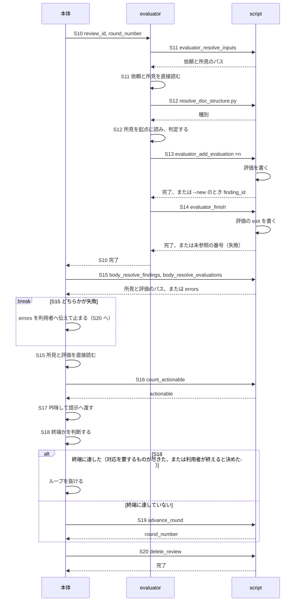
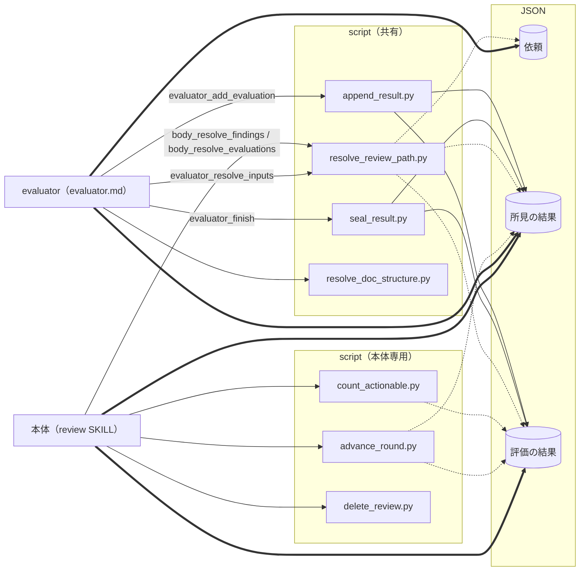

# DES-083 evaluator の独立評価とメタ観点 設計書

## 1. 概要

[REQ-026](../requirements/REQ-026_evaluator_perspective.md) と、評価の扱いに関わる [REQ-029](../requirements/REQ-029_review_exchange.md) の要件（FNC-203・FNC-311・FNC-312・FNC-313・FNC-318・FNC-319）を実現する設計を定める。evaluator が評価を書くまでと、本体が所見・評価を読んで吟味し、ラウンドを進めて終えるまで（S10〜S20）を持つ。レビューの開始から reviewer の区間までは [DES-084](DES-084_reviewer_design.md) が持つ。

**evaluator は reviewer と同じ仕組みで動く。** 受け渡し・入力パスの解決と JSON の直接読み出し・target 種別の判定・確定後に 1 件ずつ渡すこと・終了の値は、DES-084 が reviewer について定めるものと同一である。本書が定めるのは、reviewer と異なる 3 点である。

| 段   | reviewer                           | evaluator                                                                              | 本書 |
| ---- | ---------------------------------- | -------------------------------------------------------------------------------------- | ---- |
| 入力 | 依頼                               | 依頼 **＋ reviewer が返した所見**                                                      | §4.1 |
| 作業 | **対象を起点に**問題が無いかを探す | **所見を起点に**当否を判定し、見落としを新規に指摘する                                 | §4.1 |
| 出力 | 所見（finding）                    | **評価（evaluation）**。evaluator が確定させた問題の定義であり、1 件が複数の所見を引く | §5   |

**読む起点が逆である。** reviewer は対象を網羅して読み所見を作るが、evaluator は所見を読んでから、それが指す箇所へ入る。**評価は所見の写しではなく、問題の再定義である。** 所見のとおり成立するなら、評価はその旨を述べる。複数の所見が 1 つの原因から出ているなら 1 件の評価に束ね、1 つの所見が別々の問題を含むなら複数の評価に分ける。

| 範囲                 | 内容                                                                                     | 章 |
| -------------------- | ---------------------------------------------------------------------------------------- | -- |
| シーケンス           | evaluator の区間と、本体が所見・評価を扱う区間、ラウンドの進行と保持物の削除（S10〜S20） | §2 |
| クラス図             | 本体・evaluator と、JSON・script の関係                                                  | §3 |
| スキル・エージェント | evaluator、本体（S10・S15〜S20）、consult（暫定措置）                                    | §4 |
| JSON                 | 評価の結果、`finding_id` の採番（evaluator の新規指摘）                                  | §5 |
| script               | 評価に関わる script、evaluator と本体のラッパー                                          | §6 |

## 2. シーケンス

evaluator の区間と、本体が所見・評価を扱う区間（S10〜S18）、ラウンドの進行と保持物の削除（S19・S20）である。図の S 番号は DES-084 §2 と同じである。S5〜S19 はラウンドごとに繰り返し、S5〜S9 は reviewer の区間（DES-084 §2）である。S10・S17・S18 は script を呼ばない（AI の判断、または起動である）。「書く」は script が JSON を書く処理、「直接読む」は AI が JSON を読む処理で、どちらも自分の処理である。



**エラーフロー:** 所見が正常に封緘されていなければ、S11 が失敗し、evaluator は評価に入れない。評価を書き出さずに終えた場合は、`exit` が無いまま残り、書けない異常終了になる（REQ-029 FNC-311）。どちらの場合も、S15 で本体が止まり、失敗を利用者へ伝える。reviewer が失敗していれば、所見側の `errors` にエラー値が入るので、reviewer の失敗として伝える。その結果は使わない（REQ-029 FNC-311）。evaluator が失敗していれば、そのラウンドの所見は評価を経ていないので、severity を持たない未評価の所見として報告に載せる（REQ-029 FNC-318、§4.3）。本体がレビューを止めたときも、利用者へ伝え終えてから S20 で保持物を削除する。

## 3. クラス図

本体・evaluator と、その間を取り持つ JSON・script の関係である。§2 のシーケンスの登場人物に合わせ、本体は S10〜S20 で evaluator を起こし、所見と評価を扱い、ラウンドを進めて終える処理を描く。reviewer 側の処理は [DES-084](DES-084_reviewer_design.md) が持つので、ここには描かない。点線は script が JSON を読む処理、太線は AI が JSON を直接読む処理、実線は script が JSON を書く処理を表す。



- **共有の枠は、[DES-084](DES-084_reviewer_design.md) §3 にも同じものを描く。** reviewer と evaluator の双方が使う script であり、図ごとに主体との関係を示すために両方の図へ描く。共有の枠の構成（どの script を含むか）を変えるときは、両方の図を同時に直す。

## 4. スキル・エージェント

### 4.1 evaluator

`plugins/forge/agents/evaluator.md` が持つ（REQ-026 FNC-208）。evaluator は依頼と所見を直接読むが、JSON を生成しない。出力値は script に渡すだけである。

#### reviewer と同じ部分

次は [DES-084](DES-084_reviewer_design.md) が定めるものをそのまま適用する。

| 事柄                                                 | 定めている箇所          |
| ---------------------------------------------------- | ----------------------- |
| `review_id`・`round_number` による受け渡しと、置き場 | DES-084 §5.1            |
| 基本の script の一覧と、共通の約束                   | DES-084 §6.1・§6.6      |
| `finding_id` の採番                                  | DES-084 §5.5、本書 §5.2 |
| 終了の値と成否                                       | DES-084 §5.4            |
| target 種別を判定する                                | DES-084 §4.2            |
| target 種別ごとに読む文書                            | DES-084 §4.2            |

対象の読み方は同じではない（下記「所見を起点に読む」）。`evaluator.md` が持つ項目は REQ-026 FNC-208 が定め、`reviewer.md` と並びは対応するが、中身が異なるのは「対象の読み方」「評価として何を述べるか」とメタ観点である。target 種別の判定と読む文書は、reviewer と同じ `criteria/review_target_types.md` を読む。`resolve_doc_structure.py` には、reviewer と同じく `--project-root ${CLAUDE_PROJECT_DIR}` を渡す。evaluator のラッパーは、第 1 引数に `${CLAUDE_PROJECT_DIR}` を置く。

**2 つの主体を別の仕組みで動かさない。** 分ければ、同じ問題への答えが 2 つになり、片方だけが直される。

#### 定義が持つもの

| 持つもの                                    | 内容                                                                         |
| ------------------------------------------- | ---------------------------------------------------------------------------- |
| script の呼び方                             | `evaluator_*` のラッパー 3 本と `resolve_doc_structure.py`（§6）             |
| 入力の各項目の扱い                          | 依頼の項目が何であり、どう扱うか。所見をどう読むか（下記）                   |
| 対象の読み方                                | 所見を起点に読む（下記）                                                     |
| target 種別の判定基準と、種別ごとに読む文書 | reviewer と同じ `criteria/review_target_types.md`（REQ-027 FNC-307・308）    |
| メタ観点                                    | FNC-201 の 5 つ（下記）                                                      |
| 評価として何を述べるか                      | `disposition` の判定、`reason` の書き方、`severity` と確信度の付け方（下記） |

#### 入力

evaluator は、依頼と reviewer が返した所見を読む（REQ-026 DM-202）。専用の入力ファイルを持たない。

| 直接読むもの | 構成                                       |
| ------------ | ------------------------------------------ |
| 依頼         | 依頼（DES-084 §5.2。DM-301）               |
| 所見         | 所見の結果（DES-084 §5.3。DM-302・DM-305） |

`evaluator_resolve_inputs` に `review_id` と `round_number` を渡すと、2 つの絶対パス（`request`、`findings`）が 1 回で返る。依頼と所見は常に対で要るので、2 回に分けない。所見が正常に終えていなければ（`exit` が `"0"` でなければ）どちらのパスも返らず、evaluator は評価に入れない。

**2 つを 1 つに束ねた入力ファイルを作らない。** 写しを作れば、原本と同じ内容が 2 箇所に置かれる。依頼は公開後に書き換えられず、結果は上書きされないので、別々に読んでも組がずれない。

evaluator はラウンドごとに 1 回起動される。読み書きするのは、受け取った `review_id` と `round_number` が指すラウンドだけである。次のラウンドでは新しい evaluator が、新しい `round_number` を受け取る。

#### 作業

reviewer と同じ種類の材料（対象・target 種別・観点文書）を読むが、読む順も、読む範囲も、使い道も異なる。

| 主体      | 読む起点 | 読んだ材料を何に使うか                                                               |
| --------- | -------- | ------------------------------------------------------------------------------------ |
| reviewer  | 対象     | 対象が規範に反していないかを探し、反していれば所見にする                             |
| evaluator | 所見     | 所見が規範と対象の実態に照らして成立するかを判定し、確定させた問題と根拠を評価に書く |

evaluator が観点文書を読むのは、所見の当否を自ら確かめるためである。読まずに判定すれば、reviewer の主張を追認するか退けるかを根拠なく決めることになり、独立評価にならない。

**所見を起点に読む**

| 手順 | 内容                                                                                              |
| ---- | ------------------------------------------------------------------------------------------------- |
| 1    | 所見 1 件を読み、`location` が指す箇所と、判断に要るだけの周辺を読む                              |
| 2    | その箇所が属するファイルの target 種別を判定する（DES-084 §4.2）                                  |
| 3    | target 種別に対応する観点文書を読む（DES-084 §4.2）。所見が規範を名指ししていれば、その規範も読む |
| 4    | 所見の主張が、読んだ規範と読んだ実態に照らして成立するかを判定する                                |

所見が指す箇所が読めないときは、エラーにしない。指摘が成立しないことを意味する判定材料であり、`invalid` または `misunderstanding` として評価する（REQ-026 FNC-319）。

対象の全文読破を課さない。判定に要る範囲を、所見ごとに evaluator が決める。ただし新規指摘（下記）は所見が指していない箇所からも生じる。依頼の `targets` が対象範囲を運んでいるので、evaluator はそこを自ら見に行ける。見に行くことを課さず、禁じもしない。網羅を課せば reviewer をもう一度やることになり、禁じれば REQ-026 FNC-206 が成立しない。

**メタ観点を働かせる**

REQ-026 FNC-201 は 5 つのメタ観点を態度として課し、出力構造を求めない。「5 項目を見たかどうかを自己申告させる」形は取らない。確かめる手段が無く、機械的にチェック欄を埋めるだけになるためである。メタ観点を働かせたことを申告させず、**働いた結果が評価そのものに現れる**形を取る。

| メタ観点が働いた結果                          | 評価に現れる形                                                            |
| --------------------------------------------- | ------------------------------------------------------------------------- |
| 複数の指摘が 1 つの原因から出ていると気づいた | 1 件の評価が複数の `finding_id` を引き、`reason` が共通原因を述べる       |
| 共通原因が reviewer の所見に無かった          | 新規指摘（`--new`）が、共通原因の問題として、束ねる所見も引く（下記）     |
| 指摘の前提となった情報が誤っていた            | `disposition: misunderstanding` と、誤りの所在を述べた `reason`           |
| 規範文書側に欠陥があった                      | `disposition: flawed_premise` と、どの文書のどこが誤りかを述べた `reason` |
| 見落としを見つけた                            | 新規に採番された `finding_id` を引く評価（下記）                          |
| 所見が既存の決定の当否を判定していた          | `disposition: invalid` と、根拠にした決定を述べた `reason`                |
| 俯瞰したが共通原因は無かった                  | 複数を引かない評価と、無いと判断した根拠を述べた `reason`                 |

最下段が要る理由は、FNC-201 が「本質・原因が無いこともある。作り出さないこと」と定めるためである。無いという判断は、束ねられていない評価として現れ、根拠は `reason` に残る。無いことを明示する専用の欄は持たない。欄があれば埋める圧力が生まれ、成立しない共通原因を書かせることになる。

**5 つのメタ観点が評価へ写る形**

5 つのメタ観点それぞれが評価へどう写るかを整理する。上 3 つは上の表の分類に現れ、下 2 つは独立した分類を持たない。

| メタ観点                         | 評価への写り方                                                                                                                                                                                                                                                               |
| -------------------------------- | ---------------------------------------------------------------------------------------------------------------------------------------------------------------------------------------------------------------------------------------------------------------------------- |
| 本質を疑う                       | 複数の `finding_id` を引く評価                                                                                                                                                                                                                                               |
| 対象の情報を疑う                 | `misunderstanding` / `flawed_premise`                                                                                                                                                                                                                                        |
| 既存の決定を外から当否判定しない | evaluator 自身への拘束であり、同時に**所見がこれを犯している場合の分類**を定める。決定そのものの当否を論じる所見は `invalid` とし、`reason` に根拠とした決定を記す。形式・論理的整合性・書き換え禁止といった手続きの違反を指摘する所見は、この分類に入れず通常どおり判定する |
| まず最も強い解釈を試す           | 独立した分類を持たない。`flawed_premise` へ至る前に尽くすべき手順として、`flawed_premise` の判定条件に組み込む                                                                                                                                                               |
| 逆から検証する                   | 独立した分類を持たない。`confidence` の決定に働く。判定が誤っている形を先に想定して確かめられたものだけが `confirmed` になる                                                                                                                                                 |

下 2 つが独立した分類を持たないのは、判定の分岐ではなく判定の質に働くメタ観点だからである。分類を新設すれば、メタ観点の数だけ `disposition` が増え、値の意味が重なる。

メタ観点は工程にしない。5 つのメタ観点は `disposition` 判定と並列の別工程ではなく、その判定を行う際の目の付け所である。工程として立てると、判定の前にメタ観点を消化する手順が生まれ、見たかどうかを自己申告させる形と同じ形骸化に至る。

5 つのメタ観点それぞれが実際の判定をどう変えるかの例は、`evaluator.md` が持つ。例はメタ観点の意味を伝える手段であって、要件でも設計でもない。

**新規に指摘する**

reviewer が返した所見のどれとも対応しない問題を見つけたとき、evaluator はそれを新規の指摘として渡す（REQ-026 FNC-206）。`evaluator_add_evaluation --new` を使う。

- **採番は script が行う。** `--new` を付けると、script が次の `finding_id` を採り（DES-084 §5.5、本書 §5.2）、その評価の `finding_ids` に加える。evaluator は番号を渡さない。
- **束ねる:** `--findings` を併せて渡すと、その評価は reviewer の所見も引く。reviewer が挙げていない共通原因を新規指摘し、既存の所見をそれに束ねる場合である（FNC-201 の 1 つ目のメタ観点）。
- **位置:** 新規指摘の番号を含む評価は、`--location` を必須とする（REQ-029 DM-201）。含まない評価は、`--location` を持てない。採番済みの新規指摘を、別の評価が `--findings` で引く場合も、その評価は `--location` を必須とする。
- **`disposition`:** `--new` の評価は `valid` とする（REQ-026 FNC-206）。`severity`・`confidence`・`fix_confident` も渡す。
- **出自:** 当該ラウンドの所見に無い番号が、evaluator の新規指摘である。件数では判定しない。別の印は持たない。

**評価の書き方**

評価は、evaluator が確定させた問題の定義である。本体は最終決定者として、この評価を吟味する（本書 §4.2）。したがって、`evaluator.md` は `reason` に次を書かせる。

| 場面                                                    | `reason` に書くこと                                                    |
| ------------------------------------------------------- | ---------------------------------------------------------------------- |
| 所見のとおり成立する                                    | その旨と、確かめた根拠                                                 |
| 所見を書き直す（原因や範囲が異なる）                    | 書き直した問題を先に書き、続けて根拠                                   |
| 複数の所見を束ねる                                      | 共通の原因と、束ねる理由                                               |
| 1 つの所見を複数の評価に分ける                          | なぜ分けるか。この評価が所見のどの部分の問題か。ほかの評価とどう違うか |
| 退ける（`invalid`・`misunderstanding`・`out_of_scope`） | 退ける根拠（どの文書のどこ、対象の実態のどこ）                         |

確定させた問題を先に書くのは、本体が評価だけを読んで、何を直すかを理解できるようにするためである。

**severity と確信度**

`evaluator.md` は、次の 3 つの値の付け方を持つ（REQ-029 DM-201）。

| 値              | 付け方                                                                                                                                                                                                                                   |
| --------------- | ---------------------------------------------------------------------------------------------------------------------------------------------------------------------------------------------------------------------------------------- |
| `severity`      | evaluator の主観で決めない。その所見が違反している規範文書の重大度カタログから転記する（[review_priorities_spec.md](../../../../plugins/forge/docs/review_priorities_spec.md) §2.2）。推測で割り当てない。`disposition` の値によらず必須 |
| `confidence`    | 指摘そのものが正しいと言えるか。確認済み（実物を見た・実行した）は `confirmed`、推論は `inferred`、記憶や推測だけは `unverified`                                                                                                         |
| `fix_confident` | その修正を責任を持って実行できるか。`confidence` が `confirmed` でなければ真にしない                                                                                                                                                     |

`confidence` と `fix_confident` は `valid` の評価だけが持つ。対象が違うので混ぜない（指摘は正しいが直し方が分からない、を表せるようにする）。

**評価を渡す**

すべての判断を確定させてから書き出す（REQ-029 FNC-310）。複数の所見を 1 件の評価で束ねる（上記）には全所見を見てから評価を確定する必要があり、1 件ずつ判断しながら書き出すと束ねる評価が書けない。

確定した評価を 1 件ずつ `evaluator_add_evaluation` へ渡す。script が、引く番号の実在、`location` の有無、確信度の制約を書く時点で確かめる（本書 §6.2）。所見が 0 件でも、所見が指していない問題は新規に指摘できる。所見も新規に指摘するものも無ければ、評価は 0 件とし、`evaluator_finish` だけを呼ぶ（REQ-026 FNC-209）。

**書き終える**

`evaluator_finish` は、そのラウンドの所見がすべていずれかの評価に引かれていれば、`exit` に `"0"` を書く。引かれていない所見が残っていれば、書かずに失敗し、その番号をすべて返す。evaluator は、まだ動いている間にその所見を評価してから、再び `evaluator_finish` を呼ぶ。足さないまま終えれば、`exit` が無いまま残り、書けない異常終了になる（REQ-029 FNC-311）。

本体が evaluator を起こし直して追加を依頼しない。evaluator は起動ごとに新しく、前回の評価を保持しないので、起こし直しても前回の判断を踏まえた追加にならない。評価を足せるのは、書き終える前の同じ evaluator だけである。

evaluator が挙げうるエラー値は無い（REQ-026 FNC-319）。`evaluator_abort` は持たない。

### 4.2 本体（所見と評価を扱う仕事）

`plugins/forge/skills/review/SKILL.md` が持つ（REQ-029 FNC-314）。本体は最終決定者である（REQ-029 FNC-312）。所見も評価も判断の材料であり、決定ではない。本節は、evaluator を起こして以降の本体の仕事（S10・S15〜S20）を定める。レビューの開始から reviewer を起こすまでは [DES-084](DES-084_reviewer_design.md) §4.1 が持つ。

#### 定義が持つもの

| 持つもの                 | 内容                                                                                                                                                                                                                          |
| ------------------------ | ----------------------------------------------------------------------------------------------------------------------------------------------------------------------------------------------------------------------------- |
| script の呼び方          | `body_resolve_findings`・`body_resolve_evaluations`、`count_actionable.py`・`advance_round.py`・`delete_review.py`（§6）。第 1 引数に `${CLAUDE_PROJECT_DIR}` を置く                                                          |
| 読む JSON の各項目の扱い | 所見（DM-302）と評価（DM-201）の各フィールドが何を意味するか。`disposition`・`confidence`・`fix_confident` の各値を含む。値が無いときは低い側として扱う（`confidence` は `unverified`、`fix_confident` は偽。REQ-029 DM-201） |
| 本体の判断               | 下記                                                                                                                                                                                                                          |

#### 本体の仕事

| S  | 仕事                               | 呼ぶ script                                         | 要件                 |
| -- | ---------------------------------- | --------------------------------------------------- | -------------------- |
| 10 | evaluator を起動する               | —                                                   | REQ-029 FNC-302      |
| 15 | 所見と評価が読めるかを確かめて読む | `body_resolve_findings`・`body_resolve_evaluations` | REQ-029 FNC-311・312 |
| 16 | 対応を要する件数を得る             | `count_actionable.py`                               | REQ-029 FNC-318      |
| 17 | 所見と評価を吟味して、提示へ渡す   | —                                                   | REQ-029 FNC-312・204 |
| 18 | 終端に達したかを判断する           | —                                                   | REQ-029 FNC-318      |
| 19 | 次のラウンドへ進む                 | `advance_round.py`                                  | REQ-029 FNC-302      |
| 20 | 保持物を削除する                   | `delete_review.py`                                  | REQ-029 FNC-302・318 |

#### 判断の内容

- **読み出しと失敗（S15）:** 所見と評価は、`body_resolve_findings` と `body_resolve_evaluations` が返したパスの JSON を、本体が直接読む（REQ-029 FNC-302）。読み出しが失敗したら、レビューを止めて `errors` を利用者へ伝える。読んだ内容から成否を判断しない（REQ-029 FNC-311・318）。reviewer が失敗していれば、所見側の `errors` にエラー値が入るので、reviewer の失敗として伝える。evaluator が失敗していれば、そのラウンドの所見は評価を経ていないので、severity を持たない未評価の所見として報告に載せる。
- **吟味（S17）:** 所見と評価を受け取った時点で、それが本当に正しいかを自分で理解し、調査し、考える。対象と規範に照らして吟味し、誤りがあれば、その誤りを理解したうえで、正しい対応を行う。`disposition`・`confidence`・`fix_confident` などの値にそのまま従って、修正・ドロップ・終端を決めない。script は行き先を決めず、`count_actionable.py` が件数を数えるだけである。`flawed_premise` は、`confidence` / `fix_confident` の値に関わらず自動修正の対象にせず、常に提示する（REQ-029 FNC-204）。この規則は本体の定義（`SKILL.md`）に書く。
- **提示の単位（S17）:** 提示は評価 1 件を単位とする。束ねた評価は 1 回だけ示し、影響する所見を列挙する。20 件の所見を 1 つの原因で束ねた評価を所見ごとに提示すると、同じ根拠を 20 回見せて 20 回採否を問うことになり、束ねられる表現を用意した意味が失われる。evaluator の新規指摘は、評価が持つ `location` と `reason` を、そのまま位置と根拠として扱う。reviewer 由来の所見を模したレコードを作らない。この対応づけのために新しいデータ構造を作らない。どの評価がどの所見に当たるかは、評価が `finding_ids` として既に持っている。本体は評価の結果を入口にし、所見の結果から `finding_ids` で所見を引く。提示から先（採否の確認・修正）は、本 feature が変えない工程である（REQ-029「レビューの進み方」節の末尾）。
- **終端の判断（S18）:** `count_actionable.py` の件数を材料に、終端に達したかを判断する（REQ-029 FNC-318）。件数を数えるのは決定論的な処理であり、AI が JSON を読んで行わない。件数が 0 のときも、`invalid`・`misunderstanding`・`out_of_scope` として退けられた所見の退け方が妥当かを、本体が内容を確かめてから終端とする。対応を要するものが尽きたときは、確認を要しない。対応を要するものが残っていても、本体が対応できない（ドロップした、または位置が確定していない）ときと、残りが軽微と本体が判断したときは、利用者へ確認し、終えるかは利用者が決める。本体が単独で打ち切らない。終端は `retains_context` によらず共通である（REQ-029 FNC-318）。
- **次のラウンド（S19）:** 終端に達していないとき、`advance_round.py` で次のラウンドの置き場を作り、新しい `round_number` を得て S5 へ戻る（REQ-029 FNC-302）。次のラウンド番号が 5 以上になるときは `advance_round.py` を呼ばず、いったん止まる（4 ラウンドを超えても所見が解消しないのは、最初の対応の方向が誤っている兆候であるため）。本質・責務・範囲を見直し、対象の設計書・要件定義書側の誤りを疑うときは、その場で書き換えず修正案を添えて利用者へ確認する。続けるか終えるかは利用者の回答に従う。
- **削除（S20）:** 終端に達したとき、エラーで止めたとき、利用者が中止したときのいずれも、報告を済ませてから削除する。報告は結果を読むためである。

### 4.3 consult（暫定措置）

**本節は暫定措置であり、本 feature の要件と設計が実装し終わった後に見直す。** それまでの間、consult を壊さずに動かすための最小限の措置だけを定め、恒久的な設計は定めない（[REQ-026](../requirements/REQ-026_evaluator_perspective.md) の「概要」）。review 本体の手順の読み替え（下記）も、記録を前提にしないという方針だけを示し、それ以上は詰めない。見直しは、実装の完了後に agenda 全面刷新の feature と合わせて行う。

#### agenda を使わない

**本 feature の実装期間中、consult は agenda への記録を行わない。** 提示に必要な状態（所見の一覧・残件・採否）を agenda を介さず自ら保持する。所見の提示（1 件ずつの採否確認）は継続する。

**理由**: agenda（`structural_judgment` の必須記録・提示フローの駆動源等）は本設計が定める評価の構造と対応が取れておらず、本 feature の後に別の差分 feature（agenda 全面刷新）で再設計される。この期間中の agenda は書き換えの途上にあり、依存したままでは提示自体が成立しない。

**影響範囲**: consult は agenda の唯一の呼び出し元であり、agenda に依存する他の主体は無い。ただし review 本体の一部の手順（段階的提示の中断報告・前回記録の破棄確認）は、consult が保持する状態を前提にしている。これらは新しい保持方式に合わせて読み替える。記録が存在しない・永続化されない前提で、報告内容・破棄判定を行う。

agenda への永続化（ファイルに残す・後で見返す・表示の改訂）は、agenda 全面刷新の feature が扱う。

#### 状態はコンテキストに持つ

consult は agenda を呼ばない。提示に必要な状態（所見の一覧・残件・採否）は会話コンテキストに保持する。

consult は継承型 SKILL であり、review 本体を実行しているのと同じ会話が振る舞いを切り替えるだけである。評価内容も対話進行の結果もコンテキストに残る。review 起点では提示する所見が上流から渡るため、consult 自身が論点を立てる工程も要らない。

固有の状態ファイル・作業ディレクトリ・DB は持たない。提示状態は永続化されず、会話が終われば失われる。

#### 未対応所見の出所

review 本体の要約報告は、未対応所見の一覧と理由を**会話コンテキストから得る**。対象は次のすべてである。

| 出所                       | 内容                                                                                                                         |
| -------------------------- | ---------------------------------------------------------------------------------------------------------------------------- |
| **未評価の所見**           | evaluator が評価を書き終えられずに異常終了し、評価を経ないまま止まったラウンドの所見。severity を持たない（REQ-029 FNC-318） |
| 位置未確定                 | 修正対象を特定できないため対象外とした所見                                                                                   |
| 評価でドロップ             | `invalid` / `misunderstanding` / `out_of_scope` と判定された所見                                                             |
| 利用者が採用しなかった所見 | 提示の結果、採用しないと決まった所見                                                                                         |

提示を中断した場合は、未判断の件数を示す。**未判断を「対応不要」へ畳み込まない。**

記録から生成された表示物への参照を報告に含めない。永続化された表示物を持たないためである。

## 5. JSON

### 5.1 評価の結果（`evaluate_result.json`）

構造は REQ-029 DM-305（evaluator の結果）と DM-201（evaluation）が定める。evaluator がラウンドごとに 1 つ書く。置き場は、DES-084 §5.1 のラウンドの置き場に並べる（`<review_id>/<round_number>/evaluate_result.json`）。終了の値は `"0"` だけである（エラー値は無い。REQ-026 FNC-319）。`resolve_review_path.py` の成否の判定は、DES-084 §5.4 の表と同じである。

| 書く                                                                                               | 読む                                                                                                       |
| -------------------------------------------------------------------------------------------------- | ---------------------------------------------------------------------------------------------------------- |
| `append_result.py --kind evaluations`（評価の追記）、`seal_result.py --kind evaluations`（`exit`） | 本体（パスを `resolve_review_path.py` から得て直接読む）。`count_actionable.py`・`advance_round.py` も読む |

```json
{
  "evaluations": [
    {
      "finding_ids": [3, 7],
      "disposition": "valid",
      "severity": "major",
      "reason": "…",
      "confidence": "confirmed",
      "fix_confident": true
    },
    {
      "finding_ids": [5, 8],
      "disposition": "valid",
      "severity": "minor",
      "reason": "…",
      "confidence": "inferred",
      "fix_confident": false,
      "location": ["/abs/path/to/project/docs/rules/foo.md:42"]
    }
  ],
  "exit": "0"
}
```

上の 2 件目は、reviewer の所見 5 と、evaluator が新規に指摘した 8（そのラウンドの reviewer の所見に無い番号）を束ねた評価であり、新規指摘の番号を含むので `location` を持つ。1 件目は reviewer の所見だけを引くので、`location` を持たない（位置は所見の側にある）。

| フィールド                                                                     | 書く script                                                  |
| ------------------------------------------------------------------------------ | ------------------------------------------------------------ |
| `finding_ids`                                                                  | `append_result.py`（`--findings…` と、`--new` で採った番号） |
| `disposition`、`severity`、`reason`、`confidence`、`fix_confident`、`location` | `append_result.py`（各オプション、標準入力）                 |
| `exit`                                                                         | `seal_result.py`                                             |

reviewer の所見（DES-084 §5.3）との違いは 2 つである。

| 違い                        | 内容                                                                                                                              |
| --------------------------- | --------------------------------------------------------------------------------------------------------------------------------- |
| `finding_ids` が可変長      | 評価は判定の単位であり、1 個以上の所見を引く。1 対 1 の対応を課さない（DM-201）。これが §4.1 のメタ観点の表を成立させる構造である |
| `location` は条件付きで持つ | 新規指摘の番号を含むときだけ持つ（DM-201）                                                                                        |

**所見と評価の関係は、評価を書く時点で script が保証する**（REQ-029 FNC-203）。

| 保証                                                                              | 保証する script    |
| --------------------------------------------------------------------------------- | ------------------ |
| 評価が引く番号は、そのラウンドに存在する（reviewer の所見か、採番済みの新規指摘） | `append_result.py` |
| 新規指摘の番号を含む評価は `location` を持ち、含まない評価は持たない              | `append_result.py` |
| 正常に書き終えた評価では、そのラウンドの全所見が、いずれかの評価に引かれている    | `seal_result.py`   |

本体は、関係を検査しない。正常に書き終えた評価には、未参照の所見も、存在しない番号も、位置の無い新規指摘も無い。

### 5.2 `finding_id`

`finding_id` の基本の採り方は DES-084 §5.5 が定める。本節は、evaluator の新規指摘が加わる部分を定める（REQ-029 FNC-313）。

- **次の番号:** そのレビューの全ラウンドの所見と評価に現れる `finding_id` の最大値の次。どれにも無ければ `1`。reviewer と evaluator が 1 本の連番を分け合う。同じラウンドでは reviewer が先に採り、evaluator の新規指摘はその次から続く。
- **同じ番号を 2 つの script が同時に採らない:** evaluator は所見が正常に封緘されていなければ始まらず（S11）、`advance_round.py` は所見と評価がともに正常に封緘されていなければ次のラウンドを作らない（S19）。
- **出自:** 当該ラウンドの所見に無い番号で、当該ラウンドの評価に現れるものが、evaluator が新規に指摘したものである。件数では判定しない（第 2 ラウンド以降は番号が `1` から始まらない）。

## 6. script

基本の script の共通の約束と、所見に関わる動作は [DES-084](DES-084_reviewer_design.md) §6 が持つ。本節は、評価に関わる動作と、evaluator・本体のラッパーを定める。

### 6.1 evaluator のラッパー

evaluator は、次のラッパーを通して基本の script を呼ぶ。`--kind evaluations` を固定するので、evaluator の定義には所見を書く口が現れない。

| ラッパー                      | 呼ぶもの                               | 受け取る引数                                                                                                                                                                          | S  |
| ----------------------------- | -------------------------------------- | ------------------------------------------------------------------------------------------------------------------------------------------------------------------------------------- | -- |
| `evaluator_resolve_inputs.py` | `resolve_review_path.py --kind inputs` | `<project_root> <review_id> <round_number>`                                                                                                                                           | 11 |
| `evaluator_add_evaluation.py` | `append_result.py --kind evaluations`  | `<project_root> <review_id> <round_number> --disposition D --severity V [--findings N…] [--new] [--location L…] [--confidence C] [--fix-confident true\|false]`。標準入力: 判定の根拠 | 13 |
| `evaluator_finish.py`         | `seal_result.py --kind evaluations`    | `<project_root> <review_id> <round_number>`                                                                                                                                           | 14 |

- S11: 依頼と所見が読める状態かを判定し、2 つの絶対パス（`request`、`findings`）を返す（§6.4）。
- S13: 評価を 1 件追記する。`--new` のとき新規指摘の番号を採る。書く時点の保証は §6.2 のエラーが持つ。
- S14: 評価を封緘する。全所見が引かれていることを保証する（§6.3）。

### 6.2 `append_result.py --kind evaluations`

**責務:** 評価を 1 件追記する。`finding_id` を採る（`--new` のとき）。所見との関係を、書く時点で保証する（REQ-029 FNC-310・313・203、DM-201）。共通の動作は DES-084 §6.3 と同じである（置き場の実在の確認、封緘済みなら失敗、ファイルが無ければ空の配列から始める）。

| 入力                                                                                                                                               | 出力                                                                          |
| -------------------------------------------------------------------------------------------------------------------------------------------------- | ----------------------------------------------------------------------------- |
| `<project_root> <review_id> <round_number> --kind evaluations`。読む: 全ラウンドの所見と評価の結果。当該ラウンドの所見の結果。標準入力: 評価の根拠 | 書く: 評価の結果。標準出力: `--new` の評価では `{"finding_id": n}`、他は `{}` |

| 引数                          | 内容                                                                                 |
| ----------------------------- | ------------------------------------------------------------------------------------ |
| `--disposition`               | `invalid` / `misunderstanding` / `out_of_scope` / `flawed_premise` / `valid`（必須） |
| `--severity`                  | `critical` / `major` / `minor`（必須）                                               |
| `--findings N…`               | 引く番号                                                                             |
| `--new`                       | 新規指摘の番号を採り、この評価が引く番号に加える                                     |
| `--location L…`               | 新規指摘の番号を含む評価の位置                                                       |
| `--confidence`                | `confirmed` / `inferred` / `unverified`（`valid` のとき必須）                        |
| `--fix-confident true\|false` | その修正を責任を持って実行できるか（`valid` のとき必須）                             |
| 標準入力                      | 判定の根拠（`reason`）                                                               |

**動作**

1. `--new` のとき、次の `finding_id` を採る（§5.2）。
2. `finding_ids` を、`--findings` の番号（渡した順）と、続けて `--new` で採った番号で作る。
3. `{"finding_ids", "disposition", "severity", "reason"}` に、`valid` のとき `confidence` と `fix_confident`、新規指摘の番号を含むとき `location` を加えて、`evaluations` へ追記する。

**エラー**（いずれも何も書かない）

| 条件                                                                                                                              | 根拠                    |
| --------------------------------------------------------------------------------------------------------------------------------- | ----------------------- |
| 当該ラウンドの所見の結果が、正常に封緘されていない                                                                                | REQ-026 DM-202          |
| 評価の結果が封緘済み                                                                                                              | REQ-029 FNC-310         |
| `--findings` も `--new` も無い                                                                                                    | DM-201（1 個以上）      |
| `--findings` の番号が、当該ラウンドの所見にも、当該ラウンドの評価に既にある新規指摘の番号にも無い（その番号を `errors` に入れる） | REQ-029 FNC-203         |
| 新規指摘の番号を含む（`--new`、または既にある新規指摘の番号を引く）のに `--location` が無い。含まないのに `--location` がある     | DM-201                  |
| `--new` なのに `--disposition` が `valid` でない                                                                                  | REQ-026 FNC-206         |
| `valid` なのに `--confidence` または `--fix-confident` が無い。`valid` 以外に、この 2 つを渡した                                  | DM-201                  |
| `--fix-confident true` なのに `--confidence` が `confirmed` でない                                                                | DM-201                  |
| 根拠（標準入力）が空                                                                                                              | DM-201（`reason` 必須） |

### 6.3 `seal_result.py --kind evaluations`

**責務:** 評価の結果を封緘する。全所見が引かれていることを保証する（REQ-029 FNC-311・203、REQ-026 FNC-319）。

| 入力                                                                                                                                       | 出力                                      |
| ------------------------------------------------------------------------------------------------------------------------------------------ | ----------------------------------------- |
| `<project_root> <review_id> <round_number> --kind evaluations`、`--exit V`（省略すると `"0"`）。読む: 当該ラウンドの所見の結果と評価の結果 | 書く: 評価の結果の `exit`。標準出力: `{}` |

**動作**

1. `--exit` の値が `"0"` であることを確かめる（evaluator が挙げうるエラー値は無い）。含まなければ引数の誤りとする（終了コード 2）。
2. 結果が無ければ、`evaluations` が空配列の結果を作る（0 件のときも `exit` を書けるようにする）。
3. 当該ラウンドの所見の結果が正常に封緘されていることを確かめ、所見の `finding_id` のうち、どの評価の `finding_ids` にも無いものを数える。
4. `exit` を書く。

**エラー（終了コード 1）:** 既に封緘済み。所見の結果が正常に封緘されていない。引かれていない所見が残っている（その `finding_id` をすべて `errors` に入れ、何も書かない）。

### 6.4 `resolve_review_path.py --kind inputs|evaluations`

**責務:** 読み出せる状態かを判定し、絶対パスを返す。JSON 本文は返さない（REQ-029 FNC-302・311）。`--kind request|findings` と共通の約束は DES-084 §6.5 が持つ。

| 入力                                                                                                       | 出力                                                                                                        |
| ---------------------------------------------------------------------------------------------------------- | ----------------------------------------------------------------------------------------------------------- |
| `<project_root> <review_id> <round_number> --kind inputs\|evaluations`。読む: 依頼、所見の結果、評価の結果 | 標準出力: `{"path": …}`。`inputs` は `{"request": …, "findings": …}`。正常でなければ失敗し、`errors` に理由 |

| `--kind`      | 判定                                                                                              |
| ------------- | ------------------------------------------------------------------------------------------------- |
| `evaluations` | `evaluate_result.json` の状態を DES-084 §5.4 の表で判定する                                       |
| `inputs`      | `request` と `findings` の両方を判定する。片方でも失敗すれば失敗し、`errors` に両方の理由を入れる |

### 6.5 `count_actionable.py`

**責務:** 対応を要する評価の件数を数える。何も書かず、返すのは件数だけで、所見と評価の JSON 本文は返さない（REQ-029 FNC-318）。

| 入力                                                                          | 出力                          |
| ----------------------------------------------------------------------------- | ----------------------------- |
| `<project_root> <review_id> <round_number>`。読む: 評価の結果の `disposition` | 標準出力: `{"actionable": n}` |

**動作:** 評価の結果が正常に封緘されていることを確かめ、`disposition` が `valid` または `flawed_premise` の評価を数える。

**エラー（終了コード 1）:** 評価の結果が無い、または正常に封緘されていない。

### 6.6 `advance_round.py`

**責務:** 次のラウンドの置き場を作る。依頼も、採番のための状態も作らない（REQ-029 FNC-302・313）。

| 入力                                                                         | 出力                                                                 |
| ---------------------------------------------------------------------------- | -------------------------------------------------------------------- |
| `<project_root> <review_id> <round_number>`。読む: 所見と評価の結果の `exit` | 標準出力: `{"round_number": <次の値>}`（書く: 次のラウンドの置き場） |

**動作:** 当該ラウンドの所見の結果と評価の結果が、どちらも正常に封緘されていることを確かめ、`<round_number + 1>/` を作る。

**エラー（終了コード 1）:** 所見または評価の結果が、正常に封緘されていない。次のラウンドの置き場が既に存在する。

### 6.7 `delete_review.py`

**責務:** そのレビューの保持物を、依頼・所見・評価ともにすべて削除する（REQ-029 FNC-302・318）。

| 入力                         | 出力           |
| ---------------------------- | -------------- |
| `<project_root> <review_id>` | 標準出力: `{}` |

**動作:** `review_id` を検査し、`<review_id>/` をディレクトリごと削除する。置き場が無いときも成功する。

**`review_id` の検査:** この script は再帰的に削除するので、`review_id` が `.temp/review/` の外を指す値を拒む。`review_id` は、ディレクトリ名 1 つでなければならない（空、`.`、`..`、パス区切り（`/`、`\`）、NUL を含まない）。`<review_id>/` がシンボリックリンクのときも拒む（リンク先を削除しない）。他の script（`count_actionable.py`・`advance_round.py` など）は、破壊的な削除を行わないので、`review_id` を検査しない。

**エラー（終了コード 1）:** `review_id` が検査を通らない（何も削除しない）。`<review_id>/` がシンボリックリンクである（何も削除しない）。削除できない。

### 6.8 本体のラッパー

ラッパーの考え方は DES-084 §6.6 と同じである。本体は、所見と評価を読むために、次のラッパーを通して `resolve_review_path.py` を呼ぶ。決定論的なオプションを持たない基本の script（`count_actionable.py`・`advance_round.py`・`delete_review.py`）は直接呼ぶ。

| ラッパー                      | 呼ぶもの                                    | S  |
| ----------------------------- | ------------------------------------------- | -- |
| `body_resolve_findings.py`    | `resolve_review_path.py --kind findings`    | 15 |
| `body_resolve_evaluations.py` | `resolve_review_path.py --kind evaluations` | 15 |

## 7. テスト設計

所見に関わる script の単体テストは DES-084 §7 が持つ。本書は、評価に関わる script の単体テストと、evaluator と本体の定義の契約、評価を通した流れを確かめる。

**単体テスト対象**

- `append_result.py` / `seal_result.py`（`evaluations`）: evaluator が前ラウンドで採った番号を含めて `finding_id` が連番になること。封緘後の追記が拒まれること。§6.2 の評価のエラーが、1 つ 1 つ拒まれること。0 件でも空配列の結果が作られること。エラー値の集合が閉じていること（`evaluations` は `"0"` だけ）。引かれていない所見が残るとき、`seal_result.py` が失敗してその番号をすべて返すこと。
- `resolve_review_path.py`（`inputs` / `evaluations`）: 正常でない結果（エラー値、`exit` が無い、結果が無い）で失敗し、`errors` に理由が入ること。`inputs` は片方でも失敗すれば失敗すること。
- `count_actionable.py`: `valid` と `flawed_premise` だけを数えること。評価の結果が正常に封緘されていなければ失敗すること。
- `advance_round.py`: 所見と評価がどちらも正常に封緘されていなければ失敗すること。次のラウンドの置き場が既に存在すれば失敗すること。
- `delete_review.py`: `<review_id>/` がディレクトリごと削除されること。置き場が無くても成功すること。`.temp/review/` の外を指す `review_id`（空、`.`、`..`、パス区切りを含む値）とシンボリックリンクが、何も削除されずに拒まれること。
- ラッパー: `evaluator_*` が、評価以外に書けないこと。

**契約テスト対象**

- 本体の定義（`SKILL.md`）が、`disposition` などの値にそのまま従わず、内容を吟味してから修正・ドロップ・終端を決める指示を持つこと。

- `evaluator.md` が持つ script の呼び方が、§6 の `evaluator_*` のラッパーと `resolve_doc_structure.py` の実際の引数と一致すること。`evaluator.md` に `reviewer_*` と `body_*` が現れないこと。第 1 引数に `${CLAUDE_PROJECT_DIR}` を置き、`resolve_doc_structure.py` に `--project-root ${CLAUDE_PROJECT_DIR}` を渡すこと。
- `evaluator.md` が、`criteria/review_target_types.md`（DES-084 §4.2）を読む指示を持つこと。
- `evaluator.md` が REQ-026 FNC-208 の項目をすべて持つこと。
- `evaluator.md` が FNC-201 の 5 つのメタ観点すべてと、`disposition` の 5 値を持つこと。
- `evaluator.md` が、`reason` の書き方（§4.1 の各場面）を持つこと。

**統合テスト対象**

- evaluator が `evaluator_resolve_inputs` の返す 2 パスから依頼と所見の結果を直接読み、評価の結果を書いて終えるまでが成立すること。
- 次の各ケースで、所見から評価の書き出しまでが成立すること: 複数の所見を束ねる評価、1 つの所見を複数の評価に分ける場合、新規指摘だけの評価、新規指摘と reviewer の所見を束ねる評価、所見が 0 件で新規指摘だけがある場合、所見も新規指摘も無く評価が 0 件の場合。
- evaluator が所見を引き残したまま `evaluator_finish` を呼んだとき、失敗して引き残した番号をすべて返し、evaluator が評価を足してから書き終えられること。足さないまま終えた場合、本体が S15 で止まって利用者へ伝えること。
- reviewer が `target_unreadable` で終えたとき、本体が S15 で止まって、エラー値を利用者へ伝えること。reviewer が書き出さずに終えたときも、本体が S15 で止まること。
- 終端に達していないとき、`advance_round.py` で次のラウンドへ進むこと。終端に達したとき、エラーで止めたとき、利用者が中止したときのいずれも、`delete_review.py` で保持物が削除されること。

## 8. 未確定事項

| ID      | 内容                                                                                                                                                                                                        | 期限   |
| ------- | ----------------------------------------------------------------------------------------------------------------------------------------------------------------------------------------------------------- | ------ |
| TBD-001 | FNC-201 の 5 つのメタ観点を evaluator が実際に働かせられるかは未検証（[REQ-026](../requirements/REQ-026_evaluator_perspective.md) TBD-001 を継承）。§4.1 の「評価に現れる形」が実際に観測できるかで検証する | 実装後 |
