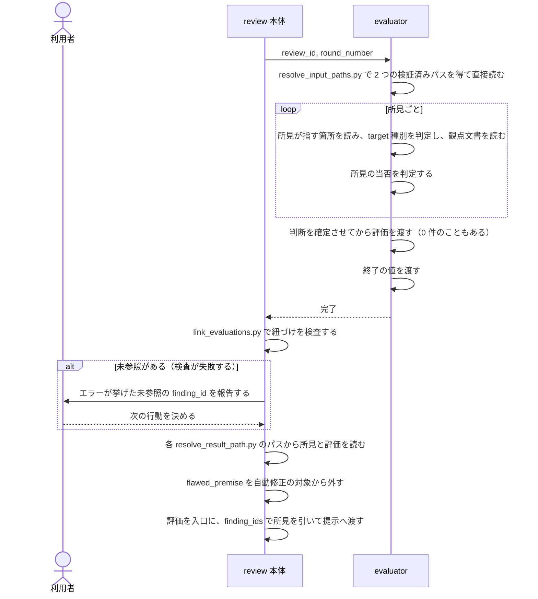

# DES-083 evaluator の独立評価とメタ観点 設計書

## 1. 概要

[REQ-026](../requirements/REQ-026_evaluator_perspective.md) と、評価の扱いに関わる [REQ-029](../requirements/REQ-029_review_exchange.md) の要件（FNC-203・FNC-204）を実現する設計を定める。

**evaluator は reviewer と同じ仕組みで動く。** 受け渡し・入力パスの解決と JSON の直接読み出し・target 種別の判定・target 種別ごとに読む文書・確定後に 1 件ずつ渡すこと・終了の値は、[DES-084](DES-084_reviewer_design.md) が reviewer について定めるものと同一である（§4）。

本書が定めるのは、**reviewer と異なる 3 点**と、本体が評価をどう扱うかである。

| 段   | reviewer                           | evaluator                                              | 本書 |
| ---- | ---------------------------------- | ------------------------------------------------------ | ---- |
| 入力 | 依頼                               | 依頼 **＋ reviewer が返した所見**                      | §5   |
| 作業 | **対象を起点に**問題が無いかを探す | **所見を起点に**当否を判定し、見落としを新規に指摘する | §6   |
| 出力 | 所見（finding）                    | **評価（evaluation）**。1 件が複数の所見を引く         | §7   |

作業の差が本設計の中心である。**読む起点が逆である**——reviewer は対象を網羅して読み所見を作るが、evaluator は所見を読んでから、それが指す箇所へ入る（§6.1）。**器がメタ観点を制約する**——評価が所見と 1 対 1 に固定されている限り、複数の指摘が 1 つの原因から出ていると気づいても、それを表現する場所が無い。

## 2. シーケンス



提示から先（採否の確認・修正）は本書の範囲ではない。evaluator を起動するところまでの流れは [DES-084](DES-084_reviewer_design.md) §2 が持つ。

**エラーフロー**: 終了の値が `"0"` でなければ、その評価はエラーである。結果そのものが無い場合も同じ（[DES-084](DES-084_reviewer_design.md) §4.4）。未参照の `finding_id` があれば、そのまま結合せず利用者へ報告する（REQ-029 FNC-203、§8.4）。

## 3. 責務

| 担い手                           | 責務                                                                           | 要件              |
| -------------------------------- | ------------------------------------------------------------------------------ | ----------------- |
| evaluator                        | 依頼と所見を直接読み、所見が指す箇所と観点文書を読み、当否を判定して評価を渡す | FNC-201・206・209 |
| `evaluator.md`                   | script の呼び方、入力の各項目の扱い、メタ観点、評価として何を述べるか          | FNC-208           |
| `scripts/evaluator/` の各 script | 評価と終了の値を書き、評価結果の検証済みパスを本体へ返し、紐づけを検証する     | FNC-203・209      |
| review 本体                      | 未参照があれば結合せず、利用者へ報告する                                       | FNC-203           |
| review 本体                      | `flawed_premise` を自動修正の対象から外す                                      | FNC-204           |
| review 本体                      | 評価が食い違ったときに調停する                                                 | DM-201            |
| consult                          | 所見を 1 件ずつ提示し、採否を得る。状態を自ら保持する                          | §9（暫定措置）    |

## 4. reviewer と同じ部分

次は [DES-084](DES-084_reviewer_design.md) が定めるものをそのまま適用する。本書は繰り返さない。

| 事柄                                       | 定めている箇所                             |
| ------------------------------------------ | ------------------------------------------ |
| `review_id`・`round_number` による受け渡し | [DES-084](DES-084_reviewer_design.md) §4.1 |
| 値の受け渡し（標準入力）                   | 同 §4.5                                    |
| 形式の検証を置かない                       | 同 §4.6                                    |
| 1 件ずつ渡す                               | 同 §4.2                                    |
| `finding_id` の採番                        | 同 §4.2「採番」                            |
| 確定後に書き出す                           | 同 §4.2（FNC-310）                         |
| 終了の値                                   | 同 §4.4                                    |
| 結果の構造                                 | 同 §5.3                                    |
| 定義が JSON を組み立てる構造を持たないこと | 同 §6.1                                    |
| target 種別を判定する                      | 同 §6.3                                    |
| target 種別ごとに読む文書                  | 同 §6.4                                    |

**対象の読み方は同じではない**（§6.1）。reviewer は対象を網羅して読むが、evaluator は所見を起点に読む。

**2 つの主体を別の仕組みで動かさない。** 分ければ、同じ問題への答えが 2 つになり、片方だけが直される。

**定義が持つ項目そのものは同じではない。** 上表に入れていないのはそのためである。`evaluator.md` が持つ項目は FNC-208 が定め、`reviewer.md`（[REQ-027](../requirements/REQ-027_reviewer.md) FNC-301）と対応する並びだが、**target 種別の判定基準と読む文書の代わりにメタ観点を持つ**（target 種別と読む文書は reviewer と同じものを用いる）。中身が異なるのは「対象の読み方」「出力として何を述べるか」とメタ観点（§6）である。共通なのは、JSON を組み立てる構造を持たないという一点だけである。

## 5. evaluator の入力

evaluator は、依頼と reviewer が返した所見を読む（DM-202）。**専用の入力ファイルを持たない。**

| 直接読むもの | 構成                                                                |
| ------------ | ------------------------------------------------------------------- |
| 依頼         | `review_request.json`（[DES-084](DES-084_reviewer_design.md) §5.1） |
| 所見         | `review_result.json`（同 §5.3）                                     |

**パスは 1 回の呼び出しで両方を得る。** evaluator は `review_id` と `round_number` を `resolve_input_paths.py`（§7.3）へ渡し、返された 2 つの正規化済み絶対パスから依頼と所見を Read で直接読む。JSON 本文を resolver の標準出力で受け取らず、別主体に書き写させない。

**依頼と所見は常に対で要る。** evaluator が片方だけを使う場面が無いため、2 回に分けず 1 操作とする。パスの組み立てと成否の判定は既存の 2 本（`scripts/review/resolve_request_path.py` と `scripts/reviewer/resolve_result_path.py`）が持ち、`resolve_input_paths.py` はそれらを内部で呼ぶだけで、同じ規則を持ち直さない。

**2 つを 1 つに束ねた入力ファイルを作らない。** 束ねれば原本と同じ内容が写しとして 2 箇所に置かれ、写しを作る script とその公開状態も要る。依頼は公開後に書き換えられず、結果は上書きされないため、別々に読んでも組がずれない。**`evaluate_request.json` が運んでいた情報のうち、原本に無いものは 1 つも無かった。**

**レビューが正常終了していなければ、パス解決が失敗する。** 所見の終了の値が `"0"` でなければ `resolve_input_paths.py` はどちらのパスも返さない（[DES-084](DES-084_reviewer_design.md) §4.4）。evaluator はそこで止まり、評価に入れない。本体が確認の段を持つ必要はない。

**evaluator はラウンドごとに 1 回起動される。** 読み書きするのは、受け取った `review_id` と `round_number` が指すラウンドだけである。次ラウンドでは新しい evaluator が新しい `round_number` を受け取り、そのラウンドの依頼と所見を読んで評価を書く。1 回の起動で未参照があっても、同じラウンドの evaluator を再び起動しない（§8.4）。

## 6. 作業

reviewer と同じ種類の材料（対象・target 種別・観点文書）を読むが、**読む順も、読む範囲も、使い道も異なる**。

| 主体      | 読む起点 | 読んだ材料を何に使うか                                                               |
| --------- | -------- | ------------------------------------------------------------------------------------ |
| reviewer  | 対象     | 対象が規範に反していないかを探し、反していれば所見にする                             |
| evaluator | 所見     | 所見が規範と対象の実態に照らして成立するかを判定し、成立しない理由を `reason` に書く |

evaluator が観点文書を読むのは、**所見の当否を自ら確かめるため**である。読まずに判定すれば、reviewer の主張を追認するか退けるかを根拠なく決めることになり、独立評価にならない。

### 6.1 所見を起点に読む

**読む順が reviewer と逆である。** reviewer は対象を読んでから所見を作る。evaluator は所見を読んでから、その所見が何を指しているかを追って対象へ入る。

| 手順 | 内容                                                                                           |
| ---- | ---------------------------------------------------------------------------------------------- |
| 1    | 所見 1 件を読み、`location` が指す箇所と、判断に要るだけの周辺を読む                           |
| 2    | その箇所が属するファイルの target 種別を判定する（[DES-084](DES-084_reviewer_design.md) §6.3） |
| 3    | target 種別に対応する観点文書を読む（同 §6.4）。所見が規範を名指ししていれば、その規範も読む   |
| 4    | 所見の主張が、読んだ規範と読んだ実態に照らして成立するかを判定する                             |

**対象の全文読破を課さない。** 所見が指していない箇所まで網羅して読めというのは reviewer の規定（同 §6.2）であり、evaluator には当たらない。判定に要る範囲を、所見ごとに evaluator が決める。

ただし FNC-206 の新規指摘は、所見が指していない箇所からも生じる。依頼の `targets` が対象範囲を運んでいるため、evaluator はそこを自ら見に行ける。**見に行くことを課さず、禁じもしない**——網羅を課せば reviewer をもう一度やることになり、禁じれば FNC-206 が成立しない。

### 6.2 メタ観点を働かせる（FNC-201）

FNC-201 は 5 つのメタ観点を**態度として**課し、出力構造を求めない。検討の過程で「5 項目を見たかどうかを自己申告させる」形が検討され、**確かめる手段が無く機械的にチェック欄を埋めるだけになる**として不採用になっている。

したがって本設計は、メタ観点を働かせたことを申告させず、**働いた結果が評価そのものに現れる**形を取る。

| メタ観点が働いた結果                          | 評価に現れる形                                                            |
| --------------------------------------------- | ------------------------------------------------------------------------- |
| 複数の指摘が 1 つの原因から出ていると気づいた | 1 件の評価が複数の `finding_id` を引き、`reason` が共通原因を述べる       |
| 指摘の前提となった情報が誤っていた            | `disposition: misunderstanding` と、誤りの所在を述べた `reason`           |
| 規範文書側に欠陥があった                      | `disposition: flawed_premise` と、どの文書のどこが誤りかを述べた `reason` |
| 見落としを見つけた                            | 新規に採番された `finding_id` を引く評価（§6.4）                          |
| 所見が既存の決定の当否を判定していた          | `disposition: invalid` と、根拠にした決定を述べた `reason`                |
| 俯瞰したが共通原因は無かった                  | 複数を引かない評価と、無いと判断した根拠を述べた `reason`                 |

最下段が要る理由は、FNC-201 が「本質・原因が無いこともある。作り出さないこと」と定めるためである。無いという判断は、束ねられていない評価として現れ、根拠は `reason` に残る。**無いことを明示する専用の欄は持たない**——欄があれば埋める圧力が生まれ、成立しない共通原因を書かせることになる。

### 6.3 5 つのメタ観点が評価へ写る形

メタ観点のうち 3 つは §6.2 の表に現れる。残る 2 つの写り方を定める——定めなければ、メタ観点に反する所見を前にした evaluator が、どの分類へ落とすかを推測で決めることになる。

| メタ観点                         | 評価への写り方                                                                                                                                                                                                                                                               |
| -------------------------------- | ---------------------------------------------------------------------------------------------------------------------------------------------------------------------------------------------------------------------------------------------------------------------------- |
| 本質を疑う                       | 複数の `finding_id` を引く評価                                                                                                                                                                                                                                               |
| 対象の情報を疑う                 | `misunderstanding` / `flawed_premise`                                                                                                                                                                                                                                        |
| 既存の決定を外から当否判定しない | evaluator 自身への拘束であり、同時に**所見がこれを犯している場合の分類**を定める。決定そのものの当否を論じる所見は `invalid` とし、`reason` に根拠とした決定を記す。形式・論理的整合性・書き換え禁止といった手続きの違反を指摘する所見は、この分類に入れず通常どおり判定する |
| まず最も強い解釈を試す           | 独立した分類を持たない。`flawed_premise` へ至る前に尽くすべき手順として、`flawed_premise` の判定条件に組み込む                                                                                                                                                               |
| 逆から検証する                   | 独立した分類を持たない。`confidence` の決定に働く——判定が誤っている形を先に想定して確かめられたものだけが `confirmed` になる                                                                                                                                                 |

下 2 つが独立した分類を持たないのは、**判定の分岐ではなく判定の質に働くメタ観点だから**である。分類を新設すれば、メタ観点の数だけ `disposition` が増え、値の意味が重なる。

**メタ観点は工程にしない。** 5 つのメタ観点は `disposition` 判定と並列の別工程ではなく、その判定を行う際の目の付け所である。工程として立てると、判定の前にメタ観点を消化する手順が生まれ、見たかどうかを自己申告させる形と同じ形骸化に至る。

5 つのメタ観点それぞれが実際の判定をどう変えるかの例は、`evaluator.md` が持つ。例はメタ観点の意味を伝える手段であって、要件でも設計でもない。加えて、例は実運用でメタ観点が空振りした事例から補充されるべきもので、更新の頻度が要件・設計と異なる。

### 6.4 新規に指摘する

reviewer が返した所見のどれとも対応しない問題を見つけたとき、evaluator はそれを新規の指摘として渡す（FNC-206）。`finding_id` は script が、そのラウンドで reviewer が採番した最大の ID の次から採る。

- **そのラウンドの `review_result.json` に現れる最大の `finding_id` を超えること自体が出自を表す。** 別の印を足さない
- **出自を件数で判定しない。** 第 2 ラウンド以降は `finding_id` が 1 から始まらないため、所見の件数と ID の値は一致しない。判定の境界は常に、そのラウンドで reviewer が採番した最大の ID である。そのラウンドで reviewer が 0 件だった場合、境界はそのラウンドの採番基点の 1 つ手前となる
- この評価は `location` を持つ。参照先の所見が存在しないため、位置を自ら示す
- 新規に発見した問題は evaluator 自身が成立すると判断した指摘なので、`disposition` は `valid` とする（[REQ-026](../requirements/REQ-026_evaluator_perspective.md) FNC-206）。`add_new_finding_evaluation.py` が採番と、DM-201 の必須フィールドをすべて持つ evaluation の追加を 1 回の操作で行う。採番だけの中間状態は作らず、続けて `add_valid_evaluation.py` を呼ぶ二段階の操作にも分けない。採番の規則は [DES-084](DES-084_reviewer_design.md) §4.2「採番」が定め、reviewer と共通の 1 本の連番から取る

## 7. 出力

### 7.1 evaluator の出力ファイル `evaluate_result.json`

`evaluate_result.json` は、evaluation の配列と終了の値を 1 つの構造として保持する（REQ-029 DM-305）。evaluation 1 件の構造は次のとおりである（REQ-029 DM-201）。

```json
{
  "finding_ids": [3, 7],
  "disposition": "valid",
  "severity": "major",
  "reason": "…",
  "confidence": "confirmed",
  "fix_confident": true,
  "location": "/abs/path/to/project/docs/rules/foo.md:42"
}
```

reviewer の所見（[DES-084](DES-084_reviewer_design.md) §5.2）との違いは 2 つである。

| 違い                        | 内容                                                                                                                                              |
| --------------------------- | ------------------------------------------------------------------------------------------------------------------------------------------------- |
| `finding_ids` が可変長      | 評価は判定の単位であり、1 個以上の所見を引く。1 対 1 の対応を課さない（DM-201）。これが §6.2 の表を成立させる構造である                           |
| `location` は条件付きで持つ | evaluator が新規に指摘した `finding_id`（REQ-029 FNC-313）を引くときだけ持つ。reviewer 由来だけを引くなら、位置は所見の側にある（REQ-029 DM-201） |

`location` は所見と同じく文字列である（同 §5.2）。

```json
{
  "evaluations": [
    {
      "finding_ids": [3, 7],
      "disposition": "valid",
      "severity": "major",
      "reason": "…",
      "confidence": "confirmed",
      "fix_confident": true
    }
  ],
  "exit": "0"
}
```

### 7.2 評価を渡す

**すべての判断を確定させてから書き出す**（FNC-310）。evaluator ではこれが構造的に要る——複数の所見を 1 件の評価で束ねる（§6.2）には全所見を見てから評価を確定する必要があり、1 件ずつ判断しながら書き出すと束ねる評価が書けない。

確定した評価を 1 件ずつ script へ渡し、書き出し終えたら終えたことを示す（§7.3）。所見が 0 件なら評価も 0 件とし、終了の値だけを渡す（FNC-209）。

### 7.3 `scripts/evaluator/`

分け方の原則は [DES-084](DES-084_reviewer_design.md) §4.2 に従う——**1 操作 1 script**、第 1 引数はプロジェクトルート、続いて `review_id`・`round_number`、終了コードは `3` 以上を使わない。

各 script は `review_id` と `round_number` が指すラウンドの `evaluate_result.json` だけを読み書きする。他ラウンドの評価を上書きしない。

**例外は採番のための読み取りである。** `add_new_finding_evaluation.py` は、`finding_id` を採番するために**同じラウンドの `review_result.json`** を読む（[DES-084](DES-084_reviewer_design.md) §4.2「採番」）。reviewer と evaluator は 1 本の連番を分け合うため、採番済みの ID がこの 2 ファイルにまたがるからである。読むのは同じラウンドに限られ、書き込み先は `evaluate_result.json` だけなので、書き込みの隔離は変わらない。

評価が持つ自由記述は `reason` だけであり、**1 回の標準入力全体を 1 件の評価の `reason` として扱う**。`finding_ids`・`severity`・`confidence`・`fix_confident`・`location` は構造化された引数として渡し、`reason` と他の値を区切り文字や JSON に詰めない。AI にエスケープ、JSON 生成、区切り文字の選択をさせない。

| script                                | 責務                                                                                                                                                                   | 入力                                                                                                                | 出力（`0`）           | エラー             |
| ------------------------------------- | ---------------------------------------------------------------------------------------------------------------------------------------------------------------------- | ------------------------------------------------------------------------------------------------------------------- | --------------------- | ------------------ |
| `add_valid_evaluation.py`             | **`valid` の評価を 1 件積む。** `confidence` と `fix_confident` を必須で受ける                                                                                         | `<project_root> <review_id> <round_number> --findings --severity --confidence --fix-confident` / 標準入力: 判定根拠 | なし                  | 既に終了の値がある |
| `add_invalid_evaluation.py` ほか 3 本 | **その `disposition` の評価を 1 件積む。** 分類は script が持つ                                                                                                        | `<project_root> <review_id> <round_number> --findings --severity` / 標準入力: 判定根拠                              | なし                  | 同上               |
| `add_new_finding_evaluation.py`       | **見落としを `valid` の評価として 1 件積む。** そのラウンドの `review_result.json` に現れる最大の `finding_id` の次から採番し、完全な evaluation を追加する（FNC-206） | `<project_root> <review_id> <round_number> --severity --confidence --fix-confident --location` / 標準入力: 判定根拠 | 採番した `finding_id` | 同上               |
| `finish.py`                           | **正常に書き終えたことを示す。** 終了の値 `"0"` を書く                                                                                                                 | `<project_root> <review_id> <round_number>`                                                                         | なし                  | 既に終了の値がある |

`add_invalid_evaluation.py` 以外の 3 本は、`add_misunderstanding_evaluation.py`、`add_out_of_scope_evaluation.py`、`add_flawed_premise_evaluation.py` である。

**判定ごとに script を分ける。** `disposition` の値を綴らせず、判定ごとに違う必須項目（`valid` のときだけ `confidence` と `fix_confident`）を AI に覚えさせないためである。判定の分類が script 名に現れるため、`disposition` を増やせば script が増える。

`add_new_finding_evaluation.py` が追加する evaluation は、`finding_ids` に script が採番した ID を 1 個持ち、`disposition` は `valid`、`severity`・`reason`・`confidence`・`fix_confident`・`location` は同じ呼び出しで受け取った値を持つ。これにより、DM-201 が新規指摘へ課す必須フィールドが 1 回の書き込みで揃う。

**評価 script は、引く `finding_id` が実在するかを検証しない。** 所見と評価の関係の検証は `link_evaluations.py` の責務であり（FNC-203）、書き込み時に持ち込むと同じ判定が 2 箇所に分かれる。

**評価を書く口は evaluator 領域にしかなく、所見を書く口を持たない。**

上表に加えて、本ディレクトリは次の 3 本を持つ。`resolve_input_paths.py` は evaluator の入力を扱うため本領域にある。残る 2 本は `evaluate_result.json` を扱うため本領域にあり、呼ぶのは evaluator ではなく本体である（[DES-084](DES-084_reviewer_design.md) §4.2——**置き場は扱う JSON の領域を表し、呼ぶ主体は欄が示す**）。

| script                   | 責務                                                                                                                                                                      | 呼ぶ主体  | 入力                                        | 出力（`0`）                              | エラー                                                                                                                |
| ------------------------ | ------------------------------------------------------------------------------------------------------------------------------------------------------------------------- | --------- | ------------------------------------------- | ---------------------------------------- | --------------------------------------------------------------------------------------------------------------------- |
| `resolve_input_paths.py` | **evaluator の入力 2 つのパスを返す。** `scripts/review/resolve_request_path.py` で依頼のパスを、`scripts/reviewer/resolve_result_path.py` で所見のパスを内部で得る（§5） | evaluator | `<project_root> <review_id> <round_number>` | `request` と `result` を持つ JSON object | 依頼が未公開／所見の終了の値が `"0"` でない／結果が無い／識別値が不正                                                 |
| `resolve_result_path.py` | **`evaluate_result.json` のパスを返す。** 終了の値が `"0"` の場合だけ返し、JSON 本文は返さない                                                                            | 本体      | `<project_root> <review_id> <round_number>` | `path` だけを持つ JSON object            | 終了の値が `"0"` でない／結果が無い／識別値が不正                                                                     |
| `link_evaluations.py`    | **所見と評価の紐づけを検証する。** 両結果を内部で読み、全 `finding_id` が参照されているかを検証する（§8.1）。**検査だけを行い、何も書かない**                             | 本体      | `<project_root> <review_id> <round_number>` | なし                                     | 所見・評価のいずれかが正常終了していない／JSON を読めない／**未参照がある**／契約違反を検出した。理由は自然文で伝える |

**下 2 本を evaluator が呼ばない理由。** 評価の中身を読むのは本体である（[REQ-029](../requirements/REQ-029_review_exchange.md) FNC-312）——evaluator は自分が書いた評価を読み返さない。紐づけの検証も、評価をどう扱うかを決める本体の仕事である。

## 8. review 本体による評価の扱い

### 8.1 紐づけの検証と結び付け

`link_evaluations.py` の責務・入力・出力・エラーは §7.3 が定める。本節はその中身、すなわち**何を検証し、結果をどう扱うか**を定める。

行う検証は 2 つである。

| 検証         | 内容                                                                                                                                                                                               |
| ------------ | -------------------------------------------------------------------------------------------------------------------------------------------------------------------------------------------------- |
| 紐づけの検証 | reviewer が返した全 `finding_id` が、いずれかの評価から参照されているか（FNC-203）                                                                                                                 |
| 出自の検証   | そのラウンドの `review_result.json` に現れる最大の `finding_id` を超える値を引く評価が `location` を持つか。持たなければ契約違反とする。境界は所見の件数からではなく、この最大値から求める（§6.4） |

**未参照は通知し、利用者が次を決める。** 検査は検査であり、成果物を作らない。未参照があれば `link_evaluations.py` は失敗し、どの `finding_id` が未参照かをエラーの自然文で伝える（[script_error_output_rules.md](../../../../docs/rules/script_error_output_rules.md)）。本体はそれを利用者へ報告し、次の行動を決めてもらう（FNC-203）。

**失敗しても何も失われない。** この検査は書き込みを行わないため、所見も評価も原本に残ったままである。止まるのは自動で先へ進むことだけで、利用者が継続を選べば評価が付いた所見で進める（§8.4）。やり直しは、せっかく得た所見と評価を捨てることになる。

**本体は所見と評価を自分で読む。** [REQ-029](../requirements/REQ-029_review_exchange.md) FNC-302 のとおり、`review_id` と `round_number` を `scripts/reviewer/resolve_result_path.py` と `scripts/evaluator/resolve_result_path.py` へ渡してパスを得て、`review_result.json` と `evaluate_result.json` を直接読む。ここから得るのは**提示に要る所見と評価の中身**である。

**未参照は本体が求めない。** 差集合を取るのは検査の仕事であり（FNC-203）、本体は `link_evaluations.py` のエラーから受け取る。本体にも求めさせると、同じ判定が 2 箇所に分かれ、検査を script に置いた意味が無くなる。

**これは形式の検証ではない。** 形式は script が組み立てるため検査しない（[DES-084](DES-084_reviewer_design.md) §4.6）。ここで検証するのは**所見と評価という 2 つの集合の関係**であり、script が組み立てても自動的には満たされない。

`link_evaluations.py` は `review_id` と `round_number` から `review_result.json` と `evaluate_result.json` の所定位置を内部で解決し、両結果の終了の値が `"0"` であることを確認してから JSON を直接読む。AI に各 JSON の本文やパスを引数・標準入力で渡させない。パス解決と終了状態の判定は、各 `resolve_result_path.py` と同じ共通ロジックを使い、別の規則を持たない。

### 8.2 提示と修正では単位が異なる

**提示は評価 1 件を単位とする。** 束ねた評価は 1 回だけ示し、影響する所見を列挙する。20 件の所見を 1 つの原因で束ねた評価を所見ごとに提示すると、同じ根拠を 20 回見せて 20 回採否を問うことになり、束ねられる表現を用意した意味（FNC-201・DM-201）が最後の工程で失われる。

**修正は所見 1 件を単位とする。** 直す場所が 1 箇所に確定して初めて成立するためである。1 件の評価が複数の所見を引く場合、採否は 1 回で決まり、修正はその評価が引く所見の数だけ行われる。

evaluator の新規指摘は、参照先の所見が無いため、評価が持つ `location` と `reason` をそのまま位置と根拠として扱う（FNC-206）。reviewer 由来の所見を模したレコードを作らない——そのラウンドの最大の `finding_id` を超える値であること自体が出自を表しており、別の印を足せば同じ事実を 2 箇所で持つことになる。

**この対応づけのために新しいデータ構造を作らない。** どの評価がどの所見に当たるかは、評価が `finding_ids` として既に持っている。本体は `evaluate_result.json` を入口にし、`review_result.json` から `finding_ids` で所見を引く。

### 8.3 同じ所見を複数の評価が引く場合

DM-201 は、同じ `finding_id` を複数の評価が引くことを許す。このとき**要素を複製せず、1 要素が複数の評価を持つ形**にする。複製すると同じ所見が二重に扱われ、同じ箇所へ修正を 2 回適用する経路ができる。

食い違いの調停は review 本体が行う。REQ-029 DM-201 が調停を本体の判断に委ね、要件としては規則化していないため、script に畳ませない——畳ませれば、それは規則化したことになる。

### 8.4 未参照は利用者へ報告する

未参照の `finding_id` があれば、review 本体は**そのまま結合せず、未参照の一覧を利用者へ報告し、次の行動を決めてもらう**（REQ-029 FNC-203）。**本体はその決定に従う。** 報告した時点で判断は利用者に移っており、設計が先回りして選べる道を塞がない。

利用者が選べる道の 1 つは、未参照の所見を対象から外し、評価が付いた所見だけで継続することである。外した所見は未対応所見として報告に残す（§9.3）。

**evaluator へ追加を依頼しない。** evaluator は起動ごとに新しく、前回の評価を保持しない（§5）。未参照の `finding_id` を添えて起こしても、受け取るのは「なぜそれを評価しなかったか」を知らない別の evaluator であり、前回の判断を踏まえた追加にならない。

機構としても成立しない。1 回目で終了の値が書かれているため、**追加の書き込みは失敗する**（§7.3）。書けるようにするには上書きを許すことになり、FNC-310 と衝突する。

### 8.5 flawed_premise の扱い

`disposition: flawed_premise` は、`confidence` / `fix_confident` の値に関わらず自動修正の対象にせず、常に提示へ回す。

`disposition` による除外は、`confidence` と `fix_confident` による振り分けの**前段**に置く。後段に置くと、一括修正の申し出に載せた後で除外することになり、利用者へ提示済みの申し出を撤回する経路が生まれる。

## 9. consult の振る舞い（暫定措置）

### 9.1 agenda を使わない

**本 feature の実装期間中、consult は agenda への記録を行わない。** 提示に必要な状態（所見の一覧・残件・採否）を agenda を介さず自ら保持する。所見の提示（1 件ずつの採否確認）は継続する。

**理由**: agenda（`structural_judgment` の必須記録・提示フローの駆動源等）は本設計が定める評価の構造と対応が取れておらず、本 feature の後に別の差分 feature（agenda 全面刷新）で再設計される。この期間中の agenda は書き換えの途上にあり、依存したままでは提示自体が成立しない。

**影響範囲**: consult は agenda の唯一の呼び出し元であり、agenda に依存する他の主体は無い。ただし review 本体の一部の手順（段階的提示の中断報告・前回記録の破棄確認）は、consult が保持する状態を前提にしている。これらは新しい保持方式に合わせて読み替える——記録が存在しない・永続化されない前提で、報告内容・破棄判定を行う。

agenda への永続化（ファイルに残す・後で見返す・表示の改訂）は、agenda 全面刷新の feature が扱う。

### 9.2 状態はコンテキストに持つ

consult は agenda を呼ばない。提示に必要な状態——所見の一覧・残件・採否——は会話コンテキストに保持する。

consult は継承型 SKILL であり、review 本体を実行しているのと同じ会話が振る舞いを切り替えるだけである。評価内容も対話進行の結果もコンテキストに残る。review 起点では提示する所見が上流から渡るため、consult 自身が論点を立てる工程も要らない。

固有の状態ファイル・作業ディレクトリ・DB は持たない。提示状態は永続化されず、会話が終われば失われる。

### 9.3 未対応所見の出所

review 本体の要約報告は、未対応所見の一覧と理由を**会話コンテキストから得る**。対象は次のすべてである。

| 出所                       | 内容                                                             |
| -------------------------- | ---------------------------------------------------------------- |
| **評価が付かなかった所見** | 未参照のまま、利用者の指示で対象から外した所見（§8.4）           |
| 位置未確定                 | 修正対象を特定できないため対象外とした所見                       |
| 評価でドロップ             | `invalid` / `misunderstanding` / `out_of_scope` と判定された所見 |
| 利用者が採用しなかった所見 | 提示の結果、採用しないと決まった所見                             |

提示を中断した場合は、未判断の件数を示す。**未判断を「対応不要」へ畳み込まない。**

記録から生成された表示物への参照を報告に含めない。永続化された表示物を持たないためである。

## 10. テスト設計

**単体テスト対象**:

- `link_evaluations.py`: `review_id` と `round_number` だけから所見と評価の JSON を内部で読み、JSON 本文やパスを外部入力に要求しないこと。いずれかが正常終了していなければ失敗すること。全 `finding_id` が参照済みなら成功し、何も書かないこと。未参照があれば失敗し、未参照の `finding_id` をエラーの自然文で伝えること。1 件の評価が複数の所見を引く場合も、1 つの所見を複数の評価が引く場合も、参照済みとして判定すること。evaluator が新規に指摘した `finding_id` を引きながら `location` を持たない評価を契約違反として失敗すること。**第 2 ラウンド以降、`finding_id` が 1 から始まらない状態でも出自の境界を正しく求めること**。そのラウンドで reviewer が 0 件だった場合も境界を求められること
- `scripts/evaluator/resolve_input_paths.py`: 1 回の呼び出しで依頼と所見の正規化済み絶対パスを `request` と `result` の 2 項目で返し、成果物の JSON 本文を含めないこと。依頼が未公開のとき、および所見が正常終了していないときに失敗し、どちらのパスも返さないこと。パスの組み立てと成否の判定を自ら持たず、既存の 2 本の結果と一致すること
- `scripts/evaluator/resolve_result_path.py`: 終了の値が `"0"` の評価だけ正規化済み絶対パスを `path` 1 項目の JSON object で返し、成果物の JSON 本文を標準出力へ含めないこと。結果が無い、終了の値が無い、または `"0"` 以外なら失敗すること
- 評価を書き込む全 script: 改行・引用符・バッククォート・非 ASCII を含む標準入力全体が、1 件の evaluation の `reason` として同一に保持されること
- `add_new_finding_evaluation.py`: そのラウンドの `review_result.json` に現れる最大の `finding_id` の次から採番し、その ID だけを `finding_ids` に持つ `valid` の evaluation を 1 件追加すること。同じラウンドで 2 件目を追加したとき、1 件目の ID の次が採られること。そのラウンドで reviewer が 0 件でも採番基点から採れること。第 2 ラウンド以降、前ラウンドまでの ID を踏まないこと。`severity`・`reason`・`confidence`・`fix_confident`・`location` が同じ呼び出しの値と一致すること。採番だけが残る中間状態を作らないこと

**契約テスト対象**:

- `evaluator.md` が持つ script の呼び方が、§7.3 の script 群の実際の引数と一致すること
- `evaluator.md` が FNC-208 の項目をすべて持つこと
- `evaluator.md` が FNC-201 の 5 つのメタ観点すべてと、`disposition` の 5 値を持つこと

**統合テスト対象**:

- evaluator が `resolve_input_paths.py` の返す 2 パスから `review_request.json` と `review_result.json` を直接読み、`evaluate_result.json` を返すまでが成立すること
- 所見から結び付けまでが、束ねた評価・新規指摘・同じ所見への複数評価のいずれのケースでも成立すること
- 未参照がある場合、未参照の一覧が利用者への報告に現れ、**本体が利用者の決定に従って進む**こと。未参照の所見を対象から外すと決まった場合は、評価が付いた所見だけで継続し、外した所見が未対応所見として報告に残ること

## 11. 未確定事項

| ID      | 内容                                                                                                                                                                                                        | 期限   |
| ------- | ----------------------------------------------------------------------------------------------------------------------------------------------------------------------------------------------------------- | ------ |
| TBD-001 | FNC-201 の 5 つのメタ観点を evaluator が実際に働かせられるかは未検証（[REQ-026](../requirements/REQ-026_evaluator_perspective.md) TBD-001 を継承）。§6.2 の「評価に現れる形」が実際に観測できるかで検証する | 実装後 |
