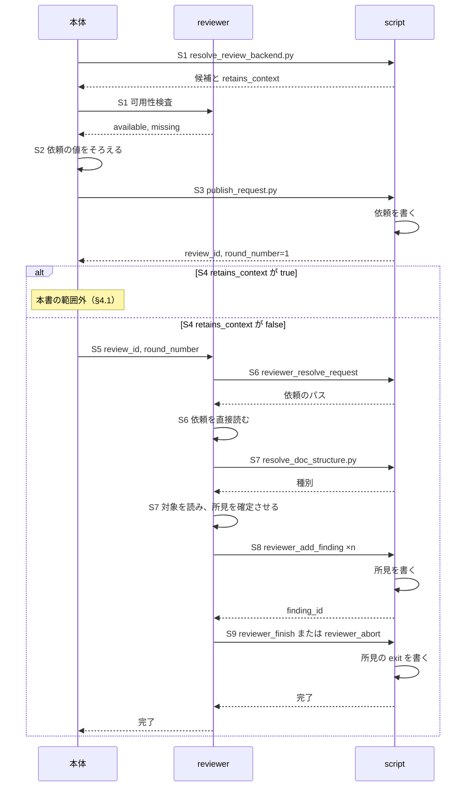
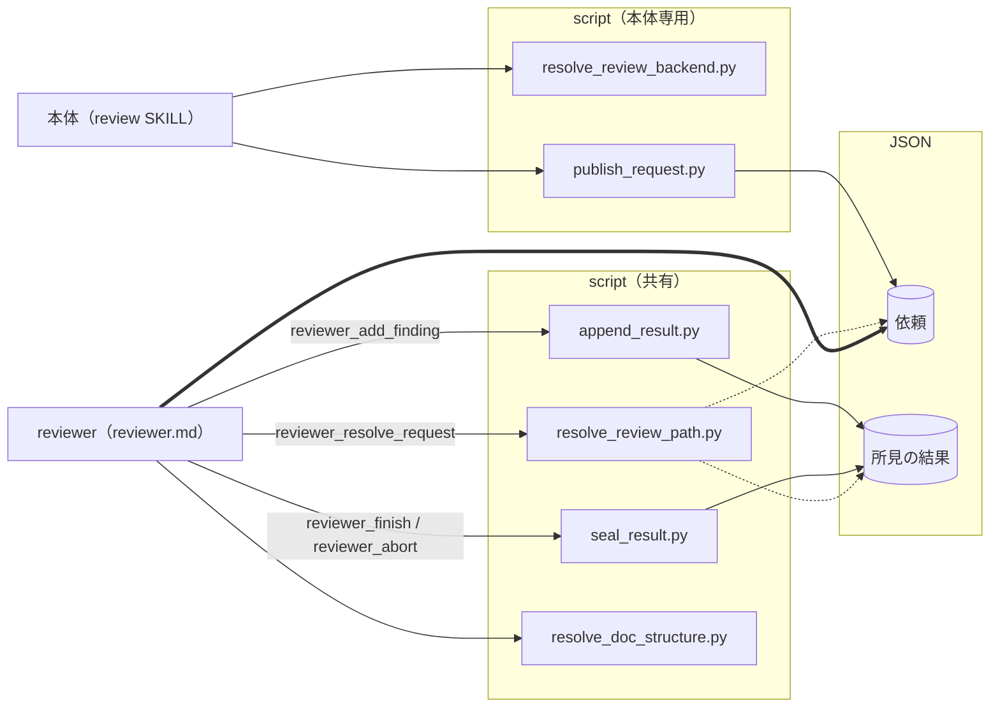
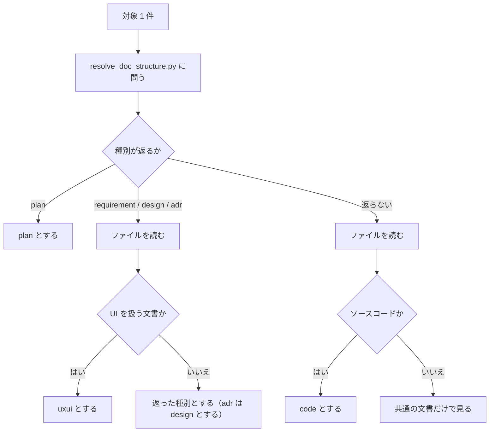

# DES-084 reviewer と受け渡し機構 設計書

## 1. 概要

[REQ-029](../requirements/REQ-029_review_exchange.md) のうち、レビューの開始から reviewer の区間までの受け渡し・採番・書き出しと終了の値・本体の仕事と、[REQ-027](../requirements/REQ-027_reviewer.md) を実現する設計を定める。

**主体はスキルとエージェント（本体・reviewer）である。その間を取り持つのが JSON と script であり、これらをクラスとして説明する。** シーケンスが全体の流れを示し、クラスごとに責務・入出力を定める。

| 範囲                 | 内容                                                  | 章 |
| -------------------- | ----------------------------------------------------- | -- |
| シーケンス           | 使う reviewer の決定から、reviewer の区間まで         | §2 |
| クラス図             | 主体と、JSON・script の関係                           | §3 |
| スキル・エージェント | 本体（reviewer を起こすまで）、reviewer               | §4 |
| JSON                 | 置き場、依頼、所見の結果、終了の値、`finding_id`      | §5 |
| script               | 共通の約束と、script ごとの責務・入出力・動作・エラー | §6 |

設計の骨格は次の 3 点である。

1. **JSON は script が書く。** AI は書けず、script が返したパスの JSON を直接読む（REQ-029 FNC-302・303）。
2. **script は決定論で済む処理だけを担う。** 識別値、採番、封緘である。何を所見として挙げるかは reviewer が、レビューの進め方は最終決定者である本体が判断する（REQ-029 FNC-312）。
3. **reviewer の定義に渡す script は、`--kind` を固定したラッパーだけにする。** reviewer の定義には、所見以外を書く口が現れない（`forge:REQ-013` FNC-1322）。

## 2. シーケンス

図の S 番号は、§4 と §6 の説明と同じである。S2・S4・S5 は script を呼ばない（AI の判断、または起動である）。「書く」は script が JSON を書く処理、「直接読む」は AI が JSON を読む処理で、どちらも自分の処理である。reviewer は、ラウンドごとに 1 回起動される。



**エラーフロー:** reviewer が `target_unreadable` で終えたとき、または書き出さずに終えたとき、所見の結果は `resolve_review_path.py` で読み出せない（§5.4）。

## 3. クラス図

主体（スキル・エージェント）と、その間を取り持つ JSON・script の関係である。点線は script が JSON を読む処理、太線は AI が JSON を直接読む処理、実線は script が JSON を書く処理を表す。ラッパーは、主体から script への矢印の上に名前を書く（§6.6）。



- 依存の向きは、主体 → script → JSON の一方向である。script 同士は呼び合わない（ラッパーが基本の script を呼ぶ関係を除く）。
- `append_result.py` は、採番のために、全ラウンドの結果の JSON を読む（点線は省略している）。
- **共有の枠は、[DES-083](DES-083_evaluator_perspective_design.md) §3 にも同じものを描く。** 共有の枠の構成（どの script を含むか）を変えるときは、両方の図を同時に直す。

## 4. スキル・エージェント

### 4.1 review 本体

`plugins/forge/skills/review/SKILL.md` が持つ（REQ-029 FNC-314）。本体は最終決定者である（REQ-029 FNC-312）。本節は、レビューを始めて reviewer を起こすまでの本体の仕事を定める。

#### 定義が持つもの

| 持つもの        | 内容                                                                                          |
| --------------- | --------------------------------------------------------------------------------------------- |
| script の呼び方 | `publish_request.py`、`resolve_review_backend.py`。第 1 引数に `${CLAUDE_PROJECT_DIR}` を置く |
| 本体の判断      | 下記                                                                                          |

#### 本体の仕事

| S | 仕事                                           | 呼ぶ script                 | 要件                 |
| - | ---------------------------------------------- | --------------------------- | -------------------- |
| 1 | 使う reviewer を決め、`retains_context` を得る | `resolve_review_backend.py` | REQ-029 FNC-316      |
| 2 | 依頼の値をそろえる                             | —                           | REQ-029 FNC-303・304 |
| 3 | 依頼を作って公開する                           | `publish_request.py`        | REQ-029 FNC-302・303 |
| 4 | `retains_context` で流れを分ける               | —                           | REQ-029 FNC-316      |
| 5 | reviewer を起動する                            | —                           | REQ-029 FNC-302      |

#### 判断の内容

- **依頼の組み立て（S2）:** 利用者の指定を `targets` へ読み替える。`base_branch` は AskUserQuestion で確認する。`focus` / `scope` を抽出し、Write ツールで `<project_root>/.claude/.temp/review_focus.txt`・`review_scope.txt` に書く。参照文書は `/forge:query-db-rules` / `/forge:query-db-specs` の結果を用いる。`references` は target 種別で絞らない。どの種別が対象に含まれるかは reviewer が判定するので、依頼を組み立てる時点では確定しない。全種別分を問い合わせて渡し、reviewer が該当するものを使う。依頼の組み立ては script が行い、本体は値を渡すだけである（REQ-029 FNC-303）。利用者の指定と検索結果のパスは、プロジェクトルートからの相対パスで得られる。本体は `${CLAUDE_PROJECT_DIR}/` を前置して絶対パスにしてから `publish_request.py` に渡す（`publish_request.py` は絶対パス以外を受け付けない。REQ-029 FNC-303・DM-304）。

#### 使う reviewer と `retains_context`（S1・S4）

要件は、reviewer の実行主体を「バックエンド」と呼ぶ（REQ-029 FNC-316）。バックエンドは reviewer そのものであり、本体と reviewer の間に別の層があるわけではない。本体は、レビューを始める前に、使うバックエンドを決め、その `retains_context` を得る。

| 項目              | 内容                                                                                                                                                                      |
| ----------------- | ------------------------------------------------------------------------------------------------------------------------------------------------------------------------- |
| 本体 → reviewer   | `review_id` と `round_number` を渡す。依頼本文を運ばない                                                                                                                  |
| reviewer → 本体   | 完了したかどうか。所見を解釈しない                                                                                                                                        |
| 可用性検査        | 各 reviewer（バックエンド）が持つ（`forge:REQ-013` FNC-1318）。本体は順序だけを名前として持つ                                                                             |
| `retains_context` | `resolve_review_backend.py` が候補とともに返す。値はバックエンドごとに固定で、script が持つ。本体は開始前に 1 回だけ受け取り、そのレビューの間保持する（REQ-029 FNC-316） |

`false` の場合が本書の流れ（reviewer は毎ラウンド新しく起こされ、毎ラウンド同じ依頼を読む）である。`true` の場合は分岐し、その先は別の要件定義書・設計書が定める（Issue #67）。現状 `true` を返すバックエンドは無い。

### 4.2 reviewer

`plugins/forge/agents/reviewer.md` が持つ（REQ-027 FNC-301）。reviewer は依頼 JSON を直接読むが、JSON を生成しない。出力値は script に渡すだけである。

#### 定義が持つもの

| 持つもの                  | 内容                                                                                                                                                                                                                                                                                       |
| ------------------------- | ------------------------------------------------------------------------------------------------------------------------------------------------------------------------------------------------------------------------------------------------------------------------------------------ |
| script の呼び方           | `reviewer_*` のラッパー 4 本と `resolve_doc_structure.py`。第 1 引数に `${CLAUDE_PROJECT_DIR}` を置く。`resolve_doc_structure.py` には `--project-root ${CLAUDE_PROJECT_DIR}` を渡す（省略すると作業ディレクトリから自動検出し、置き場の基点を作業ディレクトリに依存させない方針に反する） |
| 依頼の各項目の扱い        | 項目が何であり、どう扱うか。持たないときにどう扱うか（`focus` / `scope` / `references` は持たないことがある）                                                                                                                                                                              |
| 対象の読み方              | `targets` のキーごと（下記）                                                                                                                                                                                                                                                               |
| target 種別ごとに読む文書 | `criteria/review_target_types.md` を読む指示（下記）                                                                                                                                                                                                                                       |
| 所見として何を述べるか    | 何を問題として挙げ、どこまで書くか                                                                                                                                                                                                                                                         |

#### 対象を読む

対象の読み方は `targets` のキーで決まる（REQ-027 FNC-306）。

| キー          | 読み方                                                                 |
| ------------- | ---------------------------------------------------------------------- |
| `paths`       | ファイルは全文読む。ディレクトリは配下を自ら列挙して全文読む           |
| `base_branch` | 基点から分岐して以降の、現在のブランチの全変更を、自ら差分から確定する |
| `diff`        | 未コミット変更のすべてを、自ら差分から確定する                         |

差分から確定する場合、削除とリネームも変更に含める。`reviewer.md` は `git diff` 等を実行できるので、一覧を渡さなくても確定できる。

#### target 種別を判定する

先に設定を引いて種別を決め、決まらないものと細分が要るものだけファイルを読む（REQ-027 FNC-307）。



- **`resolve_doc_structure.py` の口:** パスを 1 つ受け取り、`.doc_structure.yaml` の specs の宣言から `design` / `plan` / `requirement` / `adr` を返す（宣言の値をそのまま返す）。宣言に合わないパスには、種別を返さない。`adr` を design として扱うこと（REQ-027 FNC-307）は script ではなく reviewer が行う。script は設定の解釈だけを担い、target 種別への読み替えを持たない。新設せず既存の script を改修するのは、設定を解釈する箇所を 1 つに保つためである（§6.8）。
- **`exclude` は適用しない:** 既存の `match_path_to_doc_type` は `exclude` を適用しない。`exclude` はファイル収集の範囲を決めるものであり（`resolve_doc_structure.py` のファイル収集）、種別を決めるものではない。本リポジトリの設定は `exclude: [plan]` を持つので、適用すると計画書の種別が決まらない。
- **uxui は設定に区分を持たない:** UI を扱う文書は requirement または design の置き場にあるので、設定で大分類を得た後にファイルを読んで見分ける。
- **決まらない対象:** REQ-027 FNC-308 の「全 target 種別に共通」の文書だけで見る。所見にもエラーにもしない。名前だけで target 種別を当てない。

#### target 種別ごとに読む文書

判定の手順と、種別ごとに上乗せする観点文書の対応は、`plugins/forge/docs/criteria/review_target_types.md` に置く。`reviewer.md` がこの文書を読む（REQ-027 FNC-307・308）。同じ判定と対応を他の主体も使うので、置き場を 1 つにする。

- **書くもの:** 判定の手順（`adr` を design として扱うことを含む）と「種別ごとに上乗せする観点文書」、すべての種別に当てる共通の文書。種別ごとの内蔵規範・プロジェクト固有の規約・突き合わせる対象は、各観点文書が持つので写さない。
- **観点文書の置き場に置く理由:** 種別を判定する目的が、上乗せする観点文書を選ぶことだからである（[forge_document_type_roles.md](../../../rules/forge_document_type_roles.md)）。
- **参照の記法:** 内蔵文書は `${CLAUDE_PLUGIN_ROOT}/docs/` 配下の固定パスで直接参照する。プロジェクト固有の文書は依頼の `references` が運ぶ（[forge_doc_access_principle.md](../../../rules/forge_doc_access_principle.md)）。

#### 所見を渡す

すべての判断を確定させてから書き出す（REQ-029 FNC-310）。確定した所見を 1 件ずつ `reviewer_add_finding` へ渡す。`finding_id` は script が採るので、reviewer は渡さない。所見が無ければ 1 件も渡さない（REQ-027 FNC-309）。書き出し終えたら `reviewer_finish` を呼ぶ（所見が 0 件でも呼ぶ）。対象が読めないときは `reviewer_abort` を呼ぶ（エラー値は `target_unreadable` だけである。REQ-027 FNC-315）。

## 5. JSON

### 5.1 置き場

```text
<project_root>/.temp/review/
└── <review_id>/
    ├── review_request.json
    ├── 1/
    │   └── review_result.json
    └── 2/
        └── ...
```

置き場は、`review_id` と `round_number` から script が決める。AI は組み立てない。依頼（`review_request.json`）はレビューに 1 つ置き（REQ-029 FNC-305）、所見の結果（`review_result.json`）はラウンドごとに置く。結果は上書きしないので、ラウンドごとに分けても取り違えない。`focus` / `scope` の受け渡しファイルは、この置き場ではなく `.claude/.temp/` に置く（§6.1）。

### 5.2 依頼（`review_request.json`）

構造は REQ-029 DM-301 が定める。1 つのレビューに 1 つで、公開後は書き換えない（FNC-305）。依頼は対象の種別を持たない（FNC-317）。

| 書く                                      | 読む                                                                                   |
| ----------------------------------------- | -------------------------------------------------------------------------------------- |
| `publish_request.py`（公開時に 1 回だけ） | reviewer（パスを `resolve_review_path.py` から得て直接読む。毎ラウンド同じ依頼を読む） |

| フィールド | 型             | 必須             | 書く入力                                            |
| ---------- | -------------- | ---------------- | --------------------------------------------------- |
| targets    | target の配列  | 必須（1 個以上） | `--paths…` / `--base-branch` / `--diff`（渡した順） |
| focus      | 文字列         | 任意             | `--focus-file`                                      |
| scope      | 文字列         | 任意             | `--scope-file`                                      |
| references | 絶対パスの配列 | 任意             | `--references…`                                     |

target は `paths`（絶対パスの配列）・`base_branch`（文字列）・`diff`（空の構造）のうち、ちょうど 1 つのキーを持つ。`paths` はディレクトリを配下へ展開しない。

### 5.3 所見の結果（`review_result.json`）

構造は REQ-029 DM-305（reviewer の結果）と DM-302（finding）が定める。reviewer がラウンドごとに 1 つ書く。

| 書く                                                                                         | 読む                                                                                    |
| -------------------------------------------------------------------------------------------- | --------------------------------------------------------------------------------------- |
| `append_result.py --kind findings`（所見の追記）、`seal_result.py --kind findings`（`exit`） | パスを `resolve_review_path.py` から得て直接読む。`append_result.py` も採番のために読む |

| フィールド | 型             | 必須             | 書く入力                                         |
| ---------- | -------------- | ---------------- | ------------------------------------------------ |
| findings   | finding の配列 | 必須（0 件あり） | 所見 1 件ずつの追記                              |
| exit       | 文字列         | 封緘後に持つ     | `seal_result.py` の `--exit`（省略すると `"0"`） |

finding は `finding_id`（`append_result.py` が採番）、`location`（`--location…`、1 個以上）、`body`（標準入力）を持つ。所見は severity を持たない（DM-302）。

### 5.4 終了の値と成否

結果の `exit` と、結果の有無が、成否を表す（REQ-029 FNC-311）。読み出す script（`resolve_review_path.py`）が判定し、AI に判定させない。

| 結果 | `exit`   | 成否             | `resolve_review_path.py` の動作                 |
| ---- | -------- | ---------------- | ----------------------------------------------- |
| ある | `"0"`    | 正常             | パスを返す                                      |
| ある | エラー値 | エラー           | 失敗する。`errors` にエラー値を入れる           |
| ある | 無い     | 書けない異常終了 | 失敗する。`errors` に封緘されていない旨を入れる |
| 無い | —        | 書けない異常終了 | 失敗する。`errors` に結果が無い旨を入れる       |

エラー値の集合は閉じている。`seal_result.py` は、所見の結果に `"0"` と `target_unreadable` だけを受け付ける（REQ-027 FNC-315）。

### 5.5 `finding_id`

`finding_id` は script が採る。reviewer は ID を渡さない（REQ-029 FNC-313）。

- **次の番号:** そのレビューに保持された全ラウンドの結果に現れる `finding_id` の最大値の次。どれにも無ければ `1`。採番のための状態を別に持たない。採番と書き込みは 1 回の操作なので、採った番号が書かれないまま残ることはない。

## 6. script

### 6.1 共通の約束

script は `plugins/forge/scripts/review/` に置く。基本の script が処理を持ち、ラッパーは呼ぶ主体から決定論的に決まるオプションを固定して基本の script を呼ぶだけである（§6.6）。AI が判断して決める値（`disposition`、位置、確信度など）は、ラッパーに畳まず引数として渡す。

- **引数:** `<project_root> <review_id> <round_number>` の順に、位置引数で渡す。持たない script は右から省く（`publish_request.py` は `<project_root>` だけ）。プロジェクトルートは、定義のコマンド行に書いた `${CLAUDE_PROJECT_DIR}` が置換されたものを渡す（REQ-029 FNC-314）。script ファイルの中にプレースホルダは書かない（置換するのはスキル機構であり、script ファイルは機構を通らない）。
- **標準出力:** 成功時は JSON object を 1 つ出力する。返す値が無ければ `{}`。失敗時は終了コード `1` と、自然文の日本語の配列 `errors` を持つ JSON object。引数の誤りは終了コード `2`（`argparse` が返す）。`3` 以上は使わない（[script_error_output_rules.md](../../../rules/script_error_output_rules.md)）。
- **標準入力:** 自由記述は標準入力の全体を 1 つの値として、加工せずに受け取る。値の内容を理由に拒まない（REQ-029 FNC-304）。`focus` / `scope` だけは、2 つの自由記述を 1 回の操作で渡すため、本体が Write ツールで `<project_root>/.claude/.temp/review_focus.txt`・`review_scope.txt` に書いたファイルで受け取り、`publish_request.py` が読んで削除する（[implementation_guidelines.md](../../../rules/implementation_guidelines.md) の受け渡しファイルの例外）。
- **書き込み:** JSON は、同じディレクトリの一時ファイルへ書いてから置き換える。読み手が途中の状態を読まない。文字コードは UTF-8 とする。
- **絶対パス:** 依頼と結果が持つパスと位置は、すべて絶対パスである（REQ-029 DM-304）。

### 6.2 `publish_request.py`

**責務:** 依頼を組み立てて公開し、`review_id` とラウンド 1 を作る（REQ-029 FNC-302・303・305・317、DM-301）。

| 入力                                                                                                                                       | 出力                                                                                                |
| ------------------------------------------------------------------------------------------------------------------------------------------ | --------------------------------------------------------------------------------------------------- |
| `<project_root>`、`--paths P…` / `--base-branch B` / `--diff`（1 つ以上。渡した順）、`--references R…`、`--focus-file F`、`--scope-file S` | 書く: `review_request.json`、ラウンド `1` の置き場。標準出力: `{"review_id": …, "round_number": 1}` |

**動作**

1. target を、渡された順に `targets` へ並べる。`--paths` は `{"paths": […]}`、`--base-branch` は `{"base_branch": B}`、`--diff` は `{"diff": {}}` になる。`paths` は展開しない。
2. `--references` は、正規化して重複を除く（最初に現れた順序を保つ）。
3. `--focus-file` と `--scope-file` があれば、内容をそのまま `focus`・`scope` に置く。無ければ、そのキーを持たない。
4. `review_id` を生成する。他のレビューと衝突しない不透明な値（UUID の 16 進表記）とし、意味を読み取らせない。`<review_id>/` を新規に作る。既に存在すれば、別の値で作り直す。
5. `review_request.json` を書いて公開し、`1/` を作る。
6. `--focus-file`・`--scope-file` のファイルを削除する。

**エラー（終了コード 1）:** target が 1 つも無い。`--paths`・`--references` に絶対パスでないものがある。`--focus-file`・`--scope-file` が読めない。書き込みに失敗した。失敗したときは、作りかけの `<review_id>/` を残さず、`--focus-file`・`--scope-file` のファイルは削除しない。

### 6.3 `append_result.py`

**責務:** 結果へ 1 件追記する。`finding_id` を採る（REQ-029 FNC-310・313、DM-302）。

`--kind` が追記先の結果を決める。本節は `--kind findings` を定める。

| 入力                                                                                                                    | 出力                                            |
| ----------------------------------------------------------------------------------------------------------------------- | ----------------------------------------------- |
| `<project_root> <review_id> <round_number> --kind findings`。読む: 全ラウンドの結果（採番のため）。標準入力: 所見の本文 | 書く: 所見の結果。標準出力: `{"finding_id": n}` |

**共通の動作:** ラウンドの置き場が実在することを確かめる。追記先の結果が封緘済み（`exit` を持つ）なら失敗する。追記は、ファイルが無ければ空の配列から始める。次の `finding_id` は、§5.5 のとおり導く。

#### `--kind findings`

| 引数            | 内容                                                           |
| --------------- | -------------------------------------------------------------- |
| `--location L…` | 1 個以上。所見の位置（DM-304）。渡された順に保持し、解釈しない |
| 標準入力        | 所見の本文                                                     |

**動作:** 次の `finding_id` を採り、`{"finding_id", "location", "body"}` を `findings` へ追記する。

**エラー:** 封緘済み。本文が空。`--location` が無い（引数の誤り。終了コード 2）。

### 6.4 `seal_result.py`

**責務:** 結果を封緘する（REQ-029 FNC-311、REQ-027 FNC-315）。

| 入力                                                                                        | 出力                                |
| ------------------------------------------------------------------------------------------- | ----------------------------------- |
| `<project_root> <review_id> <round_number> --kind findings`、`--exit V`（省略すると `"0"`） | 書く: 結果の `exit`。標準出力: `{}` |

**動作**

1. `--exit` の値が、`"0"` または `target_unreadable` であることを確かめる。含まなければ引数の誤りとする（終了コード 2）。
2. 結果が無ければ、`findings` が空配列の結果を作る（0 件のときも `exit` を書けるようにする）。
3. `exit` を書く。

**エラー（終了コード 1）:** 既に封緘済み。

### 6.5 `resolve_review_path.py`

**責務:** 読み出せる状態かを判定し、絶対パスを返す。JSON 本文は返さない（REQ-029 FNC-302・311）。

| 入力                                                                                         | 出力                                                           |
| -------------------------------------------------------------------------------------------- | -------------------------------------------------------------- |
| `<project_root> <review_id> <round_number> --kind request\|findings`。読む: 依頼、所見の結果 | 標準出力: `{"path": …}`。正常でなければ失敗し、`errors` に理由 |

**動作**

| `--kind`   | 判定                                                                                 |
| ---------- | ------------------------------------------------------------------------------------ |
| `request`  | `<review_id>/` と `<round_number>/` が実在し、`review_request.json` が公開されている |
| `findings` | `review_result.json` の状態を §5.4 の表で判定する                                    |

**エラー（終了コード 1）:** `review_id` が保持されていない。ラウンドが無い。依頼が公開されていない。結果が無い。`exit` が無い。`exit` が `"0"` でない（値を `errors` に入れる）。

### 6.6 ラッパー

ラッパーは、呼ぶ主体から決定論的に決まるオプションを固定して、基本の script を呼ぶ。処理を持たず、標準出力と終了コードをそのまま返す。受け取る引数は、基本の script の引数から、固定したオプションを除いたものである。

| 主体     | ラッパー                      | 呼ぶもの                                                                                                          |
| -------- | ----------------------------- | ----------------------------------------------------------------------------------------------------------------- |
| reviewer | `reviewer_resolve_request.py` | `resolve_review_path.py --kind request`                                                                           |
| reviewer | `reviewer_add_finding.py`     | `append_result.py --kind findings`                                                                                |
| reviewer | `reviewer_finish.py`          | `seal_result.py --kind findings`                                                                                  |
| reviewer | `reviewer_abort.py`           | `seal_result.py --kind findings --exit target_unreadable`（エラー値が 1 つだけなので固定できる。REQ-027 FNC-315） |

本体は、決定論的なオプションを持たない基本の script（`publish_request.py`）を直接呼ぶ。reviewer の定義には、所見以外を書く口が現れない。

### 6.7 `resolve_review_backend.py`（改修）

**責務:** 使う reviewer（バックエンド）の候補と、候補ごとの `retains_context` を返す（REQ-029 FNC-316）。置き場は `plugins/forge/skills/review/scripts/`。

既存の契約（`--backend`、`--project-root`、終了コード `0` / `20`、`status`・`mode`・`order`・`source`）は変えない。次を足す。

| 項目   | 内容                                                                                                                                                                           |
| ------ | ------------------------------------------------------------------------------------------------------------------------------------------------------------------------------ |
| 出力   | 成功時の JSON に `retains_context`（候補名 → 真偽値のオブジェクト）を加える。値は本 script が持つ表（現在は `agent-review` が `false`）から引く                                |
| エラー | `order` の候補に、値の宣言が無い名前があるとき、終了コード `20`、`reason_code` は `backend_undeclared`。値を補わない。`message` に指定された値そのものを載せない（既存の方針） |

### 6.8 `resolve_doc_structure.py`（改修）

**責務:** パスを 1 つ受け取り、`.doc_structure.yaml` の宣言から種別を返す（REQ-027 FNC-307）。置き場は `plugins/forge/scripts/doc_structure/`。reviewer が呼ぶ。

既存の契約（`--type` / `--features` / `--doc-type` / `--version` の排他の指定、`--project-root`、`--doc-structure`、`--category`、`status`、終了コード）は変えない。次を足す。

| 項目   | 内容                                                                                                                                                                               |
| ------ | ---------------------------------------------------------------------------------------------------------------------------------------------------------------------------------- |
| 入力   | `--match-path PATH`。既存の排他の指定に並べる。`PATH` は絶対パス、またはプロジェクトルートからの相対パス。`--category`（省略すると `specs`）と `--project-root` を使う             |
| 動作   | `PATH` をプロジェクトルートからの相対パスにし、既存の `match_path_to_doc_type` で `doc_types_map` を引く。`exclude` は適用しない。プロジェクトルートの外のパスには、種別を返さない |
| 出力   | `{"status": "ok", "category": …, "path": <相対パス>, "doc_type": "design" \| "plan" \| "requirement" \| "adr" \| null}`。宣言に合わないパスは `null`                               |
| エラー | `.doc_structure.yaml` が無い、または不正なときは、既存と同じ（`status: error`、終了コード 1）                                                                                      |

## 7. テスト設計

**単体テスト対象**

対象は、基本の script のうち本書が定めるもの（`publish_request.py`・`append_result.py`・`seal_result.py`・`resolve_review_path.py`）、reviewer のラッパー、改修する 2 本である。それぞれ、§6 の責務・入出力・動作・エラーを確かめる。全体として、次を確かめる。

- 標準出力が JSON object であり、成果物の本文を含まないこと。失敗が終了コード `1` と `errors` であること。作業ディレクトリを変えても、同じパスが得られること。
- `publish_request.py`: 種類をまたいで渡した target が、渡した順に `targets` の要素になること。`paths` のディレクトリが展開されないこと。絶対パスでない `--paths`・`--references` が拒まれること。`--references` の重複が除かれること。`focus` / `scope` の値が、改行・引用符・バッククォート・非 ASCII を含めて同一に保持されること。公開前は読み出せず、公開後は書き換えられないこと。
- `append_result.py` / `seal_result.py`: `finding_id` が 1 つのレビューで連番になること（第 2 ラウンド以降、reviewer が 0 件のラウンドを挟んだ場合を含む）。封緘後の追記が拒まれること。0 件でも空配列の結果が作られること。エラー値の集合が閉じていること。
- `resolve_review_path.py`: 正常でない結果（エラー値、`exit` が無い、結果が無い）で失敗し、`errors` に理由が入ること。
- ラッパー: `reviewer_*` が、所見以外に書けないこと。
- `resolve_doc_structure.py`（改修分）: 宣言するパターンに合うパスへ種別を返し、`exclude: [plan]` の設定でも計画書に `plan` を返すこと。
- `resolve_review_backend.py`（改修分）: 候補ごとに `retains_context` を返し、値を持たない名前で失敗すること。

**契約テスト対象**

- `reviewer.md` が持つ script の呼び方が、§6.6 のラッパーと `resolve_doc_structure.py` の実際の引数と一致すること。`reviewer.md` に、reviewer 以外の主体のラッパー（`evaluator_*`・`body_*`）が現れないこと。
- `criteria/review_target_types.md` が、REQ-027 FNC-308 の全 target 種別と、種別ごとに上乗せする観点文書、全 target 種別に共通の文書を持つこと。
- `reviewer.md` が、`criteria/review_target_types.md` を読む指示を持つこと。

**統合テスト対象**

- `targets` の 3 形（`paths` / `base_branch` / `diff`）すべてで、`review_id` の生成から、依頼の公開、パスによる JSON の直接読み出し、所見の書き出しと封緘までが成立すること。
- reviewer が `target_unreadable` で終えたとき、`resolve_review_path.py` が失敗し、`errors` にエラー値が入ること。
- reviewer が書き出さずに終えたとき、`resolve_review_path.py` が失敗すること。
