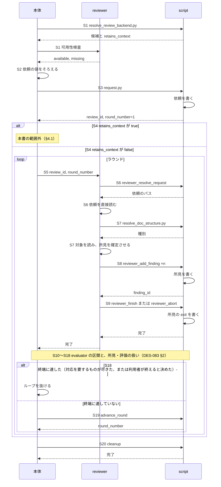
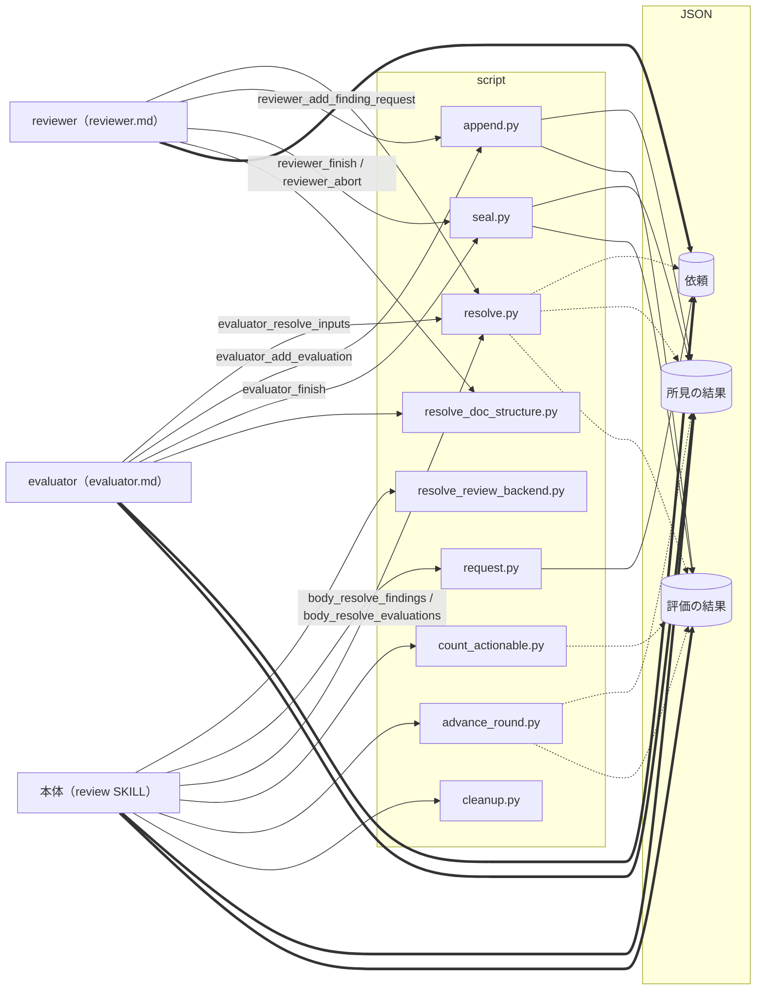
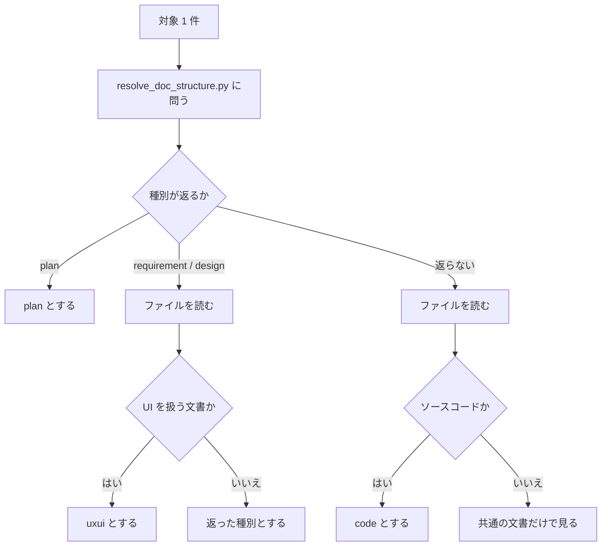

# DES-084 reviewer と受け渡し機構 設計書

## 1. 概要

[REQ-029](../requirements/REQ-029_review_exchange.md) の受け渡し・採番・書き出しと終了の値・本体の仕事と、[REQ-027](../requirements/REQ-027_reviewer.md) を実現する設計を定める。evaluator の設計（評価の JSON、evaluator の script、evaluator の作業）は [DES-083](DES-083_evaluator_perspective_design.md) が持つ。

**主体はスキルとエージェント（本体・reviewer・evaluator）である。その間を取り持つのが JSON と script であり、これらをクラスとして説明する。** シーケンスが全体の流れを示し、クラスごとに責務・入出力を定める。

| 範囲                 | 内容                                                                        | 章 |
| -------------------- | --------------------------------------------------------------------------- | -- |
| シーケンス           | 使う reviewer の決定から、reviewer の区間、ラウンドの進行と保持物の削除まで | §2 |
| クラス図             | 主体と、JSON・script の関係                                                 | §3 |
| スキル・エージェント | 本体、reviewer                                                              | §4 |
| JSON                 | 置き場、依頼、所見の結果、終了の値、`finding_id`                            | §5 |
| script               | 共通の約束と、script ごとの責務・入出力・動作・エラー                       | §6 |

設計の骨格は次の 3 点である。

1. **JSON は script が書く。** AI は書けず、script が返したパスの JSON を直接読む（REQ-029 FNC-302・303）。
2. **script は決定論で済む処理だけを担う。** 識別値、採番、封緘、集計である。修正するか捨てるか、終端に達したかは、最終決定者である本体が判断する（REQ-029 FNC-312）。
3. **reviewer と evaluator の定義に渡す script は、`--kind` を固定したラッパーだけにする。** reviewer の定義には評価を書く口が、evaluator の定義には所見を書く口が現れない（`forge:REQ-013` FNC-1322）。

## 2. シーケンス

図の S 番号は、§4 と §6 の説明と、DES-083 §2 の番号と同じである。S2・S4・S5・S10・S17・S18 は script を呼ばない（AI の判断、または起動である）。「書く」は script が JSON を書く処理、「直接読む」は AI が JSON を読む処理で、どちらも自分の処理である。evaluator の区間と、本体が所見・評価を扱う区間（S10〜S18）は、DES-083 §2 が持つ。



提示から先（採否・修正）は本書の範囲ではない（REQ-029「レビューの進み方」節の末尾）。

**エラーフロー:** 本体がレビューを止めたとき（止める条件と流れは DES-083 §2）も、利用者へ伝え終えてから S20 で保持物を削除する。

## 3. クラス図

主体（スキル・エージェント）と、その間を取り持つ JSON・script の関係である。点線は script が JSON を読む処理、太線は AI が JSON を直接読む処理、実線は script が JSON を書く処理を表す。ラッパーは、主体から script への矢印の上に名前を書く（§6.9）。



- 依存の向きは、主体 → script → JSON の一方向である。script 同士は呼び合わない（ラッパーが基本の script を呼ぶ関係を除く）。
- `append.py` は、採番のために、全ラウンドの所見と評価の JSON を読む（点線は省略している）。

## 4. スキル・エージェント

### 4.1 review 本体

`plugins/forge/skills/review/SKILL.md` が持つ（REQ-029 FNC-314）。本体は最終決定者である（REQ-029 FNC-312）。所見も評価も判断の材料であり、決定ではない。

#### 定義が持つもの

| 持つもの                 | 内容                                                                                                                                                                                                                          |
| ------------------------ | ----------------------------------------------------------------------------------------------------------------------------------------------------------------------------------------------------------------------------- |
| script の呼び方          | `request.py`・`count_actionable.py`・`advance_round.py`・`cleanup.py`、`body_*` のラッパー 2 本、`resolve_review_backend.py`。第 1 引数に `${CLAUDE_PROJECT_DIR}` を置く                                                      |
| 読む JSON の各項目の扱い | 所見（DM-302）と評価（DM-201）の各フィールドが何を意味するか。`disposition`・`confidence`・`fix_confident` の各値を含む。値が無いときは低い側として扱う（`confidence` は `unverified`、`fix_confident` は偽。REQ-029 DM-201） |
| 本体の判断               | 下記                                                                                                                                                                                                                          |

#### 本体の仕事

| S  | 仕事                                           | 呼ぶ script                                         | 要件                 |
| -- | ---------------------------------------------- | --------------------------------------------------- | -------------------- |
| 1  | 使う reviewer を決め、`retains_context` を得る | `resolve_review_backend.py`                         | REQ-029 FNC-316      |
| 2  | 依頼の値をそろえる                             | —                                                   | REQ-029 FNC-303・304 |
| 3  | 依頼を作って公開する                           | `request.py`                                        | REQ-029 FNC-302・303 |
| 4  | `retains_context` で流れを分ける               | —                                                   | REQ-029 FNC-316      |
| 5  | reviewer を起動する                            | —                                                   | REQ-029 FNC-302      |
| 10 | evaluator を起動する                           | —                                                   | REQ-029 FNC-302      |
| 15 | 所見と評価が読めるかを確かめて読む             | `body_resolve_findings`・`body_resolve_evaluations` | REQ-029 FNC-311・312 |
| 16 | 対応を要する件数を得る                         | `count_actionable.py`                               | REQ-029 FNC-318      |
| 17 | 所見と評価を吟味して、提示へ渡す               | —                                                   | REQ-029 FNC-312・204 |
| 18 | 終端に達したかを判断する                       | —                                                   | REQ-029 FNC-318      |
| 19 | 次のラウンドへ進む                             | `advance_round.py`                                  | REQ-029 FNC-302      |
| 20 | 保持物を削除する                               | `cleanup.py`                                        | REQ-029 FNC-302・318 |

#### 判断の内容

- **依頼の組み立て（S2）:** 利用者の指定を `targets` へ読み替える。`base_branch` は AskUserQuestion で確認する。`focus` / `scope` を抽出し、Write ツールでファイルに書く。参照文書は `/forge:query-db-rules` / `/forge:query-db-specs` の結果を用いる。`references` は target 種別で絞らない。どの種別が対象に含まれるかは reviewer が判定するので、依頼を組み立てる時点では確定しない。全種別分を問い合わせて渡し、reviewer が該当するものを使う。依頼の組み立ては script が行い、本体は値を渡すだけである（REQ-029 FNC-303）。
- **読み出しと失敗（S15）:** 所見と評価は、`body_resolve_findings` と `body_resolve_evaluations` が返したパスの JSON を、本体が直接読む（REQ-029 FNC-302）。読み出しが失敗したら、レビューを止めて `errors` を利用者へ伝える。読んだ内容から成否を判断しない（REQ-029 FNC-311・318）。reviewer が失敗していれば、所見側の `errors` にエラー値が入るので、reviewer の失敗として伝える。evaluator が失敗していれば、そのラウンドの所見は評価を経ていないので、severity を持たない未評価の所見として報告に載せる。
- **吟味（S17）:** 所見と評価を受け取った時点で、それが本当に正しいかを自分で理解し、調査し、考える。対象と規範に照らして吟味し、誤りがあれば、その誤りを理解したうえで、正しい対応を行う。`disposition`・`confidence`・`fix_confident` などの値にそのまま従って、修正・ドロップ・終端を決めない。script は行き先を決めず、`count_actionable.py` が件数を数えるだけである。`flawed_premise` は、`confidence` / `fix_confident` の値に関わらず自動修正の対象にせず、常に提示する（REQ-029 FNC-204）。この規則は本体の定義（`SKILL.md`）に書く。
- **提示の単位（S17）:** 提示は評価 1 件を単位とする。束ねた評価は 1 回だけ示し、影響する所見を列挙する。20 件の所見を 1 つの原因で束ねた評価を所見ごとに提示すると、同じ根拠を 20 回見せて 20 回採否を問うことになり、束ねられる表現を用意した意味が失われる。evaluator の新規指摘は、評価が持つ `location` と `reason` を、そのまま位置と根拠として扱う。reviewer 由来の所見を模したレコードを作らない。この対応づけのために新しいデータ構造を作らない。どの評価がどの所見に当たるかは、評価が `finding_ids` として既に持っている。本体は評価の結果を入口にし、所見の結果から `finding_ids` で所見を引く。提示から先（採否の確認・修正）は、本 feature が変えない工程である（REQ-029「レビューの進み方」節の末尾）。
- **終端の判断（S18）:** `count_actionable.py` の件数を材料に、終端に達したかを判断する（REQ-029 FNC-318）。件数を数えるのは決定論的な処理であり、AI が JSON を読んで行わない。件数が 0 のときも、`invalid`・`misunderstanding`・`out_of_scope` として退けられた所見の退け方が妥当かを、本体が内容を確かめてから終端とする。対応を要するものが尽きたときは、確認を要しない。残りが軽微と本体が判断したときは、利用者へ確認し、終えるかは利用者が決める。
- **削除（S20）:** 終端に達したとき、エラーで止めたとき、利用者が中止したときのいずれも、報告を済ませてから削除する。報告は結果を読むためである。

#### 使う reviewer と `retains_context`（S1・S4）

要件は、reviewer の実行主体を「バックエンド」と呼ぶ（REQ-029 FNC-316）。バックエンドは reviewer そのものであり、本体と reviewer の間に別の層があるわけではない。本体は、レビューを始める前に、使うバックエンドを決め、その `retains_context` を得る。evaluator は選択の対象ではなく、本体が起動する。

| 項目              | 内容                                                                                                                                                                      |
| ----------------- | ------------------------------------------------------------------------------------------------------------------------------------------------------------------------- |
| 本体 → reviewer   | `review_id` と `round_number` を渡す。依頼本文を運ばない                                                                                                                  |
| reviewer → 本体   | 完了したかどうか。所見を解釈しない                                                                                                                                        |
| 可用性検査        | 各 reviewer（バックエンド）が持つ（`forge:REQ-013` FNC-1318）。本体は順序だけを名前として持つ                                                                             |
| `retains_context` | `resolve_review_backend.py` が候補とともに返す。値はバックエンドごとに固定で、script が持つ。本体は開始前に 1 回だけ受け取り、そのレビューの間保持する（REQ-029 FNC-316） |

`false` の場合が本書の流れ（reviewer は毎ラウンド新しく起こされ、毎ラウンド同じ依頼を読む）である。`true` の場合は分岐し、その先は別の要件定義書・設計書が定める（Issue #67）。現状 `true` を返すバックエンドは無い。終端は `retains_context` によらず共通である（REQ-029 FNC-318）。

### 4.2 reviewer

`plugins/forge/agents/reviewer.md` が持つ（REQ-027 FNC-301）。reviewer は依頼 JSON を直接読むが、JSON を生成しない。出力値は script に渡すだけである。

#### 定義が持つもの

| 持つもの                  | 内容                                                                                                                                                                                                                                                                                       |
| ------------------------- | ------------------------------------------------------------------------------------------------------------------------------------------------------------------------------------------------------------------------------------------------------------------------------------------ |
| script の呼び方           | `reviewer_*` のラッパー 4 本と `resolve_doc_structure.py`。第 1 引数に `${CLAUDE_PROJECT_DIR}` を置く。`resolve_doc_structure.py` には `--project-root ${CLAUDE_PROJECT_DIR}` を渡す（省略すると作業ディレクトリから自動検出し、置き場の基点を作業ディレクトリに依存させない方針に反する） |
| 依頼の各項目の扱い        | 項目が何であり、どう扱うか。持たないときにどう扱うか（`focus` / `scope` / `references` は持たないことがある）                                                                                                                                                                              |
| 対象の読み方              | `targets` のキーごと（下記）                                                                                                                                                                                                                                                               |
| target 種別ごとに読む文書 | `criteria/review_target_types.md` を読む指示（下記）                                                                                                                                                                                                                                       |
| 所見として何を述べるか    | 何を問題として挙げ、どこまで書くか                                                                                                                                                                                                                                                         |

#### 対象を読む

対象の読み方は `targets` のキーで決まる（REQ-027 FNC-306）。

| キー          | 読み方                                                                 |
| ------------- | ---------------------------------------------------------------------- |
| `paths`       | ファイルは全文読む。ディレクトリは配下を自ら列挙して全文読む           |
| `base_branch` | 基点から分岐して以降の、現在のブランチの全変更を、自ら差分から確定する |
| `diff`        | 未コミット変更のすべてを、自ら差分から確定する                         |

差分から確定する場合、削除とリネームも変更に含める。`reviewer.md` は `git diff` 等を実行できるので、一覧を渡さなくても確定できる。

#### target 種別を判定する

先に設定を引いて種別を決め、決まらないものと細分が要るものだけファイルを読む（REQ-027 FNC-307）。



- **`resolve_doc_structure.py` の口:** パスを 1 つ受け取り、`.doc_structure.yaml` の specs の宣言から `design` / `plan` / `requirement` を返す。宣言に合わないパスには、種別を返さない。新設せず既存の script を改修するのは、設定を解釈する箇所を 1 つに保つためである（§6.11）。
- **`exclude` は適用しない:** 既存の `match_path_to_doc_type` は `exclude` を適用しない。`exclude` はファイル収集の範囲を決めるものであり（`resolve_doc_structure.py` のファイル収集）、種別を決めるものではない。本リポジトリの設定は `exclude: [plan]` を持つので、適用すると計画書の種別が決まらない。
- **uxui は設定に区分を持たない:** UI を扱う文書は requirement または design の置き場にあるので、設定で大分類を得た後にファイルを読んで見分ける。
- **決まらない対象:** REQ-027 FNC-308 の「全 target 種別に共通」の文書だけで見る。所見にもエラーにもしない。名前だけで target 種別を当てない。

#### target 種別ごとに読む文書

判定の手順と、種別ごとに上乗せする観点文書の対応は、`plugins/forge/docs/criteria/review_target_types.md` に置く。`reviewer.md` と `evaluator.md` がどちらもこの文書を読む（REQ-027 FNC-307・308、REQ-026 FNC-208）。同じ判定と対応を 2 つの主体が使うので、置き場を 1 つにする。

- **書くもの:** 判定の手順と「種別ごとに上乗せする観点文書」、すべての種別に当てる共通の文書。種別ごとの内蔵規範・プロジェクト固有の規約・突き合わせる対象は、各観点文書が持つので写さない。
- **観点文書の置き場に置く理由:** 種別を判定する目的が、上乗せする観点文書を選ぶことだからである（[forge_document_type_roles.md](../../../rules/forge_document_type_roles.md)）。
- **参照の記法:** 内蔵文書は `${CLAUDE_PLUGIN_ROOT}/docs/` 配下の固定パスで直接参照する。プロジェクト固有の文書は依頼の `references` が運ぶ（[forge_doc_access_principle.md](../../../rules/forge_doc_access_principle.md)）。

#### 所見を渡す

すべての判断を確定させてから書き出す（REQ-029 FNC-310）。確定した所見を 1 件ずつ `reviewer_add_finding` へ渡す。`finding_id` は script が採るので、reviewer は渡さない。所見が無ければ 1 件も渡さない（REQ-027 FNC-309）。書き出し終えたら `reviewer_finish` を呼ぶ（所見が 0 件でも呼ぶ）。対象が読めないときは `reviewer_abort` を呼ぶ（エラー値は `target_unreadable` だけである。REQ-027 FNC-315）。

## 5. JSON

### 5.1 置き場

```text
<project_root>/.temp/review/
└── <review_id>/
    ├── review_request.json
    ├── 1/
    │   ├── review_result.json
    │   └── evaluate_result.json
    └── 2/
        └── ...
```

置き場は、`review_id` と `round_number` から script が決める。AI は組み立てない。依頼（`review_request.json`）はレビューに 1 つ置き（REQ-029 FNC-305）、所見の結果（`review_result.json`）と評価の結果（`evaluate_result.json`）はラウンドごとに置く。結果は上書きしないので、ラウンドごとに分けても取り違えない。レビューが終わったとき、`review_id` のディレクトリごと削除する（S20）。

### 5.2 依頼（`review_request.json`）

構造は REQ-029 DM-301 が定める。1 つのレビューに 1 つで、公開後は書き換えない（FNC-305）。依頼は対象の種別を持たない（FNC-317）。

| 書く                              | 読む                                                                                    |
| --------------------------------- | --------------------------------------------------------------------------------------- |
| `request.py`（公開時に 1 回だけ） | reviewer と evaluator（パスを `resolve.py` から得て直接読む。毎ラウンド同じ依頼を読む） |

| フィールド | 型             | 必須             | 書く入力                                            |
| ---------- | -------------- | ---------------- | --------------------------------------------------- |
| targets    | target の配列  | 必須（1 個以上） | `--paths…` / `--base-branch` / `--diff`（渡した順） |
| focus      | 文字列         | 任意             | `--focus-file`                                      |
| scope      | 文字列         | 任意             | `--scope-file`                                      |
| references | 絶対パスの配列 | 任意             | `--references…`                                     |

target は `paths`（絶対パスの配列）・`base_branch`（文字列）・`diff`（空の構造）のうち、ちょうど 1 つのキーを持つ。`paths` はディレクトリを配下へ展開しない。

### 5.3 所見の結果（`review_result.json`）

構造は REQ-029 DM-305（reviewer の結果）と DM-302（finding）が定める。reviewer がラウンドごとに 1 つ書く。

| 書く                                                                           | 読む                                                                                               |
| ------------------------------------------------------------------------------ | -------------------------------------------------------------------------------------------------- |
| `append.py --kind findings`（所見の追記）、`seal.py --kind findings`（`exit`） | evaluator と本体（パスを `resolve.py` から得て直接読む）。`append.py` と `advance_round.py` も読む |

| フィールド | 型             | 必須             | 書く入力                                  |
| ---------- | -------------- | ---------------- | ----------------------------------------- |
| findings   | finding の配列 | 必須（0 件あり） | 所見 1 件ずつの追記                       |
| exit       | 文字列         | 封緘後に持つ     | `seal.py` の `--exit`（省略すると `"0"`） |

finding は `finding_id`（`append.py` が採番）、`location`（`--location…`、1 個以上）、`body`（標準入力）を持つ。所見は severity を持たない（DM-302）。

### 5.4 終了の値と成否

結果の `exit` と、結果の有無が、成否を表す（REQ-029 FNC-311）。読み出す script（`resolve.py`）が判定し、AI に判定させない。

| 結果 | `exit`   | 成否             | `resolve.py` の動作                             |
| ---- | -------- | ---------------- | ----------------------------------------------- |
| ある | `"0"`    | 正常             | パスを返す                                      |
| ある | エラー値 | エラー           | 失敗する。`errors` にエラー値を入れる           |
| ある | 無い     | 書けない異常終了 | 失敗する。`errors` に封緘されていない旨を入れる |
| 無い | —        | 書けない異常終了 | 失敗する。`errors` に結果が無い旨を入れる       |

エラー値の集合は閉じている。`seal.py` は、`--kind findings` に `"0"` と `target_unreadable`、`--kind evaluations` に `"0"` だけを受け付ける（REQ-027 FNC-315、REQ-026 FNC-319）。

### 5.5 `finding_id`

`finding_id` は script が採る。reviewer も evaluator も ID を渡さない（REQ-029 FNC-313）。

- **次の番号:** そのレビューの全ラウンドの所見と評価に現れる `finding_id` の最大値の次。どれにも無ければ `1`。採番のための状態を別に持たない。採番と書き込みは 1 回の操作なので、採った番号が書かれないまま残ることはない。
- **同じ番号を 2 つの script が同時に採らない:** evaluator は所見が正常に封緘されていなければ始まらず（S11）、`advance_round.py` は所見と評価がともに正常に封緘されていなければ次のラウンドを作らない（S19）。
- **出自:** 当該ラウンドの所見に無い番号で、当該ラウンドの評価に現れるものが、evaluator が新規に指摘したものである。件数では判定しない（第 2 ラウンド以降は番号が `1` から始まらない）。

## 6. script

### 6.1 共通の約束

script は `plugins/forge/scripts/review/` に置く。基本の script が処理を持ち、ラッパーは呼ぶ主体から決定論的に決まるオプションを固定して基本の script を呼ぶだけである（§6.9）。AI が判断して決める値（`disposition`、位置、確信度など）は、ラッパーに畳まず引数として渡す。

- **引数:** `<project_root> <review_id> <round_number>` の順に、位置引数で渡す。持たない script は右から省く（`request.py` は `<project_root>` だけ、`cleanup.py` は `<project_root> <review_id>`）。プロジェクトルートは、定義のコマンド行に書いた `${CLAUDE_PROJECT_DIR}` が置換されたものを渡す（REQ-029 FNC-314）。script ファイルの中にプレースホルダは書かない（置換するのはスキル機構であり、script ファイルは機構を通らない）。
- **標準出力:** 成功時は JSON object を 1 つ出力する。返す値が無ければ `{}`。失敗時は終了コード `1` と、自然文の日本語の配列 `errors` を持つ JSON object。引数の誤りは終了コード `2`（`argparse` が返す）。`3` 以上は使わない（[script_error_output_rules.md](../../../rules/script_error_output_rules.md)）。
- **標準入力:** 自由記述は標準入力の全体を 1 つの値として、加工せずに受け取る。値の内容を理由に拒まない（REQ-029 FNC-304）。`focus` / `scope` だけは、2 つの自由記述を 1 回の操作で渡すため、本体が Write ツールで書いたファイルで受け取り、`request.py` が読んで削除する（[implementation_guidelines.md](../../../rules/implementation_guidelines.md) の受け渡しファイルの例外）。
- **書き込み:** JSON は、同じディレクトリの一時ファイルへ書いてから置き換える。読み手が途中の状態を読まない。文字コードは UTF-8 とする。
- **絶対パス:** 依頼と結果が持つパスと位置は、すべて絶対パスである（REQ-029 DM-304）。

### 6.2 `request.py`

**責務:** 依頼を組み立てて公開し、`review_id` とラウンド 1 を作る（REQ-029 FNC-302・303・305・317、DM-301）。

| 入力                                                                                                                                       | 出力                                                                                                |
| ------------------------------------------------------------------------------------------------------------------------------------------ | --------------------------------------------------------------------------------------------------- |
| `<project_root>`、`--paths P…` / `--base-branch B` / `--diff`（1 つ以上。渡した順）、`--references R…`、`--focus-file F`、`--scope-file S` | 書く: `review_request.json`、ラウンド `1` の置き場。標準出力: `{"review_id": …, "round_number": 1}` |

**動作**

1. target を、渡された順に `targets` へ並べる。`--paths` は `{"paths": […]}`、`--base-branch` は `{"base_branch": B}`、`--diff` は `{"diff": {}}` になる。`paths` は展開しない。
2. `--references` は、正規化して重複を除く（最初に現れた順序を保つ）。
3. `--focus-file` と `--scope-file` があれば、内容をそのまま `focus`・`scope` に置く。無ければ、そのキーを持たない。
4. `review_id` を生成する。他のレビューと衝突しない不透明な値（UUID の 16 進表記）とし、意味を読み取らせない。`<review_id>/` を新規に作る。既に存在すれば、別の値で作り直す。
5. `review_request.json` を書いて公開し、`1/` を作る。
6. `--focus-file`・`--scope-file` のファイルを削除する。

**エラー（終了コード 1）:** target が 1 つも無い。`--paths`・`--references` に絶対パスでないものがある。`--focus-file`・`--scope-file` が読めない。書き込みに失敗した。失敗したときは、作りかけの `<review_id>/` を残さず、`--focus-file`・`--scope-file` のファイルは削除しない。

### 6.3 `append.py`

**責務:** 結果へ 1 件追記する。`finding_id` を採る。評価では、所見との関係を書く時点で保証する（REQ-029 FNC-310・313・203、DM-302・DM-201）。

| 入力                                                                                                                                                                         | 出力                                                                                           |
| ---------------------------------------------------------------------------------------------------------------------------------------------------------------------------- | ---------------------------------------------------------------------------------------------- |
| `<project_root> <review_id> <round_number> --kind findings\|evaluations`。読む: 全ラウンドの所見と評価の結果。当該ラウンドの所見の結果。標準入力: 所見では本文、評価では根拠 | 書く: 所見または評価の結果。標準出力: 所見と `--new` の評価では `{"finding_id": n}`、他は `{}` |

**共通の動作:** ラウンドの置き場が実在することを確かめる。追記先の結果が封緘済み（`exit` を持つ）なら失敗する。追記は、ファイルが無ければ空の配列から始める。次の `finding_id` は、§5.5 のとおり導く。

#### `--kind findings`

| 引数            | 内容                                                           |
| --------------- | -------------------------------------------------------------- |
| `--location L…` | 1 個以上。所見の位置（DM-304）。渡された順に保持し、解釈しない |
| 標準入力        | 所見の本文                                                     |

**動作:** 次の `finding_id` を採り、`{"finding_id", "location", "body"}` を `findings` へ追記する。

**エラー:** 封緘済み。本文が空。`--location` が無い（引数の誤り。終了コード 2）。

#### `--kind evaluations`

| 引数                          | 内容                                                                                 |
| ----------------------------- | ------------------------------------------------------------------------------------ |
| `--disposition`               | `invalid` / `misunderstanding` / `out_of_scope` / `flawed_premise` / `valid`（必須） |
| `--severity`                  | `critical` / `major` / `minor`（必須）                                               |
| `--findings N…`               | 引く番号                                                                             |
| `--new`                       | 新規指摘の番号を採り、この評価が引く番号に加える                                     |
| `--location L…`               | 新規指摘の番号を含む評価の位置                                                       |
| `--confidence`                | `confirmed` / `inferred` / `unverified`（`valid` のとき必須）                        |
| `--fix-confident true\|false` | その修正を責任を持って実行できるか（`valid` のとき必須）                             |
| 標準入力                      | 判定の根拠（`reason`）                                                               |

**動作**

1. `--new` のとき、次の `finding_id` を採る。
2. `finding_ids` を、`--findings` の番号（渡した順）と、続けて `--new` で採った番号で作る。
3. `{"finding_ids", "disposition", "severity", "reason"}` に、`valid` のとき `confidence` と `fix_confident`、新規指摘の番号を含むとき `location` を加えて、`evaluations` へ追記する。

**エラー**（いずれも何も書かない）

| 条件                                                                                                                              | 根拠                    |
| --------------------------------------------------------------------------------------------------------------------------------- | ----------------------- |
| 当該ラウンドの所見の結果が、正常に封緘されていない                                                                                | REQ-026 DM-202          |
| 評価の結果が封緘済み                                                                                                              | REQ-029 FNC-310         |
| `--findings` も `--new` も無い                                                                                                    | DM-201（1 個以上）      |
| `--findings` の番号が、当該ラウンドの所見にも、当該ラウンドの評価に既にある新規指摘の番号にも無い（その番号を `errors` に入れる） | REQ-029 FNC-203         |
| 新規指摘の番号を含む（`--new`、または既にある新規指摘の番号を引く）のに `--location` が無い。含まないのに `--location` がある     | DM-201                  |
| `--new` なのに `--disposition` が `valid` でない                                                                                  | REQ-026 FNC-206         |
| `valid` なのに `--confidence` または `--fix-confident` が無い。`valid` 以外に、この 2 つを渡した                                  | DM-201                  |
| `--fix-confident true` なのに `--confidence` が `confirmed` でない                                                                | DM-201                  |
| 根拠（標準入力）が空                                                                                                              | DM-201（`reason` 必須） |

### 6.4 `seal.py`

**責務:** 結果を封緘する。評価では、全所見が引かれていることを保証する（REQ-029 FNC-311・203、REQ-027 FNC-315、REQ-026 FNC-319）。

| 入力                                                                                                                                                 | 出力                                |
| ---------------------------------------------------------------------------------------------------------------------------------------------------- | ----------------------------------- |
| `<project_root> <review_id> <round_number> --kind findings\|evaluations`、`--exit V`（省略すると `"0"`）。読む: 当該ラウンドの所見の結果と評価の結果 | 書く: 結果の `exit`。標準出力: `{}` |

**動作**

1. `--exit` の値が、その kind の閉じた集合に含まれることを確かめる（`findings` は `"0"` と `target_unreadable`、`evaluations` は `"0"`）。含まなければ引数の誤りとする（終了コード 2）。
2. 結果が無ければ、`findings`（または `evaluations`）が空配列の結果を作る（0 件のときも `exit` を書けるようにする）。
3. `evaluations` では、当該ラウンドの所見の結果が正常に封緘されていることを確かめ、所見の `finding_id` のうち、どの評価の `finding_ids` にも無いものを数える。
4. `exit` を書く。

**エラー（終了コード 1）:** 既に封緘済み。`evaluations` で、所見の結果が正常に封緘されていない。`evaluations` で、引かれていない所見が残っている（その `finding_id` をすべて `errors` に入れ、何も書かない）。

### 6.5 `resolve.py`

**責務:** 読み出せる状態かを判定し、絶対パスを返す。JSON 本文は返さない（REQ-029 FNC-302・311）。

| 入力                                                                                                                          | 出力                                                                                                        |
| ----------------------------------------------------------------------------------------------------------------------------- | ----------------------------------------------------------------------------------------------------------- |
| `<project_root> <review_id> <round_number> --kind request\|inputs\|findings\|evaluations`。読む: 依頼、所見の結果、評価の結果 | 標準出力: `{"path": …}`。`inputs` は `{"request": …, "findings": …}`。正常でなければ失敗し、`errors` に理由 |

**動作**

| `--kind`      | 判定                                                                                              |
| ------------- | ------------------------------------------------------------------------------------------------- |
| `request`     | `<review_id>/` と `<round_number>/` が実在し、`review_request.json` が公開されている              |
| `findings`    | `review_result.json` の状態を §5.4 の表で判定する                                                 |
| `evaluations` | `evaluate_result.json` の状態を §5.4 の表で判定する                                               |
| `inputs`      | `request` と `findings` の両方を判定する。片方でも失敗すれば失敗し、`errors` に両方の理由を入れる |

**エラー（終了コード 1）:** `review_id` が保持されていない。ラウンドが無い。依頼が公開されていない。結果が無い。`exit` が無い。`exit` が `"0"` でない（値を `errors` に入れる）。

### 6.6 `count_actionable.py`

**責務:** 対応を要する評価の件数を数える。何も書かず、返すのは件数だけで、所見と評価の JSON 本文は返さない（REQ-029 FNC-318）。

| 入力                                                                          | 出力                          |
| ----------------------------------------------------------------------------- | ----------------------------- |
| `<project_root> <review_id> <round_number>`。読む: 評価の結果の `disposition` | 標準出力: `{"actionable": n}` |

**動作:** 評価の結果が正常に封緘されていることを確かめ、`disposition` が `valid` または `flawed_premise` の評価を数える。

**エラー（終了コード 1）:** 評価の結果が無い、または正常に封緘されていない。

### 6.7 `advance_round.py`

**責務:** 次のラウンドの置き場を作る。依頼も、採番のための状態も作らない（REQ-029 FNC-302・313）。

| 入力                                                                         | 出力                                                                 |
| ---------------------------------------------------------------------------- | -------------------------------------------------------------------- |
| `<project_root> <review_id> <round_number>`。読む: 所見と評価の結果の `exit` | 標準出力: `{"round_number": <次の値>}`（書く: 次のラウンドの置き場） |

**動作:** 当該ラウンドの所見の結果と評価の結果が、どちらも正常に封緘されていることを確かめ、`<round_number + 1>/` を作る。

**エラー（終了コード 1）:** 所見または評価の結果が、正常に封緘されていない。次のラウンドの置き場が既に存在する。

### 6.8 `cleanup.py`

**責務:** そのレビューの保持物を、依頼・所見・評価ともにすべて削除する（REQ-029 FNC-302・318）。

| 入力                         | 出力           |
| ---------------------------- | -------------- |
| `<project_root> <review_id>` | 標準出力: `{}` |

**動作:** `<review_id>/` をディレクトリごと削除する。置き場が無いときも成功する。

**エラー（終了コード 1）:** 削除できない。

### 6.9 ラッパー

ラッパーは、呼ぶ主体から決定論的に決まるオプションを固定して、基本の script を呼ぶ。処理を持たず、標準出力と終了コードをそのまま返す。受け取る引数は、基本の script の引数から、固定したオプションを除いたものである。

| 主体      | ラッパー                      | 呼ぶもの                                                                                                   |
| --------- | ----------------------------- | ---------------------------------------------------------------------------------------------------------- |
| reviewer  | `reviewer_resolve_request.py` | `resolve.py --kind request`                                                                                |
| reviewer  | `reviewer_add_finding.py`     | `append.py --kind findings`                                                                                |
| reviewer  | `reviewer_finish.py`          | `seal.py --kind findings`                                                                                  |
| reviewer  | `reviewer_abort.py`           | `seal.py --kind findings --exit target_unreadable`（エラー値が 1 つだけなので固定できる。REQ-027 FNC-315） |
| 本体      | `body_resolve_findings.py`    | `resolve.py --kind findings`                                                                               |
| 本体      | `body_resolve_evaluations.py` | `resolve.py --kind evaluations`                                                                            |
| evaluator | `evaluator_*`（3 本）         | DES-083 §6                                                                                                 |

本体は、決定論的なオプションを持たない基本の script（`request.py`・`count_actionable.py`・`advance_round.py`・`cleanup.py`）を直接呼ぶ。reviewer の定義には評価を書く口が、evaluator の定義には所見を書く口が現れない。

### 6.10 `resolve_review_backend.py`（改修）

**責務:** 使う reviewer（バックエンド）の候補と、候補ごとの `retains_context` を返す（REQ-029 FNC-316）。置き場は `plugins/forge/skills/review/scripts/`。

既存の契約（`--backend`、`--project-root`、終了コード `0` / `20`、`status`・`mode`・`order`・`source`）は変えない。次を足す。

| 項目   | 内容                                                                                                                                                                           |
| ------ | ------------------------------------------------------------------------------------------------------------------------------------------------------------------------------ |
| 出力   | 成功時の JSON に `retains_context`（候補名 → 真偽値のオブジェクト）を加える。値は本 script が持つ表（現在は `agent-review` が `false`）から引く                                |
| エラー | `order` の候補に、値の宣言が無い名前があるとき、終了コード `20`、`reason_code` は `backend_undeclared`。値を補わない。`message` に指定された値そのものを載せない（既存の方針） |

### 6.11 `resolve_doc_structure.py`（改修）

**責務:** パスを 1 つ受け取り、`.doc_structure.yaml` の宣言から種別を返す（REQ-027 FNC-307）。置き場は `plugins/forge/scripts/doc_structure/`。reviewer と evaluator が呼ぶ。

既存の契約（`--type` / `--features` / `--doc-type` / `--version` の排他の指定、`--project-root`、`--doc-structure`、`--category`、`status`、終了コード）は変えない。次を足す。

| 項目   | 内容                                                                                                                                                                               |
| ------ | ---------------------------------------------------------------------------------------------------------------------------------------------------------------------------------- |
| 入力   | `--match-path PATH`。既存の排他の指定に並べる。`PATH` は絶対パス、またはプロジェクトルートからの相対パス。`--category`（省略すると `specs`）と `--project-root` を使う             |
| 動作   | `PATH` をプロジェクトルートからの相対パスにし、既存の `match_path_to_doc_type` で `doc_types_map` を引く。`exclude` は適用しない。プロジェクトルートの外のパスには、種別を返さない |
| 出力   | `{"status": "ok", "category": …, "path": <相対パス>, "doc_type": "design" \| "plan" \| "requirement" \| null}`。宣言に合わないパスは `null`                                        |
| エラー | `.doc_structure.yaml` が無い、または不正なときは、既存と同じ（`status: error`、終了コード 1）                                                                                      |

## 7. テスト設計

**単体テスト対象**

対象は、基本の script 7 本、ラッパー、改修する 2 本である。それぞれ、§6 の責務・入出力・動作・エラーを確かめる。全体として、次を確かめる。

- 標準出力が JSON object であり、成果物の本文を含まないこと。失敗が終了コード `1` と `errors` であること。作業ディレクトリを変えても、同じパスが得られること。
- `request.py`: 種類をまたいで渡した target が、渡した順に `targets` の要素になること。`paths` のディレクトリが展開されないこと。`--references` の重複が除かれること。`focus` / `scope` の値が、改行・引用符・バッククォート・非 ASCII を含めて同一に保持されること。公開前は読み出せず、公開後は書き換えられないこと。
- `append.py` / `seal.py`: `finding_id` が 1 つのレビューで連番になること（第 2 ラウンド以降、reviewer が 0 件のラウンドを挟んだ場合、evaluator が前ラウンドで採った番号を含む）。封緘後の追記が拒まれること。§6.3 の評価のエラーが、1 つ 1 つ拒まれること。0 件でも空配列の結果が作られること。エラー値の集合が閉じていること。
- `resolve.py`: 正常でない結果（エラー値、`exit` が無い、結果が無い）で失敗し、`errors` に理由が入ること。
- ラッパー: `reviewer_*` が評価に、`evaluator_*` が所見に書けないこと。
- `resolve_doc_structure.py`（改修分）: 宣言するパターンに合うパスへ種別を返し、`exclude: [plan]` の設定でも計画書に `plan` を返すこと。
- `resolve_review_backend.py`（改修分）: 候補ごとに `retains_context` を返し、値を持たない名前で失敗すること。

**契約テスト対象**

- `reviewer.md` が持つ script の呼び方が、§6.9 のラッパーと `resolve_doc_structure.py` の実際の引数と一致すること。`reviewer.md` に `evaluator_*` と `body_*` が現れないこと。
- `criteria/review_target_types.md` が、REQ-027 FNC-308 の全 target 種別と、種別ごとに上乗せする観点文書、全 target 種別に共通の文書を持つこと。
- `reviewer.md` と `evaluator.md` が、どちらも `criteria/review_target_types.md` を読む指示を持つこと。
- 本体の定義（`SKILL.md`）が、`disposition` などの値にそのまま従わず、内容を吟味してから修正・ドロップ・終端を決める指示を持つこと。

**統合テスト対象**

- `targets` の 3 形（`paths` / `base_branch` / `diff`）すべてで、`review_id` の生成から、依頼の公開、パスによる JSON の直接読み出し、所見と評価の結び付けまでが成立すること。
- reviewer が `target_unreadable` で終えたとき、本体が S15 で止まって、エラー値を利用者へ伝えること。
- reviewer か evaluator が書き出さずに終えたとき、本体が S15 で止まること。
