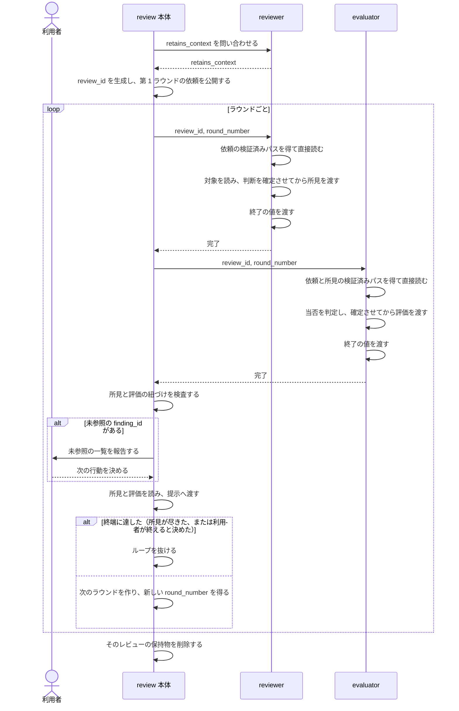

# REQ-029 review 機構の共通契約 要件定義書

## 概要

本書には、通常は設計書に属する具体的な記述（JSON のフィールド名・型等）を含む。これは、既に決定済みで選択の余地が無い事項を要件定義書に具体的に書く原則（[spec_design_boundary_spec.md](../../../../plugins/forge/docs/spec_design_boundary_spec.md) §2）に基づく。

**本書は、review 機構を成り立たせる共通の契約を定める。** レビューの進み方、reviewer/evaluator agent との受け渡し、finding_id の採番、書き出しと終了の値、review 本体の仕事、そして本体と agent の間を行き来するデータの構造である。

**本書は単独で読めるように書く。** 他の要件定義書を参照しない。参照が要るということは、本書に書いてはいけないことを書いているか、本書が自分で説明していないかのどちらかである。

**本書が定めないもの**は、reviewer/evaluator agent それぞれの振る舞いである。reviewer が対象をどう読み何を所見にするか、evaluator が何を手がかりに当否を判定するかは、それぞれの要件定義書が定める。本書はそれらを参照せず、**agent の振る舞いに踏み込まない**。

対象は review 本体（[review/SKILL.md](../../../../plugins/forge/skills/review/SKILL.md)）と、本体が起動する reviewer/evaluator agent（[reviewer.md](../../../../plugins/forge/agents/reviewer.md)・[evaluator.md](../../../../plugins/forge/agents/evaluator.md)）である。

## 対象システムの性質

開発者が自分の端末で使う review 機構の一部であり、外部公開・本番運用・個人情報の保持を伴わない（[spec_priorities_spec.md](../../../../plugins/forge/docs/spec_priorities_spec.md) §10.1 の「上記いずれにも該当しない」に該当する）。性能・可用性・運用性の定量目標は持たない。

## 用語

**review 本体が認識する用語は、すべて本書が定める。** reviewer と evaluator の一方しか使わない用語は、その要件定義書が持つ。

| 用語              | 定義                                                                                                                                           |
| ----------------- | ---------------------------------------------------------------------------------------------------------------------------------------------- |
| レビュー          | review 本体の 1 回の起動から終端まで。複数のラウンドを含み得る。何をもって終端とするかは FNC-318 が定める                                      |
| ラウンド          | reviewer が依頼を受けて結果を返し、evaluator が評価を返し、本体が次の reviewer 起動へ進むかレビューを終えるまで                                |
| review 本体       | レビューを進行させるもの。依頼を組み立て、reviewer/evaluator agent を起動し、返ってきたものを提示へ渡す（FNC-312）。本文では単に「本体」と記す |
| `review_id`       | 1 つのレビューを一意に指す不透明な値。依頼・所見・評価の置き場を script が決める手がかりであり、そのレビューに含まれる全ラウンドで同じ値を使う |
| `round_number`    | 1 つのレビュー内でラウンドを一意に指す 1 始まりの整数                                                                                          |
| レビュー依頼      | reviewer/evaluator agent への入力の全体。本体が組み立てて公開する（DM-301）。本文では単に「依頼」と記す                                        |
| `targets`         | レビュー対象の指定。依頼が持つ（DM-301）                                                                                                       |
| finding           | reviewer が返す所見 1 件（DM-302）。本文では「所見」とも記す                                                                                   |
| finding_id        | finding 1 件を指す識別子。1 つのレビューの中で一意であり、ラウンドが変わっても振り直さない（FNC-313）                                          |
| evaluation        | evaluator が返す評価 1 件（DM-201）。1 個以上の finding_id を参照する。本文では「評価」とも記す                                                |
| disposition       | evaluation が持つ判定の分類（DM-201）。本体はこの値で扱いを分ける                                                                              |
| 結果              | reviewer/evaluator agent が書き出す JSON（DM-305）。reviewer は所見、evaluator は評価を持つ。いずれも終了の値を伴う                            |
| `retains_context` | reviewer がラウンド間でコンテキストを保つかどうかの申告。本体はこの値で分岐する（FNC-316）                                                     |

## レビューの進み方

**この流れは既に決まっており、選択の余地が無い。** したがって要件定義書に具体的に書く（[spec_design_boundary_spec.md](../../../../plugins/forge/docs/spec_design_boundary_spec.md) §2）。抽象化すると、決まっていることが決まっていないことになる。

図が示すのは**契約の順序**であり、内部の処理ステップではない。agent をどう起動するか、script をどう分けるかは設計が決める。

提示から先（採否の確認・修正）は本 feature が変えない工程であり、現行のまま有効である。

## 要件一覧

### 0. 定義が持つもの

#### FNC-314: 扱いと呼び方はそれぞれの定義が持つ [MANDATORY]

**本節は JSON を読み書きするものすべてに当たる。** reviewer/evaluator agent だけでなく review 本体も含む——本体は依頼を組み立てる script を呼び、所見と評価の JSON を直接読むため、agent と同じく script の呼び方とフィールドの意味を知っていなければならない。

本体と各 agent の定義が次を持つ。依頼はこれを運ばない——依頼ごとに変わらないものを、往復のたびに運ぶ理由がない。

| 持つもの                 | 内容                                                     |
| ------------------------ | -------------------------------------------------------- |
| script の呼び方          | 書き込みと、パスの取得に用いる script を、どう呼ぶか     |
| 読む JSON の各項目の扱い | 項目が何であり、どう扱うか。値を持たないときにどう扱うか |
| 対象の読み方             | agent ごとに異なる。本体は対象を読まない                 |
| 何を述べ、何を決めるか   | agent は結果に何を挙げるか、本体はどの値で扱いを分けるか |

本書が定めるのは、**定義が持つという形**である。各項目の中身はそれぞれで異なり、本書は踏み込まない。

**どのフィールドについても、何を意味するかは事前に知っていなければならない。** JSON を直接読む以上、意味を値に添えて運ばない。**書き込む script と読む側が、同じ意味を事前に共有している必要がある。** 値へ説明を添える形にすると、同じ意味が 2 箇所に置かれ、片方だけが古くなる。

**script の側も、何を書くのかが明示されていなければ呼べない。** JSON を書くのは script であり（FNC-303）、本体も agent も script を呼ぶことでしか書けない。どの script がどのフィールドを書くかを自分の定義が持たなければ、書きたいものを書く手段を持たない。

**JSON を組み立てるための構造は持たない。** 封筒・入れ子・型を作るのは script である（FNC-303）。本体も agent も、script が返したパスの JSON を直接読み、定義済みの項目として扱う。

**本体として、または agent として動くものは、この定義を読めること。** 定義を読めなければ、script の呼び方も項目の扱いも知る手段を持たない。

### 1. 受け渡し

**本節と「3. 書き出しと終了の値」は、[agent_data_exchange_rules.md](../../../rules/agent_data_exchange_rules.md) が定める受け渡しの型を review に当てはめたものである。** 型そのもの（識別値だけを運ぶ・script が書く・パスを得て直接読む・終了の値で成否を表す）はそちらが定め、本書は review における具体（`review_id` と `round_number`・依頼と結果の構成・採番）を定める。

#### FNC-302: 入力は `review_id` と `round_number` で受け渡す [MANDATORY]

受け渡しの仕組みは次のとおりである。

- 本体がレビューの開始時に `review_id` と最初の `round_number` を生成する
- 各ラウンドの入力を、その `review_id` の下にあるラウンドごとの置き場へ JSON として保持する
- agent へは **`review_id` と `round_number` だけを渡す**。中身は渡さない
- agent は受け取った 2 値をパス解決 script へ渡す。script は絶対パスだけを返し、agent はそのファイルを直接読む
- `round_number` は最初を `1` とし、次ラウンドへ進むたびに script が 1 増やした値を返す。AI は返された値をそのまま運び、自ら数えない
- レビューが終わったら、そのレビューのために保持したものをすべて削除する。依頼・所見・評価のいずれも残さない

**本体と agent の間で AI が運ぶ識別値は `review_id` と `round_number` に限る。** JSON 本文を script の標準出力へ載せたり、AI が相手へ書き写したりしない。置き場は 2 つの値から script が決め、AI は返された絶対パスをその場のファイル読み込みにだけ使う（[deterministic_generation_spec.md](../../../../plugins/forge/docs/deterministic_generation_spec.md) §5）。

| 性質         | 内容                                                                                 |
| ------------ | ------------------------------------------------------------------------------------ |
| 生成するもの | 本体。agent を起動する前に、入力を保持する時点で生成する                             |
| 一意性       | 他のレビューと衝突しない                                                             |
| 寿命         | **1 レビューにつき 1 つ**。そのレビューに含まれる全ラウンドで同じ `review_id` を使う |

`round_number` は同じ `review_id` の中で重複しない。`review_id` と `round_number` の組が、ラウンドを一意に決める。

#### FNC-303: 入力は script が組み立てる [MANDATORY]

入力は script が組み立てる。AI が組み立てない。渡された値をそのまま置き、生成・要約・改変しない。

初回の依頼は、任意項目を含む組み立てが終わるまで未公開の下書きとして保持し、完成後に 1 回の操作で公開する。パス解決 script は公開済みのものだけを返し、組み立て途中の JSON を agent に読ませない。

したがって**形式の検証を置かない**。形が壊れるのはバグであり、実行時の検査で受け止める対象ではない（[deterministic_generation_spec.md](../../../../plugins/forge/docs/deterministic_generation_spec.md) §3・§4）。同文書 §6.1 が「AI の応答を受け取る側に検査を置く」とする例外は、**代わりに組み立てられる実行系が存在しない**ことを根拠としており、script が組み立てる本設計では成立しない。公開済みかの確認は形式検証ではなく、読み出してよい状態かの判定である。

#### FNC-304: 値は変形せずに受け渡される [MANDATORY]

受け渡される値は、途中で欠落・変形・分断されないこと。

重点観点・到達目標・前ラウンドで対応しなかった理由・所見本文・判定根拠には、**改行・引用符・バッククォート・非 ASCII** が含まれる。これらを含む値が、渡した内容と同一のまま届くこと。

- 値の内容を理由に受け渡しを拒む制約を置かない。改行を含むから渡せない、という形にしない
- 書き込みの受け渡し過程で値が構文として解釈される経路を作らない
- 読み出しでは JSON 本文を再出力・再構成せず、script が返した絶対パスのファイルを直接読む

#### FNC-305: 入力はラウンドによって形を変えない

毎ラウンド、同じ構成の入力をそのラウンドの置き場へ新しく保持する。前ラウンドの対応は依頼が持つ 1 項目であり（DM-301）、形を変える理由にはならない。前ラウンドの入力は書き換えない。

#### FNC-317: 依頼は対象の種別を載せない

依頼は、それが指す対象がどの種別であるかを持たない。種別は依頼を受け取った側が対象ごとに判定する。

**1 つの依頼が指す対象は、単一の種別に収まらない。** ディレクトリやブランチの組で指定された対象には、ソースコードと各種の文書が混在しうる。依頼が種別を 1 つ載せれば、混在した対象のうち一方を誤った種別として扱うことになる。対象を列挙してそれぞれに種別を添える形も取らない——`targets` はディレクトリを配下のファイルへ展開せず（DM-301）、差分の指定では対象の一覧をそもそも持たないため、依頼を組み立てる時点で対象が確定しない。

**どの種別があり、どう判定するかは本書が定めない。** それは対象を読む側の振る舞いである。本書が課すのは、依頼がその情報を運ばないことだけである。

### 2. 採番

#### FNC-313: finding_id は script が採番する [MANDATORY]

- **採番するのは script である。** agent は ID を渡さない。採番は既に書かれた実体から一意に決まり、AI の判断を要しない
- **1 つのレビューで 1 本の連番とする。** 最初のラウンドを `1` から始め、ラウンドが変わっても振り直さず、前ラウンドまでに採番された最大値の次から続ける。ラウンドごとに 1 へ戻すと、`prior_round` が指す前ラウンドの finding_id と、そのラウンドで新たに採番される finding_id が、同じ値で別の所見を指すことになる
- **reviewer と evaluator が 1 本の連番を分け合う。** evaluator が見落としを新規に指摘するとき、この連番から ID を消費する。同じラウンドでは reviewer が先に採番し、evaluator の新規指摘はその次から続く
- **出自は ID の境界で分かる。** そのラウンドで reviewer が採番した最大の finding_id を超える値は、evaluator が新規に指摘したものである。出自を示す別の印は持たない。reviewer がそのラウンドで 1 件も返さなかった場合、境界はそのラウンドの採番基点（そのラウンドで最初に採番される値）の 1 つ手前とする
- **出自を件数で判定しない。** ラウンドが進むと finding_id は 1 から始まらないため、所見の件数と finding_id の値は一致しない
- **採番のための状態を別に持たない。** 採番済みの ID は、そのラウンドの結果に現れる値がすべてである

### 3. 書き出しと終了の値

#### FNC-310: 書き出しは判断を確定させた後に行う [MANDATORY]

1 件ずつ渡してよい。ただし**すべての判断を確定させてから書き出す**。判断しながら逐次書き出してはならない。

**上書き・修正の操作を持たない。** 持たせれば「後から直せる」前提が生まれ、逐次の書き出しを誘発する。

逐次に書き出すと、後から前のものを直したくなる。対象を読み進めて前の判断が変わること、同じ問題が複数箇所にあると後で気づくことは起こるためである。

#### FNC-311: 終了の値で結果の成否を表す [MANDATORY]

agent は書き出し終えたら、**終了の値を渡す**。終了の値は結果の一部であり、別の記録機構を設けない。**reviewer にも evaluator にも同じく当たる。**

結果の有無と終了の値の組み合わせが、成否を表す。

| 結果     | 終了の値 | 成否       | 意味                                           |
| -------- | -------- | ---------- | ---------------------------------------------- |
| ある     | `"0"`    | 正常       | 最後まで実行した。0 件なら「挙げるものが無い」 |
| ある     | エラー値 | **エラー** | 自覚したエラーによる終了                       |
| ある     | 無い     | **エラー** | 書き出しの途中で終えた                         |
| **無い** | —        | **エラー** | 一度も書き出さずに終えた                       |

下 2 つをまとめて**書けない異常終了**と呼ぶ。どちらも扱いは同じであり、内訳を区別しない。

**書けない異常終了は、終了の値が取れないことで表される。** 異常時に何かを書かせる形では、書けない異常（落ちた・黙って終えた・起動に失敗した）を取りこぼす。正常時にだけ印が残る形なら、それらがすべて「終了の値が取れない」に収束する。

**エラーの感知は script が行う。** 結果を入力にする script が終了の値を読み、`"0"` でなければ失敗して何も書かない。そのための状態を自ら持たず、JSON 本文も返さない。終了の値を AI に確かめさせ、その結果で進退を決めさせない——判定材料は終了の値だけであり、AI の判断を要しない（[deterministic_generation_spec.md](../../../../plugins/forge/docs/deterministic_generation_spec.md) §5）。

終了の値は**文字列**とする。正常終了は `"0"`、エラーはそれ以外の定義済みの値である。同じフィールドに数値と文字列が混在すると、受け取る側が型で分岐することになる。

エラー値は**閉じた集合**とする。定義に無い値は、書けない異常終了と同じ扱いとする（未知の値を正常として通さない）。**どの値を持つかは、それを挙げる agent の要件定義書が定める。** 自覚できる失敗は agent ごとに異なるためである。**集合が空でもよい**——挙げるべきものが無ければ、その agent の失敗はすべて書けない異常終了として現れる。

**何をエラー値とするかは [error_classification_spec.md](../../../../plugins/forge/docs/error_classification_spec.md) が定める。** 正しい状態で正しく使っていても起こることだけをエラーとし、バグ・障害・判定できるものには値を与えない。

- **エラー終了した場合、それまでに書かれたものを後続の工程で使わない。** 結果が不完全であるため。利用者への報告に用いることは妨げない
- **正常に終えたのに終了の値を書き忘れた場合も、書けない異常終了として扱う。** 正しい結果が異常として扱われることはあるが、異常が正常として通るよりは安全である

### 4. 本体の仕事

#### FNC-312: 本体はレビューを進行させる

レビューを進めるのは review 本体である。reviewer も evaluator も本体が起動する agent であり、それぞれ対象を読んで所見を返す工程、所見の当否を判定する工程を担う。**本 feature が変える範囲において**、本体の仕事は次で尽きる。

| 仕事                                             | 定めている要件  |
| ------------------------------------------------ | --------------- |
| `review_id` と `round_number` を生成する         | FNC-302         |
| 依頼を組み立て、完成後に公開する                 | FNC-303・DM-301 |
| reviewer を起動する                              | FNC-302         |
| evaluator を起動する                             | FNC-302         |
| ラウンドを回す                                   | FNC-305         |
| 終端に達したかを判定し、必要なら利用者へ確認する | FNC-318         |
| `retains_context` を取得し、保持する             | FNC-316         |
| script が成否を判定した結果に従う                | FNC-311         |
| 所見と評価を読み、提示へ渡す                     | FNC-302         |
| レビューの終了時に保持物を削除する               | FNC-302         |
| 紐づけを検証する                                 | FNC-203         |
| 未参照があれば利用者へ報告し、対応を求める       | FNC-203         |
| `flawed_premise` を自動修正の対象から外す        | FNC-204         |

**どの仕組みで agent を動かすかは本書が定めない。** どう起動するかは実現手段の選択であり、設計が決める。本書が課すのは、どの agent であっても同じ契約に従うことだけである。

#### FNC-316: 本体は reviewer から `retains_context` を取得する

reviewer は、ラウンドが変わっても自分のコンテキストが残るかどうかを `retains_context` として申告する。本体はレビューを始める前にこれを取得し、そのレビューの間ずっと保持する。

| 値      | reviewer の性質                                        |
| ------- | ------------------------------------------------------ |
| `false` | ラウンドごとに新しく起こされ、前ラウンドを覚えていない |
| `true`  | 同じコンテキストが続き、前ラウンドを覚えている         |

- **申告するのは reviewer 自身である。** 名前や起動のされ方から本体が推測しない。自分の性質を知っているのは自分だけである
- **取得はレビューの開始前に 1 回である。** レビューの途中で変わる値ではなく、ラウンドごとに問い直さない
- **本体が保持する依頼は分岐しない。** 依頼は毎ラウンド同じ構成で保持され、reviewer はパスから読む（FNC-302・FNC-305）。`retains_context` によって、保持する依頼の形も、その渡し方も変わらない
- **この値で何を分けるかは本書が定めない。** 依頼を渡した後の扱いは reviewer 側の事情であり、共通契約が踏み込むところではない
- **終端は共通である。** `retains_context` の値にかかわらず、レビューは同じ条件で終わる（FNC-318）

#### FNC-318: レビューは所見が尽きるか、利用者が終えると決めたときに終わる

レビューが終端に達するのは、次のいずれかのときである。それ以外は次のラウンドへ進む。

| 終端の条件             | 内容                                                |
| ---------------------- | --------------------------------------------------- |
| 所見が尽きた           | そのラウンドで reviewer が所見を 1 件も返さなかった |
| 利用者が終えると決めた | 本体が利用者へ確認し、終えるという回答を得た        |

- **所見が残っていても終えられる。** 残った所見が軽微で対応の必要が無いと本体が判断したときは、利用者へ確認して終えてよい。**判断するのは本体だが、決めるのは利用者である**——本体が単独で打ち切らない
- **所見が尽きたときは確認を要しない。** 指摘が無いことが、これ以上のラウンドが要らないことを意味する
- 終端に達したら、そのレビューの保持物を削除する（FNC-302）
- 対応しないまま終えた所見は、未対応所見として報告に残る

#### FNC-203: 全 finding_id はいずれかの evaluation に紐づく

reviewer が返した全 finding_id が、いずれかの evaluation から参照されていることを**機械的に検証する**。

**これは形式の検証ではない。** FNC-303 が置かないとしたのは、値が契約の形を満たすかの検査である。本要件が課すのは、**所見と評価という 2 つの集合の関係**が成立しているかの検証であり、script が組み立てても自動的には満たされない。

参照されていない finding_id を検出した場合、**そのまま結合せず、未参照の一覧を利用者へ報告し、次の行動を決めてもらう**。

**未参照の所見を対象から外せば、残りだけで継続できる。** 外した所見は未対応所見として報告に残る。

#### FNC-204: flawed_premise は自動修正の対象にしない

`disposition: flawed_premise` は、`confidence`・`fix_confident` の値に関わらず、`--auto` モードでも自動修正の対象にしない。修正対象が今回のレビュー対象の外（規範文書等）にあるため、常に提示して採否を得る。

### データモデル

#### DM-301: 依頼の構成

依頼は次の情報を持つ。`review_id` と `round_number` が指すラウンドの下に保持され、agent は script から検証済みの絶対パスを得て JSON を直接読む（FNC-302）。

| 情報        | 型             | 必須 | 内容                                                   |
| ----------- | -------------- | ---- | ------------------------------------------------------ |
| targets     | 下表           | 必須 | レビュー対象の指定                                     |
| focus       | 文字列         | 任意 | 今回の依頼で特に注意を払う対象                         |
| scope       | 文字列         | 任意 | 今回の到達目標と、意図的に含めなかった項目             |
| references  | 絶対パスの配列 | 任意 | プロジェクト固有のルール文書・仕様書のパス             |
| prior_round | 下表           | 任意 | 前ラウンドの所見に対してどう対応したか。初回は持たない |

依頼は対象の指定の仕方で形を変えない。指定の仕方による違いは `targets` の形が表す。

##### targets の形

次のいずれか 1 つの形を持つ。**どの形であるかを `kind` が示す。** 読む側は `kind` を見て残りのフィールドを解釈し、どのフィールドがあるかから形を推測しない。

| `kind`     | 形           | 併せて持つもの                                                                                               |
| ---------- | ------------ | ------------------------------------------------------------------------------------------------------------ |
| `paths`    | 列挙         | ファイルの並びとディレクトリの並びを**別々に**持つ。**ディレクトリを配下のファイルへ展開しない**（粒度保存） |
| `branches` | ブランチの組 | 比較の基点となるブランチと、対象のブランチ                                                                   |
| `diff`     | 範囲         | 何も持たない。未コミット差分を指す                                                                           |

##### prior_round の構成

初回の依頼は持たない。2 ラウンド目以降が持つ。

前ラウンドの所見ごとに 1 要素を持つ並びである。各要素は次を持つ。

| フィールド | 型     | 必須                     | 内容                                            |
| ---------- | ------ | ------------------------ | ----------------------------------------------- |
| finding_id | 整数   | 必須                     | どの所見への対応かを指す                        |
| handled    | 真偽値 | 必須                     | 対応したかどうか                                |
| reason     | 文字列 | `handled` が偽のとき必須 | なぜ対応しなかったか。reviewer が読める形で書く |

#### DM-302: finding の構成

reviewer が返す finding は次のフィールドを持つ。

| フィールド | 型     | 必須 | 内容                               |
| ---------- | ------ | ---- | ---------------------------------- |
| finding_id | 整数   | 必須 | script が採番する識別子（FNC-313） |
| severity   | enum   | 必須 | `critical` / `major` / `minor`     |
| location   | 文字列 | 必須 | 位置（DM-304）                     |
| body       | 文字列 | 必須 | 所見本文                           |

何を所見として挙げるかは reviewer の振る舞いであり、本書は定めない。

#### DM-201: evaluation の構成

evaluator が返す evaluation は次のフィールドを持つ。

| フィールド    | 型         | 必須                                                           | 内容                                                                                                     |
| ------------- | ---------- | -------------------------------------------------------------- | -------------------------------------------------------------------------------------------------------- |
| finding_ids   | 整数の配列 | 必須（1 個以上。空配列は不正）                                 | 参照する finding の ID を列挙する。全件を対象とする場合も省略記法を用いず列挙する                        |
| disposition   | enum       | 必須                                                           | `invalid` / `misunderstanding` / `flawed_premise` / `out_of_scope` / `valid`                             |
| severity      | enum       | 必須                                                           | `critical` / `major` / `minor`                                                                           |
| reason        | 文字列     | 必須                                                           | 判定根拠                                                                                                 |
| confidence    | enum       | `valid` のとき必須                                             | `confirmed` / `inferred` / `unverified`                                                                  |
| fix_confident | 真偽値     | `valid` のとき必須                                             | `confidence: confirmed` でなければ真になれない                                                           |
| location      | 文字列     | evaluator が新規に指摘した finding_id（FNC-313）を含むとき必須 | 位置（DM-304）。reviewer 由来の finding_id だけを参照する場合、位置は参照先の finding が持つため持たない |

##### disposition の各値

| 値                 | 意味                                                                                                                                                           |
| ------------------ | -------------------------------------------------------------------------------------------------------------------------------------------------------------- |
| `invalid`          | 観点文書・対象の実態に照らして妥当でない指摘                                                                                                                   |
| `misunderstanding` | 対象・前提の理解に誤りがある指摘                                                                                                                               |
| `out_of_scope`     | 依頼の `scope` が宣言した意図的な未実装を欠陥として報告している指摘。ただし、範囲外を前提に設計書・仕様書の記述と現状の乖離を指摘している場合は `valid` とする |
| `flawed_premise`   | 指摘そのものではなく、その指摘が依拠する規範文書の側に欠陥がある                                                                                               |
| `valid`            | 上記のいずれにも該当しない、妥当な指摘                                                                                                                         |

**どの値を選ぶかをどう判定するかは、本書の範囲外である。** 判定の手順は evaluator の振る舞いであり、その要件定義書が定める。本書が定めるのは、各値が何を意味するかと、本体がその値で扱いを分けること（FNC-204）である。

##### confidence と fix_confident

**この 2 つは対象が違う。** 混ぜると「指摘は正しいが、直し方が分からない」を表せなくなる。

| フィールド      | 何を述べるか                           |
| --------------- | -------------------------------------- |
| `confidence`    | **指摘そのものが正しいと言えるか**     |
| `fix_confident` | **その修正を責任を持って実行できるか** |

`confidence` の各値。

| 値           | 意味                           |
| ------------ | ------------------------------ |
| `confirmed`  | 確認済み。実物を見た・実行した |
| `inferred`   | 推論。根拠はあるが未確認       |
| `unverified` | 未検証。記憶・推測のみ         |

- **`confidence` が `confirmed` でなければ `fix_confident` は真になれない。** 正しいと確かめていない指摘の修正を、責任を持って実行できるとは言えない
- **値が無い場合は低い側として扱う**（`unverified` / 偽）。付け忘れが確信度を高く見せないよう、この向きにする
- 確信が低く、検証できるなら**検証する**（実物を読む・実行する）。割に合わない場合だけそのまま渡す

##### severity

**severity を決めるのは書く側の主観ではなく、その所見が違反している規範文書の重大度カタログである**（[review_priorities_spec.md](../../../../plugins/forge/docs/review_priorities_spec.md) §2.2）。カタログから転記し、推測で割り当てない。

**evaluation の severity は evaluator 自身の判断である。** reviewer の値を写すものではない。evaluator は所見の当否を独立に判定するため、どの規範のどの条項に当たるかの判断が reviewer と異なることがあり、そのとき severity も異なる。evaluator は自分の結果にしか書けないため、finding の severity は書き換わらず、2 つの値が並んで残る。

**値そのものに他の判断（disposition の当否・修正するかどうか等）を振り回されてはいけない。** 判断の実質を持つのは reason であり、severity を取り違えても人間が reason を読めば重大さは伝わる。

evaluation は finding と 1 対 1 の対応を持たない。同じ finding_id を複数の evaluation が参照することも許される。**食い違った場合の調停は本体の判断に委ね、要件としては規則化しない。**

#### DM-304: パスと位置の表記

**保持するパスはすべて絶対パスとする。** 依頼が運ぶ参照文書のパスも、所見と評価が指す位置も同じである。

理由は 2 つある。

- **一過性であり、配布されない。** これらの JSON は 1 回のレビューの間だけ存在し、リポジトリへ入らず、本体と agent しか読まない。絶対パスを書いても、その環境の外へ持ち出されない。配布物とは扱いが異なる——配布物に絶対パスを書けば 1 つの環境に固定され、他のすべての利用者で壊れるため禁じられる
- **書く側も読む側も演算を要しない。** agent は対象を読むのに使った絶対パスをそのまま書き、受け取る側はそのまま開ける。相対にすると書く側がプロジェクトルートを引き、読む側が足すことになり、どちらかが忘れれば「ファイルが無い」という形でしか現れない失敗になる

**プロジェクトルートを JSON で運ばない。** 本体も agent も自分の定義から実パスを知る（FNC-314）。既に知っている値を運ばない。

位置は `ファイルパス:行` の文字列とする。特定できない場合は `位置未確定` と明示する。

**行番号は書いた時点のものであり、修正を適用する時点で有効である保証はない。** 同じラウンドで複数箇所を順に修正すると、先の修正による行の増減で、後の位置がずれる。

したがって**修正する側は、対象を読み直して位置を確定してから適用する**。行番号は「どこの話か」を伝えるためのものであり、修正箇所を機械的に決めるための座標ではない。

利用者への提示で長くなる点は、表示のときに短く出せば足りる。保持する値の問題ではない。

#### DM-305: 結果の構成

agent が書き出す結果は、**書き出した要素の配列と終了の値を持つ 1 つの構造**である。

| agent     | 要素の配列    | 内容                                                 |
| --------- | ------------- | ---------------------------------------------------- |
| reviewer  | `findings`    | 書き出された所見（DM-302）。順序は finding_id の昇順 |
| evaluator | `evaluations` | 書き出された評価（DM-201）                           |

いずれも 0 件のことがある。加えて、両者とも終了の値を持つ。

| フィールド | 型             | 必須                 | 内容                             |
| ---------- | -------------- | -------------------- | -------------------------------- |
| `exit`     | 文字列（enum） | 書き出しを終えたとき | `"0"`、またはエラー値（FNC-311） |

`exit` を持たない結果は、書き出しの途中で終えたことを意味する。この構造自体が存在しないこともある。いずれも書けない異常終了として扱う（FNC-311）。
