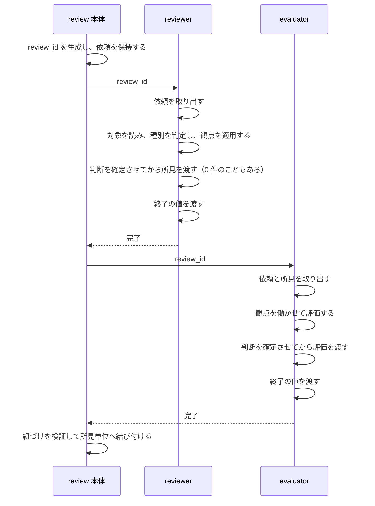
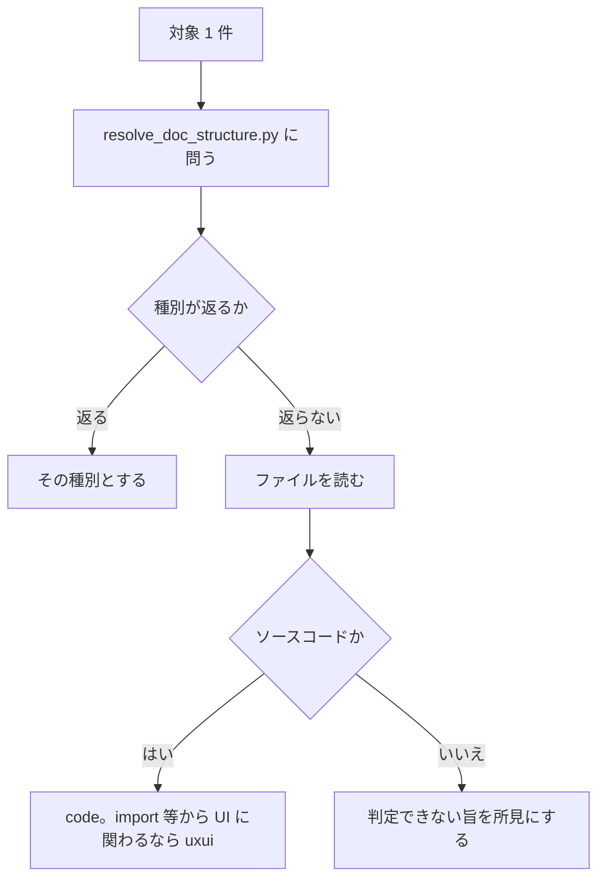

# DES-084 reviewer と受け渡し機構 設計書

## 1. 概要

[REQ-027](../requirements/REQ-027_reviewer.md) を実現する設計を定める。

本書が持つのは次の 3 つである。

| 範囲         | 内容                                                                                                                                                                                                |
| ------------ | --------------------------------------------------------------------------------------------------------------------------------------------------------------------------------------------------- |
| 受け渡し機構 | `review_id` の規約と、依頼・所見を保持し取り出す script。**evaluator との受け渡しもこの機構による**（[REQ-026](../../evaluator-perspective/requirements/REQ-026_evaluator_perspective.md) FNC-207） |
| シーケンス   | 依頼の保持から、所見と評価が結び付くまでの流れ                                                                                                                                                      |
| reviewer     | 種別の判定と観点の選択、所見の作り方                                                                                                                                                                |

evaluator 自身の設計と、本体が評価をどう扱うかは [DES-083](../../evaluator-perspective/design/DES-083_evaluator_perspective_design.md) が持つ。

## 2. シーケンス



結び付けから先（振り分け・提示・修正）は本書の範囲ではない。

**AI が運ぶのは `review_id` だけである。** 依頼も所見も評価も、AI の手を経由せず script が保持し取り出す。

**本体は所見を取り出さない。** 中身を使うのは結び付けの後（振り分けと提示）であり、それまでは `review_id` を渡すだけでよい。evaluator は同じ `review_id` から自分で取り出す。

evaluator の区間（評価・紐づけ・追加依頼・振り分け）の詳細は [DES-083](../../evaluator-perspective/design/DES-083_evaluator_perspective_design.md) が持つ。

**エラーフロー**: 終了の値が `0` でなければ、そのラウンドはエラーである。結果そのものが無い場合も同じ（§4.4）。

## 3. 責務

| 担い手                          | 責務                                                                            | 要件         |
| ------------------------------- | ------------------------------------------------------------------------------- | ------------ |
| review 本体                     | `review_id` を生成し、依頼を保持する                                            | FNC-302      |
| review 本体                     | reviewer を `review_id` で起動する                                              | FNC-302・309 |
| `scripts/reviewer/exchange.py`  | `review_id` の下に依頼・所見を保持し、取り出す                                  | FNC-302・303 |
| `scripts/evaluator/exchange.py` | `review_id` の下に評価を保持し、取り出す                                        | FNC-302・303 |
| reviewer                        | 依頼を取り出し、対象を読み、種別を判定し、観点を適用し、所見を渡す              | FNC-306〜309 |
| `resolve_doc_structure.py`      | パスから文書の種別を返す                                                        | FNC-307      |
| `reviewer.md`                   | script の呼び方、依頼の各項目の扱い、種別ごとに読む文書、所見として何を述べるか | FNC-301      |

## 4. 受け渡し機構

### 4.1 `review_id`

| 決めたこと   | 内容                                                             |
| ------------ | ---------------------------------------------------------------- |
| 生成する主体 | review 本体。reviewer を起動する前、依頼を保持する時点で生成する |
| 形           | 他のレビューと衝突しない不透明な値。意味を読み取らせない         |
| 寿命         | 1 レビューにつき 1 つ。往復の全ラウンドで同じ値を使う            |

**`review_id` から置き場を AI が組み立てない。** `review_id` を受け取った script が置き場を決める（[deterministic_generation_spec.md](../../../../plugins/forge/docs/deterministic_generation_spec.md) §5）。AI は `review_id` を右から左へ渡すだけである。

### 4.2 script の責務

#### 要件から導かれる、保証すべきこと

操作を決める前に、各要件が script に何を求めているかを確定する。

**script は JSON を書くか、読んで返すかだけを行う。状態を自ら持たない。** 何が起きたかはすべて JSON に現れ、script はそれを解釈して報告する。

| 要件                     | script が保証すること                                                                                                   |
| ------------------------ | ----------------------------------------------------------------------------------------------------------------------- |
| FNC-302                  | `review_id` から置き場を自ら決める。AI にパスを組み立てさせない。`review_id` を知らなければ何も読み書きできない         |
| FNC-303                  | 渡された値をそのまま置き、生成・要約・改変しない。構造は script が作る。**形式を検査する口を持たない**                  |
| FNC-304                  | 改行・引用符・バッククォート・非 ASCII を含む値を、渡した内容と同一で保持し復元する。値の内容を理由に受け渡しを拒まない |
| FNC-305                  | ラウンドが変わっても同じ操作・同じ構成で受け付ける。ラウンドを引数に取らない                                            |
| FNC-309                  | 所見を 1 件ずつ受け取り、配列として復元する（DM-303 の `findings`）。0 件を表現できる                                   |
| FNC-310                  | 上書き・修正の操作を持たない。一度書かれた所見を書き換える口を開けない                                                  |
| FNC-311                  | 結果を読み、終了の値が `0` でなければ**エラーとして報告する**。結果が無い場合も同じ                                     |
| `forge:REQ-013` FNC-1322 | reviewer に渡す script が evaluator の領域へ書けない                                                                    |

最下段から 2 行目が、取り出しの形を決める。判定材料は終了の値だけであり完全に決定論的なので、AI の判断を挟む理由がない（[deterministic_generation_spec.md](../../../../plugins/forge/docs/deterministic_generation_spec.md) §5）。**終了の値をそのまま返して呼び出し側に判定させる形を取らない**——判定が AI 側にあると、確認を飛ばして次へ進む経路が残り、機構ではなく手順が正しさを担うことになる。

したがって確認を独立した操作として持たず、**取り出し操作が失敗することで止める**。本体も evaluator も、次にやることは取り出しであり、それが失敗すれば先へ進みようがない。

#### 主体ごとに分ける

受け渡しの script を、reviewer 用と evaluator 用のディレクトリへ分ける。

| ディレクトリ                       | script        | 扱うもの   |
| ---------------------------------- | ------------- | ---------- |
| `plugins/forge/scripts/reviewer/`  | `exchange.py` | 依頼・所見 |
| `plugins/forge/scripts/evaluator/` | `exchange.py` | 評価       |

**分ける理由**: reviewer が評価を書き込める経路を持たない。1 本にまとめると、reviewer に渡した script が evaluator の領域へも書けることになり、独立評価（`forge:REQ-013` FNC-1322）の前提が機構の側から崩れる。

置き場は共有領域とする——reviewer・evaluator・review 本体の 3 者が呼ぶ（[DES-024](../../forge/design/DES-024_skill_script_layout_design.md)）。

#### 操作

| 操作           | script    | 渡すもの                             | 返すもの   | 終了の値が `0` でない / 結果が無いとき |
| -------------- | --------- | ------------------------------------ | ---------- | -------------------------------------- |
| 依頼を保持する | reviewer  | `review_id` と、依頼が持つ各項目の値 | なし       | —                                      |
| 依頼を取り出す | reviewer  | `review_id`                          | 依頼       | —                                      |
| 所見を渡す     | reviewer  | `review_id` と、所見 1 件分の値      | なし       | —                                      |
| 終了の値を渡す | reviewer  | `review_id` と、終了の値             | なし       | —                                      |
| 所見を取り出す | reviewer  | `review_id`                          | 所見の配列 | **失敗する**                           |
| 評価を渡す     | evaluator | `review_id` と、評価 1 件分の値      | なし       | —                                      |
| 終了の値を渡す | evaluator | `review_id` と、終了の値             | なし       | —                                      |
| 評価を取り出す | evaluator | `review_id`                          | 評価の配列 | **失敗する**                           |
| 片付ける       | reviewer  | `review_id`                          | なし       | —                                      |

所見の取り出しは reviewer の結果を、評価の取り出しは evaluator の結果を見る。失敗時は、終了の値が何であったか（エラー値か、結果そのものが無いか）を添えて報告する——利用者が原因を知るために要る。

**終了の値をそのまま返すだけの操作を置かない。** 置けば、呼び出し側がそれを無視して先へ進める（前掲の導出）。

**上書き・修正の操作を持たない**（FNC-310）。一度書かれた所見を書き換える口を開けると、判断しながら逐次書き出す形を誘発する。

evaluator は依頼と所見を読む必要があるため、reviewer 側の script の取り出し操作を呼ぶ。**書き込みは自分の側にしか持たない。**

片付けは `review_id` のディレクトリごと消すため（§4.3）、主体ごとに持たず reviewer 側に 1 つ置く。呼ぶのは review 本体である。

**所見と評価は 1 件ずつ渡す。** 1 回でまとめて渡すより AI の負担が軽い。書き出しは判断を確定させた後に行うため（FNC-310）、途中で前の所見を直す必要が生じない。書き出しの途中で落ちた場合は終了の値が書かれず、異常として判定される（FNC-311）。

### 4.3 置き場

`review_id` で分け、その下を主体ごとに分ける。

```
.claude/.temp/review/
└── <review_id>/
    ├── reviewer/     依頼・所見
    └── evaluator/    評価
```

- **`review_id` を外側に置く**。`review_id` は 1 レビューにつき 1 つであり（FNC-302）、その寿命はレビューの寿命と一致する。1 `review_id`＝1 ディレクトリなら、レビューが終わったときの後始末が 1 回で済む。主体を外側にすると、同じレビューの内容が 2 箇所へ散る
- **その下を主体で分ける**。evaluator は同じ `review_id` の下から reviewer の所見を見つけられる
- 一時領域に置く。プロジェクトの規約が `.claude/.temp/` を一時ファイルの置き場としており、`.gitignore` に登録済みである

**書き込みの隔離は入れ子の順ではなく script が決める**（§4.2）。reviewer 側の script は `reviewer/` の下にしか書かない。

置き場を組み立てるのは script であり、AI は `review_id` を渡すだけである（§4.1）。

レビューが終わったとき、その `review_id` のディレクトリを削除する。残しても次のレビューは別の `review_id` を使うため参照されず、溜まるだけになる。

### 4.4 終了の値

reviewer は所見を書き出し終えたら**終了の値を渡す**（FNC-311）。所見が 0 件でも渡す。evaluator も同様である。

終了の値は結果 JSON の 1 フィールドであり（DM-303 の `exit`）、別の記録機構ではない。script はそれを書き、読んで報告するだけで、状態を自ら持たない。

| 結果     | 終了の値 | 意味                                |
| -------- | -------- | ----------------------------------- |
| ある     | `0`      | 正常終了。所見 0 件なら「指摘なし」 |
| ある     | エラー値 | 自覚したエラーによる終了            |
| ある     | 無し     | 書き出しの途中で終えた              |
| **無い** | —        | 一度も書き出さずに終えた            |

下 2 つが**書けない異常終了**である。どちらも扱いは同じで、取り出しが失敗する（§4.2）。内訳の区別は script の内部事情であり、要件は区別しない。

**なぜ異常時に書かせないか。** 異常を書かせる形では、書けない異常（落ちた・黙って終えた・起動に失敗した）を取りこぼす。正常時にだけ印が残る形なら、それらがすべて「終了の値が取れない」に収束する。

**なぜ主体自身にエラーを返させないか。** reviewer も evaluator も AI であり、失敗を申告せずに終えることがある。応答が返ったことは、レビューが行われたことを意味しない。したがって失敗の申告を受け取る形ではなく、**成功の印を残させ、その不在を失敗とみなす**形を取る。

この形でなければ、所見 0 件のとき「指摘が無かった」と「所見を渡さずに終えた」が同じ姿になり、後者が正常として通る。

**`review_id` が不正な場合と区別できる。** 依頼の JSON は本体が必ず書くため（FNC-302）、依頼が無ければ `review_id` が不正、依頼はあるが結果が無ければ reviewer が一度も書き出さなかった、と JSON の有無だけで分かれる。

書き忘れによる偽陽性は残るが、正しい結果が異常として扱われるほうが、異常が正常として通るより安全である（FNC-311）。

### 4.5 値の受け渡し

**自由記述の値は標準入力から渡す。** 所見の本文・重点観点・到達目標・判定根拠には、改行・引用符・バッククォート・非 ASCII が含まれる（FNC-304）。

これらをコマンドライン引数へ載せると、シェルの解釈を経る。引用の崩れで値が分断され、あるいは構文として解釈される。`consult` が同じ問題に対して既に標準入力を用いており（`agenda_wrapper.py`）、本設計はその形を踏襲する。

**値の内容を理由に拒まない。** 改行を含むから渡せない、という制約を置かない。

### 4.6 形式の検証を置かない

script が組み立てる以上、形が壊れるのはバグである（FNC-303）。実行時に形式を検査する script を設けない。

検査が要るのは、**script が組み立てても自動的には満たされないもの**だけである。所見と評価の紐づけ（[REQ-026](../../evaluator-perspective/requirements/REQ-026_evaluator_perspective.md) FNC-203）がこれにあたり、[DES-083](../../evaluator-perspective/design/DES-083_evaluator_perspective_design.md) が持つ。

## 5. 保持する構造

### 5.1 依頼

```json
{
  "project_root": "/abs/path/to/project",
  "targets": {
    "kind": "paths",
    "files": ["/abs/a.md"],
    "dirs": ["/abs/docs/"]
  },
  "focus": "…",
  "scope": "…",
  "references": [{ "path": "/abs/docs/rules/foo.md", "note": "…" }],
  "prior_round": [{ "finding_id": 1, "handled": true, "reason": "…" }]
}
```

`targets` の `kind` が形を示す（FNC-307 の判別可能性）。

| `kind`     | 持つもの                                                                    |
| ---------- | --------------------------------------------------------------------------- |
| `paths`    | `files` と `dirs`。**ディレクトリを配下のファイルへ展開しない**（粒度保存） |
| `branches` | 基点と対象のブランチ名                                                      |
| `diff`     | なし。未コミット差分を指す                                                  |

`focus` / `scope` / `references` / `prior_round` は持たないことがある。**持たないことの意味は `reviewer.md` が述べる**（FNC-301）——値の不在そのものに意味を持たせない。

### 5.2 所見

```json
{
  "finding_id": 1,
  "severity": "major",
  "location": "docs/rules/foo.md:42",
  "body": "…"
}
```

`finding_id` は reviewer が 1 始まりの連番で渡す。`location` は文字列のまま保持する——分解した値を必要とする消費者がいない。

### 5.3 結果

所見の配列と終了の値を 1 つの構造として保持する（DM-303）。

```json
{
  "findings": [
    { "finding_id": 1, "severity": "major", "location": "…", "body": "…" }
  ],
  "exit": "0"
}
```

`findings` は所見を渡すたびに伸び、`exit` は終了の値を渡したときに現れる。**`exit` が無い、あるいはこの構造自体が無いことが、書けない異常終了を表す**（§4.4）。

evaluator の結果も同型で、`findings` が `evaluations` に置き換わる（[REQ-026](../../evaluator-perspective/requirements/REQ-026_evaluator_perspective.md) FNC-209）。

## 6. reviewer

### 6.1 定義が持つもの

`plugins/forge/agents/reviewer.md` が持つ。

| 持つもの               | 内容                                                                                                 |
| ---------------------- | ---------------------------------------------------------------------------------------------------- |
| script の呼び方        | `scripts/reviewer/exchange.py` で依頼を取り出す・所見を渡す。`resolve_doc_structure.py` で種別を得る |
| 依頼の各項目の扱い     | 項目が何であり、どう扱うか。持たないときにどう扱うか                                                 |
| 対象の読み方           | `targets` の `kind` ごと（§6.2）                                                                     |
| 種別ごとに読む文書     | `REQ-027` FNC-308 の対応（§6.4）                                                                     |
| 所見として何を述べるか | 何を問題として挙げ、どこまで書くか                                                                   |

**JSON の構造は持たない。** reviewer は JSON を組み立てず、script に値を渡すだけである。

### 6.2 対象を読む

| `kind`     | 読み方                                                  |
| ---------- | ------------------------------------------------------- |
| `paths`    | `files` は全文読む。`dirs` は配下を自ら列挙して全文読む |
| `branches` | 基点から分岐して以降の全変更を、自ら差分から確定する    |
| `diff`     | 未コミット変更のすべてを、自ら差分から確定する          |

差分から確定する場合、削除とリネームも変更に含める。`reviewer.md` は `git diff` 等を実行できるため、一覧を渡さなくても確定できる。

### 6.3 種別を判定する

**先に設定を引き、決まらないものだけファイルを見る。**



`resolve_doc_structure.py` は `.doc_structure.yaml` の宣言から `design` / `plan` / `requirement` / `rule` を返す。**改修して、パスを与えて種別を返す口を設ける**——同 script が既に同ファイルの解決を担っており、別 script にすると設定を解釈する箇所が 2 つになる。

設定にも実体にも当たらずに、名前だけで種別を当てない。

### 6.4 種別ごとに読む文書

`REQ-027` FNC-308 が定める対応を `reviewer.md` が持つ。内蔵文書は `${CLAUDE_PLUGIN_ROOT}/docs/` 配下の固定パスで直接参照する（[forge_doc_access_principle.md](../../../../docs/rules/forge_doc_access_principle.md) の経路 A）。プロジェクト固有の文書は依頼の `references` が運ぶ（同経路 B）。

**規範の中身を `reviewer.md` に写さない。** 持つのは観点文書への索引までであり、観点文書から規範への委譲は観点文書の側が持つ。

### 6.5 所見を渡す

**すべての判断を確定させてから書き出す**（FNC-310）。対象を読み進めて前の判断が変わること、同じ問題が複数箇所にあると後で気づくことは起こるため、判断しながら逐次書き出さない。

確定した所見を 1 件ずつ `scripts/reviewer/exchange.py` へ渡す。`finding_id` は reviewer が 1 始まりの連番で採る。所見が無ければ 1 件も渡さない。

書き出し終えたら終了の値を渡す（§4.4）。所見が 0 件でも渡す。自覚したエラーで終える場合は、`0` の代わりにエラー値を渡す（FNC-311）。

## 7. review 本体

本体が担うのは、`review_id` の生成と、起動と、取り出しである。

| 段         | 手順                                                                                                                                                        |
| ---------- | ----------------------------------------------------------------------------------------------------------------------------------------------------------- |
| 依頼       | `review_id` を生成し、`scripts/reviewer/exchange.py` へ依頼の各項目を渡す。`references` は `/forge:query-db-rules` / `/forge:query-db-specs` の結果を用いる |
| 起動       | reviewer を `review_id` で起動する。続けて evaluator を `review_id` で起動する                                                                              |
| 次ラウンド | 同じ `review_id` のまま、`prior_round` を更新して再び起動する。形は変えない（FNC-305）                                                                      |
| 片付け     | レビューが終わったとき、`review_id` のディレクトリを片付ける（§4.3）                                                                                        |

**確認の段を持たない。** reviewer の終了の値が `0` でなければ、次に所見を取り出す者——evaluator——の取り出しが失敗する（§4.2）。本体が終了の値を確かめる手順を挟むと、その手順を飛ばせば進めてしまう。手順ではなく機構で止める。

失敗が reviewer の直後ではなく evaluator の起動後に現れるが、正常系の流れは変わらず、失敗時に起動が 1 回余分に走るだけである。早く知るために、本体に中身を取り出させる経路（§2）を開けることはしない。

**`references` は種別で絞らない。** どの種別が対象に含まれるかは reviewer が判定するため、依頼を組み立てる時点では確定しない。全種別分を問い合わせて渡し、reviewer が該当するものを使う。

依頼の組み立てを AI が行わない。本体は値を渡すだけで、構造は script が作る（FNC-303）。

## 8. テスト設計

**単体テスト対象**:

- `scripts/reviewer/exchange.py` / `scripts/evaluator/exchange.py`: 同じ `review_id` で保持したものが取り出せること。**異なる `review_id` の内容が混ざらないこと**。改行・引用符・バッククォート・非 ASCII を含む値が、渡した内容と同一で取り出せること。1 件ずつ渡したものが配列として取り出せること。保持していない `review_id` で取り出そうとしたとき失敗すること
- 置き場の分離: reviewer 側の script が evaluator の置き場へ書き込まないこと
- 終了の値: 終了の値が無い状態で取り出しが失敗すること。**結果そのものが無い状態でも失敗すること**。`0` なら取り出せること。**定義に無いエラー値でも失敗すること**。所見 0 件かつ `0` なら 0 件の配列を返すこと。reviewer だけが `0` を書いた状態で、評価の取り出しが失敗すること
- 上書きの不在: 同じ `finding_id` で 2 度渡したとき、後から上書きされないこと（FNC-310）
- `resolve_doc_structure.py`（改修分）: `.doc_structure.yaml` が宣言するパターンに合うパスへ種別を返すこと。合わないパスへ種別を返さないこと

**契約テスト対象**:

- `reviewer.md` が持つ script の呼び方が、`scripts/reviewer/exchange.py` / `resolve_doc_structure.py` の実際の引数と一致すること
- `reviewer.md` が `REQ-027` FNC-308 の全種別・全文書を持つこと

**統合テスト対象**:

- `review_id` の生成から所見の取り出しまでが、`targets` の 3 形すべてで成立すること
