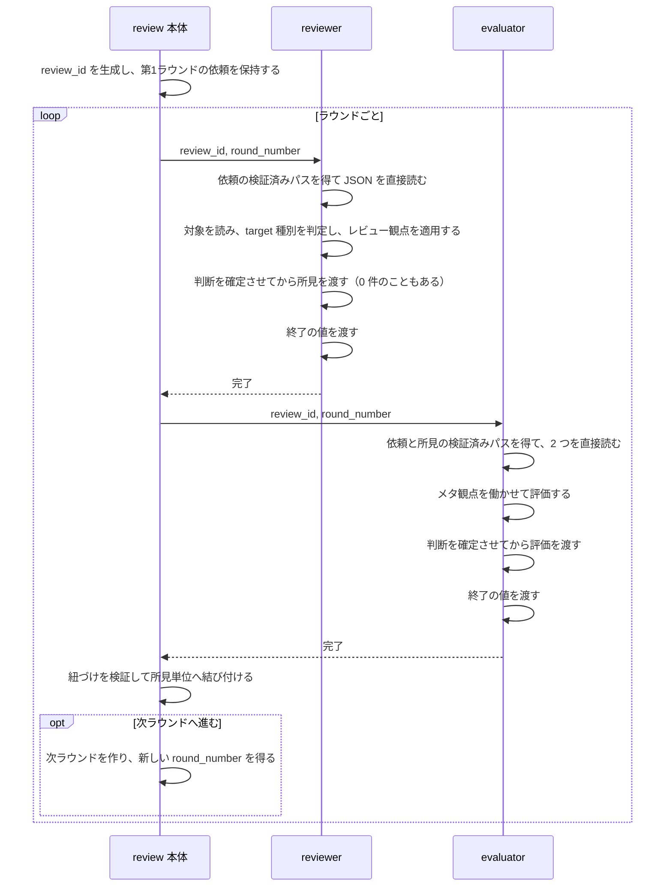
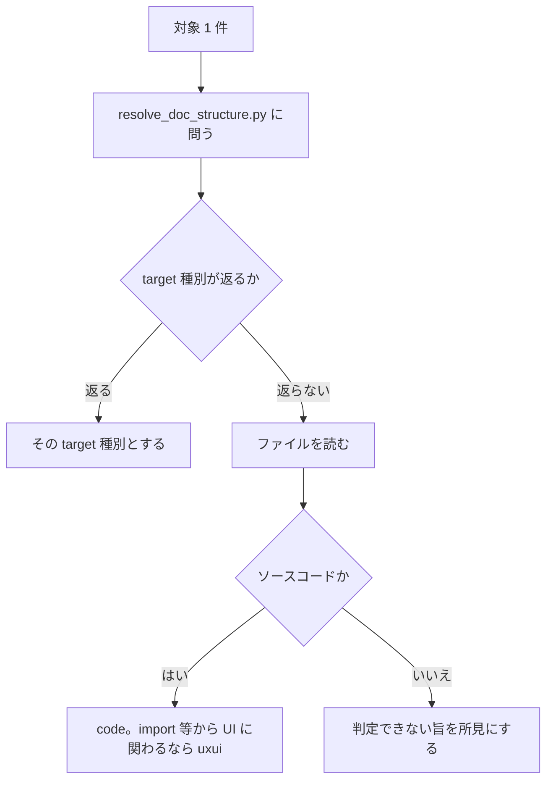

# DES-084 reviewer と受け渡し機構 設計書

## 1. 概要

[REQ-027](../requirements/REQ-027_reviewer.md) を実現する設計を定める。

本書が持つのは次の 3 つである。

| 範囲         | 内容                                                                                                                                                                                                                              |
| ------------ | --------------------------------------------------------------------------------------------------------------------------------------------------------------------------------------------------------------------------------- |
| 受け渡し機構 | `review_id`・`round_number` の規約と、依頼・所見を保持し、検証済みのパスを返す script。**evaluator との受け渡しもこの機構による**（[REQ-026](../../evaluator-perspective/requirements/REQ-026_evaluator_perspective.md) FNC-207） |
| シーケンス   | 依頼の保持から、所見と評価が結び付くまでの流れ                                                                                                                                                                                    |
| reviewer     | target 種別の判定とレビュー観点の選択、所見の作り方                                                                                                                                                                               |

evaluator 自身の設計と、本体が評価をどう扱うかは [DES-083](../../evaluator-perspective/design/DES-083_evaluator_perspective_design.md) が持つ。

## 2. シーケンス



結び付けから先（振り分け・提示・修正）は本書の範囲ではない。

**主体間で AI が運ぶ識別値は `review_id` と `round_number` だけである。** 依頼・所見・評価は script が保持する。AI が内容を必要とするときは、script が返した絶対パスを使って JSON を直接読み、JSON 本文を script の標準出力や別主体から受け取らない。

**本体も、パスを得てから読む。** 所見と評価の中身が要るときは、各 `resolve_result_path.py` へ `review_id` と `round_number` を渡し、返されたパスの JSON を直接読む（FNC-309、[REQ-026](../../evaluator-perspective/requirements/REQ-026_evaluator_perspective.md) FNC-209）。紐づけの検証は `link_evaluations.py` が両 JSON を内部で読んで行い、本文を標準出力へ返さない。evaluator も同じ 2 値からパスを解決し、依頼と所見を直接読む。

evaluator の区間（評価・紐づけの検証・結び付け）の詳細は [DES-083](../../evaluator-perspective/design/DES-083_evaluator_perspective_design.md) が持つ。

**エラーフロー**: 終了の値が `"0"` でなければ、そのラウンドはエラーである。結果そのものが無い場合も同じ（§4.4）。

## 3. 責務

| 担い手                          | 責務                                                                                   | 要件         |
| ------------------------------- | -------------------------------------------------------------------------------------- | ------------ |
| review 本体                     | `review_id` と最初の `round_number` を生成し、依頼を保持する                           | FNC-302      |
| review 本体                     | reviewer を `review_id` と `round_number` で起動する                                   | FNC-302・309 |
| `scripts/review/` の各 script   | 依頼を組み立てて公開し、その検証済みパスを返し、ラウンドを進める（§4.2）               | FNC-302・303 |
| `scripts/reviewer/` の各 script | 依頼の検証済みパスを返し、所見と終了の値を書く（§4.2）                                 | FNC-302・309 |
| reviewer                        | 依頼のパスを得て直接読み、対象を読み、target 種別を判定し、観点を適用して所見を渡す    | FNC-306〜309 |
| `resolve_doc_structure.py`      | パスから文書の種別を返す                                                               | FNC-307      |
| `reviewer.md`                   | script の呼び方、依頼の各項目の扱い、target 種別ごとに読む文書、所見として何を述べるか | FNC-301      |

## 4. 受け渡し機構

### 4.1 `review_id` と `round_number`

| 決めたこと   | 内容                                                             |
| ------------ | ---------------------------------------------------------------- |
| 生成する主体 | review 本体。reviewer を起動する前、依頼を保持する時点で生成する |
| 形           | 他のレビューと衝突しない不透明な値。意味を読み取らせない         |
| 寿命         | 1 レビューにつき 1 つ。往復の全ラウンドで同じ値を使う            |

**`review_id` と `round_number` から置き場を AI が組み立てない。** 2 値を受け取った script が置き場を決める（[deterministic_generation_spec.md](../../../../plugins/forge/docs/deterministic_generation_spec.md) §5）。AI は 2 値を script へ渡し、返された絶対パスを直後のファイル読み込みに使うだけである。

`round_number` は同じ `review_id` の中でラウンドを一意に指す 1 始まりの整数である。`start_review.py` は `1` を返し、`advance_round.py` は指定されたラウンドの次の値を返す。AI は返された値をそのまま渡し、自ら加算しない。

### 4.2 script の責務

#### 要件から導かれる、保証すべきこと

操作を決める前に、各要件が script に何を求めているかを確定する。

**書き込み script は JSON を組み立て、パス解決 script は対象の状態を確認して絶対パスだけを返す。状態を自ら持たない。** 何が起きたかはすべて JSON に現れる。AI は返されたパスの JSON を直接読む。JSON を入力にする決定論的な機械処理は、本文を AI に返してから再入力させず、自らファイルを読む。

| 要件                     | script が保証すること                                                                                                                      |
| ------------------------ | ------------------------------------------------------------------------------------------------------------------------------------------ |
| FNC-302                  | `review_id` と `round_number` からラウンドの置き場を決める。AI にパスを組み立てさせない。2 値の一方でも欠ければ何も読み書きできない        |
| FNC-303                  | 依頼の構造は script が作る。初回依頼は完成まで下書きとし、完成後に一度だけ公開する                                                         |
| FNC-304                  | 依頼の値を同一に保持する。読み出しでは JSON 本文を再出力せず、そのファイルを直接読ませる                                                   |
| FNC-305                  | ラウンドが変わっても同じ操作・同じ構成で受け付け、指定された `round_number` ごとに JSON を別のディレクトリへ置く                           |
| FNC-309                  | 所見を 1 件ずつ受け取り、値を変形せず配列として保持する（DM-303 の `findings`）。0 件を表現できる。`finding_id` を採番する（§4.2「採番」） |
| FNC-310                  | 上書き・修正の操作を持たない。一度書かれた所見を書き換える口を開けない                                                                     |
| FNC-311                  | 結果を読み、終了の値が `"0"` の場合だけ絶対パスを返す。それ以外と結果が無い場合は**エラーとして報告する**                                  |
| `forge:REQ-013` FNC-1322 | reviewer に渡す script が `evaluate_result.json` へ書けない                                                                                |

最下段から 2 行目が、結果パス解決の形を決める。判定材料は終了の値だけであり完全に決定論的なので、AI の判断を挟む理由がない（[deterministic_generation_spec.md](../../../../plugins/forge/docs/deterministic_generation_spec.md) §5）。**終了の値をそのまま返して呼び出し側に判定させる形を取らない**——判定が AI 側にあると、確認を飛ばして次へ進む経路が残り、機構ではなく手順が正しさを担うことになる。

したがって確認を独立した操作として持たず、**結果パスの解決が失敗することで止める**。結果を読もうとすれば各 `resolve_result_path.py` が失敗し、結果を入力にする `link_evaluations.py` も同じ成否判定を内部で行う。失敗すれば正常結果の JSON へ到達できない。

#### 分け方

2 つの軸で分ける。

| 軸                            | 何を守るか                                                                      |
| ----------------------------- | ------------------------------------------------------------------------------- |
| 主体                          | reviewer が評価のファイルへ書けない（独立評価の前提。`forge:REQ-013` FNC-1322） |
| **パス解決 / 書く**（script） | JSON 本文を標準出力で中継せず、書き込み操作と読み出し前の確認を混ぜない         |

主体だけで分けると、1 本の script がパス解決も書き込みも持つ。すると呼び出す操作を誤ったときに、本来は読むだけの主体から書き込みへ到達する口ができるため、操作も分ける。

ただし、これは OS のアクセス制御ではない。実行主体が共有ファイルシステムを読める以上、script を分けるだけで直接アクセスを技術的に禁止することはできない。書き込みは「必ず script を使い、JSON を直接編集しない」という契約で制限し、テストで各 script の書き込み先を検証する。読み出し側の script は、パスの組み立てと公開・終了状態の判定を AI から外すための決定論的な入口である。

**1 操作 1 script とする。** 1 本にまとめて引数で操作を切り替える形にすると、呼ぶ側が「どの操作か」「その操作に何が要るか」を判断することになる。**判断が要らないものは script 名へ畳む**——引数を増やすより script を増やす。

script 名は、単一項目の設定を `set_`、配列への追加を `add_`、検証済みパスの返却を `resolve_`、ライフサイクルの開始・進行を `start_` / `advance_` とする。依頼の公開、結果の終了・異常終了、削除は、それぞれ `finish_request.py`、`finish.py` / `abort.py`、`cleanup.py` とする。

自由記述を持つ操作では、**1 回の標準入力が 1 つの値だけを表す**。複数の値を区切り文字や JSON に詰めず、値の行数・文字種を構造の判定に使わない。`set_request_text.py` の `focus` / `scope` は同じ「依頼の自由記述を 1 項目置く」操作の格納先を、閉じた選択肢から指定するものであり、操作そのものの切り替えではない。

**置き場を、扱う JSON の領域ごとに分ける。** 領域は review（レビューの進行）・reviewer（所見）・evaluator（評価）の 3 つであり、それぞれに 1 つのディレクトリを与える（[DES-024](../../forge/design/DES-024_skill_script_layout_design.md)）。

| 置き場               | 扱う JSON                                     | 定めている箇所                                                                             |
| -------------------- | --------------------------------------------- | ------------------------------------------------------------------------------------------ |
| `scripts/review/`    | `review_request.json`。ラウンドの進行と片付け | 本節                                                                                       |
| `scripts/reviewer/`  | `review_result.json`                          | 本節                                                                                       |
| `scripts/evaluator/` | `evaluate_result.json`                        | [DES-083](../../evaluator-perspective/design/DES-083_evaluator_perspective_design.md) §7.3 |

**呼ぶ主体は置き場ではなく、各 script の欄が示す。** 呼ぶ主体でディレクトリを分けると、読み取り専用の resolver を複数の主体が呼ぶ場面で破綻する——evaluator は依頼と所見を読むため、review 側と reviewer 側の resolver を呼ぶ（[REQ-026](../../evaluator-perspective/requirements/REQ-026_evaluator_perspective.md) FNC-207）。

**守るべき隔離は書き込みである。** 要件が課しているのは reviewer が評価のファイルへ書けないこと（`forge:REQ-013` FNC-1322）であり、読み取りは制限されていない。resolver は状態を変えないため、複数の主体が呼んでも隔離は破れない。**同じ resolver を主体ごとに複製しない。**

**すべての script が、第 1 引数でプロジェクトルートを受け取る。** 続く引数は `review_id`、`round_number` である（`start_review.py` と `cleanup.py` は `round_number` を持たず、後者は `review_id` だけを加える）。AI は受け取った値を右から左へ渡すだけで、値そのものについて考える場面がない。

**プロジェクトルートは定義が渡す。** `reviewer.md`・`evaluator.md`・review skill のコマンド行に `${CLAUDE_PROJECT_DIR}` を書いておけば、AI に届いた時点で実パスに置換されている。AI が組み立てる値ではなく、呼び方の一部である（FNC-301）。

**script ファイルの中にプレースホルダを書かない。** 置換するのはスキル機構であり、対象は機構がモデルへ渡す定義の本文である。script ファイルは機構を通らず bash / python が直接読むため、書いても素の文字列のまま残る。同じ理由で、**JSON の中にも書かない**——Read で読んだ内容は置換されない。

#### `scripts/review/`

レビューの進行を扱う。評価に関わるもの（評価結果のパス解決・紐づけの検証）は [DES-083](../../evaluator-perspective/design/DES-083_evaluator_perspective_design.md) §7.3 が定める。

| script                    | 責務                                                                                                                | 呼ぶ主体 | 入力                                                                                           | 出力（`0`）                   | エラー                                                                    |
| ------------------------- | ------------------------------------------------------------------------------------------------------------------- | -------- | ---------------------------------------------------------------------------------------------- | ----------------------------- | ------------------------------------------------------------------------- |
| `start_review.py`         | **レビューを開始する。** 衝突しない `review_id` と第 1 ラウンドを作り、必須項目を未公開の依頼下書きへ書く           | 本体     | `<project_root>` / 引数: `targets`                                                             | `review_id` と `round_number` | 必須項目が無い（`2`）                                                     |
| `set_request_text.py`     | **依頼下書きの自由記述を 1 項目置く。** `focus` または `scope` を標準入力どおりに書く                               | 本体     | `<project_root> <review_id> <round_number> <focus\|scope>` / 標準入力: 選んだ 1 項目の値       | なし                          | 選択肢が不正（`2`）／同じ項目が既にある／依頼が公開済み                   |
| `add_reference.py`        | **依頼下書きへ参照文書のパス配列を積む。** 絶対パスをまとめて追加し、**重複を排除する**                             | 本体     | `<project_root> <review_id> <round_number> --paths <絶対パス>...`                              | なし                          | 下書きが無い／パスが絶対パスでない／依頼が公開済み                        |
| `finish_request.py`       | **初回依頼を公開する。** 完成した依頼を `review_request.json` として公開する                                        | 本体     | `<project_root> <review_id> <round_number>`                                                    | なし                          | 下書きが無い／依頼が公開済み                                              |
| `resolve_request_path.py` | **`review_request.json` のパスを返す。** 公開済みの指定ラウンドだけを対象にし、JSON 本文は返さない                  | reviewer | `<project_root> <review_id> <round_number>`                                                    | `path` だけを持つ JSON object | 依頼が未公開または無い／識別値が不正                                      |
| `add_prior_handled.py`    | **対応済みを記録する。** 次ラウンドへ渡す対応済みの `finding_id` をまとめて追加する                                 | 本体     | `<project_root> <review_id> <round_number> --findings <finding_id>...`                         | なし                          | 指定ラウンドが正常に終えていない／存在しない ID／同じ ID の記録が既にある |
| `add_prior_unhandled.py`  | **未対応を 1 件記録する。** `finding_id` と、対応しない理由を標準入力どおりに追加する                               | 本体     | `<project_root> <review_id> <round_number> --finding <finding_id>` / 標準入力: その 1 件の理由 | なし                          | 指定ラウンドが正常に終えていない／存在しない ID／理由が無い／既に記録済み |
| `advance_round.py`        | **次のラウンドへ進める。** 記録済みの対応を確定し、次のラウンドのディレクトリ・採番基点・公開済み依頼を原子的に作る | 本体     | `<project_root> <review_id> <round_number>`                                                    | 次の `round_number`           | 指定ラウンドが正常に終えていない／全所見の対応が揃っていない              |
| `cleanup.py`              | **レビューの痕跡を消す。** ディレクトリを削除する。無くても成功とする                                               | 本体     | `<project_root> <review_id>`                                                                   | なし                          | 削除できない                                                              |

**依頼の resolver は evaluator 側からも使われる。** evaluator も同じ `review_request.json` を読むため（[REQ-026](../../evaluator-perspective/requirements/REQ-026_evaluator_perspective.md) FNC-207）、`scripts/evaluator/resolve_input_paths.py` が本 script を内部で呼ぶ（[DES-083](../../evaluator-perspective/design/DES-083_evaluator_perspective_design.md) §7.3）。主体ごとに複製しない。

#### `scripts/reviewer/`

`review_result.json` を扱う。

| script                   | 責務                                                                                                                  | 呼ぶ主体          | 入力                                                                                   | 出力（`0`）                   | エラー                                            |
| ------------------------ | --------------------------------------------------------------------------------------------------------------------- | ----------------- | -------------------------------------------------------------------------------------- | ----------------------------- | ------------------------------------------------- |
| `add_finding.py`         | **`review_result.json` へ所見を 1 件積む。** そのラウンドの採番基点から続けて `finding_id` を採番する（§4.2「採番」） | **reviewer のみ** | `<project_root> <review_id> <round_number> --severity --location` / 標準入力: 所見本文 | なし                          | 既に終了の値がある（書き終えた後に足せない）      |
| `finish.py`              | **正常に書き終えたことを示す。** 終了の値 `"0"` を書く                                                                | **reviewer のみ** | `<project_root> <review_id> <round_number>`                                            | なし                          | 既に終了の値がある（二重に終えられない）          |
| `abort.py`               | **自覚したエラーで終えたことを示す。** 定義されたエラー値を書く                                                       | **reviewer のみ** | `<project_root> <review_id> <round_number> <エラー値>`                                 | なし                          | 定義に無い値（`2`）／既に終了の値がある           |
| `resolve_result_path.py` | **`review_result.json` のパスを返す。** 終了の値が `"0"` の場合だけ返し、JSON 本文は返さない                          | 本体              | `<project_root> <review_id> <round_number>`                                            | `path` だけを持つ JSON object | 終了の値が `"0"` でない／結果が無い／識別値が不正 |

**所見の resolver は本体が呼び、evaluator 側からも使われる。** evaluator は `resolve_input_paths.py` を通して本 script の結果を受け取る（[DES-083](../../evaluator-perspective/design/DES-083_evaluator_perspective_design.md) §7.3）。reviewer は自分が書いた所見を読み返さないため、この口を渡さない。

`scripts/evaluator/` 配下の script は [DES-083](../../evaluator-perspective/design/DES-083_evaluator_perspective_design.md) §7.3 が定める。本節の原則（1 操作 1 script・第 1 引数は `review_id`・第 2 引数は `round_number`・終了コード）はそちらにも及ぶ。

`start_review.py` の標準出力は `review_id` と最初の `round_number` を持つ JSON object とする。`advance_round.py` の標準出力は次の `round_number` とする。いずれも AI は値を生成・加算せず、script の出力から得た値を後続へ渡す。

各 resolver の標準出力は `{"path":"<正規化済み絶対パス>"}` の 1 項目だけを持つ JSON object とする。複数のパスを返す resolver は、項目名でどのパスかを示す JSON object とする（`resolve_input_paths.py`）。生の 1 行として返さないため、パスに空白や改行があっても値の境界が曖昧にならない。これは成果物 JSON の中継ではなく、直後の Read に必要な制御情報だけである。

#### 採番

`finding_id` は script が採番する（FNC-309）。reviewer も evaluator も ID を渡さない——採番は既に書かれた実体から一意に決まる決定論的な処理であり、AI の判断が入る余地がない（[deterministic_generation_spec.md](../../../../plugins/forge/docs/deterministic_generation_spec.md) §5）。

**1 つのレビューで 1 本の連番とする。** ラウンドが変わっても振り直さず、前ラウンドまでに採番された最大値の次から続ける。ラウンドごとに 1 へ戻すと、第 2 ラウンドの依頼に載る `prior_round` の `finding_id` と、そのラウンドで新たに採番される `finding_id` が、同じ値で別の所見を指す。レビュー全体を対象とする報告でも同じ衝突が起きる。

**同じラウンドの中で、reviewer 側と evaluator 側の script が 1 本の連番を分け合う。** evaluator は見落としを新規に指摘するときに ID を消費する（[REQ-026](../../evaluator-perspective/requirements/REQ-026_evaluator_perspective.md) FNC-206）。採番済みの ID は 1 つのファイルに集まらない。

**採番のための状態を持たない。** 次の `finding_id` は、そのラウンドの `review_result.json` と `evaluate_result.json` に現れる `finding_id` の最大値と、そのラウンドの採番基点の 1 つ手前とを比べ、大きいほうの次とする。カウンタを別に持つと、採番したが書き込み前に落ちたときに番号が飛び、連番でなくなる。採番と書き込みは 1 回の操作で行うため、導出した値が書かれないまま残ることはない。

**この導出が成立するのは、既存の順序制約による。** evaluator は `review_result.json` が正常終了していなければ所見のパスを得られず（§4.4）、そもそも評価に入れない。したがって evaluator が採番する時点で reviewer 側の ID は確定している。`advance_round.py` は指定ラウンドの正常終了を要求するため、次ラウンドの基点を決める時点で両結果が確定している。同じ ID を 2 つの script が同時に取る経路はない。

**ラウンドの採番基点は script が確定する。** 第 1 ラウンドの基点は `1` であり `start_review.py` が置く。以降は `advance_round.py` が、指定ラウンドまでに採番された最大値の次を基点として、次のラウンドの内部 JSON へ置く（§4.3）。各書き込み script は自分のラウンドだけを見て採番でき、前ラウンドを遡らない。

`add_new_finding_evaluation.py` は、採番のために**同じラウンドの `review_result.json` を読む**（同 §7.3）。書き込み先は `evaluate_result.json` だけであり、書き込みの隔離（§4.3）は変わらない。

#### 渡す script を主体ごとに限定する

| 主体      | 渡す script                                                                                                             | 持たない口                 |
| --------- | ----------------------------------------------------------------------------------------------------------------------- | -------------------------- |
| reviewer  | `scripts/reviewer/` の全                                                                                                | 結果を読む口・評価を書く口 |
| evaluator | `scripts/evaluator/` の全（[DES-083](../../evaluator-perspective/design/DES-083_evaluator_perspective_design.md) §7.3） | 結果を読む口・所見を書く口 |
| 本体      | `scripts/review/` の全                                                                                                  | **回答を書く口**           |

**置き場と一致する。** 主体ごとにディレクトリを分けたため、この表はディレクトリの対応をなぞるだけになる。渡してよい script かどうかは置き場で決まる。

#### 終了コード

**`3` 以上を使わない。** §4.4 が「書けない異常終了の内訳を区別しない」と決めているため、終了コードで内訳を区別すると決定が食い違う。エラーは `1` に畳み、理由は `errors` の自然文で伝える（[script_error_output_rules.md](../../../../docs/rules/script_error_output_rules.md)）。引数の誤りは `argparse` が `2` を返す。

**上書き・修正の操作を持たない**（FNC-310）。一度書かれた所見を書き換える口を開けると、判断しながら逐次書き出す形を誘発する。

**所見と評価は 1 件ずつ積む。** 1 回でまとめて渡すより AI の負担が軽い。書き出しは判断を確定させた後に行うため（FNC-310）、途中で前の所見を直す必要が生じない。書き出しの途中で落ちた場合は終了の値が書かれず、異常として判定される（FNC-311）。

### 4.3 置き場

`review_id` でレビューを分け、その下をラウンド番号で分ける。各ラウンドが主体間で交換する正式な JSON インターフェースは次の 4 ファイルである。

```
<project_root>/.claude/.temp/review/
└── <review_id>/
    ├── 1/
    │   ├── review_request.json
    │   ├── review_result.json
    │   └── evaluate_result.json
    └── 2/
        └── ...
```

**置き場の基点は作業ディレクトリではない。** 各 script はプロジェクトルートを引数で受け取り、そこから `.claude/.temp/review/` をたどる。`review_id` と `round_number` と合わせて、次のパスが一意に定まる。作業ディレクトリに依存させると、実行主体ごとにどこから始まるかという確かめていない前提へ乗ることになり、外れたときは「ファイルが無い」という形でしか現れない。

| JSON インターフェース | パス                                                                                  |
| --------------------- | ------------------------------------------------------------------------------------- |
| レビュー依頼          | `<project_root>/.claude/.temp/review/<review_id>/<round_number>/review_request.json`  |
| レビュー結果          | `<project_root>/.claude/.temp/review/<review_id>/<round_number>/review_result.json`   |
| 評価結果              | `<project_root>/.claude/.temp/review/<review_id>/<round_number>/evaluate_result.json` |

resolver は、渡されたプロジェクトルートから該当する位置を解決し、正規化済み絶対パスとして返す。

**依頼・所見・評価をすべてラウンドごとに分ける。** 依頼は毎ラウンド同じ構成だが（FNC-305）、`prior_round` の値が変わる。結果は上書きしないため（FNC-310）、依頼だけを共有して更新せず、各ラウンドでその時点の依頼と結果を同じディレクトリに固定する。これにより、2 ラウンド目の書き込みが 1 ラウンド目の終了の値や評価と衝突せず、後から前ラウンドの組を取り違えない。

ラウンド番号は 1 始まりの連番とする。`start_review.py` が `1/` を作って `1` を返し、`advance_round.py` だけが指定された番号の次を作って返す。各 script は受け取った `review_id` と `round_number` を組み合わせて置き場を決める。存在する最大番号から「現在」を推定しない。

初回は `start_review.py` が内部の `request.draft.json` に未公開の依頼を組み立て、任意項目の追加後に `finish_request.py` が `review_request.json` として公開する。`resolve_request_path.py` は公開済みの `review_request.json` だけを対象にし、組み立て途中の状態を返さない。公開後は依頼を書き換えられない。

次ラウンド用の対応は、review skill 内部の `next_round.json` に確定前の値として保持する。`advance_round.py` は、指定されたラウンドの全 `finding_id` に対応が 1 件ずつあることを検査し、揃っている場合だけ次のラウンドのディレクトリを作り、指定ラウンドの依頼を基に `prior_round` を置き換えた新しい `review_request.json` を公開する。途中まで記録した状態や重複した対応を、次ラウンドの依頼として見せない。2 ラウンド目以降は `advance_round.py` の 1 操作で完成済み依頼を作るため、`finish_request.py` を別に呼ばない。

#### 内部実装

依頼の組み立て途中の状態、次ラウンド用の対応を集める状態、およびそのラウンドの採番基点には、次の内部 JSON を用いる。

| 内部 JSON            | パス                                                                                | 用途                                                                   |
| -------------------- | ----------------------------------------------------------------------------------- | ---------------------------------------------------------------------- |
| `request.draft.json` | `<project_root>/.claude/.temp/review/<review_id>/<round_number>/request.draft.json` | 公開前のレビュー依頼を組み立てる                                       |
| `next_round.json`    | `<project_root>/.claude/.temp/review/<review_id>/<round_number>/next_round.json`    | 次ラウンドへ渡す対応を組み立てる                                       |
| `numbering.json`     | `<project_root>/.claude/.temp/review/<review_id>/<round_number>/numbering.json`     | そのラウンドの採番基点を持つ。ラウンドの作成時に確定し、以後変わらない |

この 3 ファイルは受け渡し機構の内部実装であり、正式な JSON インターフェースではない。resolver はパスを返さず、reviewer・evaluator・他の skill から参照させない。原子的な公開に用いる一時ファイルや排他制御も内部実装とし、その名前や保持方法は固定しない。内部 JSON の実装を変更しても、公開する 4 ファイルの契約は変わらない。

reviewer と evaluator のパス解決・書き込み script は、いずれも指定されたラウンドだけを対象にする。各 resolver は、`review_id` と `round_number` のパス区切りや親ディレクトリ参照を拒み、対象が `.claude/.temp/review/<review_id>/<round_number>/` の所定位置にあることを確認したうえで、正規化済み絶対パスだけを返す。AI は `start_review.py` または `advance_round.py` が返した `round_number` をそのまま渡し、自ら数えない。

- **`review_id` を外側に置く**。`review_id` は 1 レビューにつき 1 つであり（FNC-302）、その寿命はレビューの寿命と一致する。1 `review_id`＝1 ディレクトリなら、レビューが終わったときの後始末が 1 回で済む。主体を外側にすると、同じレビューの内容が 2 箇所へ散る
- **その下をラウンドで分ける**。4 ファイルの名前が主体と入出力を表すため、同じ `review_id` と `round_number` が指すラウンド内で取り違えない
- 一時領域に置く。プロジェクトの規約が `.claude/.temp/` を一時ファイルの置き場としており、`.gitignore` に登録済みである

**書き込みの隔離は script が決める**（§4.2）。reviewer 側の script は `review_result.json`、evaluator 側の script は `evaluate_result.json` にしか書かない。

置き場を組み立てるのは script であり、AI は `review_id` と `round_number` を渡すだけである（§4.1）。

レビューが終わったとき、その `review_id` のディレクトリを削除する。残しても次のレビューは別の `review_id` を使うため参照されず、溜まるだけになる。

### 4.4 終了の値

reviewer は所見を書き出し終えたら**終了の値を渡す**（FNC-311）。所見が 0 件でも渡す。evaluator も同様である。

終了の値は結果 JSON の 1 フィールドであり（DM-303 の `exit`）、別の記録機構ではない。script はそれを書き、読んで報告するだけで、状態を自ら持たない。

成否の判定は FNC-311 が定める。本節が定めるのは、**その状態でどの操作がどう振る舞うか**である。

| FNC-311 の状態                      | 結果パスの解決                                          |
| ----------------------------------- | ------------------------------------------------------- |
| 終了の値が `"0"`                    | 正規化済み絶対パスを `path` 1 項目の JSON object で返す |
| 終了の値がエラー値                  | **失敗する**                                            |
| 終了の値が無い / 結果そのものが無い | **失敗する**                                            |

script は状態を読んでパスまたは失敗を返すだけで、判定のための状態を自ら持たない。JSON 本文を標準出力へ載せない。「終了の値が取れない」の内訳（結果が無いのか、結果はあるが `exit` が無いのか）は script の内部事情であり、呼び出し側には同じ失敗として現れる。

パスを受け取った AI は、そのファイルを Read で直接読む。resolver の成功後に結果を別の JSON へ写したり、script の引数や標準入力へ戻したりしない。結果は終了後に不変であるため、状態確認と Read の間で正常結果の内容が変わる経路はない。

**なぜ主体自身にエラーを返させないか。** reviewer も evaluator も AI であり、失敗を申告せずに終えることがある。応答が返ったことは、レビューが行われたことを意味しない。したがって失敗の申告を受け取る形ではなく、**成功の印を残させ、その不在を失敗とみなす**形を取る。

この形でなければ、所見 0 件のとき「指摘が無かった」と「所見を渡さずに終えた」が同じ姿になり、後者が正常として通る。

**識別値が不正な場合と区別できる。** 依頼の JSON は本体が必ず書くため（FNC-302）、`review_id` と `round_number` が指す依頼が無ければ識別値が不正、依頼はあるが結果が無ければ reviewer が一度も書き出さなかった、と JSON の有無だけで分かれる。

書き忘れによる偽陽性は残るが、正しい結果が異常として扱われるほうが、異常が正常として通るより安全である（FNC-311）。

### 4.5 値の受け渡し

**自由記述の値は標準入力から渡す。** 所見の本文・重点観点・到達目標・対応しない理由・判定根拠には、改行・引用符・バッククォート・非 ASCII が含まれる（FNC-304）。

これらをコマンドライン引数へ載せると、シェルの解釈を経る。引用の崩れで値が分断され、あるいは構文として解釈される。`consult` が同じ問題に対して既に標準入力を用いており（`agenda_wrapper.py`）、本設計はその形を踏襲する。

**1 回の呼び出しで、標準入力全体を 1 つの値として扱う。** `focus` と `scope` は別々に呼び、対応しない理由は所見 1 件ごとに呼ぶ。複数の自由記述を区切る記法は設けず、AI にエスケープ、JSON 生成、区切り文字の選択をさせない。

**自由記述を持たない値は、引数でまとめて渡す。** `references` の絶対パスと、対応済みの `finding_id` がこれにあたる。標準入力を要するのは自由記述だけであり、1 件ずつに分ける理由もそこにしかない。

**積み増せる配列は、script が重複を排除する。** `add_reference.py` は公開前なら何度でも呼べるため、1 回の呼び出しの中でも、呼び出しをまたいでも同じパスが入りうる。同じ文書が 2 度渡れば reviewer が同じものを 2 度読む。比較の前にパスを正規化し、既にあるものは加えず、最初に現れた順序を保つ。**呼ぶ側に「まだ渡していないか」を覚えさせない**——判断が要らないものは script が引き受ける（§4.2）。

**値の内容を理由に拒まない。** 改行を含むから渡せない、という制約を置かない。

### 4.6 形式の検証を置かない

script が組み立てる以上、形が壊れるのはバグである（FNC-303）。実行時に形式を検査する script を設けない。

`resolve_request_path.py` が公開済みの依頼だけを返すことと、結果の resolver 2 本が結果 JSON を解析して `exit` を確認することは、一般的な JSON schema の検証ではない。前者は公開状態、後者は FNC-311 の成否状態を判定するために必要な最小限の読み取りである。

検査が要るのは、**script が組み立てても自動的には満たされないもの**だけである。所見と評価の紐づけ（[REQ-026](../../evaluator-perspective/requirements/REQ-026_evaluator_perspective.md) FNC-203）がこれにあたり、[DES-083](../../evaluator-perspective/design/DES-083_evaluator_perspective_design.md) が持つ。

## 5. 保持する構造

### 5.1 reviewer の入力ファイル `review_request.json`

```json
{
  "targets": {
    "kind": "paths",
    "files": ["/abs/a.md"],
    "dirs": ["/abs/docs/"]
  },
  "focus": "…",
  "scope": "…",
  "references": ["/abs/docs/rules/foo.md", "/abs/docs/specs/bar.md"],
  "prior_round": [
    { "finding_id": 1, "handled": true },
    { "finding_id": 2, "handled": false, "reason": "…" }
  ]
}
```

`targets` の `kind` が形を示す（DM-301 の「どの形であるかが判別できること」）。

| `kind`     | 持つもの                                                                    |
| ---------- | --------------------------------------------------------------------------- |
| `paths`    | `files` と `dirs`。**ディレクトリを配下のファイルへ展開しない**（粒度保存） |
| `branches` | 基点と対象のブランチ名                                                      |
| `diff`     | なし。未コミット差分を指す                                                  |

`focus` / `scope` / `references` / `prior_round` は持たないことがある。**持たないことの意味は `reviewer.md` が述べる**（FNC-301）——値の不在そのものに意味を持たせない。

`review_request.json` は次の順で script が組み立てる。

1. `start_review.py` が必須項目を内部の `request.draft.json` へ置き、`review_id` と最初の `round_number` を返す
2. `focus` / `scope` がある場合は、その 2 値とともに `set_request_text.py` を 1 回ずつ呼ぶ
3. `references` がある場合は、その 2 値とともにパス配列を `add_reference.py` へ渡す
4. `finish_request.py` が完成した依頼を `review_request.json` として公開する

2 ラウンド目以降の `prior_round` は、`add_prior_handled.py` と `add_prior_unhandled.py` が確定前の対応を内部の `next_round.json` へ追加し、`advance_round.py` が完全性を検査してから次ラウンドの新しい `review_request.json` へ確定する。いずれも AI が依頼 JSON を組み立てる口は持たない。

### 5.2 所見

```json
{
  "finding_id": 1,
  "severity": "major",
  "location": "/abs/path/to/project/docs/rules/foo.md:42",
  "body": "…"
}
```

`finding_id` は script が採番する（§4.2「採番」）——reviewer は ID を渡さず、第 2 ラウンド以降は 1 から始まらない。`location` は DM-302 が定めるとおり文字列であり、分解せずそのまま保持する——**script は位置を解釈しない**。行番号が修正の時点で有効かは、修正する側が対象を読み直して確かめる（DM-302）。

### 5.3 reviewer の出力ファイル `review_result.json`

`review_result.json` は、所見の配列と終了の値を 1 つの構造として保持する（DM-303）。

```json
{
  "findings": [
    { "finding_id": 1, "severity": "major", "location": "…", "body": "…" }
  ],
  "exit": "0"
}
```

`findings` は所見を渡すたびに伸び、`exit` は終了の値を渡したときに現れる。**`exit` が無い、あるいはこの構造自体が無いことが、書けない異常終了を表す**（§4.4）。

## 6. reviewer

### 6.1 定義が持つもの

`plugins/forge/agents/reviewer.md` が持つ。

| 持つもの                  | 内容                                                                                                                                                                                                                                   |
| ------------------------- | -------------------------------------------------------------------------------------------------------------------------------------------------------------------------------------------------------------------------------------- |
| script の呼び方           | `resolve_request_path.py` で依頼のパスを得て直接読み、`add_finding.py` で所見を積み、`finish.py` で終える（§4.2）。`resolve_doc_structure.py` で文書の種別を得る。**どの呼び出しも第 1 引数に `${CLAUDE_PROJECT_DIR}` を置く**（§4.2） |
| 依頼の各項目の扱い        | 項目が何であり、どう扱うか。持たないときにどう扱うか                                                                                                                                                                                   |
| 対象の読み方              | `targets` の `kind` ごと（§6.2）                                                                                                                                                                                                       |
| target 種別ごとに読む文書 | `REQ-027` FNC-308 の対応（§6.4）                                                                                                                                                                                                       |
| 所見として何を述べるか    | 何を問題として挙げ、どこまで書くか                                                                                                                                                                                                     |

**JSON を組み立てるための構造は持たない。** reviewer は依頼 JSON を直接読むが、JSON を生成せず、出力値は script に渡すだけである。

### 6.2 対象を読む

| `kind`     | 読み方                                                  |
| ---------- | ------------------------------------------------------- |
| `paths`    | `files` は全文読む。`dirs` は配下を自ら列挙して全文読む |
| `branches` | 基点から分岐して以降の全変更を、自ら差分から確定する    |
| `diff`     | 未コミット変更のすべてを、自ら差分から確定する          |

差分から確定する場合、削除とリネームも変更に含める。`reviewer.md` は `git diff` 等を実行できるため、一覧を渡さなくても確定できる。

### 6.3 target 種別を判定する

**先に設定を引き、決まらないものだけファイルを見る。**



`resolve_doc_structure.py` は `.doc_structure.yaml` の宣言から `design` / `plan` / `requirement` / `rule` を返す。**改修して、パスを与えて種別を返す口を設ける**——同 script が既に同ファイルの解決を担っており、別 script にすると設定を解釈する箇所が 2 つになる。

設定にも実体にも当たらずに、名前だけで target 種別を当てない。

### 6.4 target 種別ごとに読む文書

`REQ-027` FNC-308 が定める対応を `reviewer.md` が持つ。内蔵文書は `${CLAUDE_PLUGIN_ROOT}/docs/` 配下の固定パスで直接参照する（[forge_doc_access_principle.md](../../../../docs/rules/forge_doc_access_principle.md) の経路 A）。プロジェクト固有の文書は依頼の `references` が運ぶ（同経路 B）。

**規範の中身を `reviewer.md` に写さない。** 持つのは観点文書への索引までであり、観点文書から規範への委譲は観点文書の側が持つ。

### 6.5 所見を渡す

**すべての判断を確定させてから書き出す**（FNC-310）。対象を読み進めて前の判断が変わること、同じ問題が複数箇所にあると後で気づくことは起こるため、判断しながら逐次書き出さない。

確定した所見を 1 件ずつ `add_finding.py` へ渡す。`finding_id` は script が採番するため、reviewer は ID を渡さない（§4.2「採番」）。所見が無ければ 1 件も渡さない。

書き出し終えたら終了の値を渡す（§4.4）。所見が 0 件でも渡す。自覚したエラーで終える場合は、`"0"` の代わりにエラー値を渡す（FNC-311）。

## 7. review 本体

本体が担うのは、`review_id` と `round_number` の取得、依頼の公開、起動、後続の機械処理への接続である。

| 段         | 手順                                                                                                                                                                                                                                                                                                                                                      |
| ---------- | --------------------------------------------------------------------------------------------------------------------------------------------------------------------------------------------------------------------------------------------------------------------------------------------------------------------------------------------------------- |
| 依頼       | `start_review.py` へ必須項目を渡して `review_id` と最初の `round_number` を受け取る。任意の `focus` / `scope` は `set_request_text.py` へ 1 項目ずつ、`references` は `add_reference.py` へパス配列を、同じ 2 値とともに渡す。最後に `finish_request.py` で公開する。`references` の値は `/forge:query-db-rules` / `/forge:query-db-specs` の結果を用いる |
| 起動       | reviewer を `review_id` と `round_number` で起動する。続けて evaluator を同じ 2 値で起動する。両者の script は指定されたラウンドを読む                                                                                                                                                                                                                    |
| 結果の読み | evaluator の終了後、`link_evaluations.py` で紐づけを検証する。所見と評価の中身は、各 `resolve_result_path.py` が返したパスの JSON をそれぞれ Read して得る（FNC-309・[REQ-026](../../evaluator-perspective/requirements/REQ-026_evaluator_perspective.md) FNC-209）                                                                                       |
| 次ラウンド | 対応済みの `finding_id` と同じ 2 値を `add_prior_handled.py` へ渡す。対応しない所見も `add_prior_unhandled.py` へ 1 件ずつ理由とともに渡す。最後に `advance_round.py` を呼び、返された次の `round_number` で再び起動する。依頼の形は変えない（FNC-305）                                                                                                   |
| 片付け     | レビューが終わったとき、`review_id` のディレクトリを片付ける（§4.3）                                                                                                                                                                                                                                                                                      |

**確認の段を持たない。** reviewer の終了の値が `"0"` でなければ、evaluator が所見のパスを解決できず、評価に入れない（§4.4）。本体が終了の値を確かめる手順を挟むと、その手順を飛ばせば進めてしまう。手順ではなく機構で止める。

失敗は evaluator 側での所見のパス解決の失敗として現れる。本体は結果を読むが、**読んだ内容から成否を判断しない**——成否は script が終了の値で判定し、正常でなければパスが返らない（§4.4）。

**`references` は target 種別で絞らない。** どの target 種別が対象に含まれるかは reviewer が判定するため、依頼を組み立てる時点では確定しない。全 target 種別分を問い合わせて渡し、reviewer が該当するものを使う。

依頼の組み立てを AI が行わない。本体は値を渡すだけで、構造は script が作る（FNC-303）。

### 7.1 バックエンド

**本体は reviewer を直接起動しない。** バックエンドを経由する。バックエンドは reviewer をどう動かすか（ローカルの Agent か、常駐セッションか）を担う層であり、レビューそのものは行わない。evaluator はバックエンドを持たず、本体が直接起動する（[REQ-026](../../evaluator-perspective/requirements/REQ-026_evaluator_perspective.md) FNC-210）。

| 項目                     | 内容                                                                                             |
| ------------------------ | ------------------------------------------------------------------------------------------------ |
| 本体 → バックエンド      | `review_id` と `round_number` を渡す（FNC-302）                                                  |
| バックエンド → reviewer  | 同じ 2 値を渡す。依頼本文を運ばない——reviewer は resolver からパスを得て自分で直接読む           |
| バックエンド → 本体      | 完了したかどうか。**所見を解釈しない**——所見は script が保持し、成否は終了の値が表す（FNC-311）  |
| 可用性検査               | 各バックエンドが持つ（`forge:REQ-013` FNC-1318）。本体は順序だけを名前として持つ                 |
| `retains_context` の申告 | 各バックエンドが持つ。**ラウンド間で状態を持つかという性質**であり、依頼の運び方とは独立している |

`retains_context` を廃さない。依頼が `review_id` と `round_number` 経由で毎ラウンド完全に直接読めるようになっても、実行主体がラウンド間で状態を保つかどうかという性質は残る——セッションを維持するか、毎ラウンド新しく起こすかが分かれる。

### 7.2 msg-review を当面使わない（暫定措置）

`msg-review` は現行の実装が特定のターミナル環境に依存しており、コンテキスト永続型のバックエンドは別途新しいものを導入する。**本 feature の期間中、`msg-review` は使わない。**

| 事柄                      | 扱い                                                                 |
| ------------------------- | -------------------------------------------------------------------- |
| バックエンドの分岐機構    | **残す**。永続型を導入する場所として必要                             |
| `msg-review` の可用性検査 | 常に `available: false` を返す                                       |
| 既定の候補順              | `msg-review` を外す。指定しない限り誰も踏まない                      |
| 明示指定されたとき        | **fail closed で失敗する**（`--backend` / `.forge.yaml` のいずれも） |

**明示指定を黙って成功させない。** レビューしていないのに正常終了する経路を作らないためである（FNC-311 が「異常が正常として通る」ことを否定しているのと同じ理由）。既存の解決方針（明示指定は代替を選ばず fail closed）にも沿う。

### 7.3 往復の形は `retains_context` で分かれる

本体は `retains_context` の申告で往復の形を切り替える。**backend 名から推測しない**——バックエンド固有の事情を本体に持ち込まないため（`forge:REQ-013` FNC-1318）。

| `retains_context` | 依頼                                  | ラウンドごとの回答                     | 終端                   |
| ----------------- | ------------------------------------- | -------------------------------------- | ---------------------- |
| `false`（非永続） | **毎ラウンド渡る**                    | 毎回、それだけで完結した所見           | 「問題ない」という回答 |
| `true`（永続）    | **最初の 1 回だけ。以降は相手に残る** | 返ってよい。間に自由なやり取りを挟める | 同上                   |

**終端は共通である。** どちらも最後に「これで問題ない」という回答を得て往復を終える。

#### 非永続型では依頼の再送が不要になる

各ラウンドの依頼は `review_id` の下に残り続け、reviewer が毎ラウンド `resolve_request_path.py` へ `review_id` と `round_number` を渡し、返されたパスの JSON を自ら直接読む（§4.2）。本体が依頼本文を組み立て直して送る工程が消え、**本体が渡すのは 2 つの識別値だけになる**。

ラウンドごとの結果は独立して保持される。毎回新しい reviewer が修正後の対象を同じ条件でレビューするため、前ラウンドの所見を引き継がない。前ラウンドで意図的に対応しなかったものは `prior_round` が伝える（DM-301）——**reviewer は前ラウンドの所見を覚えていないので、`prior_round` には理由が読める形で入っている必要がある**。

#### 永続型は本 feature では設計しない

永続型では最初に一度依頼を渡せば足り、その間は「直した」「こうした」を伝えて反応を得るやり取りができる。**往復の形が非永続型と異なるため、非永続型の設計をそのまま当てはめられない。**

本 feature では設計しない。§7.2 のとおり `msg-review` を当面使わず、**実装対象となる永続型バックエンドが存在しない**ためである。分岐の場所（`retains_context` の申告と、それによる切り替え）は残す。

## 8. テスト設計

**単体テスト対象**:

- 受け渡しの script 群（§4.2）: 同じプロジェクトルート・`review_id`・`round_number` から所定のファイルの正規化済み絶対パスが得られること。**作業ディレクトリを変えても同じ結果になること**。渡されたルートの外を置き場にしないこと。resolver の標準出力が `path` 1 項目だけの JSON object であり、成果物の JSON 本文を含まないこと。空白・改行を含むパスも 1 つの値として復元できること。返されたパスの JSON が保持した内容と同一であること。**異なる `review_id` および異なる `round_number` の内容が混ざらないこと**。`focus`、`scope`、対応しない理由、所見本文のそれぞれについて、改行・引用符・バッククォート・非 ASCII を含む標準入力全体が 1 つの値として同一に保持されること。1 件ずつ渡したものが配列として保持されること。保持していない識別値、およびパス区切りや親ディレクトリ参照を含む識別値でパスを解決しようとしたとき失敗すること
- 依頼の組み立て: `set_request_text.py` が `focus` / `scope` 以外を受け付けないこと。同じ項目を 2 度設定できないこと。複数の参照文書のパスが順序どおり保持されること。絶対パスでないものを拒むこと。**1 回の呼び出しの中でも、呼び出しをまたいでも、同じパスが重複して保持されないこと。正規化すると同じになるパスも重複として扱われ、最初に現れた順序が保たれること**。`finish_request.py` より前は `resolve_request_path.py` が失敗し、公開後だけ `review_request.json` のパスを返すこと。公開後の依頼へ追加・変更できないこと
- 次ラウンド: 対応済みの複数 ID をまとめて記録できること。対応しない理由が所見ごとに無損失で記録されること。存在しない ID と重複した記録を拒むこと。全所見の対応が揃うまで `advance_round.py` が失敗し、揃った場合だけ次ラウンドのディレクトリと `prior_round` を持つ依頼の作成がともに完了すること。前ラウンドの依頼・所見・評価が変わらないこと
- 置き場の分離: `scripts/reviewer/` の script が `review_result.json` 以外の結果へ書き込まず、`scripts/evaluator/` の script が `evaluate_result.json` 以外の結果へ書き込まないこと。各ディレクトリに、その主体以外が呼ぶ script が無いこと
- 結果の読み出し: `scripts/reviewer/resolve_result_path.py` と `scripts/evaluator/resolve_result_path.py` が、それぞれの結果の正規化済み絶対パスを `path` 1 項目で返すこと。`link_evaluations.py` が JSON 本文を標準出力へ載せないこと
- ラウンドの分離: 2 ラウンド以上で reviewer と evaluator がそれぞれ終了の値を書けること。指定ラウンドの読み書きが他ラウンドの依頼・所見・評価を変更せず、パス解決も混同しないこと。最大のラウンド番号ではなく、渡された `round_number` が対象になること
- 終了の値: 終了の値が無い状態で結果パスの解決が失敗すること。**結果そのものが無い状態でも失敗すること**。`"0"` なら正しい絶対パスを `path` 1 項目で返すこと。**定義に無いエラー値でも失敗すること**。所見 0 件かつ `"0"` なら空配列を持つ結果 JSON のパスを返すこと。reviewer だけが `"0"` を書いた状態で、評価結果のパス解決が失敗すること
- 上書きの不在: 終了の値を書いた後に所見を積めないこと。一度書かれた所見を書き換える口が無いこと（FNC-310）
- 採番: `finding_id` が 1 つのレビューで 1 本の連番になること。第 1 ラウンドが `1` から始まり、第 2 ラウンド以降の最初の ID が前ラウンドまでに採番された最大値の次であること。前ラウンドで evaluator が新規採番した ID を次ラウンドの reviewer が踏まないこと。reviewer が 0 件で終えたラウンドを挟んでも基点が引き継がれること。reviewer・evaluator のいずれも `finding_id` を入力として受け取らないこと。書き込みが失敗したときに番号が飛ばないこと
- `resolve_doc_structure.py`（改修分）: `.doc_structure.yaml` が宣言するパターンに合うパスへ種別を返すこと。合わないパスへ種別を返さないこと

**契約テスト対象**:

- `reviewer.md` が持つ script の呼び方が、§4.2 の script 群と `resolve_doc_structure.py` の実際の引数と一致すること
- `reviewer.md` が `REQ-027` FNC-308 の全 target 種別・全文書を持つこと

**統合テスト対象**:

- `review_id` と最初の `round_number` の生成から、依頼の公開、resolver が返したパスによる JSON の直接読み出し、所見と評価の結び付けまでが、`targets` の 3 形すべてで成立すること
