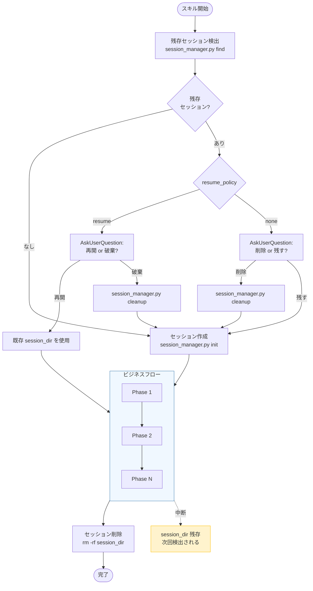

# セッションディレクトリ仕様

forge のオーケストレータースキルが使用する一時ワーキングディレクトリの共通仕様。

各 SKILL.md ではインラインでスキーマを定義せず、このドキュメントを参照すること。

---

## 1. セッションとは

セッションは、オーケストレータースキルが**フェーズ間のデータをファイル経由で受け渡す**ための一時ディレクトリである。

全てのオーケストレータースキル（review, start-design, start-plan, start-requirements, start-implement）が同じ仕組みを使う:

1. スキル開始時にセッションディレクトリを作成
2. 各フェーズの結果をファイルとして書き込み、後続フェーズが読み取る
3. スキル正常完了時にディレクトリを削除

### なぜファイル経由か

- **コンテキスト圧縮で消えない** — プロンプトテキストは長時間セッションで圧縮されるが、ファイルは永続
- **並列エージェントの衝突回避** — 各エージェントが別ファイルに書き込むため競合しない
- **中断からの復元可能性** — ディレクトリが残っていれば、収集済みデータを再利用できる

---

## 2. ディレクトリ構造

### パス

```
.claude/.temp/{skill_name}-{random6}/
```

例: `.claude/.temp/start-design-a3f7b2/`

- スキル名: どのスキルのセッションか一目でわかる
- 6文字ランダム hex: 同一スキルの複数起動でも衝突しない
- `.gitignore` に `.claude/.temp/` を追加済み

### 共通レイアウト

```
.claude/.temp/{session}/
├── session.yaml           # セッションメタデータ（必須）
├── refs/                  # コンテキスト収集エージェントの出力
│   ├── specs.yaml         # 仕様書検索結果
│   ├── rules.yaml         # ルール検索結果
│   └── code.yaml          # コード探索結果
└── [スキル固有ファイル]   # 各スキルが自由に追加
```

### スキル固有ファイル

| スキル | 追加ファイル | 説明 |
|--------|-------------|------|
| review | `refs.yaml`, `review.md`, `review_{perspective}.md`, `plan.yaml`, `evaluation.yaml`（廃止予定） | レビューワークフローの中間成果物 |
| start-design | （なし） | refs/ のみ使用 |
| start-plan | （なし） | refs/ のみ使用 |
| start-requirements | （なし） | refs/ のみ使用 |
| start-implement | （なし） | refs/ のみ使用 |

スキル固有ファイルのスキーマは本ドキュメントの後半（§7）で定義する。

---

## 3. session.yaml — セッションメタデータ

### 共通フィールド

全オーケストレータースキルが必ず含めるフィールド:

| フィールド | 型 | 必須 | 説明 |
|-----------|------|------|------|
| `skill` | string | ○ | 起動スキル名（`review`, `start-design` 等）|
| `started_at` | string | ○ | セッション開始時刻（ISO 8601）|
| `last_updated` | string | ○ | 最終更新時刻（ISO 8601）|
| `status` | enum | ○ | `in_progress` / `completed` |
| `resume_policy` | enum | - | `resume` / `none`。未指定時は `resume` |

### スキル固有フィールド

共通フィールドに加えて、各スキルが自由にフィールドを追加する:

**review:**

| フィールド | 型 | 説明 |
|-----------|------|------|
| `review_type` | string | `code` / `requirement` / `design` / `plan` / `generic` |
| `engine` | string | `codex` / `claude` |
| `auto_count` | integer | 自動修正サイクル数。`0` = 対話モード |
| `current_cycle` | integer | 現在のサイクル番号。初期値 `0` |

**start-design / start-plan / start-requirements:**

| フィールド | 型 | 説明 |
|-----------|------|------|
| `feature` | string | 対象 Feature 名 |
| `mode` | string | `new` / `update` |
| `output_dir` | string | 出力先ディレクトリ |

**start-implement:**

| フィールド | 型 | 説明 |
|-----------|------|------|
| `feature` | string | 対象 Feature 名 |
| `task_id` | string | 実行中のタスクID |

### 例

```yaml
# review の場合
skill: review
started_at: "2026-03-09T18:30:00Z"
last_updated: "2026-03-09T18:30:00Z"
status: in_progress
resume_policy: resume
review_type: code
engine: codex
auto_count: 0
current_cycle: 0
```

```yaml
# start-design の場合
skill: start-design
feature: "login"
mode: new
started_at: "2026-03-12T10:00:00Z"
last_updated: "2026-03-12T10:05:00Z"
status: in_progress
resume_policy: none
output_dir: "specs/login/design"
```

---

## 4. ライフサイクル

### ライフサイクル全体図



### 作成から削除まで

| タイミング | 操作 |
|------------|------|
| スキル開始時 | 残存セッション検出 → セッションディレクトリ作成 + `session.yaml` 初期化 |
| 各フェーズ | エージェントやサブスキルがファイルを読み書き |
| 正常完了時 | オーケストレーターがディレクトリを削除（`rm -rf {session_dir}`） |
| 中断時 | ディレクトリが残存（次回起動時に検出） |

### 残存セッション検出

```bash
python3 ${CLAUDE_PLUGIN_ROOT}/scripts/session_manager.py find --skill {skill_name}
```

`status: "found"` の場合、`resume_policy` によって分岐する:

#### `resume_policy: resume`

review のように中間状態の価値が高いスキル向け:

1. AskUserQuestion: 「前回のセッションが見つかりました。再開しますか？」
   - **再開** → 既存 session_dir を使用して処理を続行
   - **破棄して新規作成** → cleanup して新規開始

#### `resume_policy: none`

create-* のように最初からやり直す方が効率的なスキル向け:

1. AskUserQuestion: 「前回の未完了セッションがあります。削除しますか？」
   - **削除** → cleanup して新規開始
   - **残す** → 残存ディレクトリを無視して新規開始

### セッション作成

```bash
python3 ${CLAUDE_PLUGIN_ROOT}/scripts/session_manager.py init \
  --skill {skill_name} \
  {スキル固有の --key value}
```

### セッション削除

```bash
python3 ${CLAUDE_PLUGIN_ROOT}/scripts/session_manager.py cleanup {session_dir}
```

---

## 5. session_manager.py — CLI リファレンス

セッションの作成・検出・削除を行う Python スクリプト。AI がディレクトリ名生成や YAML 書き出しを手作業で行うとフォーマットミスやフィールド漏れが発生するため、スクリプトに委譲する。

パス: `${CLAUDE_PLUGIN_ROOT}/scripts/session_manager.py`

### サブコマンド

#### `init` — セッション作成

```bash
python3 ${CLAUDE_PLUGIN_ROOT}/scripts/session_manager.py init \
  --skill {skill_name} \
  [--key value ...]
```

| 引数 | 必須 | 説明 |
|------|------|------|
| `--skill` | ○ | スキル名（`review`, `start-design` 等） |
| `--key value` | - | 任意のスキル固有フィールド（`session.yaml` に書き込まれる） |
| `--resume-policy` | - | `resume` / `none`。省略時: review → `resume`、他 → `none` |

**処理内容**:
1. `.claude/.temp/{skill_name}-{random6}/` ディレクトリ + `refs/` サブディレクトリを作成
2. `session.yaml` を共通フィールド順序で書き出し
3. `started_at` / `last_updated` を UTC ISO 8601 で自動生成

**出力** (JSON):
```json
{"status": "created", "session_dir": ".claude/.temp/start-design-a3f7b2"}
```

**スキル別の引数例**:

| スキル | 引数 |
|--------|------|
| review | `--review-type code --engine codex --auto-count 1 --current-cycle 0` |
| start-design | `--feature login --mode new --output-dir specs/login/design` |
| start-plan | `--feature login --mode new --output-dir specs/login/plan` |
| start-requirements | `--feature login --mode interactive --output-dir specs/login/requirements` |
| start-implement | `--feature login --task-id TASK-001` |

> `--key-name` のハイフンは自動的にアンダースコアに変換される（例: `--output-dir` → `output_dir`）。

#### `find` — 残存セッション検索

```bash
python3 ${CLAUDE_PLUGIN_ROOT}/scripts/session_manager.py find --skill {skill_name}
```

**処理内容**: `.claude/.temp/*/session.yaml` をパースし `skill` フィールドで検索。

**出力** (JSON):
```json
{"status": "found", "sessions": [{"path": ".claude/.temp/start-design-a3f7b2", "skill": "start-design", "started_at": "..."}]}
```
```json
{"status": "none"}
```

#### `cleanup` — セッション削除

```bash
python3 ${CLAUDE_PLUGIN_ROOT}/scripts/session_manager.py cleanup {session_dir}
```

**処理内容**: `.claude/.temp/` 配下であることを検証（パストラバーサル防止）後、`shutil.rmtree()` で削除。

**出力** (JSON):
```json
{"status": "deleted", "session_dir": ".claude/.temp/start-design-a3f7b2"}
```

---

## 6. refs/ — コンテキスト収集結果

### 設計原則

- 各コンテキスト収集エージェントが**独立して** `refs/{category}.yaml` を書き込む
- ファイルが分かれているため**並列実行でファイル競合が起きない**
- オーケストレーターが `refs/` 内の全ファイルを読み込んで後続フェーズに渡す

### 共通スキーマ

全ての `refs/{category}.yaml` は同一スキーマに従う:

```yaml
source: query-specs               # 取得手段の識別子
query: "login feature design"     # 検索に使用したクエリ（デバッグ用）
documents:
  - path: specs/requirements/app_overview.md
    reason: "アプリ全体の要件定義"
  - path: specs/design/login_screen_design.md
    reason: "ログイン画面の設計仕様"
    lines: "10-50"                 # 関連する行範囲（任意）
```

### フィールド定義

| フィールド | 型 | 必須 | 説明 |
|-----------|------|------|------|
| `source` | string | ○ | 取得手段（`query-specs`, `query-rules`, `code-exploration`, `doc_structure_fallback` 等）|
| `query` | string | - | 検索クエリ（デバッグ・再現用）|
| `documents` | array | ○ | 発見した参照文書のリスト |
| `documents[].path` | string | ○ | プロジェクトルートからの相対パス |
| `documents[].reason` | string | ○ | なぜこの文書が関連するか |
| `documents[].lines` | string | - | 関連する行範囲（例: `"10-50"`）|

### カテゴリ別ファイル

| ファイル | 収集対象 | 主な取得手段 |
|----------|---------|-------------|
| `refs/specs.yaml` | 仕様書（要件・設計・計画） | `/query-specs` or `.doc_structure.yaml` |
| `refs/rules.yaml` | 開発ルール・規約 | `/query-rules` or `.doc_structure.yaml` |
| `refs/code.yaml` | 関連ソースコード・テスト | Glob / Grep 探索 |

### refs/ がない場合の扱い

refs/ ディレクトリ自体が存在しない、または中身が空の場合:
- コンテキスト収集フェーズがスキップされたことを意味する
- 後続フェーズは参照文書なしで動作する（最低限の品質でも実行可能）

---

## 7. review 固有ファイル

review オーケストレーターは `refs/` に加えて、レビューパイプライン固有のファイルをセッションに追加する。

### refs.yaml — レビュー参照ファイルリスト

> **注**: review は歴史的経緯により `refs/` ディレクトリではなく `refs.yaml`（単一フラットファイル）を使用する。コンテキスト収集を review スキル自身が行うため、エージェント並列書き込みの必要がないことによる。

レビューパイプライン全体で共有する参照ファイルリスト。`review` がコンテキスト収集フェーズで作成し、以降の全サブスキルはここからファイルパスを取得する。

#### スキーマ

| フィールド | 型 | 必須 | 説明 |
|-----------|------|------|------|
| `target_files` | string[] | 必須 | レビュー対象ファイルパス一覧 |
| `reference_docs` | object[] | 必須 | 参考文書リスト（`path` フィールドを持つ）|
| `perspectives` | object[] | 必須 | レビュー観点リスト（perspective ごとに reviewer を並列起動する）|
| `related_code` | object[] | 任意 | 関連コードリスト |

**`reference_docs` オブジェクト:**

| フィールド | 型 | 必須 | 説明 |
|-----------|------|------|------|
| `path` | string | 必須 | ファイルパス |

**`perspectives` オブジェクト:**

| フィールド | 型 | 必須 | 説明 |
|-----------|------|------|------|
| `name` | string | 必須 | perspective の一意識別子（例: `correctness`, `resilience`）。`^[a-z0-9_-]+$` に限定 |
| `criteria_path` | string | 必須 | レビュー観点ファイルのパス（プラグインルートからの相対パス） |
| `section` | string \| null | 任意 | criteria ファイル内の対象セクション名。`null` の場合はファイル全体を使用 |
| `output_path` | string | 必須 | レビュー結果の出力先（session_dir からの相対パス）。`../` および絶対パスは不可 |

**`related_code` オブジェクト:**

| フィールド | 型 | 必須 | 説明 |
|-----------|------|------|------|
| `path` | string | 必須 | ファイルパス |
| `reason` | string | 必須 | 関連性の説明（1行） |
| `lines` | string | 任意 | 関連する行範囲（例: `"1-30"`） |

#### 例

```yaml
target_files:
  - plugins/forge/skills/review/SKILL.md
  - plugins/forge/skills/reviewer/SKILL.md

reference_docs:
  - path: docs/rules/skill_authoring_notes.md

perspectives:
  - name: correctness
    criteria_path: "review/docs/review_criteria_code.md"
    section: "正確性 (Logic)"
    output_path: review_correctness.md
  - name: resilience
    criteria_path: "review/docs/review_criteria_code.md"
    section: "堅牢性 (Resilience)"
    output_path: review_resilience.md
  - name: project-rules
    criteria_path: "docs/rules/implementation_guidelines.md"
    section: null
    output_path: review_project_rules.md

related_code:
  - path: plugins/forge/skills/reviewer/SKILL.md
    reason: 同種 AI 専用スキルの frontmatter 参考
    lines: "1-30"
  - path: plugins/forge/skills/evaluator/SKILL.md
    reason: 同種 AI 専用スキルの frontmatter 参考
```

#### 読み書き

| スキル | 操作 | タイミング |
|--------|------|-----------|
| `review` | Write（作成） | コンテキスト収集フェーズ |
| `reviewer` | Read | レビュー実行時 |
| `evaluator` | Read | データ読み込み時 |
| `fixer` | Read | 参考文書準備時 |

---

### review.md — レビュー結果

`reviewer` が書き出すレビュー結果。Markdown 形式（YAML フロントマターなし）。

複数サイクル（`--auto N`）では上書きする（最新サイクルのみ保持）。

#### フォーマット

```markdown
### 🔴致命的問題

1. **[問題名]**: [具体的な説明]
   - 箇所: [ファイル名:行番号 / セクション名]
   - 参照: [関連ルール/要件定義書]（任意）
   - 修正案: [具体的な修正提案]

### 🟡品質問題

1. **[問題名]**: [具体的な説明]
   - 箇所: [ファイル名:行番号 / セクション名]

### 🟢改善提案

1. **[提案名]**: [具体的な説明]

### サマリー

- 🔴致命的: X件
- 🟡品質: X件
- 🟢改善: X件
```

#### 読み書き

| スキル | 操作 | タイミング |
|--------|------|-----------|
| `reviewer` | Write（作成 / 上書き） | レビュー完了後 |
| `evaluator` | Read | 指摘事項取得時 |
| `present-findings` | Read | セッション復元時 |

---

### evaluation.yaml — evaluator の判定結果

> **廃止予定**: perspectives 対応後に削除。plan.yaml に統合

`evaluator` が各指摘事項を吟味した結果。auto モードでは AI が修正判定を行い、対話モードでは AI 推奨として記録する（最終判断は人間）。

#### スキーマ

| フィールド | 型 | 必須 | 説明 |
|-----------|------|------|------|
| `cycle` | integer | 必須 | サイクル番号（1 始まり）|
| `items` | object[] | 必須 | 指摘事項ごとの判定結果リスト |

**`items` オブジェクト:**

| フィールド | 型 | 必須 | 説明 |
|-----------|------|------|------|
| `id` | integer | 必須 | plan.yaml の `id` と対応する連番 |
| `severity` | string | 必須 | `critical` / `major` / `minor` |
| `title` | string | 必須 | 指摘事項のタイトル |
| `recommendation` | string | 必須 | `fix` / `skip` / `needs_review` |
| `auto_fixable` | boolean | 条件 | `recommendation: fix` の場合のみ必須 |
| `reason` | string | 必須 | 判定理由 |

#### 例

```yaml
cycle: 1
items:
  - id: 1
    severity: critical
    title: "help と review のコマンド仕様不一致"
    recommendation: fix
    auto_fixable: false
    reason: "明確な仕様不一致、副作用なし。ただし複数の修正案があるため auto_fixable: false"
  - id: 2
    severity: major
    title: "設計意図が不明瞭な処理"
    recommendation: needs_review
    reason: "意図的な設計の可能性があり、確認が必要"
```

#### 読み書き

| スキル | 操作 | タイミング |
|--------|------|-----------|
| `evaluator` | Write（作成） | 判定完了後 |
| `fixer` | Read | 修正対象の確認時 |
| `present-findings` | Read | AI 推奨の表示時 |

---

### plan.yaml — 修正プランと進捗状態

修正プランと各指摘事項の進捗状態。`reviewer` が初期作成し、`evaluator` / `present-findings` / `fixer` が更新していく。セッション再開の際は `status: pending` の項目から処理を再開する。

#### スキーマ

| フィールド | 型 | 必須 | 説明 |
|-----------|------|------|------|
| `items` | object[] | 必須 | 指摘事項ごとの修正状態リスト |

**`items` オブジェクト:**

| フィールド | 型 | 必須 | 説明 |
|-----------|------|------|------|
| `id` | integer | 必須 | 1 始まりの連番 |
| `severity` | string | 必須 | `critical` / `major` / `minor` |
| `title` | string | 必須 | 指摘事項のタイトル |
| `status` | string | 必須 | 進捗状態（下表参照） |
| `recommendation` | string | 条件 | evaluator が付与。`fix` / `skip` / `needs_review`。evaluator 実行前は未設定 |
| `auto_fixable` | boolean | 条件 | `recommendation: fix` の場合のみ。修正が一意・局所的・機械的か |
| `reason` | string | 条件 | evaluator の判定理由。`recommendation` 設定時に必須 |
| `perspective` | string | 任意 | 指摘元の perspective 名。extract_review_findings.py が付与 |
| `perspectives` | string[] | 任意 | 重複統合時に複数 perspective が同一箇所を指摘した場合、統合元の perspective 名を全て記録 |
| `fixed_at` | string | 任意 | 修正完了日時。`status: fixed` の場合 |
| `files_modified` | string[] | 任意 | 修正ファイル一覧。`status: fixed` の場合 |
| `skip_reason` | string | 任意 | スキップ理由。`status: skipped` の場合 |

**`status` の許容値:**

| 値 | 意味 | 設定者 |
|----|------|--------|
| `pending` | 未処理（初期値） | `reviewer` |
| `in_progress` | 処理中 | `present-findings` |
| `fixed` | 修正完了 | `fixer` |
| `skipped` | スキップ | `evaluator` / `present-findings` |
| `needs_review` | 要確認 | `evaluator` / `present-findings` |

#### 例

```yaml
items:
  - id: 1
    severity: critical
    title: "help と review のコマンド仕様不一致"
    status: fixed
    recommendation: fix
    auto_fixable: false
    reason: "明確な仕様不一致、副作用なし。ただし複数の修正案があるため auto_fixable: false"
    perspective: correctness
    fixed_at: "2026-03-09T18:35:00Z"
    files_modified:
      - plugins/forge/skills/help/SKILL.md
  - id: 2
    severity: major
    title: "設計意図が不明瞭な処理"
    status: needs_review
    recommendation: needs_review
    reason: "意図的な設計の可能性があり、確認が必要"
    perspective: resilience
  - id: 3
    severity: minor
    title: "重複した入力バリデーション"
    status: pending
    recommendation: fix
    auto_fixable: true
    reason: "同一チェックが2箇所にあり、一方を削除可能"
    perspectives:
      - correctness
      - maintainability
```

#### 読み取り契約

| スキル | 読み取るフィールド | 用途 |
|--------|-------------------|------|
| `present-findings` | `recommendation`, `auto_fixable`, `reason` | AI 推奨の表示、修正可否マーク判定 |
| `fixer` | `recommendation`, `auto_fixable` | 修正対象の判定（`fix` かつ `auto_fixable: true` で自動修正対象） |
| `review` オーケストレーター | `recommendation` | `should_continue` 判定（`fix` が 0 件なら終了） |

#### 読み書き

| スキル | 操作 | タイミング |
|--------|------|-----------|
| `reviewer` | Write（初期作成 — 全件 `pending`） | レビュー完了後 |
| `evaluator` | Write（`recommendation`, `auto_fixable`, `reason` を付与し `status` 更新） | 判定完了後 |
| `present-findings` | Read / Write（ユーザー判断後に更新） | 対話時 |
| `fixer` | Write（`fixed` + `fixed_at` + `files_modified`） | 修正完了後 |

---

## 8. セッション YAML 操作スクリプト — CLI リファレンス

セッションディレクトリ内の YAML ファイルを操作する Python スクリプト群。AI が YAML を手作業で生成する代わりに、これらのスクリプトがスキーマ準拠のファイルを生成・更新する。

パス: `${CLAUDE_PLUGIN_ROOT}/scripts/session/`

### write_refs.py — refs.yaml 生成

```bash
echo '<json>' | python3 ${CLAUDE_PLUGIN_ROOT}/scripts/session/write_refs.py {session_dir}
```

| フィールド | 型 | 必須 | 説明 |
|-----------|------|------|------|
| `target_files` | string[] | ○ | レビュー対象ファイル |
| `reference_docs` | object[] | ○ | 参考文書（空配列可）|
| `perspectives` | object[] | ○ | レビュー観点リスト（各要素に `name`, `criteria_path`, `output_path` 必須、`section` 任意）|
| `related_code` | object[] | - | 関連コード |

**バリデーション**:
- `perspectives[].name` は `^[a-z0-9_-]+$` に限定（英小文字・数字・アンダースコア・ハイフンのみ）
- `perspectives[].output_path` は session_dir からの相対パスのみ許可（`../` および絶対パスは拒否）

**出力**: `{"status": "ok", "path": "..."}`

### write_evaluation.py — evaluation.yaml 生成

```bash
echo '<json>' | python3 ${CLAUDE_PLUGIN_ROOT}/scripts/session/write_evaluation.py {session_dir}
```

| フィールド | 型 | 必須 | 説明 |
|-----------|------|------|------|
| `cycle` | integer | ○ | サイクル番号（1以上）|
| `items` | object[] | ○ | 指摘ごとの判定（id, severity, title, recommendation, reason 必須）|

**出力**: `{"status": "ok", "path": "...", "summary": {"fix": N, "skip": N, "needs_review": N}}`

### update_plan.py — plan.yaml ステータス更新

**単一項目更新:**
```bash
python3 ${CLAUDE_PLUGIN_ROOT}/scripts/session/update_plan.py {session_dir} \
  --id {id} --status {status} \
  [--fixed-at "2026-03-09T18:35:00Z"] \
  [--files-modified file1.py file2.py] \
  [--skip-reason "理由"]
```

**バッチ更新:**
```bash
echo '<json>' | python3 ${CLAUDE_PLUGIN_ROOT}/scripts/session/update_plan.py {session_dir} --batch
```

| フィールド | 型 | 説明 |
|-----------|------|------|
| `updates` | object[] | 各要素に id, status 必須 |

**出力**: `{"status": "ok", "updated": [1, 2], "plan_path": "..."}`

### read_session.py — セッション全ファイル読み取り

```bash
python3 ${CLAUDE_PLUGIN_ROOT}/scripts/session/read_session.py {session_dir} [--files file1 file2]
```

**出力**: `{"status": "ok", "files": {...}, "refs": {...}}`

---

## 付記

### `id` の整合性

`review.md`（および `review_{perspective}.md`）の指摘事項 → `plan.yaml` の `id` は同一の連番で対応している。`extract_review_findings.py` が複数の `review_{perspective}.md` を統合して `plan.yaml` を生成する際に通し番号で採番する。`evaluator` の判定結果（`recommendation`, `auto_fixable`, `reason`）は `plan.yaml` の同一 `id` に直接記録する。

### 通信フローの共通パターン

データフロー図は設計書を参照: `docs/specs/forge/design/session_management_design.md` §4.3
