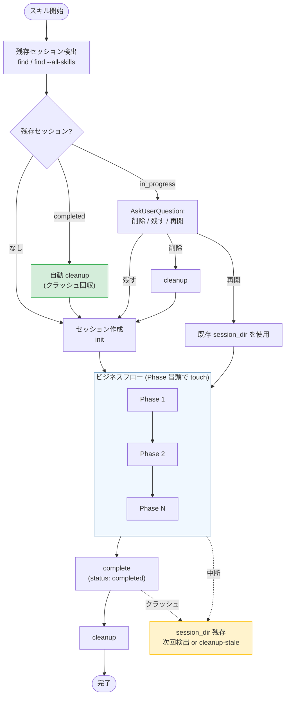

# セッションディレクトリ仕様

forge のオーケストレータースキルが使用する一時ワーキングディレクトリの共通仕様。

各 SKILL.md ではインラインでスキーマを定義せず、このドキュメントを参照すること。

---

## 1. セッションとは

セッションは、オーケストレータースキルが**フェーズ間のデータをファイル経由で受け渡す**ための一時ディレクトリである。

全てのオーケストレータースキル（review, start-design, start-plan, start-requirements, start-implement）が同じ仕組みを使う:

1. スキル開始時にセッションディレクトリを作成
2. 各フェーズの結果をファイルとして書き込み、後続フェーズが読み取る
3. スキル正常完了時にディレクトリを削除

### なぜファイル経由か

- **コンテキスト圧縮で消えない** — プロンプトテキストは長時間セッションで圧縮されるが、ファイルは永続
- **並列エージェントの衝突回避** — 各エージェントが別ファイルに書き込むため競合しない
- **中断からの復元可能性** — ディレクトリが残っていれば、収集済みデータを再利用できる

---

## 2. ディレクトリ構造

### パス

```
.claude/.temp/{skill_name}-{random6}/
```

例: `.claude/.temp/start-design-a3f7b2/`

- スキル名: どのスキルのセッションか一目でわかる
- 6文字ランダム hex: 同一スキルの複数起動でも衝突しない
- `.gitignore` に `.claude/.temp/` を追加済み

### 共通レイアウト

```
.claude/.temp/{session}/
├── session.yaml           # セッションメタデータ（必須）
├── refs/                  # コンテキスト収集エージェントの出力
│   ├── specs.yaml         # 仕様書検索結果
│   ├── rules.yaml         # ルール検索結果
│   └── code.yaml          # コード探索結果
└── [スキル固有ファイル]   # 各スキルが自由に追加
```

### スキル固有ファイル

| スキル             | 追加ファイル                                              | 説明                             |
| ------------------ | --------------------------------------------------------- | -------------------------------- |
| review             | `refs.yaml`, `review_<種別>.md`, `review.md`, `plan.yaml` | レビューワークフローの中間成果物 |
| start-design       | （なし）                                                  | refs/ のみ使用                   |
| start-plan         | （なし）                                                  | refs/ のみ使用                   |
| start-requirements | （なし）                                                  | refs/ のみ使用                   |
| start-implement    | `exec_{task_id}.json`                                     | 並列 executor の個別結果ファイル |

スキル固有ファイルのスキーマは本ドキュメントの後半（§7）で定義する。

---

## 3. session.yaml — セッションメタデータ

### 共通フィールド

全オーケストレータースキルが必ず含めるフィールド:

| フィールド     | 型     | 必須 | 説明                                                                                         |
| -------------- | ------ | ---- | -------------------------------------------------------------------------------------------- |
| `skill`        | string | ○    | 起動スキル名（`review`, `start-design` 等）                                                  |
| `started_at`   | string | ○    | セッション開始時刻（ISO 8601）                                                               |
| `last_updated` | string | ○    | 最終更新時刻（ISO 8601）。`init` で初期値、`touch` / `complete` で更新                       |
| `status`       | enum   | ○    | `in_progress`（処理中。`init` で設定）/ `completed`（正常完了マーク済み。`complete` で設定） |

`session.yaml` は成果物本文やレビュー項目の正規データを持たない。残存セッション検出時の表示と削除判定に使う最小メタデータのみを flat YAML として保持する。

### スキル固有フィールド

共通フィールドに加えて、各スキルが自由にフィールドを追加する:

**review:**

| フィールド      | 型      | 説明                                                   |
| --------------- | ------- | ------------------------------------------------------ |
| `review_type`   | string  | `code` / `requirement` / `design` / `plan` / `generic` |
| `engine`        | string  | `codex` / `claude`                                     |
| `auto_count`    | integer | 自動修正サイクル数。`0` = 対話モード                   |
| `current_cycle` | integer | 現在のサイクル番号。初期値 `0`                         |

**start-design / start-plan / start-requirements:**

| フィールド   | 型     | 説明               |
| ------------ | ------ | ------------------ |
| `feature`    | string | 対象 Feature 名    |
| `mode`       | string | `new` / `update`   |
| `output_dir` | string | 出力先ディレクトリ |

**start-implement:**

| フィールド | 型     | 説明             |
| ---------- | ------ | ---------------- |
| `feature`  | string | 対象 Feature 名  |
| `task_id`  | string | 実行中のタスクID |

### 例

```yaml
# review の場合
skill: review
started_at: "2026-03-09T18:30:00Z"
last_updated: "2026-03-09T18:30:00Z"
status: in_progress
review_type: code
engine: codex
auto_count: 0
current_cycle: 0
```

```yaml
# start-design の場合
skill: start-design
feature: "login"
mode: new
started_at: "2026-03-12T10:00:00Z"
last_updated: "2026-03-12T10:05:00Z"
status: in_progress
output_dir: "specs/login/design"
```

---

## 4. ライフサイクル

### ライフサイクル全体図



### 作成から削除まで

| タイミング   | 操作                                                                                                                                             |
| ------------ | ------------------------------------------------------------------------------------------------------------------------------------------------ |
| スキル開始時 | 残存セッション検出（自スキル + `--all-skills` 横断）→ セッションディレクトリ作成 + `session.yaml` 初期化                                         |
| 各フェーズ   | フェーズ冒頭で `session_manager.py touch {session_dir}` を呼び `last_updated` を更新 → エージェントやサブスキルがファイルを読み書き              |
| 正常完了時   | オーケストレーターが `session_manager.py complete {session_dir}` で `status: completed` に遷移 → `session_manager.py cleanup` でディレクトリ削除 |
| 中断時       | ディレクトリが残存（次回起動時に検出、または `session_manager.py cleanup-stale` で一括回収）                                                     |

### status の意味

| 値            | 意味                                                                                                          |
| ------------- | ------------------------------------------------------------------------------------------------------------- |
| `in_progress` | スキル進行中。中断・クラッシュで残ると `cleanup-stale` の時間判定（`--older-than-hours`）対象になる           |
| `completed`   | `complete` 経由で正常完了をマーク済み。`cleanup` 直前のクラッシュ等で残った場合、`cleanup-stale` が即削除する |

### 残存セッション検出

自スキルのセッションのみを検索（既存）:

```bash
python3 ${CLAUDE_PLUGIN_ROOT}/scripts/session_manager.py find --skill {skill_name}
```

全スキルのセッションを横断検索（#83、他スキル残骸の通告用）:

```bash
python3 ${CLAUDE_PLUGIN_ROOT}/scripts/session_manager.py find --all-skills
```

`--skill` と `--all-skills` は排他で、いずれかが必須。

`status: "found"` の場合は `sessions[]` の各エントリの `status` を参照して扱いを決める:

- **`status: "completed"`** → 正常完了したのに cleanup されなかった残骸として AskUserQuestion なしで自動 cleanup する（クラッシュ回収）
- **`status: "in_progress"`** の場合は AskUserQuestion で次の扱いを確認する:
  - **削除** → cleanup して新規開始
  - **残す** → 残存ディレクトリを無視して新規開始
  - **再開** (review のように中間状態の価値が高いスキルのみ) → 既存 session_dir を使用して処理を続行

判断はスキル側の責務で、`session.yaml` には再開可否のフラグを持たない。スキル種別ごとの方針は各 SKILL.md に直接記述する。

### セッション作成

```bash
python3 ${CLAUDE_PLUGIN_ROOT}/scripts/session_manager.py init \
  --skill {skill_name} \
  {スキル固有の --key value}
```

### セッション削除（正常完了処理）

正常完了は **complete → cleanup の 2 段** で行う:

```bash
python3 ${CLAUDE_PLUGIN_ROOT}/scripts/session_manager.py complete {session_dir}
python3 ${CLAUDE_PLUGIN_ROOT}/scripts/session_manager.py cleanup {session_dir}
```

`complete` で `session.yaml` を `status: completed` に遷移させてから `cleanup` する。`cleanup` 直前にクラッシュしても、次回 `find` 時または `cleanup-stale` が「完了済み残骸」として自動回収する（クラッシュ耐性）。

エスカレーションやユーザー判断による破棄など「正常完了ではない削除」では `cleanup` 単独でよい。

---

## 5. session_manager.py — CLI リファレンス

セッションの作成・検出・削除を行う Python スクリプト。AI がディレクトリ名生成や YAML 書き出しを手作業で行うとフォーマットミスやフィールド漏れが発生するため、スクリプトに委譲する。

パス: `${CLAUDE_PLUGIN_ROOT}/scripts/session_manager.py`

### サブコマンド

#### `init` — セッション作成

```bash
python3 ${CLAUDE_PLUGIN_ROOT}/scripts/session_manager.py init \
  --skill {skill_name} \
  [--key value ...]
```

| 引数              | 必須 | 説明                                                        |
| ----------------- | ---- | ----------------------------------------------------------- |
| `--skill`         | ○    | スキル名（`review`, `start-design` 等）                     |
| `--key value`     | -    | 任意のスキル固有フィールド（`session.yaml` に書き込まれる） |
| `--resume-policy` | -    | `resume` / `none`。省略時: review → `resume`、他 → `none`   |

**処理内容**:

1. `.claude/.temp/{skill_name}-{random6}/` ディレクトリ + `refs/` サブディレクトリを作成
2. `session.yaml` を共通フィールド順序で書き出し
3. `started_at` / `last_updated` を UTC ISO 8601 で自動生成

**出力** (JSON):

```json
{ "status": "created", "session_dir": ".claude/.temp/start-design-a3f7b2" }
```

**スキル別の引数例**:

| スキル             | 引数                                                                       |
| ------------------ | -------------------------------------------------------------------------- |
| review             | `--review-type code --engine codex --auto-count 1 --current-cycle 0`       |
| start-design       | `--feature login --mode new --output-dir specs/login/design`               |
| start-plan         | `--feature login --mode new --output-dir specs/login/plan`                 |
| start-requirements | `--feature login --mode interactive --output-dir specs/login/requirements` |
| start-implement    | `--feature login --task-id TASK-001`                                       |

> `--key-name` のハイフンは自動的にアンダースコアに変換される（例: `--output-dir` → `output_dir`）。

#### `find` — 残存セッション検索

自スキルのみ（既存）:

```bash
python3 ${CLAUDE_PLUGIN_ROOT}/scripts/session_manager.py find --skill {skill_name}
```

全スキル横断（#83）:

```bash
python3 ${CLAUDE_PLUGIN_ROOT}/scripts/session_manager.py find --all-skills
```

| 引数           | 必須                  | 説明                                                          |
| -------------- | --------------------- | ------------------------------------------------------------- |
| `--skill`      | `--all-skills` と排他 | 該当スキルのセッションのみを返す                              |
| `--all-skills` | `--skill` と排他      | スキル種別を問わず `.claude/.temp/*` 配下の全セッションを返す |

**処理内容**: `.claude/.temp/*/session.yaml` をパースし、フィルタに合致するセッションを返す。

**出力** (JSON):

```json
{
  "status": "found",
  "sessions": [
    {
      "path": ".claude/.temp/start-design-a3f7b2",
      "skill": "start-design",
      "started_at": "...",
      "last_updated": "...",
      "status": "in_progress"
    }
  ]
}
```

```json
{ "status": "none" }
```

#### `touch` — `last_updated` 更新（Phase 切替時）

```bash
python3 ${CLAUDE_PLUGIN_ROOT}/scripts/session_manager.py touch {session_dir}
```

| 引数          | 必須 | 説明                       |
| ------------- | ---- | -------------------------- |
| `session_dir` | ○    | 対象セッションディレクトリ |

**処理内容**: `validate_temp_path()` でパスを検証後、`session.yaml` を読み込んで `last_updated` のみを `now_iso()` で更新し書き戻す。`started_at` / `status` / スキル固有フィールドは保持する。

各オーケストレーターは Phase の冒頭でこれを呼ぶことで、`cleanup-stale` の判定基準が「最後に活動があった時刻」を正しく反映するようになる（長時間タスクの誤削除防止、#82）。

**出力** (JSON):

```json
{
  "status": "ok",
  "session_dir": ".claude/.temp/start-implement-b97398",
  "last_updated": "2026-05-23T08:00:00Z"
}
```

#### `complete` — `status: completed` への遷移（正常完了処理）

```bash
python3 ${CLAUDE_PLUGIN_ROOT}/scripts/session_manager.py complete {session_dir}
```

| 引数          | 必須 | 説明                       |
| ------------- | ---- | -------------------------- |
| `session_dir` | ○    | 対象セッションディレクトリ |

**処理内容**: `validate_temp_path()` でパスを検証後、`session.yaml` の `status` を `completed` に、`last_updated` を `now_iso()` に更新する。

正常完了処理の 1 段目として呼び、直後に `cleanup` する。`cleanup` 直前にクラッシュしても `status: completed` が永続化されているため、次回 `find` 時または `cleanup-stale` が「完了済み残骸」として自動回収できる（クラッシュ耐性、#84）。

**出力** (JSON):

```json
{
  "status": "ok",
  "session_dir": ".claude/.temp/start-design-a3f7b2",
  "session_status": "completed",
  "last_updated": "2026-05-23T08:00:00Z"
}
```

#### `cleanup` — セッション削除

```bash
python3 ${CLAUDE_PLUGIN_ROOT}/scripts/session_manager.py cleanup {session_dir}
```

**処理内容**: `.claude/.temp/` 配下であることを検証（パストラバーサル防止）後、`shutil.rmtree()` で削除。

**出力** (JSON):

```json
{ "status": "deleted", "session_dir": ".claude/.temp/start-design-a3f7b2" }
```

#### `cleanup-stale` — 期限切れセッションの一括回収

中断・クラッシュ・AI の流れ離脱などで残骸となったセッションを、時間ベースで一括回収する。各オーケストレーターの正常完了パスとは独立した「ゴミ掃除コマンド」。

```bash
python3 ${CLAUDE_PLUGIN_ROOT}/scripts/session_manager.py cleanup-stale \
  [--older-than-hours N] [--skill {skill_name}] [--dry-run]
```

| 引数                 | 必須 | デフォルト | 説明                                                                                |
| -------------------- | ---- | ---------- | ----------------------------------------------------------------------------------- |
| `--older-than-hours` | -    | `48`       | この時間より古いセッションを削除対象とする。`0` で全 `in_progress` セッションを対象 |
| `--skill`            | -    | -          | 特定スキル名のセッションのみを対象にする（省略時は全スキル）                        |
| `--dry-run`          | -    | -          | 削除せず、対象となるセッション一覧のみを出力する                                    |

**処理内容**: `.claude/.temp/*/session.yaml` を走査し、以下の判定で削除対象を決定する:

- **`status: completed`** のセッションは `--older-than-hours` を無視して常に削除対象（`complete` 後の cleanup 漏れを即回収するため、#84）
- **`status: in_progress`** のセッションは `started_at` と `last_updated` のうち新しい方が `--older-than-hours` より古い場合に削除

タイムスタンプ不正・パス検証失敗のものは削除せず `skipped` に分類する。

**出力** (JSON):

```json
{
  "status": "ok",
  "cutoff_hours": 48,
  "deleted": [
    {
      "path": ".claude/.temp/start-implement-b97398",
      "skill": "start-implement",
      "session_status": "in_progress",
      "age_hours": 67.3
    },
    {
      "path": ".claude/.temp/start-design-c4d8e1",
      "skill": "start-design",
      "session_status": "completed",
      "age_hours": 0.5
    }
  ],
  "skipped": []
}
```

`--dry-run` 時は `"status": "dry-run"` を返し、`deleted` フィールドには削除されなかった「削除予定」のリストが入る。

---

## 6. refs/ — コンテキスト収集結果

### 設計原則

- 各コンテキスト収集エージェントが**独立して** `refs/{category}.yaml` を書き込む
- ファイルが分かれているため**並列実行でファイル競合が起きない**
- オーケストレーターが `refs/` 内の全ファイルを読み込んで後続フェーズに渡す

### 共通スキーマ

全ての `refs/{category}.yaml` は同一スキーマに従う:

```yaml
source: query-specs # 取得手段の識別子
query: "login feature design" # 検索に使用したクエリ（デバッグ用）
documents:
  - path: specs/requirements/app_overview.md
    reason: "アプリ全体の要件定義"
  - path: specs/design/login_screen_design.md
    reason: "ログイン画面の設計仕様"
    lines: "10-50" # 関連する行範囲（任意）
```

### フィールド定義

| フィールド           | 型     | 必須 | 説明                                                                                      |
| -------------------- | ------ | ---- | ----------------------------------------------------------------------------------------- |
| `source`             | string | ○    | 取得手段（`query-specs`, `query-rules`, `code-exploration`, `doc_structure_fallback` 等） |
| `query`              | string | -    | 検索クエリ（デバッグ・再現用）                                                            |
| `documents`          | array  | ○    | 発見した参照文書のリスト                                                                  |
| `documents[].path`   | string | ○    | プロジェクトルートからの相対パス                                                          |
| `documents[].reason` | string | ○    | なぜこの文書が関連するか                                                                  |
| `documents[].lines`  | string | -    | 関連する行範囲（例: `"10-50"`）                                                           |

### カテゴリ別ファイル

| ファイル          | 収集対象                   | 主な取得手段                                     |
| ----------------- | -------------------------- | ------------------------------------------------ |
| `refs/specs.yaml` | 仕様書（要件・設計・計画） | `/forge:query-db-specs` or `.doc_structure.yaml` |
| `refs/rules.yaml` | 開発ルール・規約           | `/forge:query-db-rules` or `.doc_structure.yaml` |
| `refs/code.yaml`  | 関連ソースコード・テスト   | Glob / Grep 探索                                 |

### refs/ がない場合の扱い

refs/ ディレクトリ自体が存在しない、または中身が空の場合:

- コンテキスト収集フェーズがスキップされたことを意味する
- 後続フェーズは参照文書なしで動作する（最低限の品質でも実行可能）

---

## 7. review 固有ファイル

review オーケストレーターは `refs/` に加えて、レビューパイプライン固有のファイルをセッションに追加する。

### refs.yaml — レビュー参照ファイルリスト

> **注**: review は歴史的経緯により `refs/` ディレクトリではなく `refs.yaml`（単一フラットファイル）を使用する。コンテキスト収集を review スキル自身が行うため、エージェント並列書き込みの必要がないことによる。

レビューパイプライン全体で共有する参照ファイルリスト。`review` がコンテキスト収集フェーズで作成し、以降の全サブスキルはここからファイルパスを取得する。

#### スキーマ

| フィールド       | 型       | 必須 | 説明                                                                                                         |
| ---------------- | -------- | ---- | ------------------------------------------------------------------------------------------------------------ |
| `target_files`   | string[] | 必須 | レビュー対象ファイルパス一覧                                                                                 |
| `reference_docs` | object[] | 必須 | 参考文書リスト（`path` フィールドを持つ）                                                                    |
| `review_packet`  | object   | 必須 | reviewer に渡すレビュー基準パッケージ（DES-028 §2.3）。旧 `perspectives[]` スキーマは FNC-412 で完全撤廃済み |
| `related_code`   | object[] | 任意 | 関連コードリスト                                                                                             |

**`reference_docs` オブジェクト:**

| フィールド | 型     | 必須 | 説明         |
| ---------- | ------ | ---- | ------------ |
| `path`     | string | 必須 | ファイルパス |

**`review_packet` オブジェクト:**

| フィールド        | 型       | 必須 | 説明                                                                                                                     |
| ----------------- | -------- | ---- | ------------------------------------------------------------------------------------------------------------------------ |
| `criteria_path`   | string   | 必須 | レビュー基準ファイルのパス（`review_criteria_<種別>.md`）                                                                |
| `ssot_refs`       | object[] | 必須 | SSOT 参照リスト（非空）。各要素は `path`, `priority` (`P1`/`P2`/`P3`), `doc_type` (`rules`/`principles`/`format`) を持つ |
| `check_order`     | string[] | 必須 | reviewer がチェックする観点の順序（非空、例: `["P1", "P2", "P3"]`）                                                      |
| `severity_source` | string   | 必須 | severity 判定の根拠（例: `principles`）                                                                                  |
| `output_path`     | string   | 必須 | reviewer 出力ファイル名（種別固定、`^review_[a-z0-9_-]+\.md$` 形式）。`../` および絶対パス不可                           |

**`related_code` オブジェクト:**

| フィールド | 型     | 必須 | 説明                           |
| ---------- | ------ | ---- | ------------------------------ |
| `path`     | string | 必須 | ファイルパス                   |
| `reason`   | string | 必須 | 関連性の説明（1行）            |
| `lines`    | string | 任意 | 関連する行範囲（例: `"1-30"`） |

#### 例

```yaml
target_files:
  - plugins/forge/skills/review/SKILL.md
  - plugins/forge/skills/reviewer/SKILL.md

reference_docs:
  - path: docs/rules/skill_authoring_notes.md

review_packet:
  criteria_path: plugins/forge/skills/review/docs/review_criteria_code.md
  ssot_refs:
    - path: docs/rules/skill_authoring_notes.md
      priority: P1
      doc_type: rules
    - path: docs/rules/implementation_guidelines.md
      priority: P2
      doc_type: principles
  check_order: ["P1", "P2", "P3"]
  severity_source: principles
  output_path: review_code.md

related_code:
  - path: plugins/forge/skills/reviewer/SKILL.md
    reason: 同種 AI 専用スキルの frontmatter 参考
    lines: "1-30"
  - path: plugins/forge/skills/evaluator/SKILL.md
    reason: 同種 AI 専用スキルの frontmatter 参考
```

#### 読み書き

| スキル      | 操作          | タイミング               |
| ----------- | ------------- | ------------------------ |
| `review`    | Write（作成） | コンテキスト収集フェーズ |
| `reviewer`  | Read          | レビュー実行時           |
| `evaluator` | Read          | データ読み込み時         |
| `fixer`     | Read          | 参考文書準備時           |

---

### review.md — レビュー結果

`reviewer` が書き出すレビュー結果。Markdown 形式（YAML フロントマターなし）。

複数サイクル（`--auto N`）では上書きする（最新サイクルのみ保持）。

#### フォーマット

```markdown
### 🔴致命的問題

1. **[問題名]**: [具体的な説明]
   - 箇所: [ファイル名:行番号 / セクション名]
   - 参照: [関連ルール/要件定義書]（任意）
   - 修正案: [具体的な修正提案]

### 🟡品質問題

1. **[問題名]**: [具体的な説明]
   - 箇所: [ファイル名:行番号 / セクション名]

### 🟢改善提案

1. **[提案名]**: [具体的な説明]

### サマリー

- 🔴致命的: X件
- 🟡品質: X件
- 🟢改善: X件
```

#### 読み書き

| スキル             | 操作                   | タイミング       |
| ------------------ | ---------------------- | ---------------- |
| `reviewer`         | Write（作成 / 上書き） | レビュー完了後   |
| `evaluator`        | Read                   | 指摘事項取得時   |
| `present-findings` | Read                   | セッション復元時 |

---

### plan.yaml — 修正プランと進捗状態

修正プランと各指摘事項の進捗状態。`reviewer` が初期作成し、`evaluator` / `present-findings` / `fixer` が更新していく。セッション再開の際は `status: pending` の項目から処理を再開する。

#### スキーマ

| フィールド | 型       | 必須 | 説明                         |
| ---------- | -------- | ---- | ---------------------------- |
| `items`    | object[] | 必須 | 指摘事項ごとの修正状態リスト |

**`items` オブジェクト:**

| フィールド       | 型       | 必須 | 説明                                                                                                                                                                 |
| ---------------- | -------- | ---- | -------------------------------------------------------------------------------------------------------------------------------------------------------------------- |
| `id`             | integer  | 必須 | 1 始まりの連番                                                                                                                                                       |
| `severity`       | string   | 必須 | `critical` / `major` / `minor`                                                                                                                                       |
| `title`          | string   | 必須 | 指摘事項のタイトル                                                                                                                                                   |
| `status`         | string   | 必須 | 進捗状態（下表参照）                                                                                                                                                 |
| `recommendation` | string   | 条件 | evaluator が付与。`fix` / `skip` / `needs_review`。evaluator 実行前は未設定                                                                                          |
| `auto_fixable`   | boolean  | 条件 | `recommendation: fix` の場合のみ。修正が一意・局所的・機械的か                                                                                                       |
| `reason`         | string   | 条件 | evaluator の判定理由。`recommendation` 設定時に必須                                                                                                                  |
| `perspective`    | string   | 任意 | 指摘元の review ファイル名から導出された識別子。extract_review_findings.py が付与（旧 perspective ベース命名の名残。現行 reviewer 1 起動原則下では種別名と一致する） |
| `perspectives`   | string[] | 任意 | 重複統合時に複数項目が同一箇所を指摘した場合、統合元の `perspective` 値を全て記録（旧 perspective ベース命名の名残）                                                 |
| `fixed_at`       | string   | 任意 | 修正完了日時。`status: fixed` の場合                                                                                                                                 |
| `files_modified` | string[] | 任意 | 修正ファイル一覧。`status: fixed` の場合                                                                                                                             |
| `skip_reason`    | string   | 任意 | スキップ理由。`status: skipped` の場合                                                                                                                               |

**`status` の許容値:**

| 値             | 意味             | 設定者                           |
| -------------- | ---------------- | -------------------------------- |
| `pending`      | 未処理（初期値） | `reviewer`                       |
| `in_progress`  | 処理中           | `present-findings`               |
| `fixed`        | 修正完了         | `fixer`                          |
| `skipped`      | スキップ         | `evaluator` / `present-findings` |
| `needs_review` | 要確認           | `evaluator` / `present-findings` |

#### 例

```yaml
items:
  - id: 1
    severity: critical
    title: "help と review のコマンド仕様不一致"
    status: fixed
    recommendation: fix
    auto_fixable: false
    reason: "明確な仕様不一致、副作用なし。ただし複数の修正案があるため auto_fixable: false"
    perspective: code
    fixed_at: "2026-03-09T18:35:00Z"
    files_modified:
      - plugins/forge/skills/help/SKILL.md
  - id: 2
    severity: major
    title: "設計意図が不明瞭な処理"
    status: needs_review
    recommendation: needs_review
    reason: "意図的な設計の可能性があり、確認が必要"
    perspective: code
  - id: 3
    severity: minor
    title: "重複した入力バリデーション"
    status: pending
    recommendation: fix
    auto_fixable: true
    reason: "同一チェックが2箇所にあり、一方を削除可能"
    perspective: code
```

#### 読み取り契約

| スキル                      | 読み取るフィールド                         | 用途                                                             |
| --------------------------- | ------------------------------------------ | ---------------------------------------------------------------- |
| `present-findings`          | `recommendation`, `auto_fixable`, `reason` | AI 推奨の表示、修正可否マーク判定                                |
| `fixer`                     | `recommendation`, `auto_fixable`           | 修正対象の判定（`fix` かつ `auto_fixable: true` で自動修正対象） |
| `review` オーケストレーター | `recommendation`                           | `should_continue` 判定（`fix` が 0 件なら終了）                  |

#### 読み書き

| スキル             | 操作                                                                                   | タイミング     |
| ------------------ | -------------------------------------------------------------------------------------- | -------------- |
| `reviewer`         | Write（初期作成 — 全件 `pending`）                                                     | レビュー完了後 |
| `evaluator`        | Write → `eval_<種別>.json`（orchestrator が `merge_evals.py` で plan.yaml を一括更新） | 判定完了後     |
| `present-findings` | Read / Write（ユーザー判断後に更新）                                                   | 対話時         |
| `fixer`            | Write（`fixed` + `fixed_at` + `files_modified`）                                       | 修正完了後     |

`extract_review_findings.py {session_dir}` は `review_<種別>.md` を解析して `review.md`（統合サマリー） / `plan.yaml` を生成する。`--review-only` は `plan.yaml` を保護する再生成モードであり、`review.md` のみ書き出す。

---

## 8. start-implement 固有ファイル

start-implement オーケストレーターは、並列 executor がタスクごとに個別の結果ファイルを書き出す。

### exec_{task_id}.json — executor 実行結果

並列起動された executor が個別に書き出す結果ファイル。orchestrator は全 executor 完了後にこれらを収集して後続処理を行う（並列 agent 出力契約パターン）。

#### スキーマ

| フィールド       | 型       | 必須 | 説明                       |
| ---------------- | -------- | ---- | -------------------------- |
| `task_id`        | string   | 必須 | タスクID（例: `TASK-001`） |
| `status`         | string   | 必須 | `SUCCESS` / `FAILURE`      |
| `files_modified` | string[] | 必須 | 変更したファイルパス一覧   |
| `summary`        | string   | 必須 | 実装の要約（1-2行）        |
| `error`          | string   | 任意 | `FAILURE` 時のエラー内容   |

#### 例

```json
{
  "task_id": "TASK-001",
  "status": "SUCCESS",
  "files_modified": [
    "src/foo.py",
    "tests/test_foo.py"
  ],
  "summary": "foo モジュールにバリデーション機能を追加",
  "error": ""
}
```

#### 読み書き

| スキル                           | 操作          | タイミング         |
| -------------------------------- | ------------- | ------------------ |
| `start-implement` (executor)     | Write（作成） | タスク実行完了後   |
| `start-implement` (orchestrator) | Read（収集）  | 全 executor 完了後 |

---

## 9. セッション YAML 操作スクリプト — CLI リファレンス

セッションディレクトリ内の YAML ファイルを操作する Python スクリプト群。AI が YAML を手作業で生成する代わりに、これらのスクリプトがスキーマ準拠のファイルを生成・更新する。

パス: `${CLAUDE_PLUGIN_ROOT}/scripts/session/`

### write_refs.py — refs.yaml 生成

```bash
echo '<json>' | python3 ${CLAUDE_PLUGIN_ROOT}/scripts/session/write_refs.py {session_dir}
```

| フィールド       | 型       | 必須 | 説明                                                                                                                        |
| ---------------- | -------- | ---- | --------------------------------------------------------------------------------------------------------------------------- |
| `target_files`   | string[] | ○    | レビュー対象ファイル                                                                                                        |
| `reference_docs` | object[] | ○    | 参考文書（空配列可）                                                                                                        |
| `review_packet`  | object   | ○    | reviewer に渡すレビュー基準パッケージ（`criteria_path`, `ssot_refs`, `check_order`, `severity_source`, `output_path` 必須） |
| `related_code`   | object[] | -    | 関連コード                                                                                                                  |

**バリデーション**:

- 旧 `perspectives[]` スキーマは存在検出時に拒否（DES-028 §2.3 / FNC-412 で完全撤廃済み・回帰防止）
- `review_packet.ssot_refs[].priority` は `P1` / `P2` / `P3` のいずれか
- `review_packet.ssot_refs[].doc_type` は `rules` / `principles` / `format` のいずれか
- `review_packet.output_path` は `^review_[a-z0-9_-]+\.md$` 形式、`../` および絶対パスは拒否

**出力**: `{"status": "ok", "path": "..."}`

実装上は `SessionStore.write_nested_yaml()` を使い、`refs.yaml` を atomic に書き出す。

### update_plan.py — plan.yaml ステータス更新

**単一項目更新:**

```bash
python3 ${CLAUDE_PLUGIN_ROOT}/scripts/session/update_plan.py {session_dir} \
  --id {id} --status {status} \
  [--fixed-at "2026-03-09T18:35:00Z"] \
  [--files-modified file1.py file2.py] \
  [--skip-reason "理由"]
```

**バッチ更新:**

```bash
echo '<json>' | python3 ${CLAUDE_PLUGIN_ROOT}/scripts/session/update_plan.py {session_dir} --batch
```

| フィールド | 型       | 説明                     |
| ---------- | -------- | ------------------------ |
| `updates`  | object[] | 各要素に id, status 必須 |

**出力**: `{"status": "ok", "updated": [1, 2], "plan_path": "..."}`

`write_plan(session_dir, plan_data)` は `SessionStore` 経由で `plan.yaml` を atomic に保存する。`merge_evals.py` も同じ関数で書き戻す。

### write_interpretation.py — review_<種別>.md 書き換え

```bash
cat review_code.md | python3 ${CLAUDE_PLUGIN_ROOT}/scripts/session/write_interpretation.py {session_dir} \
  --kind code
```

`review_<種別>.md` を evaluator / present-findings の整形結果で上書きする。初回のみ `review_<種別>.raw.md` に reviewer 原文をバックアップする。

`--kind` の値域: `code` / `design` / `requirement` / `plan` / `uxui` / `generic`（REQ-004 / DES-028 §2.4 の種別と一致）。

`review_<種別>.raw.md` の初回バックアップと `review_<種別>.md` の上書きは、いずれも `SessionStore.write_text()` で atomic に行う。

### read_session.py — セッション全ファイル読み取り

```bash
python3 ${CLAUDE_PLUGIN_ROOT}/scripts/session/read_session.py {session_dir} [--files file1 file2]
```

**出力**: `{"status": "ok", "files": {...}, "refs": {...}}`

`read_session.py` は `session/reader.py` を使う。reader は YAML / Markdown の entry 形式（`exists`, `content`, `error`）を共通化する。

---

## 付記

### `id` の整合性

`review.md`（および `review_<種別>.md`）の指摘事項 → `plan.yaml` の `id` は同一の連番で対応している。`extract_review_findings.py` が `review_<種別>.md` を解析して `plan.yaml` を生成する際に通し番号で採番する（reviewer 1 起動原則 FNC-412 により種別ごとに 1 ファイル）。`evaluator` の判定結果（`recommendation`, `auto_fixable`, `reason`）は `plan.yaml` の同一 `id` に直接記録する。
