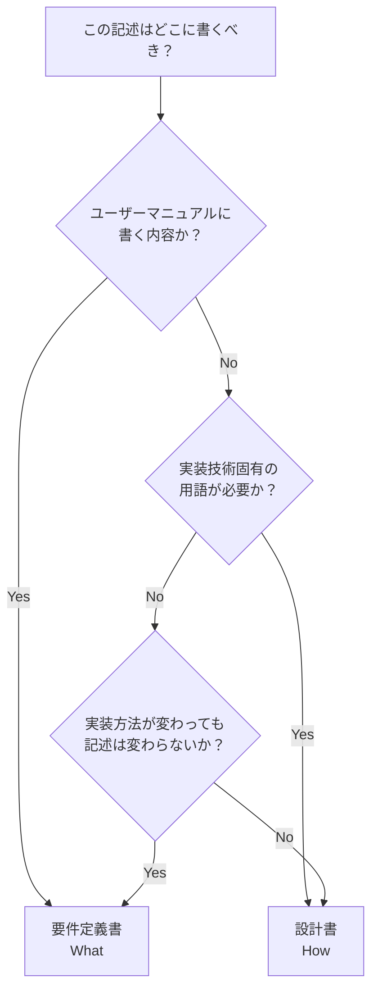

# 要件定義書と設計書の境界ガイド

**目的**: What（要件定義書）と How（設計書）の境界を明確化し、記載内容の判断を支援する

---

## 1. 基本原則

### 要件定義書（What）

- **目的**: 何を作るか
- **視点**: ユーザー視点
- **内容**: 必要な機能、データ、ルール
- **読者**: ステークホルダー全員
- **詳細度**: 概念レベル
- **技術**: 技術中立（実装方法に依存しない）

### 設計書（How）

- **目的**: どう作るか
- **視点**: 開発者視点
- **内容**: 実装方法、アーキテクチャ、処理フロー
- **読者**: 開発者、AI
- **詳細度**: 実装レベル
- **技術**: 技術依存（フレームワーク・実装パターン等）

---

## 2. 判断基準

### 主要な判断基準

**「ユーザーマニュアルに書くか？」**

- **Yes** → 要件定義書
- **No** → 設計書

### 補助的な判断基準

| 質問                                           | Yes → 要件定義書 | No → 設計書 |
| ---------------------------------------------- | ---------------- | ----------- |
| 実装方法が変わっても、この記述は変わらないか？ | ✓                |             |
| ユーザーマニュアルに書くか？                   | ✓                |             |
| 実装技術・フレームワーク固有の用語が必要か？   |                  | ✓           |
| 「どのように」という質問への答えか？           |                  | ✓           |
| クラス名やメソッド名が含まれるか？             |                  | ✓           |

---

## 3. 判断フローチャート



---

## 4. カテゴリ別ガイド

### 4.1 データ関連

| 内容                                        | 要件定義書 | 設計書 |
| ------------------------------------------- | ---------- | ------ |
| 必要なデータの種類                          | ✓          |        |
| データの内容（概念）                        | ✓          |        |
| データフロー（Service→DataStore→ViewModel） |            | ✓      |
| データストリームの実装方式                  |            | ✓      |

**例**:

- 要件定義書：「データ（名前、電話番号、グループ）が必要」
- 設計書：「Service → DataStore → ViewModel へのデータフロー設計」

### 4.2 状態関連

| 内容                         | 要件定義書 | 設計書 |
| ---------------------------- | ---------- | ------ |
| 必要な状態の種類             | ✓          |        |
| ユーザーから見える状態       | ✓          |        |
| 状態管理の実装技術・パターン |            | ✓      |
| 状態クラス・enumの実装       |            | ✓      |

**例**:

- 要件定義書：「ローディング中、エラー表示中の状態が必要」
- 設計書：「状態管理クラスを使用（ローディング・エラー・完了状態）」

### 4.3 処理関連

| 内容                     | 要件定義書 | 設計書 |
| ------------------------ | ---------- | ------ |
| 機能の目的               | ✓          |        |
| ユーザーから見た振る舞い | ✓          |        |
| 処理フロー・アルゴリズム |            | ✓      |
| シーケンス図             |            | ✓      |

**例**:

- 要件定義書：「検索キーワードでデータを絞り込む」
- 設計書：「入力 debounce → Service.search() → フィルタリング → DataStore 更新」

### 4.4 ビジネスルール関連

| 内容                         | 要件定義書 | 設計書 |
| ---------------------------- | ---------- | ------ |
| ルールの内容（条件、計算式） | ✓          |        |
| ルールの実装方法             |            | ✓      |
| バリデーションの実装         |            | ✓      |

**例**:

- 要件定義書：「電話番号は10桁または11桁である必要がある」
- 設計書：「Validator.validate() → ハイフン除去 → 長さチェック」

### 4.5 テスト関連

| 内容         | 要件定義書 | 設計書 |
| ------------ | ---------- | ------ |
| テストケース |            | ✓      |
| テスト方法   |            | ✓      |
| 検証項目     |            | ✓      |

**例**:

- 要件定義書：記載しない
- 設計書：テストケース設計（正常系・異常系）

### 4.6 定量目標関連

| 内容                                                         | 要件定義書 | 設計書 |
| ------------------------------------------------------------ | ---------- | ------ |
| ユーザー要求・ビジネス制約・既存契約として確定済みの定量目標 | ✓          |        |
| 定量目標を達成するための構造・方針                           |            | ✓      |
| 「この設計なら X を達成する」という保証的記述                | ✗          | ✗      |
| 定量値の実地検証結果（負荷試験・本番計測等）                 |            |        |

**例**:

- 要件定義書 ✅: 「顧客契約上、検索結果は 200ms 以内に返す」
- 設計書 ✅: 「Redis キャッシュ層 + debounce で応答性を狙う」
- 設計書 ❌: 「本設計により 200ms を切る」（設計段階では担保できない）
- 要件定義書 ❌: 「Redis を使って 200ms を切る」（実装手段を要件に混入）

**重要**:

実行後に人間が「少し遅い」「十分速い」等を体感して決める性質の値は、AI が数値例から推測して要件・設計に書いてはならない。
未確定の定量目標は、要件定義書の未確定事項として当事者判断に委ねる。

定量目標の**達成可否は運用・測定段階で初めて検証される**（負荷試験・プロファイリング・本番計測）。
設計書は「どう達成を狙うか」の構造・方針を示すまでが責務であり、
「達成を保証する」体裁で定量値を書くのは越権である。

構造品質（責務分割・境界・依存方向）の定量化は別論点であり、
そもそも数値化すべきでない。
→ `${CLAUDE_PLUGIN_ROOT}/docs/spec_priorities_spec.md` §3 参照。

---

## 5. 良い例/悪い例

### 5.1 データフロー

**要件定義書 ✅**:

```markdown
## データ要件

- データリストの表示のためにデータが必要
- データは名前・カテゴリ・作成日時を含む
- データはリアルタイムで更新される必要がある
```

**設計書 ✅**:

```markdown
## データフロー設計

- DataService → Repository → API 取得
- DataService → DataStore.update()
- DataStore → 変更通知 → ViewModel → View 更新
```

**要件定義書 ❌**:

```markdown
## データフロー要件

- DataService → Repository → API 取得
- DataService.updateItems() を呼び出す
```

### 5.2 状態管理

**要件定義書 ✅**:

```markdown
## 状態要件

- ローディング中、データ表示中、エラー表示中の状態が必要
- ユーザーは現在の状態を視覚的に認識できる必要がある
```

**設計書 ✅**:

```markdown
## 状態管理設計

- ViewState（none/loading/loaded/error）で状態管理
- ViewModel が状態を保持・更新
- View が状態に応じた表示を切り替え
```

**要件定義書 ❌**:

```markdown
## 画面状態管理要件

- ViewState enum を使用する
- ViewModel で状態を管理する
```

### 5.3 ビジネスルール

**要件定義書 ✅**:

```markdown
## ビジネスルール：電話番号の妥当性

- 電話番号は10桁または11桁である必要がある
- ハイフンは許容する（内部的に除去）
```

**設計書 ✅**:

```markdown
## 電話番号検証アルゴリズム設計

1. ハイフンを除去
2. 文字列長をチェック（10 or 11）
3. ValidationResult を返却
```

**要件定義書 ❌**:

```markdown
## 処理フロー：電話番号検証

1. PhoneValidator.validate() 呼び出し
2. ハイフンを除去
3. 文字列長チェック
```

---

## 6. グレーゾーンの扱い

### 6.1 データモデルの型

**問題**: 「String」「Int」等は技術的詳細か、概念的な記述か？

**結論**: 実用上の観点から**許容する**（グレーゾーン）

**推奨**:

- 概念レベル：「文字列」「数値」「日時」「真偽値」
- 実装型：「String」「Int」「Date」「Bool」も許容

**理由**: 要件レベルでも型の明示は有用。ただし詳細な型設計は設計書で。

### 6.2 図表

**問題**: 図（ダイアグラム）は「What」か「How」か？

**結論**: 内容による

**要件定義書で許容**:

- 画面遷移図（ユーザーから見た遷移）
- ナビゲーション構造図（画面の階層）
- ユースケース図（外部から見た相互作用）

**設計書で記載**:

- シーケンス図（内部の処理ステップ）
- データフロー図（内部のデータの流れ）
- クラス図（実装構造）

---

## 7. まとめ

### 7.1 基本方針

**要件定義書は「ユーザーマニュアル」**

- ユーザーが理解できる内容
- 実装方法に依存しない

**設計書は「実装ガイド」**

- 開発者が実装できる詳細
- 技術的な詳細を含む

### 7.2 迷ったら

1. 「ユーザーマニュアルに書くか？」で判断
2. それでも迷ったら、人間に確認
3. グレーゾーン（型定義等）は実用上許容

---

## 8. 重大度カタログ [MANDATORY]

本文書内の各規範を、違反時の重大度に対応付ける。本節は REQ-004 FNC-411 に基づく重大度判定の SoT であり、criteria 側は本節を MANDATORY 参照する (判断は criteria に持たせない、FNC-402)。

### 8.1 §4 カテゴリ別ガイド (What/How 境界違反)

| 違反パターン                                                       | 出典 | 違反時の重大度 | 理由                                                                     |
| ------------------------------------------------------------------ | ---- | -------------- | ------------------------------------------------------------------------ |
| データフロー (Service→DataStore→ViewModel 等) を要件定義書に記載   | §4.1 | 🔴 critical    | 実装手段を What に混入させる典型。読者がステークホルダーから開発者に縮退 |
| 状態クラス・enum の実装名を要件定義書に記載                        | §4.2 | 🔴 critical    | 同上 (ViewState enum 等)                                                 |
| 処理フロー・アルゴリズム・シーケンス図を要件定義書に記載           | §4.3 | 🔴 critical    | 同上                                                                     |
| バリデーション実装手順 (PhoneValidator.validate() 等) を要件定義書 | §4.4 | 🔴 critical    | 同上                                                                     |
| テストケースを要件定義書に記載                                     | §4.5 | 🟡 major       | What/How 境界違反だが、ビジネスルール例示と紛らわしい (gray zone)        |
| 「本設計により X を達成する」等の保証表現を設計書に記載            | §4.6 | 🔴 critical    | 設計段階で担保できない事項を保証する越権記述                             |
| 設計書に手段+数値目標 (Redis を使って 200ms を切る) を混入         | §4.6 | 🟡 major       | 要件と設計の責務混在                                                     |
| 要件定義書に手段を含む数値目標 (Redis を使って 200ms 切る等)       | §4.6 | 🔴 critical    | 実装手段を要件に混入 (技術依存)                                          |

### 8.2 §6 グレーゾーン (型 / 図表)

§6 はもともと「許容する」と明示しているが、許容外を見落とすケースがあるため重大度カタログで補強する。

| 違反パターン                                                         | 出典 | 違反時の重大度 | 理由                                                                 |
| -------------------------------------------------------------------- | ---- | -------------- | -------------------------------------------------------------------- |
| 要件定義書に詳細な型設計 (Generic 制約 / 内部構造) を記載            | §6.1 | 🟡 major       | 概念型・実装型は許容するが、詳細型設計は How 領域                    |
| 要件定義書にシーケンス図・クラス図・データフロー図を記載             | §6.2 | 🔴 critical    | 内部実装図は How 専用                                                |
| 設計書に画面遷移図・ナビゲーション構造図のみ (内部構造図なし) を記載 | §6.2 | 🟢 minor       | 補助的に置く分には許容。本来は要件側だが、設計書に再掲する選択は許容 |

---

## 9. グレーゾーン許容範囲 [MANDATORY]

§6 の暗黙的「許容する」を断定形に置換する。レビュー時の false positive 警告は principles 側で執筆者にも見える形で持つ。criteria 側に「false positive 注意」を書いてはならない (REQ-004 FNC-402)。

### 9.1 G.1 データモデルの型

| 論点                 | ✅ 許容                                                                      | ❌ 不許容                                                        |
| -------------------- | ---------------------------------------------------------------------------- | ---------------------------------------------------------------- |
| 要件定義書での型表記 | 概念型 (文字列 / 数値 / 日時 / 真偽値) / 実装型 (String / Int / Date / Bool) | 詳細型設計 (Generic 制約 / 内部 struct 階層 / Optional 設計理由) |
| 設計書での型表記     | 詳細型設計を含むすべての型表現                                               | (制約なし)                                                       |

### 9.2 G.2 図表

| 論点                            | ✅ 許容 (要件定義書側) | ❌ 不許容 (要件定義書側)    |
| ------------------------------- | ---------------------- | --------------------------- |
| 画面遷移図 (ユーザー視点の遷移) | ✅                     |                             |
| ナビゲーション構造図            | ✅                     |                             |
| ユースケース図 (外部相互作用)   | ✅                     |                             |
| シーケンス図                    |                        | ❌ (内部処理ステップは How) |
| データフロー図 (内部の流れ)     |                        | ❌                          |
| クラス図                        |                        | ❌                          |

### 9.3 G.3 定量目標

| 論点                                 | ✅ 許容 (要件定義書側)                                  | ❌ 不許容 (要件定義書側)                          |
| ------------------------------------ | ------------------------------------------------------- | ------------------------------------------------- |
| ユーザー要求・契約・実測由来の確定値 | ✅ 「顧客契約上、検索結果は 200ms 以内」「SLA 99.9%」等 | (実装手段の混入は不可)                            |
| 未確定値                             | TBD として明示                                          | AI が一般論で補完した数値を要件として確定すること |
| 手段を含む目標                       |                                                         | ❌「Redis を使って 200ms 切る」(要件は技術中立)   |

| 論点                 | ✅ 許容 (設計書側)                                                         | ❌ 不許容 (設計書側)             |
| -------------------- | -------------------------------------------------------------------------- | -------------------------------- |
| 達成を狙う構造・方針 | ✅ 「Redis キャッシュ + debounce で応答性を狙う」                          |                                  |
| 達成保証表現         |                                                                            | ❌ 「本設計により X を達成する」 |
| 達成可否の判定       | 運用・測定段階 (負荷試験 / プロファイリング / 本番計測) で検証する旨を明示 | 設計段階で達成可否を断定すること |

---

## 10. トレーサビリティ規範 (軽量版)

設計書レビュー時、以下が成立しないと 🟡 major として検出する。

| 規範                                                                              | 違反時の重大度 |
| --------------------------------------------------------------------------------- | -------------- |
| 設計書のメタデータに「関連要件」フィールドがあり、要件 ID が記載されている        | 🟡 major       |
| 設計書本文中で参照する要件 ID が、関連要件フィールドに含まれている (孤立参照禁止) | 🟡 major       |
| 要件定義書に存在しない機能を設計書で新規追加していない                            | 🔴 critical    |

詳細なトレーサビリティ規約 (要件 ID とタスクの対応等) は計画書側 (`plan_principles_spec.md`) で扱う。

---

## 改定履歴

| 日付       | バージョン | 内容                                                                                                                                                                                                                                                                                                                                                                                                                                                                                  |
| ---------- | ---------- | ------------------------------------------------------------------------------------------------------------------------------------------------------------------------------------------------------------------------------------------------------------------------------------------------------------------------------------------------------------------------------------------------------------------------------------------------------------------------------------- |
| 2026-05-21 | 0.2        | forge-review feature 統合 (addendum v0.1 merge)。`docs/specs/forge-review/principles/spec_design_boundary_spec_addendum.md` (v0.1: 起草版作成、REQ-004 FNC-411。§6 グレーゾーンを許容/不許容の断定形に置換、Appendix A.11 を軽量トレーサビリティ節として取り込み) の内容を §8 重大度カタログ / §9 グレーゾーン許容範囲 / §10 トレーサビリティ規範 (軽量版) として末尾追加 (DES-028 §5.1)。重大度カタログ (FNC-411) を本文書に集約し、criteria 側からの判断除去 (FNC-402) の前提を確立 |
