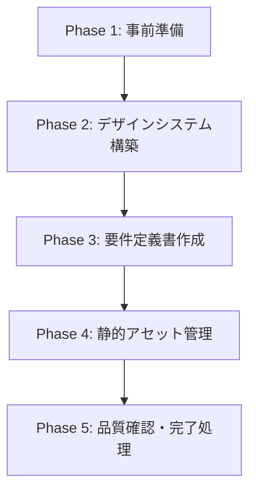

# Figma 要件定義書作成ワークフロー

## 必須参照文書 [MANDATORY]

**NEVER skip.** 下記を全て読み込み、深く理解すること

- **`${CLAUDE_PLUGIN_ROOT}/docs/spec_format.md`** — ID 分類カタログ（使用する ID をここから選択）
- **`${CLAUDE_PLUGIN_ROOT}/docs/requirement_format.md`** — 要件定義書テンプレート
- **`${CLAUDE_PLUGIN_ROOT}/docs/spec_design_boundary_spec.md`** — 要件・設計の境界ガイド（What/How の判断基準）

## 目的

Figma デザインファイルから要件を抽出し、デザイントークンと要件定義書を作成する。

## 実行フロー概要



---

## Phase 1: 事前準備

### 1.1 Figma MCP の利用可否確認 [MANDATORY]

利用可能なツール一覧に `mcp__figma` 等が存在するかを確認する。

- **利用可能** → 次へ進む
- **利用不可** → エラーメッセージを表示して終了:
  ```
  Error: Figma MCP が必要です。
  interactive または reverse-engineering モードを使用してください。
  ```

### 1.2 ユーザーへの確認 [MANDATORY]

以下を AskUserQuestion で確認する:

```
□ Figma ファイルへのアクセス権限はあるか？
□ デザインの最終版か、まだ変更予定があるか？
□ アプリの主要な目的は何か？
□ デザイン以外の隠れた機能要件はあるか？
```

### 1.3 ルール文書・既存仕様の取得 [MANDATORY]

1. **`/query-rules`** でルール文書を特定（利用可能な場合）
   - タスク内容: Figma デザインからの要件定義書作成
   - Skill 利用不可の場合は Glob で `docs/rules/` を探索

2. **`/query-specs`** で既存要件定義書・設計書を確認（利用可能な場合）
   - タスク内容: Figma デザインからの要件定義書作成
   - Skill 利用不可の場合は Glob で specs 配下を探索

3. 返却された文書を全文読み込み

**Skill 失敗時**: エラー内容をユーザーに報告し、指示を待つ

---

## Phase 2: デザインシステム構築

### 2.1 デザインシステム（2層構造）

デザインシステムは以下の2層構造で構築する:

#### 第1層: デザイントークン（原子的な値）

- **Colors**: 正確な HEX 値（Figma と一致）
- **Typography**: フォントサイズ、ウェイト、行高
- **Spacing**: スペーシングスケール（4の倍数など）
- **Radius**: ボーダー半径値
- **Shadows**: シャドウスタイル定義

#### 第2層: テーマ（意味的定義）

- Status 色定義（成功、警告、エラー、情報）
- Button 色定義（プライマリ、セカンダリ、ターシャリ）
- Text 色定義（本文、見出し、キャプション）
- Surface 色定義（背景、カード、オーバーレイ）
- Typography 定義（Title, Body, Button, Caption）
- Layout 定義（Size, Spacing, CornerRadius）

### 2.2 再利用可能コンポーネントの特定

- Button（Primary, Secondary, Icon）
- Card（Basic, Elevated）
- Input（TextField, TextArea, Search）
- Navigation（NavigationBar, TabBar）
- Dialog（Alert, BottomSheet）
- Loading（Indicator, Skeleton）

### 2.3 デザイントークン抽出手順

1. **色の抽出**: Figma のカラーパレットから正確な HEX 値を取得
2. **タイポグラフィの抽出**: フォントファミリー、サイズ、ウェイト、行高を記録
3. **スペーシングとレイアウト**: 一貫したスペーシングシステムを特定

---

## Phase 3: 要件定義書作成

### 3.1 画面要件（SCR-xxx）の抽出

各画面に対して:

- 画面の目的と役割を記述
- UI 要素の配置を ASCII 図で表現
- レイアウト制約を記載
- インタラクション仕様を記載

**重要な原則**:

1. **パーツ名称は画面固有の具体的な名前を使用**
   - ❌ 一般的な名前: 「Title」「List」「Footer」
   - ✅ 画面固有の名前: 「FooListHeader」「BarSelectionList」

2. **レイアウト配置図を含める**
   - ASCII 図で視覚的な配置関係を表現
   - 配置図だけで Figma を見なくてもレイアウトが再現できること

### 3.2 UI コンポーネント（CMP-xxx）の抽出

- 再利用される部品を特定
- 状態（通常、押下、無効など）を記録
- プロパティと振る舞いを定義

### 3.3 機能要件（FNC-xxx）の抽出

- UI から推測される機能を列挙
- 画面に表現されない機能をユーザーに確認

### 3.4 デザインにない要件の補完

Figma デザインには表現されない以下の要件を補完:

```
□ エラーハンドリング（ネットワークエラー、入力エラー等）
□ ローディング状態
□ 空の状態（データがない場合の表示）
□ アクセシビリティ要件
□ パフォーマンス要件
□ データ永続化要件
□ 外部システム連携
```

### 3.5 グロッサリー作成 [MANDATORY]

要件で使用する用語を定義・整理する。

---

## Phase 4: 静的アセット管理

### 4.1 画像アセットの洗い出し

Figma から抽出した画像の扱い:

- アイコン → システム標準アイコンで代替可能か確認
- イラスト → アセットとして保存予定として記録
- ロゴ → ブランドガイドラインを確認
- 背景画像 → 必要性をユーザーに確認

### 4.2 アセット管理方針の記載

```markdown
## アセット要件
- アイコン: システム標準アイコン使用（可能な限り）
- カスタム画像: アセット管理に配置予定
- 命名規則: snake_case
```

---

## Phase 5: 品質確認・完了処理

### 5.1 デザイントークンの検証

- [ ] 全ての色が Figma と完全一致
- [ ] フォントサイズ・ウェイトが正確
- [ ] スペーシングが一貫している
- [ ] コンポーネントの再利用性が高い

### 5.2 要件定義書の検証

- [ ] 全ての画面に要件定義書が存在
- [ ] 要件 ID が正しく付与されている
- [ ] UI で表現されない機能も記載されている
- [ ] エラーケースが考慮されている
- [ ] `requirement_format.md` のフォーマットに従っている

### 5.3 AI レビュー実施 [MANDATORY]

```
/forge:review requirement {作成ファイルパス} --auto
```

対象はこのワークフローで作成・変更したファイル（差分）のみ。

### 5.4 specs ToC 更新

`.claude/skills/create-specs-toc/SKILL.md` が存在する場合のみ `/create-specs-toc` を実行する。

### 5.5 commit/push 確認

`/anvil:commit` を実行して commit/push を確認する。

### 5.6 セッション削除

```bash
rm -rf {session_dir}
```

### 5.7 完了案内

```
要件定義書を作成しました:
  → {作成ファイルパス}

次のステップ:
  /forge:start-design {feature}    # 設計書作成へ進む
```
