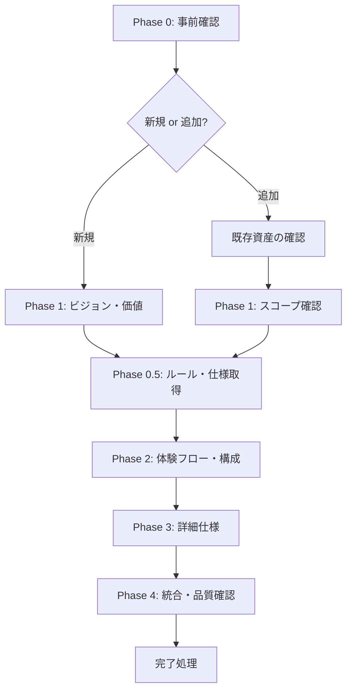
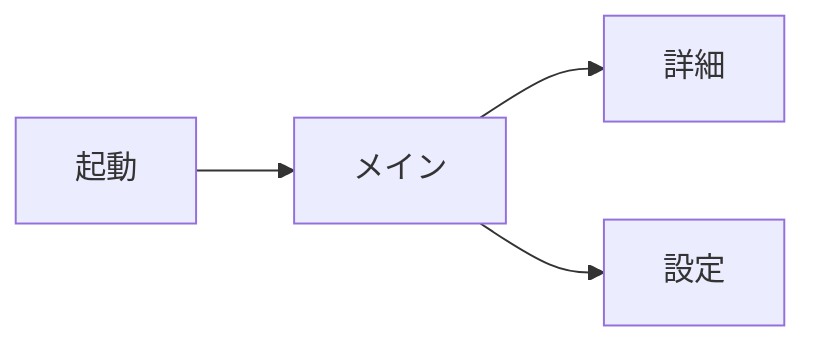

# 対話型要件定義ワークフロー

## 必須参照文書 [MANDATORY]

**NEVER skip.** 下記を全て読み込み、深く理解すること

- **`${CLAUDE_PLUGIN_ROOT}/docs/spec_format.md`** — ID 分類カタログ（使用する ID をここから選択）
- **`${CLAUDE_PLUGIN_ROOT}/docs/requirement_format.md`** — 要件定義書テンプレート
- **`${CLAUDE_PLUGIN_ROOT}/docs/spec_design_boundary_spec.md`** — 要件・設計の境界ガイド（What/How の判断基準）

## 目的

Figma や画面設計書が存在しない状態で、**ユーザーとの対話を通じて要件を具体化**し、要件定義書を作成するワークフロー。

**対応ケース**:
- 新規アプリをゼロから作る
- 既存アプリに新機能を追加する

**IMPORTANT**: 対話の基本原則を必ず守ること。各フェーズ終了時に必ずユーザーの確認を得ること。

---

## 実行フロー概要



**注意**: 各 Phase は順番に進行するが、後の Phase で前提が変わった場合は前の Phase に戻ってよい。その際は、変更の影響を受ける成果物を全て更新すること。

---

## Phase 0: 事前確認 [MANDATORY]

### 0.1 新規/追加の判定

最初に以下を確認する:

```
□ 新規アプリの作成ですか？それとも既存アプリへの機能追加ですか？
```

### 0.2 新規アプリの場合

以下を確認する:

| 確認項目 | 質問例 |
|---------|--------|
| アプリの概要 | どんなアプリ/ツールを作りたいですか？（1-2文で） |
| 対象ユーザー | 誰が使いますか？ |
| 参考アプリ/ツール | 参考にしたいものはありますか？ |
| 絶対に入れたい機能 | 必須の機能は何ですか？ |
| 絶対に入れない機能 | スコープ外にしたいものは？ |
| 制約・リスク | 技術的制約や懸念事項はありますか？ |

**成果物**: スコープ定義メモ

### 0.3 機能追加の場合 [MANDATORY]

**既存資産の確認が必須**:

1. **`/query-specs` Skill で既存仕様を検索する**（利用可能な場合）
   - 既存の要件定義書一覧を把握
   - 関連する既存要件を特定
   - Skill が利用不可の場合は Glob で `specs/` 配下を探索

2. **関連する設計書を読む**
   - 既存のアーキテクチャを理解
   - 影響を受けるコンポーネントを特定

3. **既存コードを確認**（必要に応じて）
   - 関連する実装を Grep/Glob で検索
   - 既存の実装パターンを把握

以下を確認する:

| 確認項目 | 質問例 |
|---------|--------|
| 追加機能の概要 | どんな機能を追加したいですか？ |
| 関連する既存機能 | 既存のどの機能に関係しますか？ |
| 新規要素の要否 | 新しい画面/コマンド/ファイルが必要ですか？ |
| 影響範囲 | 他の機能への影響はありそうですか？ |

**成果物**: スコープ定義メモ + 影響範囲メモ

---

## Phase 0.5: 開発ルール文書・既存仕様の取得 [MANDATORY]

### 0.5.1 ルール文書の特定（新規・追加共通）

開発ルール文書は `/query-rules` Skill を使って特定する（利用可能な場合）:
- タスク内容: 対話型要件定義作成

Skill が利用不可の場合は Glob で `docs/rules/` 配下を探索する。

### 0.5.2 既存仕様の特定（機能追加の場合）

要件定義書・既存の設計書は `/query-specs` Skill を使って特定する（利用可能な場合）:
- タスク内容: [追加機能の概要]

### 0.5.3 外部情報の調査（必要に応じて）

Phase 0 の対話で判明した内容に基づき、必要な場合のみ:
- 類似サービス・ベストプラクティスの調査（WebSearch）
- 技術的実現可能性の確認（WebSearch）

**Skill 失敗時**: エラー内容をユーザーに報告し、指示を待つ

**成果物**: 参照すべきルール文書・既存仕様リスト

---

## Phase 1: ビジョン・価値の明確化

### 1.1 新規アプリの場合

APP-001（アプリ全体概要）のドラフトを作成するために以下を確認:

| 確認項目 | 質問例 |
|---------|--------|
| 解決する課題 | このアプリ/ツールで解決したい課題は何ですか？ |
| 提供価値 | ユーザーにとっての価値は何ですか？ |
| 成功の定義 | 成功したと言える状態は？ |
| 主要機能 | 主な機能を3-5個挙げてください |

**成果物**: APP-001 ドラフト

### 1.2 機能追加の場合

APP-001 は既に存在するため、参照のみ。以下を確認:

| 確認項目 | 質問例 |
|---------|--------|
| 機能の目的 | この機能で何を実現したいですか？ |
| ユーザーのゴール | ユーザーは何を達成できるようになりますか？ |
| 既存機能との関係 | 既存のどの機能と連携しますか？ |

**成果物**: 機能概要メモ（APP-001 更新要否を判断）

---

## Phase 2: 体験フロー・構成

### 2.1 主要シナリオの確認

ユーザーの主要な操作フローを確認する:

```
質問例:
□ ユーザーがこの機能を使い始めてから目的を達成するまでの流れを教えてください
□ 最もよく使う機能は何ですか？
□ 2番目によく使う機能は何ですか？
```

**シナリオごとに以下を整理**:
- トリガー（何がきっかけで操作を始めるか）
- 操作の流れ（ステップバイステップ）
- 完了条件（何をもって完了とするか）

### 2.2 画面/インターフェース一覧の作成

シナリオから画面やインターフェースを抽出し、一覧を作成:

```markdown
## 画面/インターフェース一覧（ドラフト）

| 名前 | 役割 | 主要機能 |
|------|------|---------|
| ... | ... | ... |
```

**確認ポイント**:
```
□ この一覧で過不足はありませんか？
□ 名前は適切ですか？
```

### 2.3 ナビゲーション/フロー構造の確認

**Mermaid 図で視覚的に確認**:


**成果物**: 画面/インターフェース一覧、フロー図、主要シナリオ一覧

---

## Phase 3: 詳細仕様の掘り下げ

### 3.0 用語の定義と共有（グロッサリー） [MANDATORY]

詳細仕様に入る前に、対話中に使われる言葉の意味を明確にし、共通認識を築く。

- **既存の言葉**: 意味を双方で確認する
- **新しい概念**: 名前を付けて以後一貫して使う

確定した用語は**グロッサリー（用語集）**として蓄積する。グロッサリーは対話の進行とともに育てていく「生きた文書」であり、設計フェーズにも引き継がれる。

#### シーケンスによる認識共有

Phase 2 の主要シナリオを元に、ユーザーとシステムの相互作用を大雑把なシーケンスとして描き、認識を合わせる。この成果物は次の設計フェーズへのインプットにもなる。

**成果物**: グロッサリー（用語集）、主要シーケンス

### 3.1 要件の作成

プロジェクトの性質に応じて必要な ID を `spec_format.md` から選択し、要件を作成する。以下は代表的な要件種別:

**画面要件（SCR-xxx）** — UI を持つプロジェクトの場合:

| 確認項目 | 質問例 |
|---------|--------|
| 画面の目的 | この画面の役割は何ですか？ |
| 表示要素 | 何を表示しますか？ |
| 操作 | ユーザーは何を操作できますか？ |
| 空状態 | データがない場合、何を表示しますか？ |
| エラー | エラー時のメッセージは何ですか？ |

**機能要件（FNC-xxx）**:

| 確認項目 | 質問例 |
|---------|--------|
| 機能の目的 | この機能で何ができますか？ |
| トリガー | どうやって機能を開始しますか？ |
| 入力 | 何を入力しますか？ |
| 出力 | 結果として何が起きますか？ |
| 制約 | 制限事項はありますか？ |

**ビジネスロジック（BL-xxx）**:

| 確認項目 | 質問例 |
|---------|--------|
| 計算ルール | 計算式や算出方法はありますか？ |
| 判断基準 | 条件分岐のルールはありますか？ |
| バリデーション | 入力値の制約はありますか？ |

**データ要件（DM-xxx）**:

```
質問例:
□ どんなデータを保存しますか？
□ データはどこに保存しますか？
□ データの関連性はありますか？
```

**その他**: CMP, NAV, API, EXT, NFR, SEC, ERR — 必要に応じて

**成果物**: SCR-xxx、FNC-xxx、BL-xxx、DM-xxx 等のドラフト

---

## Phase 4: 統合・品質確認

### 4.1 要件定義書の完成

各要件定義書を `requirement_format.md` に従って整形:

- 要件 ID の付与
- メタデータの記載
- 関連要件のリンク設定

### 4.2 品質チェック [MANDATORY]

**形式面のチェック**:
- [ ] 要件 ID が正しく付与されている
- [ ] ファイル名がルールに従っている
- [ ] 必須セクションが全て存在する

**内容面のチェック**:
- [ ] 「What」のみ記載（「How」は含まない）
- [ ] 曖昧な表現（「適切に」「必要に応じて」）がない
- [ ] ユーザー視点で書かれている

**整合性チェック**（機能追加の場合）:
- [ ] 既存要件との矛盾がない
- [ ] 既存設計との整合性がある

### 4.3 未確定事項の整理

確定できなかった項目を「TBD」として明示:

```markdown
## 未確定事項

| ID | 内容 | 解決方法 | 期限 |
|----|------|---------|------|
| TBD-001 | ... | ユーザー確認 | 設計開始前 |
```

### 4.4 AI レビュー実施 [MANDATORY]

作成した要件定義書に対して `/forge:review` を `--auto` モードで実行する:

```
/forge:review requirement {作成ファイルパス} --auto
```

対象はこのワークフローで作成・変更したファイル（差分）のみ。

### 4.5 specs ToC 更新

`.claude/skills/create-specs-toc/SKILL.md` が存在する場合のみ `/create-specs-toc` を実行する（存在しない場合はスキップ）。

### 4.6 commit/push 確認

`/anvil:commit` を実行して commit/push を確認する。

### 4.7 セッション削除

全フェーズ正常完了後、セッションディレクトリを削除する:

```bash
rm -rf {session_dir}
```

### 4.8 完了案内

作成したファイルパスとともに次のステップを案内する:

```
要件定義書を作成しました:
  → {作成ファイルパス}

次のステップ:
  /forge:start-design {feature}    # 設計書作成へ進む
```

---

## 対話の基本原則 [MANDATORY]

### 1. 選択肢ファースト

```
❌ 悪い例: 「どうしますか？」
✅ 良い例: 「A、B、C のどれが近いですか？」
```

### 2. 視覚的確認

各フェーズで ASCII 図や Mermaid 図を使って認識を合わせる。

### 3. 小さく確認

フェーズ終了時だけでなく、重要な決定の都度確認する:
```
「ここまでの理解で合っていますか？」
```

### 4. 未確定の許容

完璧を求めず、「TBD」を恐れない。後で埋められる。

### 5. 「What」に集中

実装方法（How）に踏み込まない。迷ったら「ユーザーマニュアルに書くか？」で判断。

### 6. 段階的な文書提示

全ての文書を一気に書き上げて提示しない。まず APP-001 で全体概要を示し、ユーザーの承認を得てから詳細文書に進む。

```
APP-001（全体概要） → 承認 → 個別の詳細文書 → 各文書ごとに承認
```

### 7. スコープ管理

要件は「必須 / あると良い / 将来」の3段階で分類し、膨張を防ぐ。Phase 0 で合意した「絶対に入れない機能」を基準に、スコープ逸脱を指摘する。

---

## アンチパターン [MANDATORY]

| パターン | 問題 | 対策 |
|---------|------|------|
| **質問攻め** | ユーザーが疲弊 | 選択肢提示、3-5問で区切る |
| **曖昧な合意** | 後で認識ズレ | 図表で視覚的に確認 |
| **How 混入** | 設計書の領域を侵食 | 「ユーザーマニュアルに書くか？」で判断 |
| **完璧主義** | 進まない | TBD を許容、後で埋める |
| **一気に全部** | 漏れ・矛盾 | フェーズごとに確定 |
| **既存無視**（追加時） | 整合性崩壊 | 既存資産を必ず確認 |
| **スコープ膨張** | 全部入りで終わらない | 必須/あると良い/将来の3段階分類 |
| **表面的合意** | 「いいですね」だが理解していない | 具体例で確認、言い換えて復唱 |
| **事前の過剰準備** | ユーザー不在の判断 | ヒアリングが先、調査は後 |

---

## 特例ルール [対話型要件定義固有]

本ワークフローで作成する要件定義書には、以下の特例ルールを適用する。

### 1. 未確定事項（曖昧表現の代替）

曖昧表現は禁止。代わりに「未確定事項」セクションで管理する。

**ルール**:
- 曖昧表現（「極力」「適切に」等）の代わりに未確定事項として登録
- ユーザー視点の要件は曖昧にせず、対話で明確化を試みる
- 5件を超える場合、要件定義の追加対話を検討
- 設計完了時点で未解決の場合は 🔴 致命的

### 2. レビュー時の適用

| 問題タイプ | 条件 | 重要度 |
|-----------|------|--------|
| 曖昧表現 | 未確定事項に登録済み | 🟢 改善（参考） |
| 曖昧表現 | 未確定事項に未登録 | 🟡 品質 |
| 曖昧表現 | ユーザー視点の要件が曖昧 | 🔴 致命的 |
| How 混入 | 全て | 🟡 品質 |
| How 混入 | What が完全に欠落 | 🔴 致命的 |

---

## 質問テンプレート集

### Phase 0: 事前確認

```markdown
## 新規アプリの場合
1. どんなアプリ/ツールを作りたいですか？（1-2文で）
2. 誰が使いますか？
3. 参考にしたいアプリ/ツールはありますか？
4. 必須の機能を3つ挙げてください
5. 絶対に入れない機能はありますか？

## 機能追加の場合
1. どんな機能を追加したいですか？
2. 既存のどの機能に関係しますか？
3. 新しい画面/コマンドは必要ですか？
4. 他の機能への影響はありそうですか？
```

### Phase 1: ビジョン・価値

```markdown
1. この機能で解決したい課題は何ですか？
2. ユーザーにとっての価値は何ですか？
3. 成功したと言える状態を教えてください
```

### Phase 2: 体験フロー

```markdown
1. ユーザーの主要な操作フローを教えてください
2. 最もよく使う機能は何ですか？
```

### Phase 3: 詳細

```markdown
## 各画面/機能に対して
1. この画面/機能の目的は何ですか？
2. 何を表示/出力しますか？
3. ユーザーは何を操作できますか？
4. データがない場合の振る舞いは？
5. エラー時の振る舞いは？
```

---

## 成果物一覧

| フェーズ | 成果物 |
|---------|--------|
| Phase 0 | スコープ定義メモ、影響範囲メモ（追加時） |
| Phase 0.5 | 参照すべきルール文書・既存仕様リスト |
| Phase 1 | APP-001 ドラフト（新規）、機能概要メモ（追加） |
| Phase 2 | 画面/インターフェース一覧、フロー図、主要シナリオ |
| Phase 3 | グロッサリー、主要シーケンス、SCR/FNC/BL/DM 等のドラフト |
| Phase 4 | 完成した要件定義書 |
