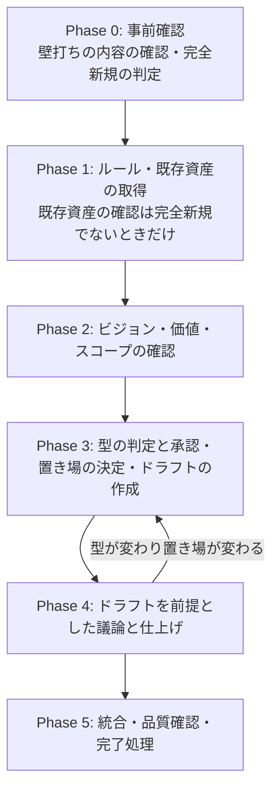
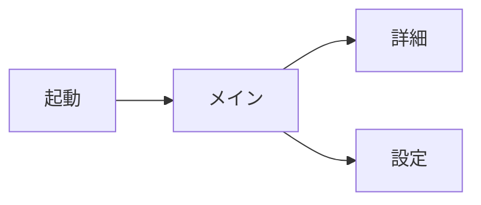

# 対話型要件定義ワークフロー

## 必須文書

**NEVER skip.** 下記を全て読み込み、深く理解すること

- **`${CLAUDE_PLUGIN_ROOT}/docs/additive_development_spec.md`** — フィーチャーの概念定義（§0）・追加開発ワークフロー仕様
- **`${CLAUDE_PLUGIN_ROOT}/docs/frontmatter_format.md`** — 一時マーカー（`feature_type`）と文書状態マーカー（`doc_status`）の定義
- **`${CLAUDE_PLUGIN_ROOT}/docs/requirement_principles_spec.md`** — 要件定義書の定義（責務・書かないもの・存在期間・改訂）
- **`${CLAUDE_PLUGIN_ROOT}/docs/requirement_format.md`** — 要件定義書テンプレート
- **`${CLAUDE_PLUGIN_ROOT}/docs/spec_design_boundary_spec.md`** — 要件・設計の境界ガイド（What/How の判断基準）
- **`${CLAUDE_PLUGIN_ROOT}/docs/spec_priorities_spec.md`** — 要件・設計で優先する価値観（構造品質の定量化禁止など）
- **`${CLAUDE_PLUGIN_ROOT}/docs/document_style_guide.md`** — 文書スタイル指針（タグ・見出し・参照記法）

## 目的

Figma や画面設計書が存在しない状態で、**要件定義書のドラフトを先に書き、ユーザーとの対話を通じて仕上げる**ワークフロー。

スキルの起動前に、ユーザーと AI が壁打ちをしていることが多い。そこで分かっていることは聞き直さず、先にドラフトとして要件定義書に書き、それを前提に議論する。

**対応ケース**:

- 新規アプリをゼロから作る
- 既存アプリに新機能を追加する

**IMPORTANT**: 対話の基本原則を必ず守ること。各フェーズ終了時に必ずユーザーの確認を得ること。

---

## 実行フロー概要


```mermaid
graph TD
    P0["Phase 0: 事前確認<br>壁打ちの内容の確認・完全新規の判定"] --> P1
    P1["Phase 1: ルール・既存資産の取得<br>既存資産の確認は完全新規でないときだけ"] --> P2
    P2["Phase 2: ビジョン・価値・スコープの確認"] --> P3
    P3["Phase 3: 型の判定と承認・置き場の決定・ドラフトの作成"] --> P4
    P4["Phase 4: ドラフトを前提とした議論と仕上げ"] --> P5
    P5["Phase 5: 統合・品質確認・完了処理"]
    P4 -->|"型が変わり置き場が変わる"| P3
```

**注意**: 各 Phase は順番に進行するが、後の Phase で前提が変わった場合は前の Phase に戻ってよい。その際は、変更の影響を受ける成果物を全て更新すること。

---

## Phase 0: 事前確認

### 0.1 壁打ちの内容の確認

会話の文脈（スキル起動前の壁打ち・調査）から分かっていることを、先に提示して確認する。**分かっていることを聞き直さない。** 分からない項目だけを尋ねる（分からない項目を尋ねる前に、「会話の中では分かりませんでした」と前置きする）。

確認する項目:

| 確認項目   | 内容                                                               |
| ---------- | ------------------------------------------------------------------ |
| 変更の性質 | 新規アプリの立ち上げか、既存アプリへの機能追加か（ユーザーに聞く） |
| 変更の概要 | 何を作るか・何を追加するか（1〜2 文）                              |

変更の性質は、ユーザーの答えをそのまま信号として使う。ただし、完全新規かどうかは、答えではなく 0.2 の結果で決まる。

### 0.2 完全新規かどうかの判定

`start-requirements/SKILL.md` の「要件定義書を書く直前の決定」の手順 1 で、既存の要件定義書の有無を求める。既存の要件定義書が 1 件も無ければ完全新規である。

- **完全新規**: Phase 1 の既存資産の確認と、Phase 3 の型の判定は行わない
- **完全新規でない**: Phase 1 で既存資産を確認し、Phase 3 で型を判定する

ユーザーが「既存アプリへの機能追加」と答えても、既存の要件定義書が無ければ完全新規である。逆に「新規アプリ」と答えても、既存の要件定義書があれば完全新規ではない。

**成果物**: 変更の性質・概要のメモ、完全新規かどうかの結果

---

## Phase 1: ルール・既存資産の取得

### 1.1 ルール文書の特定（共通）

開発ルール文書は `/forge:query-db-rules` Skill を使って特定する:

- タスク内容: 対話型要件定義作成

### 1.2 既存資産の確認（完全新規でない場合のみ）

**既存資産の確認が必須**:

1. **`/forge:query-db-specs` Skill で既存仕様を検索する**
   - 既存の要件定義書一覧を把握
   - 関連する既存要件を特定

2. **関連する設計書を読む**
   - 既存のアーキテクチャを理解
   - 影響を受けるコンポーネントを特定

3. **既存コードを確認**（必要に応じて）
   - 関連する既存機能と影響範囲を特定するために、関連する実装を Grep/Glob で検索する
   - 実装パターンの把握は、ここでは目的にしない（設計で扱う）

**成果物**: 参照すべきルール文書・既存仕様リスト、影響範囲メモ（完全新規でない場合）

### 1.3 外部情報の調査（必要に応じて）

Phase 0 の確認で判明した内容に基づき、必要な場合のみ:

- 類似サービス・ベストプラクティスの調査（WebSearch）
- 技術的実現可能性の確認（WebSearch）

**Skill 失敗時**: エラー内容をユーザーに報告し、指示を待つ

---

## Phase 2: ビジョン・価値・スコープの確認

新規・追加の両方で確認する。Phase 0 で分かっている項目は、聞き直さず、提示して確認する。

| 確認項目                   | 質問例                                         | 対象               |
| -------------------------- | ---------------------------------------------- | ------------------ |
| 解決する課題・機能の目的   | このアプリ/機能で解決したい課題は何ですか？    | 共通               |
| 提供価値・ユーザーのゴール | ユーザーにとっての価値は何ですか？             | 共通               |
| 成功の定義                 | 成功したと言える状態は？                       | 共通               |
| 主要機能                   | 主な機能を 3〜5 個挙げてください               | 共通               |
| 絶対に入れない機能         | スコープ外にしたいものは？                     | 共通               |
| 制約・リスク               | 技術的制約や懸念事項はありますか？             | 共通               |
| 対象ユーザー・参考アプリ   | 誰が使いますか？参考にしたいものはありますか？ | 新規アプリのとき   |
| 関連する既存機能           | 既存のどの機能に関係しますか？                 | 完全新規でないとき |
| 新規要素の要否             | 新しい画面/コマンド/ファイルが必要ですか？     | 完全新規でないとき |
| 影響範囲                   | 他の機能への影響はありそうですか？             | 完全新規でないとき |

**成果物**: ドラフトの素材（スコープ定義、主要機能、完全新規でない場合は影響範囲）

---

## Phase 3: 型の判定と承認・置き場の決定・ドラフトの作成

### 3.1 型の判定と承認（完全新規でない場合のみ）

完全新規でない場合、作る要件定義書が、次のどちらの型に当たるかを判定する（`additive_development_spec.md` §0）。

| 型         | 当たる条件                                                           |
| ---------- | -------------------------------------------------------------------- |
| 純粋追加型 | 既存の要件定義書・設計書と一切重複・矛盾しない、完全に独立した新機能 |
| 差分開発型 | 既存の要件定義書・設計書の一部を変更・拡張する                       |

- 判定は、文書操作の形式（新規ファイルか追記か）ではなく、既存仕様との関係で行う。名前空間を分けたこと自体は、差分開発型を意味しない
- 選択肢は、この 2 つだけである。このフローに入った以上、実装が完了するまで既存の要件定義書・設計書は書き換えない（`additive_development_spec.md` §3）。小規模であっても、既存文書の直接編集は選ばない
- Phase 1.2 で特定した既存仕様のうち、重なる・矛盾する記述を根拠として示す
- 判定は、その時点で分かっている情報（壁打ちの内容と既存資産の確認結果）によるものであり、確定ではない。議論で型が変わったら Phase 4 で再判定する

判定の結果と根拠を、AskUserQuestion でユーザーに示して、承認を得る。

### 3.2 置き場の決定とドラフトの ID 採番

`start-requirements/SKILL.md` の「要件定義書を書く直前の決定」の手順 3〜5（feature・出力先・ファイル名）に従って決める。差分開発型のときは、差分 feature を使う。

ドラフトは、新規なら APP の要件定義書（アプリ全体概要）、完全新規でない場合は対象機能の要件定義書とする。要件 ID の種別は、`requirement_format.md`「要件ID カタログ」から選ぶ。

#### ID 採番

要件 ID を付与する際は、必ず以下のスクリプトで次の連番を取得する。手動での番号決定は禁止:

```bash
SCAN_SCRIPT="${CLAUDE_PLUGIN_ROOT}/skills/next-spec-id/scripts/scan_spec_ids.py"
python3 "$SCAN_SCRIPT" SCR   # 画面要件の場合
python3 "$SCAN_SCRIPT" FNC   # 機能要件の場合
# 使用するプレフィックスごとに実行する
```

JSON 出力の `next_id` をファイル名・要件 ID として使用する。`duplicates` が空でない場合は警告を表示する。

### 3.3 ドラフトの作成

Phase 0〜2 で分かったことを、`requirement_format.md` に従って、ドラフトの要件定義書に書く。

- 文書先頭に `doc_status: draft`（`frontmatter_format.md` §2）を付ける。レビューが完了して内容が確定する Phase 5 で外す
- 分からない点は、書かずに「未確定事項」（TBD）として明示する
- 一時マーカー（`feature_type: temporary-feature`）は、ここでは付けない。確定後に付ける（4.4）
- ドラフトを書いたら、一度止まる（対話の基本原則 8）。ドラフトのパスと、書いた内容の要点を示し、ユーザーの議論を待つ

**成果物**: ドラフトの要件定義書（ファイル）

---

## Phase 4: ドラフトを前提とした議論と仕上げ

ドラフトを前提に、ユーザーと議論し、加筆・修正して仕上げる。議論で決まったことは、その都度ドラフトのファイルに反映する。

### 4.1 体験フロー・構成

#### 主要シナリオの確認

ユーザーの主要な操作フローを確認する:

```
質問例:
□ ユーザーがこの機能を使い始めてから目的を達成するまでの流れを教えてください
□ 最もよく使う機能は何ですか？
□ 2番目によく使う機能は何ですか？
```

**シナリオごとに以下を整理**:

- トリガー（何がきっかけで操作を始めるか）
- 操作の流れ（ステップバイステップ）
- 完了条件（何をもって完了とするか）

#### 画面/インターフェース一覧の作成

シナリオから画面やインターフェースを抽出し、一覧を作成:

```markdown
## 画面/インターフェース一覧（ドラフト）

| 名前 | 役割 | 主要機能 |
| ---- | ---- | -------- |
| ...  | ...  | ...      |
```

**確認ポイント**:

```
□ この一覧で過不足はありませんか？
□ 名前は適切ですか？
```

#### ナビゲーション/フロー構造の確認

**Mermaid 図で視覚的に確認**:


```mermaid
graph LR
    A[起動] --> B[メイン]
    B --> C[詳細]
    B --> D[設定]
```

**成果物**: 画面/インターフェース一覧、フロー図、主要シナリオ一覧

### 4.2 詳細仕様の掘り下げ

#### 用語の定義と共有（グロッサリー）

詳細仕様に入る前に、対話中に使われる言葉の意味を明確にし、共通認識を築く。

- **既存の言葉**: 意味を双方で確認する
- **新しい概念**: 名前を付けて以後一貫して使う
- **概念 overload の警戒**: 同じ言葉が 2 つの意味を持ちそうなら、早期に分離する (例: 「キー」が tree path 識別子と field 名の両方を指していないか)

確定した用語は**グロッサリー（用語集）**として蓄積する。グロッサリーは対話の進行とともに育てていく「生きた文書」であり、設計フェーズにも引き継がれる。

#### システム的 feature の場合: 探索順を厳守

アーキテクチャを伴う feature では、詳細仕様の掘り下げ全体を以下の積み上げ順で進める (基本原則 11 を参照):

1. **用語** — 概念名と定義
2. **アーキテクチャ** — エンティティ / 関係 / システム境界
3. **状態モデル** — 各エンティティの状態と遷移
4. **データモデル** — フィールド・制約・予約値
5. **要件 (FNC / BL / NFR)** — 上記を土台にした操作・規則

下流 (FNC / BL) を先に詰めると、上位の概念整理で根本から書き直すことになる。順序を飛ばしたい誘惑が出ても、用語とアーキテクチャを先に固めること。

#### シーケンスによる認識共有

4.1 の主要シナリオを元に、ユーザーとシステムの相互作用を大雑把なシーケンスとして描き、認識を合わせる。この成果物は次の設計フェーズへのインプットにもなる。

**成果物**: グロッサリー（用語集）、主要シーケンス、(システム的 feature の場合) アーキテクチャ図 / 状態モデル

### 4.3 要件の作成

プロジェクトの性質に応じて必要な ID を `requirement_format.md`「要件ID カタログ」から選択し、要件を作成する。ドラフト以外に要件定義書を増やすときは、3.2 と同じ手順（feature・出力先・ファイル名の決定、ID 採番）で行う。以下は代表的な要件種別:

**画面要件（SCR-xxx）** — UI を持つプロジェクトの場合:

| 確認項目   | 質問例                               |
| ---------- | ------------------------------------ |
| 画面の目的 | この画面の役割は何ですか？           |
| 表示要素   | 何を表示しますか？                   |
| 操作       | ユーザーは何を操作できますか？       |
| 空状態     | データがない場合、何を表示しますか？ |
| エラー     | エラー時のメッセージは何ですか？     |

**機能要件（FNC-xxx）**:

| 確認項目   | 質問例                         |
| ---------- | ------------------------------ |
| 機能の目的 | この機能で何ができますか？     |
| トリガー   | どうやって機能を開始しますか？ |
| 入力       | 何を入力しますか？             |
| 出力       | 結果として何が起きますか？     |
| 制約       | 制限事項はありますか？         |

**ビジネスロジック（BL-xxx）**:

| 確認項目       | 質問例                         |
| -------------- | ------------------------------ |
| 計算ルール     | 計算式や算出方法はありますか？ |
| 判断基準       | 条件分岐のルールはありますか？ |
| バリデーション | 入力値の制約はありますか？     |

**データ要件（DM-xxx）**:

```
質問例:
□ どんなデータを保存しますか？
□ データはどこに保存しますか？
□ データの関連性はありますか？
```

**その他**: CMP, NAV, API, EXT, NFR, SEC, ERR — 必要に応じて

**成果物**: SCR-xxx、FNC-xxx、BL-xxx、DM-xxx 等の要件定義書

### 4.4 型の再判定と一時マーカーの付与

#### 型の再判定

議論で既存仕様との重なりが変わり、型が変わって置き場（feature・出力先）が変わるときは、3.1 に戻って型を再判定し、承認を得る。置き場が変わったら、3.2 に従って置き直す。

議論でスコープが変わり、ファイル名の `{name}` が合わなくなったときは、要件 ID は変えず、`{name}` だけを変える。

#### 一時マーカーの付与

要件定義を確定したら、AI レビューの前に、最終の型を確かめる。差分開発型のときだけ、`feature_type: temporary-feature`（`frontmatter_format.md` §1.1 の文言。`requirement_format.md` の追加 feature 用 frontmatter）を、要件定義書の先頭に付ける。完全新規と純粋追加型には付けない。

付与は、確定後に 1 回だけ行う。議論の途中では付けない。

---

## Phase 5: 統合・品質確認・完了処理

### 5.1 品質チェック

**形式面のチェック**:

- [ ] 要件 ID が正しく付与されている
- [ ] ファイル名がルールに従っている
- [ ] 必須セクションが全て存在する

**内容面のチェック**:

- [ ] 「What」のみ記載（「How」は含まない）
- [ ] 曖昧な表現（「適切に」「必要に応じて」）がない
- [ ] ユーザー視点で書かれている

**整合性チェック**（完全新規でない場合）:

- [ ] 既存要件との矛盾がない（矛盾がある場合は、型が差分開発型であり、一時マーカーが付いている）
- [ ] 既存設計との整合性がある
- [ ] 一時マーカーの要否が、最終の型と一致している

### 5.2 未確定事項の整理

確定できなかった項目を「TBD」として明示:

```markdown
## 未確定事項

| ID      | 内容 | 解決方法     | 期限       |
| ------- | ---- | ------------ | ---------- |
| TBD-001 | ...  | ユーザー確認 | 設計開始前 |
```

### 5.3 AI レビュー実施

作成した要件定義書に対して Skill ツールで `/forge:review` を `--auto` モードで実行する:

```
/forge:review --files {作成ファイルパス} --auto
```

対象はこのワークフローで作成・変更したファイル（差分）のみ。

レビューが完了し、内容が確定したら、3.3 で付けた `doc_status: draft` を外す（`frontmatter_format.md` §2.4。キーの除去のみで、本文は書き換えない）。

### 5.4 参照の実在性検査

<!-- 未実装: 参照の実在性検査 -->

現時点では本節で行う処理は無い。次の節へ進む。

### 5.5 specs ToC 更新

`/forge:update-db-specs` が利用可能であれば実行する（利用不可の場合はスキップ）。

### 5.6 commit/push 確認

`/anvil:commit` を実行して commit/push を確認する。

### 5.7 完了案内

作成したファイルパスとともに、ユーザーが次に実行するコマンド例を案内する。要件定義書を複数作成した場合は、設計する 1 件を選んで示す:

```
要件定義書を作成しました:
  → {作成ファイルパス}

次のステップ:
  /forge:start-design --requirement {設計する要件定義書のパス}    # 設計書作成へ進む
```

---

## 対話の基本原則

### 1. 選択肢ファースト

```
❌ 悪い例: 「どうしますか？」
✅ 良い例: 「A、B、C のどれが近いですか？」
```

### 2. 視覚的確認

各フェーズで ASCII 図や Mermaid 図を使って認識を合わせる。

### 3. 小さく確認

フェーズ終了時だけでなく、重要な決定の都度確認する:

```
「ここまでの理解で合っていますか？」
```

### 4. 未確定の許容

完璧を求めず、「TBD」を恐れない。後で埋められる。

### 5. 「What」に集中

実装方法（How）に踏み込まない。迷ったら「ユーザーマニュアルに書くか？」で判断。

### 6. 段階的な文書提示

全ての文書を一気に書き上げて提示しない。まず全体概要のドラフト（新規なら APP-001）を示し、ユーザーの承認を得てから詳細文書に進む。

```
全体概要のドラフト → 承認 → 個別の詳細文書 → 各文書ごとに承認
```

### 7. スコープ管理

要件は「必須 / あると良い / 将来」の3段階で分類し、膨張を防ぐ。Phase 2 で合意した「絶対に入れない機能」を基準に、スコープ逸脱を指摘する。

### 8. 議論モードと決定モードの区別

ユーザーの「叩き台を作って」「全面改訂してレビューしよう」「議論しよう」「壁打ち」は **議論起点** であり、決定フローではない。

- 叩き台（ドラフト）を書き上げたら、そこで一度止まる。次の行動を AI が決めない
- 自己レビューで論点を列挙するのは可。ただし列挙した論点を **連続 AskUserQuestion で次々問わない**
- 細部を詰めるかどうか・どの順で詰めるかは、ユーザが明示してから動く
- 議論には決めるフローは不要
- ヒアリング・論点の提示・議論は地の文で行う。型の判定やドラフトの承認など、承認を取る場面は AskUserQuestion で行う

### 9. 歴史的記録を文書に残さない

要件定義書に「改訂履歴」「変更履歴」セクションを設けない。文書は**現在の要件**のみを記述する。

- 変更の履歴は `CHANGELOG.md`（および git 履歴）が SoT
- 議論段階の未確定事項は履歴ではなく TBD として明示する
- 設計判断に相当する決定の記録は ADR に置く

### 10. 反映後の自己整合チェック

大規模 rewrite / rename / 概念再構築の後は **必ず grep で stale 文言を検査** する。旧用語・古い数値・矛盾する記述が残ると、レビュー指摘で時間を浪費する。

- 用語変更後: 旧用語が残っていないか grep
- 概念変更後: 旧概念に依存する例・図・table が残っていないか grep
- 結果を「整合確認: X 件、すべて新仕様準拠」と明示する

### 11. 探索の積み上げ順 [MANDATORY for システム系 feature]

システム的な feature (アーキテクチャを伴うもの) の探索は **下から積み上げる**:

1. **用語** (glossary) — 概念名と定義を先に確立
2. **アーキテクチャ** (entities / relations / boundaries) — エンティティの構造と境界
3. **状態モデル** (state / lifecycle) — 各エンティティが取る状態と遷移
4. **データモデル詳細** (フィールド / 制約) — 状態を支える属性
5. **要件 (FNC / BL / NFR)** — 上記を土台にした操作・規則・非機能

下流 (FNC 等) を先に詰めると、上位の概念整理で根本から書き直すことになる。

---

## 批判的レビューの返し方

「批判的に深くレビュー」「批判的に深く慎重に検討」と依頼されたら、以下の構造で返す:

1. **提案の整理** (1〜2 行で復唱、誤解がないか確認)
2. **賛同できる点** (M1, M2, ... 番号付き、簡潔)
3. **批判的指摘** (C1, C2, ... 番号付き、簡潔)
4. **取りうる選択肢** (A / B / C を表で比較、観点ごとに trade-off を可視化)
5. **私の見解** (1 案を推奨理由 1〜2 行付きで、ただし **決定は委ねる**)

ルール:

- 長文化を避ける。表で並べられるものは表で
- 結論を押し付けない。「絶対 A が正解」ではなく「A が筋が良い、ただし B も成立する」
- 最後を質問で締めるのは可。ただし **AskUserQuestion を強制起動しない**
- 自分の前回主張に矛盾があれば、隠さず認める

---

## アンチパターン

| パターン                     | 問題                                                         | 対策                                                                   |
| ---------------------------- | ------------------------------------------------------------ | ---------------------------------------------------------------------- |
| **質問攻め**                 | ユーザーが疲弊                                               | 選択肢提示、3-5問で区切る                                              |
| **壁打ちの内容の聞き直し**   | ユーザーの手間が増え、認識がずれる                           | 文脈から分かることは提示して確認する                                   |
| **曖昧な合意**               | 後で認識ズレ                                                 | 図表で視覚的に確認                                                     |
| **How 混入**                 | 設計書の領域を侵食                                           | 「ユーザーマニュアルに書くか？」で判断                                 |
| **完璧主義**                 | 進まない                                                     | TBD を許容、後で埋める                                                 |
| **一気に全部**               | 漏れ・矛盾                                                   | フェーズごとに確定                                                     |
| **既存無視**（追加時）       | 整合性崩壊                                                   | 既存資産を必ず確認                                                     |
| **スコープ膨張**             | 全部入りで終わらない                                         | 必須/あると良い/将来の3段階分類                                        |
| **表面的合意**               | 「いいですね」だが理解していない                             | 具体例で確認、言い換えて復唱                                           |
| **事前の過剰準備**           | ユーザー不在の判断                                           | ヒアリングが先、調査は後                                               |
| **決定の急ぎ込み**           | 議論時間を奪う、ユーザに「自分勝手」と思われる               | 議論モード中は AskUserQuestion を batch しない。ユーザの明示指示を待つ |
| **履歴セクションの作成**     | 文書内履歴は CHANGELOG.md と二重管理になり腐る               | 履歴セクションを設けない。履歴は CHANGELOG.md、決定は ADR へ           |
| **非現実的な例の濫用**       | 整合確認・可読性が下がる、ユーザに「めんどくさい」と言われる | project の典型 ID 形式に揃える (例: hash 風 ID / 実際の path 形式)     |
| **概念 overload の見落とし** | 同じ言葉が 2 つの意味を持ち、後で大規模 rename を強いる      | 用語が 2 つの意味を持ちそうなときは早期に分離・命名する                |
| **反映後の整合チェック漏れ** | 旧用語・stale 例が残存、レビュー指摘で時間浪費               | rewrite 後は必ず grep sweep、結果を「整合確認: 残存 0 件」等で明示     |
| **下流からの探索**           | 上位の概念再整理で根本から書き直しになる                     | 用語 → アーキテクチャ → 状態 → データモデル → 操作 の順で積み上げる    |
| **自分の見解の押し付け**     | 議論材料が「決定文」になり、ユーザの判断を奪う               | 「A / B / C 比較 + 推奨 1 案 + 決定は委ねる」のフォーマットを守る      |
| **長文化**                   | 本質が見えにくくなる                                         | 表で並べられるものは表で、結論を先に                                   |

---

## 特例ルール [対話型要件定義固有]

本ワークフローで作成する要件定義書には、以下の特例ルールを適用する。

### 1. 未確定事項（曖昧表現の代替）

曖昧表現は禁止。代わりに「未確定事項」セクションで管理する。

**ルール**:

- 曖昧表現（「極力」「適切に」等）の代わりに未確定事項として登録
- ユーザー視点の要件は曖昧にせず、対話で明確化を試みる
- 5件を超える場合、要件定義の追加対話を検討
- 設計完了時点で未解決の場合は 🔴 致命的

### 2. レビュー時の適用

| 問題タイプ | 条件                                                       | 重要度                                           |
| ---------- | ---------------------------------------------------------- | ------------------------------------------------ |
| 曖昧表現   | TBD-xxx として完全明示済み（ID・内容・期限すべて記載）     | 検出対象外（誤検出時のみ skip / false_positive） |
| 曖昧表現   | 未確定事項表に部分明示（散文の委譲記述のみ・期限欠落など） | 🟡 品質                                          |
| 曖昧表現   | 未確定事項に未登録                                         | 🟡 品質                                          |
| 曖昧表現   | ユーザー視点の要件（What レイヤ）が曖昧                    | 🔴 致命的                                        |
| How 混入   | 全て                                                       | 🟡 品質                                          |
| How 混入   | What が完全に欠落                                          | 🔴 致命的                                        |

> **注**: 「曖昧表現」行の判定はレビュー時に `${CLAUDE_PLUGIN_ROOT}/docs/criteria/review_criteria_requirement.md` の verifiability perspective「判定原則: 設計書委譲の判定」の判定マトリクスで機械化されている。本表は書き手向けの簡易版であり、reviewer / evaluator は criteria 側を一次情報源として使用する。

---

## 質問テンプレート集

### Phase 0: 事前確認

```markdown
## 壁打ちの内容の確認

1. ここまでの会話から、次のように理解しています。合っていますか？
   - 変更の性質: {新規アプリの立ち上げ / 既存アプリへの機能追加}
   - 変更の概要: {1〜2 文}
2. 会話の中では分からなかった点: {分からない項目だけを挙げる}
```

### Phase 2: ビジョン・価値・スコープ

```markdown
## 新規アプリの場合

1. どんなアプリ/ツールを作りたいですか？（1-2文で）
2. 誰が使いますか？
3. 参考にしたいアプリ/ツールはありますか？
4. 必須の機能を3つ挙げてください
5. 絶対に入れない機能はありますか？

## 機能追加の場合

1. どんな機能を追加したいですか？
2. 既存のどの機能に関係しますか？
3. 新しい画面/コマンドは必要ですか？
4. 他の機能への影響はありそうですか？

## 共通

1. この機能で解決したい課題は何ですか？
2. ユーザーにとっての価値は何ですか？
3. 成功したと言える状態を教えてください
```

### Phase 4: 体験フロー・詳細

```markdown
## 体験フロー

1. ユーザーの主要な操作フローを教えてください
2. 最もよく使う機能は何ですか？

## 各画面/機能に対して

1. この画面/機能の目的は何ですか？
2. 何を表示/出力しますか？
3. ユーザーは何を操作できますか？
4. データがない場合の振る舞いは？
5. エラー時の振る舞いは？
```

---

## 成果物一覧

| フェーズ | 成果物                                                                                          |
| -------- | ----------------------------------------------------------------------------------------------- |
| Phase 0  | 変更の性質・概要のメモ、完全新規かどうかの結果                                                  |
| Phase 1  | 参照すべきルール文書・既存仕様リスト、影響範囲メモ（完全新規でない場合）                        |
| Phase 2  | ドラフトの素材（スコープ定義、主要機能）                                                        |
| Phase 3  | 型の判定の結果、ドラフトの要件定義書（ファイル）                                                |
| Phase 4  | 画面/インターフェース一覧、フロー図、グロッサリー、主要シーケンス、SCR/FNC/BL/DM 等の要件定義書 |
| Phase 5  | 完成した要件定義書                                                                              |
