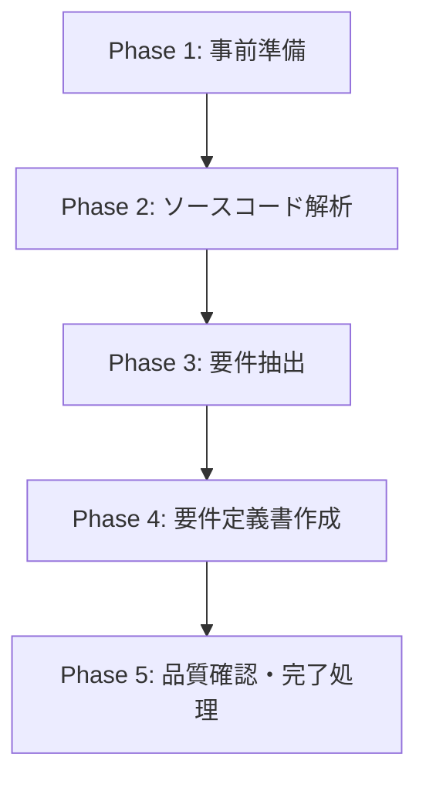
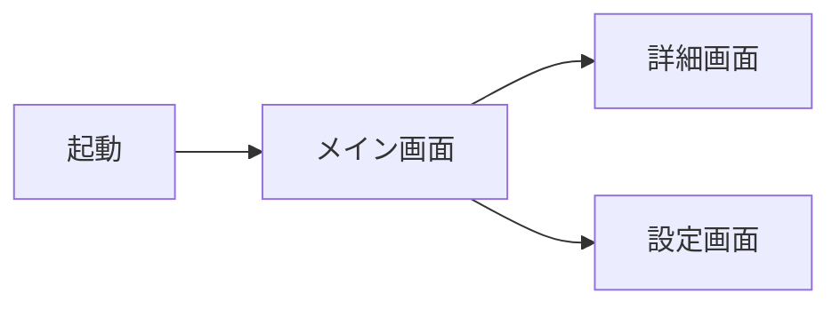

# 要件定義書作成ワークフロー（既存アプリ解析版）

## 必須参照文書 [MANDATORY]

**NEVER skip.** 下記を全て読み込み、深く理解すること

- **`${CLAUDE_PLUGIN_ROOT}/docs/spec_format.md`** — ID 分類カタログ（使用する ID をここから選択）
- **`${CLAUDE_PLUGIN_ROOT}/docs/requirement_format.md`** — 要件定義書テンプレート
- **`${CLAUDE_PLUGIN_ROOT}/docs/spec_design_boundary_spec.md`** — 要件・設計の境界ガイド（What/How の判断基準）

## 目的

**既存アプリのソースコードが存在する場合、ソースコードから要件を抽出し、要件定義書を作成する**

- **機能は保持、デザインは刷新**が基本方針（変更可能）
- 既存デザインの完全複製は目的ではない

## 実行フロー概要



---

## Phase 1: 事前準備

### 1.1 ユーザーへの確認 [MANDATORY]

以下を AskUserQuestion で確認してから要件定義を開始すること:

| 確認項目 | 内容 | デフォルト値 |
|---------|------|------------|
| デザイン方針 | デザインを刷新するか保持するか | 刷新 |
| 既存ソースコード | 解析対象のソースコードパス | ユーザーが指定 |

### 1.2 ルール文書・既存仕様の取得 [MANDATORY]

1. **`/doc-advisor:query-rules`** でルール文書を特定（利用可能な場合）
   - タスク内容: 既存アプリ解析による要件定義書作成
   - Skill 利用不可の場合は Glob で `docs/rules/` を探索

2. **`/doc-advisor:query-specs`** で既存要件定義書を確認（利用可能な場合）
   - タスク内容: 既存アプリ解析による要件定義書作成
   - Skill 利用不可の場合は Glob で specs 配下を探索

3. 返却された文書を全文読み込み

**Skill 失敗時**: エラー内容をユーザーに報告し、指示を待つ

### 1.3 コンテキスト収集 agent の起動

Agent ツールで以下を**並列起動**する。各 agent には `${CLAUDE_PLUGIN_ROOT}/docs/context_gathering_spec.md` のパスと `session_dir` を渡す。

**rules agent**:

```yaml
session_dir: {session_dir}
spec: ${CLAUDE_PLUGIN_ROOT}/docs/context_gathering_spec.md
tasks:
  - 実装ルール調査
feature: "{feature}"
skill_type: "要件定義書作成"
```

**code agent**:

```yaml
session_dir: {session_dir}
spec: ${CLAUDE_PLUGIN_ROOT}/docs/context_gathering_spec.md
tasks:
  - 既存コード調査
feature: "{feature}"
skill_type: "要件定義書作成"
target_description: "{ソースコードのパス}"
```

### 1.4 収集結果の確認

全 agent 完了後、`{session_dir}/refs/` 内のファイルを Read し表示する（5件以下は全件、6件以上は先頭3件+省略）。

**失敗時の扱い**:
- agent がエラー終了 → 該当カテゴリの refs/ ファイルなしで後続工程に進む
- agent が空結果 → 正常扱い

---

## Phase 2: ソースコード解析 [MANDATORY]

### 2.1 プロジェクト構造の把握

`{session_dir}/refs/code.yaml` を Read し、収集済みのソースコード一覧を起点に解析する:

- refs/code.yaml に記載されたファイルを Read して全体構造を把握
- プロジェクト構造の把握（ディレクトリ構成）
- 必要に応じて追加の Grep/Glob 探索で補完

### 2.2 画面・コンポーネントの解析

- View/画面クラスの列挙
- ナビゲーション構造の特定
- 画面遷移マップの作成



### 2.3 デザイン要素の扱い

- **デザイン刷新の場合**: 機能要件のみを抽出（見た目は無視）
- **デザイン保持の場合**: キャプチャー画像があれば解析し、THEME-xxx 要件定義書を作成

---

## Phase 3: 要件抽出 [MANDATORY]

### 3.1 要件抽出の優先順位

以下の順番で要件を抽出すること:

1. **APP-001（アプリ全体概要）**: 目的と主要機能
2. **画面要件（SCR-xxx）**: メイン画面から順に抽出
3. **機能要件（FNC-xxx）**: 複数画面にまたがる機能
4. **ビジネスロジック（BL-xxx）**: データ処理ロジック、業務ルール
5. **データ要件（DM-xxx）**: エンティティ定義、保存データ
6. **その他**: CMP, NAV, API, EXT, NFR, SEC, ERR — 必要に応じて

### 3.2 機能抽出の実践手順 [MANDATORY]

#### ユーザーアクションの特定

ソースコードからボタンタップ、ジェスチャー、入力操作等を検出し、要件化する。

```
例: @IBAction func saveButtonTapped() { ... }
→ 要件化: 「保存ボタンをタップするとデータを保存する」
```

#### 条件分岐の要件化

分岐ロジックを What として記述する（How は記載しない）。

```
例: if items.count > 1 { showSelection() } else { directAction() }
→ 要件化: 「アイテムが複数ある場合は選択画面を表示、1つの場合は直接実行」
```

#### データ永続化の特定

保存先・内容を特定する。

```
例: UserDefaults.standard.set(sortType, forKey: "sortType")
→ 要件化: 「ソート設定を保存し、次回起動時も維持する」
```

#### エラーハンドリングの抽出

```
例: catch { showAlert("データへのアクセスが拒否されました") }
→ 要件化: 「データアクセス拒否時にエラーメッセージを表示」
```

### 3.3 機能抽出チェックリスト [MANDATORY]

各画面/機能に対して以下を確認:

- [ ] ユーザーアクション（ボタン、入力、ジェスチャー）
- [ ] UI 要素（表示、入力、選択）
- [ ] データ処理（取得、作成、更新、削除、検索）
- [ ] 画面遷移（条件、モーダル、戻る処理）
- [ ] 業務ルール（バリデーション、制約、自動処理）
- [ ] 外部連携（API、システム機能、外部アプリ）

---

## Phase 4: 要件定義書作成

### 4.1 作成順序 [MANDATORY]

1. **APP-001** — アプリ全体概要
2. **画面要件（SCR-xxx）** — メイン画面から順に
3. **その他の要件** — FNC, BL, DM, CMP 等

### 4.2 記載原則 [MANDATORY]

- **What に集中**: 「何を実現するか」のみ記載
- **How は記載しない**: 実装方法は設計書の責務
- **判断基準**: 「ユーザーマニュアルに書くか？」→ Yes なら要件、No なら設計

### 4.3 グロッサリー作成 [MANDATORY]

抽出した要件で使用する用語を定義・整理する。

---

## Phase 5: 品質確認・完了処理

### 5.1 品質チェック [MANDATORY]

**必須ファイルの存在確認**:
- [ ] APP-001（アプリ全体概要）が存在する
- [ ] 全画面の SCR-xxx 要件定義書が存在する
- [ ] 主要機能の FNC-xxx 要件定義書が存在する

**内容の完全性確認**:
- [ ] 全てのユーザーアクションが記載されている
- [ ] 全ての画面遷移が明確である
- [ ] エラー処理が定義されている

**品質基準の確認**:
- [ ] 実装方法（クラス名等）が含まれていない
- [ ] 曖昧な表現がない
- [ ] 要件 ID による相互参照が正しい

### 5.2 AI レビュー実施 [MANDATORY]

```
/forge:review requirement {作成ファイルパス} --auto
```

対象はこのワークフローで作成・変更したファイル（差分）のみ。

### 5.3 specs ToC 更新

`/doc-advisor:create-specs-index` が利用可能であれば実行する。

### 5.4 commit/push 確認

`/anvil:commit` を実行して commit/push を確認する。

### 5.5 セッション削除

```bash
rm -rf {session_dir}
```

### 5.6 完了案内

```
要件定義書を作成しました:
  → {作成ファイルパス}

次のステップ:
  /forge:start-design {feature}    # 設計書作成へ進む
```
