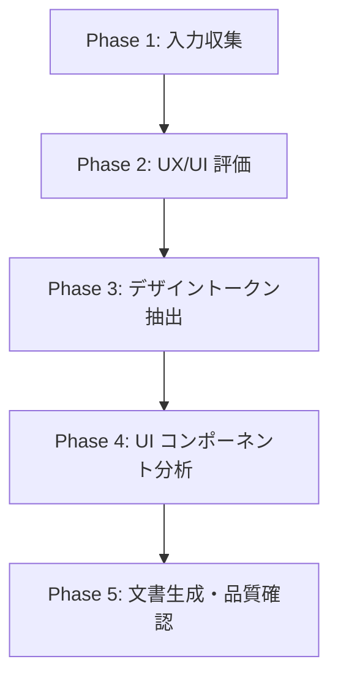

# UX/UI デザイン分析ワークフロー

## 必須参照文書 [MANDATORY]

**NEVER skip.** SKILL.md で読み込み済みの知識ベース（`apple_design_principles.md` + プラットフォームガイド）を深く理解した上でワークフローを実行する。

追加で以下を読み込む:

- **`${CLAUDE_PLUGIN_ROOT}/docs/spec_format.md`** — ID 分類カタログ（THEME-xxx / CMP-xxx の ID 体系）
- **`${CLAUDE_PLUGIN_ROOT}/skills/start-uxui-design/docs/design_token_template.md`** — デザイントークン出力テンプレート
- **`${CLAUDE_PLUGIN_ROOT}/skills/start-uxui-design/docs/component_catalog_template.md`** — コンポーネント一覧出力テンプレート

## 実行フロー概要



---

## Phase 1: 入力収集

### 1.1 入力ソースの選択 [MANDATORY]

AskUserQuestion を使用して入力ソースを確認する:

```
デザインの入力方法を選択してください:
1. 画像ファイル   — スクリーンショットや画像ファイル（PNG/JPG 等）のパスを指定
2. Figma         — Figma MCP 経由でデザインデータを取得（Figma MCP 必須）
3. URL           — Web ページやデザインギャラリーの URL を指定
4. 手動記述      — デザインの特徴を言葉で説明する
```

### 1.2 デザインの取得

入力ソースに応じて取得方法を分岐する:

#### 画像ファイルの場合

1. AskUserQuestion で画像ファイルのパスを確認する（複数指定可能）
2. Read ツールで画像を読み込む
3. AI のビジョン能力で画面構成を分析する

**重要**: 画像からの分析は推定値を含む。抽出した値は必ずユーザーに確認を取ること。

#### Figma の場合

1. 利用可能なツール一覧に `mcp__figma` 等が存在するか確認する
   - **利用不可** → エラーメッセージを表示:
     ```
     Error: Figma MCP が必要です。
     画像ファイルまたは URL モードを使用してください。
     ```
2. AskUserQuestion で Figma ファイルの URL を確認する
3. Figma MCP 経由でデザインデータを取得する

#### URL の場合

1. AskUserQuestion で URL を確認する（複数指定可能）
2. WebFetch でページ内容を取得する
3. 画像が含まれていれば分析に使用する
4. 画像が取得できない場合は、ユーザーにスクリーンショットの提供を依頼する

#### 手動記述の場合

1. AskUserQuestion でデザインの特徴を詳しく記述してもらう:
   ```
   デザインの特徴を教えてください:
   □ 全体のカラースキーム（ベースカラー、アクセントカラー等）
   □ フォントの種類やサイズ感
   □ レイアウトの構成（画面数、ナビゲーション構造等）
   □ 主要な UI コンポーネント
   □ 参考にしたアプリやデザインスタイル
   ```

### 1.3 アプリ概要のヒアリング [MANDATORY]

入力ソースに関わらず、以下を AskUserQuestion で確認する:

```
アプリの概要を教えてください:
□ アプリの目的・対象ユーザー（1-2 文で）
□ 主要な機能は何ですか？（3-5 個）
□ デザインで特にこだわっている点はありますか？
```

### 1.4 ルール文書・既存仕様の取得 [MANDATORY]

1. **`/doc-advisor:query-rules`** でルール文書を特定（利用可能な場合）
   - タスク内容: UX/UI デザイン分析・デザイントークン抽出
   - Skill 利用不可の場合は Glob で `docs/rules/` を探索

2. **`/doc-advisor:query-specs`** で既存要件定義書・設計書を確認（利用可能な場合）
   - タスク内容: UX/UI デザイン分析
   - Skill 利用不可の場合は Glob で specs 配下を探索

3. 返却された文書を全文読み込み

**Skill 失敗時**: エラー内容をユーザーに報告し、指示を待つ

---

## Phase 2: UX/UI 評価

知識ベースに基づき、取得したデザインを多角的に評価する。このフェーズの目的は**デザインの強み・弱みを把握**し、後続のトークン抽出・コンポーネント分析の方針を決めること。

### 2.1 Apple HIG 4 原則への適合度

`apple_design_principles.md` のセクション 1 に基づき、以下を評価する:

| 原則 | 評価観点 |
|------|---------|
| Clarity | 画面の目的が一目で分かるか。テキストの可読性は十分か |
| Deference | UI がコンテンツより目立っていないか。装飾過多ではないか |
| Depth | レイヤー・階層が視覚的に表現されているか |
| Consistency | 標準パターンを適切に使用しているか |

### 2.2 Nielsen ヒューリスティクス評価

`apple_design_principles.md` のセクション 5 に基づき、10 項目を評価する。違反が検出された場合は重要度を付与:

| 重要度 | 基準 |
|--------|------|
| Critical | ユーザーがタスクを完了できない |
| Major | 重大な混乱・遅延を引き起こす |
| Minor | 軽微な不便。改善推奨 |

### 2.3 ゲシュタルト原則の活用状況

`apple_design_principles.md` のセクション 6 に基づき、視覚的組織化を評価する:

- 近接: 関連要素のグループ化が適切か
- 類似: 同種の要素が視覚的に統一されているか
- 階層: 情報の優先度が視覚的に明確か
- 共通領域: セクション・カードの区切りが効果的か

### 2.4 アクセシビリティ評価

- コントラスト比（推定値。画像分析の場合は目視ベース）
- ターゲットサイズ（iOS: 44pt / macOS: 20pt）
- 色のみに依存した情報伝達がないか

### 2.5 プラットフォーム固有の評価

プラットフォームガイドの評価チェックリストに基づき、プラットフォーム固有の要件を確認する。

### 2.6 評価サマリーの提示 [MANDATORY]

評価結果をユーザーに提示する:

```markdown
## UX/UI 評価サマリー

### 強み
- {デザインの優れている点を 3-5 個}

### 改善提案
- {改善すべき点を重要度順に 3-5 個}

### HIG 適合度: {高 / 中 / 低}
### アクセシビリティ: {良好 / 要改善 / 不十分}
```

AskUserQuestion で確認: 「評価内容に同意しますか？追加のコメントはありますか？」

---

## Phase 3: デザイントークン抽出

### 3.1 第1層: 原子的な値の抽出

デザインから以下の原子的な値を抽出する:

#### Colors

- 使用されている全色を HEX 値で抽出
- 背景色・テキスト色・アクセント色・ステータス色を分類
- 画像分析の場合は推定値である旨を明記

#### Typography

- フォントファミリー（SF Pro / カスタムフォント）
- サイズバリエーション（見出し / 本文 / キャプション等）
- ウェイト（Regular / Medium / Semibold / Bold 等）
- 行高（推定値）

#### Spacing

- マージン（画面端）
- パディング（カード内 / セクション内）
- 要素間の距離
- 8pt グリッドへの準拠度を確認

#### Radius

- ボーダー半径のバリエーション
- カード / ボタン / 入力フィールド等の角丸

#### Shadows

- シャドウスタイル（オフセット / ブラー / 色）
- 使用箇所（カード / モーダル / FAB 等）

### 3.2 第2層: セマンティックなテーマ定義

第1層の値を意味のあるトークン名にマッピングする:

- **Status 色**: success / warning / error / info
- **Button 色**: primary / secondary / tertiary / destructive
- **Text 色**: primary / secondary / tertiary / disabled
- **Surface 色**: background / card / overlay / grouped
- **Typography**: largeTitle / title / headline / body / caption
- **Layout**: spacing.xs / sm / md / lg / xl / xxl

### 3.3 Light / Dark モード考慮

- 提供されたデザインがどちらのモードか判定する
- 対向モードのバリエーションを提案する（推定値として）
- セマンティックカラーの両モード対応を確認する

### 3.4 トークン品質検証 [MANDATORY]

知識ベースに基づき、抽出したトークンの品質を検証する:

- [ ] コントラスト比: テキスト色と背景色の組み合わせが 4.5:1 以上か
- [ ] スペーシング: 8pt グリッドに準拠しているか
- [ ] タイポグラフィ: SF フォント体系に従っているか（カスタムフォントの場合はその旨記載）
- [ ] カラーパレット: 色数が過剰でないか（推奨: 5-8 色 + ステータス色）
- [ ] セマンティック命名: 意味のある名前が付けられているか

### 3.5 ユーザー確認 [MANDATORY]

抽出したデザイントークンの一覧を提示し、AskUserQuestion で確認する:

```
抽出したデザイントークンを確認してください:
- Colors: {色数} 色（primary: #XXXX, secondary: #XXXX, ...）
- Typography: {バリエーション数} スタイル
- Spacing: {スケール}
- Radius: {バリエーション数} パターン

修正が必要な項目はありますか？
```

---

## Phase 4: UI コンポーネント分析

### 4.1 コンポーネントの特定

デザインから再利用可能な UI コンポーネントを特定する。プラットフォームガイドの標準コンポーネント一覧と照合する。

#### 特定の手順

1. 画面内の反復パターンを検出する
2. HIG 標準コンポーネントとの対応を確認する
3. カスタムコンポーネント（標準にないもの）を特定する
4. 各コンポーネントに画面固有の名前を付ける（一般名ではなく）

#### 命名規則

- **HIG 標準コンポーネント**: HIG の名前を使用（例: NavigationBar, TabBar）
- **カスタムコンポーネント**: 画面固有の具体的な名前を使用
  - ❌ 一般的: 「Card」「List」「Header」
  - ✅ 具体的: 「ProductDetailCard」「OrderHistoryList」「CafeMenuHeader」

### 4.2 状態・プロパティの定義

各コンポーネントについて以下を定義する:

#### 共通（iOS / macOS）

| 項目 | 内容 |
|------|------|
| 名前 | 画面固有の具体的な名前 |
| 役割 | コンポーネントの目的（1 文） |
| HIG 対応 | 対応する HIG 標準コンポーネント名（あれば） |
| 使用デザイントークン | 使用する色・フォント・スペーシング等のトークン参照 |

#### iOS 固有の状態

| 状態 | 説明 |
|------|------|
| Default | 通常表示 |
| Pressed | タッチ中 |
| Disabled | 無効化 |
| Loading | 読み込み中 |
| Selected | 選択中 |

#### macOS 固有の状態

| 状態 | 説明 |
|------|------|
| Default | 通常表示 |
| Hover | マウスオーバー |
| Pressed | クリック中 |
| Disabled | 無効化 |
| Focused | キーボードフォーカス |
| Selected | 選択中 |

### 4.3 HIG 推奨コンポーネントとの対応付け

各コンポーネントについて、HIG で推奨されている標準コンポーネントとの関係を記載する:

- **完全一致**: HIG 標準コンポーネントをそのまま使用
- **カスタマイズ**: 標準コンポーネントをベースにカスタマイズ
- **独自**: HIG 標準に該当なし。独自実装が必要

### 4.4 UX ノートの付与

各コンポーネントに知識ベースに基づく UX コメントを付与する:

- **HIG 準拠**: HIG のどの原則に沿っているか
- **ヒューリスティクス**: Nielsen の何番に対応するか
- **改善提案**: より良い UX のための提案（あれば）

### 4.5 ユーザー確認 [MANDATORY]

特定したコンポーネント一覧を提示し、AskUserQuestion で確認する:

```
特定した UI コンポーネント:
- 標準コンポーネント: {数} 個
- カスタムコンポーネント: {数} 個

過不足はありませんか？追加・削除するコンポーネントはありますか？
```

---

## Phase 5: 文書生成・品質確認

### 5.1 文書ファイルの生成

テンプレートに従い、以下のファイルを生成する:

1. **デザイントークン文書** (`THEME-001_{feature}_design_tokens.md`)
   - テンプレート: `design_token_template.md`
   - Phase 3 の抽出結果を構造化

2. **UI コンポーネント一覧文書** (`CMP-001_{feature}_components.md`)
   - テンプレート: `component_catalog_template.md`
   - Phase 4 の分析結果を構造化

3. **UX 評価サマリー** (`UXEVAL-001_{feature}_ux_evaluation.md`)
   - Phase 2 の評価結果をまとめた文書

**出力先**: session.yaml の `output_dir`

### 5.2 AI レビュー実施 [MANDATORY]

```
/forge:review uxui {作成ファイルパス} --auto
```

対象はこのワークフローで作成・変更したファイル（差分）のみ。

### 5.3 specs ToC 更新

`/doc-advisor:create-specs-toc` が利用可能であれば実行する。

### 5.4 commit/push 確認

`/anvil:commit` を実行して commit/push を確認する。

### 5.5 セッション削除

```bash
rm -rf {session_dir}
```

### 5.6 完了案内

```
UX/UI デザイン分析が完了しました:
  → デザイントークン:     {THEME ファイルパス}
  → コンポーネント一覧:   {CMP ファイルパス}
  → UX 評価サマリー:      {UXEVAL ファイルパス}

次のステップ:
  /forge:start-requirements {feature}    # 要件定義書作成へ進む
  /forge:start-design {feature}          # 設計書作成へ進む
```

---

## 対話の基本原則 [MANDATORY]

### 1. 選択肢ファースト

```
❌ 悪い例: 「どうしますか？」
✅ 良い例: 「A、B、C のどれが近いですか？」
```

### 2. 視覚的確認

抽出結果はテーブル・カラーパレット表現・ASCII 図で視覚的に提示する。

### 3. 推定値の明示

画像分析の場合、抽出値は推定であることを明示する:

```
⚠ 画像からの推定値です。正確な値は Figma やデザインファイルで確認してください。
```

### 4. UX 根拠の提示

改善提案には必ず知識ベースからの根拠を添える:

```
✅ 良い例: 「タッチターゲットが 32pt で HIG 推奨の 44pt を下回っています（ios_platform_guide セクション 1.1）」
❌ 悪い例: 「ボタンが小さいです」
```

### 5. 段階的な提示

全ての分析結果を一度に提示しない。Phase ごとにユーザー確認を挟む。

---

## アンチパターン [MANDATORY]

| パターン | 問題 | 対策 |
|---------|------|------|
| **根拠なき批判** | 説得力がない | 必ず HIG / Nielsen / Gestalt を引用 |
| **完璧主義** | 進まない | 推定値を許容し後で修正 |
| **プラットフォーム混同** | iOS に macOS のパターンを適用 | プラットフォームガイドを厳守 |
| **主観的な色評価** | 再現性がない | HEX 値・コントラスト比で客観評価 |
| **過剰な指摘** | ユーザーが疲弊 | 重要度順に 5-10 件に絞る |
| **一般名の使用** | 曖昧 | コンポーネント名は画面固有の具体名 |
