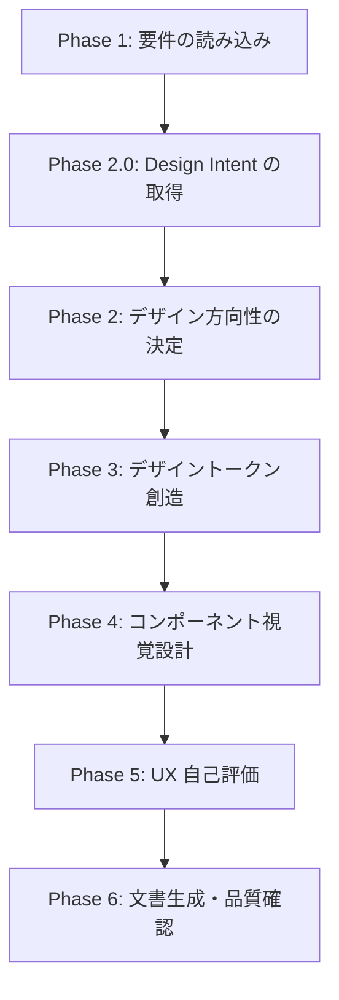

# UX/UI デザイン創造ワークフロー

## 本スキルの位置づけ

```
start-requirements → start-uxui-design → start-design → start-plan → start-implement
 (何を作るか)          (どう見せるか)       (どう作るか)     (いつ作るか)   (作る)
```

**入力**: 要件定義書（ASCII アート付きの画面仕様）
**出力**: デザイントークン（THEME-xxx）+ コンポーネント視覚仕様（CMP-xxx）+ UX 評価（UXEVAL-xxx）

> **Figma デザインがある場合**: UX/UI デザインはデザイナーにより完了済みと見なす。
> `/forge:start-requirements {feature} --mode from-figma` で要件抽出に進む。
> Figma デザインの UX 品質を検証したい場合は `/forge:review uxui` を使用する。

## コンテキスト管理 [MANDATORY]

知識ベースは **`/forge:query-forge-rules`** 経由で Phase 別に取得する。全ファイルを一括読み込みしない。
サブエージェントは使用しない（Phase 2 で選択した哲学的立場を全 Phase で参照するため）。

### 常駐（SKILL.md で読み込み済み — 全 Phase で参照）

- **`design_philosophy.md`** — 統合フレームワーク（3 層モデル）。全てのデザイン判断の基盤。**常にコンテキスト内に保持する**

### Phase 別の知識取得（query-forge-rules 経由）

各 Phase の冒頭で `/forge:query-forge-rules` を呼び出し、タスクに関連する知識ベースを取得して Read する。

| Phase | query-forge-rules のタスク内容 |
|-------|-------------------------------|
| Phase 1 | 「ID 分類カタログ、仕様フォーマット」 |
| Phase 2-3 | 「HIG 原則、デザイン評価、色彩設計、タイポグラフィ」 |
| Phase 4 | 「{iOS/macOS} コンポーネント設計、プラットフォーム固有 UI パターン」 |
| Phase 6 | 「デザイントークン出力フォーマット、コンポーネント一覧テンプレート」 |

**`/forge:query-forge-rules` が利用不可の場合のフォールバック**: `${CLAUDE_PLUGIN_ROOT}/skills/start-uxui-design/docs/` 配下を Glob で探索し、Phase に必要なファイルを直接 Read する。

## 実行フロー概要



### Design Intent 駆動の分岐

Phase 2.0 で取得した Design Intent の内容により、以下の Phase は発動 or SKIP される:

| Design Intent の値 | 発動する Phase |
|-------------------|---------------|
| `distinctiveness.importance: 低` かつ `signature_required: 不要` | Phase 2.1 / 2.7 のみ（緊張軸・参照文化・provocation は SKIP） |
| `distinctiveness.importance: 高` または `signature_required: 必要` | Phase 2.2-2.5 / 2.7 をすべて実行、Phase 3.5 / 4.5 / 5.4 も実行 |
| `distinctiveness.importance: 中` | Phase 2.2（緊張軸）と 2.5（推奨案）は実行、2.3-2.4（参照文化・3 案発散）は簡略化可 |

モード（stable/bold）という二値ラベルを持たず、Design Intent から自然に挙動が分岐する。

---

## Phase 1: 要件の読み込み

### 1.1 要件定義書の取得 [MANDATORY]

要件定義書が主要入力である。以下の手順で取得する:

1. **Feature 名から要件定義書を探す**:
   - `.doc_structure.yaml` のパス解決結果を使い、Feature ディレクトリ内の要件定義書を Glob で探索
   - `SCR-xxx`（画面仕様）、`CMP-xxx`（コンポーネント）、`FNC-xxx`（機能要件）、`THEME-xxx`（既存トークン）を収集

2. **要件定義書が見つからない場合**:
   ```
   要件定義書が見つかりません。
   /forge:start-requirements {feature} で要件定義書を先に作成してください。
   ```
   → スキルを終了する

3. **要件定義書を全文読み込む**

### 1.2 要件からの情報整理 [MANDATORY]

読み込んだ要件定義書から以下を整理する:

| 整理項目 | ソース |
|----------|--------|
| アプリの目的・対象ユーザー | 要件定義書の概要セクション |
| 画面構成と遷移 | SCR-xxx の一覧 |
| 各画面の ASCII アートレイアウト | SCR-xxx 内の配置図 |
| 特定済みコンポーネント | CMP-xxx の一覧 |
| 機能要件 | FNC-xxx の一覧 |

### 1.3 参考デザインの収集（任意）

2 つの入力源を確認する:

1. **参照画像ディレクトリ**: `{specs_root}/{feature}/requirements/uxui_references/` の存在を確認
   - 存在する場合、`competitors/` と `inspirations/` の画像を Phase 2.0 の Design Intent 推定材料として使用（Read ツールで画像を読み込む）
   - Phase 5.4 の拡張指標（競合類似度・インスピレーション整合性）でも再利用
2. **参考デザインの追加入力**: AskUserQuestion で補足の参照を尋ねる
   ```
   追加の参照デザインはありますか？（任意）
   1. 参考画像あり  — スクリーンショットやデザイン画像のパスを指定
   2. 参考 URL あり — Web ページや Dribbble 等の URL を指定
   3. 追加なし      — 既存の参照画像ディレクトリ or 要件定義書のみで進める
   ```

参考デザインがある場合:

- **画像**: Read ツールで読み込み、カラーパレット・レイアウト・雰囲気を分析
- **URL**: WebFetch でページ取得、デザイン要素を分析

参考デザインは「Design Intent の手がかり」として使用する。逆解析やトークン抽出の対象ではない。

### 1.4 ルール文書の取得 [MANDATORY]

1. **`/doc-advisor:query-rules`** でルール文書を特定（利用可能な場合）
   - タスク内容: UX/UI デザイン創造・デザイントークン設計
   - Skill 利用不可の場合は Glob で `docs/rules/` を探索

2. 返却された文書を全文読み込み

**Skill 失敗時**: エラー内容をユーザーに報告し、指示を待つ

---

## Phase 2.0: Design Intent の取得 [MANDATORY]

Phase 2 以降の挙動を決める基盤情報として **Design Intent** を確定する。モード抽象（stable/bold 等）は持たず、ここで取得した構造化情報から Phase 2.2 以降・Phase 3.5 / 4.5 / 5.4 の発動を自然に分岐する。

### 2.0.1 取得優先順 [MANDATORY]

以下の順で探索し、最初に有効な情報が得られた段階で採用する:

1. **要件定義書本文に Design Intent 相当の記述があるか確認**
   - `## Design Intent` 見出し、または「デザイン意図 / デザイン方向性 / ブランド / 差別化 / 署名要素 / 避けたい表現」等のキーワードを含むセクションを検索
   - 見つかればそれを構造化して採用
2. **既存コードのスタイルを参照できるか確認**
   - プロジェクト内に既存 UI 実装や既存デザイントークンがあれば、そのスタイル傾向を読み取る
   - 既存方向性と整合する Design Intent を推定
3. **要件本文から AI が Design Intent を推定**
   - 1-2 で情報が得られなければ、アプリ概要・対象ユーザー・ドメインから推定
4. いずれのケースでも、**確定前に AskUserQuestion で確認・修正を取る**

### 2.0.2 取得する構造 [MANDATORY]

```yaml
design_intent:
  user_experience: "ユーザーに感じてほしい体験（1-2 文）"
  tension_axis: "精密さ × 親しみやすさ"  # 任意。未記入時は Phase 2.2 で導出
  distinctiveness:
    importance: "高 / 中 / 低"
    reason: "その重要度を選んだ理由（競合状況・ブランド戦略・ユーザー層）"
  references:
    competitors: []     # アプリ名 + 参考/回避ポイント（任意）
    cultural: []        # 建築/工業製品/エディトリアル等（任意）
    specific_works: []  # 作者・モデル名・年代（ステレオタイプ検出用、任意）
  anti_goals: []        # 避けたい表現 + 理由（任意）
  signature_required: "必要 / 任意 / 不要"
```

### 2.0.3 ユーザー確認 [MANDATORY]

AI が推定または読み取りした Design Intent を構造化して提示し、AskUserQuestion で確認:

```
以下の内容でデザインを進めます:

  ユーザー体験:         {user_experience}
  ブランド緊張軸:       {tension_axis or 「未指定 — Phase 2.2 で導出」}
  差別化の重要度:       {importance}（理由: {reason}）
  参照（競合）:         {competitors or 「未指定」}
  参照文化:             {cultural or 「未指定」}
  避けたい表現:         {anti_goals or 「未指定」}
  署名要素の必要性:     {signature_required}

  この内容で進めますか？修正が必要ですか？
```

### 2.0.4 確定結果の保持 [MANDATORY]

確定した Design Intent は以下に保持する:

- セッションディレクトリ: `{session_dir}/design_intent.yaml` として保存
- 要件定義書への任意追記: ユーザーが望む場合のみ、要件定義書末尾に `## Design Intent` 節として追記（AskUserQuestion で確認）
- **プロジェクトルートに config ファイルは作らない**（モード概念撤回のため）

### 2.0.5 参照画像ディレクトリの扱い（任意）

- `{specs_root}/{feature}/requirements/uxui_references/` が存在する場合、`competitors/` と `inspirations/` のサブディレクトリを検出して Phase 5.4 の拡張指標で画像比較に使用
- 存在しない場合でも Phase 2.0 は通過する。新規作成は **行わない**（参照画像の配置はユーザー判断）

---

## Phase 2: デザイン方向性の決定

Phase 2.0 で取得した Design Intent を具体化する。`distinctiveness.importance` と `signature_required` により Phase 2.2-2.5 の発動条件が変わる。

### 2.1 アプリの性格分析

要件定義書のアプリ概要・対象ユーザーから、アプリの「性格」を導き出す:

| 性格タイプ | 特徴 | デザイン傾向 |
|-----------|------|-------------|
| 温かい・親しみやすい | SNS、ヘルスケア、子供向け | 丸み大、暖色系、柔らかい影 |
| モダン・洗練 | EC、ライフスタイル、フード | バランスの取れた丸み、クリーンなタイポグラフィ |
| 精密・プロフェッショナル | 金融、生産性、ビジネス | 直線的、寒色系、タイトなスペーシング |
| 大胆・エネルギッシュ | ゲーム、フィットネス、音楽 | 高コントラスト、大胆なアクセント色、ダイナミックなレイアウト |

### 2.2 ブランドの緊張軸を定義

**発動条件**: Design Intent の `distinctiveness.importance` が `中` or `高`、または `tension_axis` が未指定。`低` かつ `tension_axis` 指定済みなら SKIP。

Design Intent の `tension_axis` が既に記入されていればそれをそのまま採用し、本節は確認のみで通過する。未指定の場合は、アプリの性格を単一ラベルで終わらせず、**両立したい 2 軸の緊張**を定義する。

例:

- 静けさ × 緊張感
- 高級感 × 親しみやすさ
- 精密さ × 有機性
- 未来感 × 信頼感

出力形式:

```markdown
ブランドの緊張:
  主軸: {A} × {B}
  ねらい: {この緊張がユーザー体験にどう効くか}
  逸脱すると何が起きるか:
    - A に寄りすぎると: {リスク}
    - B に寄りすぎると: {リスク}
```

この緊張軸は以降の Phase で判断基準として常に参照する。

### 2.3 参照文化の収集

**発動条件**: Design Intent の `distinctiveness.importance` が `高`、または `signature_required: 必要`。それ以外は SKIP（`references` 指定済みならそれをそのまま採用）。

Design Intent の `references.cultural` と `references.specific_works` が既に記入されていればそれを採用。未指定の場合、既存の UI ギャラリーに寄せるのではなく、**UI 以外の参照元**からムードを抽出する。最低 3 つ、できれば異業種から選ぶ。

優先順位:

1. 建築
2. 工業製品
3. エディトリアル / 雑誌
4. 映画ポスター / タイトルデザイン
5. パッケージ / サイン計画

各参照について記録する（作者・モデル名・年代があれば明記 — 後段のステレオタイプ検出に使用）:

| 参照元 | 抽出する要素 | UI に翻訳する規則 | 具体作品（作者・モデル・年代） |
|-------|-------------|------------------|-------------------------|
| {例: Braun オーディオ} | {例: 厳密な整列、抑制された色} | {例: 1px ラインと低彩度ベースで構成} | {例: Dieter Rams / TP1 / 1959} |

**ステレオタイプ検出**: 具体作品の記入がない、または通称レベル（「日本建築」「北欧モダン」等）の記述しかない場合、AI は参照として弱いと判定し、AskUserQuestion で具体化を促す。

### 2.4 デザイン provocation の生成

**発動条件**: Design Intent の `distinctiveness.importance` が `高`、または `signature_required: 必要`。`中` なら簡略化（2 案で可）、`低` かつ `signature_required: 不要` なら SKIP。

**収束の前に必ず 3 方向へ発散する（`高` の場合）。**
各案は互いに十分に異なり、同じ配色・同じレイアウト思想に収束してはならない。

各 provocation に含める項目:

- 名前: 一言で雰囲気が伝わるタイトル
- 世界観: 2-3 文
- ブランドの緊張との接続: その案が 2 軸をどう両立するか
- 参照文化: Phase 2.3 のどれを主参照にするか
- 視覚ルール: 色・タイポ・余白・レイアウトの基調
- 署名要素: この案を一発で識別できる特徴を 1 つ
- 禁止事項: この案で絶対に避ける表現を 3 つ

出力フォーマット:

```markdown
Provocation A: {名前}
  世界観:
  主参照:
  視覚ルール:
  署名要素:
  禁止事項:
    - {凡庸化しやすい表現}
    - {競合と似る表現}
    - {ブランド緊張を壊す表現}
```

### 2.5 デザイン方向性の提案

**発動条件**: Phase 2.4 を実行した場合のみ。SKIP 時は Phase 2.1 の性格分析結果をそのまま確定方向性とする。

Phase 2.4 の複数案から、**推奨案 1 つ + 保留案 1 つ**を選ぶ。単に「好きそう」ではなく、Design Intent（要件・ブランドの緊張・差別化可能性）で選ぶ。

```
推奨案: {Provocation X}
理由:
  - {ブランドの緊張との整合}
  - {競合との差別化}
  - {実装難易度が許容範囲}

保留案: {Provocation Y}
理由:
  - {別方向の魅力}
```

AskUserQuestion では「どれが好みか」ではなく、**どの緊張感がこのプロダクトらしいか** を選んでもらう。参考デザインが提供されている場合でも、参照文化と Design Intent の `anti_goals` を上書きしない。

### 2.6 方向性の確定 [MANDATORY]

決定したデザイン方向性のサマリーを提示し、ユーザーの承認を得る。カラーの方向性（60-30-10 ルール: `design_philosophy.md` セクション 4.1）もここで合意する — 独立した「カラー方向性提案」節は設けず、Phase 2.4 provocation の視覚ルールと統合する。

```
デザイン方向性サマリー:
  選択案:       {Provocation 名 or 「Phase 2.1 の性格 + 標準」}
  緊張軸:       {A × B or 「未設定」}
  主参照:       {建築 / 工業製品 / エディトリアル / ...}
  カラー方向性: 基調色（60%）/ 補助色（30%）/ 強調色（10%）
  角丸:         {目安 pt}
  フォント:     {SF Pro / カスタム}
  グリッド:     8pt グリッド準拠
  署名要素:     {1文 or 「なし（signature_required: 不要）」}
  禁止事項:     {3件 or 「未指定」}

  この方向性でデザイントークンの作成に進みますか？
```

---

## Phase 3: デザイントークン創造

Phase 2 の方向性に基づき、具体的なデザイントークンの値を設計する。「分析・抽出」ではなく「創造・設計」である点を意識する。

### 3.1 カラーパレットの設計

#### Base Colors

60-30-10 ルールと Phase 2.6 で確定したカラー方向性に基づき、具体的な HEX 値を決定する。**Design Intent の `signature_required: 必要` が指定されている場合、Phase 2.4 で選んだ署名要素を弱める無難な配色へ戻してはならない。**

**設計の根拠を必ず明記する**:

```
✅ 良い例: primary: #007AFF — iOS 標準の System Blue。信頼性を表現（HIG セマンティックカラー準拠）
❌ 悪い例: primary: #007AFF — 青色
```

#### Semantic Colors

- **Status 色**: success / warning / error / info
- **Button 色**: primary / secondary / tertiary / destructive
- **Text 色**: primary / secondary / tertiary / disabled
- **Surface 色**: background / card / overlay / grouped

#### Light / Dark Mode

- 両モードの値を設計する（片方だけの設計は不可）
- Dark Mode は単に色を反転させるのではなく、コントラストと可読性を個別に調整する
- Dark Mode の背景は純黒（#000000）を避け、ダークグレー（#1C1C1E）系を使用（HIG 準拠）

### 3.2 タイポグラフィの設計

プラットフォームガイドのフォント体系に基づき、タイポグラフィスケールを設計する:

- フォントファミリー（SF Pro / カスタムフォント）
- サイズスケール（largeTitle → caption2）
- ウェイトの使い分け
- 行高（line height）

**視覚階層**（`design_philosophy.md` セクション 4.2）を意識する: サイズとウェイトの差で情報の優先順位を明確にする。

### 3.3 スペーシングの設計

8pt グリッド準拠のスペーシングスケールを設計する:

```
xs:  4pt  — 密接な関連要素間
sm:  8pt  — 同一グループ内の要素間
md:  16pt — 画面端マージン、セクション内パディング
lg:  24pt — セクション間
xl:  32pt — 大きなセクション区切り
xxl: 48pt — 主要セクション区切り
```

**余白の設計**（`design_philosophy.md` セクション 4.3）: 余白はアクティブなデザイン要素。窮屈なレイアウトを避ける。

### 3.4 角丸・シャドウの設計

Phase 2 で決定したアプリの性格に合わせて角丸値を設計する（`design_philosophy.md` セクション 4.4 参照）。

### 3.5 署名ルールのトークン化

**発動条件**: Design Intent の `signature_required` が `必要` or `任意`。`不要` なら SKIP。

選択した provocation の署名要素を、再利用可能なトークンまたは明文化されたレイアウト規則に落とす。以下はカテゴリの例 — この中から 1-2 個を選び、ブランドの核にする。

| カテゴリ | 例 |
|---------|-----|
| 余白 | 主要セクション上端は常に `spacing.xxl` を使う |
| 線 | 区切り線は 1px 高コントラストではなく低彩度 1px ライン |
| タイポ | ヒーロー見出しは `typography.display` で通常より 1 段階大きくする |
| 色 | アクセント色は CTA と選択状態に限定し、面塗りには使わない |
| アイコン | システム全体で単線 2pt の線画スタイルに統一（塗り潰しを使わない） |
| シャドウ | 全要素でシャドウなし、elevation は背景色差のみで表現 |
| グリッド | 画面上端から 2:1 の黄金比位置に主要 CTA を置く |
| モーション | 画面遷移は必ず 400ms のスプリングイージングを使う |
| アニメーション | ローディングは単色パルスではなく、ブランドカラーで描く波形を使う |
| イラスト | 写真は使わず、単色シルエットだけでビジュアル要素を構成 |

### 3.6 トークン品質検証 [MANDATORY]

`design_philosophy.md` セクション 6 のチェックリストに加え、以下を検証する:

- [ ] コントラスト比: テキスト色と背景色の組み合わせが 4.5:1 以上か
- [ ] スペーシング: 8pt グリッドに準拠しているか
- [ ] カラーパレット: 60-30-10 ルールに従っているか
- [ ] タイポグラフィ: 階層が明確か（サイズ × ウェイトの組み合わせ）
- [ ] 両モード: Light / Dark 両方の値が設計されているか
- [ ] セマンティック命名: 意味のある名前が付けられているか
- [ ] 各値の設計根拠が説明できるか
- [ ] （`signature_required` が `必要` の場合）署名要素がトークンまたは規則として再利用可能な形に落ちているか
- [ ] Design Intent の `anti_goals` に抵触する無難な値へ後退していないか

### 3.7 ユーザー確認 [MANDATORY]

作成したデザイントークンの一覧を視覚的に提示し、AskUserQuestion で確認する:

```
作成したデザイントークン:
  Colors:     {色数} 色（カラーパレット表を提示）
  Typography: {バリエーション数} スタイル
  Spacing:    {スケール}
  Radius:     {バリエーション数} パターン
  Shadows:    {パターン数} パターン

  修正が必要な項目はありますか？
```

---

## Phase 4: コンポーネント視覚設計

要件定義書の ASCII アートを「かっこいいデザイン」に変換する。Phase 3 のトークンを適用し、HIG 標準に準拠した視覚仕様を定義する。

### 4.1 ASCII アートからの変換

要件定義書（SCR-xxx）の ASCII アートレイアウトを読み、各要素に対して:

1. **HIG 標準コンポーネントとの対応付け**: プラットフォームガイドの標準コンポーネント一覧と照合
2. **デザイントークンの適用**: Phase 3 で作成したトークンをどこに使うか決定
3. **視覚仕様の具体化**: サイズ、色、フォント、スペーシングを具体値で定義
4. **署名要素の埋め込み**: 画面内のどこでブランド固有の視覚ルールを見せるか決める

#### 変換例

```
要件定義書の ASCII アート:
  ┌─────────────────────┐
  │  [戻る]  タイトル    │
  ├─────────────────────┤
  │  [商品画像]          │
  │  商品名              │
  │  価格                │
  │  [カートに追加]      │
  └─────────────────────┘

  ↓ 変換後の視覚仕様:

  NavigationBar:
    背景: surface.background (#FFFFFF)
    戻るボタン: system back chevron, color.primary (#007AFF)
    タイトル: typography.headline, Semibold 17pt, color.text.primary
  
  ProductImage:
    サイズ: 全幅, アスペクト比 4:3
    角丸: radius.lg (16pt)
    
  ProductName:
    フォント: typography.title2, Bold 22pt
    色: color.text.primary
    マージン上: spacing.md (16pt)
    
  Price:
    フォント: typography.title3, Semibold 20pt
    色: color.accent
    マージン上: spacing.sm (8pt)
    
  AddToCartButton:
    高さ: 50pt (タッチターゲット 44pt 以上)
    角丸: radius.md (12pt)
    背景: color.button.primary
    テキスト: typography.headline, Semibold 17pt, #FFFFFF
    マージン上: spacing.lg (24pt)
    マージン水平: spacing.md (16pt)
```

### 4.2 コンポーネントの命名

- **HIG 標準コンポーネント**: HIG の名前を使用（例: NavigationBar, TabBar）
- **カスタムコンポーネント**: 画面固有の具体的な名前を使用
  - ❌ 一般的: 「Card」「List」「Header」
  - ✅ 具体的: 「ProductDetailCard」「OrderHistoryList」「CafeMenuHeader」

### 4.3 状態・プロパティの定義

各コンポーネントについて、プラットフォーム固有の状態を定義する。

#### iOS 固有の状態

| 状態 | 説明 |
|------|------|
| Default | 通常表示 |
| Pressed | タッチ中 |
| Disabled | 無効化 |
| Loading | 読み込み中 |
| Selected | 選択中 |

#### macOS 固有の状態

| 状態 | 説明 |
|------|------|
| Default | 通常表示 |
| Hover | マウスオーバー |
| Pressed | クリック中 |
| Disabled | 無効化 |
| Focused | キーボードフォーカス |
| Selected | 選択中 |

### 4.4 UX ノートの付与

各コンポーネントに知識ベースに基づく UX コメントを付与する:

- **HIG 準拠**: HIG のどの原則に沿っているか
- **美学的根拠**: なぜこのデザインが「美しい」と言えるか（Norman / Rams / 研究を引用）
- **改善提案**: より良いデザインのための提案（あれば）

```
✅ 良い例: UX Note: AddToCartButton の角丸 12pt はバランス型の性格に適合（design_philosophy セクション 4.4）。
           50pt の高さは HIG 推奨 44pt を上回り十分なタッチターゲットを確保（ios_platform_guide セクション 1.1）。
           高彩度のアクセントカラーで CTA として視覚階層の最上位に位置づけ（design_philosophy セクション 4.2）。
❌ 悪い例: UX Note: ボタンは使いやすいサイズです。
```

### 4.5 署名要素の配置確認

**発動条件**: Design Intent の `signature_required` が `必要`。`任意 / 不要` なら SKIP。

各主要画面について、以下を確認する:

- 署名要素が最低 1 箇所は明確に存在するか
- その要素は CTA や可読性を損ねていないか
- 競合アプリの一般的 UI と見分けがつくか
- 単なる装飾ではなく、Design Intent の `tension_axis` を表現しているか

### 4.6 ユーザー確認 [MANDATORY]

設計したコンポーネント一覧を提示し、AskUserQuestion で確認する:

```
設計した UI コンポーネント:
  標準コンポーネント:   {数} 個
  カスタムコンポーネント: {数} 個

  過不足はありませんか？デザインの調整が必要な箇所はありますか？
```

---

## Phase 5: UX 自己評価

作成したデザインシステム全体を、知識ベースに基づき多角的に評価する。

### 5.1 Don Norman 3 層チェック

`design_philosophy.md` セクション 2 に基づく:

| レベル | 評価観点 | 判定 |
|--------|---------|------|
| Visceral | 第一印象で「美しい」と感じるか | ○ / △ / × |
| Behavioral | トークンが操作性を支えているか | ○ / △ / × |
| Reflective | アプリの目的・ユーザー像と一致しているか | ○ / △ / × |

### 5.2 Dieter Rams チェック

`design_philosophy.md` セクション 3 に基づき、特に重要な 4 原則を確認:

- [ ] **控えめである**: UI がコンテンツを邪魔していないか
- [ ] **理解しやすい**: 操作方法が自明か
- [ ] **細部まで徹底する**: アライメントとスペーシングが一貫しているか
- [ ] **最小限にする**: 不要な要素はないか

### 5.3 HIG / Nielsen / Gestalt チェック

`apple_design_principles.md` に基づく評価。Phase 2 のワークフロー（旧版）と同様の評価を、**創造したデザインに対して** 実施する。

### 5.4 Distinctiveness / Memorability チェック

**発動条件**: Design Intent の `distinctiveness.importance` が `中` or `高`、または `signature_required: 必要`。それ以外は SKIP（もしくは 🟢 提案レベルで軽く触れるのみ）。

AI が自動判定可能な指標で評価する。「5 秒ルック」「競合 5 つと並べて」は人間テスト前提のため使わない。

#### 基本指標（Design Intent を参照して判定）

| 観点 | AI 検証可能な判定基準 | 判定 |
|------|-----------------------|------|
| Distinctiveness | Design Intent に `signature_required: 必要` があるのに、署名要素が文書内に明文化されていない箇所はあるか / `anti_goals` にある表現を採用していないか | ○ / △ / × |
| Memorability | 署名要素が 2 種類以上のトークン（色・線・タイポ・余白・アイコン・シャドウ・グリッド・モーション等）にまたがっているか / 主要画面 3 つ以上で繰り返し現れるか | ○ / △ / × |
| Tension Integrity | Design Intent の `tension_axis` の両軸が画面で両立しているか（片側のみに倒れていないか） | ○ / △ / × |
| Anti-Goal Safety | Design Intent の `anti_goals` に反する視覚設計が残っていないか | ○ / △ / × |

#### 拡張指標（参照画像ディレクトリが存在する時のみ）

`{specs_root}/{feature}/requirements/uxui_references/` に画像がある場合のみ適用:

| 観点 | AI 検証可能な判定基準 | 判定 |
|------|-----------------------|------|
| 競合類似度 | `competitors/` の画像と、作成したコンポーネント視覚仕様を比較して、類似しすぎる要素はないか | ○ / △ / × |
| インスピレーション整合性 | `inspirations/` の画像と、Design Intent `tension_axis` / `references` の方向性が整合しているか | ○ / △ / × |

`×` が 1 つでもある場合は、「整っているが凡庸」の可能性が高い。Phase 2.4 または 4.5 に戻って調整する。

### 5.5 評価サマリーの提示 [MANDATORY]

Distinctiveness / Memorability / Tension Integrity は Phase 5.4 が SKIP されている場合は `n/a` で表示する。

```markdown
## UX 自己評価サマリー

### デザインの強み
- {3-5 個}

### 改善可能な点
- {重要度順に 3-5 個}

### 美学的評価
  Norman Visceral:   {○ / △ / ×}
  Norman Behavioral: {○ / △ / ×}
  Norman Reflective: {○ / △ / ×}
  Distinctiveness:   {○ / △ / × / n/a}
  Memorability:      {○ / △ / × / n/a}
  Tension Integrity: {○ / △ / × / n/a}
  HIG 適合度:        {高 / 中 / 低}
  Rams スコア:       {高 / 中 / 低}
```

AskUserQuestion で確認: 「評価結果を踏まえて、デザインの調整が必要ですか？」

---

## Phase 6: 文書生成・品質確認

### 6.1 文書ファイルの生成

テンプレートに従い、以下のファイルを生成する:

1. **デザイントークン文書** (`THEME-001_{feature}_design_tokens.md`)
   - テンプレート: `design_token_template.md`
   - Phase 3 の創造結果を構造化

2. **UI コンポーネント一覧文書** (`CMP-001_{feature}_components.md`)
   - テンプレート: `component_catalog_template.md`
   - Phase 4 の設計結果を構造化

3. **UX 評価サマリー** (`UXEVAL-001_{feature}_ux_evaluation.md`)
   - Phase 5 の評価結果をまとめた文書

**出力先**: session.yaml の `output_dir`

### 6.2 AI レビュー実施 [MANDATORY]

```
/forge:review uxui {作成ファイルパス} --auto
```

対象はこのワークフローで作成・変更したファイル（差分）のみ。

### 6.3 specs ToC 更新

`/doc-advisor:create-specs-toc` が利用可能であれば実行する。

### 6.4 commit/push 確認

`/anvil:commit` を実行して commit/push を確認する。

### 6.5 セッション削除

```bash
rm -rf {session_dir}
```

### 6.6 完了案内

```
UX/UI デザインの作成が完了しました:
  → デザイントークン:     {THEME ファイルパス}
  → コンポーネント一覧:   {CMP ファイルパス}
  → UX 評価サマリー:      {UXEVAL ファイルパス}

次のステップ:
  /forge:start-design {feature}    # 技術設計書の作成へ進む
```

---

## 対話の基本原則 [MANDATORY]

### 1. 選択肢ファースト

```
❌ 悪い例: 「どうしますか？」
✅ 良い例: 「A、B、C のどれが、このプロダクトの緊張感に近いですか？」
```

### 2. 視覚的な提示

カラーパレット・レイアウト・コンポーネントはテーブル・ASCII 図で視覚的に提示する。

### 3. 設計根拠の明示

全てのデザイン判断に知識ベースからの根拠を添える:

```
✅ 良い例: 「角丸 12pt を採用。EC アプリのバランス型の性格に適合（design_philosophy セクション 4.4）。
           曲線研究により丸みは温かさを喚起し、購買意欲を促進する」
❌ 悪い例: 「角丸 12pt にしました」
```

### 4. 段階的な提示

一度に 1 案へ収束しない。必ず **発散 → 選択 → 具体化** の順で進める。

### 5. 凡庸な既定値への後退禁止

**適用条件**: Design Intent の `distinctiveness.importance` が `中` or `高`、または `signature_required` が `必要`。`低` かつ `不要` の場合は本原則を緩める（無難であることが要件として許容される）。

以下のような「AI が無難に出しがちな表現」を、`anti_goals` に含まれていなくても疑うこと:

- 白背景 + 薄グレー面 + 青 CTA だけで成立する構成
- カードを並べただけのレイアウト
- 余白・タイポ・色のどれにも署名性がない画面
- 競合の主要 UI パターンをそのままなぞった視覚設計

全ての設計結果を一度に提示しない。Phase ごとにユーザー確認を挟む。

---

## アンチパターン [MANDATORY]

| パターン | 問題 | 対策 |
|---------|------|------|
| **根拠なきデザイン** | 「なぜこの色？」に答えられない | 必ず理論的根拠を明記 |
| **トレンド偏重** | 1 年で古くなる | Rams 原則「長持ちする」を意識 |
| **プラットフォーム混同** | iOS に macOS のパターンを適用 | プラットフォームガイドを厳守 |
| **過剰装飾** | 美しいが使いにくい | Rams 原則「控えめ」「最小限」 |
| **一般名の使用** | 曖昧 | コンポーネント名は画面固有の具体名 |
| **HEX 値なしの色指定** | 再現不可 | 必ず具体的な HEX 値を決定する |
| **片モード設計** | Dark Mode が未定義 | Light / Dark 両方を必ず設計する |
