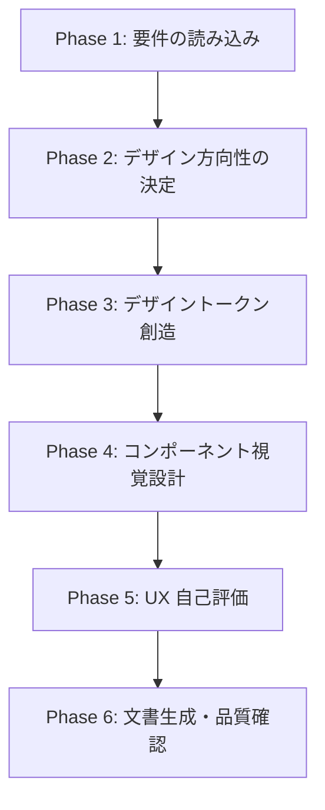

# UX/UI デザイン創造ワークフロー

## 本スキルの位置づけ

```
start-requirements → start-uxui-design → start-design → start-plan → start-implement
 (何を作るか)          (どう見せるか)       (どう作るか)     (いつ作るか)   (作る)
```

**入力**: 要件定義書（ASCII アート付きの画面仕様）
**出力**: デザイントークン（THEME-xxx）+ コンポーネント視覚仕様（CMP-xxx）+ UX 評価（UXEVAL-xxx）

> **Figma デザインがある場合**: UX/UI デザインはデザイナーにより完了済みと見なす。
> `/forge:start-requirements {feature} --mode from-figma` で要件抽出に進む。
> Figma デザインの UX 品質を検証したい場合は `/forge:review uxui` を使用する。

## コンテキスト管理 [MANDATORY]

知識ベースは **`/forge:query-forge-rules`** 経由で Phase 別に取得する。全ファイルを一括読み込みしない。
サブエージェントは使用しない（Phase 2 で選択した哲学的立場を全 Phase で参照するため）。

### 常駐（SKILL.md で読み込み済み — 全 Phase で参照）

- **`design_philosophy.md`** — 統合フレームワーク（3 層モデル）。全てのデザイン判断の基盤。**常にコンテキスト内に保持する**

### Phase 別の知識取得（query-forge-rules 経由）

各 Phase の冒頭で `/forge:query-forge-rules` を呼び出し、タスクに関連する知識ベースを取得して Read する。

| Phase | query-forge-rules のタスク内容 |
|-------|-------------------------------|
| Phase 1 | 「ID 分類カタログ、仕様フォーマット」 |
| Phase 2-3 | 「HIG 原則、デザイン評価、色彩設計、タイポグラフィ」 |
| Phase 4 | 「{iOS/macOS} コンポーネント設計、プラットフォーム固有 UI パターン」 |
| Phase 6 | 「デザイントークン出力フォーマット、コンポーネント一覧テンプレート」 |

**`/forge:query-forge-rules` が利用不可の場合のフォールバック**: `${CLAUDE_PLUGIN_ROOT}/skills/start-uxui-design/docs/` 配下を Glob で探索し、Phase に必要なファイルを直接 Read する。

## 実行フロー概要



---

## Phase 1: 要件の読み込み

### 1.1 要件定義書の取得 [MANDATORY]

要件定義書が主要入力である。以下の手順で取得する:

1. **Feature 名から要件定義書を探す**:
   - `.doc_structure.yaml` のパス解決結果を使い、Feature ディレクトリ内の要件定義書を Glob で探索
   - `SCR-xxx`（画面仕様）、`CMP-xxx`（コンポーネント）、`FNC-xxx`（機能要件）、`THEME-xxx`（既存トークン）を収集

2. **要件定義書が見つからない場合**:
   ```
   要件定義書が見つかりません。
   /forge:start-requirements {feature} で要件定義書を先に作成してください。
   ```
   → スキルを終了する

3. **要件定義書を全文読み込む**

### 1.2 要件からの情報整理 [MANDATORY]

読み込んだ要件定義書から以下を整理する:

| 整理項目 | ソース |
|----------|--------|
| アプリの目的・対象ユーザー | 要件定義書の概要セクション |
| 画面構成と遷移 | SCR-xxx の一覧 |
| 各画面の ASCII アートレイアウト | SCR-xxx 内の配置図 |
| 特定済みコンポーネント | CMP-xxx の一覧 |
| 機能要件 | FNC-xxx の一覧 |

### 1.3 参考デザインの収集（任意）

AskUserQuestion で参考デザインの有無を確認する:

```
デザインの参考にしたい画像やアプリはありますか？（任意）
1. 参考画像あり  — スクリーンショットやデザイン画像のパスを指定
2. 参考 URL あり — Web ページや Dribbble 等の URL を指定
3. 参考なし      — 要件定義書と知識ベースのみで進める
```

参考デザインがある場合:

- **画像**: Read ツールで読み込み、カラーパレット・レイアウト・雰囲気を分析
- **URL**: WebFetch でページ取得、デザイン要素を分析

参考デザインは「デザイン方向性の手がかり」として使用する。逆解析やトークン抽出の対象ではない。

### 1.4 ルール文書の取得 [MANDATORY]

1. **`/doc-advisor:query-rules`** でルール文書を特定（利用可能な場合）
   - タスク内容: UX/UI デザイン創造・デザイントークン設計
   - Skill 利用不可の場合は Glob で `docs/rules/` を探索

2. 返却された文書を全文読み込み

**Skill 失敗時**: エラー内容をユーザーに報告し、指示を待つ

---

## Phase 2: デザイン方向性の決定

要件の理解と知識ベースに基づき、デザインの大方針を決定する。

### 2.1 アプリの性格分析

要件定義書のアプリ概要・対象ユーザーから、アプリの「性格」を導き出す:

| 性格タイプ | 特徴 | デザイン傾向 |
|-----------|------|-------------|
| 温かい・親しみやすい | SNS、ヘルスケア、子供向け | 丸み大、暖色系、柔らかい影 |
| モダン・洗練 | EC、ライフスタイル、フード | バランスの取れた丸み、クリーンなタイポグラフィ |
| 精密・プロフェッショナル | 金融、生産性、ビジネス | 直線的、寒色系、タイトなスペーシング |
| 大胆・エネルギッシュ | ゲーム、フィットネス、音楽 | 高コントラスト、大胆なアクセント色、ダイナミックなレイアウト |

### 2.2 デザインスタイルの提案

知識ベース（`design_philosophy.md` セクション 5）のトレンドと、アプリの性格を掛け合わせてスタイルを提案する:

```
アプリの性格: {分析結果}

デザインスタイルの提案:
A. Minimal Clean — 余白を活かしたクリーンなスタイル。コンテンツが主役
B. Soft Depth    — Glassmorphism / 柔らかい影で奥行きを表現。モダンな印象
C. Bold Contrast — 高コントラスト・大胆な色使い。エネルギッシュな印象

推奨: {A/B/C}（理由: {アプリの性格との整合性}）
```

AskUserQuestion で選択を求める。参考デザインが提供されている場合は、その雰囲気に近いスタイルを推奨に反映する。

### 2.3 カラー方向性の提案

60-30-10 ルール（`design_philosophy.md` セクション 4.1）に基づき、カラースキームの方向性を提案する:

```
カラー方向性の提案:
  基調色（60%）: {候補 2-3 色}
  補助色（30%）: {候補 2-3 色}
  強調色（10%）: {候補 2-3 色}

  Light Mode / Dark Mode 両対応で設計します。
```

AskUserQuestion で確認。ブランドカラーの指定がある場合は優先する。

### 2.4 方向性の確定 [MANDATORY]

決定したデザイン方向性のサマリーを提示し、ユーザーの承認を得る:

```
デザイン方向性サマリー:
  スタイル:   {選択結果}
  カラー:     {方向性}
  角丸:       {目安 pt}
  フォント:   {SF Pro / カスタム}
  グリッド:   8pt グリッド準拠

  この方向性でデザイントークンの作成に進みますか？
```

---

## Phase 3: デザイントークン創造

Phase 2 の方向性に基づき、具体的なデザイントークンの値を設計する。「分析・抽出」ではなく「創造・設計」である点を意識する。

### 3.1 カラーパレットの設計

#### Base Colors

60-30-10 ルールと Phase 2 のカラー方向性に基づき、具体的な HEX 値を決定する。

**設計の根拠を必ず明記する**:

```
✅ 良い例: primary: #007AFF — iOS 標準の System Blue。信頼性を表現（HIG セマンティックカラー準拠）
❌ 悪い例: primary: #007AFF — 青色
```

#### Semantic Colors

- **Status 色**: success / warning / error / info
- **Button 色**: primary / secondary / tertiary / destructive
- **Text 色**: primary / secondary / tertiary / disabled
- **Surface 色**: background / card / overlay / grouped

#### Light / Dark Mode

- 両モードの値を設計する（片方だけの設計は不可）
- Dark Mode は単に色を反転させるのではなく、コントラストと可読性を個別に調整する
- Dark Mode の背景は純黒（#000000）を避け、ダークグレー（#1C1C1E）系を使用（HIG 準拠）

### 3.2 タイポグラフィの設計

プラットフォームガイドのフォント体系に基づき、タイポグラフィスケールを設計する:

- フォントファミリー（SF Pro / カスタムフォント）
- サイズスケール（largeTitle → caption2）
- ウェイトの使い分け
- 行高（line height）

**視覚階層**（`design_philosophy.md` セクション 4.2）を意識する: サイズとウェイトの差で情報の優先順位を明確にする。

### 3.3 スペーシングの設計

8pt グリッド準拠のスペーシングスケールを設計する:

```
xs:  4pt  — 密接な関連要素間
sm:  8pt  — 同一グループ内の要素間
md:  16pt — 画面端マージン、セクション内パディング
lg:  24pt — セクション間
xl:  32pt — 大きなセクション区切り
xxl: 48pt — 主要セクション区切り
```

**余白の設計**（`design_philosophy.md` セクション 4.3）: 余白はアクティブなデザイン要素。窮屈なレイアウトを避ける。

### 3.4 角丸・シャドウの設計

Phase 2 で決定したアプリの性格に合わせて角丸値を設計する（`design_philosophy.md` セクション 4.4 参照）。

### 3.5 トークン品質検証 [MANDATORY]

`design_philosophy.md` セクション 6 のチェックリストに加え、以下を検証する:

- [ ] コントラスト比: テキスト色と背景色の組み合わせが 4.5:1 以上か
- [ ] スペーシング: 8pt グリッドに準拠しているか
- [ ] カラーパレット: 60-30-10 ルールに従っているか
- [ ] タイポグラフィ: 階層が明確か（サイズ × ウェイトの組み合わせ）
- [ ] 両モード: Light / Dark 両方の値が設計されているか
- [ ] セマンティック命名: 意味のある名前が付けられているか
- [ ] 各値の設計根拠が説明できるか

### 3.6 ユーザー確認 [MANDATORY]

作成したデザイントークンの一覧を視覚的に提示し、AskUserQuestion で確認する:

```
作成したデザイントークン:
  Colors:     {色数} 色（カラーパレット表を提示）
  Typography: {バリエーション数} スタイル
  Spacing:    {スケール}
  Radius:     {バリエーション数} パターン
  Shadows:    {パターン数} パターン

  修正が必要な項目はありますか？
```

---

## Phase 4: コンポーネント視覚設計

要件定義書の ASCII アートを「かっこいいデザイン」に変換する。Phase 3 のトークンを適用し、HIG 標準に準拠した視覚仕様を定義する。

### 4.1 ASCII アートからの変換

要件定義書（SCR-xxx）の ASCII アートレイアウトを読み、各要素に対して:

1. **HIG 標準コンポーネントとの対応付け**: プラットフォームガイドの標準コンポーネント一覧と照合
2. **デザイントークンの適用**: Phase 3 で作成したトークンをどこに使うか決定
3. **視覚仕様の具体化**: サイズ、色、フォント、スペーシングを具体値で定義

#### 変換例

```
要件定義書の ASCII アート:
  ┌─────────────────────┐
  │  [戻る]  タイトル    │
  ├─────────────────────┤
  │  [商品画像]          │
  │  商品名              │
  │  価格                │
  │  [カートに追加]      │
  └─────────────────────┘

  ↓ 変換後の視覚仕様:

  NavigationBar:
    背景: surface.background (#FFFFFF)
    戻るボタン: system back chevron, color.primary (#007AFF)
    タイトル: typography.headline, Semibold 17pt, color.text.primary
  
  ProductImage:
    サイズ: 全幅, アスペクト比 4:3
    角丸: radius.lg (16pt)
    
  ProductName:
    フォント: typography.title2, Bold 22pt
    色: color.text.primary
    マージン上: spacing.md (16pt)
    
  Price:
    フォント: typography.title3, Semibold 20pt
    色: color.accent
    マージン上: spacing.sm (8pt)
    
  AddToCartButton:
    高さ: 50pt (タッチターゲット 44pt 以上)
    角丸: radius.md (12pt)
    背景: color.button.primary
    テキスト: typography.headline, Semibold 17pt, #FFFFFF
    マージン上: spacing.lg (24pt)
    マージン水平: spacing.md (16pt)
```

### 4.2 コンポーネントの命名

- **HIG 標準コンポーネント**: HIG の名前を使用（例: NavigationBar, TabBar）
- **カスタムコンポーネント**: 画面固有の具体的な名前を使用
  - ❌ 一般的: 「Card」「List」「Header」
  - ✅ 具体的: 「ProductDetailCard」「OrderHistoryList」「CafeMenuHeader」

### 4.3 状態・プロパティの定義

各コンポーネントについて、プラットフォーム固有の状態を定義する。

#### iOS 固有の状態

| 状態 | 説明 |
|------|------|
| Default | 通常表示 |
| Pressed | タッチ中 |
| Disabled | 無効化 |
| Loading | 読み込み中 |
| Selected | 選択中 |

#### macOS 固有の状態

| 状態 | 説明 |
|------|------|
| Default | 通常表示 |
| Hover | マウスオーバー |
| Pressed | クリック中 |
| Disabled | 無効化 |
| Focused | キーボードフォーカス |
| Selected | 選択中 |

### 4.4 UX ノートの付与

各コンポーネントに知識ベースに基づく UX コメントを付与する:

- **HIG 準拠**: HIG のどの原則に沿っているか
- **美学的根拠**: なぜこのデザインが「美しい」と言えるか（Norman / Rams / 研究を引用）
- **改善提案**: より良いデザインのための提案（あれば）

```
✅ 良い例: UX Note: AddToCartButton の角丸 12pt はバランス型の性格に適合（design_philosophy セクション 4.4）。
           50pt の高さは HIG 推奨 44pt を上回り十分なタッチターゲットを確保（ios_platform_guide セクション 1.1）。
           高彩度のアクセントカラーで CTA として視覚階層の最上位に位置づけ（design_philosophy セクション 4.2）。
❌ 悪い例: UX Note: ボタンは使いやすいサイズです。
```

### 4.5 ユーザー確認 [MANDATORY]

設計したコンポーネント一覧を提示し、AskUserQuestion で確認する:

```
設計した UI コンポーネント:
  標準コンポーネント:   {数} 個
  カスタムコンポーネント: {数} 個

  過不足はありませんか？デザインの調整が必要な箇所はありますか？
```

---

## Phase 5: UX 自己評価

作成したデザインシステム全体を、知識ベースに基づき多角的に評価する。

### 5.1 Don Norman 3 層チェック

`design_philosophy.md` セクション 2 に基づく:

| レベル | 評価観点 | 判定 |
|--------|---------|------|
| Visceral | 第一印象で「美しい」と感じるか | ○ / △ / × |
| Behavioral | トークンが操作性を支えているか | ○ / △ / × |
| Reflective | アプリの目的・ユーザー像と一致しているか | ○ / △ / × |

### 5.2 Dieter Rams チェック

`design_philosophy.md` セクション 3 に基づき、特に重要な 4 原則を確認:

- [ ] **控えめである**: UI がコンテンツを邪魔していないか
- [ ] **理解しやすい**: 操作方法が自明か
- [ ] **細部まで徹底する**: アライメントとスペーシングが一貫しているか
- [ ] **最小限にする**: 不要な要素はないか

### 5.3 HIG / Nielsen / Gestalt チェック

`apple_design_principles.md` に基づく評価。Phase 2 のワークフロー（旧版）と同様の評価を、**創造したデザインに対して** 実施する。

### 5.4 評価サマリーの提示 [MANDATORY]

```markdown
## UX 自己評価サマリー

### デザインの強み
- {3-5 個}

### 改善可能な点
- {重要度順に 3-5 個}

### 美学的評価
  Norman Visceral:   {○ / △ / ×}
  Norman Behavioral: {○ / △ / ×}
  Norman Reflective: {○ / △ / ×}
  HIG 適合度:        {高 / 中 / 低}
  Rams スコア:       {高 / 中 / 低}
```

AskUserQuestion で確認: 「評価結果を踏まえて、デザインの調整が必要ですか？」

---

## Phase 6: 文書生成・品質確認

### 6.1 文書ファイルの生成

テンプレートに従い、以下のファイルを生成する:

1. **デザイントークン文書** (`THEME-001_{feature}_design_tokens.md`)
   - テンプレート: `design_token_template.md`
   - Phase 3 の創造結果を構造化

2. **UI コンポーネント一覧文書** (`CMP-001_{feature}_components.md`)
   - テンプレート: `component_catalog_template.md`
   - Phase 4 の設計結果を構造化

3. **UX 評価サマリー** (`UXEVAL-001_{feature}_ux_evaluation.md`)
   - Phase 5 の評価結果をまとめた文書

**出力先**: session.yaml の `output_dir`

### 6.2 AI レビュー実施 [MANDATORY]

```
/forge:review uxui {作成ファイルパス} --auto
```

対象はこのワークフローで作成・変更したファイル（差分）のみ。

### 6.3 specs ToC 更新

`/doc-advisor:create-specs-toc` が利用可能であれば実行する。

### 6.4 commit/push 確認

`/anvil:commit` を実行して commit/push を確認する。

### 6.5 セッション削除

```bash
rm -rf {session_dir}
```

### 6.6 完了案内

```
UX/UI デザインの作成が完了しました:
  → デザイントークン:     {THEME ファイルパス}
  → コンポーネント一覧:   {CMP ファイルパス}
  → UX 評価サマリー:      {UXEVAL ファイルパス}

次のステップ:
  /forge:start-design {feature}    # 技術設計書の作成へ進む
```

---

## 対話の基本原則 [MANDATORY]

### 1. 選択肢ファースト

```
❌ 悪い例: 「どうしますか？」
✅ 良い例: 「A、B、C のどれが近いですか？」
```

### 2. 視覚的な提示

カラーパレット・レイアウト・コンポーネントはテーブル・ASCII 図で視覚的に提示する。

### 3. 設計根拠の明示

全てのデザイン判断に知識ベースからの根拠を添える:

```
✅ 良い例: 「角丸 12pt を採用。EC アプリのバランス型の性格に適合（design_philosophy セクション 4.4）。
           曲線研究により丸みは温かさを喚起し、購買意欲を促進する」
❌ 悪い例: 「角丸 12pt にしました」
```

### 4. 段階的な提示

全ての設計結果を一度に提示しない。Phase ごとにユーザー確認を挟む。

---

## アンチパターン [MANDATORY]

| パターン | 問題 | 対策 |
|---------|------|------|
| **根拠なきデザイン** | 「なぜこの色？」に答えられない | 必ず理論的根拠を明記 |
| **トレンド偏重** | 1 年で古くなる | Rams 原則「長持ちする」を意識 |
| **プラットフォーム混同** | iOS に macOS のパターンを適用 | プラットフォームガイドを厳守 |
| **過剰装飾** | 美しいが使いにくい | Rams 原則「控えめ」「最小限」 |
| **一般名の使用** | 曖昧 | コンポーネント名は画面固有の具体名 |
| **HEX 値なしの色指定** | 再現不可 | 必ず具体的な HEX 値を決定する |
| **片モード設計** | Dark Mode が未定義 | Light / Dark 両方を必ず設計する |
